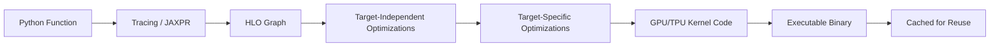

# 🏷️ JAX Fundamentals — jit, vmap, grad, and XLA

## 🎯 Learning Objectives
- Understand **XLA (Accelerated Linear Algebra)** as JAX's compilation backend and secret weapon
- Master `jax.jit` for just-in-time compilation and the **trace-vs-execute** model
- Leverage `jax.vmap` for **automatic vectorization** without writing batch loops
- Differentiate any Python function with `jax.grad` using **functional autodiff**
- Scale across devices with `jax.pmap` for **SPMD (Single Program Multiple Data)**
- Grasp the **composability** of transformations: `grad(jit(vmap(f)))` works

## Introduction

JAX is **not** a deep learning framework. This is the most important sentence in this entire module, and it bears repeating until it becomes second nature. JAX is a **numerical computing framework** built around four composable program transformations — `jit`, `vmap`, `grad`, and `pmap` — that happen to be extraordinarily useful for deep learning. PyTorch and TensorFlow are opinionated about how you build and train neural networks; JAX is opinionated only about **how computation happens**. The neural network libraries (Flax, Haiku, Equinox) are built *on top* of these primitives, not integrated into them.

Understanding this distinction explains everything that feels "weird" about JAX coming from PyTorch. Why are arrays immutable? Because `jit` needs to reason about your entire function without worrying about side effects. Why do you need explicit PRNG keys? Because `vmap` parallelizes by splitting computation — if random state were global, parallel instances would produce identical "random" numbers. Why doesn't `model(x)` work like PyTorch? Because `grad` needs to know which values are parameters and which are inputs. Each design decision flows directly from the four transformation primitives and their composability requirement.

In this note, we'll unpack each of the four core transformations, understand XLA as the compilation engine that makes them possible, and see how their composability creates patterns impossible in eager-mode frameworks. By the end, you'll understand why DeepMind can train Gemini on 6144 TPU cores with essentially the **same code** that runs on a single GPU — the transformations compose, and XLA handles the rest. This is the foundation; everything else in JAX builds on these four pillars.

---

## 1. XLA — Accelerated Linear Algebra — JAX's Secret Weapon

### 1.1 What XLA Is and Why It Matters

XLA (Accelerated Linear Algebra) is a **domain-specific compiler** developed by Google that optimizes linear algebra computations. It was originally built for TensorFlow but was separated into an independent project (OpenXLA) and serves as JAX's compilation backend. XLA operates on a program representation called **HLO (High-Level Optimizer)**, which is an intermediate representation (IR) designed specifically for machine learning computations.

The key insight: when you write Python code with `jax.numpy`, you're not writing an execution plan — you're writing a **specification** of computation. JAX traces this specification into an HLO graph, XLA optimizes it, and then generates machine code for your specific hardware accelerator. Think of it as: **Python → JAX primitives → HLO IR → XLA optimizations → GPU/TPU machine code**.

```
Python (jax.numpy) → JAX tracing → HLO graph → XLA fusion & optimization → GPU/TPU kernels
```

### 1.2 Operation Fusion — The Core Optimization

XLA's most important optimization is **operation fusion**. In eager-mode frameworks like PyTorch, each operation is a separate GPU kernel launch:

```python
# PyTorch eager: 4 separate kernel launches
y = torch.sin(x)        # Kernel 1
z = y * 2               # Kernel 2
w = z + bias            # Kernel 3
out = torch.relu(w)     # Kernel 4
```

XLA fuses these into a **single kernel launch**, eliminating intermediate memory reads/writes:

In LaTeX notation, the fused computation is:

$$f(x, \text{bias}) = \text{ReLU}(2 \cdot \sin(x) + \text{bias})$$

The HLO graph for this would have 4 nodes, but XLA's fusion pass detects that `sin`, `multiply`, `add`, and `relu` are all element-wise operations that can be fused into one loop nest:

$$\text{FusedKernel}(x_i, b_i) = \max(0, 2 \cdot \sin(x_i) + b_i) \quad \forall i \in \text{indices}$$

> **💡 Tip:** Fused kernels are most impactful for element-wise operations. Matrix multiplications and convolutions use highly optimized vendor libraries (cuBLAS, cuDNN) that XLA can't further optimize — but XLA *can* fuse the operations around them (e.g., bias addition + activation after a matmul).

### 1.3 XLA Compilation Pipeline



1. **Tracing**: JAX executes your function with abstract tracer values to build a JAXPR (JAX Program Representation)
2. **HLO Generation**: JAXPR is lowered to HLO — a static computation graph with fixed shapes and dtypes
3. **Target-Independent Optimizations**: Common subexpression elimination, dead code elimination, constant folding, algebraic simplification
4. **Target-Specific Optimizations**: Layout assignment (NCHW vs NHWC for convolutions), fusion heuristics tuned for GPU/TPU memory hierarchies
5. **Code Generation**: LLVM for CPU/GPU, XLA's custom backend for TPU
6. **Caching**: The compiled binary is cached by function signature — same shapes/dtypes reuse the binary

> **⚠️ Warning:** The first invocation of a jit-compiled function is slow (1–5 seconds during compilation). Subsequent calls with the same shapes are fast because the cached binary is reused. **Always warm up** your JIT functions before benchmarking!

---

## 2. jax.jit — Just-in-Time Compilation

### 2.1 How jit Works

`jax.jit` traces your Python function into JAXPR, lowers to HLO, compiles via XLA, and returns a callable that executes the compiled code. The first call traces and compiles; subsequent calls run at native speed.

```python
import jax
import jax.numpy as jnp

@jax.jit
def compute(x):
    return jnp.sum(jnp.sin(x) ** 2 + jnp.cos(x) ** 2)

# First call: traces + compiles (slow)
x = jnp.arange(1000.0)
result = compute(x)  # ~1-5 seconds on first call

# Subsequent calls: cached compiled code (fast)
result = compute(x)  # ~microseconds
```

**What jit traces:** JAX traces the function with abstract tracer values (they carry shape/dtype but not concrete data). All Python control flow based on **traced values** must be static — conditionals on array values raise `ConcretizationTypeError`.

### 2.2 Static vs Traced Values

```python
@jax.jit
def bad_fn(x, n):
    s = 0.0
    for i in range(n):    # n is Python int → OK (static)
        if x[i] > 0:      # x[i] is traced → ConcretizationTypeError!
            s += x[i]
    return s
```

The fix: use JAX control flow (`jax.lax.cond`, `jax.lax.fori_loop`) or mark problematic args as static:

```python
@jax.jit
def bad_fn(x, n):
    s = 0.0
    for i in range(n):
        if x[i] > 0:      # ❌ x[i] is traced — ERROR
            s += x[i]
    return s

@jax.jit
def good_fn(x, n):
    return jnp.sum(jnp.where(x > 0, x, 0))  # ✅ JAX-native, no Python branching
```

> **💡 Tip:** Use `jnp.where`, `jnp.select`, `jax.lax.cond`, `jax.lax.scan`, `jax.lax.fori_loop`, and `jax.lax.while_loop` as JAX-traceable alternatives to Python control flow. They express the same logic but are compatible with tracing.

### 2.3 PyTorch Eager vs JAX Compiled — Side by Side

```python
# ❌ PyTorch: Eager execution — operations happen immediately
import torch
def pytorch_fn(x):
    y = torch.sin(x)
    z = y * 2
    w = z + 1
    print(f"Intermediate value: {w[0]}")  # Prints concrete value
    return torch.sum(w)

# ✅ JAX: Compiled execution — operations are deferred
import jax.numpy as jnp
@jax.jit
def jax_fn(x):
    y = jnp.sin(x)
    z = y * 2
    w = z + 1
    # print(f"Intermediate value: {w[0]}")  # ❌ Cannot print traced values!
    return jnp.sum(w)
```

> **¡Sorpresa!** In a JIT-compiled function, `print()` statements execute during **tracing** (first call only), not during execution. For debugging, use `jax.debug.print()` which works inside compiled code, or use `jax.disable_jit()` context manager during development.

### 2.4 The `static_argnums` Parameter

When a function argument determines the computation shape (e.g., `axis` parameter, model size), mark it as static to avoid recompilation for every value:

```python
@jax.jit
def sum_axis(x, axis):
    return jnp.sum(x, axis=axis)

# ❌ Every different `axis` value triggers a fresh compilation
# ✅ Fix: mark axis as static
@jax.jit
def sum_axis_fixed(x, axis):
    return jnp.sum(x, axis=axis)

sum_axis_jit = jax.jit(sum_axis, static_argnums=(1,))
```

> **⚠️ Warning:** `static_argnums` prevents recompilation for varying static args **within a single program**, but callers passing different values will still trigger recompilation because the trace changes. Use sparingly — prefer making static args truly static (constants or Python-level scalars).

---

## 3. jax.vmap — Automatic Vectorization

### 3.1 Eliminating Batch Loops

`jax.vmap` transforms a function that operates on a single example into one that operates on a batch. Instead of writing `for` loops over batch dimensions, you express the per-example logic and `vmap` handles batching automatically.

```python
def single_predict(params, x):       # Operates on a single input vector
    return jnp.dot(params, x)

# Without vmap: explicit loop
def batch_predict_loop(params, batch):
    return jnp.stack([single_predict(params, x) for x in batch])

# With vmap: automatic vectorization
batch_predict = jax.vmap(single_predict, in_axes=(None, 0))
# in_axes=(None, 0) means: params is NOT batched, batch is batched along axis 0
```

Mathematically, if $f(x)$ processes a single vector, then $\text{vmap}(f, \text{in_axes}=0)$ processes a matrix $X \in \mathbb{R}^{B \times D}$:

$$\text{vmap}(f)(X) = \begin{bmatrix} f(X_{1,:}) \\ f(X_{2,:}) \\ \vdots \\ f(X_{B,:}) \end{bmatrix}$$

### 3.2 The in_axes and out_axes Parameters

`in_axes` specifies which axis of each input is the batch axis. `None` means the argument is not batched (broadcast across the batch). `out_axes` specifies where the batch dimension appears in the output.

```python
@jax.vmap
def weight_norm(w):
    return w / jnp.linalg.norm(w)

# weight_norm maps over a batch of weight vectors: (B, D) → (B, D)
weights = jax.random.normal(key, (100, 64))
normalized = weight_norm(weights)  # shape: (100, 64)

# in_axes=(0, 1): arg0 batched on axis 0, arg1 batched on axis 1
@jax.vmap
def attention_scores(q, k):
    return jnp.dot(q, k)  # q: (D,), k: (D,) → scalar

# Apply to batched queries and keys: (B, D) × (D, B) → (B, B)
```

### 3.3 Nesting vmap for Multi-Dimensional Batching

You can `vmap` a `vmap`'d function to handle multiple batch dimensions:

```python
def matvec(M, v):
    return jnp.dot(M, v)         # M: (d, d), v: (d,) → (d,)

# vmapped over examples: (B, d, d) × (B, d) → (B, d)
batch_matvec = jax.vmap(matvec, in_axes=(0, 0))

# Double-vmap: batched over both examples AND ensemble members
# (E, B, d, d) × (E, B, d) → (E, B, d)
ensemble_batch_matvec = jax.vmap(batch_matvec, in_axes=(0, 0))
```

This pattern is powerful for **model ensembling**, **multi-head attention**, and **batched Jacobian computation**.

> **¡Sorpresa!** `jax.vmap(jax.grad(f))` implements **per-example gradients** — compute the gradient of the loss for each example in a batch independently. This is notoriously slow in PyTorch (requires a for loop or `torch.vmap` which is limited) but is a one-liner in JAX.

---

## 4. jax.grad — Functional Autodiff

### 4.1 Differentiating Any Python Function

`jax.grad` computes the gradient of a scalar-output function with respect to its first argument:

```python
def f(x):
    return jnp.sum(x ** 2)

dfdx = jax.grad(f)
x = jnp.array([1.0, 2.0, 3.0])
print(dfdx(x))  # [2.0, 4.0, 6.0]  = 2*x

# Verify: f(x) = sum(x²), ∂f/∂x_i = 2x_i
```

Mathematically: if $f: \mathbb{R}^n \to \mathbb{R}$, then $\nabla f(x) = \begin{bmatrix} \frac{\partial f}{\partial x_1} & \cdots & \frac{\partial f}{\partial x_n} \end{bmatrix}^T$.

`grad` uses **reverse-mode automatic differentiation** — it constructs the backward pass of the computation graph automatically. For scalar outputs, reverse-mode computes the full gradient in one backward pass.

### 4.2 Differentiating with Respect to Multiple Arguments

```python
def loss(params, x, y):
    return jnp.sum((jnp.dot(x, params) - y) ** 2)

# grad w.r.t. first argument (default)
grad_loss_params = jax.grad(loss)

# grad w.r.t. specific arguments
grad_loss_wrt_x = jax.grad(loss, argnums=1)

# grad w.r.t. multiple arguments
grad_loss_multi = jax.grad(loss, argnums=(0, 1, 2))
```

> **¡Sorpresa!** `jax.grad` only works for **scalar-output** functions. For vector-valued $f: \mathbb{R}^n \to \mathbb{R}^m$, use `jax.jacobian` or `jax.vmap(jax.grad(f))` — see Note 03 for the full treatment.

### 4.3 JAX autodiff vs PyTorch autograd

| Feature | PyTorch autograd | JAX grad |
|---------|-----------------|----------|
| Graph construction | Implicit (eager execution builds graph) | Explicit function calling |
| Backward trigger | `loss.backward()` | `grad(f)(x)` |
| Gradient storage | `.grad` attribute on tensors | Returned as explicit array |
| Higher-order | Via `create_graph=True` (clunky) | Native: `grad(grad(f))` |
| Through control flow | Records executed path | Traces all paths then picks |
| Functional purity | ❌ Side effects allowed | ✅ Pure functions only |

### 4.4 Composability: grad through jit and vmap

```python
@jax.jit
@jax.vmap
@jax.grad
def per_example_gradient(x):
    return jnp.sum(jnp.sin(x))

# grad → vmap → jit: differentiable, batched, compiled — all at once
# This pattern is the superpower of JAX
```

> **Caso real: Google DeepMind uses `jax.grad(jax.grad(f))` in meta-learning research** to compute Hessian-vector products for MAML (Model-Agnostic Meta-Learning). Implementing second-order gradients in PyTorch requires `torch.autograd.grad` with `create_graph=True` chained calls — in JAX it's a one-liner.

---

## 5. jax.pmap — Parallel Map Across Devices

### 5.1 SPMD Parallelism

`jax.pmap` implements **SPMD (Single Program, Multiple Data)** — the same function runs on every device, but each device processes a different shard of the input data. Results are gathered across devices.

```python
# 8 devices (e.g., 8 TPU cores or 8 GPUs)
devices = jax.devices()  # 8 devices

@jax.pmap
def train_step(data_shard, params):
    loss, grads = jax.value_and_grad(loss_fn)(params, data_shard)
    return grads

# data has shape (8 * B, ...) → reshaped to (8, B, ...) for pmap
sharded_data = data.reshape(8, -1, *data.shape[1:])
grads = train_step(sharded_data, params)  # Runs on 8 devices in parallel
```

### 5.2 Device Communication: psum, all_gather, pmean

```python
from jax.lax import psum, pmean

# All-reduce: sum gradients across all devices
@jax.pmap
def distributed_step(data, params):
    per_device_grads = jax.grad(loss_fn)(params, data)
    synced_grads = jax.lax.pmean(per_device_grads, axis_name='devices')
    return synced_grads
```

The `axis_name` parameter identifies the communication group — essential for model parallelism and pipeline parallelism patterns.

> **⚠️ Warning:** `pmap` expects the first axis of every argument to be the device axis (mapping to hardware). If your batch size isn't evenly divisible by the number of devices, you'll get an error. Use `jax.lax.pad` or trim the batch.

---

## 🎯 Key Takeaways
- **XLA** is JAX's compilation engine: Python → HLO graph → fused GPU/TPU kernels. Operations fused together eliminate intermediate memory reads, providing 30–60% speedup vs eager execution.
- **`jax.jit`** compiles entire functions into optimized machine code. First call traces + compiles (slow), subsequent calls run at native speed. Use `jax.debug.print()` for debugging inside compiled code.
- **`jax.vmap`** vectorizes automatically: no more manual batch loops. `vmap(grad(f))` computes per-example gradients in one line.
- **`jax.grad`** differentiates any pure Python function. Explicit (no implicit graph), composable (higher-order natively supported), and functional (returns gradients as values).
- **`jax.pmap`** scales across devices via SPMD parallelism. Combined with `jax.lax.pmean`, enables distributed training identical to single-device code.
- The four transforms **compose arbitrarily**: `grad(jit(vmap(pmap(f))))` works. This composability is JAX's superpower.
- **Immutability** is the price for these optimizations — JAX arrays never change in-place, which enables the compiler to reason about the entire program.

## 📦 Código de Compresión

```python
import jax
import jax.numpy as jnp
from functools import partial

key = jax.random.PRNGKey(42)
x = jax.random.normal(key, (1000, 10))

def loss_fn(w, x):
    return jnp.sum((jnp.dot(x, w) - 1.0) ** 2)  # f(w) = Σ(x·w - 1)²

w = jnp.zeros(10)

# Compose all 4 pillars
@partial(jax.jit, static_argnums=(1,))   # jit
@partial(jax.vmap, in_axes=(None, 0))     # vmap: batch x automatically
@jax.grad                                   # grad: differentiate
def pillar_demo(w, single_x):
    return jnp.sum((jnp.dot(single_x, w) - 1.0) ** 2)

grads = pillar_demo(w, x)                  # (1000, 10) per-example grads
print(f"Per-example gradients shape: {grads.shape}")  # (1000, 10)
avg_grad = jnp.mean(grads, axis=0)          # (10,) averaged gradient
print(f"Averaged gradient shape: {avg_grad.shape}")   # (10,)
print(f"¡Sorpresa! jit + vmap + grad composed in one line.")
# No in-place updates, no .backward(), no .grad attribute — pure functions all the way down.
```

## References
- Frostig, Johnson, Leary (2018). "Compiling ML Programs via High-Level Tracing." SysML 2018.
- XLA Documentation: https://www.tensorflow.org/xla
- JAX Quickstart: https://jax.readthedocs.io/en/latest/quickstart.html
- DeepMind (2023). "Using JAX to accelerate our research."
- [[05/03 - Deep Learning con PyTorch]]
- [[05/09 - Deep Learning with TensorFlow]]
- [[04/01 - Matemáticas para ML]]
- [[07/32 - Advanced ML Topics]]
