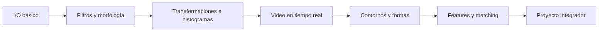

# 🖼️ Bienvenida a OpenCV

Esta carpeta contiene las notas del curso **11 - OpenCV**, parte del módulo **01 - Deep Learning y Computer Vision**.

OpenCV (Open Source Computer Vision Library) es la librería estándar de facto para visión por computadora. Escrita en C++ con bindings para Python, Java y JavaScript, contiene más de 2500 algoritmos optimizados para procesamiento de imágenes, video, geometría epipolar, calibración de cámaras, machine learning clásico y deep learning (módulo `dnn`). Su omnipresencia en producción (desde la NASA hasta sistemas embebidos en Raspberry Pi) la convierte en una habilidad obligatoria para cualquier ingeniero de CV.




---

## 📚 Índice del curso

1. [[01 - Fundamentos e I-O]]: Imagen como ndarray, color spaces, drawing, resize/crop/flip/rotate.
2. [[02 - Procesamiento de Imagen]]: Filtros (blur, Gaussian, median, bilateral), morfología, gradientes, thresholding.
3. [[03 - Transformaciones e Histogramas]]: Transformaciones afines y perspectiva, cálculo y ecualización de histogramas.
4. [[04 - Video y Camaras]]: `VideoCapture`, `VideoWriter`, procesamiento de frames, técnicas de tiempo real.
5. [[05 - Contornos y Analisis de Formas]]: `findContours`, momentos, `convexHull`, Hough lines/circles.
6. [[06 - Deteccion de Features]]: Canny, Harris, Shi-Tomasi, ORB, feature matching, homografía.
7. [[07 - Caso Practico - Sistema de Deteccion de Documentos]]: Pipeline integrado de captura → preprocesado → detección → visualización.

---

## 📖 Glosario de términos

| Término | Definición |
|---------|------------|
| **Pixel** | Unidad mínima de una imagen digital. En OpenCV se almacena como `uint8` (0-255) por canal. |
| **ndarray (NumPy)** | Estructura de datos n-dimensional. Una imagen en OpenCV es un ndarray de shape `(H, W)` (grayscale) o `(H, W, 3)` (color BGR). |
| **BGR vs RGB** | OpenCV usa BGR por defecto (orden histórico de BGR en cámaras). Otras librerías (matplotlib, PIL) usan RGB. Confundirlos invierte el orden de canales. |
| **Color space** | Modelo de representación de color. OpenCV soporta BGR, RGB, HSV, HLS, Lab, grayscale y más de 150 conversiones. |
| **Kernel** | Matriz pequeña (típicamente 3x3 o 5x5) que se desliza sobre la imagen para operaciones como blur, sharpening o morfología. |
| **Convolution (cv2.filter2D)** | Operación que aplica un kernel sobre la imagen. Es la base de todos los filtros lineales. |
| **Morphological operation** | Operación basada en formas (erosión, dilatación, opening, closing) que actúa sobre regiones binarias. |
| **Thresholding** | Conversión de píxeles a binario usando un umbral. Base de la segmentación clásica. |
| **Histogram** | Distribución de intensidades en una imagen. Útil para análisis, ecualización y comparación. |
| **Contour** | Curva cerrada que conecta puntos边界 de una región binaria. Equivalente al "borde" de un objeto. |
| **Hough Transform** | Técnica para detectar formas paramétricas (líneas, círculos) en el espacio de parámetros. |
| **Feature point** | Punto distintivo de una imagen (esquina, blob) que es invariante a transformaciones geométricas y fotométricas. |
| **Descriptor** | Vector numérico que codifica la apariencia local alrededor de un feature point (SIFT, ORB, etc.). |
| **Homography** | Matriz 3x3 que mapea un plano a otro. Permite alinear imágenes, rectificar documentos y hacer realidad aumentada. |

---

## 🎯 Objetivos de aprendizaje

Al completar este curso serás capaz de:

1. Manipular imágenes como ndarrays de NumPy: leer, escribir, acceder a píxeles, regiones de interés y canales.
2. Aplicar filtros lineales y no lineales, operaciones morfológicas y técnicas de thresholding para preprocesar imágenes.
3. Realizar transformaciones geométricas (afines y de perspectiva) y analizar histogramas.
4. Capturar, procesar y escribir video desde webcam, archivos o streams IP.
5. Detectar y analizar formas mediante contornos, momentos y la transformada de Hough.
6. Detectar features (esquinas, bordes, keypoints) y emparejar imágenes con descriptores.
7. Integrar todo lo anterior en un pipeline de visión real con métricas y visualizaciones.

---

## ⚠️ Advertencia general

No intentes aprender OpenCV de forma aislada. Los módulos siguientes asumen familiaridad con:

- **NumPy**: operaciones vectorizadas, broadcasting, indexado avanzado. Si necesitas refuerzo, revisa el módulo `00 - Python Avanzado para ML`.
- **Conceptos de imagen digital**: muestreo, cuantización, aliasing.
- **Álgebra lineal básica**: multiplicación de matrices, transformaciones, eigenvalores (para entender features).

💡 **Regla mnemotécnica**: **"Carga, transforma, filtra, detecta, visualiza"** — el flujo natural de cualquier pipeline de visión. Todos los módulos siguen este arco.

---

## 📦 Código de compresión

```python
"""
Bienvenida: script de verificación de entorno para OpenCV.
Asegúrate de tener instaladas las dependencias necesarias.
"""

import importlib
import sys


def check_package(name, import_name=None):
    import_name = import_name or name
    try:
        importlib.import_module(import_name)
        print(f"[OK] {name}")
        return True
    except ImportError:
        print(f"[FALTA] {name}")
        return False


requirements = {
    "numpy": "numpy",
    "opencv-python": "cv2",
    "opencv-contrib-python": "cv2",  # incluye SIFT, SURF (no libres en algunas builds)
    "matplotlib": "matplotlib",
    "Pillow": "PIL",
    "scipy": "scipy",  # útil para algunas operaciones avanzadas
    "scikit-image": "skimage",  # alternativa/complemento
    "tqdm": "tqdm",  # barras de progreso para video
}

print("=" * 50)
print("Verificación de entorno - OpenCV")
print("=" * 50)
all_ok = all(check_package(name, imp) for name, imp in requirements.items())

if all_ok:
    import cv2
    import numpy as np
    print("\n[VERSIONES]")
    print(f"  OpenCV: {cv2.__version__}")
    print(f"  NumPy:  {np.__version__}")
    print(f"  Build info (resumido): {cv2.getBuildInformation().split(chr(10))[0]}")
    # Crea imagen dummy y verifica I/O
    img = np.zeros((100, 100, 3), dtype=np.uint8)
    img[:] = (255, 0, 0)  # BGR: azul
    cv2.imwrite("/tmp/_opencv_test.png", img)
    loaded = cv2.imread("/tmp/_opencv_test.png")
    assert loaded is not None and loaded.shape == (100, 100, 3)
    print("\n[SMOKE TEST] Lectura/escritura I/O: OK")
else:
    print("\n[ERROR] Faltan paquetes. Ejecuta:")
    print("  pip install opencv-python numpy matplotlib Pillow")
    sys.exit(1)
```

> **Nota sobre `opencv-python` vs `opencv-contrib-python`**: el segundo incluye algoritmos con patente o propietario (SIFT, SURF, contrib modules). En producción moderna se recomienda `opencv-python` headless + `opencv-contrib-python` solo si necesitas esos algoritmos específicos.

---

## 🗺️ Mapa de prerrequisitos

```
00 - Python Avanzado para ML
└─ NumPy, broadcasting, vectorización
01 - Matemáticas para ML
└─ Álgebra lineal, eigenvalues
02 - Estructuras de Datos y Algoritmos
└─ Complejidad O(n), grafos (para matching)
```

Si vienes de otro curso de visión como [[../04 - Computer Vision Avanzada/00 - Bienvenida|Computer Vision Avanzada]], este módulo cubre las bases algorítmicas que esos modelos asumen.

---

¡Comencemos con [[01 - Fundamentos e I-O|los fundamentos]]!
