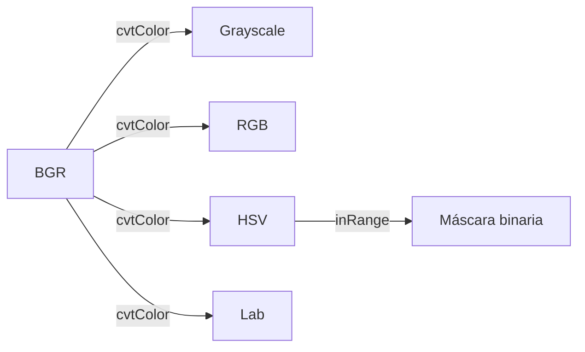

# 📂 Fundamentos e I/O

Toda imagen en OpenCV es un **ndarray de NumPy**. Este módulo cubre cómo cargar, guardar, inspeccionar y manipular imágenes a nivel de píxel. Estos cimientos son críticos: los errores más comunes en producción (canales invertidos, dtype incorrecto, ROI mal copiado) nacen de no entender la estructura interna de un `np.ndarray`.

---

## 1. La imagen como ndarray

### 1.1 Estructura interna

OpenCV representa imágenes con la convención **height, width, channels**:

```python
import cv2
import numpy as np

img_color = cv2.imread("foto.jpg")  # BGR
print(img_color.shape)  # (H, W, 3)
print(img_color.dtype)  # uint8 (0-255 por canal)
print(img_color.size)   # H * W * 3 (bytes)
```

| Tipo de imagen | Shape | dtype | Rango |
|----------------|-------|-------|-------|
| Grayscale 8-bit | `(H, W)` | `uint8` | `[0, 255]` |
| Color 8-bit (BGR/RGB) | `(H, W, 3)` | `uint8` | `[0, 255]` por canal |
| Color 16-bit | `(H, W, 3)` | `uint16` | `[0, 65535]` |
| Grayscale 32-bit (float) | `(H, W)` | `float32` | `[0.0, 1.0]` típico |
| BGRA (con alpha) | `(H, W, 4)` | `uint8` | alpha en `[0, 255]` |

💡 **Tip**: cuando una imagen viene de un modelo de deep learning, casi siempre está en `float32` con rango `[0, 1]` o normalizado (ImageNet: `mean=[0.485, 0.456, 0.406]`, `std=[0.229, 0.224, 0.225]`). La conversión entre formatos de `uint8` y `float32` es un punto de fricción frecuente.

### 1.2 Acceso a píxeles

NumPy slicing es la forma idiomática de manipular regiones:

```python
# Un píxel individual (BGR)
pixel = img[100, 200]  # (B, G, R)

# Un canal específico
blue = img[:, :, 0]
green = img[:, :, 1]
red = img[:, :, 2]

# ROI rectangular
roi = img[50:200, 100:300]  # filas 50-199, columnas 100-299

# Modificar ROI
img[0:50, 0:50] = (0, 255, 0)  # cuadrado verde en esquina superior izquierda
```

### 1.3 `cv2.split` y `cv2.merge`

Equivalentes a slicing, pero más explícitos:

```python
b, g, r = cv2.split(img)
img_merged = cv2.merge([b, g, r])

# Invertir canales (BGR <-> RGB) usando split es innecesario
img_rgb = cv2.cvtColor(img, cv2.COLOR_BGR2RGB)
```

---

## 2. Lectura y escritura de imágenes

### 2.1 `cv2.imread`

```python
img = cv2.imread("ruta.jpg")              # BGR, default
img_gray = cv2.imread("ruta.jpg", cv2.IMREAD_GRAYSCALE)
img_unchanged = cv2.imread("ruta.png", cv2.IMREAD_UNCHANGED)  # preserva alpha si existe
```

| Flag | Comportamiento |
|------|----------------|
| `cv2.IMREAD_COLOR` (1, default) | Fuerza 3 canales BGR |
| `cv2.IMREAD_GRAYSCALE` (0) | Convierte a 1 canal |
| `cv2.IMREAD_UNCHANGED` (-1) | Lee tal cual (incluye alpha) |
| `cv2.IMREAD_REDUCED_COLOR_2` | Carga a 1/2 resolución (ahorra RAM) |
| `cv2.IMREAD_REDUCED_GRAYSCALE_8` | Carga a 1/8 resolución en grayscale |

> **Advertencia**: `cv2.imread` retorna `None` si el archivo no existe o está corrupto. **Nunca asumas que la lectura fue exitosa**: compruébalo siempre.

```python
img = cv2.imread("inexistente.jpg")
assert img is not None, "No se pudo leer la imagen"
```

### 2.2 `cv2.imwrite`

```python
cv2.imwrite("salida.png", img)             # PNG sin pérdida
cv2.imwrite("salida.jpg", img,            # JPEG con calidad
            [cv2.IMWRITE_JPEG_QUALITY, 90])
cv2.imwrite("salida.webp", img,           # WebP con calidad
            [cv2.IMWRITE_WEBP_QUALITY, 80])
```

| Formato | Función de calidad | Default | Notas |
|---------|-------------------|---------|-------|
| JPEG | `IMWRITE_JPEG_QUALITY` (0-100) | 95 | Con pérdida, bueno para fotos |
| PNG | `IMWRITE_PNG_COMPRESSION` (0-9) | 3 | Sin pérdida, soporta alpha |
| WebP | `IMWRITE_WEBP_QUALITY` (0-100) | 100 | Alternativa moderna a JPEG/PNG |

### 2.3 Codificación/decodificación en memoria

Para APIs web o transmisión por red:

```python
# Codificar a bytes
_, buffer = cv2.imencode(".jpg", img, [cv2.IMWRITE_JPEG_QUALITY, 85])
jpg_bytes = buffer.tobytes()

# Decodificar desde bytes
nparr = np.frombuffer(jpg_bytes, dtype=np.uint8)
img_decoded = cv2.imdecode(nparr, cv2.IMREAD_COLOR)
```

Esto evita escribir a disco y es esencial para microservicios con FastAPI (ver [[../10 - Cloud, Infra y Backend/31 - FastAPI for ML/03 - Streaming, Background Tasks, and Real-Time Endpoints|FastAPI para ML]]).

---

## 3. Espacios de color

### 3.1 Por qué BGR y no RGB

OpenCV fue escrito originalmente por Intel usando el orden BGR por compatibilidad con hardware de cámaras de la época. Esta decisión se mantiene por compatibilidad histórica. Otros frameworks (PIL, matplotlib, scikit-image) usan RGB. La confusión BGR/RGB es la causa #1 de "imágenes con colores raros".

```python
img_rgb = cv2.cvtColor(img, cv2.COLOR_BGR2RGB)
img_gray = cv2.cvtColor(img, cv2.COLOR_BGR2GRAY)
img_hsv = cv2.cvtColor(img, cv2.COLOR_BGR2HSV)
img_lab = cv2.cvtColor(img, cv2.COLOR_BGR2Lab)
```

### 3.2 HSV: el espacio preferido para segmentación por color

HSV separa el color (Hue) de la intensidad (Value) y la saturación (Saturation), lo que lo hace robusto a cambios de iluminación:

```python
# Definir rango de color en HSV (rojo: H=0/180, S>100, V>100)
lower_red = np.array([0, 100, 100])
upper_red = np.array([10, 255, 255])
mask = cv2.inRange(img_hsv, lower_red, upper_red)
```



💡 **Tip**: si necesitas segmentar un objeto por color, **siempre trabaja en HSV** o **Lab**, no en BGR. Los rangos en BGR son muy sensibles a cambios de luz.

### 3.3 Más de 150 conversiones disponibles

`cv2.cvtColor` soporta una enorme variedad. Las más útiles:

| Código | Conversión | Uso típico |
|--------|-----------|------------|
| `COLOR_BGR2GRAY` | Color → 1 canal | Reducción de dimensionalidad, detección de bordes |
| `COLOR_BGR2HSV` | Color → HSV | Segmentación por color |
| `COLOR_BGR2Lab` | Color → Lab | Comparación perceptual de colores |
| `COLOR_BGR2YCrCb` | Color → YCrCb | Compresión de video, detección de piel |
| `COLOR_GRAY2BGR` | 1 canal → color | Visualización junto a imágenes a color |
| `COLOR_BGR2RGB` | BGR → RGB | Mostrar con matplotlib |

Lista completa en la [documentación oficial](https://docs.opencv.org/4.x/d8/d01/group__imgproc__color__conversions.html).

---

## 4. Dibujo sobre imágenes

OpenCV incluye primitivas de dibujo que se renderizan directamente sobre el ndarray:

```python
canvas = np.zeros((400, 400, 3), dtype=np.uint8)

# Línea: cv2.line(img, pt1, pt2, color, thickness)
cv2.line(canvas, (0, 0), (400, 400), (0, 255, 0), 2)

# Rectángulo: cv2.rectangle(img, pt1, pt2, color, thickness)
cv2.rectangle(canvas, (50, 50), (200, 200), (255, 0, 0), 3)
cv2.rectangle(canvas, (50, 50), (200, 200), (0, 255, 255), -1)  # thickness=-1 → relleno

# Círculo: cv2.circle(img, center, radius, color, thickness)
cv2.circle(canvas, (300, 200), 80, (0, 0, 255), -1)

# Elipse: cv2.ellipse(img, center, axes, angle, startAngle, endAngle, ...)
cv2.ellipse(canvas, (200, 300), (100, 50), 0, 0, 360, (255, 255, 0), 2)

# Polígono: cv2.polylines(img, pts, isClosed, color, thickness)
pts = np.array([[100, 50], [200, 300], [400, 200]], np.int32)
cv2.polylines(canvas, [pts], isClosed=True, color=(255, 255, 255), thickness=2)

# Texto: cv2.putText(img, text, org, fontFace, fontScale, color, thickness)
cv2.putText(canvas, "OpenCV", (50, 380),
            cv2.FONT_HERSHEY_SIMPLEX, 1.5, (255, 255, 255), 2)
```

> **Convención de colores**: OpenCV usa tuplas BGR. `(0, 0, 255)` es rojo, `(255, 0, 0)` es azul, `(0, 255, 0)` es verde.

| Función | Firma | Notas |
|---------|-------|-------|
| `cv2.line` | `(img, pt1, pt2, color, thickness=1, lineType=8, shift=0)` | `lineType=cv2.LINE_AA` para antialiasing |
| `cv2.rectangle` | `(img, pt1, pt2, color, thickness=1)` | `pt1` esquina superior izq, `pt2` inferior der |
| `cv2.circle` | `(img, center, radius, color, thickness=1)` | thickness=-1 rellena |
| `cv2.ellipse` | `(img, center, axes, angle, startAngle, endAngle, color, thickness=1)` | Ángulos en grados |
| `cv2.polylines` | `(img, pts, isClosed, color, thickness=1)` | `pts` debe ser `(N, 1, 2)` o reshape |
| `cv2.putText` | `(img, text, org, fontFace, fontScale, color, thickness=1)` | Fonts: HERSHEY_SIMPLEX, HERSHEY_PLAIN, etc. |

---

## 5. Operaciones geométricas básicas

### 5.1 Resize

```python
# Tamaño absoluto
resized = cv2.resize(img, (640, 480))  # (width, height) — nota: orden invertido a shape

# Por factor de escala
resized_half = cv2.resize(img, None, fx=0.5, fy=0.5)

# Interpolation methods
cv2.resize(img, (640, 480), interpolation=cv2.INTER_NEAREST)      # rápido, pixelado
cv2.resize(img, (640, 480), interpolation=cv2.INTER_LINEAR)      # default, balance
cv2.resize(img, (640, 480), interpolation=cv2.INTER_CUBIC)       # más lento, mejor calidad
cv2.resize(img, (640, 480), interpolation=cv2.INTER_AREA)        # mejor para downscale
cv2.resize(img, (640, 480), interpolation=cv2.INTER_LANCZOS4)    # mejor para upscale
```

| Operación | Interpolación recomendada |
|-----------|---------------------------|
| Agrandar (upscale) | `INTER_CUBIC` o `INTER_LANCZOS4` |
| Encoger (downscale) | `INTER_AREA` |
| Tiempo real (FPS crítico) | `INTER_NEAREST` o `INTER_LINEAR` |

### 5.2 Crop (es solo slicing)

```python
crop = img[y1:y2, x1:x2]
```

No hay función `cv2.crop`. El cropping es simplemente NumPy slicing y no copia memoria si asignas, pero sí copia si creas una nueva variable.

### 5.3 Flip

```python
flipped_horizontal = cv2.flip(img, 1)  # espejo horizontal
flipped_vertical = cv2.flip(img, 0)    # espejo vertical
flipped_both = cv2.flip(img, -1)       # ambos
```

> **Uso en augmentation**: el flip horizontal es la augmentación más usada en CV. Casi siempre es seguro (un gato reflejado sigue siendo un gato). El flip vertical debe usarse con cuidado en tareas con orientación (texto, dígitos).

### 5.4 Rotate

```python
# Rotación discreta 90° (preserva dimensiones)
rotated_90 = cv2.rotate(img, cv2.ROTATE_90_CLOCKWISE)
rotated_180 = cv2.rotate(img, cv2.ROTATE_180)
rotated_270 = cv2.rotate(img, cv2.ROTATE_90_COUNTERCLOCKWISE)

# Rotación arbitraria (con cv2.getRotationMatrix2D + cv2.warpAffine)
height, width = img.shape[:2]
center = (width // 2, height // 2)
angle = 30
scale = 1.0
M = cv2.getRotationMatrix2D(center, angle, scale)
rotated = cv2.warpAffine(img, M, (width, height))
```

`getRotationMatrix2D` y `warpAffine` son la antesala de las transformaciones afines que cubriremos en [[03 - Transformaciones e Histogramas|el módulo 03]].

---

## 6. Indexado booleano y enmascaramiento

NumPy te permite seleccionar píxeles que cumplen una condición:

```python
img = cv2.imread("cielo.jpg")
# Píxeles donde el canal azul es dominante
mask = img[:, :, 0] > img[:, :, 2]
img[mask] = [255, 255, 255]  # pinta esos píxeles de blanco

# Umbralizar
gray = cv2.cvtColor(img, cv2.COLOR_BGR2GRAY)
mask_bright = gray > 200
```

Este patrón es la base de umbrales vectorizados y segmentación rápida sin loops.

---

## 7. Visualización

OpenCV tiene su propio visor pero `matplotlib` es más versátil para notebooks:

```python
import matplotlib.pyplot as plt

img = cv2.imread("foto.jpg")
img_rgb = cv2.cvtColor(img, cv2.COLOR_BGR2RGB)  # matplotlib espera RGB

plt.figure(figsize=(10, 6))
plt.imshow(img_rgb)
plt.axis("off")
plt.title("Imagen en RGB")
plt.show()
```

> **Advertencia**: si olvidas `cv2.cvtColor(..., cv2.COLOR_BGR2RGB)`, matplotlib mostrará el azul y el rojo invertidos (un cielo se verá naranja). Este es un error clásico.

Para visualización interactiva con tracks/scrollbars, usa `cv2.namedWindow` + `cv2.createTrackbar`.

---

## 8. Errores comunes y cómo evitarlos

| Error | Síntoma | Solución |
|-------|---------|----------|
| Asumir que `imread` tuvo éxito | `NoneType` en operaciones posteriores | `assert img is not None` |
| Confundir `(W, H)` con `(H, W)` | Resize con dimensiones invertidas | Recuerda: `cv2.resize` usa `(width, height)` |
| Modificar `img` in-place en una función | Cambios se propagan al llamador | `img.copy()` si necesitas inmutabilidad |
| Usar `float64` en vez de `uint8` | Pantalla negra, valores truncados | `img.astype(np.uint8)` antes de `imwrite` |
| Asumir que la imagen es BGR | matplotlib muestra colores "raros" | `cvtColor(COLOR_BGR2RGB)` antes de `plt.imshow` |

---

## 9. Ejercicio integrador

Construye un script que:

1. Lee una imagen a color.
2. Convierte a grayscale y HSV.
3. Imprime `shape`, `dtype`, valores mínimo y máximo por canal.
4. Crea una imagen 300x300 con un rectángulo rojo centrado y un círculo verde inscrito.
5. La guarda como PNG, JPEG (calidad 70) y WebP.
6. Lee cada una de vuelta y compara tamaños en disco.

```python
def reporte(path: str) -> dict:
    img = cv2.imread(path)
    return {
        "shape": img.shape,
        "dtype": str(img.dtype),
        "min_per_channel": img.min(axis=(0, 1)).tolist(),
        "max_per_channel": img.max(axis=(0, 1)).tolist(),
    }
```

💡 **Siguiente paso**: en [[02 - Procesamiento de Imagen|el siguiente módulo]] aprenderás a limpiar ruido, detectar bordes y binarizar imágenes — los preprocesamientos que toda pipeline de visión necesita antes de cualquier análisis serio.
