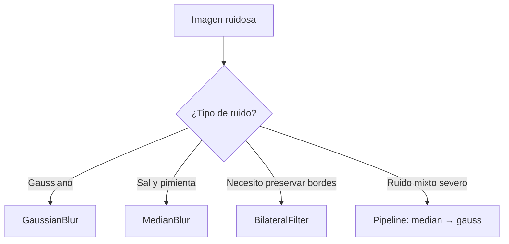
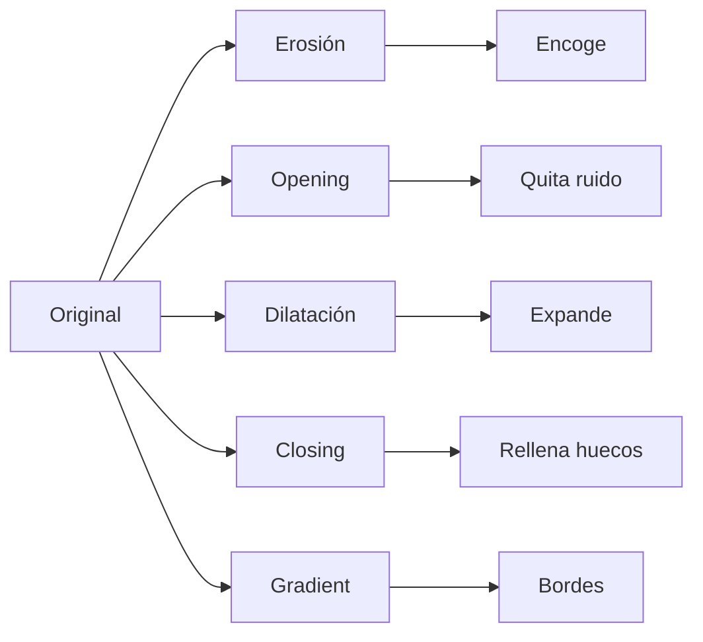
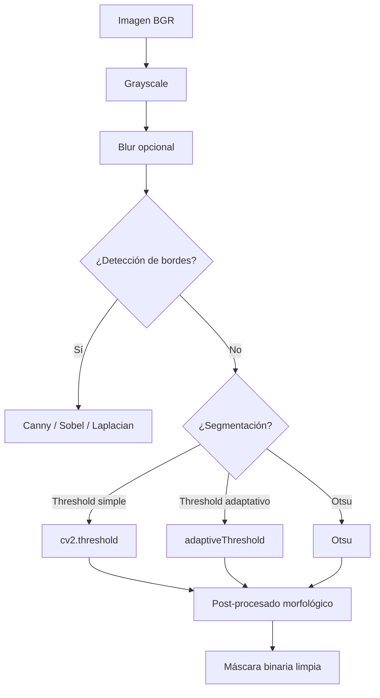

# 🧹 Procesamiento de Imagen

Este módulo cubre las operaciones que aplicas **antes** de cualquier análisis: limpiar ruido, resaltar bordes, binarizar, separar objetos. Estas técnicas son el preprocesamiento canónico de cualquier pipeline de visión clásica, y siguen siendo útiles para acelerar y robustecer modelos de deep learning (la augmentación es esencialmente procesamiento de imagen aplicado).

---

## 1. Filtros lineales: convolución 2D

### 1.1 La operación fundamental

Un filtro lineal desplaza un **kernel** (matriz pequeña) sobre la imagen y calcula la suma ponderada de los píxeles cubiertos. Esto es exactamente la operación que realiza una capa convolucional de una CNN, pero sin aprender: aquí el kernel es definido a mano.

Matemáticamente:

$$
(I * K)(i, j) = \sum_{m} \sum_{n} I(i + m, j + n) \cdot K(m, n)
$$

Donde $I$ es la imagen y $K$ es el kernel. En OpenCV:

```python
import numpy as np
import cv2

img = cv2.imread("foto.jpg")

# Kernel de sharpening
kernel_sharpen = np.array([
    [ 0, -1,  0],
    [-1,  5, -1],
    [ 0, -1,  0]
], dtype=np.float32)

sharpened = cv2.filter2D(img, -1, kernel_sharpen)
# ddepth=-1 preserva el dtype de la imagen de entrada
```

### 1.2 Kernels clásicos

| Kernel | Efecto |
|--------|--------|
| `[[0, -1, 0], [-1, 5, -1], [0, -1, 0]]` | Sharpening (realza bordes) |
| `[[1/9, 1/9, 1/9], [1/9, 1/9, 1/9], [1/9, 1/9, 1/9]]` | Box blur (promedio uniforme) |
| `[[-1, -1, -1], [-1, 8, -1], [-1, -1, -1]]` | Detección de bordes (Laplaciano discreto) |
| `[[-1, 0, 1], [-1, 0, 1], [-1, 0, 1]]` | Detección de bordes verticales (gradiente Prewitt) |
| `[[-1, -1, -1], [0, 0, 0], [1, 1, 1]]` | Detección de bordes horizontales |

> **Anatomía de un kernel detector de bordes**: la suma de los coeficientes es cero. Esto significa que en regiones uniformes el resultado es cero, y en bordes (transiciones de intensidad) el resultado es distinto de cero. Es la forma matemática de "detectar cambios".

---

## 2. Filtros de suavizado (blur)

### 2.1 Cuándo usar cada uno

| Filtro | Velocidad | Conserva bordes | Uso típico |
|--------|-----------|----------------|------------|
| `cv2.blur` (box) | Muy rápido | No | Preprocesado rápido |
| `cv2.GaussianBlur` | Rápido | Parcialmente | **Default** en la mayoría de casos |
| `cv2.medianBlur` | Medio | **Sí** | Elimina ruido sal y pimienta |
| `cv2.bilateralFilter` | Lento | **Muy bien** | Reducción de ruido preservando bordes |

### 2.2 GaussianBlur

El filtro más usado. Convoluciona con un kernel gaussiano que pondera más los píxeles cercanos:

```python
blurred = cv2.GaussianBlur(img, (5, 5), sigmaX=0)
# (5, 5) es el tamaño del kernel (debe ser impar)
# sigmaX=0 lo calcula automáticamente como 0.3*((ksize-1)*0.5 - 1) + 0.8
```

💡 **Regla práctica**: empieza con kernel 5x5 y ajusta. Kernel más grande = más blur pero más caro. Para ruido moderado, 3x3 o 5x5 suele bastar. Para ruido severo, considera `medianBlur` o `bilateralFilter`.

### 2.3 MedianBlur

Reemplaza cada píxel por la **mediana** de su vecindad. Es excelente para eliminar ruido impulsivo (sal y pimienta) porque un píxel outlier no entra en la mediana:

```python
denoised = cv2.medianBlur(img, 5)  # ksize debe ser impar
```

### 2.4 BilateralFilter

Es el filtro "mágico": suaviza preservando bordes. Para cada píxel, pondera los vecinos según dos factores: distancia espacial (como Gauss) **y** diferencia de intensidad. Píxeles con intensidad muy diferente (bordes) reciben peso casi cero, así que no se difuminan:

```python
bilateral = cv2.bilateralFilter(img, d=9, sigmaColor=75, sigmaSpace=75)
# d: diámetro de la vecindad (9 es típico, -1 usa sigmaSpace)
# sigmaColor: filtro de diferencia de color (mayor = más mezcla)
# sigmaSpace: filtro de distancia espacial (mayor = más influencia lejana)
```

> **Costo**: el bilateral es $O(N \cdot d^2)$, mucho más caro que Gauss. Para imágenes grandes en tiempo real, es prohibitivo. Úsalo solo donde la calidad lo justifique.



---

## 3. Gradientes y detección de bordes

### 3.1 Por qué detectar bordes

Los bordes son donde la intensidad cambia bruscamente. Son invariantes a iluminación global y muy informativos: la mayoría de la información semántica de una imagen está concentrada en sus bordes.

### 3.2 Operadores de gradiente

OpenCV implementa los tres operadores clásicos de primera derivada:

```python
# Sobel: derivada en x, en y, o ambas
sobel_x = cv2.Sobel(gray, cv2.CV_64F, dx=1, dy=0, ksize=3)  # bordes verticales
sobel_y = cv2.Sobel(gray, cv2.CV_64F, dx=0, dy=1, ksize=3)  # bordes horizontales
sobel_xy = cv2.Sobel(gray, cv2.CV_64F, dx=1, dy=1, ksize=3)  # magnitud combinada

# Scharr: similar a Sobel pero con mejor precisión angular
scharr_x = cv2.Scharr(gray, cv2.CV_64F, dx=1, dy=0)
scharr_y = cv2.Scharr(gray, cv2.CV_64F, dx=0, dy=1)
```

> **Por qué `cv2.CV_64F`**: usar `uint8` causa overflow en los bordes (valores > 255 se saturan). Con `float64` la derivada puede ser negativa o muy grande; luego conviertes con `cv2.convertScaleAbs`.

```python
sobel_x_abs = cv2.convertScaleAbs(sobel_x)
sobel_y_abs = cv2.convertScaleAbs(sobel_y)
sobel_combined = cv2.addWeighted(sobel_x_abs, 0.5, sobel_y_abs, 0.5, 0)
```

### 3.3 Laplaciano

Derivada de segundo orden. Detecta bordes en todas las direcciones de una sola pasada:

```python
laplacian = cv2.Laplacian(gray, cv2.CV_64F)
laplacian_abs = cv2.convertScaleAbs(laplacian)
```

### 3.4 Canny: el detector de bordes "estándar"

Canny combina los pasos anteriores en un algoritmo robusto de 4 etapas:

1. **Suavizado Gaussiano** para reducir ruido.
2. **Cálculo de gradiente** con Sobel.
3. **Non-Maximum Suppression (NMS)**: adelgaza los bordes a 1 píxel.
4. **Hysteresis thresholding**: dos umbrales (alto y bajo) para eliminar falsos bordes.

```python
edges = cv2.Canny(gray, threshold1=50, threshold2=150)
# threshold1: umbral bajo (acepta bordes débiles conectados a fuertes)
# threshold2: umbral alto (borde seguro)
```

Regla práctica para los umbrales: la proporción 1:2 o 1:3 entre bajo y alto funciona bien. Si hay mucho ruido, sube ambos.

💡 **Tip**: Canny toma una imagen **grayscale** como entrada. Si pasas BGR, falla silenciosamente o da resultados inesperados. Siempre convierte primero.


---

## 4. Thresholding (umbralización)

### 4.1 La idea

Convertir una imagen grayscale en binaria: píxeles por encima del umbral → blanco (255), por debajo → negro (0). Es el paso de segmentación más simple y la base de casi todo análisis de formas clásico.

```python
_, binary = cv2.threshold(gray, thresh=127, maxval=255, type=cv2.THRESH_BINARY)
```

### 4.2 Tipos de threshold

| Flag | Resultado |
|------|-----------|
| `cv2.THRESH_BINARY` | `pixel > t ? 255 : 0` |
| `cv2.THRESH_BINARY_INV` | Inverso |
| `cv2.THRESH_TRUNC` | `pixel > t ? t : pixel` |
| `cv2.THRESH_TOZERO` | `pixel > t ? pixel : 0` |
| `cv2.THRESH_TOZERO_INV` | Inverso |
| `cv2.THRESH_OTSU` | Calcula umbral óptimo automáticamente (usar con grayscale) |

### 4.3 Otsu: el umbral automático

Cuando no conoces la distribución de intensidades, Otsu encuentra el umbral que maximiza la varianza entre clases (bimodalidad):

```python
ret, otsu = cv2.threshold(gray, 0, 255, cv2.THRESH_BINARY + cv2.THRESH_OTSU)
print(f"Umbral óptimo: {ret}")  # OpenCV lo retorna en ret
```

> **Limitación de Otsu**: asume histograma bimodal. Si la imagen tiene iluminación desigual o múltiples regiones, Otsu falla. Para esos casos usa umbralización **adaptativa**.

### 4.4 Adaptive Thresholding

Calcula un umbral local para cada región de la imagen:

```python
adaptive = cv2.adaptiveThreshold(
    gray,
    maxValue=255,
    adaptiveMethod=cv2.ADAPTIVE_THRESH_GAUSSIAN_C,  # o MEAN_C
    thresholdType=cv2.THRESH_BINARY,
    blockSize=11,      # tamaño de la vecindad (impar)
    C=2                # constante restada al umbral local
)
```

| Método | Comportamiento |
|--------|----------------|
| `ADAPTIVE_THRESH_MEAN_C` | Umbral = media del bloque − C |
| `ADAPTIVE_THRESH_GAUSSIAN_C` | Umbral = media ponderada gaussiana − C |

> **Caso típico**: documentos escaneados con sombras. El adaptive threshold los limpia perfectamente, mientras un threshold global falla.

### 4.5 Enfoque híbrido: Otsu + post-procesado

```python
# 1) Binariza con Otsu
_, binary = cv2.threshold(gray, 0, 255, cv2.THRESH_BINARY + cv2.THRESH_OTSU)

# 2) Limpia ruido pequeño con morfología
kernel = np.ones((2, 2), np.uint8)
binary = cv2.morphologyEx(binary, cv2.MORPH_OPEN, kernel)

# 3) Rellena huecos en objetos
binary = cv2.morphologyEx(binary, cv2.MORPH_CLOSE, kernel)
```

---

## 5. Operaciones morfológicas

Las operaciones morfológicas procesan imágenes binarias basándose en la forma de un kernel (elemento estructurante). Son la "cirugía" de las máscaras binarias.

### 5.1 Elemento estructurante

```python
# Rectangular
kernel_rect = cv2.getStructuringElement(cv2.MORPH_RECT, (5, 5))

# Elíptico
kernel_ellipse = cv2.getStructuringElement(cv2.MORPH_ELLIPSE, (5, 5))

# Cruz
kernel_cross = cv2.getStructuringElement(cv2.MORPH_CROSS, (5, 5))
```

La elección del kernel importa: un kernel elíptico es isotrópico (mismo efecto en todas direcciones); un rectangular estira el efecto en horizontal/vertical.

### 5.2 Operaciones básicas

```python
kernel = np.ones((5, 5), np.uint8)

# Erosión: encoge regiones blancas (borde se come desde adentro)
eroded = cv2.erode(binary, kernel, iterations=1)

# Dilatación: expande regiones blancas
dilated = cv2.dilate(binary, kernel, iterations=1)

# Opening = erosión + dilatación: elimina ruido pequeño, conserva tamaño de objetos grandes
opened = cv2.morphologyEx(binary, cv2.MORPH_OPEN, kernel)

# Closing = dilatación + erosión: rellena huecos pequeños
closed = cv2.morphologyEx(binary, cv2.MORPH_CLOSE, kernel)

# Gradient = dilatación − erosión: extrae el borde de los objetos
gradient = cv2.morphologyEx(binary, cv2.MORPH_GRADIENT, kernel)

# Top hat = original − opening: extrae detalles brillantes pequeños
tophat = cv2.morphologyEx(binary, cv2.MORPH_TOPHAT, kernel)

# Black hat = closing − original: extrae detalles oscuros pequeños
blackhat = cv2.morphologyEx(binary, cv2.MORPH_BLACKHAT, kernel)
```



💡 **Pipeline clásico de preprocesado**: `medianBlur` → `adaptiveThreshold` → `MORPH_OPEN` (quita ruido) → `MORPH_CLOSE` (rellena huecos). Esta es la base de casi todo sistema de OCR clásico (Tesseract, por ejemplo).

---

## 6. Suavizado vs sharpening: el balance

| Operación | Cuándo |
|-----------|--------|
| **Suavizar** (blur) | Antes de detección de bordes (reduce falsos positivos por ruido) |
| **Suavizar** | Antes de resize downscale (evita aliasing) |
| **Suavizar** | En augmentation de entrenamiento (regulariza) |
| **Realzar** (sharpen) | En mejora de detalle fino (texto pequeño, texturas) |
| **Realzar** | Después de operaciones que difuminan (resize up, super-resolution) |

```python
# Pipeline típico: blur → edges
gray = cv2.cvtColor(img, cv2.COLOR_BGR2GRAY)
blurred = cv2.GaussianBlur(gray, (5, 5), 0)
edges = cv2.Canny(blurred, 50, 150)
```

---

## 7. Ejercicios

### 7.1 Comparación de filtros

Carga una imagen con ruido y aplica los 4 filtros. Compara visualmente y con métricas:

```python
from skimage.metrics import peak_signal_noise_ratio as psnr
from skimage.metrics import structural_similarity as ssim

img = cv2.imread("ruidosa.jpg")
ref = cv2.imread("original.jpg")  # si tienes ground truth

for name, filtered in [
    ("gauss_3", cv2.GaussianBlur(img, (3, 3), 0)),
    ("gauss_7", cv2.GaussianBlur(img, (7, 7), 0)),
    ("median_5", cv2.medianBlur(img, 5)),
    ("bilateral", cv2.bilateralFilter(img, 9, 75, 75)),
]:
    print(f"{name}: PSNR={psnr(ref, filtered):.2f}, SSIM={ssim(ref, filtered, channel_axis=2):.4f}")
```

### 7.2 Document scanner clásico

Implementa el preprocesamiento de un escáner de documentos:

```python
img = cv2.imread("documento.jpg")
gray = cv2.cvtColor(img, cv2.COLOR_BGR2GRAY)

# 1) Bilateral preserva el texto mientras suaviza
filtered = cv2.bilateralFilter(gray, 9, 75, 75)

# 2) Adaptive threshold
binary = cv2.adaptiveThreshold(
    filtered, 255,
    cv2.ADAPTIVE_THRESH_GAUSSIAN_C,
    cv2.THRESH_BINARY,
    21, 10
)
```

Compara el resultado con un threshold global y un Otsu: notarás cómo el adaptive gana en presencia de sombras.

### 7.3 Detector de líneas en una carretera

Aplica la secuencia canónica: grayscale → blur → Canny → morphological closing → Hough.

```python
# Lo completaremos en [[05 - Contornos y Analisis de Formas|módulo 05]]
# pero el preprocesado es idéntico al de este módulo
```

---

## 8. Resumen del flujo de preprocesado



💡 **Siguiente paso**: en [[03 - Transformaciones e Histogramas|el siguiente módulo]] veremos cómo manipular la geometría de la imagen (rotaciones, perspectiva) y cómo analizar la distribución de píxeles con histogramas. Estos son la base de la corrección geométrica y la ecualización de iluminación.
