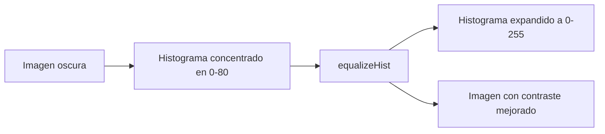
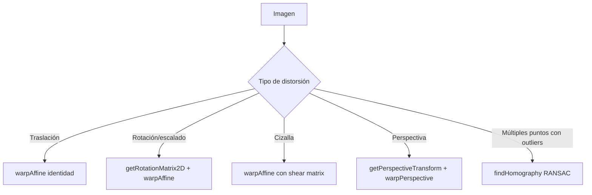

# 🔄 Transformaciones e Histogramas

Este módulo cubre dos pilares complementarios: la **manipulación geométrica** (rotación, escalado, traslación, corrección de perspectiva) y el **análisis de distribución de píxeles** (histogramas, ecualización, comparación). Ambos son prerrequisito para construir sistemas de visión robustos: la geometría corrige distorsiones, los histogramas corrigen iluminación.

---

## 1. Transformaciones afines

### 1.1 Definición matemática

Una transformación afín 2D es de la forma:

$$
\begin{bmatrix} x' \\ y' \end{bmatrix} = M \cdot \begin{bmatrix} x \\ y \end{bmatrix} + b
$$

O equivalentemente, usando coordenadas homogéneas:

$$
\begin{bmatrix} x' \\ y' \\ 1 \end{bmatrix} = \begin{bmatrix} a_{11} & a_{12} & b_1 \\ a_{21} & a_{22} & b_2 \end{bmatrix} \cdot \begin{bmatrix} x \\ y \\ 1 \end{bmatrix}
$$

La matriz $M$ tiene 6 grados de libertad (3 puntos no colineales la determinan). Las transformaciones afines preservan líneas paralelas pero no necesariamente ángulos ni distancias.

### 1.2 cv2.warpAffine

```python
import cv2
import numpy as np

img = cv2.imread("foto.jpg")
h, w = img.shape[:2]

# Traslación: M = [[1, 0, tx], [0, 1, ty]]
M_t = np.float32([[1, 0, 100], [0, 1, 50]])
translated = cv2.warpAffine(img, M_t, (w, h))

# Rotación arbitraria
M_r = cv2.getRotationMatrix2D(center=(w/2, h/2), angle=45, scale=1.0)
rotated = cv2.warpAffine(img, M_r, (w, h))
```

> **Detalle clave**: el tercer argumento de `warpAffine` es `(width, height)` — el orden invertido respecto a `shape`. Es un foot-gun clásico.

### 1.3 Tipos de transformaciones afines y sus matrices

| Transformación | Matriz (2x3) | Conserva |
|----------------|--------------|----------|
| Identidad | `[[1,0,0],[0,1,0]]` | Todo |
| Traslación | `[[1,0,tx],[0,1,ty]]` | Formas |
| Escalado | `[[sx,0,0],[0,sy,0]]` | Paralelismo |
| Rotación | `[[cos,-sin,0],[sin,cos,0]]` | Distancias |
| Shear (cizalla) | `[[1,sx,0],[sy,1,0]]` | Paralelismo |
| Genérica afín | 6 DoF | Paralelismo |

### 1.4 cv2.getAffineTransform

Si conoces 3 puntos en origen y 3 en destino, OpenCV calcula la matriz afín:

```python
src_pts = np.float32([[50, 50], [200, 50], [50, 200]])
dst_pts = np.float32([[10, 100], [200, 50], [100, 250]])

M = cv2.getAffineTransform(src_pts, dst_pts)
warped = cv2.warpAffine(img, M, (w, h))
```

Esto se usa para:
- Corregir inclinación de documentos
- Alinear imágenes tras detección de keypoints
- Data augmentation geométrica

---

## 2. Transformaciones de perspectiva (homografía)

### 2.1 Cuándo se necesita perspectiva

Las transformaciones afines son insuficientes cuando hay **perspectiva real** (objetos fotografiados en ángulo). Una transformación de perspectiva es de la forma:

$$
\begin{bmatrix} x' \\ y' \\ w' \end{bmatrix} = H \cdot \begin{bmatrix} x \\ y \\ 1 \end{bmatrix}, \quad (x', y') = (x'/w', y'/w')
$$

$H$ es una matriz 3x3 con 8 grados de libertad (se puede normalizar). Necesitas 4 puntos correspondientes para determinarla. **A diferencia de las afines, las transformaciones de perspectiva no preservan paralelismo**.

### 2.2 cv2.warpPerspective

```python
# Rectificación de un documento: pasar de trapezoidal a rectangular
src_pts = np.float32([[56, 65], [368, 52], [28, 387], [389, 390]])
dst_pts = np.float32([[0, 0], [300, 0], [0, 400], [300, 400]])

H = cv2.getPerspectiveTransform(src_pts, dst_pts)
rectified = cv2.warpPerspective(img, H, (300, 400))
```

Esto es exactamente lo que hacen apps como Adobe Scan, Microsoft Lens y la sección de "escanear documento" de Google Fotos.

### 2.3 cv2.findHomography

Si tienes muchos puntos con outliers, `findHomography` usa RANSAC para estimar la mejor homografía:

```python
src_pts = np.float32([...])  # N puntos
dst_pts = np.float32([...])  # N puntos

H, mask = cv2.findHomography(src_pts, dst_pts, cv2.RANSAC, 5.0)
# mask: boolean array, True para inliers
# 5.0: distancia máxima para considerar inlier (en píxeles)
```


💡 **Aplicación clásica**: realidad aumentada. Conocidas 4 esquinas de un marcador en la imagen, calculas $H$ y renderizas objetos virtuales en el plano del marcador usando `cv2.warpPerspective` inversa.

---

## 3. Histogramas

### 3.1 Definición

El histograma de una imagen es la distribución de intensidades de píxeles. Para grayscale, es un vector de 256 valores (uno por intensidad). Para color, puedes tener un histograma por canal o un histograma 3D.

```python
# Grayscale
gray = cv2.cvtColor(img, cv2.COLOR_BGR2GRAY)
hist = cv2.calcHist([gray], channels=[0], mask=None, histSize=[256], ranges=[0, 256])
# hist es de shape (256, 1)

# Color: un histograma por canal
colors = ("b", "g", "r")
for i, color in enumerate(colors):
    hist = cv2.calcHist([img], channels=[i], mask=None, histSize=[256], ranges=[0, 256])
```

### 3.2 Visualización

```python
import matplotlib.pyplot as plt

gray = cv2.cvtColor(img, cv2.COLOR_BGR2GRAY)
hist = cv2.calcHist([gray], [0], None, [256], [0, 256])

plt.figure(figsize=(10, 4))
plt.plot(hist, color="black")
plt.title("Histograma de imagen grayscale")
plt.xlabel("Intensidad (0-255)")
plt.ylabel("Frecuencia")
plt.xlim([0, 256])
plt.grid(True, alpha=0.3)
plt.show()
```

### 3.3 Interpretación

| Forma del histograma | Diagnóstico |
|--------------------|-------------|
| Bimodal con dos picos claros | Fondo y objeto bien diferenciados (ideal para Otsu) |
| Pico en la izquierda, cola larga | Imagen oscura (subexpuesta) |
| Pico en la derecha, cola larga | Imagen brillante (sobreexpuesta) |
| Pico central estrecho | Bajo contraste |
| Distribución uniforme | Alto contraste, bien ecualizada |
| Multimodal | Múltiples regiones o condiciones de iluminación |

### 3.4 Ecualización de histograma

Estira el histograma para usar todo el rango `[0, 255]`. Mejora contraste en imágenes oscuras o con bajo rango dinámico:

```python
equalized = cv2.equalizeHist(gray)
# Solo funciona con grayscale uint8
```

> **Limitación**: la ecualización global puede sobre-amplificar ruido en zonas oscuras. Para imágenes con iluminación desigual, usa **CLAHE** (siguiente sección).



### 3.5 CLAHE: ecualización adaptativa con límite

**Contrast Limited Adaptive Histogram Equalization** divide la imagen en teselas y ecualiza cada una localmente, limitando la amplificación del contraste para evitar ruido:

```python
clahe = cv2.createCLAHE(
    clipLimit=2.0,          # límite de amplificación de contraste
    tileGridSize=(8, 8)     # tamaño de las teselas
)
equalized = clahe.apply(gray)
```

| Parámetro | Efecto |
|-----------|--------|
| `clipLimit` mayor | Mayor contraste local, más riesgo de amplificar ruido |
| `tileGridSize` mayor | Menos teselas, efecto más global (similar a equalizeHist) |
| `tileGridSize` menor | Más local, captura detalles finos pero más sensible al ruido |

CLAHE es el algoritmo estándar para mejorar contraste en imágenes médicas,卫星 y documentos escaneados.

### 3.6 Comparación de histogramas

Para comparar dos imágenes (por ejemplo, detectar duplicados o match en retrieval):

```python
# cv2.compareHist retorna una métrica de similitud
# method: cv2.HISTCMP_CORREL, CHISQR, INTERSECT, BHATTACHARYYA
score = cv2.compareHist(hist1, hist2, cv2.HISTCMP_CORREL)
# Rango: 1.0 (idéntico) a -1.0 (anticorrelacionado) para CORREL
```

| Método | Rango | Mejor en |
|--------|-------|----------|
| `HISTCMP_CORREL` | [-1, 1] | Detectar imágenes similares globales |
| `HISTCMP_CHISQR` | [0, ∞) | Penalizar diferencias en bins poblados |
| `HISTCMP_INTERSECT` | [0, min(h1, h2)] | Magnitud de overlap |
| `HISTCMP_BHATTACHARYYA` | [0, 1] | Robusto a pequeños shifts (mejor para retrieval) |

> **Advertencia**: comparar histogramas globales pierde toda la información espacial. "Un cielo azul en la parte superior" y "un cielo azul en la parte inferior" tienen histogramas idénticos. Para comparación espacial usa [[06 - Deteccion de Features|features locales]] o histogramas por bloques (Spatial Pyramid Matching).

---

## 4. Backprojection

Si tienes un histograma de un objeto (por ejemplo, una región de color de tu mano), puedes encontrar dónde aparece ese histograma en una imagen mayor:

```python
# 1) Calcula histograma HSV de la ROI (la "plantilla")
roi_hsv = cv2.cvtColor(roi, cv2.COLOR_BGR2HSV)
roi_hist = cv2.calcHist([roi_hsv], [0, 1], None, [180, 256], [0, 180, 0, 256])
cv2.normalize(roi_hist, roi_hist, 0, 255, cv2.NORM_MINMAX)

# 2) Backprojection en la imagen completa
img_hsv = cv2.cvtColor(img, cv2.COLOR_BGR2HSV)
backproj = cv2.calcBackProject([img_hsv], [0, 1], roi_hist, [0, 180, 0, 256], scale=1)
# backproj es una imagen grayscale donde los píxeles "matching" son brillantes
```

Este es el precursor del **mean shift tracking** y del **CAMShift**, algoritmos clásicos de tracking de objetos en video.

---

## 5. Transformaciones compuestas: pipelines geométricos

En la práctica encadenas transformaciones:

```python
# Pipeline: cargar → alinear por esquinas → ecualizar iluminación
img = cv2.imread("doc.jpg")
gray = cv2.cvtColor(img, cv2.COLOR_BGR2GRAY)

# 1) Alinear (suponiendo conocidas las 4 esquinas)
src = np.float32([[56, 65], [368, 52], [28, 387], [389, 390]])
dst = np.float32([[0, 0], [400, 0], [0, 500], [400, 500]])
H = cv2.getPerspectiveTransform(src, dst)
aligned = cv2.warpPerspective(gray, H, (400, 500))

# 2) Ecualizar iluminación
clahe = cv2.createCLAHE(2.0, (8, 8))
enhanced = clahe.apply(aligned)

# 3) Umbralizar
_, binary = cv2.threshold(enhanced, 0, 255, cv2.THRESH_BINARY + cv2.THRESH_OTSU)
```

Este pipeline es el corazón de cualquier sistema de OCR robusto.

---

## 6. Errores comunes

| Error | Síntoma | Solución |
|-------|---------|----------|
| Olvidar `(width, height)` en `warpAffine` | Imagen rotada deforme | Recuerda que el flag de tamaño es `(W, H)` |
| Confundir `getRotationMatrix2D` (grados) con `cv2. Rodrigues` (radianes) | Rotación con ángulo 57x mayor | Conoce la convención de cada función |
| Ecualización de imagen en float [0, 1] | Resultado casi negro | Convierte a `uint8` o usa CLAHE sobre el rango completo |
| Comparar histogramas de imágenes con tamaños distintos | Métrica sin sentido | Normaliza histogramas con `cv2.normalize` antes |
| Asumir que `findHomography` sin RANSAC es robusto | Transformación mala con outliers | Siempre usa RANSAC para datos del mundo real |

---

## 7. Resumen de transformaciones



💡 **Siguiente paso**: en [[04 - Video y Camaras|el siguiente módulo]] aplicaremos todas estas operaciones frame a frame sobre secuencias de video. La mayoría de lo aprendido aquí (especialmente transformaciones y filtros) se vectoriza naturalmente con `cv2.VideoCapture` y `cv2.VideoWriter`.
