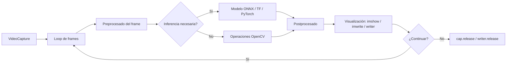

# 🎥 Video y Cámaras

Este módulo extiende todo lo aprendido al dominio temporal. Procesar video es esencialmente aplicar el mismo pipeline a cada frame, pero con desafíos propios: sincronización, latencia, rendimiento, codecs, y manejo de streams de red. OpenCV abstrae la mayoría de estos detalles con `VideoCapture` y `VideoWriter`.

---

## 1. VideoCapture: lectura de video

### 1.1 Apertura por fuente

```python
import cv2

# 1) Webcam por defecto (índice 0)
cap = cv2.VideoCapture(0)

# 2) Archivo de video
cap = cv2.VideoCapture("video.mp4")

# 3) Stream de red (RTSP, HTTP)
cap = cv2.VideoCapture("rtsp://usuario:pass@ip:554/stream")

# 4) Pipeline GStreamer (avanzado)
cap = cv2.VideoCapture("videotestsrc ! videoconvert ! appsink", cv2.CAP_GSTREAMER)
```

> **Verificación de apertura**: igual que con imágenes, `VideoCapture.isOpened()` debe ser `True` antes de usar. Una webcam ocupada por otra app o un stream caído retornan `False`.

```python
cap = cv2.VideoCapture("rtsp://...")
if not cap.isOpened():
    raise RuntimeError("No se pudo abrir el stream")
```

### 1.2 Propiedades del stream

```python
print(f"Ancho: {int(cap.get(cv2.CAP_PROP_FRAME_WIDTH))}")
print(f"Alto: {int(cap.get(cv2.CAP_PROP_FRAME_HEIGHT))}")
print(f"FPS: {cap.get(cv2.CAP_PROP_FPS)}")
print(f"Frames totales: {int(cap.get(cv2.CAP_PROP_FRAME_COUNT))}")
print(f"Codec: {int(cap.get(cv2.CAP_PROP_FOURCC))}")
print(f"Posición: {int(cap.get(cv2.CAP_PROP_POS_FRAMES))}")
```

| Propiedad | Constante | Tipo |
|-----------|-----------|------|
| Ancho | `CAP_PROP_FRAME_WIDTH` | int (settable) |
| Alto | `CAP_PROP_FRAME_HEIGHT` | int (settable) |
| FPS | `CAP_PROP_FPS` | float |
| Frames totales | `CAP_PROP_FRAME_COUNT` | int |
| Codec 4CC | `CAP_PROP_FOURCC` | int |
| Posición frame | `CAP_PROP_POS_FRAMES` | int (settable) |
| Brillo | `CAP_PROP_BRIGHTNESS` | float |
| Contraste | `CAP_PROP_CONTRAST` | float |
| Auto-focus | `CAP_PROP_AUTOFOCUS` | 0/1 (settable) |

```python
# Ajustar resolución antes de leer
cap.set(cv2.CAP_PROP_FRAME_WIDTH, 1280)
cap.set(cv2.CAP_PROP_FRAME_HEIGHT, 720)
```

> **Advertencia**: el codec FourCC se obtiene como `int`. Para convertirlo a string legible: `fourcc = int(cap.get(cv2.CAP_PROP_FOURCC)); codec = "".join([chr((fourcc >> 8 * i) & 0xFF) for i in range(4)])`.

### 1.3 Lectura de frames

```python
while True:
    ret, frame = cap.read()
    if not ret:
        break  # fin del video o error

    # Procesar frame aquí
    cv2.imshow("frame", frame)

    if cv2.waitKey(1) & 0xFF == ord("q"):
        break

cap.release()
cv2.destroyAllWindows()
```

`waitKey(1)` es **obligatorio** en alta resolución: procesa eventos de ventana y permite que el frame se renderice. Sin él, la ventana se congela. `waitKey(0)` espera indefinidamente (útil para stepping manual).

### 1.4 El patrón de skeleton canónico

```python
def procesar_video(path: str, output_path: str = None):
    cap = cv2.VideoCapture(path)
    if not cap.isOpened():
        raise RuntimeError(f"No se pudo abrir {path}")

    fps = cap.get(cv2.CAP_PROP_FPS)
    width = int(cap.get(cv2.CAP_PROP_FRAME_WIDTH))
    height = int(cap.get(cv2.CAP_PROP_FRAME_HEIGHT))

    writer = None
    if output_path:
        fourcc = cv2.VideoWriter_fourcc(*"mp4v")
        writer = cv2.VideoWriter(output_path, fourcc, fps, (width, height))

    while True:
        ret, frame = cap.read()
        if not ret:
            break

        # --- TU PIPELINE AQUÍ ---
        processed = tu_funcion(frame)
        # -----------------------

        if writer is not None:
            writer.write(processed)

        cv2.imshow("procesado", processed)
        if cv2.waitKey(1) & 0xFF == ord("q"):
            break

    cap.release()
    if writer is not None:
        writer.release()
    cv2.destroyAllWindows()
```

---

## 2. VideoWriter: escritura de video

```python
fourcc = cv2.VideoWriter_fourcc(*"mp4v")  # o "XVID", "MJPG", "H264"
writer = cv2.VideoWriter("salida.mp4", fourcc, fps=30, frameSize=(1280, 720))

# Escribir frames
for frame in frames:
    writer.write(frame)

writer.release()
```

| Codec | FourCC | Uso |
|-------|--------|-----|
| MP4V | `"mp4v"` | Compatibilidad amplia, razonable calidad |
| XVID | `"XVID"` | AVI, legacy |
| MJPG | `"MJPG"` | Motion JPEG, alto bitrate, edición fácil |
| H264 | `"H264"` | Compresión eficiente, requiere FFmpeg |
| VP09 | `"VP90"` | WebM, open source |

> **Consejo**: si el video de salida está corrupto o no se reproduce, casi siempre es un mismatch entre FPS, resolución o codec. Verifica los logs con `ffprobe`.

---

## 3. Procesamiento en tiempo real: consideraciones de rendimiento

### 3.1 El cuello de botella

Una pipeline de video típica en Python es:

```
VideoCapture.read() → preprocessing → modelo → postprocessing → VideoWriter.write() → imshow
```

El cuello de botella suele ser la inferencia del modelo, no OpenCV. Aún así, hay optimizaciones importantes:

### 3.2 Threading: separar captura de inferencia

Si la inferencia es lenta (>50ms), bloqueas la captura. La solución es usar un thread productor-consumidor:

```python
from threading import Thread
from queue import Queue
import time

class VideoStream:
    def __init__(self, src=0):
        self.cap = cv2.VideoCapture(src)
        self.q = Queue(maxsize=2)  # limitado para evitar lag
        self.stopped = False

    def start(self):
        Thread(target=self._reader, daemon=True).start()
        return self

    def _reader(self):
        while not self.stopped:
            ret, frame = self.cap.read()
            if not ret:
                self.stopped = True
                break
            if not self.q.full():
                self.q.put(frame)

    def read(self):
        return self.q.get() if not self.q.empty() else (False, None)

    def stop(self):
        self.stopped = True
        self.cap.release()
```

### 3.3 Reducir resolución y usar ROI

Procesar 1080p es ~4x más caro que 720p y ~9x más que 480p. Si tu modelo no necesita alta resolución, baja el tamaño **antes** de la inferencia:

```python
frame_small = cv2.resize(frame, None, fx=0.5, fy=0.5)
results = model(frame_small)
```

### 3.4 Saltar frames (frame skipping)

Si tu pipeline tarda 100ms por frame, procesa 1 de cada 3 (a 30fps, 10fps de inferencia):

```python
frame_id = 0
while True:
    ret, frame = cap.read()
    if not ret:
        break

    if frame_id % 3 == 0:
        # procesar
        results = model(frame)

    frame_id += 1
```

### 3.5 Backend optimization

Si compilas OpenCV con backend CUDA/DNN-CUDA, las operaciones de `cv2.dnn` aceleran 5-10x:

```python
net = cv2.dnn.readNetFromONNX("model.onnx")
net.setPreferableBackend(cv2.dnn.DNN_BACKEND_CUDA)
net.setPreferableTarget(cv2.dnn.DNN_TARGET_CUDA)
```

Para Apple Silicon, usa `cv2.dnn.DNN_BACKEND_TIMING_CACHE` o compila OpenCV con Metal.

### 3.6 FPS counter

Mide el rendimiento real de tu pipeline:

```python
import time

prev_time = time.time()
fps_display = 0
frame_count = 0

while True:
    ret, frame = cap.read()
    # ... procesar ...

    frame_count += 1
    if frame_count % 30 == 0:
        elapsed = time.time() - prev_time
        fps_display = frame_count / elapsed
        prev_time = time.time()
        frame_count = 0
        print(f"FPS: {fps_display:.1f}")

    cv2.putText(frame, f"FPS: {fps_display:.1f}", (10, 30),
                cv2.FONT_HERSHEY_SIMPLEX, 1, (0, 255, 0), 2)
```

---

## 4. Técnicas de sustracción de fondo

La sustracción de fondo es el primer paso en muchas aplicaciones de video: detección de movimiento, vigilancia, conteo de personas.

### 4.1 MOG2 y KNN

```python
back_sub = cv2.createBackgroundSubtractorMOG2(
    history=500,        # frames para modelar el fondo
    varThreshold=16,    # umbral de Mahalanobis para foreground
    detectShadows=True  # marcar sombras como gris
)

while True:
    ret, frame = cap.read()
    fg_mask = back_sub.apply(frame)
    # fg_mask: blanco (255) donde hay movimiento, negro (0) donde es fondo
```

Alternativa moderna:

```python
back_sub = cv2.createBackgroundSubtractorKNN(
    history=500,
    dist2Threshold=400.0,
    detectShadows=True
)
```

| Algoritmo | Velocidad | Calidad | Caso típico |
|-----------|-----------|---------|-------------|
| MOG2 | Rápido | Buena | Default, propósito general |
| KNN | Medio | Mejor en escenas con ruido | Vigilancia, fondos complejos |
| CNT | Muy rápido | Básica | Dispositivos embebidos |

### 4.2 Limpieza de la máscara

```python
# Quita ruido
kernel = cv2.getStructuringElement(cv2.MORPH_ELLIPSE, (3, 3))
fg_mask = cv2.morphologyEx(fg_mask, cv2.MORPH_OPEN, kernel)

# Rellena huecos
fg_mask = cv2.morphologyEx(fg_mask, cv2.MORPH_CLOSE, kernel)

# Umbral para eliminar sombras (MOG2 marca sombras como 127)
_, fg_mask = cv2.threshold(fg_mask, 200, 255, cv2.THRESH_BINARY)
```


---

## 5. Optical flow (flujo óptico)

El flujo óptico mide el movimiento de píxeles entre frames consecutivos. Es la base de tracking, estabilización de video y análisis de movimiento.

### 5.1 Farneback (flujo denso)

Calcula el flujo para cada píxel:

```python
# Lee dos frames
ret1, frame1 = cap.read()
ret2, frame2 = cap.read()

gray1 = cv2.cvtColor(frame1, cv2.COLOR_BGR2GRAY)
gray2 = cv2.cvtColor(frame2, cv2.COLOR_BGR2GRAY)

flow = cv2.calcOpticalFlowFarneback(
    gray1, gray2,
    flow=None,
    pyr_scale=0.5,    # factor de escala por nivel de pirámide
    levels=3,         # número de niveles
    winsize=15,       # tamaño de ventana de suavizado
    iterations=3,     # iteraciones por nivel
    poly_n=5,         # tamaño vecindad para polinomio
    poly_sigma=1.2,   # desviación estándar del Gaussiano
    flags=0
)
# flow.shape == (H, W, 2): dx, dy por píxel
```

### 5.2 Lucas-Kanade (flujo disperso, sparse)

Solo calcula el flujo en puntos específicos (esquinas, keypoints):

```python
feature_params = dict(
    maxCorners=100,
    qualityLevel=0.3,
    minDistance=7,
    blockSize=7
)
lk_params = dict(
    winSize=(15, 15),
    maxLevel=2,
    criteria=(cv2.TERM_CRITERIA_EPS | cv2.TERM_CRITERIA_COUNT, 10, 0.03)
)

ret, old_frame = cap.read()
old_gray = cv2.cvtColor(old_frame, cv2.COLOR_BGR2GRAY)
p0 = cv2.goodFeaturesToTrack(old_gray, mask=None, **feature_params)

while True:
    ret, frame = cap.read()
    if not ret:
        break
    frame_gray = cv2.cvtColor(frame, cv2.COLOR_BGR2GRAY)
    p1, st, err = cv2.calcOpticalFlowPyrLK(
        old_gray, frame_gray, p0, None, **lk_params
    )
    # st: 1 si el punto fue encontrado, 0 si no
```

💡 **Visualización del flujo**: convierte `flow` a HSV (ángulo → H, magnitud → S, magnitud → V) y luego a BGR para visualizarlo. Es una técnica estándar en investigación de CV.

---

## 6. Tracking de objetos con OpenCV

### 6.1 Trackers legacy (OpenCV 4.x)

```python
# Crea tracker
tracker_types = {
    "CSRT": cv2.TrackerCSRT_create,
    "KCF": cv2.TrackerKCF_create,
    "MOSSE": cv2.TrackerMOSSE_create,  # muy rápido
}
tracker = tracker_types["CSRT"]()

# Inicializa con bounding box
bbox = (x, y, w, h)
tracker.init(frame, bbox)

# Actualiza en cada frame
while True:
    ret, frame = cap.read()
    ok, bbox = tracker.update(frame)
    if ok:
        # dibuja bbox
        x, y, w, h = [int(v) for v in bbox]
        cv2.rectangle(frame, (x, y), (x + w, y + h), (0, 255, 0), 2)
```

| Tracker | Velocidad | Robustez |
|---------|-----------|----------|
| CSRT | Lento | Alta |
| KCF | Rápido | Media |
| MOSSE | Muy rápido | Baja (pero sorprendentemente bueno) |

### 6.2 TrackerCSRT vs YOLO + DeepSORT

Para producción moderna, los trackers de OpenCV son útiles en prototipos pero los sistemas reales usan detectores por frame (YOLO) + trackers de identidad (DeepSORT, ByteTrack). Los legacy trackers de OpenCV son útiles cuando:
- No hay GPU disponible
- El detector es muy caro y quieres re-detectar cada N frames
- La forma del objeto cambia significativamente (legacy trackers se adaptan mejor a deformaciones)

---

## 7. Estabilización de video

Para eliminar temblor de cámara:

```python
# Lee todos los frames (mejor con videos cortos)
frames = []
while True:
    ret, f = cap.read()
    if not ret:
        break
    frames.append(f)

# Estabilización simple: alineación por transformaciones afines
# entre frames consecutivos usando features
import cv2
orb = cv2.ORB_create(500)

prev_gray = cv2.cvtColor(frames[0], cv2.COLOR_BGR2GRAY)
transforms = [np.eye(3, dtype=np.float32)[:2]]  # identidad para el primer frame

for i in range(1, len(frames)):
    curr_gray = cv2.cvtColor(frames[i], cv2.COLOR_BGR2GRAY)
    kp1, des1 = orb.detectAndCompute(prev_gray, None)
    kp2, des2 = orb.detectAndCompute(curr_gray, None)

    matcher = cv2.BFMatcher(cv2.NORM_HAMMING, crossCheck=True)
    matches = matcher.match(des1, des2)
    matches = sorted(matches, key=lambda m: m.distance)[:50]

    src_pts = np.float32([kp1[m.queryIdx].pt for m in matches]).reshape(-1, 1, 2)
    dst_pts = np.float32([kp2[m.trainIdx].pt for m in matches]).reshape(-1, 1, 2)

    M, _ = cv2.estimateAffine2D(dst_pts, src_pts)
    transforms.append(M)
    prev_gray = curr_gray

# Suavizar trayectorias con moving average
trajectory = np.cumsum(transforms, axis=0)
smoothed_trajectory = ...  # moving average
difference = smoothed_trajectory - trajectory
transforms_smooth = transforms + difference

# Aplicar
for i, (frame, M) in enumerate(zip(frames, transforms_smooth)):
    stabilized = cv2.warpAffine(frame, M, (frame.shape[1], frame.shape[0]))
    # escribir
```

Para estabilización robusta en producción, considera `vid.stab` (librería externa) o FFmpeg con filtro `vidstabdetect`/`vidstabtransform`.

---

## 8. Errores comunes

| Error | Síntoma | Solución |
|-------|---------|----------|
| Olvidar `cap.release()` | Webcam queda bloqueada para otros procesos | Usa `with` o try/finally |
| `waitKey(0)` en loop infinito | App se congela | Usa `waitKey(1)` o mayor para FPS real |
| Mismatch de resolución entre captura y writer | Video vacío o corrupto | Verifica `frame.shape` antes de escribir |
| Mismatch de FPS | Video se reproduce a velocidad incorrecta | Lee `CAP_PROP_FPS` antes de crear el writer |
| `cv2.imshow` en headless server | Crash por falta de display | Usa `cv2.imwrite` o compila OpenCV headless |
| Capturar con índice > 0 sin verificar | `False` silencioso | Itera `range(0, 5)` y verifica `isOpened()` |

---

## 9. Resumen de flujo de video



💡 **Siguiente paso**: en [[05 - Contornos y Analisis de Formas|el siguiente módulo]] pasamos del procesamiento frame-a-frame al **análisis de contenido**: detectar formas, medir tamaños, contar objetos. Estas técnicas convierten píxeles en entidades semánticas.
