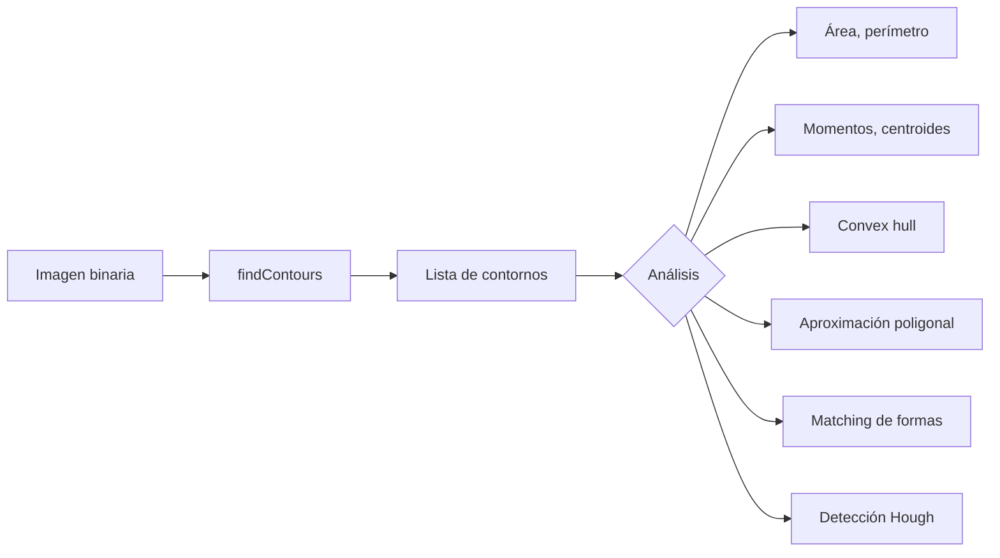
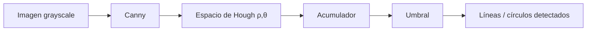
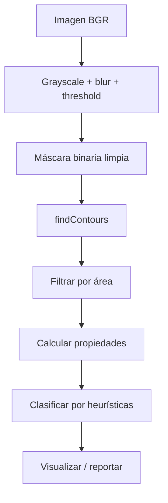

# 📐 Contornos y Análisis de Formas

Una vez que tienes una imagen binaria limpia (gracias al preprocesado del [[02 - Procesamiento de Imagen|módulo 02]]), el siguiente paso es **extraer y analizar formas**: contornos, momentos, líneas, círculos. Estas técnicas son la base de sistemas de medición, control de calidad, OCR clásico y robótica, y siguen siendo sorprendentemente útiles incluso en la era del deep learning.

---

## 1. ¿Qué es un contorno?

Un contorno es una curva que conecta puntos contiguos que comparten la misma intensidad (en imágenes binarias: píxeles blancos). Es el equivalente discreto del "borde" de un objeto en una imagen.

💡 **Diferencia clave con Canny**: Canny detecta bordes en imágenes grayscale (transiciones de intensidad). `findContours` extrae curvas cerradas en imágenes binarias (regiones blancas rodeadas de negro). Son complementarios, no intercambiables.

---

## 2. `cv2.findContours`

### 2.1 Uso básico

```python
import cv2
import numpy as np

img = cv2.imread("objetos.png")
gray = cv2.cvtColor(img, cv2.COLOR_BGR2GRAY)
_, binary = cv2.threshold(gray, 127, 255, cv2.THRESH_BINARY)

# OpenCV 4.x retorna (contours, hierarchy)
contours, hierarchy = cv2.findContours(
    binary,
    mode=cv2.RETR_EXTERNAL,    # solo contornos externos
    method=cv2.CHAIN_APPROX_SIMPLE
)
# contours: lista de ndarrays de shape (N, 1, 2)
# hierarchy: info de relaciones padre-hijo entre contornos
```

### 2.2 Modos de recuperación

| Modo | Qué retorna |
|------|-------------|
| `RETR_EXTERNAL` | Solo contornos externos (ignora huecos internos) |
| `RETR_LIST` | Todos los contornos sin relación jerárquica |
| `RETR_CCOMP` | Dos niveles: externos y huecos |
| `RETR_TREE` | Jerarquía completa (todos los niveles, ideal para formas anidadas) |

> **Consejo**: usa `RETR_EXTERNAL` cuando solo te importan los objetos (ej: contar monedas en una foto). Usa `RETR_TREE` cuando la jerarquía importa (ej: celdas con núcleo, caracteres con huecos).

### 2.3 Métodos de aproximación

| Método | Almacenamiento |
|--------|----------------|
| `CHAIN_APPROX_NONE` | Todos los puntos del contorno (N puntos) |
| `CHAIN_APPROX_SIMPLE` | Solo puntos extremos (típicamente mucho menos) |
| `CHAIN_APPROX_TC89_L1` | Teh-Chin chain approximation algorithm (L1 norm) |
| `CHAIN_APPROX_TC89_KCOS` | Teh-Chin chain approximation algorithm (KCOS norm) |

`CHAIN_APPROX_SIMPLE` es casi siempre la elección correcta: comprime segmentos colineales a sus endpoints, reduciendo memoria 5-10x sin perder información visual.

```python
# Comparación de almacenamiento
contours_none, _ = cv2.findContours(binary, cv2.RETR_EXTERNAL, cv2.CHAIN_APPROX_NONE)
contours_simple, _ = cv2.findContours(binary, cv2.RETR_EXTERNAL, cv2.CHAIN_APPROX_SIMPLE)
print(f"NONE: {len(contours_none[0])} puntos")
print(f"SIMPLE: {len(contours_simple[0])} puntos")
```

### 2.4 Dibujar contornos

```python
canvas = img.copy()
cv2.drawContours(canvas, contours, contourIdx=-1, color=(0, 255, 0), thickness=2)
# contourIdx=-1: dibuja todos; positivo: solo ese índice
```



---

## 3. Propiedades de contornos

### 3.1 Área

```python
area = cv2.contourArea(contour)
```

Útil para filtrar contornos pequeños (ruido) o para medir el tamaño de objetos.

### 3.2 Perímetro (arco)

```python
perimeter = cv2.arcLength(contour, closed=True)
# closed=True: el contorno es cerrado
```

### 3.3 Bounding box

```python
x, y, w, h = cv2.boundingRect(contour)
# Caja axis-aligned (paralela a los ejes)
```

### 3.4 Bounding box rotada (mínima)

```python
rect = cv2.minAreaRect(contour)
# ((center_x, center_y), (width, height), angle)
box = cv2.boxPoints(rect)  # 4 esquinas
box = np.int0(box)
```

> **Aplicación**: para estimar la orientación de un objeto (p. ej., cuánto está rotado un texto o una pieza industrial), la `minAreaRect` es la herramienta estándar.

### 3.5 Círculo mínimo envolvente

```python
(x, y), radius = cv2.minEnclosingCircle(contour)
center = (int(x), int(y))
radius = int(radius)
cv2.circle(img, center, radius, (0, 255, 0), 2)
```

### 3.6 Elipse ajustada

```python
if len(contour) >= 5:  # fitEllipse requiere al menos 5 puntos
    ellipse = cv2.fitEllipse(contour)
    cv2.ellipse(img, ellipse, (0, 255, 0), 2)
```

---

## 4. Momentos y centroides

### 4.1 Momentos de imagen

Los momentos son sumas ponderadas de píxeles que capturan la "forma" global de un objeto:

```python
M = cv2.moments(contour)
# M es un diccionario con momentos espaciales (m00, m10, m20, ...) 
# y centrales (mu20, mu11, ...), así como centrales normalizados (nu20, ...)
```

### 4.2 Centroide

```python
cx = int(M["m10"] / M["m00"])
cy = int(M["m01"] / M["m00"])
# Centro de masa del contorno
```

💡 **Truco útil**: si quieres marcar el centro de cada objeto detectado en una imagen, los momentos son O(1) por objeto (no necesitas escanear la imagen).

### 4.3 Momentos de Hu (invariantes)

Los 7 momentos de Hu son invariantes a traslación, rotación y escala. Sirven para reconocimiento de formas:

```python
hu = cv2.HuMoments(M).flatten()
# hu[0]: primer momento, más discriminativo
```

> **Advertencia**: HuMoments es invariante pero no muy discriminante. Para tareas reales, usa descriptores más ricos (HOG, features CNN) o, mejor, [[06 - Deteccion de Features|features locales]].

---

## 5. Aproximación poligonal

Reduce un contorno a un polígono con menos vértices según una tolerancia:

```python
epsilon = 0.02 * cv2.arcLength(contour, closed=True)
approx = cv2.approxPolyDP(contour, epsilon, closed=True)
# approx es un nuevo contorno con menos puntos
```

Aplicaciones clásicas:
- **4 vértices** → rectangular (detectar documentos, pantallas)
- **3 vértices** → triangular
- **>8 vértices** → forma orgánica

```python
n_vertices = len(approx)
if n_vertices == 3:
    cv2.putText(img, "Triangulo", tuple(approx[0][0]), ...)
elif n_vertices == 4:
    cv2.putText(img, "Rectangulo", tuple(approx[0][0]), ...)
```

---

## 6. Convex hull

El casco convexo es el polígono convexo más pequeño que contiene al contorno. Equivale a "envolver" el objeto con una banda elástica:

```python
hull = cv2.convexHull(contour)
cv2.drawContours(img, [hull], -1, (0, 255, 0), 2)
```

### 6.1 Convexity defects

Puntos donde el contorno se "hunde" hacia adentro del casco convexo. Útil para detectar concavidades (por ejemplo, contar dedos en un gesto de mano):

```python
hull_indices = cv2.convexHull(contour, returnPoints=False)
defects = cv2.convexityDefects(contour, hull_indices)
# defects: Nx4 con [start_idx, end_idx, far_idx, depth]

for i in range(defects.shape[0]):
    s, e, f, d = defects[i, 0]
    start = tuple(contour[s][0])
    end = tuple(contour[e][0])
    far = tuple(contour[f][0])
    if d > 1000:  # umbral de profundidad (en unidades de 256x)
        cv2.circle(img, far, 5, (0, 0, 255), -1)  # marca los huecos
```

### 6.2 Métricas de solidez

```python
solidity = area / cv2.contourArea(hull)
# 1.0: forma convexa perfecta
# <1.0: tiene concavidades
```

---

## 7. Relación de aspecto, extensión, compacidad

Estos ratios son discriminantes baratos para clasificar formas:

```python
x, y, w, h = cv2.boundingRect(contour)
aspect_ratio = float(w) / h
rect_area = w * h
extent = float(area) / rect_area        # cuánto del bounding box ocupa
equi_diameter = np.sqrt(4 * area / np.pi)  # diámetro del círculo con misma área
```

| Métrica | Uso típico |
|---------|------------|
| Aspect ratio | Clasificar formas alargadas vs compactas |
| Extent | Distinguir círculos (extent≈π/4≈0.78) de rectángulos (extent=1) |
| Equivalent diameter | Filtrar por tamaño |

---

## 8. Transformada de Hough

### 8.1 HoughLines (líneas)

Detecta líneas rectas en la imagen. La idea: cada píxel de borde vota por todas las líneas que pasan por él en el espacio de parámetros $(\rho, \theta)$:

```python
edges = cv2.Canny(gray, 50, 150)
lines = cv2.HoughLines(edges, rho=1, theta=np.pi/180, threshold=200)
# lines: (N, 1, 2) con (rho, theta)

for line in lines:
    rho, theta = line[0]
    a, b = np.cos(theta), np.sin(theta)
    x0, y0 = a * rho, b * rho
    pt1 = (int(x0 + 2000 * (-b)), int(y0 + 2000 * a))
    pt2 = (int(x0 - 2000 * (-b)), int(y0 - 2000 * a))
    cv2.line(img, pt1, pt2, (0, 0, 255), 2)
```

> **Limitación**: `HoughLines` retorna infinitas líneas, muchas redundantes. Para la práctica, usa `HoughLinesP` que retorna segmentos con endpoints.

### 8.2 HoughLinesP (segmentos)

```python
lines = cv2.HoughLinesP(
    edges,
    rho=1,
    theta=np.pi/180,
    threshold=100,
    minLineLength=50,    # longitud mínima en píxeles
    maxLineGap=10        # gap máximo para conectar segmentos
)
for line in lines:
    x1, y1, x2, y2 = line[0]
    cv2.line(img, (x1, y1), (x2, y2), (0, 0, 255), 2)
```

### 8.3 HoughCircles

```python
circles = cv2.HoughCircles(
    gray,
    cv2.HOUGH_GRADIENT,
    dp=1,                # resolución del acumulador
    minDist=20,          # distancia mínima entre centros
    param1=50,           # umbral alto de Canny
    param2=30,           # umbral del acumulador (menor = más círculos)
    minRadius=5,
    maxRadius=50
)

if circles is not None:
    circles = np.uint16(np.around(circles))
    for x, y, r in circles[0, :]:
        cv2.circle(img, (x, y), r, (0, 255, 0), 2)
        cv2.circle(img, (x, y), 2, (0, 0, 255), 3)
```



### 8.4 Cuándo Hough vs contornos

| Necesitas | Usa |
|-----------|-----|
| Líneas en imágenes ruidosas, parcialmente ocluidas | Hough |
| Formas arbitrarias con jerarquía | Contornos |
| Círculos en una foto | HoughCircles |
| Cualquier otra cosa | Contornos |

---

## 9. Shape matching

Compara dos formas usando `cv2.matchShapes`:

```python
ret = cv2.matchShapes(contour1, contour2, method, parameter)
# Retorna una métrica (menor = más similar)
# method: cv2.CONTOURS_MATCH_I1, I2, I3
```

💡 **Truco**: para identificar una forma entre un catálogo, itera sobre el catálogo y compara con `matchShapes`. El de menor métrica es el match más probable.

---

## 10. Pipeline típico de análisis de formas

```python
def analizar_formas(img_bgr: np.ndarray) -> dict:
    # 1) Preprocesar
    gray = cv2.cvtColor(img_bgr, cv2.COLOR_BGR2GRAY)
    blurred = cv2.GaussianBlur(gray, (5, 5), 0)
    _, binary = cv2.threshold(blurred, 0, 255, cv2.THRESH_BINARY + cv2.THRESH_OTSU)
    binary = cv2.morphologyEx(binary, cv2.MORPH_CLOSE, np.ones((3, 3), np.uint8))

    # 2) Extraer contornos
    contours, _ = cv2.findContours(binary, cv2.RETR_EXTERNAL, cv2.CHAIN_APPROX_SIMPLE)

    # 3) Analizar cada uno
    objects = []
    for cnt in contours:
        area = cv2.contourArea(cnt)
        if area < 100:
            continue  # filtra ruido
        perimeter = cv2.arcLength(cnt, True)
        M = cv2.moments(cnt)
        cx = int(M["m10"] / M["m00"])
        cy = int(M["m01"] / M["m00"])
        x, y, w, h = cv2.boundingRect(cnt)
        objects.append({
            "area": area,
            "perimeter": perimeter,
            "centroid": (cx, cy),
            "bbox": (x, y, w, h),
            "aspect_ratio": w / h if h > 0 else 0,
        })
    return {"objects": objects, "count": len(objects)}
```

---

## 11. Errores comunes

| Error | Síntoma | Solución |
|-------|---------|----------|
| `findContours` en imagen grayscale sin binarizar | Contornos "raros" o ninguno | Aplica threshold primero |
| Confundir `RETR_LIST` con `RETR_EXTERNAL` | Contornos duplicados por huecos | Conoce la diferencia jerárquica |
| `cv2.moments` con `m00 = 0` | División por cero en centroide | Filtra contornos con `area > 0` |
| `HoughLines` en imagen con muchos bordes | Miles de líneas redundantes | Usa `HoughLinesP` con `minLineLength` alto |
| `HoughCircles` con `param2` muy bajo | Falsos positivos masivos | Sube `param2` hasta que solo queden los reales |
| Filtrar contornos por área fija | Pierde objetos pequeños legítimos | Usa área relativa (ej: > 0.1% del área total) |

---

## 12. Resumen del flujo de análisis



💡 **Siguiente paso**: en [[06 - Deteccion de Features|el siguiente módulo]] pasamos de formas globales a **features locales**: puntos clave (keypoints) que sobreviven a cambios de escala, rotación, iluminación y oclusión. Son la base de SIFT/ORB, image stitching, realidad aumentada y 3D reconstruction.
