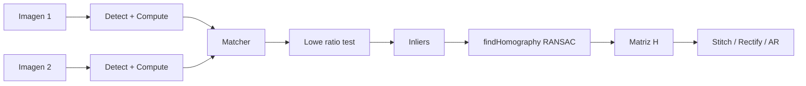
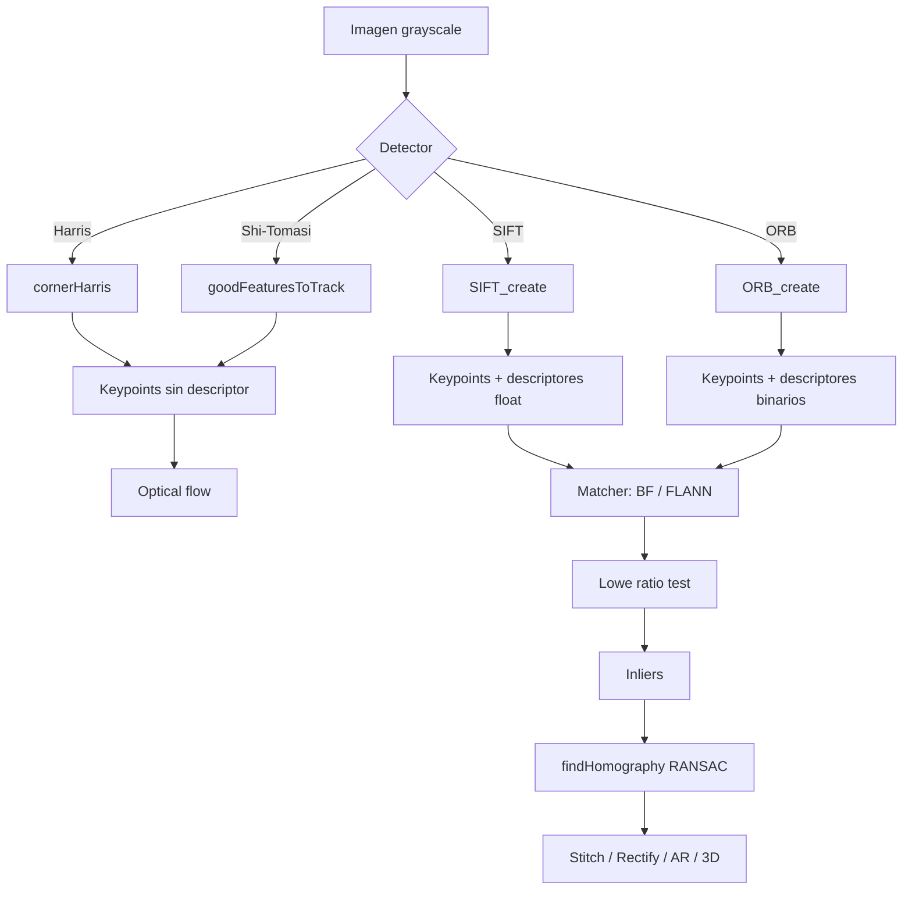

# 🔑 Detección de Features

Los **features locales** son puntos de una imagen que sobreviven a cambios de escala, rotación, iluminación parcial y oclusión. Detectarlos, describirlos y emparejarlos es la base de image stitching (panoramas), reconstrucción 3D, realidad aumentada, retrieval de imágenes y SLAM visual. Este módulo cubre los algoritmos clásicos (Harris, Shi-Tomasi, SIFT, ORB) y cómo combinarlos para resolver problemas reales.

---

## 1. ¿Qué es un feature point?

Un feature point (o keypoint) es una ubicación en la imagen que es:

| Propiedad | Significado |
|-----------|-------------|
| **Distintivo** | El vecindario tiene apariencia única (no ambiguo) |
| **Repetible** | Se detecta en la misma ubicación pese a cambios de escala/rotación/luz |
| **Localizable** | Tiene una posición precisa (subpixel) |
| **Invariante** | Su descriptor es robusto a transformaciones geométricas y fotométricas |

Ejemplos típicos: esquinas de edificios, intersecciones de líneas, blobs con contraste fuerte, marcas fiduciales.

---

## 2. Detectores de esquinas

### 2.1 Harris Corner Detector

El algoritmo clásico (1988). Idea: una esquina es un punto donde la intensidad cambia显著 en **todas** las direcciones.

Matemáticamente, en cada píxel computa la matriz de estructura del tensor:

$$
M = \sum_{(x, y) \in W} \begin{bmatrix} I_x^2 & I_x I_y \\ I_x I_y & I_y^2 \end{bmatrix}
$$

Donde $I_x, I_y$ son los gradientes en $x$ e $y$ en la ventana $W$. La respuesta de Harris es:

$$
R = \det(M) - k \cdot \text{trace}(M)^2 = \lambda_1 \lambda_2 - k (\lambda_1 + \lambda_2)^2
$$

| Condición | Interpretación |
|-----------|----------------|
| $R > 0$ grande | Esquina ($\lambda_1, \lambda_2$ ambos grandes) |
| $R < 0$ | Borde (un $\lambda$ dominante) |
| $|R|$ pequeño | Región plana |

```python
gray = cv2.cvtColor(img, cv2.COLOR_BGR2GRAY)
gray = np.float32(gray)  # Harris requiere float32

corners = cv2.cornerHarris(
    gray,
    blockSize=2,    # vecindad para el cálculo de M
    ksize=3,        # tamaño del kernel de Sobel
    k=0.04          # constante de Harris (0.04 - 0.06 típico)
)
# corners es de shape (H, W), con respuesta por píxel

# Marcar esquinas detectadas
threshold = 0.01 * corners.max()
img[corners > threshold] = [0, 0, 255]
```

💡 **Limitación**: Harris detecta esquinas a una **escala fija**. No es invariante a cambios de tamaño: un objeto que se aleja produce esquinas más débiles.

### 2.2 Shi-Tomasi (Good Features to Track)

Variante de Harris que mejora la selección:

```python
corners = cv2.goodFeaturesToTrack(
    gray,
    maxCorners=100,        # máximo número de esquinas
    qualityLevel=0.3,      # calidad mínima relativa al mejor corner
    minDistance=7,         # distancia mínima entre esquinas (Euclidean)
    blockSize=7,           # vecindad
    useHarrisDetector=False  # usa Shi-Tomasi por defecto
)
# corners: (N, 1, 2)

for corner in corners:
    x, y = corner.ravel()
    cv2.circle(img, (int(x), int(y)), 5, (0, 255, 0), -1)
```

> **Shi-Tomasi vs Harris**: Shi-Tomasi usa $\min(\lambda_1, \lambda_2)$ como métrica en vez de $\det(M) - k \cdot \text{trace}(M)^2$. Es matemáticamente más estable y selecciona esquinas "más esquinas".

---

## 3. SIFT (Scale-Invariant Feature Transform)

SIFT (Lowe, 2004) es el algoritmo que introdujo la invarianza a escala. Idea: detectar features en múltiples escalas (pirámide Gaussiana + DoG) y asignarles una orientación dominante para rotación-invarianza.

### 3.1 Detección y descripción

```python
sift = cv2.SIFT_create(
    nfeatures=0,           # 0 = sin límite
    nOctaveLayers=3,
    contrastThreshold=0.04,
    edgeThreshold=10,
    sigma=1.6
)

keypoints, descriptors = sift.detectAndCompute(gray, mask=None)
# keypoints: lista de cv2.KeyPoint con (pt, size, angle, response, octave, class_id)
# descriptors: ndarray (N, 128) — vector 128-d por keypoint
```

### 3.2 Parámetros clave

| Parámetro | Efecto |
|-----------|--------|
| `nfeatures` | Máximo de features (0 = ilimitado) |
| `contrastThreshold` | Filtra regiones de bajo contraste |
| `edgeThreshold` | Filtra bordes (que parecen esquinas en DoG) |
| `sigma` | Suavizado del nivel base de la pirámide |

### 3.3 Licencia

> **Importante**: SIFT está patentado y solo en `opencv-contrib-python`. Para uso comercial open-source, SIFT sigue siendo libre en muchas jurisdicciones, pero el algoritmo SIFT estricto fue patentado y expiró en 2020 en EE.UU. Verifica tu jurisdicción.

Alternativa libre moderna: OpenCV recomienda SIFT, ORB o KAZE/AKAZE.

---

## 4. ORB (Oriented FAST and Rotated BRIEF)

ORB (Rublee et al., 2011) es la alternativa libre, rápida y eficiente a SIFT. Combina:

- **FAST** para detectar keypoints (muy rápido)
- **BRIEF** para describirlos (binario, compacto)
- Mejoras: orientación de keypoints y rotación-invarianza del descriptor

```python
orb = cv2.ORB_create(
    nfeatures=500,
    scaleFactor=1.2,        # factor entre niveles de pirámide
    nlevels=8,              # número de niveles
    edgeThreshold=31,
    firstLevel=0,
    WTA_K=2,                # 2 puntos por BRIEF (2, 3 o 4)
    scoreType=cv2.ORB_HARRIS_SCORE,  # o cv2.ORB_FAST_SCORE
    patchSize=31,
    fastThreshold=20
)

keypoints, descriptors = orb.detectAndCompute(gray, None)
# descriptors: ndarray (N, 32) uint8 — vector binario de 32 bytes
```

| Característica | SIFT | ORB |
|----------------|------|-----|
| Tipo de descriptor | float32, 128D | binario uint8, 32D |
| Velocidad | Media | **Muy rápido** (10-100x) |
| Memoria | Alto (~512 B/keypoint) | **Bajo** (32 B/keypoint) |
| Matching | L2 (lento) | Hamming (muy rápido) |
| Invariancia rotación | Sí | Sí |
| Invariancia escala | Sí | Aproximada (pirámide) |
| Patente | Sí (expirada 2020) | No |

💡 **Regla de oro**: usa ORB por defecto. Usa SIFT cuando necesites máxima robustez (imágenes con cambios de escala extremos o muy ruidosas).

---

## 5. AKAZE y KAZE

Alternativas modernas, multi-escala y con espacio de escala no lineal (preserva mejor los bordes):

```python
akaze = cv2.AKAZE_create(
    descriptor_type=cv2.AKAZE_DESCRIPTOR_MLDB,  # o UPRIGHT
    descriptor_size=0,
    descriptor_channels=3,
    threshold=0.001
)

kaze = cv2.KAZE_create(
    extended=False,         # 64-D vs 128-D descriptor
    upright=False,          # rotación invariante
    threshold=0.001
)
```

AKAZE es más lento que ORB pero más robusto; KAZE es similar. Útil en escenas con cambios de escala grandes o donde ORB falla.

---

## 6. Feature matching

### 6.1 Brute Force Matcher

```python
# SIFT (descriptores float)
bf = cv2.BFMatcher(cv2.NORM_L2, crossCheck=True)
matches = bf.match(descriptors1, descriptors2)
# matches: lista de DMatch con (queryIdx, trainIdx, distance)

# ORB (descriptores binarios)
bf = cv2.BFMatcher(cv2.NORM_HAMMING, crossCheck=True)
matches = bf.knnMatch(descriptors1, descriptors2, k=2)
# k=2: los 2 mejores matches por descriptor
```

### 6.2 Ratio test de Lowe

Cuando haces `knnMatch(k=2)`, aplicas el test de Lowe para filtrar matches ambiguos:

```python
good = []
for m, n in matches:
    if m.distance < 0.75 * n.distance:
        good.append(m)
# m es un match "bueno" si es significativamente mejor que el segundo
```

> **Por qué funciona**: si un descriptor tiene dos matches casi iguales, es ambiguo (muchos lugares de la imagen se parecen). Si el mejor es mucho mejor que el segundo, hay un match distintivo y confiable.

### 6.3 FLANN (Fast Library for Approximate Nearest Neighbors)

Para datasets grandes, FLANN es mucho más rápido que brute force:

```python
FLANN_INDEX_KDTREE = 1
FLANN_INDEX_LSH = 6

# Para SIFT/SURF
index_params = dict(algorithm=FLANN_INDEX_KDTREE, trees=5)
search_params = dict(checks=50)  #越高越精确, más lento

# Para ORB
index_params = dict(algorithm=FLANN_INDEX_LSH,
                    table_number=6,
                    key_size=12,
                    multi_probe_level=1)
search_params = dict(checks=50)

flann = cv2.FlannBasedMatcher(index_params, search_params)
matches = flann.knnMatch(descriptors1, descriptors2, k=2)
```

### 6.4 Visualización

```python
result = cv2.drawMatches(
    img1, keypoints1, img2, keypoints2, good,
    outImg=None,
    matchColor=(0, 255, 0),
    singlePointColor=(255, 0, 0),
    flags=cv2.DrawMatchesFlags_NOT_DRAW_SINGLE_POINTS
)
```

---

## 7. Homografía a partir de matches

Dados al menos 4 matches correctos entre dos imágenes del mismo plano, puedes calcular la homografía:

```python
src_pts = np.float32([keypoints1[m.queryIdx].pt for m in good]).reshape(-1, 1, 2)
dst_pts = np.float32([keypoints2[m.trainIdx].pt for m in good]).reshape(-1, 1, 2)

H, mask = cv2.findHomography(src_pts, dst_pts, cv2.RANSAC, 5.0)
# mask: inliers (True) vs outliers (False)
```

> **Aplicaciones**:
> - **Image stitching**: une fotos en un panorama.
> - **Realidad aumentada**: calcula la pose de un marcador plano.
> - **Rectificación de documentos**: endereza fotos de documentos.



### 7.1 Validación de la homografía

```python
# Cuenta inliers
n_inliers = mask.ravel().sum()
print(f"Inliers: {n_inliers}/{len(good)} ({100 * n_inliers / len(good):.1f}%)")
if n_inliers < 10:
    print("Homografía poco confiable")
```

---

## 8. Image stitching con `cv2.Stitcher`

OpenCV incluye un stitcher de alto nivel:

```python
stitcher = cv2.Stitcher_create()
status, panorama = stitcher.stitch([img1, img2, img3])

if status == cv2.Stitcher_OK:
    cv2.imwrite("panorama.jpg", panorama)
else:
    print(f"Falló con código: {status}")
    # Errores comunes:
    # ERR_NEED_MORE_IMGS, ERR_HOMOGRAPHY_EST_FAIL, ERR_CAMERA_PARAMS_ADJUST_FAIL
```

> **Limitación**: `Stitcher` funciona bien con fotos tomadas desde el mismo punto (rotación pura). Para movimientos grandes o escenas no planas, hay que usar `cv2.detail` (más bajo nivel) o librería externa como Hugin.

---

## 9. FLANN vs BFMatcher: cuándo usar cada uno

| Escenario | Matcher |
|-----------|---------|
| < 100 features, real-time | Brute Force |
| > 1000 features, batch | FLANN |
| Descriptores binarios (ORB) | FLANN LSH o BF Hamming |
| Necesitas 100% precisión, dataset pequeño | Brute Force con `crossCheck=True` |
| Dataset enorme, velocidad crítica | FLANN con `checks` bajo |

---

## 10. Aplicaciones avanzadas (resumen)

### 10.1 Estabilización de video

Usar optical flow (Lucas-Kanade) sobre features Shi-Tomasi para suavizar movimiento.

### 10.2 SLAM visual (ORB-SLAM)

ORB features + matching temporal + bundle adjustment → mapa 3D y trayectoria de cámara.

### 10.3 Image retrieval (Bag of Visual Words)

1. Extrae features de todas las imágenes del dataset.
2. Cuantízalos con k-means para crear un "vocabulario visual".
3. Representa cada imagen como histograma de palabras visuales.
4. Matching: distancia coseno o TF-IDF.

### 10.4 Structure from Motion (SfM)

Features + matching entre múltiples vistas + triangulación → reconstrucción 3D densa. Librería open-source: OpenMVG, COLMAP.

### 10.5 Reconocimiento de objetos pre-deep learning

SIFT + Bag of Words + SVM → era el state-of-the-art antes de las CNN. Aún útil en datasets pequeños.

---

## 11. Errores comunes

| Error | Síntoma | Solución |
|-------|---------|----------|
| Aplicar ratio test de Lowe con `crossCheck=True` | Pocos matches | Usa uno u otro, no ambos |
| `cv2.SIFT_create()` en `opencv-python` (no contrib) | `AttributeError: module 'cv2' has no attribute 'SIFT_create'` | Instala `opencv-contrib-python` |
| `findHomography` sin RANSAC con muchos outliers | Transformación claramente mala | Siempre RANSAC para datos reales |
| FLANN con descriptores binarios y `algorithm=KDTREE` | Crash o resultados erráticos | Usa `FLANN_INDEX_LSH` para ORB |
| Threshold de Lowe muy alto (>0.8) | Muchos matches falsos | Mantén 0.7-0.8 como rango sano |
| Threshold de Lowe muy bajo (<0.5) | Casi ningún match | Sube hasta 0.7 si pierdes matches |

---

## 12. Resumen de features



💡 **Siguiente paso**: en [[07 - Caso Practico - Sistema de Deteccion de Documentos|el módulo final]] integraremos todo lo aprendido en un pipeline completo: capturar una imagen de un documento, detectar sus esquinas, rectificarlo, mejorar su iluminación y exportarlo listo para OCR. Este es el caso de uso real donde OpenCV brilla incluso frente a modelos de deep learning.
