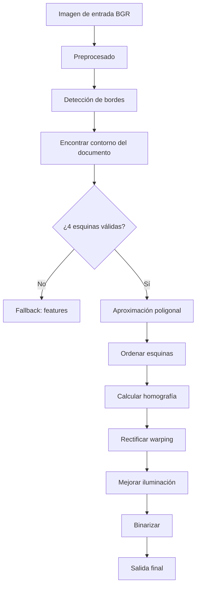

# 🏗️ Caso Práctico: Sistema de Detección y Rectificación de Documentos

Este módulo integra todo lo aprendido en un pipeline real y completo. El objetivo: dada una foto de un documento tomada con un teléfono (perspectiva, iluminación desigual, posible oclusión parcial), producir una imagen "escaneada" lista para OCR o archivo. Este sistema es la base de apps como Adobe Scan, Microsoft Lens, Google Drive Scanner y CamScanner, y se implementa industrialmente con OpenCV clásico antes de pasar a modelos de deep learning.

---

## 1. Arquitectura del sistema



Cada paso corresponde a técnicas vistas en módulos anteriores:
- **B** → [[01 - Fundamentos e I-O|01]] + [[02 - Procesamiento de Imagen|02]]
- **C-D** → [[02 - Procesamiento de Imagen|02]] (Canny)
- **E-H** → [[05 - Contornos y Analisis de Formas|05]] (findContours, approxPolyDP)
- **F** → [[06 - Deteccion de Features|06]] (ORB + RANSAC)
- **I** → [[03 - Transformaciones e Histogramas|03]] (perspective)
- **K-L** → [[02 - Procesamiento de Imagen|02]] (CLAHE + adaptive threshold)

---

## 2. Estructura del proyecto

```
document_scanner/
├── scanner/
│   ├── __init__.py
│   ├── detector.py        # detección de contornos
│   ├── rectifier.py       # cálculo de homografía + warp
│   ├── enhancer.py        # mejora de iluminación + binarización
│   └── pipeline.py        # orquesta todo
├── tests/
│   ├── test_detector.py
│   ├── test_rectifier.py
│   └── fixtures/
│       └── sample_doc.jpg
├── scripts/
│   └── run_webcam.py      # demo con cámara
├── pyproject.toml
└── README.md
```

---

## 3. Implementación paso a paso

### 3.1 `detector.py` — Encontrar las 4 esquinas

```python
"""Detección del contorno de un documento en una imagen."""
from __future__ import annotations

import cv2
import numpy as np
from typing import Optional


def order_points(pts: np.ndarray) -> np.ndarray:
    """
    Ordena 4 puntos en: top-left, top-right, bottom-right, bottom-left.
    Usa suma y diferencia de coordenadas: invariante a rotación.
    """
    rect = np.zeros((4, 2), dtype=np.float32)
    s = pts.sum(axis=1)
    diff = np.diff(pts, axis=1)
    rect[0] = pts[np.argmin(s)]        # top-left: mínima suma (x+y pequeños)
    rect[2] = pts[np.argmax(s)]        # bottom-right: máxima suma
    rect[1] = pts[np.argmin(diff)]     # top-right: mínima diferencia (y-x grande)
    rect[3] = pts[np.argmax(diff)]     # bottom-left: máxima diferencia
    return rect


def detect_document_contour(
    image: np.ndarray,
    min_area_ratio: float = 0.2,
    debug: bool = False,
) -> Optional[np.ndarray]:
    """
    Detecta el contorno de un documento (rectángulo de 4 esquinas) en la imagen.

    Args:
        image: imagen BGR de entrada.
        min_area_ratio: área mínima del documento respecto al frame.
        debug: si True, retorna también imágenes intermedias.

    Returns:
        Array de shape (4, 2) con las esquinas ordenadas, o None si no se detecta.
    """
    h, w = image.shape[:2]
    min_area = min_area_ratio * h * w

    # 1) Preprocesado
    gray = cv2.cvtColor(image, cv2.COLOR_BGR2GRAY)
    blurred = cv2.GaussianBlur(gray, (5, 5), 0)
    edges = cv2.Canny(blurred, 75, 200)

    # Dilata para cerrar gaps en los bordes
    edges = cv2.dilate(edges, cv2.getStructuringElement(cv2.MORPH_RECT, (3, 3)))

    # 2) Buscar contornos
    contours, _ = cv2.findContours(edges, cv2.RETR_EXTERNAL, cv2.CHAIN_APPROX_SIMPLE)
    contours = sorted(contours, key=cv2.contourArea, reverse=True)

    document_contour = None
    for cnt in contours:
        area = cv2.contourArea(cnt)
        if area < min_area:
            continue

        # Aproximación poligonal
        peri = cv2.arcLength(cnt, True)
        approx = cv2.approxPolyDP(cnt, 0.02 * peri, True)

        if len(approx) == 4:
            document_contour = approx.reshape(4, 2).astype(np.float32)
            break

    if document_contour is None:
        return None

    return order_points(document_contour)
```

💡 **Por qué ordenar las esquinas**: el orden de salida de `approxPolyDP` no es estable. Sin ordenar, la homografía resultante mezcla esquinas y el warping produce un documento rotado o reflejado.

### 3.2 `rectifier.py` — Calcular homografía y aplicar warp

```python
"""Cálculo de homografía y rectificación por warping."""
from __future__ import annotations

import cv2
import numpy as np


def compute_target_corners(
    src_corners: np.ndarray,
    max_dim: int = 1000,
) -> tuple[np.ndarray, tuple[int, int]]:
    """
    Calcula las 4 esquinas destino (rectángulo) preservando aspect ratio.

    El lado más largo del documento se escala a `max_dim`.
    """
    (tl, tr, br, bl) = src_corners

    # Ancho = max(distancia tl-tr, bl-br)
    width_a = np.linalg.norm(tr - tl)
    width_b = np.linalg.norm(br - bl)
    max_w = max(int(width_a), int(width_b))

    # Alto = max(distancia tl-bl, tr-br)
    height_a = np.linalg.norm(bl - tl)
    height_b = np.linalg.norm(br - tr)
    max_h = max(int(height_a), int(height_b))

    # Escalar
    scale = max_dim / max(max_w, max_h)
    target_w = int(max_w * scale)
    target_h = int(max_h * scale)

    dst = np.array([
        [0, 0],
        [target_w - 1, 0],
        [target_w - 1, target_h - 1],
        [0, target_h - 1]
    ], dtype=np.float32)

    return dst, (target_w, target_h)


def rectify_document(
    image: np.ndarray,
    src_corners: np.ndarray,
    max_dim: int = 1000,
) -> np.ndarray:
    """
    Aplica la transformación de perspectiva para obtener el documento
    visto frontalmente.
    """
    dst_corners, output_size = compute_target_corners(src_corners, max_dim)
    M = cv2.getPerspectiveTransform(src_corners, dst_corners)
    warped = cv2.warpPerspective(image, M, output_size)
    return warped
```

### 3.3 `enhancer.py` — Mejora de iluminación y binarización

```python
"""Mejora de iluminación, binarización y export final."""
from __future__ import annotations

import cv2
import numpy as np


def enhance(
    warped_bgr: np.ndarray,
    mode: str = "binary",  # "binary" | "grayscale" | "color"
) -> np.ndarray:
    """
    Pipeline de mejora: shadow removal, ecualización, binarización.
    """
    gray = cv2.cvtColor(warped_bgr, cv2.COLOR_BGR2GRAY)

    if mode == "grayscale":
        return clahe(gray)

    if mode == "color":
        # Ecualizar canal L en espacio Lab
        lab = cv2.cvtColor(warped_bgr, cv2.COLOR_BGR2Lab)
        l, a, b = cv2.split(lab)
        l = clahe(l)
        return cv2.cvtColor(cv2.merge([l, a, b]), cv2.COLOR_Lab2BGR)

    # mode == "binary": adaptive threshold con shadow removal
    # 1) Shadow removal: divide la imagen por su versión "smooth" (background estimado)
    bg = cv2.GaussianBlur(gray, (51, 51), 0)
    shadow_removed = cv2.divide(gray, bg, scale=255)

    # 2) Ecualización local (CLAHE)
    enhanced = clahe(shadow_removed)

    # 3) Adaptive threshold
    binary = cv2.adaptiveThreshold(
        enhanced, 255,
        cv2.ADAPTIVE_THRESH_GAUSSIAN_C,
        cv2.THRESH_BINARY,
        21, 10
    )

    # 4) Limpieza morfológica
    kernel = np.ones((2, 2), np.uint8)
    binary = cv2.morphologyEx(binary, cv2.MORPH_OPEN, kernel)
    binary = cv2.morphologyEx(binary, cv2.MORPH_CLOSE, kernel)

    return binary


def clahe(img: np.ndarray) -> np.ndarray:
    """Aplica CLAHE con parámetros sensatos."""
    clahe_op = cv2.createCLAHE(clipLimit=2.0, tileGridSize=(8, 8))
    return clahe_op.apply(img)
```

💡 **Truco del shadow removal**: dividir por la versión suavizada (el "fondo estimado") es un truco clásico de visión. Si la iluminación es uniforme, la división da 1.0 en todas partes. Donde hay sombras, el fondo es más oscuro y la división compensa, recuperando la intensidad real. Ver [LOTM: A Method for Shadow Removal in Document Images](https://www.sciencedirect.com/science/article/pii/S0031320320304723) para más detalles.

### 3.4 `pipeline.py` — Orquestador

```python
"""Pipeline completo de escaneo de documentos."""
from __future__ import annotations

import cv2
import numpy as np

from .detector import detect_document_contour
from .rectifier import rectify_document
from .enhancer import enhance


def scan_document(
    image: np.ndarray,
    mode: str = "binary",
    debug: bool = False,
) -> np.ndarray | dict:
    """
    Detecta, rectifica y mejora un documento en la imagen.

    Returns:
        Imagen procesada. Si debug=True, retorna dict con imágenes intermedias.
    """
    contour = detect_document_contour(image)
    if contour is None:
        if debug:
            return {"error": "No se detectó documento", "intermediate": {}}
        return image  # fallback: imagen original

    warped = rectify_document(image, contour)
    final = enhance(warped, mode=mode)

    if debug:
        debug_img = image.copy()
        cv2.drawContours(debug_img, [contour.astype(int)], -1, (0, 255, 0), 3)
        return {
            "intermediate": {
                "contour": debug_img,
                "warped": warped,
                "enhanced": enhance(warped, mode="grayscale"),
            },
            "final": final,
        }
    return final
```

---

## 4. Demo con webcam

```python
# scripts/run_webcam.py
"""Demo en tiempo real: detecta y escanea documentos con la webcam."""
import cv2

from scanner.pipeline import scan_document


def main():
    cap = cv2.VideoCapture(0)
    cap.set(cv2.CAP_PROP_FRAME_WIDTH, 1280)
    cap.set(cv2.CAP_PROP_FRAME_HEIGHT, 720)

    while True:
        ret, frame = cap.read()
        if not ret:
            break

        # Procesa cada 3er frame (FPS real de ~10)
        result = scan_document(frame, mode="binary", debug=True)
        if isinstance(result, dict) and "final" in result:
            cv2.imshow("documento escaneado", result["final"])
            cv2.imshow("debug", result["intermediate"]["contour"])
        else:
            cv2.imshow("documento escaneado", result)

        if cv2.waitKey(1) & 0xFF == ord("q"):
            break

    cap.release()
    cv2.destroyAllWindows()


if __name__ == "__main__":
    main()
```

---

## 5. Tests

```python
# tests/test_detector.py
import cv2
import numpy as np
import pytest

from scanner.detector import detect_document_contour, order_points


def test_order_points_handles_rotation():
    """El orden debe ser estable bajo rotaciones del input."""
    pts = np.array([[10, 10], [100, 10], [100, 100], [10, 100]], dtype=np.float32)
    ordered = order_points(pts)
    # top-left debe ser [10, 10]
    assert np.allclose(ordered[0], [10, 10])
    # bottom-right debe ser [100, 100]
    assert np.allclose(ordered[2], [100, 100])


def test_detect_document_finds_synthetic_rectangle():
    """Genera una imagen sintética con un rectángulo y verifica la detección."""
    img = np.full((600, 800, 3), 255, dtype=np.uint8)  # fondo blanco
    cv2.rectangle(img, (100, 100), (700, 500), (0, 0, 0), -1)  # rectángulo negro

    corners = detect_document_contour(img, min_area_ratio=0.1)
    assert corners is not None
    assert corners.shape == (4, 2)


def test_detect_document_returns_none_for_uniform_image():
    """En imagen uniforme, no debe detectar documento."""
    img = np.full((600, 800, 3), 128, dtype=np.uint8)
    assert detect_document_contour(img) is None
```

```python
# tests/test_rectifier.py
import cv2
import numpy as np

from scanner.rectifier import rectify_document


def test_rectify_preserves_shape():
    """El output debe tener el aspect ratio del rectángulo detectado."""
    img = cv2.imread("tests/fixtures/sample_doc.jpg")
    corners = np.array([[100, 100], [500, 100], [500, 400], [100, 400]],
                       dtype=np.float32)
    warped = rectify_document(img, corners, max_dim=800)
    assert warped.shape[1] <= 800
    assert warped.shape[0] <= 800
    # Aspect ratio preservado
    input_aspect = (500 - 100) / (400 - 100)
    output_aspect = warped.shape[1] / warped.shape[0]
    assert abs(input_aspect - output_aspect) < 0.1
```

---

## 6. Métricas de calidad

Para validar el sistema, define métricas:

```python
def evaluate_scan(original: np.ndarray, scanned: np.ndarray) -> dict:
    """
    Métricas de calidad comparando el documento escaneado con
    un ground truth (cuando esté disponible).
    """
    return {
        "resolution_ok": min(scanned.shape[:2]) >= 800,
        "aspect_ratio": scanned.shape[1] / scanned.shape[0],
        "is_grayscale": len(scanned.shape) == 2 or scanned.shape[2] == 1,
        "sharpness": cv2.Laplacian(
            cv2.cvtColor(scanned, cv2.COLOR_BGR2GRAY) if len(scanned.shape) == 3 else scanned,
            cv2.CV_64F
        ).var(),
    }
```

Para validación humana, considera:

- **Edge alignment**: ¿las esquinas del documento se alinean con el borde del output?
- **Text legibility**: ¿el texto es legible al hacer zoom?
- **Background uniformity**: ¿el fondo es uniforme o tiene manchas?

---

## 7. Producción y optimización

### 7.1 Mejoras incrementales

| Mejora | Impacto |
|--------|---------|
| Detección con YOLO/Keypoint R-CNN | +Robustez ante fondos complejos |
| Deskewing por Hough | +Alineación final del texto |
| Deep learning para shadow removal (como DocUNet) | +Calidad en fotos reales |
| Compresión con webp antes de enviar | -Tamaño |
| GPU con cv2.dnn | +Velocidad en pipelines grandes |

### 7.2 Integración con FastAPI

```python
# api.py
from fastapi import FastAPI, UploadFile, File
from scanner.pipeline import scan_document
import cv2
import numpy as np

app = FastAPI()

@app.post("/scan")
async def scan(file: UploadFile = File(...)):
    contents = await file.read()
    nparr = np.frombuffer(contents, dtype=np.uint8)
    img = cv2.imdecode(nparr, cv2.IMREAD_COLOR)
    result = scan_document(img, mode="binary")
    _, buffer = cv2.imencode(".png", result)
    return Response(content=buffer.tobytes(), media_type="image/png")
```

### 7.3 Métricas operativas

- **Tiempo de inferencia**: p50, p95, p99.
- **Tasa de éxito**: % de imágenes donde se detecta documento.
- **Tasa de fallo graceful**: % de fallos que retornan imagen original (no crash).
- **Distribución de resoluciones**: para dimensionar almacenamiento.

---

## 8. Limitaciones y alternativas

### 8.1 Cuándo OpenCV clásico no basta

| Problema | Limitación | Solución |
|----------|------------|----------|
| Documento sobre fondo texturizado | Detección de contornos falla | Usar modelo de segmentación (DocUNet, SAM) |
| Documento doblado o curvado | Asume superficie plana | Usar Deep Rectification |
| Idioma RTL o texto manuscrito | OCR clásico falla | Tesseract LSTM o modelo de OCR moderno |
| Calidad extrema (resolución, contraste) | Sin mejora real | Super-resolution models |

### 8.2 Alternativas modernas

- **DocTR**: librería de deep learning para document text recognition end-to-end.
- **PaddleOCR**: framework open-source de Baidu para OCR multilingüe.
- **OpenMMLab MMOCR**: toolkit académico.
- **DocUNet / DewarpNet**: modelos específicos de rectificación.

> **Aún así, este pipeline clásico es sorprendentemente bueno** y es el punto de partida estándar de cualquier producto. Los modelos de deep learning lo complementan, no lo reemplazan en todos los casos.

---

## 9. Resumen del proyecto

```mermaid
flowchart LR
    A[Foto del documento] --> B[Preprocesado]
    B --> C[Detección de bordes]
    C --> D[Contornos + aproximación]
    D --> E[4 esquinas]
    E --> F[Homografía]
    F --> G[Warping]
    G --> H[Shadow removal]
    H --> I[CLAHE]
    I --> J[Adaptive threshold]
    J --> K[Limpieza morfológica]
    K --> L[Documento escaneado]
    L --> M[OCR / Archivo]
```



Has recorrido el camino completo: desde la manipulación de píxeles hasta un sistema de producción que resuelve un problema real. Las técnicas de este curso son los bloques Lego de cualquier sistema de visión, y combinadas con modelos de deep learning te dan el repertorio completo del ingeniero de CV moderno.

---

## 📚 Próximos pasos recomendados

1. **Integra con OCR**: usa Tesseract (`pytesseract`) sobre el output binarizado para extraer texto.
2. **Despliega como microservicio**: dockeriza y sirve con FastAPI (ver [[../10 - Cloud, Infra y Backend/31 - FastAPI for ML/03 - Streaming, Background Tasks, and Real-Time Endpoints|FastAPI para ML]]).
3. **Evalúa con métricas**: implementa tests visuales con Playwright o un dashboard de revisión humana.
4. **Avanza a deep learning**: el curso [[../05 - Deep Learning y Computer Vision/04 - Computer Vision Avanzada/00 - Bienvenida|Computer Vision Avanzada]] cubre detección y segmentación con CNNs.
5. **Multimodal**: si los documentos contienen imágenes + texto, el curso [[../05 - Deep Learning y Computer Vision/05 - Multimodal AI/00 - Bienvenida|Multimodal AI]] te enseña a procesarlos.

¡Felicitaciones por completar el curso de OpenCV!
