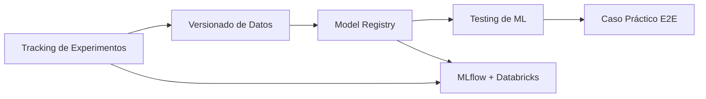
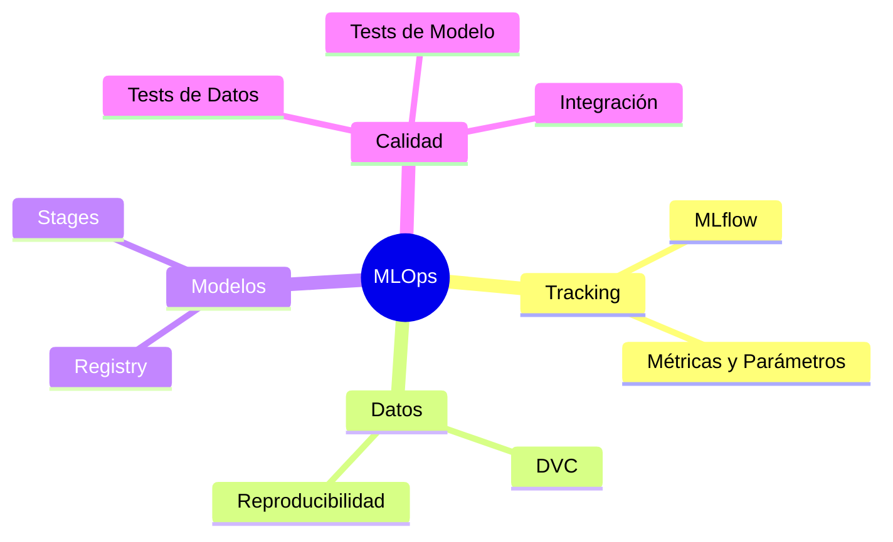

# 🧪 Bienvenida al Curso: Experiment Tracking y Model Registry

La gestión de experimentos y el versionado de modelos son pilares fundamentales del MLOps moderno. En el ciclo de vida de un sistema de IA, la capacidad de reproducir resultados, auditar cambios y gobernar artefactos determina la diferencia entre un prototipo de laboratorio y un producto escalable en producción.

Este curso te proporcionará las herramientas y patrones necesarios para construir pipelines de entrenamiento robustos, rastreables y listos para producción.

---

## Índice del Curso

1. [[01 - MLflow y Tracking de Experimentos|📊 MLflow y Tracking de Experimentos]]
2. [[02 - Versionado de Datos con DVC|🗂️ Versionado de Datos con DVC]]
3. [[03 - Model Registry y Lifecycle|🏛️ Model Registry y Lifecycle]]
4. [[04 - Testing de ML|🧪 Testing de Machine Learning]]
5. [[05 - Caso Practico - Pipeline de Entrenamiento Versionado|🎯 Caso Práctico: Pipeline de Entrenamiento Versionado]]
6. [[06 - MLflow y Databricks Integration|☁️ MLflow y Databricks: Integración Enterprise]]

---

## Diagrama del Flujo del Curso

---

## Componentes del MLOps Cubiertos

---

## Glosario

| Término | Definición |
|---------|------------|
| **Experiment tracking** | Práctica de registrar sistemáticamente parámetros, métricas, artefactos y metadatos de cada ejecución de entrenamiento. |
| **MLflow** | Plataforma open-source para gestionar el ciclo de vida de ML, incluyendo tracking, projects, model registry y deployments. |
| **DVC** | Data Version Control; extensión de Git para versionar datasets y pipelines de ML. |
| **Model registry** | Repositorio centralizado para almacenar, versionar y gestionar el ciclo de vida de modelos entrenados. |
| **Versioning** | Control de cambios aplicado a datos, código y modelos para garantizar reproducibilidad. |
| **Reproducibility** | Capacidad de replicar un experimento obteniendo los mismos resultados a partir del mismo código, datos y configuración. |
| **Artifact** | Cualquier archivo generado durante un experimento (modelos, gráficos, datasets intermedios). |
| **Metric** | Medida cuantitativa del rendimiento de un modelo (ej. accuracy, F1-score, RMSE). |
| **Parameter** | Variable configurable de un modelo o pipeline (ej. learning_rate, n_estimators). |
| **Run** | Ejecución individual de un experimento dentro de una herramienta de tracking. |
| **Stage** | Fase del ciclo de vida de un modelo (None, Staging, Production, Archived). |
| **Testing de ML** | Conjunto de prácticas para validar datos, modelos y pipelines de forma automatizada. |
| **Unit test** | Prueba que verifica el comportamiento de una unidad mínima de código de forma aislada. |
| **Integration test** | Prueba que valida la interacción correcta entre múltiples componentes del sistema. |
| **Data test** | Validación automatizada de calidad, esquema y distribución de los datos de entrada. |

---

## Objetivos de Aprendizaje

Al finalizar este curso serás capaz de:

1. Implementar tracking de experimentos con MLflow en pipelines de entrenamiento reales.
2. Versionar datasets y reproducir pipelines completos utilizando DVC.
3. Gestionar el ciclo de vida de modelos mediante un Model Registry (MLflow).
4. Diseñar y ejecutar tests de datos, modelos e integración para pipelines de ML.
5. Construir un pipeline end-to-end versionado que combine todas las prácticas anteriores.

---

💡 **Tip:** Mantén un único servidor de tracking (o URI de MLflow) para todo tu equipo. La consistencia en la configuración de `MLFLOW_TRACKING_URI` evita la fragmentación de experimentos.

⚠️ **Advertencia:** No almacenes credenciales ni datos sensibles en los metadatos de los runs. Los logs de parámetros y métricas suelen persistirse en texto plano.
