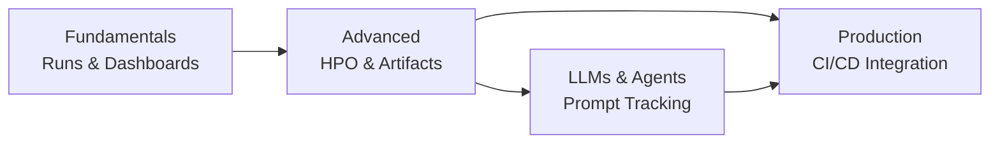

# 🔬 Welcome to Weights and Biases

Weights and Biases (W&B) is the industry's leading experiment tracking and MLOps platform for machine learning practitioners. Unlike MLflow, which is primarily open source and self-hosted, W&B operates as a managed SaaS platform that excels at real-time visualization, team collaboration, and artifact management — the tool of choice for research teams, startups, and companies shipping ML models at speed.

This course covers the full W&B workflow from your first experiment to production-grade CI/CD integration.

---

## Course Index

1. [[01 - W&B Fundamentals|W&B Fundamentals: Runs, Projects, and Dashboards]]
2. [[02 - W&B Advanced|W&B Advanced: Sweeps, Reports, and Artifacts]]
3. [[03 - W&B for LLMs and Agents|W&B for LLMs and Agents]]
4. [[04 - W&B in Production|W&B in Production: CI/CD and Team Collaboration]]

---

## Learning Path

---

## Why W&B Matters

| Criterion | W&B | MLflow |
|---|---|---|
| **Visualization** | Real-time, interactive dashboards | Static UI, requires refresh |
| **Collaboration** | Team workspaces, report sharing | Requires shared server deployment |
| **Hyperparameter Search** | Built-in Sweeps (Bayesian, Grid, Random) | Requires manual HPO implementation |
| **Artifact Versioning** | Lineage tracking with DAG visualization | Basic artifact logging |
| **LLM Support** | W&B Prompts, LLM eval tables | Via MLflow Evaluate (catch-up mode) |
| **Deployment** | Fully managed SaaS (free tier) | Self-hosted (Docker/K8s) |
| **Open Source** | SDK open source, platform closed | Fully open source |

---

## Prerequisites

- Python 3.9+
- A W&B account (free tier at [wandb.ai](https://wandb.ai))
- Familiarity with Python ML workflows
- Completion of MLflow fundamentals recommended but not required

---

## Objectives

By the end of this course you will:

1. Track, visualize, and compare ML experiments using W&B runs and dashboards.
2. Execute automated hyperparameter optimization with W&B Sweeps.
3. Version datasets, models, and pipelines with W&B Artifacts.
4. Track LLM prompts, responses, and evaluation metrics.
5. Integrate W&B into CI/CD pipelines for automated model validation.
6. Design team workflows with workspaces, reports, and shared dashboards.

---

💡 **Tip:** W&B has generous free tier limits — use it as your personal experiment tracker even if your team uses MLflow. The visualization capabilities alone are worth the setup.

⚠️ **Warning:** W&B logs every metric to the cloud by default. For sensitive projects, use W&B Local (self-hosted) or ensure your data compliance team reviews the W&B security posture.
