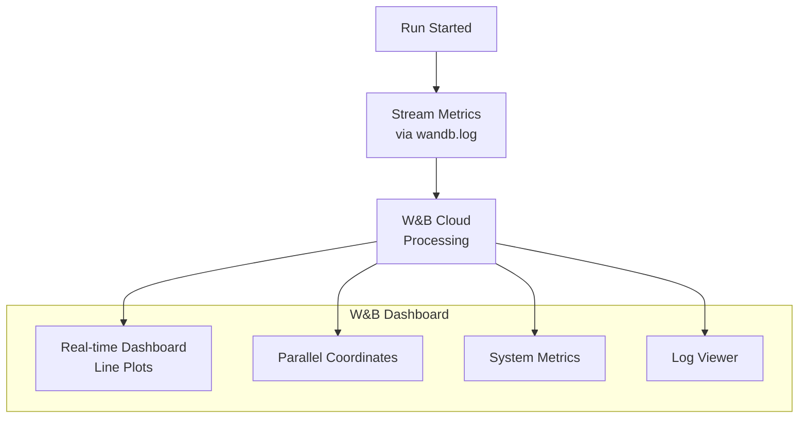

# 📊 W&B Fundamentals: Runs, Projects, and Dashboards

## Introduction

Weights and Biases transforms experiment tracking from a passive logging exercise into an active, collaborative, and visual workflow. Unlike offline trackers where metrics languish in SQL tables, W&B pushes every data point to a real-time dashboard accessible from any browser. This instant feedback loop — run your script, watch metrics converge in real-time, share a link with your team — is why W&B has become the default tracker for AI research labs and startups shipping ML models to production.

This module covers the foundational W&B primitives: runs, projects, dashboards, and the mental model that separates W&B from file-system-based trackers. You will learn to instrument a training loop, organize experiments across projects, and leverage W&B's real-time visualization to debug and optimize your models faster.

---

## 1. 🧠 Mental Model: W&B as a Centralized Experiment Database

W&B operates on a cloud-first model where every metric, parameter, artifact, and log is streamed to W&B servers and made queryable through a unified API and UI.

```
┌──────────────────────────────────────────────────────────────┐
│                      W&B CLOUD                               │
│  ┌──────────────────────────────────────────────────────┐    │
│  │                    ORGANIZATION                       │    │
│  │  ┌─────────┐  ┌─────────┐  ┌─────────┐              │    │
│  │  │ Project │  │ Project │  │ Project │   ...        │    │
│  │  │  NLP    │  │  CV     │  │  RL     │              │    │
│  │  │         │  │         │  │         │              │    │
│  │  │ Run A   │  │ Run X   │  │ Run P   │              │    │
│  │  │ Run B   │  │ Run Y   │  │ Run Q   │              │    │
│  │  │ Run C   │  │ Run Z   │  │ Run R   │              │    │
│  │  └─────────┘  └─────────┘  └─────────┘              │    │
│  └──────────────────────────────────────────────────────┘    │
│                                                              │
│  ┌──────────────────────────────────────────────────────┐    │
│  │ Dashboard | Reports | Artifacts | Sweeps | Registry  │    │
│  └──────────────────────────────────────────────────────┘    │
└──────────────────────────────────────────────────────────────┘
        ▲              ▲              ▲
        │              │              │
   ┌────┴────┐    ┌────┴────┐    ┌────┴────┐
   │ Script A│    │ Script B│    │ Script C│
   └─────────┘    └─────────┘    └─────────┘
```

Each script becomes a **run** within a **project** within your team's **organization**. W&B handles the routing, storage, and visualization — your code just calls `wandb.log()`.

---

## 2. 🔑 Core Primitives: Run, Config, and Log

### Run

A run is the atomic unit of tracking — a single execution of your training script. Every run receives a unique ID and URL, and all data associated with that run is accessible through the W&B UI forever (free tier retains runs indefinitely with some rate limits).

### Config

The `wandb.init(config=...)` dictionary defines the hyperparameters and configuration for a run. Unlike MLflow's `mlflow.log_param()`, config is set at initialization and can be auto-populated from argparse or dictionaries:

```python
import wandb

# Initialize a run with configuration
wandb.init(
    project="sentiment-analysis",
    name="bert-base-finetune-v2",
    config={
        "learning_rate": 2e-5,
        "epochs": 3,
        "batch_size": 16,
        "model": "bert-base-uncased",
        "dataset_version": "v4.2"
    }
)
```

Config values appear as columns in the project dashboard, making it trivial to sort, filter, and group runs by any hyperparameter. This replaces the "which learning rate did I use?" manual bookkeeping that plagues ad-hoc tracking.

### Log

`wandb.log()` streams a dictionary of metrics to the W&B cloud in real-time. The function accepts an optional `step` parameter (typically the global training step or epoch):

```python
import wandb
import torch
import torch.nn as nn

wandb.init(project="sentiment-analysis", config={"lr": 2e-5, "epochs": 3})

model = BertClassifier()
optimizer = torch.optim.AdamW(model.parameters(), lr=2e-5)

for epoch in range(3):
    train_loss = 0.0
    for batch_idx, batch in enumerate(train_loader):
        loss = model.training_step(batch)
        optimizer.zero_grad()
        loss.backward()
        optimizer.step()
        train_loss += loss.item()

        if batch_idx % 100 == 0:
            wandb.log({
                "train/loss": loss.item(),
                "train/step": epoch * len(train_loader) + batch_idx
            })

    val_acc = evaluate(model, val_loader)
    wandb.log({
        "epoch": epoch,
        "val/accuracy": val_acc,
        "train/epoch_loss": train_loss / len(train_loader)
    })

wandb.finish()
```

### W&B vs MLflow Logging Comparison

| Aspect | `wandb.log()` | `mlflow.log_metric()` |
|---|---|---|
| **Batch logging** | Single dict with multiple metrics | One call per metric (or batched via `log_metrics`) |
| **Step parameter** | Optional, any integer | Mandatory as separate `step` argument |
| **Real-time streaming** | Yes, instant to cloud dashboard | Requires polling or UI refresh |
| **Offline mode** | `wandb.init(mode="offline")` caches locally | Native with `file://` backend |
| **Metric grouping** | Automatic via `/` in key name (e.g., "train/loss") | Manual; UI shows flat list |

---

## 3. 📊 Dashboards and Visualization

W&B's dashboard is the primary user interface and the feature that most distinguishes it from MLflow and other trackers. It provides:

### Real-Time Panel Types

| Panel | What It Shows | Best For |
|---|---|---|
| **Line Plot** | Scalar metrics over time | Training/validation loss curves |
| **Histogram** | Distribution of gradients/weights | Debugging vanishing/exploding gradients |
| **Confusion Matrix** | Multi-class prediction errors | Classification model analysis |
| **Parallel Coordinates** | High-dimensional hyperparameter space | HPO result exploration |
| **Scatter Plot** | Two metrics plotted against each other | Trade-off analysis (e.g., throughput vs accuracy) |
| **Custom Charts** | Vega-Lite / Plotly queries | Domain-specific visualizations |




### System Metrics Auto-Logging

W&B automatically collects system metrics without any code:

| Metric | Source | Purpose |
|---|---|---|
| CPU Utilization | `psutil` | Detect CPU bottlenecks |
| GPU Utilization | `nvidia-smi` / `pynvml` | Monitor GPU efficiency |
| GPU Memory | `pynvml` | Detect OOM before it happens |
| Disk I/O | `psutil` | Identify data loading bottlenecks |
| Network I/O | `psutil` | Monitor distributed training throughput |

---

## 4. 📂 Project Organization

Projects are containers for runs. W&B projects support hierarchical naming:

```python
# Top-level project
wandb.init(project="nlp-sentiment")

# Team-scoped (enterprise)
wandb.init(project="team-nlp/nlp-sentiment")
```

### Recommended Project Structure

```
wandb.ai/your-team/
├── nlp-sentiment/          # All sentiment-related experiments
│   ├── bert-baseline/
│   ├── bert-large-tune/
│   └── distillbert-distill/
├── cv-object-detection/    # Object detection experiments
│   ├── yolov8-baseline/
│   └── yolov8-custom/
└── rl-game-agent/          # RL experiments
    └── ppo-v1/
```

Each subdirectory is a **run group** that shares configuration, making it easy to compare variants of the same approach within a dashboard.

---

## 5. 🌍 Real-World Use Cases

| Organization | Use Case | W&B Feature Used |
|---|---|---|
| **OpenAI** | GPT training monitoring | Real-time loss/Gradient histograms, system metrics |
| **Anthropic** | Claude model evaluation | Custom charts, artifact lineage |
| **Hugging Face** | Model training & sharing | Auto-logging integration with Transformers Trainer |
| **NVIDIA NeMo** | Speech model HPO | Sweeps with Bayesian optimization |
| **Stability AI** | Stable Diffusion training | Image artifact logging, FID metrics |
| **Stanford CRFM** | Foundation Model evaluations | Reports for publishing benchmark results |

---

## ⚠️ Pitfalls

- **API key in code:** Never hardcode `wandb.login(key="...")` in scripts. Use `WANDB_API_KEY` environment variable.
- **Large image artifacts:** W&B has per-run storage limits on the free tier. Compress or downsample images before logging.
- **Unclosed runs:** Always call `wandb.finish()` or use `with wandb.init() as run:` context manager. Unclosed runs appear as "crashed" with partial data.
- **Metric explosion:** Don't log every per-batch metric. Log batch-level metrics at intervals (e.g., every 100 batches) and epoch-level metrics always.

---

## 💡 Tips

- **Group your metrics with `/` for automatic panel grouping:** `train/loss`, `val/loss`, `train/accuracy`, `val/accuracy` each create separate sections in the dashboard.
- **Use `wandb.watch(model)`** to automatically log gradients and parameter histograms for PyTorch models.
- **Set `wandb.init(tags=["baseline", "bert"])`** for filtering runs across projects.
- **Enable code saving:** `wandb.init(save_code=True)` uploads your training script as an artifact for full reproducibility.

---

## 📦 Compression Code

```python
# Minimal end-to-end W&B tracked training loop
import wandb
import torch
import torch.nn as nn
from torch.utils.data import DataLoader, TensorDataset

wandb.init(project="quickstart", config={"lr": 0.001, "epochs": 5})

X = torch.randn(1000, 10)
y = (X.sum(dim=1) > 0).float()

model = nn.Sequential(nn.Linear(10, 32), nn.ReLU(), nn.Linear(32, 1))
optimizer = torch.optim.Adam(model.parameters(), lr=wandb.config.lr)
criterion = nn.BCEWithLogitsLoss()

loader = DataLoader(TensorDataset(X, y), batch_size=32)

for epoch in range(wandb.config.epochs):
    for batch_idx, (xb, yb) in enumerate(loader):
        pred = model(xb).squeeze()
        loss = criterion(pred, yb)
        optimizer.zero_grad()
        loss.backward()
        optimizer.step()

        if batch_idx % 10 == 0:
            wandb.log({"train/loss": loss.item()})

    acc = ((torch.sigmoid(model(X).squeeze()) > 0.5) == y).float().mean()
    wandb.log({"epoch": epoch, "val/accuracy": acc.item()})

wandb.finish()
print(f"Run URL: {wandb.run.url}")
```

---

## ✅ Knowledge Check

1. **What is the difference between `wandb.init(config=...)` and `wandb.log()`?** — Config sets hyperparameters at run start (immutable metadata), while `wandb.log()` streams changing metrics (loss, accuracy) dynamically during training.

2. **Why does W&B group metrics with `/` in the key name?** — The `/` separator creates hierarchical sections in the dashboard UI, allowing metrics like `train/loss` and `val/loss` to appear in the same panel with different colors.

3. **What system metrics does W&B auto-collect?** — CPU/GPU utilization, GPU memory, disk I/O, and network throughput — all without code changes.

4. **How does W&B compare to MLflow for team collaboration?** — W&B offers shared dashboards and reports accessible via URL without deploying a server. MLflow requires self-hosting the tracking server for team access.

---

## 🎯 Key Takeaways

- W&B streams metrics in real-time to a cloud dashboard — no local server, no polling.
- `wandb.init(config=...)` defines immutable run metadata; `wandb.log()` streams dynamic metrics.
- W&B's dashboard includes parallel coordinates, scatter plots, and histograms — superior to MLflow's charting capabilities.
- System metrics are auto-logged, giving you GPU and CPU profiling for free.
- Projects, groups, and tags provide hierarchical organization for teams with hundreds of experiments.

---

## References

- [W&B Quickstart](https://docs.wandb.ai/quickstart)
- [W&B Python SDK](https://docs.wandb.ai/ref/python)
- [W&B Guide: Track Experiments](https://docs.wandb.ai/guides/track)
- [W&B vs MLflow Comparison](https://docs.wandb.ai/guides/integrations/other/mlflow)
