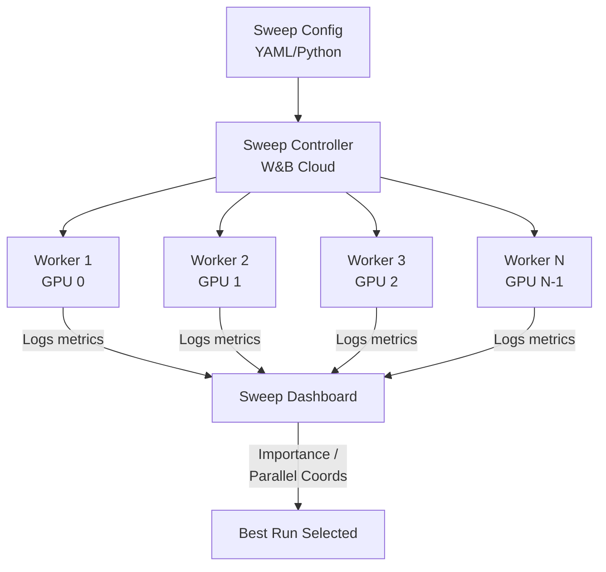
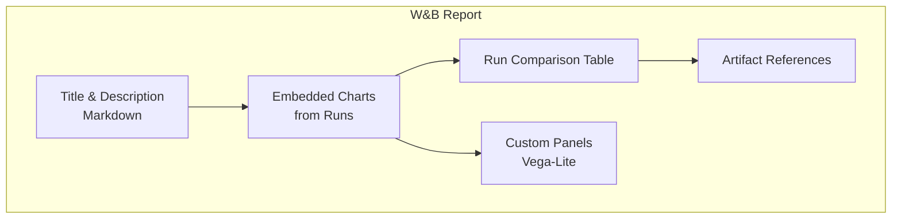
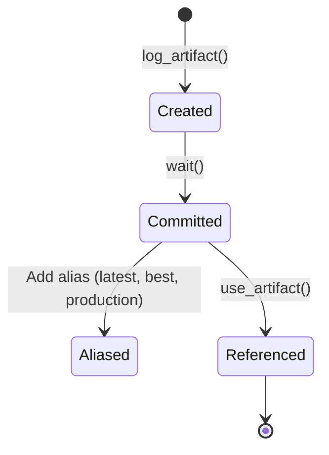
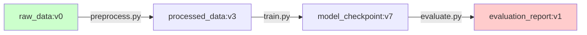

# 🧬 W&B Advanced: Sweeps, Reports, and Artifacts

## Introduction

Running a single experiment is how you start. Running hundreds systematically is how you ship. W&B's advanced features — Sweeps for hyperparameter optimization, Reports for collaborative analysis, and Artifacts for versioned pipeline tracking — turn the platform from a logging utility into a full MLOps orchestration layer.

This module covers the three power tools that distinguish W&B from simpler trackers. Sweeps automate the search for optimal hyperparameters across distributed workers. Reports transform raw runs into shareable narratives with embedded charts. Artifacts track every input and output of your pipeline with lineage DAGs, enabling full reproducibility from raw data to deployed model.

---

## 1. 🔍 Sweeps: Automated Hyperparameter Optimization

Sweeps transform manual trial-and-error into systematic, parallel, and reproducible hyperparameter search. Instead of writing loops over hyperparameters, you define a search space and a search strategy — W&B coordinates the workers.

### How Sweeps Work



The sweep controller assigns hyperparameter combinations to workers. Each worker runs the training script with its assigned config, logs results, and the controller uses those results to inform the next assignments (for Bayesian search).

### Search Strategies

| Strategy | How It Works | Best For |
|---|---|---|
| **Grid** | Exhaustive search over a discrete grid | Small search spaces with few hyperparameters |
| **Random** | Uniform random sampling from ranges | Exploratory search, wide ranges |
| **Bayesian** | Gaussian Process model of the objective function, balances exploration/exploitation | Expensive training runs, high-dimensional spaces |

### Mathematical Formulation (Bayesian Optimization)

Bayesian optimization models the unknown objective function $f(\theta)$ as a Gaussian Process:

$$
f(\theta) \sim \mathcal{GP}(\mu(\theta), k(\theta, \theta'))
$$

At each iteration, the acquisition function $a(\theta)$ selects the next point to evaluate:

$$
\theta_{t+1} = \argmax_\theta a(\theta \mid \mathcal{D}_{1:t})
$$

Common acquisition functions: Expected Improvement (EI), Upper Confidence Bound (UCB), Probability of Improvement (PI). W&B's Bayesian sweeps use EI by default.

### Sweep Configuration

```yaml
# sweep.yaml
program: train.py
method: bayes
metric:
  name: val_accuracy
  goal: maximize
parameters:
  learning_rate:
    distribution: log_uniform_values
    min: 1e-5
    max: 1e-1
  batch_size:
    values: [16, 32, 64, 128]
  dropout:
    values: [0.1, 0.2, 0.3, 0.4, 0.5]
  optimizer:
    values: ["adam", "adamw", "sgd"]
early_terminate:
  type: hyperband
  min_iter: 3
```

```python
# train.py — sweep-aware training script
import wandb

wandb.init()

# Hyperparameters are auto-injected by the sweep agent
config = wandb.config

model = create_model(dropout=config.dropout)
optimizer = get_optimizer(config.optimizer, lr=config.learning_rate)
train_loader = get_dataloader(batch_size=config.batch_size)

for epoch in range(10):
    train_loss = train_one_epoch(model, optimizer, train_loader)
    val_acc = evaluate(model, val_loader)
    wandb.log({"train/loss": train_loss, "val/accuracy": val_acc})

wandb.finish()
```

### Launching Sweeps

```bash
# Create the sweep
wandb sweep sweep.yaml

# Launch N workers (run on different machines/GPUs)
wandb agent <username>/<project>/<sweep_id>  # Run N times for N workers
```

### Sweep Dashboard Features

- **Parallel Coordinates Plot:** Explore the hyperparameter space and see which combinations lead to high metric values. Drag axes to filter.
- **Importance Plot:** Shows which hyperparameters correlate most strongly with the objective metric (uses random forest feature importance on sweep results).
- **Early Termination:** HyperBand prunes unpromising runs early, saving compute.

---

## 2. 📝 Reports: Collaborative Analysis

W&B Reports are living documents that combine narrative text, embedded charts, and run comparisons into shareable, version-controlled artifacts.

### Report Structure



### What Reports Enable

| Feature | Use Case |
|---|---|
| **Drag-and-drop charts** | Create line plots, scatter plots, bar charts from any run in the project |
| **Run sets** | Define a set of runs (e.g., "all BERT experiments with lr>1e-5") that auto-update |
| **Export** | Share as URL or export as LaTeX/PDF for conference papers |
| **Version history** | Reports are versioned — revert to previous versions, see who edited what |
| **Comparison tables** | Side-by-side table of runs with selected metrics and parameters |

### Real Case: Publishing Research Results

Stanford CRFM uses W&B Reports as the primary medium for sharing HELM benchmark results. Each report page embeds dozens of charts comparing foundation models across metrics, and stakeholders access the latest version via a single URL — no PDF attachments, no static screenshots.

---

## 3. 📦 Artifacts: Pipeline Lineage and Versioning

W&B Artifacts are the foundation of reproducible ML pipelines. An artifact is a versioned, immutable object (dataset, model, processed output) with tracked lineage.

### Artifact Lifecycle



### Artifact Lineage DAG

When you log an artifact that was produced using another artifact as input, W&B automatically constructs a lineage graph:



### Artifact Types and Use Cases

| Artifact Type | Example | Storage |
|---|---|---|
| **Dataset** | `raw_images:latest` → 50K PNG files | W&B Cloud or external bucket |
| **Model** | `sentiment_model:v3` → `model.pt` | W&B Cloud (with versioning) |
| **Preprocessed Data** | `tokenized_text:v2` → `dataset.arrow` | W&B Cloud |
| **Result** | `eval_table:v1` → W&B Table (interactive) | W&B Cloud |
| **Custom** | Any file or directory | W&B Cloud |

### Using Artifacts in Code

```python
import wandb

run = wandb.init(project="nlp-pipeline", job_type="train")

# Consume an artifact (input)
dataset = run.use_artifact("team-nlp/processed_data:latest")
data_dir = dataset.download()
# data_dir now contains the files from this artifact version

# Train model
model = train_model(data_dir)

# Produce an artifact (output)
model_artifact = wandb.Artifact(
    name="sentiment_model",
    type="model",
    description="BERT fine-tuned on sentiment dataset",
    metadata={"accuracy": 0.92, "f1": 0.89}
)
model_artifact.add_file("model.pt")
run.log_artifact(model_artifact)

run.finish()
```

### Artifact Aliases

Aliases provide mutable pointers to immutable artifact versions — similar to Docker image tags:

| Alias Convention | Meaning |
|---|---|
| `latest` | Most recently logged version |
| `best` | Version with best evaluation metrics |
| `production` | Version currently serving traffic |
| `staging` | Candidate for production promotion |

---

## 4. 🗂️ W&B Tables: Structured Data Tracking

W&B Tables enable interactive exploration of structured data like evaluation results, prediction samples, and dataset slices.

### Use Cases for Tables

- **Model evaluation:** Log prediction, ground truth, and confidence for every test sample.
- **Error analysis:** Filter to misclassified samples and inspect them visually.
- **Data versioning:** Track which data samples were used in each training run.
- **LLM evaluation:** Log prompt, completion, and human/AI feedback side by side.

### Table Example

```python
import wandb

wandb.init(project="image-classifier")

# Create evaluation table
table = wandb.Table(columns=["image", "ground_truth", "prediction", "confidence"])

for img, gt, pred, conf in evaluation_samples:
    table.add_data(wandb.Image(img), gt, pred, conf)

wandb.log({"evaluation_results": table})
```

The resulting table is interactive in the W&B UI: sort by confidence, filter by prediction ≠ ground truth, and export to CSV.

---

## ⚠️ Pitfalls

- **Bayesian Sweeps with too few runs:** Bayesian optimization needs at least 10-20 runs before the Gaussian Process model becomes informative. With fewer runs, use random search.
- **Artifact size limits:** W&B free tier has per-artifact and total storage limits. For datasets larger than 5GB, use `artifact.add_reference()` to point to external storage instead of uploading.
- **Early termination misuse:** HyperBand early termination based on epoch-1 accuracy may prune architectures that converge slowly but eventually outperform. Use a higher `min_iter` for convergence-critical tasks.
- **Report mutability:** Reports update when underlying runs change. If you delete runs referenced by a report, the charts break. Archive runs instead of deleting.

---

## 💡 Tips

- **Run sweep agents across multiple machines:** The sweep controller coordinates workers — launch as many `wandb agent` processes as you have GPUs.
- **Use artifact metadata for search:** `wandb.Artifact(metadata={"accuracy": 0.92})` enables filtering artifact versions by metric values.
- **Nest Sweeps:** Use one sweep to find optimal architecture, then a second sweep (with the best architecture fixed) to fine-tune learning rate and regularization.
- **Link runs to artifacts explicitly:** When logging an artifact, always log from the run that produced it — this enables full DAG lineage.

---

## 📦 Compression Code

```python
# Sweep + Artifact: automated HPO with model versioning
import wandb

def train():
    wandb.init(job_type="sweep_worker")

    # Use sweep config (injected by agent)
    cfg = wandb.config

    # Consume dataset artifact
    dataset = wandb.use_artifact("processed_data:latest")
    data = dataset.download()

    # Train with sweep hyperparameters
    model = train_model(data, lr=cfg.lr, dropout=cfg.dropout)
    acc = evaluate(model, data)

    wandb.log({"val_accuracy": acc})

    # Log trained model as artifact
    artifact = wandb.Artifact(
        f"model_lr{cfg.lr}_do{cfg.dropout}",
        type="model",
        metadata={"accuracy": acc, "lr": cfg.lr, "dropout": cfg.dropout}
    )
    artifact.add_file("model.pt")
    wandb.log_artifact(artifact)

    wandb.finish()

if __name__ == "__main__":
    train()
```

---

## ✅ Knowledge Check

1. **What are the three sweep search strategies and when to use each?** — Grid for small/discrete spaces, Random for exploration, Bayesian for expensive/continuous optimization.

2. **What is the difference between `use_artifact()` and `log_artifact()`?** — `use_artifact()` downloads an existing artifact as input to your run; `log_artifact()` uploads a new artifact produced by your run.

3. **How does W&B artifact lineage differ from MLflow artifact logging?** — W&B automatically constructs a DAG of artifact dependencies (input → run → output). MLflow requires manual tracking of artifact relationships.

4. **What is the purpose of HyperBand early termination in sweeps?** — It prunes runs that underperform early, redirecting compute to more promising hyperparameter configurations.

---

## 🎯 Key Takeaways

- Sweeps automate HPO with grid, random, or Bayesian strategies coordinated across distributed workers.
- Reports turn runs into living, shareable documents with embedded charts — ideal for stakeholder communication.
- Artifacts provide immutable, versioned tracking of datasets, models, and results with automatic lineage DAGs.
- Tables enable interactive exploration of structured evaluation data, critical for error analysis.
- The sweep→artifact→report workflow forms a complete MLOps pipeline within W&B.

---

## References

- [W&B Sweeps Documentation](https://docs.wandb.ai/guides/sweeps)
- [W&B Artifacts Guide](https://docs.wandb.ai/guides/artifacts)
- [W&B Reports](https://docs.wandb.ai/guides/reports)
- [W&B Tables](https://docs.wandb.ai/guides/tables)
