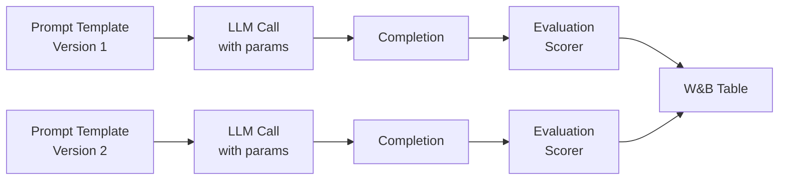
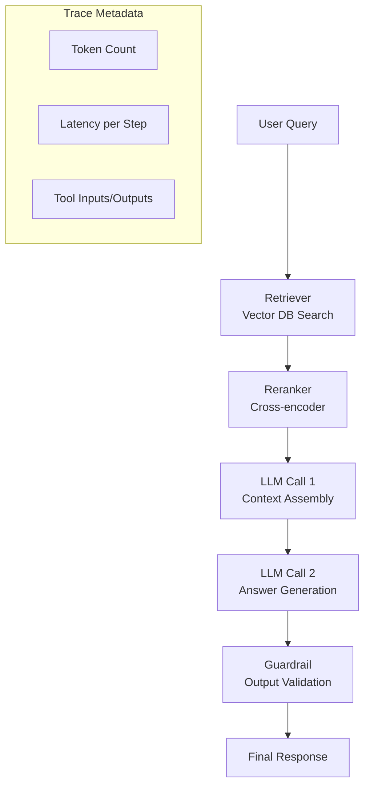

# 🤖 W&B for LLMs and Agents

## Introduction

Foundation models and LLM-powered agents introduce a fundamentally different evaluation paradigm compared to traditional supervised learning. There is no single accuracy metric when your model generates free-form text, executes tool calls, or engages in multi-turn conversations. W&B has responded with purpose-built tooling — W&B Prompts, LLM eval tables, and trace visualization — that address the unique challenges of tracking, evaluating, and debugging generative AI systems.

This module covers the W&B features specifically designed for LLM workflows: prompt engineering tracking, chain/trace debugging, human feedback collection, and agent-specific evaluation patterns. If you are building RAG systems, fine-tuning foundation models, or orchestrating agentic workflows (LangGraph, CrewAI, AutoGen), this toolkit is the missing layer between your code and production-quality evaluation.

---

## 1. 🧠 The LLM Evaluation Problem

Traditional ML evaluation assumes a closed-set prediction space. LLM evaluation is open-ended:

| Dimension | Traditional ML | LLM Systems |
|---|---|---|
| **Output Space** | Closed (classes, values) | Open (free-form text) |
| **Correctness** | Binary/ordinal (right/wrong) | Multi-dimensional (accuracy, relevance, tone, safety, format) |
| **Latency** | Milliseconds | Seconds to minutes (chain of thought, tool calls) |
| **Traceability** | Input → Model → Output | Input → Prompt → LLM Call → Tool → LLM Call → Output |
| **Cost** | Fixed (one inference) | Variable (tokens in/out, tool calls, retries) |

The evaluation requires composite metrics and human-in-the-loop feedback loops, which is exactly what W&B's LLM tooling provides.

---

## 2. 📝 W&B Prompts: Prompt Engineering and Tracking

W&B Prompts enables systematic prompt experimentation — think of it as "experiment tracking for natural language instructions." Instead of ad-hoc prompt tweaks in a notebook, W&B Prompts treats each prompt variant as a trackable configuration with associated metrics and responses.

### What W&B Prompts Tracks



### Tracked Dimensions per Prompt

| Attribute | Example | Purpose |
|---|---|---|
| **Prompt text** | "Summarize {document} in {n_sentences} sentences" | Reproduce exact instructions |
| **Model** | `gpt-4-turbo`, `claude-3-opus` | Compare model performance |
| **Generation params** | `temperature=0.7`, `top_p=0.9`, `max_tokens=512` | Reproduce generation conditions |
| **Input variables** | `document="The quick brown fox..."` | Track specific inputs |
| **Completion** | "A fox quickly jumped..." | Inspect output quality |
| **Latency** | 1.23s | Monitor LLM response time |
| **Token usage** | Prompt: 45 tokens, Completion: 120 tokens | Track cost |
| **Custom scores** | `toxicity=0.02`, `relevance=0.94` | Automated evaluation |

### Prompt Comparison Workflow

```
┌─────────────────────────────────────────────────────────────┐
│  1. Define prompt templates as configuration               │
│  2. Run each against evaluation dataset                    │
│  3. Log prompt + response + scores to W&B Table            │
│  4. Compare variants side-by-side in dashboard             │
│  5. Select best prompt → promote to artifact               │
└─────────────────────────────────────────────────────────────┘
```

---

## 3. 🔗 Tracing LLM Chains and Agent Trajectories

Modern LLM applications are not single calls — they are chains of LLM invocations interleaved with tool calls, retrieval steps, and branching logic. W&B Traces captures the full execution DAG.

### Trace Structure for a RAG Agent



### What Traces Capture

| Trace Element | Value for Debugging |
|---|---|
| **Span tree** | Visualize exactly which operations happened and in what order |
| **Token counts per span** | Identify cost hotspots (which step uses most tokens?) |
| **Latency per span** | Identify latency bottlenecks (retrieval, LLM, re-ranking?) |
| **Tool inputs/outputs** | Debug incorrect tool calls or malformed inputs |
| **Error spans** | Pinpoint exactly where a chain failed (retrieval? LLM? parsing?) |

### Trace vs Traditional Logging

```
Traditional:                       W&B Trace:
run.log({"accuracy": 0.92})        trace:
                                     ├─ retriever: 45ms, 3 docs
                                     ├─ reranker:  12ms, top-1
                                     ├─ llm_call_1: 890ms, 234 tokens
                                     ├─ llm_call_2: 1200ms, 356 tokens
                                     ├─ guardrail: 15ms, passed
                                     └─ total: 2.1s, 590 tokens, $0.003
```

This granularity is essential for debugging complex agent systems where failures are often in intermediate steps, not the final output.

---

## 4. 📊 LLM Evaluation with W&B Tables

W&B Tables become particularly powerful when evaluating LLM outputs because they support multi-column comparison with rich media:

```python
import wandb

wandb.init(project="llm-evaluation")

# Evaluation table for LLM outputs
eval_table = wandb.Table(columns=[
    "input",
    "prompt_template",
    "model",
    "completion",
    "toxicity_score",
    "relevance_score",
    "factual_accuracy",
    "human_feedback",
])

for sample in eval_dataset:
    completion = generate(sample.input, sample.prompt_template)
    scores = evaluate(completion, sample.reference)

    eval_table.add_data(
        sample.input,
        sample.prompt_template,
        "gpt-4-turbo",
        completion,
        scores["toxicity"],
        scores["relevance"],
        scores["factual_accuracy"],
        None  # Human feedback to be filled later
    )

wandb.log({"evaluation_table": eval_table})
wandb.finish()
```

### Evaluation Metrics for LLMs

| Metric Category | Example Metrics | Tool |
|---|---|---|
| **Quality** | BLEU, ROUGE, BERTScore, METEOR | `evaluate` library |
| **Safety** | Toxicity (Perspective API), PII detection | Custom scorers |
| **Faithfulness** | Factual consistency, hallucination rate | RAGAS, custom NLI models |
| **Relevance** | Semantic similarity to reference | Sentence-BERT cosine |
| **Cost** | Tokens in/out, total USD per request | W&B trace token counting |

### Human Feedback Collection

W&B supports collaborative annotation where team members can add labels directly in the W&B UI table:

```
┌──────────────────────────────────────────────────────┐
│ W&B Table: LLM Evaluation                           │
├──────────┬──────────────┬─────────┬─────────────────┤
│ Input    │ Completion   │ Score   │ Human Feedback   │
├──────────┼──────────────┼─────────┼─────────────────┤
│ "What... │ "AI is..."   │ 0.94    │ ✓ Accurate       │
│ "How..." │ "The proc..." │ 0.72    │ ✗ Hallucinates  │
│ "When..."│ "In 2023..."  │ 0.88    │ ⚠ Partially OK  │
└──────────┴──────────────┴─────────┴─────────────────┘
```

This closes the loop between automated metrics and human judgment, enabling RLHF data collection directly in the platform.

---

## 5. 🔄 Agent-Specific Patterns

Agentic systems (LangGraph, CrewAI, AutoGen, custom agent loops) present unique tracking challenges that W&B addresses:

### Pattern 1: Multi-Turn Conversations

```python
import wandb

wandb.init(project="customer-support-agent")

conversation_table = wandb.Table(columns=[
    "turn", "user_message", "agent_response", "tool_calls",
    "latency", "tokens", "satisfaction"
])

for turn, interaction in enumerate(agent_loop(user_request)):
    conversation_table.add_data(
        turn,
        interaction.user_message,
        interaction.agent_response,
        str(interaction.tool_calls),
        interaction.latency,
        interaction.total_tokens,
        interaction.user_satisfaction
    )

wandb.log({"conversation": conversation_table})
wandb.finish()
```

### Pattern 2: Tool Call Auditing

Agent debugging requires knowing exactly which tools were called, with what arguments, and what they returned:

```python
# Inside agent loop
for tool_call in agent.tool_calls:
    tool_table = wandb.Table(columns=["tool_name", "arguments", "result", "error"])
    try:
        result = tool_call.execute()
        tool_table.add_data(tool_call.name, str(tool_call.args), str(result), None)
    except Exception as e:
        tool_table.add_data(tool_call.name, str(tool_call.args), None, str(e))

    wandb.log({"tool_execution": tool_table})
```

### Pattern 3: Cost Tracking Across Agent Runs

```python
wandb.define_metric("cost/total_usd", summary="sum")
wandb.define_metric("cost/tokens_in", summary="sum")
wandb.define_metric("cost/tokens_out", summary="sum")

for step in agent_execution:
    # ... agent step ...
    wandb.log({
        "cost/tokens_in": step.prompt_tokens,
        "cost/tokens_out": step.completion_tokens,
        "cost/total_usd": step.cost_usd
    })
```

---

## 6. 🌍 Real-World Use Cases

| Organization | LLM Use Case | W&B Tool Used |
|---|---|---|
| **Anthropic** | Claude evaluation pipelines | W&B Tables for multi-dimensional scoring |
| **Cohere** | RAG system optimization | W&B Traces for retrieval chain debugging |
| **LangChain** | LangSmith alternative | W&B Prompts integrated with LangChain callbacks |
| **Hugging Face** | Model fine-tuning comparison | W&B dashboards for HF Trainer auto-logging |
| **NVIDIA NeMo** | Guardrails evaluation | W&B Tables for safety metric tracking |

---

## ⚠️ Pitfalls

- **Token cost underestimation:** W&B's token counter uses model-specific pricing. If you use a custom model endpoint, ensure you set pricing manually or track tokens directly.
- **Trace depth limits:** Very deep agent loops (100+ steps) may hit span limits. Aggregate intermediate spans or use summary logs for long-running agents.
- **Prompt template leakage:** Prompts logged to W&B are visible to team members. Never include API keys or sensitive data in prompt templates.
- **Evaluation metric disagreement:** Automated metrics (BLEU, ROUGE) often disagree with human judgment. Always include human feedback columns in your evaluation tables.

---

## 💡 Tips

- **Use `wandb.define_metric()` for cost metrics:** Setting `summary="sum"` on cost metrics enables automatic total cost calculation per run.
- **Combine Traces with Tables:** Log trace spans AND a summary table in the same run — traces for debugging, tables for comparison.
- **Version your prompts as artifacts:** `wandb.Artifact("prompt_templates", type="prompts")` enables rollback and comparison across prompt versions.
- **Use W&B Sweeps for prompt hyperparameter optimization:** Sweep over temperature, top_p, and system prompt variants simultaneously.

---

## 📦 Compression Code

```python
# LLM evaluation pipeline with W&B
import wandb
from openai import OpenAI

wandb.init(project="llm-eval", config={"model": "gpt-4-turbo", "temperature": 0.7})

client = OpenAI()
eval_table = wandb.Table(columns=["prompt", "completion", "tokens", "latency"])

prompts = ["Explain quantum computing in 2 sentences",
           "Write a haiku about machine learning",
           "What is the capital of France?"]

for prompt in prompts:
    response = client.chat.completions.create(
        model=wandb.config.model,
        temperature=wandb.config.temperature,
        messages=[{"role": "user", "content": prompt}]
    )

    eval_table.add_data(
        prompt,
        response.choices[0].message.content,
        response.usage.total_tokens,
        response.response_ms / 1000
    )

    wandb.log({
        "tokens": response.usage.total_tokens,
        "latency": response.response_ms / 1000
    })

wandb.log({"evaluation": eval_table})
wandb.finish()
print(f"Results: {wandb.run.url}")
```

---

## ✅ Knowledge Check

1. **Why do LLMs need different evaluation than traditional ML?** — LLM outputs are free-form text, requiring multi-dimensional evaluation (accuracy, safety, relevance, tone) rather than a single classification metric.

2. **What does W&B Traces capture that `wandb.log()` does not?** — Traces capture the hierarchical execution DAG (LLM calls, tool calls, retrieval steps) with per-span latency, token usage, and error information.

3. **How does W&B support human feedback collection for LLM outputs?** — W&B Tables in the UI support editable columns where team members can add human labels (accurate, hallucinated, partially correct) directly in the dashboard.

4. **What are three agent-specific tracking patterns W&B enables?** — Multi-turn conversation logging, tool call auditing, and cumulative cost tracking across agent execution steps.

---

## 🎯 Key Takeaways

- W&B Prompts turns prompt engineering into a systematic, tracked, and comparable process.
- W&B Traces provides full execution DAGs for debugging complex LLM chains and agent loops.
- W&B Tables with human feedback columns close the automated-eval to human-judgment loop.
- Agent-specific patterns (tool auditing, cost tracking) are first-class in W&B's LLM tooling.
- The combination of Traces + Tables + Human Feedback enables production-quality LLM evaluation.

---

## References

- [W&B Prompts Documentation](https://docs.wandb.ai/guides/prompts)
- [W&B Weave (Traces)](https://wandb.github.io/weave/)
- [W&B LLM Evaluation Guide](https://docs.wandb.ai/guides/llm-eval)
- [W&B Tables for LLMs](https://docs.wandb.ai/guides/tables)
- [OpenAI API Reference](https://platform.openai.com/docs/api-reference)
