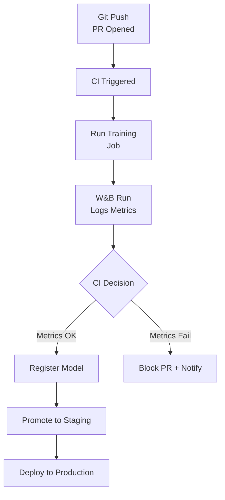
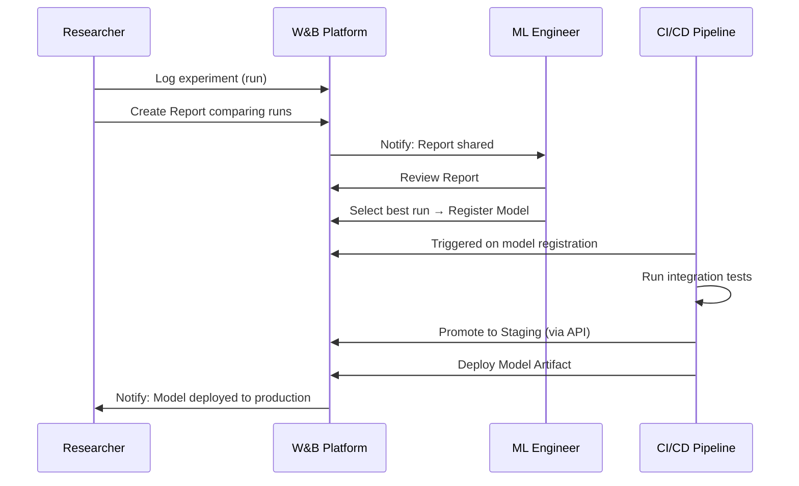
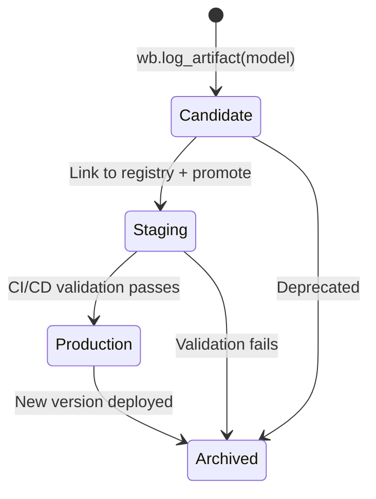
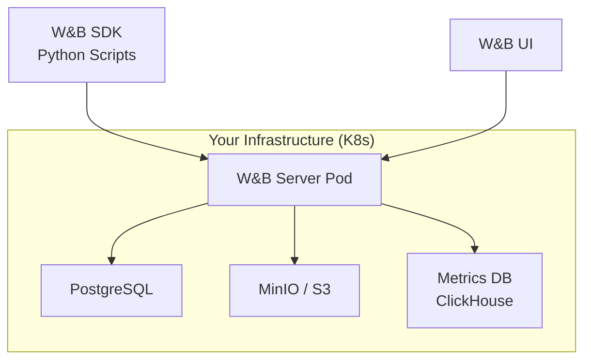

# 🚀 W&B in Production: CI/CD and Team Collaboration

## Introduction

Experiment tracking that stays on a single laptop is a hobby. Production ML requires integration with CI/CD pipelines, shared team workflows, automated model promotion, and governance across the model lifecycle. W&B's production features — CI/CD integration, team workspaces, model registry, and automated reporting — transform it from a personal research tool into a team MLOps platform.

This module covers how to embed W&B into automated pipelines, manage team access and collaboration, and establish governance workflows that ensure every model reaching production has a verifiable audit trail from experiment to deployment.

---

## 1. 🔄 W&B in CI/CD Pipelines

W&B integrates directly into GitHub Actions, GitLab CI, and any CI/CD system that runs Python scripts. The typical flow:



### GitHub Actions Integration

```yaml
# .github/workflows/ml-train.yml
name: ML Training Pipeline

on:
  pull_request:
    paths:
      - 'src/training/**'
      - 'data/**'

jobs:
  train-and-evaluate:
    runs-on: ubuntu-latest
    steps:
      - uses: actions/checkout@v4

      - uses: actions/setup-python@v5
        with:
          python-version: '3.11'

      - name: Install dependencies
        run: pip install -r requirements.txt

      - name: Run training
        env:
          WANDB_API_KEY: ${{ secrets.WANDB_API_KEY }}
        run: python train.py

      - name: Validate metrics
        env:
          WANDB_API_KEY: ${{ secrets.WANDB_API_KEY }}
        run: python validate_run.py
        # validate_run.py fetches the run from W&B, checks if
        # val_accuracy > threshold, and fails CI if not
```

### Metric Validation Script

```python
# validate_run.py — CI gate based on W&B metrics
import wandb
import sys

api = wandb.Api()

# Fetch the latest run from the project
runs = api.runs("team/project")
latest_run = runs[0]

# Check metrics
metrics = latest_run.summary
val_accuracy = metrics.get("val_accuracy", 0)
val_loss = metrics.get("val_loss", float("inf"))

threshold_acc = 0.90
threshold_loss = 0.30

if val_accuracy < threshold_acc:
    print(f"ACCURACY CHECK FAILED: {val_accuracy:.4f} < {threshold_acc}")
    sys.exit(1)

if val_loss > threshold_loss:
    print(f"LOSS CHECK FAILED: {val_loss:.4f} > {threshold_loss}")
    sys.exit(1)

print(f"All checks passed. Accuracy: {val_accuracy:.4f}, Loss: {val_loss:.4f}")
```

### CI/CD Integration Patterns

| Pattern | How It Works | When To Use |
|---|---|---|
| **PR Gate** | CI runs training on PR, blocks merge if metrics degrade | Automated model quality enforcement |
| **Scheduled Retraining** | Cron triggers training job → W&B run → auto-deploy if metrics improve | Periodic model refresh |
| **Drift Detection** | CI runs eval on latest production data, alerts if metrics drop | Monitoring model staleness |
| **A/B Test Validation** | W&B compares experiment group metrics, auto-promotes winner | Online experiment automation |
| **Multi-Model Voting** | CI triggers N parallel training jobs, W&B run comparison selects best | Ensemble optimization |

---

## 2. 👥 Team Workspaces and Collaboration

### Team Hierarchy

```
Organization: acme-corp
├── Team: ML Research
│   ├── Project: nlp-experiments
│   └── Project: cv-experiments
├── Team: ML Platform
│   ├── Project: model-registry
│   └── Project: feature-pipeline
└── Team: Product Analytics
    ├── Project: churn-prediction
    └── Project: recommendation
```

### Permission Model

| Role | Permissions |
|---|---|
| **Admin** | Full control: create teams, manage billing, delete projects |
| **Member** | Create/edit runs in team projects, share reports |
| **Viewer** | Read-only access to specific projects/reports |
| **Service Account** | API-only access for CI/CD pipelines (no UI login) |

### Collaboration Workflow



---

## 3. 🏛️ W&B Model Registry

W&B Model Registry manages the lifecycle of models from experiment to production, similar to MLflow Model Registry but integrated with W&B's artifact and reporting system.

### Registry Workflow



### Registry vs MLflow Registry

| Aspect | W&B Model Registry | MLflow Model Registry |
|---|---|---|
| **UI** | Integrated with project dashboards and reports | Standalone MLflow UI |
| **Lineage** | Full DAG from dataset → training → model | Run → Model relationship |
| **CI Integration** | Webhooks + API for automated promotion | REST API (requires custom integration) |
| **Artifact Backend** | W&B Cloud or external bucket (via reference) | S3, GCS, Azure Blob |
| **Team Collaboration** | Built-in sharing, comments, report embedding | Requires shared MLflow server |

### Registering a Model from a Run

```python
import wandb

run = wandb.init(project="production-ml", job_type="train")

# Train and log model artifact
model_artifact = wandb.Artifact("churn_model", type="model",
                                 metadata={"accuracy": 0.93, "f1": 0.89})
model_artifact.add_file("model.pkl")
run.log_artifact(model_artifact)

# Link to registry
run.link_model(
    path="churn_model",
    registered_model_name="churn-predictor",
    aliases=["candidate"]
)

run.finish()
```

### Automated Promotion via API

```python
import wandb

api = wandb.Api()

# Fetch the candidate model
model = api.artifact("team/churn-predictor:candidate")

# Validate metrics
if model.metadata.get("accuracy", 0) >= 0.92:
    model.aliases.append("staging")
    model.aliases.remove("candidate")
    model.save()
    print("Model promoted to staging")

    # Additional CI tests can run here
    # If they pass, promote to production
    model.aliases.append("production")
    model.aliases.remove("staging")
    model.save()
    print("Model promoted to production")
```

---

## 4. 📋 Automated Reports and Governance

W&B Reports can be generated programmatically, enabling automated governance workflows:

### Automated Model Cards

```python
import wandb
from wandb.apis.reports import Report

api = wandb.Api()

report = Report(
    project="production-ml",
    title="Weekly Model Performance Report",
    description="Automated report generated by CI pipeline"
)

# Add comparison of last week's runs
runs = api.runs("team/production-ml")
report.add_run_comparison(runs[:10])

# Add metric panels
report.add_metric_line_chart("val_accuracy")
report.add_metric_line_chart("val_loss")

report.save()
print(f"Report URL: {report.url}")
```

### Governance Audit Trail

Every action in W&B is recorded, creating a verifiable audit trail:

| Event | Logged Data | Why It Matters |
|---|---|---|
| **Run Created** | User, timestamp, git commit, config | Traceability to code version |
| **Artifact Created** | Run that produced it, input artifacts | Full lineage DAG |
| **Model Registered** | Who registered, when, from which run | Approval chain |
| **Model Promoted** | Who promoted, which stage, validations | Deployment governance |
| **Report Generated** | Date, snapshot of compared runs | Reproducible analysis |
| **Run Deleted/Archived** | Who deleted, when | Audit compliance |

---

## 5. 🏭 W&B Local (Self-Hosted)

For organizations with data residency requirements or air-gapped environments, W&B offers a self-hosted deployment option called W&B Local:

### Architecture



### When to Use W&B Local

| Scenario | Recommendation |
|---|---|
| **Data Residency (GDPR, HIPAA)** | W&B Local in your VPC |
| **Air-gapped Environments** | W&B Local with offline installation |
| **Unlimited Storage** | W&B Local with your own S3/MinIO backend |
| **Custom SSO Integration** | W&B Local with SAML/OIDC |
| **No External Network** | W&B Local with private container registry |

### W&B Local vs W&B Cloud

| Aspect | W&B Cloud | W&B Local |
|---|---|---|
| **Setup** | Instant (free account) | Requires K8s cluster |
| **Maintenance** | Managed by W&B | You manage (upgrades, backups) |
| **Cost** | Free tier → Pro → Enterprise | License fee + infrastructure cost |
| **Features** | Full feature set | Feature parity (some delay on new releases) |
| **Data Location** | W&B infrastructure (US/EU) | Your infrastructure |
| **SSO** | Google, GitHub OAuth (Pro), SAML (Enterprise) | Full SAML/OIDC/LDAP |

---

## ⚠️ Pitfalls

- **CI/CD secret management:** Never commit `WANDB_API_KEY` to code. Use GitHub Secrets, GitLab Variables, or Vault.
- **Run accumulation:** CI pipelines create a run on every commit. Set `wandb.init(mode="disabled")` for linting/test jobs that don't need tracking. Alternatively, set auto-delete policies for CI runs older than 30 days.
- **Registry drift:** If your inference pipeline downloads models from the registry, ensure it uses versioned aliases (e.g., `production:v3`) not mutable aliases (`production:latest`).
- **Permission sprawl:** Regularly audit team membership. Former team members with API keys can still log runs and access artifacts.

---

## 💡 Tips

- **Use Service Accounts for CI/CD:** Create a dedicated service account with API-only access for CI pipelines, separate from your personal account.
- **Set up webhooks for model promotion events:** Use W&B webhooks to trigger downstream deployment pipelines when a model is promoted to a new stage.
- **Archive, don't delete:** W&B supports archiving runs and projects. Archived data remains accessible for audit but is hidden from dashboards.
- **Use `WANDB_PROJECT` environment variable:** Set it at the CI level so every pipeline job automatically logs to the correct project.

---

## 📦 Compression Code

```python
# CI/CD integration: train, validate, register
import wandb
import sys

def main():
    wandb.init(project="ci-cd-training", job_type="training")

    # Train model (placeholder)
    metrics = {"accuracy": 0.94, "f1": 0.90, "loss": 0.12}
    wandb.log(metrics)

    # Create model artifact
    artifact = wandb.Artifact("production_model", type="model",
                               metadata=metrics)
    artifact.add_file("model.pkl")
    wandb.log_artifact(artifact)

    # Validation gate
    if metrics["accuracy"] < 0.90:
        wandb.finish(exit_code=1)
        sys.exit(1)

    # Register if validation passes
    wandb.run.link_model(
        path="production_model",
        registered_model_name="production-classifier",
        aliases=["candidate"]
    )

    wandb.finish()

if __name__ == "__main__":
    main()
```

---

## ✅ Knowledge Check

1. **How do you gate a PR based on W&B metrics in CI?** — Run the training script in CI, fetch the run from W&B API, check if `val_accuracy > threshold`, and fail CI (blocking the PR) if the check fails.

2. **What is the difference between a mutable alias and a versioned alias in the W&B registry?** — Mutable aliases (`production:latest`) always point to the newest version but risk breaking changes. Versioned aliases (`production:v3`) are immutable, ensuring reproducible deployments.

3. **Why use a Service Account instead of a personal account for CI/CD?** — Service accounts are scoped to specific projects, don't consume a team seat, and decouple pipeline execution from personal credentials.

4. **When should you use W&B Local instead of W&B Cloud?** — When data residency regulations (GDPR, HIPAA) require data to stay in your infrastructure, or when operating in air-gapped environments without internet access.

---

## 🎯 Key Takeaways

- W&B integrates with CI/CD via GitHub Actions, GitLab CI, or any system running Python, enabling automated model validation gates.
- Team workspaces, roles, and service accounts provide enterprise-grade access control and collaboration.
- The W&B Model Registry supports automated promotion (candidate → staging → production) with webhook triggers.
- W&B Local provides a self-hosted option for regulated environments with feature parity to W&B Cloud.
- The audit trail from run → artifact → registry → deployment provides full governance compliance.

---

## References

- [W&B CI/CD Integration Guide](https://docs.wandb.ai/guides/integrations/ci-cd)
- [W&B Model Registry](https://docs.wandb.ai/guides/model_registry)
- [W&B Local (Self-Hosted)](https://docs.wandb.ai/guides/hosting)
- [W&B API Reference](https://docs.wandb.ai/ref/python/public-api)
- [W&B Reports API](https://docs.wandb.ai/ref/python/report)
