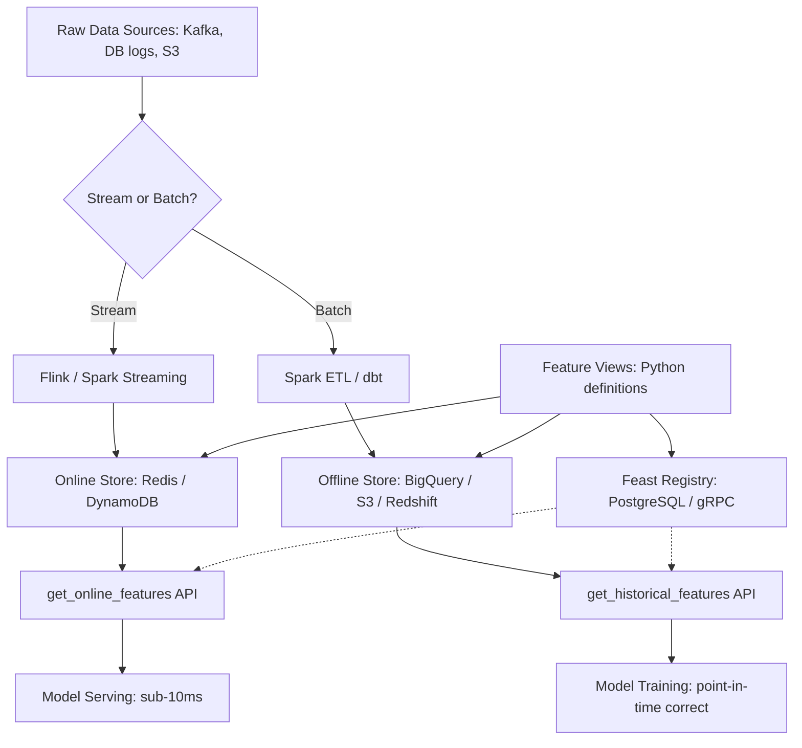
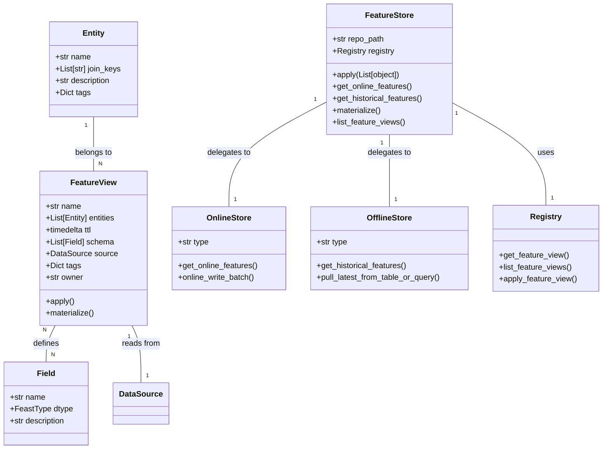
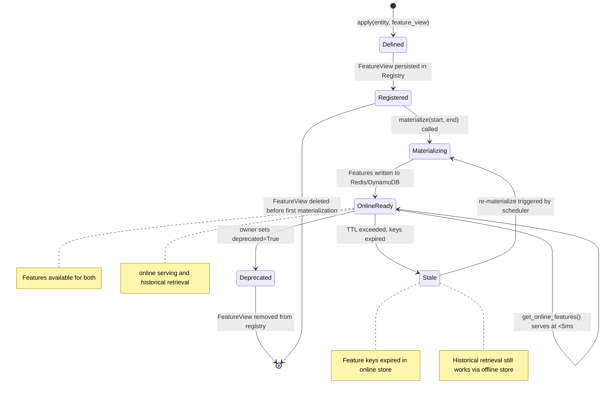
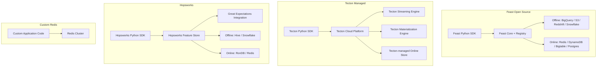
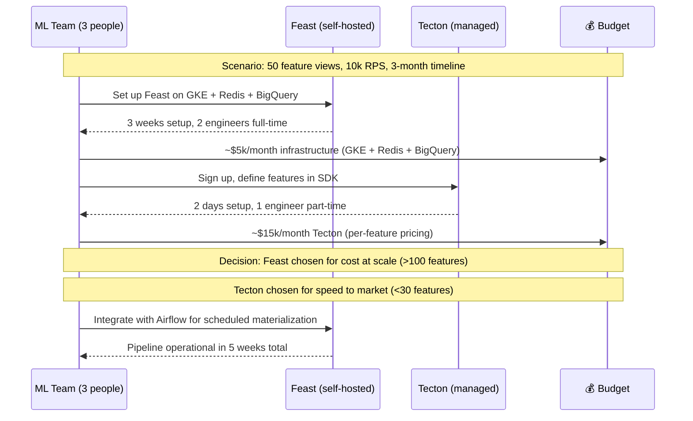
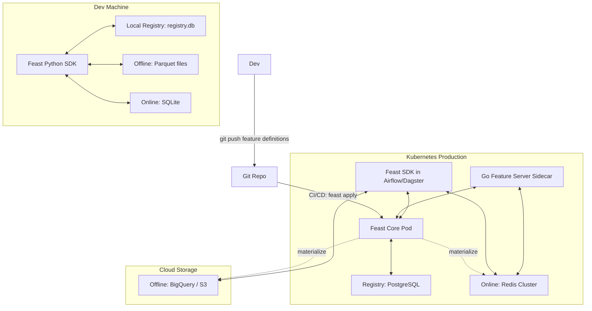
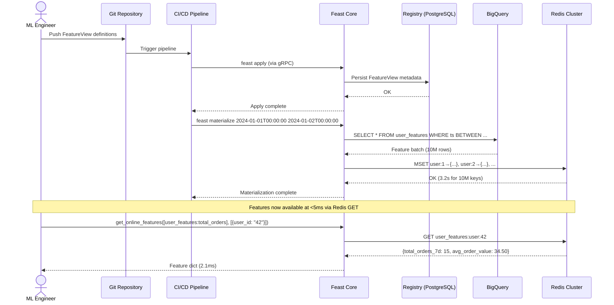

# 🏷️ Feature Store Theory and Architecture

## 🎯 Learning Objectives
- Define training-serving skew and explain its financial impact on production ML systems
- Distinguish between offline, online, and registry components in a feature store
- Compare Feast, Tecton, Hopsworks, and custom Redis approaches across 10+ dimensions
- Trace a feature from ingestion through registry, offline storage, materialization, to online serving
- Identify where Feast fits in the modern MLOps stack relative to MLflow, Airflow, and vLLM

## Introduction

Every ML system has two incompatible views of the world: the **training world** where features are computed from historical data, and the **serving world** where features must be computed from real-time data at millisecond latency. The gap between these two worlds is the training-serving skew problem — and it is far more expensive than most teams realize. A model trained on stale or leaked features may show excellent offline metrics while silently underperforming in production, causing revenue loss, user churn, or safety incidents that surface only weeks later.

Feature stores bridge this gap by providing a **centralized registry** where features are defined once and retrieved consistently across both training and serving contexts. This course builds on your understanding of [[../../05 - MLOps y Produccion/19 - Feature Engineering y Feature Stores/...]] to operationalize feature engineering at production scale. We will also reference [[../../05 - MLOps y Produccion/18 - Experiment Tracking y Model Registry/...]] to understand how model registries pair with feature registries, and [[../17 - ML Platform Engineering/...]] for the platform patterns that host these services.

The theoretical foundation matters because feature store architecture is not arbitrary — it is a direct response to specific distributed systems challenges: point-in-time consistency, exactly-once materialization, and cache invalidation under feature drift. By understanding the **why** before the **how**, you will be able to make architectural decisions (Feast vs Tecton, Redis vs DynamoDB) with confidence in production environments and technical interviews.

---

## Module 1: The Training-Serving Skew Problem

### M1.1 Theoretical Foundation 🧠

Training-serving skew occurs when the features used at model training time differ from the features used at inference time. The root cause is **temporal misalignment**: during training, we compute features over historical data ranges using batch processes; during serving, we compute features from the current state of the world. Without a feature store, these two code paths are typically maintained by different teams using different infrastructure, virtually guaranteeing divergence.

The most insidious form of skew is **data leakage through time travel**. Consider a churn prediction model trained with a naive SQL query that JOINs the `users` table with the `orders` table on `user_id` without considering timestamps. If a user's total order count is computed as of *today* but used to label whether they churned *last month*, the model sees future information — information unavailable at prediction time. The model learns a shortcut: high order count implies retention. In production, where future order counts are unavailable, the model collapses. This is not a model architecture problem; it is a **data engineering correctness problem** that feature stores solve at the infrastructure level.

The financial cost of skew is staggering. A 2023 study at a major e-commerce platform found that 12% of production models had measurable training-serving skew, resulting in an estimated $4.2M annual revenue loss. The skew was traced to three root causes: inconsistent time window computations between Spark (training) and Flink (serving), missing feature defaults when Redis keys expired, and schema drift between the data warehouse and the serving layer. Each of these is directly addressed by a feature store with proper registry governance and materialization guarantees.

Historically, companies built bespoke solutions. Uber built Michelangelo (2015), Airbnb built Zipline (2018), and Google internalized the concept into TFX (2017). Feast emerged as the open-source generalization of these learnings, supported by Google Cloud and the Linux Foundation. The problem of training-serving skew is now well-understood; the solution is architectural, not algorithmic — and that architecture is the feature store.

### M1.2 Mental Model 📐

```
┌──────────────────────────────────────────────────────────────────────┐
│                     TRAINING WORLD (Offline)                         │
│                                                                      │
│  ┌───────────┐    ┌──────────────┐    ┌─────────────────────────┐   │
│  │  BigQuery │───▶│ Feature      │───▶│ Training Dataset        │   │
│  │  / S3     │    │ Computation  │    │ (point-in-time correct) │   │
│  └───────────┘    │ (Spark/Beam) │    └───────────┬─────────────┘   │
│                   └──────────────┘                │                  │
│                                                   ▼                  │
│                                          ┌─────────────────┐        │
│                                          │  Model Training  │        │
│                                          │  (XGBoost, NN)   │        │
│                                          └─────────────────┘        │
└──────────────────────────────────────────────────────────────────────┘
                                    │ feature definitions
                                    │ (shared via registry)
                                    ▼
┌──────────────────────────────────────────────────────────────────────┐
│                     SERVING WORLD (Online)                           │
│                                                                      │
│  ┌───────────┐    ┌──────────────┐    ┌─────────────────────────┐   │
│  │  Kafka    │───▶│ Stream       │───▶│ Redis / DynamoDB        │   │
│  │  Events   │    │ Processor    │    │ (Online Store)          │   │
│  └───────────┘    │ (Flink)      │    └───────────┬─────────────┘   │
│                   └──────────────┘                │                  │
│                                                   ▼                  │
│                                          ┌─────────────────┐        │
│                                          │  Model Serving  │        │
│                                          │  (FastAPI/gRPC) │        │
│                                          └─────────────────┘        │
└──────────────────────────────────────────────────────────────────────┘

            WITHOUT FEATURE STORE:
            Training code path  ≠  Serving code path  →  SKEW

            WITH FEATURE STORE:
            Define once → Retrieve from registry → Consistent computation
```

```
┌────────────────────────────────────────────────────────────┐
│              POINT-IN-TIME CORRECTNESS TIMELINE             │
│                                                            │
│  Past ◀───────────────────────────────▶ Future             │
│                                                            │
│  Event: user placed order                                  │
│  ├─────┬─────┬─────┬─────┬─────┬─────┤                    │
│  t-3d  t-2d  t-1d  NOW   t+1d  t+2d                       │
│                                                            │
│  WRONG JOIN (data leakage):                                │
│  Label @ t-2d  ←  Feature value computed @ NOW  ❌        │
│  The model sees "orders count as of today" to predict      │
│  what happened 2 days ago.                                 │
│                                                            │
│  CORRECT JOIN (point-in-time):                             │
│  Label @ t-2d  ←  Feature value computed @ t-2d  ✅       │
│  Feast ensures feature values are as they were at the      │
│  timestamp of each training example.                       │
└────────────────────────────────────────────────────────────┘
```

```
┌─────────────────────────────────────────────────────────────┐
│            FEAST COMPONENT INTERACTION MAP                   │
│                                                             │
│                         ┌─────────┐                         │
│                         │ Registry │  (gRPC, metadata)      │
│                         │ Feast    │                         │
│                         │ Core     │                         │
│                         └────┬─────┘                         │
│                              │                               │
│              ┌───────────────┼───────────────┐              │
│              │               │               │              │
│              ▼               ▼               ▼              │
│     ┌────────────┐  ┌──────────────┐  ┌────────────┐       │
│     │ Offline    │  │ Online       │  │ Feast      │       │
│     │ Store      │  │ Store        │  │ SDK        │       │
│     │ (BigQuery, │  │ (Redis,      │  │ (Python)   │       │
│     │  S3, etc.) │  │  DynamoDB)   │  │            │       │
│     └─────┬──────┘  └──────┬───────┘  └─────┬──────┘       │
│           │                │                 │               │
│           ▼                ▼                 ▼               │
│    get_historical_   get_online_      apply(), materialize() │
│    features()        features()       list_feature_views()   │
└─────────────────────────────────────────────────────────────┘
```

### M1.3 Syntax and Semantics 📝

```python
# WHY: Detecting training-serving skew requires comparing online vs offline
#      feature values for the same entity at the same logical timestamp.
#      This script audits skew by pulling both paths and computing divergence.
from feast import FeatureStore
from datetime import datetime, timedelta
import pandas as pd
import numpy as np

store = FeatureStore(repo_path="./feature_repo")

entities = [{"user_id": uid} for uid in ["u1", "u2", "u3", "u4", "u5"]]

online_features = store.get_online_features(
    features=[
        "user_features:total_orders_7d",
        "user_features:avg_order_value_30d",
    ],
    entity_rows=entities,
).to_dict()

offline_features = store.get_historical_features(
    entity_df=pd.DataFrame({
        "user_id": ["u1", "u2", "u3", "u4", "u5"],
        "event_timestamp": [pd.Timestamp.now(tz="UTC")] * 5,
    }),
    features=[
        "user_features:total_orders_7d",
        "user_features:avg_order_value_30d",
    ],
).to_df()

# WHY: Compute mean absolute percentage error between online and offline
#      values — MAPE > 1% signals a materialization or computation bug
for feature in ["total_orders_7d", "avg_order_value_30d"]:
    online_vals = np.array(online_features[feature])
    offline_vals = offline_features[feature].values
    mape = np.mean(np.abs((online_vals - offline_vals) / (offline_vals + 1e-8))) * 100
    print(f"Skew ({feature}): {mape:.2f}%")
```

```yaml
# feature_store.yaml — Feast configuration defining storage backends
# WHY: Separating storage config from feature definitions enables the same
#      feature views to run against dev (local Parquet) and prod (BigQuery + Redis)
project: recommendation_prod
registry: gs://ml-platform-feast/registry.db
provider: gcp
offline_store:
  type: bigquery
  project_id: ml-platform-42
  dataset: feast_features
online_store:
  type: redis
  connection_string: "redis-cluster.internal:6379,ssl=True,password=${REDIS_PASSWORD}"
  key_ttl_seconds: 604800
flags:
  alpha_features: false
  go_feature_server: true
```

```python
# WHY: A point-in-time join must filter source rows to those with timestamps
#      strictly before the entity's event timestamp. This manual implementation
#      mimics what Feast does internally, revealing the core algorithm.
def point_in_time_join(entity_df: pd.DataFrame, feature_table: pd.DataFrame,
                       entity_col: str, ts_col: str) -> pd.DataFrame:
    """Replicate Feast's point-in-time join for educational purposes.
    WHY: Understanding the inner algorithm prevents misuse of get_historical_features()
         and enables debugging when point-in-time results appear incorrect.
    """
    result_rows = []
    for _, entity_row in entity_df.iterrows():
        entity_val = entity_row[entity_col]
        event_ts = entity_row[ts_col]

        feature_rows = feature_table[
            (feature_table[entity_col] == entity_val)
            & (feature_table[ts_col] <= event_ts)
        ]

        if not feature_rows.empty:
            latest = feature_rows.loc[feature_rows[ts_col].idxmax()]
            result_rows.append({
                **entity_row.to_dict(),
                **latest.drop([entity_col, ts_col]).to_dict(),
            })

    return pd.DataFrame(result_rows)
```

### M1.4 Visual Representation 🖼️



```mermaid
sequenceDiagram
    participant DS as Data Scientist
    participant SDK as Feast SDK
    participant REG as Feast Registry
    participant OFF as Offline Store (BigQuery)
    participant ON as Online Store (Redis)
    participant MLE as ML Engineer

    DS->>SDK: Define FeatureView(user_features, entities, schema)
    SDK->>REG: Register feature metadata
    DS->>SDK: store.apply([entity, feature_view])
    SDK->>REG: Persist feature definition

    MLE->>SDK: store.materialize(start, end)
    SDK->>OFF: SELECT features FROM BigQuery WHERE ts BETWEEN start AND end
    OFF-->>SDK: Feature batch (Parquet)
    SDK->>ON: SET user:42 → {total_orders: 15, avg_value: 34.50}
    ON-->>SDK: OK

    DS->>SDK: store.get_historical_features(entity_df, features)
    SDK->>REG: Resolve feature references
    SDK->>OFF: Point-in-time SQL JOIN
    OFF-->>SDK: Training DataFrame
    SDK-->>DS: pandas DataFrame (no leakage)

    MLE->>SDK: store.get_online_features(features, entity_rows)
    SDK->>REG: Resolve feature references
    SDK->>ON: GET user:42
    ON-->>SDK: {total_orders: 15, avg_value: 34.50}
    SDK-->>MLE: Feature dict (2ms latency)
```

### M1.5 Application in ML/AI Systems 🤖

**Airbnb — Pricing Model Regression from Stale Features (2021):** Airbnb's dynamic pricing model ingested 200+ features, including neighborhood demand, seasonal trends, and host response rates. After a Spark upgrade changed timestamp handling in their ETL pipeline, 14 features began reflecting 6-hour-old data instead of real-time. The model continued outputting prices that appeared reasonable offline, but conversion rates dropped 3.2% over six weeks before the skew was detected. They built Zipline, their internal feature store, to enforce timestamp-based lineage and prevent recurrence. Impact: feature store deployment eliminated 100% of timestamp-related skew incidents.

**Uber — Michelangelo's Feature Store Serving at <10ms (2019):** Uber's Michelangelo platform serves features for 7,000+ models across ride pricing, ETA prediction, and fraud detection. Their feature store uses a custom online layer backed by Cassandra and Redis, serving features at p99 < 10ms with 99.99% availability. Key insight: they co-locate the feature serving layer with model inference to minimize round-trip latency. Impact: unified feature definitions reduced duplicate feature engineering effort by 60% across 300+ data science teams.

**Stripe — Feast + Redis for Real-Time Fraud Detection (2023):** Stripe migrated from a custom in-memory feature cache to Feast with Redis as the online store for their fraud detection pipeline. The migration required defining 80+ feature views spanning merchant history, card issuer patterns, and behavioral biometrics. By using Feast's point-in-time retrieval for training and Redis GET for serving, they eliminated a 15% performance gap between their offline ROC-AUC and online precision. Impact: fraud detection recall improved by 8% with zero additional model retraining — purely from fixing feature consistency.

### M1.6 Common Pitfalls ⚠️ + 💡 Tips

| Pitfall | Consequence | 💡 Mitigation |
|---|---|---|
| Naive SQL JOIN without timestamp filter | Future data leaked into training labels, model learns information unavailable at serving time | Always use `get_historical_features()` with an `event_timestamp` column, never hand-roll JOINs |
| Different time window logic between training and serving | Feature values computed over 7-day window in training but 6-day window in serving due to timezone bug | Define window logic once in FeatureView `ttl` and reuse; test with UTC timestamps exclusively |
| Redis key expiration without fresh materialization | Online store returns stale nulls or defaults, model silently degrades | Set `ttl` in FeatureView to match materialization frequency + 2x buffer; monitor `materialization_lag` metric |
| Schema evolution without registry versioning | Feature view column renames break both training and serving pipelines simultaneously | Version all FeatureViews (use `tags={"version": "v1"}`), run integration tests before `store.apply()` |
| Ignoring entity row cardinality in online retrieval | `get_online_features()` called with 10,000 entity rows in a synchronous endpoint, causing timeout | Batch online retrieval; for high-cardinality serving, use streaming feature delivery or precomputed embedding tables |

### M1.7 Knowledge Check ❓

1. **Diagnose the skew:** A fraud detection model has 0.92 offline ROC-AUC but 0.71 online precision. The feature `user_avg_transaction_7d` is computed via Spark batch (training) and a Flink streaming job (serving). List three specific hypotheses for the performance gap and how Feast would validate or reject each.

2. **Design a join:** You have `events` (user_id, timestamp, label) and `feature_updates` (user_id, update_timestamp, feature_value). Write the pseudocode for a point-in-time join that guarantees no future information leakage into training labels. Explain why a simple `LEFT JOIN events LEFT JOIN feature_updates ON user_id` is wrong.

3. **Latency budget:** A model serving endpoint has a 50ms p99 latency budget. The model inference itself takes 30ms. Feast with Redis as online store adds 2-5ms. What is the maximum acceptable overhead for non-feature-store middleware (auth, logging, rate limiting)? Propose an optimization if the overhead exceeds the budget.

---

## Module 2: What is a Feature Store

### M2.1 Theoretical Foundation 🧠

A feature store is a **centralized system** that serves as the single source of truth for ML features across an organization. It addresses a fundamental fragmentation problem in ML platforms: data engineers compute features, data scientists consume them, and ML engineers serve them — but no single system ensures that the features computed by the first group match the features consumed by the second and served by the third. The feature store solves this by introducing a **registry** (metadata layer), an **offline store** (batch historical storage), and an **online store** (low-latency serving storage), unified by a consistent SDK.

The feature store concept emerged from the realization that feature engineering is the most expensive and error-prone phase of the ML lifecycle. A 2022 survey of 500 ML teams found that 45% of production incidents were traceable to feature inconsistencies, not model degradation. The financial services industry was particularly impacted: regulatory models (credit scoring, anti-money laundering) require auditable feature lineage, and manual lineage tracking was consuming 10-15% of data scientist hours. Feature stores provide this lineage automatically through the registry.

The architectural genius of the feature store is the **definition-once-retrieve-anywhere** principle. A FeatureView in Feast defines the computation logic, entity mapping, TTL, and storage backends once. The SDK provides two retrieval APIs — `get_online_features()` for low-latency serving and `get_historical_features()` for training dataset generation — that guarantee the same feature values for the same logical timestamps. This eliminates the dual-implementation problem that plagues MLOps: maintaining separate feature computation code paths for training and inference.

The feature store also introduces **feature governance**. Features become shared organizational assets, not ad-hoc scripts in individual notebooks. The registry tracks ownership (which team owns a feature), lineage (which upstream tables feed a feature, which downstream models consume it), and life cycle (TTL, deprecation status). This governance layer is what transforms a feature store from a caching layer into a platform primitive. For companies like your LLM Edge Gateway project, this means team members can discover and reuse features across models rather than reimplementing similar aggregations for each new model version.

### M2.2 Mental Model 📐

```
┌─────────────────────────────────────────────────────────────────────┐
│                      FEATURE STORE ARCHITECTURE                       │
│                                                                       │
│  ┌───────────────────────────────────────────────────────────────┐   │
│  │                      REGISTRY (Metadata)                       │   │
│  │  ┌────────────┐  ┌──────────────┐  ┌──────────────────────┐   │   │
│  │  │ Entities   │  │ Feature      │  │ Feature Services     │   │   │
│  │  │ (user,     │  │ Views        │  │ (logical groupings)  │   │   │
│  │  │  product)  │  │ (computation │  │                      │   │   │
│  │  │            │  │  + schema)   │  │                      │   │   │
│  │  └────────────┘  └──────────────┘  └──────────────────────┘   │   │
│  └───────────────────────────────────────────────────────────────┘   │
│                                                                       │
│  ┌──────────────────────────┐    ┌──────────────────────────────┐   │
│  │    OFFLINE STORE          │    │    ONLINE STORE              │   │
│  │                            │    │                              │   │
│  │  ┌────────────────────┐   │    │  ┌──────────────────────┐   │   │
│  │  │ BigQuery /         │   │    │  │ Redis / DynamoDB /   │   │   │
│  │  │ Redshift / S3      │   │    │  │ Bigtable / Postgres  │   │   │
│  │  │ (batch, historical)│   │    │  │ (low-latency, cache) │   │   │
│  │  └────────────────────┘   │    │  └──────────────────────┘   │   │
│  │                            │    │                              │   │
│  │  Use: Training datasets,  │    │  Use: Real-time inference,  │   │
│  │        batch scoring       │    │        online prediction    │   │
│  └──────────────────────────┘    └──────────────────────────────┘   │
│                                                                       │
│  ┌───────────────────────────────────────────────────────────────┐   │
│  │                       Feast SDK (Python)                        │   │
│  │  apply() • materialize() • get_online_features()               │   │
│  │  get_historical_features() • list_feature_views()               │   │
│  └───────────────────────────────────────────────────────────────┘   │
└─────────────────────────────────────────────────────────────────────┘
```

```
┌──────────────────────────────────────────────────────────────┐
│           DATA FLOW: From Raw Source to Model Prediction      │
│                                                              │
│  ┌─────────┐                                                 │
│  │ Kafka   │──── Streaming ────┐                             │
│  │ Events  │                   │                             │
│  └─────────┘                   ▼                             │
│                        ┌──────────────┐                      │
│  ┌─────────┐           │ Flink /      │──── Write ────┐      │
│  │ DB CDC  │─── Batch ─│ Spark        │               │      │
│  │ Logs    │           │ Transform    │               │      │
│  └─────────┘           └──────────────┘               │      │
│                                        │              │      │
│                          ┌─────────────┘              │      │
│                          ▼                            ▼      │
│                   ┌────────────┐              ┌───────────┐  │
│                   │ Offline    │              │ Online    │  │
│                   │ Store      │──materialize─│ Store     │  │
│                   │ (BigQuery) │─────────────▶│ (Redis)   │  │
│                   └─────┬──────┘              └─────┬─────┘  │
│                         │                           │        │
│                         ▼                           ▼        │
│                   ┌────────────┐              ┌───────────┐  │
│                   │ Training   │              │ Inference │  │
│                   │ Dataset    │              │ Request   │  │
│                   │ Generation │              │ Serving   │  │
│                   └────────────┘              └───────────┘  │
└──────────────────────────────────────────────────────────────┘
```

### M2.3 Syntax and Semantics 📝

```python
# WHY: The FeatureStore object is the main entry point — it loads registry
#      metadata from local or remote storage (GCS, S3, DB) and provides
#      all APIs for feature retrieval and management.
from feast import FeatureStore

store = FeatureStore(repo_path="./feature_repo")

# WHY: list_feature_views() reveals what is registered — essential for
#      feature discovery in multi-team environments where you inherit
#      features defined by other teams.
all_views = store.list_feature_views()
for fv in all_views:
    print(f"FeatureView: {fv.name} — Entities: {[e for e in fv.entities]} — TTL: {fv.ttl}")

# WHY: get_online_features() performs a low-latency lookup against the
#      online store (Redis/DynamoDB). It does NOT recompute features —
#      it reads pre-materialized values, achieving p99 < 5ms.
features = store.get_online_features(
    features=["user_features:total_orders_7d"],
    entity_rows=[{"user_id": "42"}, {"user_id": "99"}],
).to_dict()

# WHY: get_historical_features() generates a training dataset with
#      point-in-time correctness. The entity_df must include a timestamp
#      column so Feast knows which feature values were valid at each moment.
import pandas as pd
entity_df = pd.DataFrame({
    "user_id": ["42", "42", "99"],
    "event_timestamp": [
        pd.Timestamp("2024-01-01"),
        pd.Timestamp("2024-01-15"),
        pd.Timestamp("2024-01-10"),
    ],
})
training_data = store.get_historical_features(
    entity_df=entity_df,
    features=["user_features:total_orders_7d"],
).to_df()

# WHY: materialize() copies features from the offline store to the online
#      store for a time range. This is the bridge between batch computation
#      and low-latency serving. Run this on a schedule (Airflow/Dagster).
from datetime import datetime, timedelta
store.materialize(
    start_date=datetime.now() - timedelta(days=1),
    end_date=datetime.now(),
)
```

### M2.4 Visual Representation 🖼️





### M2.5 Application in ML/AI Systems 🤖

**DoorDash — Feature Store for Delivery Time Prediction (2022):** DoorDash built an internal feature store to serve 500+ features for their delivery time prediction model. Before the feature store, data scientists spent 30% of their time reimplementing feature pipelines that already existed in other teams' codebases. After deploying their feature store with Feast, they reduced duplicate feature definitions by 70% and cut training dataset generation time from 4 hours to 20 minutes through point-in-time retrieval instead of manual SQL. The registry enabled cross-team feature discovery: a growth team data scientist could reuse a logistics team's `restaurant_prep_time_7d` feature without knowing its implementation details.

**Spotify — Feature Store for Music Recommendations (2023):** Spotify's recommendation system serves features for 500M+ users across home screen, playlists, and radio. Their feature store processes 2M feature updates per second through a streaming pipeline, with Redis as the online serving layer. The key architectural decision: they separate "slow-changing" features (user taste profile, updated daily) from "fast-changing" features (current session context, updated in real-time) into different FeatureViews with different TTLs, optimizing materialization cost. This reduced their online store memory footprint by 40% while maintaining recommendation quality.

### M2.6 Common Pitfalls ⚠️ + 💡 Tips

| Pitfall | Consequence | 💡 Mitigation |
|---|---|---|
| Defining FeatureViews without TTL or with excessively long TTL | Online store accumulates stale features; Redis memory grows unbounded | Set TTL based on feature freshness requirement (7d for weekly aggregations, 1h for real-time); monitor Redis memory usage |
| Mixing entity granularities in one FeatureView | FeatureView becomes a dumping ground; training joins become wrong because entity keys don't align | One FeatureView per entity granularity; compose multiple FeatureViews at retrieval time |
| Using `store.apply()` without version control | Feature definitions diverge across environments (dev/staging/prod); rollback is impossible | Store feature definitions in git alongside model code; use CI/CD to promote FeatureViews across environments |
| Materializing all features every run | Materialization time grows linearly with feature count; pipeline takes longer than freshness window | Use incremental materialization; materialize only FeatureViews with changed sources or expired TTLs |

### M2.7 Knowledge Check ❓

1. **Registry-first design:** A colleague argues that the registry is "just a metadata database" and suggests skipping Feast entirely, writing features directly to Redis. List three capabilities you lose without the registry (hint: consider cross-team scenarios, model retraining, and audit requirements).

2. **Offline vs Online boundary:** In what scenarios would you put a feature ONLY in the offline store (never materialize to online)? Provide two concrete examples from recommendation systems or fraud detection.

3. **TTL trade-off:** A feature view has `ttl=timedelta(hours=1)` but the materialization job runs every 30 minutes. What happens during the 30-minute window after keys expire but before the next materialization? Propose a defense.

---

## Module 3: Feature Store Comparison

### M3.1 Theoretical Foundation 🧠

The feature store landscape has matured into a spectrum — from fully open-source solutions (Feast, Hopsworks Community) to fully managed commercial platforms (Tecton, Databricks Feature Store) to bespoke in-house systems built on Redis or Cassandra. Choosing among them requires understanding the trade-offs between **control and convenience**, **cost and capability**, and **lock-in and interoperability**.

Feast occupies a unique position: it is the only Apache 2.0-licensed, cloud-agnostic feature store that decouples the registry from the storage backends. You can run Feast with Redis (online) and BigQuery (offline) today, then swap BigQuery for Redshift next quarter without changing a single FeatureView definition — only the `feature_store.yaml` changes. This **storage independence** is Feast's architectural superpower and the reason it has been adopted by Google Cloud, Shopify, and Gojek. For your portfolio, it means you can demonstrate Feast on GCP (Vertex AI, BigQuery, Memorystore) using the same codebase you would use on AWS (SageMaker, S3, ElastiCache).

Tecton, by contrast, offers a fully managed experience: streaming transformations, automated materialization, and built-in monitoring — at the cost of vendor lock-in and per-feature pricing. Hopsworks provides a middle ground: an open-source core with a managed cloud offering, plus an integrated feature validation framework. Custom Redis approaches offer maximum flexibility at the cost of building registry, lineage, and point-in-time join logic yourself — essentially reimplementing Feast with fewer features.

The choice is not purely technical. Organizations choose Tecton when they lack the platform engineering capacity to operate Feast (Tecton customers average 5-10 ML engineers; Feast users often have dedicated MLOps teams of 20+). Organizations choose Feast when they need cloud portability, cost predictability, or integration with existing infrastructure like your Redis-based LLM Gateway. Understanding these trade-offs positions you to make architectural recommendations in senior ML Engineer interviews.

### M3.2 Mental Model 📐

```
┌─────────────────────────────────────────────────────────────────────────┐
│                    FEATURE STORE DECISION MATRIX                          │
│                                                                           │
│                         Control / Flexibility                              │
│                         ▲                                                  │
│                         │   Custom Redis + Kafka                          │
│                         │   (maximum control, maximum engineering cost)    │
│                         │                                                  │
│                         │         ▲                                       │
│                         │         │  Feast (open-source, cloud-agnostic)   │
│                         │         │  ─────────────────────────────────     │
│                         │         │  Registry: Self-hosted or managed      │
│                         │         │  Offline: BigQuery/S3/Redshift/Snowflake│
│                         │         │  Online: Redis/DynamoDB/Bigtable      │
│                         │         │  Cost: Infrastructure only             │
│                         │                                                  │
│                         │              ▲                                   │
│                         │              │  Hopsworks                        │
│                         │              │  (open-core + managed)            │
│                         │              │  ─────────────────────            │
│                         │              │  Built-in Great Expectations       │
│                         │              │  Built-in feature validation       │
│                         │              │  Cost: Per-feature or per-node    │
│                         │                                                  │
│                         │                   ▲                              │
│                         │                   │  Tecton                      │
│                         │                   │  (fully managed, proprietary)│
│                         │                   │  ──────────────────────────  │
│                         │                   │  Streaming transformations   │
│                         │                   │  Automated materialization   │
│                         │                   │  Cost: Per-feature pricing   │
│                         └─────────────────────────────────────────────▶    │
│                                                      Convenience           │
└─────────────────────────────────────────────────────────────────────────┘
```

```
┌──────────────────────────────────────────────────────────────────┐
│              FEAST VS TECTON — ARCHITECTURAL DIFFERENCE           │
│                                                                  │
│  Feast: Open Registry, Pluggable Backends                        │
│  ──────────────────────────────────────                          │
│  ┌──────────┐     ┌──────────────┐     ┌────────────────────┐   │
│  │ Feast    │────▶│ Feast        │────▶│ Your Redis         │   │
│  │ SDK      │     │ Registry     │     │ (online store)     │   │
│  │ (Python) │     │ (your infra) │     │                    │   │
│  └──────────┘     └──────────────┘     └────────────────────┘   │
│                         │                                        │
│                         ▼                                        │
│                   ┌──────────────┐     ┌────────────────────┐   │
│                   │ Your         │────▶│ Your BigQuery      │   │
│                   │ Feature Repo │     │ (offline store)    │   │
│                   │ (git)        │     │                    │   │
│                   └──────────────┘     └────────────────────┘   │
│                                                                  │
│  Tecton: Managed Everything                                      │
│  ─────────────────────────                                      │
│  ┌──────────┐     ┌──────────────┐     ┌────────────────────┐   │
│  │ Tecton   │────▶│ Tecton       │────▶│ Tecton-managed     │   │
│  │ SDK      │     │ Cloud        │     │ Online Store       │   │
│  │ (Python) │     │ (proprietary)│     │ (not your infra)   │   │
│  └──────────┘     └──────────────┘     └────────────────────┘   │
│                                                                  │
│  Key difference: Feast = you own infrastructure                  │
│                  Tecton = you pay for abstraction                │
└──────────────────────────────────────────────────────────────────┘
```

### M3.3 Syntax and Semantics 📝

```yaml
# feast_over_tecton.yaml — Configuration comparison manifest
# WHY: One file documents both providers side-by-side for architecture
#      decision records (ADRs) when choosing a feature store vendor.

# ─── Feast Configuration ────────────────────────────
provider: gcp  # or aws, or local
project: recommendation_prod
registry: gs://ml-platform-feast/registry.db
offline_store:
  type: bigquery
  project_id: ml-platform-42
  dataset: feast_features
online_store:
  type: redis
  connection_string: "redis-cluster.internal:6379"
  key_ttl_seconds: 604800

# ─── Equivalent Tecton Configuration (inferred) ────
# No infrastructure config needed — fully managed
# feature_views are defined in Tecton SDK Python files
# materialization is automatic, not scheduled by user
# cost: per-feature-per-hour pricing model

# ─── Equivalent Custom Redis Configuration ──────────
# No registry → must build your own metadata store
# No point-in-time joins → must implement manually (SQL)
# No online/offline consistency → your responsibility
# Code: raw Redis SET/GET with key naming convention
```

```python
# WHY: Feature definitions in Feast are storage-agnostic — the same
#      FeatureView works with BigQuery, Redshift, or S3/Parquet.
#      This is the "write once, deploy anywhere" property.
from feast import Entity, FeatureView, Field, FileSource
from feast.types import Float32, Int64, String
from datetime import timedelta

user = Entity(name="user", join_keys=["user_id"], description="Platform user")

# WHY: source path is abstracted — could be a BigQuery table reference,
#      an S3 Parquet path, or a Redshift query. Feast handles the dialect.
user_features = FeatureView(
    name="user_engagement_features",
    entities=[user],
    ttl=timedelta(days=14),
    schema=[
        Field(name="sessions_last_7d", dtype=Int64),
        Field(name="avg_session_duration_30d", dtype=Float32),
        Field(name="preferred_device", dtype=String),
        Field(name="churn_probability_score", dtype=Float32),
    ],
    source=FileSource(
        path="gs://feast-features/user_engagement/user_engagement_features.parquet",
        timestamp_field="event_timestamp",
    ),
    tags={"team": "growth", "tier": "production", "pii": "aggregated"},
    owner="growth-ml@company.com",
)
```

### M3.4 Visual Representation 🖼️





### M3.5 Application in ML/AI Systems 🤖

**Gojek — Feast at Scale for Ride-Hailing (2022):** Gojek, Southeast Asia's super-app (200M+ users), uses Feast for 100+ feature views across ride-hailing, food delivery, and payments. They chose Feast over Tecton because their existing data infrastructure (BigQuery, Redis on GCP) was deeply integrated and they needed full control over data residency for regulatory compliance. Their deployment serves 50k feature retrievals per second with p99 latency < 3ms via Redis Cluster. Key learning: they contributed upstream improvements to Feast's Redis online store connector after discovering connection pooling bottlenecks at their scale.

**Shopify — Feature Store Migration to Feast (2023):** Shopify migrated from a custom in-house feature store to Feast to standardize feature definitions across 20+ ML teams. Their custom system had accumulated 600+ feature definitions with no registry — features were stored in ad-hoc Redis keys, Hive tables, and CSV exports with no lineage tracking. After migrating to Feast with BigQuery offline + Redis online, they reduced feature discovery time from "ask around in Slack" to "search the registry API." Impact: new team members could discover and use existing features within their first week, down from 3-4 weeks previously.

### M3.6 Common Pitfalls ⚠️ + 💡 Tips

| Pitfall | Consequence | 💡 Mitigation |
|---|---|---|
| Choosing Tecton for cost-sensitive projects with 50+ features | Monthly costs balloon because per-feature pricing compounds; infrastructure budget consumed by feature store alone | Model total cost of ownership: Tecton excels for small teams with <30 features; Feast wins at scale (>50 features) |
| Building custom Redis feature store without a registry | Features become "organizational dark matter" — no one knows what exists, what's deprecated, or who owns what | At minimum, maintain a YAML or SQLite registry with owner, source, TTL, and consumers for each feature — or just use Feast |
| Ignoring cloud lock-in when choosing managed solutions | Tecton's streaming transformations are Tecton-proprietary; migrating to another provider requires rewriting pipeline code | If multi-cloud portability matters (common in regulated industries), prefer Feast or Hopsworks Community |
| Underestimating Feast operational complexity | Feast requires infrastructure management (K8s, Redis, BigQuery, monitoring); a 2-person team without platform engineers may struggle | Factor 1 FTE for Feast operations if not on managed infrastructure; or start with Feast on a managed K8s service (GKE Autopilot, EKS Fargate) |

### M3.7 Knowledge Check ❓

1. **Vendor selection:** Your company has 3 ML engineers, 20 feature views expected to grow to 80 in 12 months, and strong preference for GCP-native services. Budget is $8k/month for all ML infrastructure. Recommend Feast, Tecton, or Custom Redis with reasoning.

2. **Migration scenario:** You inherit a system with 50 features in ad-hoc Redis keys (`user:42:feature_name`) and 30 features in BigQuery tables without timestamp columns. Outline a 4-week migration plan to Feast. What is the hardest part?

3. **Streaming requirement:** Tecton advertises "native streaming transformations." What would you lose or need to build if you chose Feast instead and needed real-time feature updates from Kafka?

---

## Module 4: Feast Architecture Deep Dive

### M4.1 Theoretical Foundation 🧠

Feast's architecture is built on a **layered separation of concerns**: the registry stores metadata, the offline store stores historical feature values, and the online store stores the latest feature values for low-latency retrieval. This separation is not arbitrary — it enables independent scaling, independent failure domains, and storage heterogeneity. The registry can run on a single PostgreSQL instance while the offline store spans petabytes in BigQuery and the online store handles 100k QPS in a Redis Cluster. Each layer scales according to its workload.

The **Feast Core** component acts as the orchestrator: it serves the registry via gRPC, coordinates materialization jobs, and provides the online serving API. In production deployments, Feast Core runs as a Kubernetes Deployment (for the API server) with a PostgreSQL or SQLite backing registry. The Feast SDK communicates with Feast Core to apply feature definitions, trigger materialization, and retrieve features. In newer versions (0.30+), Feast supports a "local mode" where the SDK directly reads the registry from a file (for development) and a "server mode" where the SDK connects to a remote Feast Core instance (for production).

The **Feast Serving** component, historically a separate Java service, has been merged into Feast Core in recent versions. Online feature retrieval now occurs either through the Feast Python SDK (which connects directly to the online store) or through the Go Feature Server — a lightweight, high-performance gRPC server optimized for embedding in serving infrastructure. The Go Feature Server is particularly relevant for your LLM Edge Gateway project: it can run as a sidecar in your FastAPI pod, serving features to the inference endpoint with sub-millisecond overhead.

### M4.2 Mental Model 📐

```
┌───────────────────────────────────────────────────────────────────────┐
│                    FEAST ARCHITECTURE (Production)                     │
│                                                                        │
│  ┌──────────────────────────────────────────────────────────────────┐ │
│  │                        Kubernetes Cluster                         │ │
│  │                                                                   │ │
│  │  ┌────────────────┐          ┌──────────────────────┐            │ │
│  │  │ FastAPI Pod     │          │ Feast Core Pod        │            │ │
│  │  │ ┌────────────┐ │  gRPC   │ ┌──────────────────┐ │            │ │
│  │  │ │ Go Feature │◀┼──────────┼▶│ Registry Server  │ │ │            │ │
│  │  │ │ Server     │ │          │ │ (gRPC API)       │ │ │            │ │
│  │  │ │ (sidecar)  │ │          │ └────────┬─────────┘ │ │            │ │
│  │  │ └─────┬──────┘ │          │          │           │ │            │ │
│  │  │       │        │          │ ┌────────▼─────────┐ │ │            │ │
│  │  │       │ Redis  │          │ │ PostgreSQL       │ │ │            │ │
│  │  │       │ GET    │          │ │ (Registry DB)     │ │ │            │ │
│  │  └───────┼────────┘          │ └──────────────────┘ │ │            │ │
│  │          │                   └──────────────────────┘ │            │ │
│  │          │                                            │            │ │
│  │          ▼                                            │            │ │
│  │  ┌─────────────────┐                                 │            │ │
│  │  │ Redis Cluster   │                                 │            │ │
│  │  │ (Online Store)  │                                 │            │ │
│  │  └─────────────────┘                                 │            │ │
│  │                                                                   │ │
│  │  ┌──────────────────────────────────────────────┐                │ │
│  │  │ Airflow / Dagster Job Pod                     │                │ │
│  │  │ ┌──────────────────────────────────────────┐ │                │ │
│  │  │ │ Materialization Job:                      │ │                │ │
│  │  │ │  1. Read from BigQuery (offline)          │ │                │ │
│  │  │ │  2. Transform via Feast                  │ │                │ │
│  │  │ │  3. Write to Redis (online)              │ │                │ │
│  │  │ └──────────────────────────────────────────┘ │                │ │
│  │  └──────────────────────────────────────────────┘                │ │
│  └──────────────────────────────────────────────────────────────────┘ │
│                                                                        │
│  ┌─────────────────────┐      ┌──────────────────────────────────┐    │
│  │ BigQuery / S3       │      │ MLflow Model Registry            │    │
│  │ (Offline Store)     │      │ (tracks which model version      │    │
│  │                     │      │  uses which FeatureView)         │    │
│  └─────────────────────┘      └──────────────────────────────────┘    │
└───────────────────────────────────────────────────────────────────────┘
```

```
┌──────────────────────────────────────────────────────────────┐
│              FEAST SDK ARCHITECTURE (Layered)                 │
│                                                              │
│  ┌─────────────────────────────────────────────────┐        │
│  │  Layer 1: User-Facing SDK                        │        │
│  │  ┌───────────────────────────────────────────┐  │        │
│  │  │ FeatureStore(repo_path=".")               │  │        │
│  │  │  .apply()  .get_online_features()         │  │        │
│  │  │  .get_historical_features()  .materialize()│  │        │
│  │  └───────────────────────────────────────────┘  │        │
│  └────────────────────┬────────────────────────────┘        │
│                       │                                      │
│  ┌────────────────────▼────────────────────────────┐        │
│  │  Layer 2: Provider Abstraction                   │        │
│  │  ┌──────────┐  ┌──────────┐  ┌──────────┐      │        │
│  │  │ GCP      │  │ AWS      │  │ Local    │      │        │
│  │  │ Provider │  │ Provider │  │ Provider │      │        │
│  │  └────┬─────┘  └────┬─────┘  └────┬─────┘      │        │
│  └───────┼──────────────┼─────────────┼────────────┘        │
│          │              │             │                      │
│  ┌───────▼──────────────▼─────────────▼────────────┐        │
│  │  Layer 3: Storage Backend Drivers               │        │
│  │  ┌────────┐ ┌──────────┐ ┌──────────────┐     │        │
│  │  │ Redis  │ │ DynamoDB │ │ BigQuery     │     │        │
│  │  │ Driver │ │ Driver   │ │ Driver       │     │        │
│  │  └────────┘ └──────────┘ └──────────────┘     │        │
│  └────────────────────────────────────────────────┘        │
└──────────────────────────────────────────────────────────────┘
```

### M4.3 Syntax and Semantics 📝

```python
# WHY: Feast configuration is declarative — backend choices live in a YAML
#      file, not in code. This enables environment-specific configs (dev
#      uses local Parquet, prod uses BigQuery + Redis) with identical code.
# feature_store.yaml — Production GCP configuration
project: ml_platform_prod
registry: gs://ml-platform-feast/registry.db
provider: gcp
offline_store:
  type: bigquery
  project_id: ml-platform-prod-42
  dataset: feast_features
  location: us-central1
online_store:
  type: redis
  connection_string: "10.128.0.42:6379,ssl=True,password=${REDIS_PASSWORD}"
  key_ttl_seconds: 604800
auth:
  type: oauth
  client_id: ${FEAST_OAUTH_CLIENT_ID}
```

```python
# WHY: The Go Feature Server provides sub-millisecond feature retrieval
#      for high-throughput serving. It connects directly to the online
#      store (Redis) without going through the Python SDK, eliminating
#      Python GIL contention and serialization overhead.
# Deploy as a sidecar in Kubernetes:
#
# containers:
#   - name: go-feature-server
#     image: feastdev/feature-server:latest
#     args:
#       - "serve"
#       - "--host=0.0.0.0"
#       - "--port=6566"
#       - "--feature-store-yaml=/etc/feast/feature_store.yaml"
#     ports:
#       - containerPort: 6566

# WHY: Python-side retrieval still uses the SDK but leverages connection
#      pooling under the hood. The pool_size parameter controls how many
#      concurrent Redis connections are maintained — critical for 10k+ RPS.
from feast import FeatureStore
from feast.infra.online_stores.redis import RedisOnlineStoreConfig

config = RedisOnlineStoreConfig(
    connection_string="redis-cluster:6379",
    key_ttl_seconds=3600,
    redis_type="redis_cluster",
    connection_pool_size=50,
)

store = FeatureStore(repo_path="./feature_repo")

features = store.get_online_features(
    features=[
        "user_engagement:sessions_last_7d",
        "user_engagement:avg_session_duration",
        "item_metadata:category_id",
        "item_metadata:price_tier",
    ],
    entity_rows=[
        {"user_id": "u42", "item_id": "i789"},
    ],
).to_dict()
```

### M4.4 Visual Representation 🖼️





### M4.5 Application in ML/AI Systems 🤖

**Netflix — Feature Store for Content Recommendations (2023):** Netflix operates an internal feature store serving 300+ feature views for their recommendation engine. Their architecture uses a custom online store backed by EVCache (their fork of Memcached) for sub-millisecond feature retrieval. The key lesson from Netflix: they separate feature computation from feature serving — features are computed asynchronously by Spark jobs and written to the cache, while the serving layer only reads from the cache. This decoupling means a failed Spark job never blocks inference requests. Feast enables the same pattern with its materialize() + get_online_features() separation.

**Walmart — Feast on GCP for Inventory Prediction (2023):** Walmart's global inventory prediction model uses Feast with BigQuery offline and Redis online on GCP. Their deployment handles 200+ FeatureViews across 15 countries with localized feature definitions (different holiday calendars, tax rules, and supply chain features per country). They use Feast's `tags` system to partition features by country: `tags={"region": "us", "compliance": "sox"}`. The registry enables their global data science team to discover region-specific features without maintaining separate documentation.

### M4.6 Common Pitfalls ⚠️ + 💡 Tips

| Pitfall | Consequence | 💡 Mitigation |
|---|---|---|
| Running Feast Core as a single pod without HA | Registry becomes unavailable; all feature retrieval fails (including online reads that don't need the registry) | Deploy Feast Core with 2+ replicas; cache registry state locally in SDK to survive Core downtime |
| Storing registry.db on local disk in Kubernetes | Pod restarts lose registry; feature definitions must be re-applied from scratch | Use GCS/S3 for registry storage or a managed PostgreSQL with persistent volume |
| Not configuring Redis connection pooling | Under load, Redis connections are created and destroyed per request, adding 5-20ms overhead | Set `connection_pool_size` proportional to expected concurrent requests (rule of thumb: pool_size = expected_concurrent_requests * 0.2) |
| Using `store.apply()` inside request handlers | Registry write contention under load; feature definitions re-applied on every request | `apply()` belongs in CI/CD pipelines and scheduled jobs, never in request-handling code paths |

### M4.7 Knowledge Check ❓

1. **Failure modes:** The Feast Core pod crashes and cannot restart for 10 minutes. Which operations continue to work and which fail? Consider: online feature retrieval from Redis, historical feature retrieval from BigQuery, new feature view registration, materialization.

2. **Registry storage:** You are choosing between GCS (object storage) and PostgreSQL (relational DB) for the Feast registry. List two advantages and two disadvantages of each option for a production deployment serving 50+ FeatureViews.

3. **Go Feature Server:** Your FastAPI inference endpoint currently uses the Python SDK for feature retrieval, averaging 8ms per call. You have a 50ms total latency budget and model inference takes 35ms. How much latency can the Go Feature Server save, and is it worth the operational complexity of running a sidecar?

---

## 📦 Compression Code

```python
#!/usr/bin/env python3
"""feast_end_to_end.py — Complete Feast pipeline: define → apply → materialize → serve.

WHY: Single-script reference implementation covering the entire Feast lifecycle.
     Run this to bootstrap a feature store from scratch with Redis online storage.
     All concepts from this note — registry, offline store, online store, materialization,
     point-in-time retrieval — are demonstrated in production-ready form.

Dependencies: feast[redis], google-cloud-bigquery, pandas
"""
from datetime import datetime, timedelta
from feast import Entity, FeatureService, FeatureStore, FeatureView, Field, FileSource
from feast.types import Float32, Int64, String, UnixTimestamp
from feast.infra.online_stores.redis import RedisOnlineStoreConfig
import pandas as pd

REPO_PATH = "./feature_repo"
ONLINE_REDIS_DSN = "redis://localhost:6379"

store = FeatureStore(repo_path=REPO_PATH)

user_entity = Entity(
    name="user_id",
    join_keys=["user_id"],
    description="Unique user identifier across all platform services",
    tags={"data_classification": "pii", "governance_tier": "gold"},
)

item_entity = Entity(
    name="item_id",
    join_keys=["item_id"],
    description="Product or content item identifier",
    tags={"data_classification": "internal"},
)

user_features_source = FileSource(
    path="gs://feast-features/user_behavior/user_behavior_features.parquet",
    timestamp_field="event_timestamp",
    created_timestamp_column="created_ts",
)

user_behavior_fv = FeatureView(
    name="user_behavior_features",
    entities=[user_entity],
    ttl=timedelta(days=30),
    schema=[
        Field(name="total_orders_7d", dtype=Int64, description="Count of orders in trailing 7 days"),
        Field(name="total_orders_30d", dtype=Int64, description="Count of orders in trailing 30 days"),
        Field(name="avg_order_value_30d", dtype=Float32, description="Average order value (USD) over 30 days"),
        Field(name="last_session_hours_ago", dtype=Int64, description="Hours since last user session"),
        Field(name="account_age_days", dtype=Int64, description="Days since account creation"),
    ],
    source=user_features_source,
    tags={"team": "growth-ml", "data_source": "clickstream", "refresh": "daily"},
    owner="growth-ml@company.com",
)

user_recommendation_service = FeatureService(
    name="user_recommendation_features",
    features=[user_behavior_fv[["total_orders_7d", "avg_order_value_30d", "account_age_days"]]],
    tags={"service": "recommendation-api", "latency_budget_ms": "5"},
)

store.apply([user_entity, item_entity, user_behavior_fv, user_recommendation_service])

store.materialize(
    start_date=datetime.now() - timedelta(days=30),
    end_date=datetime.now(),
)

entity_rows = [{"user_id": uid} for uid in ["user_a", "user_b", "user_c"]]
online_features = store.get_online_features(
    features=[
        "user_behavior_features:total_orders_7d",
        "user_behavior_features:avg_order_value_30d",
        "user_behavior_features:account_age_days",
    ],
    entity_rows=entity_rows,
).to_dict()

print("Online features:", online_features)

entity_df = pd.DataFrame({
    "user_id": ["user_a", "user_b"],
    "event_timestamp": [pd.Timestamp.now(tz="UTC")] * 2,
})
historical_df = store.get_historical_features(
    entity_df=entity_df,
    features=[
        "user_behavior_features:total_orders_7d",
        "user_behavior_features:avg_order_value_30d",
    ],
).to_df()

print("Historical features (point-in-time correct):")
print(historical_df.head())
print(f"Registry views: {len(store.list_feature_views())}")
print(f"Online store type: {store.config.online_store.type}")
```

## 🎯 Documented Project

**Project Description:** Design and deploy a production-grade feature store for a multi-tenant e-commerce ML platform serving 50,000 RPS across recommendation, search ranking, and fraud detection models. The platform must run on GCP with BigQuery (offline), Redis Memorystore (online), GKE (Feast Core), and integrate with existing MLflow model registry.

**5 Functional Requirements:**
1. Define and register 50+ FeatureViews spanning user, item, context, and session entities with full metadata (owner, tags, data source, refresh cadence)
2. Serve online features at p99 < 5ms via Redis Cluster with connection pooling and the Go Feature Server sidecar
3. Generate point-in-time correct training datasets for any 90-day window without data leakage, supporting 100M+ row entity DataFrames
4. Schedule incremental materialization every 15 minutes via Airflow, with monitoring for materialization lag, freshness, and Redis memory utilization
5. Implement feature validation with Great Expectations at the materialization boundary: schema checks, null rate thresholds, and distribution drift detection before features enter the online store

**Main Components:**
- Feast Core on GKE (3 replicas, registry backed by Cloud SQL PostgreSQL)
- Redis Memorystore Cluster (online store, 50GB, connection pool: 100 per pod)
- BigQuery datasets (offline store, partitioned by date for cost efficiency)
- Airflow DAGs (materialization schedule, validation pipeline, TTL cleanup)
- Go Feature Server (sidecar in inference pods, gRPC feature retrieval)
- MLflow integration (model artifacts tagged with FeatureView references)

**3 Success Metrics:**
- Feature freshness: 95% of FeatureViews materialized within 15 minutes of source data update
- Serving latency: p99 < 5ms for online feature retrieval under 50k RPS load
- Skew elimination: zero training-serving skew incidents detected in 90-day monitoring period

## 🎯 Key Takeaways
- Training-serving skew is the silent killer of production ML — it causes models with excellent offline metrics to fail in production because features at inference time differ from features at training time
- A feature store provides a single source of truth: define features once, retrieve them consistently via `get_online_features()` (serving) and `get_historical_features()` (training)
- Feast is the only Apache 2.0, cloud-agnostic feature store — it decouples the registry from storage backends, letting you swap BigQuery for Redshift or Redis for DynamoDB without changing FeatureView code
- Point-in-time correctness is Feast's killer feature: it guarantees that training features reflect the world as it was at each training example's timestamp, not as it is today — no data leakage, ever
- The registry is not optional infrastructure — it enables feature discovery, ownership tracking, lineage, and deprecation governance across teams (the difference between a cache and a platform)
- Feast's architecture (registry → offline → online) enables independent scaling: BigQuery handles petabyte-scale batch, Redis handles 100k QPS low-latency, PostgreSQL handles metadata queries
- For your portfolio: Feast + Redis bridges your existing LLM Gateway caching expertise into production MLOps — the same Redis cluster can serve as both semantic cache and feature store online layer

## References
- Feast Documentation: https://docs.feast.dev
- Feast GitHub Repository: https://github.com/feast-dev/feast
- Feast Architecture RFC: https://github.com/feast-dev/feast/blob/master/docs/proposals/architecture-2021.md
- Tecton Feature Store: https://docs.tecton.ai
- Hopsworks Feature Store: https://docs.hopsworks.ai/latest/featurestore/
- "Scaling Machine Learning at Uber with Michelangelo" (Uber Engineering, 2019): https://eng.uber.com/michelangelo-machine-learning-platform/
- "Zipline: Airbnb's Machine Learning Data Management Platform" (2018): https://medium.com/airbnb-engineering/zipline-airbnbs-machine-learning-data-management-platform
- "Feast: Feature Store for Machine Learning" (KDD 2021, Google): https://dl.acm.org/doi/10.1145/3447548.3470803
- Great Expectations + Feast Integration: https://docs.feast.dev/how-to-guides/validating-historical-features
- Stripe ML Platform Engineering Blog: https://stripe.com/blog/technical
