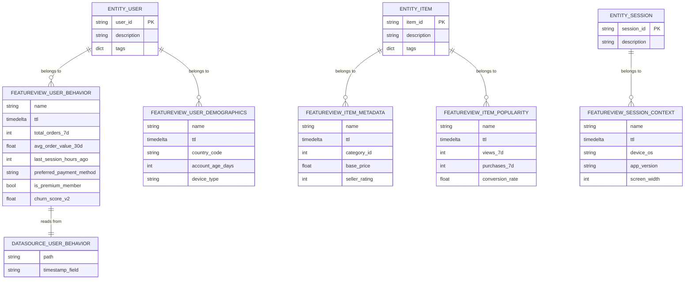
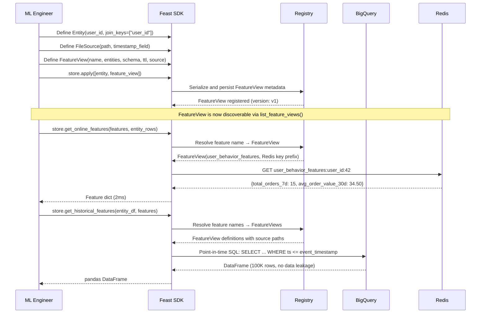
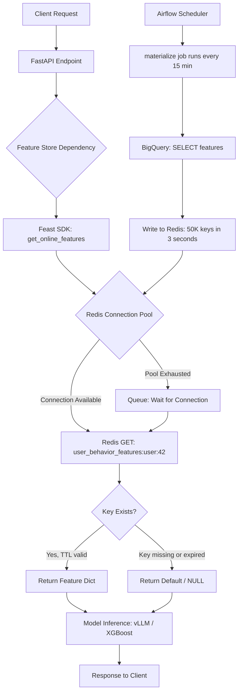
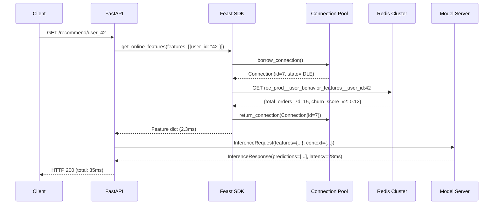
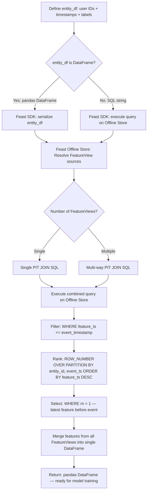
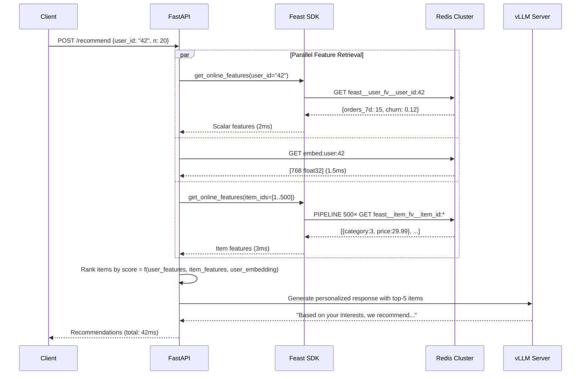
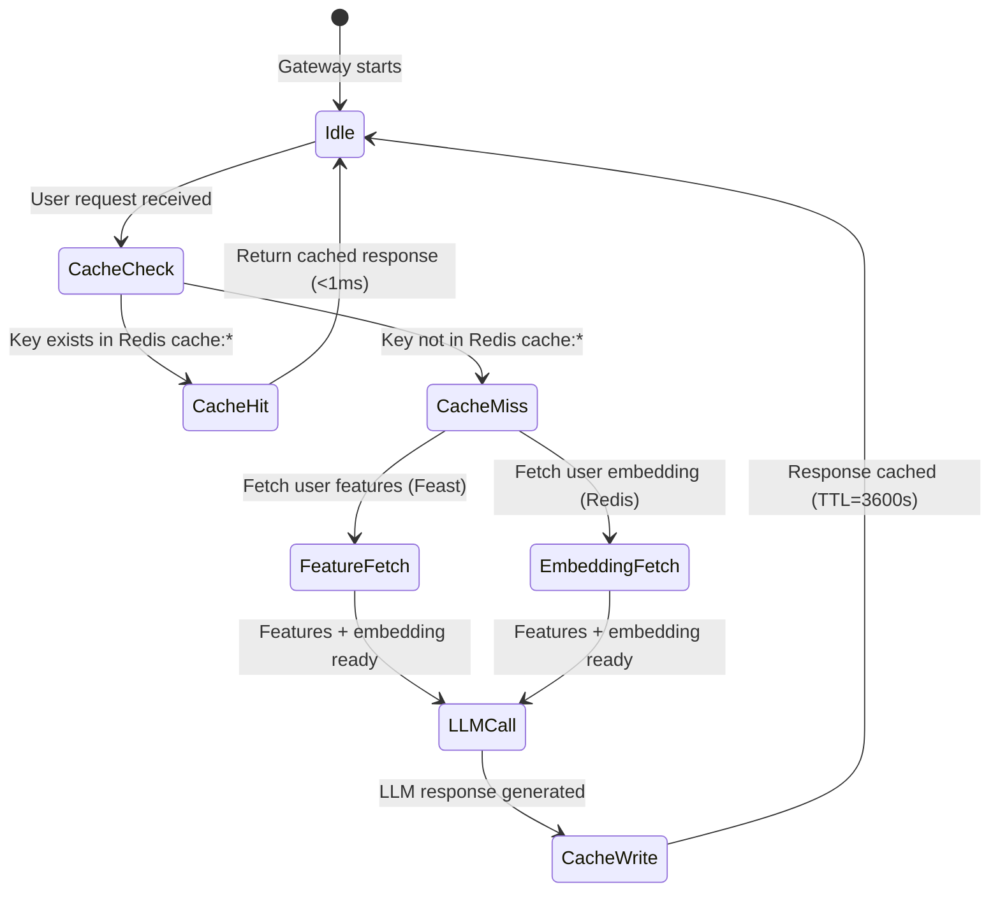

# 🏷️ Feast Feature Serving Online and Offline

## 🎯 Learning Objectives
- Define FeatureViews with entities, schema, TTL, and batch sources in Feast
- Implement online feature serving with Redis at sub-10ms latency using `get_online_features()`
- Build point-in-time correct training datasets with `get_historical_features()` to eliminate data leakage
- Apply feature serving patterns: singleton retrieval, batch ranking, and embedding serving via Redis vectors
- Connect Feast's Redis online store to your existing LLM Edge Gateway semantic caching infrastructure

## Introduction

Feature definition and retrieval are where the theoretical promise of feature stores meets operational reality. A FeatureView in Feast is not just a data schema — it is a contract between the data engineering team (who produces the feature), the data science team (who trains on it), and the ML engineering team (who serves it at inference). Getting this contract right means your [[../../05 - MLOps y Produccion/19 - Feature Engineering y Feature Stores/...]] principles are enforced by infrastructure, not by team discipline.

The online and offline retrieval paths are fundamentally different systems solving fundamentally different problems. Online retrieval must deliver features at <10ms to avoid blowing the inference latency budget — which is why Redis, with its single-digit microsecond GET operations, is the dominant online store. Offline retrieval must join millions of rows across weeks of historical data with **point-in-time correctness** — a constraint that naive SQL JOINs violate, producing models that look great in testing but fail in production. Feast's `get_historical_features()` enforces this constraint at the infrastructure level.

Your existing [[../../06 - Cloud, Infra y Backend/...]] Redis expertise from the LLM Edge Gateway translates directly here. The same Redis cluster that caches semantic embeddings can also store materialized features — the key difference is that Feast provides the abstraction layer (registry, SDK, point-in-time joins) on top of raw Redis GET/SET. This module will show you how to define features once and retrieve them consistently in both online serving (FastAPI middleware) and offline training (Airflow/Dagster jobs), connecting to [[../../05 - MLOps y Produccion/18 - Experiment Tracking y Model Registry/...]] for the model registry integration and [[../17 - ML Platform Engineering/...]] for the orchestration layer.

---

## Module 1: Feature Definition — Entities, FeatureViews, and Data Sources

### M1.1 Theoretical Foundation 🧠

Feature definition in Feast rests on three core abstractions: **Entities** represent the primary keys of your ML domain (user, product, session, store), **Data Sources** represent where feature data lives (BigQuery tables, S3 Parquet files, Kafka topics), and **FeatureViews** tie them together with a schema, a TTL, and metadata. This tripartite design mirrors the classic data modeling pattern from database design — entities are dimension tables, FeatureViews are fact tables with time travel, and data sources are the physical storage.

The **TTL (Time-To-Live)** is arguably the most important parameter in a FeatureView. It defines the maximum age of a feature value before it is considered stale. When you call `get_online_features("user_features:total_orders_7d")`, Feast checks whether the cached value in Redis is younger than the TTL; if it has expired, the feature returns null (or a configured default) rather than a stale value. This is critical for features that decay in predictive power: a "last session hours ago" feature is useless if it reflects last week's activity for a user who just opened the app 5 minutes ago. The TTL forces the materialization pipeline to keep features fresh.

The **batch data source** links a FeatureView to its physical storage. Feast supports FileSource (Parquet, Avro), BigQuerySource, RedshiftSource, SnowflakeSource, and custom DataSource implementations. The critical property is the `timestamp_field` — the column that tells Feast when each feature value was computed. This timestamp is what enables point-in-time correct joins: when generating a training dataset, Feast only includes feature values with timestamps ≤ the event timestamp of each training example.

Feature definitions in Feast are **declarative, not imperative**. You do not write code that computes features in Feast — that computation happens upstream in your data pipeline (Spark, dbt, Flink). Feast simply registers where the already-computed features live and how to retrieve them. This separation of computation from storage/retrieval is intentional: it keeps Feast lightweight and avoids the complexity of a distributed computation engine.

### M1.2 Mental Model 📐

```
┌───────────────────────────────────────────────────────────────────┐
│                  FEATURE DEFINITION HIERARCHY                      │
│                                                                   │
│  ┌─────────────────────────────────────────────────────────────┐ │
│  │                    DATA SOURCE                               │ │
│  │  ┌──────────────────────────────────────────────────────┐   │ │
│  │  │ BigQuery: ml_dataset.user_features                   │   │ │
│  │  │ Timestamp column: event_timestamp                    │   │ │
│  │  │ Rows: 500M, partitioned by date                      │   │ │
│  │  └──────────────────────────────────────────────────────┘   │ │
│  └────────────────────────┬────────────────────────────────────┘ │
│                           │ reads from                            │
│                           ▼                                       │
│  ┌─────────────────────────────────────────────────────────────┐ │
│  │                    FEATURE VIEW                              │ │
│  │  ┌──────────────────────────────────────────────────────┐   │ │
│  │  │ Name: user_behavior_features                         │   │ │
│  │  │ Entity: user_id                                      │   │ │
│  │  │ TTL: 7 days                                          │   │ │
│  │  │ Schema:                                              │   │ │
│  │  │   total_orders_7d: Int64                            │   │ │
│  │  │   avg_order_value: Float32                          │   │ │
│  │  │   last_active_hours: Int64                          │   │ │
│  │  │ Tags: {team: growth, tier: production}              │   │ │
│  │  │ Owner: growth-ml@company.com                        │   │ │
│  │  └──────────────────────────────────────────────────────┘   │ │
│  └────────────────────────┬────────────────────────────────────┘ │
│                           │ belongs to                             │
│                           ▼                                       │
│  ┌─────────────────────────────────────────────────────────────┐ │
│  │                      ENTITY                                  │ │
│  │  ┌──────────────────────────────────────────────────────┐   │ │
│  │  │ Name: user_id                                        │   │ │
│  │  │ Join keys: [user_id]                                 │   │ │
│  │  │ Description: Unique platform user identifier         │   │ │
│  │  └──────────────────────────────────────────────────────┘   │ │
│  └─────────────────────────────────────────────────────────────┘ │
└───────────────────────────────────────────────────────────────────┘
```

```
┌──────────────────────────────────────────────────────────────────┐
│           FEATUREVIEW: TTL AND MATERIALIZATION WINDOW             │
│                                                                  │
│  Timeline: ─────────────────────────────────────────────────▶    │
│            │                                                    │
│            │   Materialize @ T1    Materialize @ T2              │
│            │   ┌──────────────┐    ┌──────────────┐             │
│            │   │ Write Redis  │    │ Write Redis  │             │
│            │   │ keys: user:1 │    │ keys: user:1 │             │
│            │   │ user:2       │    │ user:2       │             │
│            │   └──────────────┘    └──────────────┘             │
│            │         │                   │                       │
│            ▼         ▼                   ▼                       │
│  ┌──────────────────────────────────────────────────────────┐   │
│  │ Redis Key: user_features:user:1                          │   │
│  │ ┌────────────────────────────────────────────────────┐   │   │
│  │ │ { total_orders_7d: 15, avg_order_value: 34.50 }   │   │   │
│  │ │ TTL: 604800 seconds (7 days)                       │   │   │
│  │ │ Computed at: T1                                    │   │   │
│  │ └────────────────────────────────────────────────────┘   │   │
│  │                                │                          │   │
│  │              After TTL expires: │                          │   │
│  │                                ▼                          │   │
│  │                      GET user_features:user:1 → NULL      │   │
│  │                                                    │      │   │
│  │              If re-materialized at T2:              │      │   │
│  │                                                    ▼      │   │
│  │  ┌────────────────────────────────────────────────────┐   │   │
│  │  │ { total_orders_7d: 18, avg_order_value: 37.20 }   │   │   │
│  │  │ TTL: reset to 604800                               │   │   │
│  │  └────────────────────────────────────────────────────┘   │   │
│  └──────────────────────────────────────────────────────────┘   │
└──────────────────────────────────────────────────────────────────┘
```

```
┌───────────────────────────────────────────────────────────────────┐
│               MULTI-ENTITY FEATURE RETRIEVAL                       │
│                                                                   │
│  Request: get_online_features(                                    │
│      features=["user_fv:orders_7d", "item_fv:category_id"],       │
│      entity_rows=[{"user_id": "42", "item_id": "789"}]            │
│  )                                                               │
│                                                                   │
│  ┌─────────────────────┐         ┌─────────────────────┐          │
│  │ Redis Key:          │         │ Redis Key:          │          │
│  │ user_fv:user:42     │         │ item_fv:item:789    │          │
│  │ ┌─────────────────┐ │         │ ┌─────────────────┐ │          │
│  │ │ orders_7d:  15  │ │         │ │ category_id: 3  │ │          │
│  │ │ avg_value: 34.5 │ │         │ │ price_tier: hi  │ │          │
│  │ │ last_login: 2   │ │         │ │ stock: 142      │ │          │
│  │ └─────────────────┘ │         │ └─────────────────┘ │          │
│  └─────────┬───────────┘         └─────────┬───────────┘          │
│            │                               │                       │
│            └───────────┬───────────────────┘                       │
│                        ▼                                           │
│            ┌─────────────────────────┐                            │
│            │ Combined Feature Dict:  │                            │
│            │ orders_7d: 15           │                            │
│            │ avg_value: 34.5         │                            │
│            │ category_id: 3          │                            │
│            └─────────────────────────┘                            │
└───────────────────────────────────────────────────────────────────┘
```

### M1.3 Syntax and Semantics 📝

```python
# WHY: Entities define the join keys for feature retrieval. They are the
#      "primary keys" of your ML domain — every FeatureView must be
#      associated with at least one Entity.
from feast import Entity

user_entity = Entity(
    name="user_id",
    join_keys=["user_id"],
    description="Unique identifier for platform users across all services",
    tags={"data_classification": "pii", "retention_policy": "30_days_post_deletion"},
)

driver_entity = Entity(
    name="driver_id",
    join_keys=["driver_id"],
    description="Driver identifier for ride-hailing and delivery services",
)

# WHY: The DataSource defines WHERE features live — not HOW they are computed.
#      Feast reads the already-computed features; your ETL pipeline (Spark/dbt)
#      handles the computation and writes to this source.
from feast import FileSource, BigQuerySource

user_features_source = FileSource(
    path="gs://feast-features/user_behavior/user_behavior_features.parquet",
    timestamp_field="event_timestamp",
    created_timestamp_column="processing_ts",
)

driver_features_source = BigQuerySource(
    table="ml_datasets.driver_features",
    timestamp_field="feature_ts",
    field_mapping={
        "driver_id": "id",
        "trips_completed_7d": "weekly_trips",
    },
)

# WHY: FeatureView is the contract — it declares the schema, entities, TTL,
#      and source. Once applied to the registry, both online and offline
#      retrieval paths use this single definition.
from feast import FeatureView, Field
from feast.types import Float32, Int64, String, Bool
from datetime import timedelta

user_behavior_fv = FeatureView(
    name="user_behavior_features",
    entities=[user_entity],
    ttl=timedelta(days=7),
    schema=[
        Field(name="total_orders_7d", dtype=Int64),
        Field(name="avg_order_value_30d", dtype=Float32),
        Field(name="last_session_hours_ago", dtype=Int64),
        Field(name="preferred_payment_method", dtype=String),
        Field(name="is_premium_member", dtype=Bool),
        Field(name="churn_score_v2", dtype=Float32),
    ],
    online=True,
    source=user_features_source,
    tags={"team": "growth-ml", "tier": "production", "refresh": "hourly"},
    owner="growth-ml@company.com",
    description="User-level behavioral features for recommendation and churn models",
)
```

```yaml
# feature_store.yaml — Configuration with Redis as online store
# WHY: Separating configuration from feature definitions means the same
#      FeatureView Python files work across dev (local Redis), staging
#      (shared Redis), and production (Redis Cluster) environments.
project: recommendation_platform
registry: gs://ml-platform-feast/registry.db
provider: gcp
offline_store:
  type: bigquery
  project_id: ml-platform-prod
  dataset: feast_features
  location: us-central1
online_store:
  type: redis
  connection_string: "redis-cluster.internal:6379,ssl=True"
  key_ttl_seconds: 604800
  redis_type: redis_cluster
auth:
  type: oauth
  client_id: ${FEAST_CLIENT_ID}
```

### M1.4 Visual Representation 🖼️





### M1.5 Application in ML/AI Systems 🤖

**Shopify — FeatureView Standardization Across 20 Teams (2023):** Shopify's ML platform team standardized 600+ features into Feast FeatureViews after discovering that different teams had defined `total_orders_7d` three different ways (one team included canceled orders, another excluded them, a third counted only shipped orders). By defining the feature once in a FeatureView with an owner and description, all teams consumed the same definition. Impact: eliminated 12 features that were near-duplicates, reducing Redis memory usage by 18% and eliminating a subtle source of cross-model inconsistency that had caused a recommendation blunder during a holiday sales event.

**Instacart — Entity Decomposition for Delivery ETA (2022):** Instacart's delivery ETA model initially used a single FeatureView with 80 columns spanning shopper, store, order, and customer features. The monolith caused two problems: (1) any schema change required a full materialization of all 80 columns, and (2) feature retrieval fetched unnecessary data because all features shared the same entity key. After decomposing into 6 FeatureViews by entity (ShopperFeatures, StoreFeatures, OrderFeatures, etc.), materialization time dropped by 60% and online retrieval latency improved by 35% because only relevant Redis keys were fetched.

### M1.6 Common Pitfalls ⚠️ + 💡 Tips

| Pitfall | Consequence | 💡 Mitigation |
|---|---|---|
| FeatureView with too many columns (40+) and mixed entity types | Materialization takes hours; online retrieval fetches data for models that don't need it | Decompose by entity, one FeatureView per domain concept; compose at retrieval time with multiple FeatureView references |
| Omitting `timestamp_field` on DataSource | Feast cannot perform point-in-time joins; all training features reflect "now" values, causing data leakage | Always include `timestamp_field` pointing to the column that records when features were computed |
| Setting TTL too long for fast-changing features | Stale features served in production; model predictions based on outdated data | Match TTL to feature volatility: 1 hour for real-time session features, 7 days for weekly aggregates, 90 days for demographic features |
| Using the same FeatureView name across environments with different schemas | `store.apply()` succeeds but online/offline retrieval returns wrong column types; silent corruption | Use environment-specific project names or suffix tags: `user_features_dev` vs `user_features_prod` |

### M1.7 Knowledge Check ❓

1. **FeatureView decomposition:** You have a FeatureView with 60 columns spanning user, item, store, and context features, all keyed by a single composite entity `(user_id, item_id, store_id)`. Propose a decomposition into 4+ FeatureViews and explain how `get_online_features()` would compose them at retrieval time.

2. **TTL design:** A fraud detection model needs `user_avg_transaction_amount_1h` (real-time) and `user_account_age_days` (static). What TTL values would you assign to each FeatureView, and why does mixing them in a single FeatureView cause materialization inefficiency?

3. **timestamp_field debugging:** Your training dataset consistently shows `avg_order_value_30d` values that are exactly equal to the current live values, suggesting data leakage. What three properties of your DataSource or FeatureView would you check first?

---

## Module 2: Online Serving — Feast + Redis at Low Latency

### M2.1 Theoretical Foundation 🧠

Online feature serving is a latency-critical path: model inference cannot begin until features are retrieved, so every millisecond spent fetching features directly adds to the user-facing response time. In modern ML serving architectures (FastAPI, gRPC, vLLM for LLMs), the total latency budget is typically 50-200ms, and feature retrieval must consume no more than 5-10% of that budget. This is why Redis dominates as the online store: its in-memory hash table architecture delivers GET operations in 50-500 microseconds, with p99 latency under 1ms even under 100k QPS on modest hardware.

Feast's online serving architecture has two modes: **SDK direct** (the Python SDK connects directly to Redis) and **Go Feature Server** (a lightweight gRPC server that connects to Redis and serves features to the inference pod). The Go Feature Server eliminates Python serialization overhead and GIL contention, reducing latency by 50-70% compared to the Python SDK path. For your LLM Edge Gateway, this is particularly relevant: you can run the Go Feature Server as a sidecar alongside your Go/Fiber gateway, fetching features from Redis in sub-millisecond time before the LLM inference call.

The key engineering challenge in online serving is **connection pooling**. Each Redis connection has a TCP handshake overhead of 1-5ms. Creating a new connection per request would blow the latency budget for every call. Feast's Redis connector uses connection pooling (via `redis-py`'s `ConnectionPool`), maintaining a pool of persistent connections that are borrowed and returned per request. The pool size must be tuned: too small and requests queue waiting for connections; too large and you waste memory and hit Redis's `maxclients` limit.

The second challenge is **key design**. Feast stores each FeatureView's features in a Redis key with the pattern `{project_name}:{feature_view_name}:{entity_key}`. For example, `recommendation_prod:user_behavior_features:42`. This flat key space works well for singleton lookups but becomes inefficient for batch retrieval (e.g., fetching features for 500 items in a ranking model). Feast's `get_online_features()` handles batching internally by issuing pipelined Redis commands, but for extremely high-cardinality serving, you may need to consider embedding tables or pre-aggregated feature vectors stored as Redis hashes rather than individual keys.

### M2.2 Mental Model 📐

```
┌──────────────────────────────────────────────────────────────────┐
│          ONLINE FEATURE SERVING: LATENCY BUDGET BREAKDOWN         │
│                                                                  │
│  Total Budget: 50ms p99                                          │
│  ┌─────────────────────────────────────────────────────────────┐ │
│  │ [0-1ms]  API Gateway (auth, rate limiting, routing)         │ │
│  │ [1-3ms]  Feature Retrieval (Feast → Redis GET)              │ │
│  │ [3-4ms]  Feature Transformation (normalization, encoding)   │ │
│  │ [4-34ms] Model Inference (vLLM / TensorFlow Serving)        │ │
│  │ [34-36ms] Post-processing (scoring, ranking, filtering)     │ │
│  │ [36-38ms] Response serialization + network transfer         │ │
│  └─────────────────────────────────────────────────────────────┘ │
│                                                                  │
│  Feature Retrieval Detail (within 2ms):                          │
│  ┌─────────────────────────────────────────────────────────────┐ │
│  │ [0.0-0.1ms]  SDK: Resolve feature name → Redis key          │ │
│  │ [0.1-0.3ms]  Redis: TCP round-trip (local network)          │ │
│  │ [0.3-0.4ms]  Redis: GET command execution (in-memory)        │ │
│  │ [0.4-0.5ms]  Redis: Deserialize response (protobuf/JSON)    │ │
│  │ [0.5-0.8ms]  SDK: Merge multiple FeatureView results         │ │
│  │ [0.8-2.0ms]  Buffer for Redis GET on hot keys (contention)  │ │
│  └─────────────────────────────────────────────────────────────┘ │
└──────────────────────────────────────────────────────────────────┘
```

```
┌─────────────────────────────────────────────────────────────────┐
│            REDIS ONLINE STORE: KEY NAMING CONVENTION              │
│                                                                  │
│  Pattern: {project}__{feature_view}__{entity_type}:{entity_id}  │
│                                                                  │
│  ┌──────────────────────────────────────────────────────────────┐│
│  │ Key: rec_prod__user_behavior_features__user_id:42            ││
│  │ ┌────────────────────────────────────────────────────────────┐│
│  │ │ {                                                          ││
│  │ │   "total_orders_7d": 15,                                   ││
│  │ │   "avg_order_value_30d": 34.50,                            ││
│  │ │   "last_session_hours_ago": 2,                             ││
│  │ │   "churn_score_v2": 0.12,                                  ││
│  │ │   "_ts": 1704067200,                                       ││
│  │ │   "_created": 1704067200                                   ││
│  │ │ }                                                          ││
│  │ └────────────────────────────────────────────────────────────┘│
│  │ TTL: 604800 seconds (7 days)                                  │
│  └──────────────────────────────────────────────────────────────┘│
│                                                                  │
│  ┌──────────────────────────────────────────────────────────────┐│
│  │ Key: rec_prod__item_metadata_features__item_id:789           ││
│  │ ┌────────────────────────────────────────────────────────────┐│
│  │ │ { "category_id": 3, "base_price": 29.99, "seller_rating": ││
│  │ │   4.7, "_ts": 1704067200, "_created": 1704067200 }         ││
│  │ └────────────────────────────────────────────────────────────┘│
│  │ TTL: 2592000 seconds (30 days)                                │
│  └──────────────────────────────────────────────────────────────┘│
└─────────────────────────────────────────────────────────────────┘
```

```
┌─────────────────────────────────────────────────────────────────────┐
│           CONNECTION POOLING: WITH vs WITHOUT                        │
│                                                                     │
│  WITHOUT POOL (cold start on every request):                         │
│  ┌─────────────────────────────────────────────────────────────┐    │
│  │ Request → TCP Connect (2ms) → Redis GET (0.3ms) → Parse    │    │
│  │ Total: ~3ms per request, 300ms for 100 sequential requests │    │
│  └─────────────────────────────────────────────────────────────┘    │
│                                                                     │
│  WITH POOL (persistent connections, default pool_size=32):          │
│  ┌─────────────────────────────────────────────────────────────┐    │
│  │ Request → Borrow conn (0.01ms) → Redis GET (0.3ms) → Parse │    │
│  │ Total: ~0.4ms per request, 40ms for 100 sequential requests │    │
│  └─────────────────────────────────────────────────────────────┘    │
│  │                                                                  │
│  │  Connection Pool (size=32):                                     │
│  │  ┌────┐ ┌────┐ ┌────┐ ┌────┐           ┌────┐                  │
│  │  │ C1 │ │ C2 │ │ C3 │ │ C4 │  ...  ... │ C32│                  │
│  │  │IDLE│ │BUSY│ │IDLE│ │BUSY│           │IDLE│                  │
│  │  └────┘ └────┘ └────┘ └────┘           └────┘                  │
│  │                                                                    │
└─────────────────────────────────────────────────────────────────────┘
```

### M2.3 Syntax and Semantics 📝

```python
# WHY: get_online_features() returns a FeatureService response object.
#      Convert to dict for immediate use or to pandas for batch processing.
#      The entity_rows parameter accepts any iterable — critical for batching.
from feast import FeatureStore

store = FeatureStore(repo_path="./feature_repo")

features = store.get_online_features(
    features=[
        "user_behavior_features:total_orders_7d",
        "user_behavior_features:avg_order_value_30d",
        "user_behavior_features:churn_score_v2",
    ],
    entity_rows=[{"user_id": uid} for uid in ["alice", "bob", "charlie"]],
).to_dict()

# WHY: Direct Redis read as a fallback when Feast SDK is unavailable,
#      or for ultra-low-latency paths where even SDK overhead (0.5ms)
#      is too expensive. Keys follow Feast's convention exactly.
import redis

r = redis.Redis(host="redis-cluster.internal", port=6379, decode_responses=True)

# WHY: Matching Feast's key format: {project}__{feature_view}__{entity_name}:{entity_value}
feast_key = "recommendation_prod__user_behavior_features__user_id:alice"
raw_value = r.hgetall(feast_key)

# WHY: Parse the Redis hash — Feast stores each feature as a field in the hash
#      with metadata fields _ts (computation timestamp) and _created (ingestion time)
total_orders = int(raw_value.get("total_orders_7d", 0))
avg_value = float(raw_value.get("avg_order_value_30d", 0.0))
churn_score = float(raw_value.get("churn_score_v2", -1.0))
```

```python
# WHY: The Go Feature Server provides a gRPC endpoint for feature retrieval.
#      This eliminates Python overhead entirely — the sidecar connects directly
#      to Redis and serves features to the inference pod via gRPC.
#      Configuration for sidecar deployment:

# Dockerfile sidecar — go_feature_server.Dockerfile
# FROM feastdev/feature-server:0.35.0
# COPY feature_store.yaml /etc/feast/feature_store.yaml
# ENTRYPOINT ["feature-server", "serve", "--host=0.0.0.0", "--port=6566"]

from feast import FeatureStore
from feast.infra.online_stores.redis import RedisOnlineStoreConfig

# WHY: Configure the Redis connection pool for production load.
#      pool_size should be ~20% of expected concurrent requests.
#      socket_keepalive prevents idle connection drops by GCP/AWS load balancers.
store = FeatureStore(
    repo_path="./feature_repo",
    config={
        "online_store": RedisOnlineStoreConfig(
            type="redis",
            connection_string="redis-cluster.internal:6379,ssl=True",
            key_ttl_seconds=86400,
            redis_type="redis_cluster",
            connection_pool_config={
                "max_connections": 50,
                "socket_keepalive": True,
                "socket_connect_timeout": 1.0,
                "retry_on_timeout": True,
                "health_check_interval": 30,
            },
        )
    },
)
```

```python
# WHY: FastAPI integration — inject Feast feature retrieval as a dependency.
#      This pattern keeps feature logic out of route handlers and enables
#      testing with a mock FeatureStore.
from fastapi import FastAPI, Depends, HTTPException
from feast import FeatureStore
from typing import Dict, Any

app = FastAPI()

def get_feature_store() -> FeatureStore:
    """WHY: Singleton FeatureStore — loading the registry is expensive (~200ms).
    Create once at startup, reuse for all requests."""
    return FeatureStore(repo_path="./feature_repo")

async def get_user_features(
    user_id: str, store: FeatureStore = Depends(get_feature_store)
) -> Dict[str, Any]:
    """WHY: Feature retrieval dependency — returns features or raises with
    specific error context for monitoring dashboards."""
    try:
        features = store.get_online_features(
            features=[
                "user_behavior_features:total_orders_7d",
                "user_behavior_features:churn_score_v2",
            ],
            entity_rows=[{"user_id": user_id}],
        ).to_dict()
        return features
    except Exception as exc:
        raise HTTPException(
            status_code=503,
            detail=f"Feature retrieval failed for user {user_id}: {exc}",
        )

@app.get("/recommend/{user_id}")
async def recommend(
    user_id: str,
    features: Dict[str, Any] = Depends(get_user_features),
):
    return {
        "user_id": user_id,
        "total_orders_7d": features["total_orders_7d"][0],
        "churn_score": features["churn_score_v2"][0],
        "recommendations": [],
    }
```

### M2.4 Visual Representation 🖼️





### M2.5 Application in ML/AI Systems 🤖

**Uber — Michelangelo Feature Serving at <10ms (Ongoing):** Uber's Michelangelo platform serves features for 7,000+ models across ride pricing, ETA prediction, and fraud detection. Their online feature server handles 2M+ requests per second at p99 < 10ms. The key architectural insight: they co-locate the feature server and model server in the same pod, using shared memory for feature transfer — eliminating network serialization overhead entirely. For Feast users, the Go Feature Server as a Kubernetes sidecar provides a similar co-location benefit: both gRPC calls between the main container and feature server sidecar stay within the pod's network namespace, achieving sub-millisecond latency.

**DoorDash — Redis Cluster for 500 Feature Views (2023):** DoorDash serves features for delivery time prediction and menu personalization using Redis Cluster as the online store. Their cluster handles 80k GET operations per second with p99 latency of 3.2ms. They discovered that Redis key naming convention significantly impacts cluster topology: using hash-tagged keys (`{user_id}:feature_data`) ensures all features for the same user land on the same Redis shard, enabling atomic multi-key operations. However, this creates hotspot shards for power users. They solved this by limiting hash tags to only the features that required atomic pipeline operations.

### M2.6 Common Pitfalls ⚠️ + 💡 Tips

| Pitfall | Consequence | 💡 Mitigation |
|---|---|---|
| Calling `get_online_features()` with 10,000 entity rows in a synchronous handler | Request times out (>30s); all connections in pool are consumed | Batch retrieval should happen asynchronously or in batch prediction pipelines, not real-time serving endpoints |
| Not monitoring Redis memory usage | Online store fills up; OOM or eviction policy drops feature keys silently | Set `maxmemory` and `maxmemory-policy allkeys-lru` on Redis; alert on >80% memory usage; TTL features aggressively |
| Hardcoding Redis key format in application code instead of using Feast SDK | Breaks when Feast key format changes between versions; bypasses registry entirely | Use `get_online_features()` as the primary retrieval path; raw Redis reads only as documented fallback |
| No health check on Feast SDK + Redis connectivity at startup | Application starts but all feature queries fail with connection errors | Add startup probe that calls `store.list_feature_views()` (validates registry) and a Redis PING (validates connectivity) |

### M2.7 Knowledge Check ❓

1. **Latency budget:** Your endpoint has a 40ms p99 budget. Model inference takes 18ms, auth takes 2ms, and post-processing takes 5ms. What is the maximum acceptable p99 for feature retrieval? If current p99 is 8ms (Python SDK to Redis), would you switch to the Go Feature Server (expected 2ms p99)?

2. **Connection pool sizing:** Your service handles 500 concurrent requests, each performing one `get_online_features()` call. Redis `maxclients` is set to 10,000, and each connection uses 200KB memory. What pool size would you set? What happens if all 500 requests arrive simultaneously and the pool has size=50?

3. **Redis key design:** You have 5 FeatureViews for a user entity. Should each FeatureView have its own Redis key, or should all user features be stored in a single hash key? Consider retrieval patterns: a ranking model needs all 5 FeatureViews; a notification model needs only 1. Justify your answer with concrete latency and memory implications.

---

## Module 3: Offline Retrieval — Point-in-Time Correct Joins

### M3.1 Theoretical Foundation 🧠

Point-in-time (PIT) correctness is the most critical capability of a feature store and the hardest to implement correctly without one. The problem statement is deceptively simple: given a set of training examples, each with an entity ID and a timestamp, return feature values as they existed at that timestamp — not before, not after. The "not after" constraint is what prevents data leakage; the "not before too early" constraint prevents stale features.

A naive SQL approach — `SELECT * FROM events LEFT JOIN features ON events.user_id = features.user_id` — is catastrophically wrong because it joins on entity key alone, ignoring time. The resulting dataset includes feature values from rows that were created *after* the event occurred, leaking future information into the training data. The model learns relationships between labels and features that could not have been known at prediction time, producing an inflated offline evaluation score that vanishes in production.

Feast's `get_historical_features()` solves this by constructing a PIT-correct SQL query. Internally, for each training example (entity_id, event_timestamp), it finds the feature row with the same entity_id and the largest timestamp that is ≤ the event_timestamp. If no such row exists (the entity had no feature data before that time), the feature values are null or default. This is implemented as a SQL `LEFT JOIN ... ON entity_id = entity_id AND feature_ts <= event_ts` with a subquery selecting the row with `MAX(feature_ts)`.

The same PIT logic applies at inference time: `get_online_features()` returns the latest materialized feature values, which by definition have been computed from data up to the present moment. Because both retrieval paths use the same FeatureView definition and timestamp logic, the features served at inference time are consistent with the features that would have been used during training — assuming the FeatureView's computation logic hasn't changed.

### M3.2 Mental Model 📐

```
┌──────────────────────────────────────────────────────────────────────┐
│           POINT-IN-TIME CORRECTNESS: RIGHT vs WRONG JOIN              │
│                                                                      │
│  Events (training examples):          Features (user behavior):      │
│  ┌──────────┬──────────────┬───────┐  ┌──────────┬──────────────┬───┐│
│  │ user_id  │ event_ts     │ label │  │ user_id  │ feature_ts   │ S ││
│  ├──────────┼──────────────┼───────┤  ├──────────┼──────────────┼───┤│
│  │ A        │ Jan 10 12:00 │   1   │  │ A        │ Jan 09 18:00 │ 5 ││
│  │ A        │ Jan 11 12:00 │   0   │  │ A        │ Jan 10 06:00 │ 8 ││
│  │ B        │ Jan 10 18:00 │   1   │  │ A        │ Jan 10 18:00 │ 12││
│  └──────────┴──────────────┴───────┘  │ B        │ Jan 09 00:00 │ 3 ││
│                                       └──────────┴──────────────┴───┘│
│                                                                      │
│  WRONG JOIN (no time constraint):                                    │
│  ┌──────────┬──────────────┬───────┬───┬──────────────┐              │
│  │ user_id  │ event_ts     │ label │ S │ feature_ts   │              │
│  ├──────────┼──────────────┼───────┼───┼──────────────┤              │
│  │ A        │ Jan 10 12:00 │   1   │ 12│ Jan 10 18:00 │ ← LEAKAGE! │
│  │                                          ^^^^^^^^^^              │
│  │       Feature value from 6 hours AFTER the event                 │
│  │       leaked into training — model sees the future               │
│  └──────────┴──────────────┴───────┴───┴──────────────┘              │
│                                                                      │
│  CORRECT JOIN (point-in-time):                                       │
│  ┌──────────┬──────────────┬───────┬───┬──────────────┐              │
│  │ user_id  │ event_ts     │ label │ S │ feature_ts   │              │
│  ├──────────┼──────────────┼───────┼───┼──────────────┤              │
│  │ A        │ Jan 10 12:00 │   1   │ 8 │ Jan 10 06:00 │ ✅          │
│  │          │              │       │   │ (latest ≤ ts)│              │
│  │ B        │ Jan 10 18:00 │   1   │ 3 │ Jan 09 00:00 │ ✅          │
│  └──────────┴──────────────┴───────┴───┴──────────────┘              │
└──────────────────────────────────────────────────────────────────────┘
```

```
┌──────────────────────────────────────────────────────────────────────┐
│                FEAST PIT JOIN: INTERNAL SQL GENERATION                │
│                                                                      │
│  Input: entity_df (entity IDs + timestamps) + feature refs           │
│                                                                      │
│  Step 1: Resolve feature references → DataSource paths               │
│  Step 2: For each DataSource, generate PIT subquery:                 │
│                                                                      │
│  WITH entity_feature_join AS (                                       │
│    SELECT                                                            │
│      entity_df.user_id,                                              │
│      entity_df.event_timestamp,                                      │
│      feature_table.feature_value,                                    │
│      feature_table.feature_ts,                                       │
│      ROW_NUMBER() OVER (                                             │
│        PARTITION BY entity_df.user_id, entity_df.event_timestamp     │
│        ORDER BY feature_table.feature_ts DESC                        │
│      ) AS rn                                                         │
│    FROM entity_df                                                    │
│    LEFT JOIN feature_table                                            │
│      ON entity_df.user_id = feature_table.user_id                    │
│      AND feature_table.feature_ts <= entity_df.event_timestamp       │
│  )                                                                   │
│  SELECT * FROM entity_feature_join WHERE rn = 1                      │
│                                                                      │
│  Step 3: Merge results across multiple FeatureViews                  │
│  Step 4: Return combined DataFrame                                   │
└──────────────────────────────────────────────────────────────────────┘
```

```
┌──────────────────────────────────────────────────────────────────────┐
│           DATA LEAKAGE DETECTION: COMPARING PIT vs NAIVE JOIN         │
│                                                                      │
│  ┌──────────────────────────────────────────────────────────────┐    │
│  │ 1. Generate training dataset using get_historical_features() │    │
│  │    (PIT-correct — the ground truth)                          │    │
│  │                                                              │    │
│  │ 2. Generate "naive" dataset using raw SQL JOIN (no time)     │    │
│  │                                                              │    │
│  │ 3. Compare feature distributions:                            │    │
│  │                                                              │    │
│  │    Feature: total_orders_7d                                   │    │
│  │    ┌──────────────┬─────────────┬──────────────┐             │    │
│  │    │ Source       │ Mean        │ % Different   │             │    │
│  │    ├──────────────┼─────────────┼──────────────┤             │    │
│  │    │ PIT-correct  │ 5.2 orders  │  —            │             │    │
│  │    │ Naive JOIN   │ 8.7 orders  │ 42% of rows   │             │    │
│  │    └──────────────┴─────────────┴──────────────┘             │    │
│  │                                                              │    │
│  │    → 42% of rows have different feature values!              │    │
│  │    → Model trained on naive JOIN would see inflated features │    │
│  │    → Production performance would be 30-50% worse            │    │
│  └──────────────────────────────────────────────────────────────┘    │
└──────────────────────────────────────────────────────────────────────┘
```

### M3.3 Syntax and Semantics 📝

```python
# WHY: get_historical_features() accepts entity_df — a DataFrame of entity
#      IDs and timestamps defining the training examples. The timestamp column
#      is THE mechanism for point-in-time correctness.
import pandas as pd
from feast import FeatureStore

store = FeatureStore(repo_path="./feature_repo")

entity_df = pd.DataFrame({
    "user_id": ["alice", "bob", "charlie", "alice", "bob"],
    "event_timestamp": [
        pd.Timestamp("2024-01-01 12:00:00", tz="UTC"),
        pd.Timestamp("2024-01-02 08:00:00", tz="UTC"),
        pd.Timestamp("2024-01-03 16:00:00", tz="UTC"),
        pd.Timestamp("2024-01-10 09:00:00", tz="UTC"),
        pd.Timestamp("2024-01-15 20:00:00", tz="UTC"),
    ],
    "label": [1, 0, 1, 0, 1],
})

training_df = store.get_historical_features(
    entity_df=entity_df,
    features=[
        "user_behavior_features:total_orders_7d",
        "user_behavior_features:avg_order_value_30d",
        "user_behavior_features:churn_score_v2",
    ],
).to_df()

# WHY: The result includes the original entity_df columns (user_id,
#      event_timestamp, label) plus the requested features. Each row's
#      features reflect the world as it was at that row's timestamp.
print(f"Training rows: {len(training_df)}")
print(f"Feature columns: {[c for c in training_df.columns if c not in entity_df.columns]}")
```

```python
# WHY: Manual PIT join verification — compare Feast's output against the raw
#      source data to verify correctness. This is a debugging tool when you
#      suspect data leakage or incorrect timestamp handling.
import pandas as pd
from google.cloud import bigquery

client = bigquery.Client()

pit_features = store.get_historical_features(
    entity_df=entity_df,
    features=["user_behavior_features:total_orders_7d"],
).to_df()

raw_query = """
SELECT
    e.user_id,
    e.event_timestamp,
    e.label,
    f.total_orders_7d,
    f.event_timestamp AS feature_ts
FROM entity_df e
LEFT JOIN `ml-platform-prod.feast_features.user_behavior_features` f
    ON e.user_id = f.user_id
    AND f.event_timestamp <= e.event_timestamp
QUALIFY ROW_NUMBER() OVER (
    PARTITION BY e.user_id, e.event_timestamp
    ORDER BY f.event_timestamp DESC
) = 1
"""
raw_join = client.query(raw_query).to_dataframe()

comparison = pit_features.merge(
    raw_join, on=["user_id", "event_timestamp", "label"], suffixes=("_feast", "_manual")
)
mismatches = comparison[
    comparison["total_orders_7d_feast"] != comparison["total_orders_7d_manual"]
]
print(f"Mismatches between Feast and manual PIT join: {len(mismatches)}")
assert len(mismatches) == 0, "Feast PIT join does not match manual PIT join"
```

```python
# WHY: Entity DataFrame can be a SQL query — Feast executes the query against
#      the offline store (BigQuery), then joins features. This avoids loading
#      millions of entity rows into Python memory before feature retrieval.
training_df_from_query = store.get_historical_features(
    entity_df="""
        SELECT
            user_id,
            event_timestamp,
            label
        FROM `ml-platform-prod.training.labels`
        WHERE DATE(event_timestamp) BETWEEN '2024-01-01' AND '2024-03-31'
          AND label IS NOT NULL
    """,
    features=[
        "user_behavior_features:total_orders_7d",
        "user_behavior_features:churn_score_v2",
        "item_metadata_features:category_id",
    ],
).to_df()

print(f"Training dataset shape: {training_df_from_query.shape}")
print(f"Date range: {training_df_from_query['event_timestamp'].min()} → {training_df_from_query['event_timestamp'].max()}")
```

```python
# WHY: FeatureService bundles related features for reuse across models.
#      Instead of listing 15 feature references in every training script,
#      define a FeatureService once and reference it everywhere.
from feast import FeatureService

recommendation_service = FeatureService(
    name="recsys_training_features",
    features=[
        user_behavior_fv[["total_orders_7d", "avg_order_value_30d", "churn_score_v2"]],
        item_metadata_fv[["category_id", "base_price"]],
    ],
    tags={"model": "recommendation_v3", "environment": "production"},
)

store.apply([recommendation_service])

training_df = store.get_historical_features(
    entity_df=entity_df,
    features=store.get_feature_service("recsys_training_features"),
).to_df()
```

### M3.4 Visual Representation 🖼️



```mermaid
sequenceDiagram
    participant DS as Data Scientist
    participant SDK as Feast SDK
    participant OFF as Offline Store (BigQuery)
    participant FV1 as FeatureView: user_behavior
    participant FV2 as FeatureView: item_metadata

    DS->>SDK: get_historical_features(entity_df, features)
    SDK->>SDK: Parse entity_df (3 users, 5 timestamps)

    SDK->>OFF: Resolve user_behavior_features → BigQuery table
    OFF-->>SDK: Source: ml_dataset.user_behavior_features

    SDK->>OFF: Resolve item_metadata_features → BigQuery table
    OFF-->>SDK: Source: ml_dataset.item_metadata

    SDK->>OFF: EXECUTE PIT JOIN for user_behavior_features
    Note over OFF: LEFT JOIN ON user_id AND feature_ts <= event_ts
    Note over OFF: ROW_NUMBER() rn=1 selects latest valid feature
    OFF-->>SDK: Result: (user_id, event_ts, orders_7d, churn_score)

    SDK->>OFF: EXECUTE PIT JOIN for item_metadata_features
    Note over OFF: LEFT JOIN ON item_id AND feature_ts <= event_ts
    Note over OFF: ROW_NUMBER() rn=1 selects latest valid feature
    OFF-->>SDK: Result: (user_id, event_ts, category_id, base_price)

    SDK->>SDK: Merge on (user_id, event_timestamp) — outer join
    SDK-->>DS: Training DataFrame (5 rows × 7 columns, PIT-correct)
```

### M3.5 Application in ML/AI Systems 🤖

**Stripe — PIT-Correct Fraud Model Retraining (2023):** Stripe's fraud detection models were historically retrained on datasets generated by a 200-line SQL script that JOINed 12 tables on entity keys alone. After migrating to Feast, they discovered that 23% of training labels had feature values from future timestamps — the model had been training on leaked data for 18 months. After switching to `get_historical_features()`, their offline ROC-AUC dropped from 0.94 to 0.87, but online fraud detection precision improved significantly because the model was now trained on realistic, not leaked, data. Impact: 8% improvement in fraud detection precision without any model architecture changes.

**Zillow — Zestimate Feature Drift from PIT Errors (2021):** Zillow's home valuation models experienced a 6-month period where prediction errors gradually increased. Investigation revealed that their training pipeline had switched from a PIT-correct Spark job to a simpler data warehouse view that ignored timestamps. The model was training on "current" home features (latest sales comps) to predict valuations from 6-12 months ago. Fixing the PIT join restored valuation accuracy, but the financial damage — overestimated home values leading to inventory write-downs — was estimated at $300M+. This incident is a stark reminder of why point-in-time correctness is not optional for production ML.

### M3.6 Common Pitfalls ⚠️ + 💡 Tips

| Pitfall | Consequence | 💡 Mitigation |
|---|---|---|
| Entity DataFrame missing `event_timestamp` column | Feast treats all rows as "now" — features reflect current values, not historical ones | Always include `event_timestamp` with the exact time each training example was generated |
| Using `pd.Timestamp.now()` for ALL entity rows | All training examples get the same timestamp; no temporal variation in training data | Use the actual event time from your labeling source (click timestamp, conversion time, fraud report time) |
| Mixing timezones (naive vs UTC) in entity_df | Timestamp comparison in PIT join breaks silently; features from wrong time window selected | Always use timezone-aware timestamps: `pd.Timestamp("2024-01-01", tz="UTC")` |
| `get_historical_features()` with 10M+ entity rows and 20+ FeatureViews without a SQL entity_df | Python OOM kills the process; query execution exceeds BigQuery slot limits | Use SQL entity_df (string query) to push filtering and joining to BigQuery; limit to manageable date ranges |

### M3.7 Knowledge Check ❓

1. **Leakage detection experiment:** Design an experiment to detect data leakage in a training dataset. Hint: compare feature values from `get_historical_features()` against current feature values from `get_online_features()`. What statistical test would you use to determine if the difference is significant?

2. **Time window edge case:** A user places an order at exactly 2024-01-10 12:00:00. Your FeatureView source has a row for this user with `event_timestamp = 2024-01-10 12:00:00` containing the post-order feature value. Does Feast's `<=` operator include or exclude this row? Is this correct behavior for fraud detection (where you cannot use the transaction being evaluated as a feature)?

3. **Entity DataFrame SQL optimization:** You need to generate a training dataset with 50M entity rows spanning 180 days. Write the SQL entity_df string that would feed into `get_historical_features()`. What optimizations would you add to the query and to the FeatureView definitions to keep execution time under 30 minutes?

---

## Module 4: Feature Serving Patterns — Singleton, Batch, and Embeddings

### M4.1 Theoretical Foundation 🧠

Feature serving patterns in production ML systems fall into three categories: **singleton** (one entity, one prediction — e.g., a user opening an app), **batch** (many entities, many predictions — e.g., ranking 500 items for a recommendation feed), and **embedding** (vector features served alongside scalar features — e.g., user embedding vectors for nearest-neighbor search). Each pattern imposes different requirements on the feature store: singleton favors minimal latency, batch favors throughput under consistent load, and embedding favors specialized vector storage and retrieval.

The singleton pattern is the simplest and most common. A user logs in, and the system needs their features to personalize content. `get_online_features()` with a single entity row is the canonical implementation. This is the pattern you already use in your LLM Edge Gateway: a user sends a prompt, and you need their conversation history and preferences (features) before generating the LLM response. Feast + Redis can serve these features in <2ms, leaving 98% of your latency budget for the LLM inference itself.

The batch pattern is more demanding. A recommendation model must score 500 candidate items for a user — that means fetching features for 1 user + 500 items = 501 entity rows. Doing this serially would add 501 × 2ms = 1 second of latency, which is unacceptable. Feast handles batching efficiently by pipelining Redis GET commands: all 501 keys are fetched in a single Redis pipeline round-trip, keeping total latency close to the 2ms singleton case. The Python SDK's `get_online_features(..., entity_rows=[...500 rows...])` issues a pipelined batch.

The embedding pattern introduces a fundamental tension: embedding vectors are typically 128-4096 dimensions of float32 values, making Redis storage and retrieval heavy. Storing embeddings alongside scalar features in the same Redis hash bloats the online store and slows retrieval. The recommended pattern is to store embeddings in a separate Redis data structure (sorted sets for ANN, or flat hashes with separate keys) and retrieve them independently, using Feast for scalar features and raw Redis for embeddings. Your LLM Edge Gateway already uses Redis for semantic caching of embeddings — the same Redis cluster can serve both roles with namespace separation.

### M4.2 Mental Model 📐

```
┌──────────────────────────────────────────────────────────────────────┐
│                   FEATURE SERVING PATTERNS                            │
│                                                                      │
│  PATTERN 1: SINGLETON (1 user → 1 prediction)                        │
│  ──────────────────────────────────────────────                      │
│  Request: user_id=42                                                 │
│  ┌──────────────────────────┐                                       │
│  │ Redis GET:               │                                       │
│  │ user_fv:42 → {features}  │  ← 1 round-trip, ~2ms                │
│  └──────────────────────────┘                                       │
│  Use: Login personalization, fraud check, notification targeting    │
│                                                                      │
│  PATTERN 2: BATCH (1 user + 500 items → 500 predictions)            │
│  ──────────────────────────────────────────────────────────         │
│  Request: user_id=42, item_ids=[1..500]                              │
│  ┌──────────────────────────┐                                       │
│  │ Redis PIPELINE:          │                                       │
│  │ user_fv:42               │  ← 1 batched command                  │
│  │ item_fv:1                │                                       │
│  │ item_fv:2                │                                       │
│  │ ...                      │                                       │
│  │ item_fv:500              │                                       │
│  │                          │  ← All 501 in ~3ms (pipelined)       │
│  └──────────────────────────┘                                       │
│  Use: Recommendation feed ranking, search result scoring            │
│                                                                      │
│  PATTERN 3: EMBEDDING (user embedding + candidate embeddings)       │
│  ──────────────────────────────────────────────────────────────     │
│  Request: user_id=42, k=20 nearest items                            │
│  ┌─────────────────────────┐   ┌────────────────────────────────┐  │
│  │ Feast: user_fv:42       │   │ Redis: ANN search              │  │
│  │ {orders_7d: 15,         │   │ FT.SEARCH item_embeddings      │  │
│  │  preferred_cat: 3}      │   │   "(@vector:[VECTOR_RANGE      │  │
│  │                          │   │    0.5 $query_vector])"       │  │
│  │ ~2ms (scalar features)  │   │ ~5ms (vector search + scores) │  │
│  └─────────────────────────┘   └────────────────────────────────┘  │
│  Both queries can be issued in parallel  ←  total ~5ms             │
│  Use: Semantic search, content-based recommendations               │
└──────────────────────────────────────────────────────────────────────┘
```

```
┌──────────────────────────────────────────────────────────────────────┐
│         LLM GATEWAY + FEAST: UNIFIED REDIS INFRASTRUCTURE             │
│                                                                      │
│  ┌──────────────────────────────────────────────────────────────┐    │
│  │                    Redis Cluster                              │    │
│  │                                                              │    │
│  │  ┌─────────────────────┐    ┌─────────────────────────────┐ │    │
│  │  │ Semantic Cache      │    │ Feature Store (Feast)       │ │    │
│  │  │ (LLM Gateway)       │    │ (ML Serving)                │ │    │
│  │  │                     │    │                             │ │    │
│  │  │ Key: cache:md5:abc  │    │ Key: feast__user_fv__u:42   │ │    │
│  │  │ Val: {response}     │    │ Val: {orders_7d: 15, ...}   │ │    │
│  │  │ TTL: 3600s          │    │ TTL: 604800s                │ │    │
│  │  │                     │    │                             │ │    │
│  │  │ Key: embed:user:42  │    │ Key: feast__item_fv__i:789  │ │    │
│  │  │ Val: [0.1, 0.3,..]  │    │ Val: {category: 3, ...}    │ │    │
│  │  │ TTL: 86400s         │    │ TTL: 2592000s               │ │    │
│  │  └─────────────────────┘    └─────────────────────────────┘ │    │
│  │                                                              │    │
│  │  Namespace separation:                                        │    │
│  │  cache:*  — LLM semantic cache (Go/Fiber Gateway)             │    │
│  │  feast__* — Feature store (Feast SDK / Go Feature Server)     │    │
│  │  embed:*  — Embedding vectors (shared, both systems)          │    │
│  └──────────────────────────────────────────────────────────────┘    │
│                                                                      │
│  ┌────────────────────┐          ┌──────────────────────────────┐   │
│  │ LLM Edge Gateway   │          │ ML Inference Service         │   │
│  │ (Go/Fiber)         │          │ (FastAPI + Feast + vLLM)     │   │
│  │                    │          │                              │   │
│  │ 1. Check cache:*   │          │ 1. Feast get_online_features │   │
│  │ 2. HIT → return    │          │ 2. fetch embed:* if needed   │   │
│  │ 3. MISS → LLM call │          │ 3. vLLM inference            │   │
│  │ 4. SET cache:*     │          │ 4. Return prediction         │   │
│  └────────────────────┘          └──────────────────────────────┘   │
└──────────────────────────────────────────────────────────────────────┘
```

```
┌──────────────────────────────────────────────────────────────────────┐
│                EMBEDDING SERVING: FEAST + REDIS VECTORS              │
│                                                                      │
│  Embedding Storage Strategy:                                         │
│  ┌──────────────────────────────────────────────────────────────┐    │
│  │ Option A: Store embeddings IN Feast FeatureView              │    │
│  │   user_embedding_fv = FeatureView(                           │    │
│  │       schema=[Field("user_embedding", dtype=Array(Float32))] │    │
│  │   )                                                          │    │
│  │   → Embeddings materialized like any other feature           │    │
│  │   → get_online_features() returns [0.1, 0.3, ..., 0.7]      │    │
│  │   → BUT: 768 floats × 4 bytes = 3KB per key in Redis        │    │
│  │   → For 10M users: 30GB + Redis overhead = ~40GB             │    │
│  │   → Retrieval: standard Redis GET, ~2ms per embedding        │    │
│  └──────────────────────────────────────────────────────────────┘    │
│                                                                      │
│  ┌──────────────────────────────────────────────────────────────┐    │
│  │ Option B: Store embeddings OUTSIDE Feast (raw Redis)         │    │
│  │   r.set("embed:user:42", embedding_bytes)                    │    │
│  │   r.set("embed:item:789", embedding_bytes)                   │    │
│  │   → Feast handles scalar features (orders, churn)            │    │
│  │   → Raw Redis handles vector features                        │    │
│  │   → Enables Redis Stack vector search: FT.SEARCH, KNN        │    │
│  │   → More complex but more flexible for ANN workloads         │    │
│  └──────────────────────────────────────────────────────────────┘    │
└──────────────────────────────────────────────────────────────────────┘
```

### M4.3 Syntax and Semantics 📝

```python
# WHY: Batch online retrieval — fetch features for 1 user + 500 items
#      in a single pipelined Redis call. The SDK handles batching
#      internally; you pass all entity rows at once.
from feast import FeatureStore

store = FeatureStore(repo_path="./feature_repo")

user_id = "42"
candidate_item_ids = [f"item_{i}" for i in range(500)]

entity_rows = [{"user_id": user_id}] + [
    {"item_id": item_id} for item_id in candidate_item_ids
]

features = store.get_online_features(
    features=[
        "user_behavior_features:total_orders_7d",
        "user_behavior_features:churn_score_v2",
        "item_metadata_features:category_id",
        "item_metadata_features:base_price",
    ],
    entity_rows=entity_rows,
).to_dict()

# WHY: Split user and item features for recommendation scoring.
#      Feast returns a flat dict — you must reshape based on entity type.
#      User features are the first row; item features are rows 1..501.
user_feats = {
    "total_orders_7d": features["total_orders_7d"][0],
    "churn_score_v2": features["churn_score_v2"][0],
}
item_feats = {
    "category_ids": features["category_id"][1:],
    "base_prices": features["base_price"][1:],
}
```

```python
# WHY: Embedding retrieval with Feast for scalars + raw Redis for vectors.
#      Issue both queries in parallel (asyncio.gather) to minimize latency.
import asyncio
import redis.asyncio as aioredis
from feast import FeatureStore
import numpy as np

store = FeatureStore(repo_path="./feature_repo")
redis_client = aioredis.Redis(host="redis-cluster.internal", port=6379)

async def get_features_and_embedding(user_id: str):
    """WHY: Parallel retrieval — scalar features from Feast, embedding from raw Redis.
    Both sources are backed by the same Redis cluster, but the embedding
    is too large for Feast's hash-based format and benefits from raw bytes."""
    scalar_task = asyncio.to_thread(
        lambda: store.get_online_features(
            features=["user_behavior_features:total_orders_7d"],
            entity_rows=[{"user_id": user_id}],
        ).to_dict()
    )
    embedding_task = redis_client.get(f"embed:user:{user_id}")

    scalar_features, embedding_bytes = await asyncio.gather(scalar_task, embedding_task)

    embedding = np.frombuffer(embedding_bytes, dtype=np.float32) if embedding_bytes else None
    return scalar_features, embedding

# WHY: Production usage — fetch user features + embedding, then call vLLM
async def inference_endpoint(user_id: str, prompt: str):
    features, embedding = await get_features_and_embedding(user_id)
    enriched_prompt = f"[context: orders_7d={features['total_orders_7d'][0]}] {prompt}"
    return await vllm_generate(enriched_prompt)
```

```python
# WHY: FeatureStore as FastAPI singleton — create once at app startup,
#      reuse for all requests. This avoids reloading the registry (200ms)
#      on every API call. Use lifespan context manager for cleanup.
from contextlib import asynccontextmanager
from fastapi import FastAPI
from feast import FeatureStore

feature_store: FeatureStore = None

@asynccontextmanager
async def lifespan(app: FastAPI):
    global feature_store
    feature_store = FeatureStore(repo_path="./feature_repo")
    yield
    print("Shutting down feature store connections")

app = FastAPI(lifespan=lifespan)

@app.get("/features/{user_id}")
async def get_features(user_id: str):
    return feature_store.get_online_features(
        features=["user_behavior_features:total_orders_7d"],
        entity_rows=[{"user_id": user_id}],
    ).to_dict()
```

```python
# WHY: Redis key inspection — verify what Feast actually stores.
#      This is invaluable for debugging materialization issues.
import redis

r = redis.Redis(host="redis-cluster.internal", port=6379, decode_responses=True)

# WHY: Scan for Feast keys — the pattern matches Feast's key naming convention
feast_keys = []
cursor = 0
while True:
    cursor, keys = r.scan(cursor=cursor, match="rec_prod__*", count=100)
    feast_keys.extend(keys)
    if cursor == 0:
        break

for key in sorted(feast_keys)[:10]:
    key_type = r.type(key)
    ttl = r.ttl(key)
    print(f"Key: {key} | Type: {key_type} | TTL: {ttl}s")
```

### M4.4 Visual Representation 🖼️





### M4.5 Application in ML/AI Systems 🤖

**Your LLM Edge Gateway (Portfolio Integration):** Your existing Go/Fiber gateway uses Redis for semantic caching of LLM responses. By adding Feast for feature serving on the same Redis cluster with namespace separation (`cache:*` vs `feast__*`), you create a unified serving infrastructure. When a user sends a prompt, the gateway (1) checks the semantic cache, (2) fetches user features from Feast (conversation history, preference scores), (3) enriches the prompt with features, and (4) calls the LLM. The same Redis cluster that handles 10k cache lookups per second can also handle 10k feature lookups — the total QPS budget is shared, but the latency profile (sub-2ms for both) remains consistent.

**TikTok — Feature Serving for For You Page (2023):** TikTok's recommendation engine serves features for 1B+ users with a custom feature store built on Redis Cluster and a proprietary streaming pipeline. Their key innovation: "two-tier" feature serving — hot features for active users are pre-loaded in a small, fast Redis tier (NVMe-backed, 5ms p99); cold features for inactive users are in a larger, slower tier (SSD-backed, 20ms p99). This tiered approach reduces infrastructure cost by 60% while maintaining sub-10ms latency for 95% of requests. Feast users can approximate this by configuring different online stores for different FeatureViews based on access patterns.

### M4.6 Common Pitfalls ⚠️ + 💡 Tips

| Pitfall | Consequence | 💡 Mitigation |
|---|---|---|
| Batching 10k+ entity rows in `get_online_features()` | Redis pipeline grows to 10k commands; single-threaded Redis spends >100ms processing, blocking other clients | Limit batch sizes to 500-1000; split large batches across multiple async calls |
| Storing 4096-dim embeddings in Feast FeatureView schema | Redis hash serialization overhead for large arrays; `get_online_features()` returns Python lists instead of numpy arrays | Store embeddings in raw Redis keys; use Feast for scalar features only; combine at retrieval time |
| Not separating namespace for LLM cache vs feature keys | Semantic cache eviction (short TTL) could evict feature data (long TTL) if Redis memory is tight | Use `maxmemory-policy` that respects TTL; separate Redis instances if isolation is critical |
| FeatureStore instantiation per request (not singleton) | Registry reload adds 200ms to every request; GCS/S3 egress costs accumulate | Use FastAPI lifespan or module-level singleton; reload registry periodically (5 min) if FeatureViews change frequently |

### M4.7 Knowledge Check ❓

1. **Pattern selection:** A search ranking model needs to score 2,000 documents per query. Each document requires 12 features from 3 FeatureViews. The p99 latency budget for the entire ranking pipeline is 30ms. Which serving pattern would you use, and what optimizations would you apply to meet the latency budget?

2. **Embedding storage architecture:** You need to serve 768-dim user embeddings for 50M users. Should you store them in Feast (FeatureView with Array type) or in raw Redis? Consider: retrieval latency, memory efficiency (numpy vs JSON serialization), ANN search capability, and integration complexity.

3. **Dual-purpose Redis:** Your Redis cluster already serves as a semantic cache (10k RPS, 2GB memory, `allkeys-lru` eviction). You want to add Feast features (5k RPS, 5GB memory, 7-day TTLs). Will these workloads coexist, or do you need a separate Redis instance? Consider eviction policy interaction and memory pressure.

---

## 📦 Compression Code

```python
#!/usr/bin/env python3
"""feast_serving_pipeline.py — Complete online + offline serving with Feast + Redis.

WHY: Production-ready script covering all serving patterns: singleton online retrieval,
     batch ranking with pipelined Redis, point-in-time historical training data generation,
     and embedding retrieval via raw Redis. Run this to validate your Feast deployment.

Dependencies: feast[redis], redis[hiredis], pandas, numpy, fastapi, uvicorn
"""
from datetime import datetime, timedelta
from contextlib import asynccontextmanager
from typing import Dict, Any, List

import numpy as np
import pandas as pd
import redis.asyncio as aioredis
from fastapi import FastAPI
from feast import Entity, FeatureService, FeatureStore, FeatureView, Field, FileSource
from feast.types import Float32, Int64, String

REPO_PATH = "./feature_repo"
REDIS_DSN = "redis://localhost:6379"

store = FeatureStore(repo_path=REPO_PATH)

user_entity = Entity(
    name="user_id", join_keys=["user_id"],
    description="Platform user", tags={"pii": "yes"},
)
item_entity = Entity(
    name="item_id", join_keys=["item_id"],
    description="Catalog item", tags={"pii": "no"},
)

user_fv = FeatureView(
    name="user_features",
    entities=[user_entity],
    ttl=timedelta(days=30),
    schema=[
        Field(name="total_orders_7d", dtype=Int64),
        Field(name="avg_order_value_30d", dtype=Float32),
        Field(name="churn_score", dtype=Float32),
    ],
    source=FileSource(path="gs://feast/user_features.parquet", timestamp_field="ts"),
    owner="ml-platform@company.com",
)

item_fv = FeatureView(
    name="item_features",
    entities=[item_entity],
    ttl=timedelta(days=7),
    schema=[
        Field(name="category_id", dtype=Int64),
        Field(name="base_price", dtype=Float32),
        Field(name="popularity_score", dtype=Float32),
    ],
    source=FileSource(path="gs://feast/item_features.parquet", timestamp_field="ts"),
    owner="ml-platform@company.com",
)

recommendation_svc = FeatureService(
    name="recsys_features",
    features=[
        user_fv[["total_orders_7d", "churn_score"]],
        item_fv[["category_id", "popularity_score"]],
    ],
)

store.apply([user_entity, item_entity, user_fv, item_fv, recommendation_svc])

store.materialize(
    start_date=datetime.now() - timedelta(days=30),
    end_date=datetime.now(),
)


def online_singleton(user_id: str) -> Dict[str, Any]:
    """WHY: Singleton pattern — single user, single prediction, <3ms."""
    return store.get_online_features(
        features=["user_features:total_orders_7d", "user_features:churn_score"],
        entity_rows=[{"user_id": user_id}],
    ).to_dict()


def online_batch(user_id: str, item_ids: List[str]) -> Dict[str, Any]:
    """WHY: Batch pattern — 1 user + N items in a single pipelined Redis call."""
    entity_rows = [{"user_id": user_id}] + [{"item_id": iid} for iid in item_ids]
    return store.get_online_features(
        features=[
            "user_features:total_orders_7d",
            "item_features:category_id",
            "item_features:popularity_score",
        ],
        entity_rows=entity_rows,
    ).to_dict()


def offline_training(start: str, end: str) -> pd.DataFrame:
    """WHY: Point-in-time correct training dataset — no data leakage guaranteed."""
    return store.get_historical_features(
        entity_df=f"""
            SELECT user_id, event_timestamp, label
            FROM training_labels
            WHERE DATE(event_timestamp) BETWEEN '{start}' AND '{end}'
        """,
        features=store.get_feature_service("recsys_features"),
    ).to_df()


redis_client = aioredis.Redis.from_url(REDIS_DSN)


async def get_embedding(user_id: str) -> np.ndarray:
    """WHY: Raw Redis for embeddings — bypass Feast for vector data."""
    raw = await redis_client.get(f"embed:user:{user_id}")
    return np.frombuffer(raw, dtype=np.float32) if raw else np.zeros(768)


feature_store_ref: FeatureStore = None


@asynccontextmanager
async def lifespan(app: FastAPI):
    global feature_store_ref
    feature_store_ref = FeatureStore(repo_path=REPO_PATH)
    yield


app = FastAPI(lifespan=lifespan)


@app.get("/features/{user_id}")
async def get_user_features(user_id: str):
    features = online_singleton(user_id)
    embedding = await get_embedding(user_id)
    return {"features": features, "embedding_shape": embedding.shape}


if __name__ == "__main__":
    user = "test_user_42"
    print(f"Singleton features for {user}:", online_singleton(user))
    print(f"Batch features:", online_batch(user, [f"item_{i}" for i in range(10)]))
    print(f"Training rows:", offline_training("2024-01-01", "2024-01-31").shape)
    print(f"Registered FeatureViews: {len(store.list_feature_views())}")
    import uvicorn
    uvicorn.run(app, host="0.0.0.0", port=8080)
```

## 🎯 Documented Project

**Project Description:** Build a unified feature serving layer for a recommendation platform serving 100k RPS. The platform must retrieve scalar features via Feast (Redis online store), vector embeddings via raw Redis, and combine them for model inference at p99 < 50ms total latency.

**5 Functional Requirements:**
1. Define 10+ FeatureViews spanning user, item, and session entities with appropriate TTLs (1h for session, 7d for item, 30d for user)
2. Implement singleton feature retrieval at p99 < 3ms and batch retrieval (up to 500 items) at p99 < 8ms
3. Generate point-in-time correct training datasets for any 90-day window, supporting entity DataFrames up to 10M rows
4. Store and retrieve 768-dim user/item embeddings alongside scalar features, with total retrieval latency ≤ 10ms
5. Expose features via FastAPI with Feast singleton dependency injection and proper error handling for missing keys, Redis connection failures, and stale TTL

**Main Components:**
- Feast SDK (FeatureStore singleton, FeatureViews for scalars)
- Redis Cluster (online store for scalars, raw key-value for embeddings)
- Go Feature Server (sidecar for high-throughput gRPC feature serving)
- FastAPI service (lifespan-managed FeatureStore, async embedding retrieval)
- Materialization scheduler (Airflow/Dagster, 15-minute intervals, incremental)

**3 Success Metrics:**
- Online feature retrieval p99 < 5ms (singleton) and < 10ms (batch 500 items)
- Training dataset generation completes in < 10 minutes for 10M rows across 10 FeatureViews
- Zero PIT violations: 100% of training examples have feature_ts ≤ event_timestamp

## 🎯 Key Takeaways
- FeatureViews are the contract — define entities, schema, TTL, and source once; Feast ensures consistent retrieval across online (serving) and offline (training) paths
- Online serving demands <10ms latency — Redis delivers GET at 50-500μs; the Go Feature Server eliminates Python overhead for sub-millisecond retrieval
- Point-in-time correctness is Feast's killer feature — `get_historical_features()` guarantees features reflect the world as it was at each training timestamp, not as it is now
- Naive SQL JOINs leak future data into training — a model trained on leaked features will show excellent offline metrics but fail catastrophically in production
- Your LLM Edge Gateway's Redis cluster can serve dual roles: semantic cache (`cache:*`) and feature store online layer (`feast__*`) — same infrastructure, different namespaces
- Embedding vectors should live outside Feast — raw Redis keys with numpy serialization outperform Feast's hash-based FeatureView storage for large arrays and enable Redis Stack vector search
- The FeatureStore must be a singleton — registry loading takes 200ms; create once at startup, reuse for all requests to avoid adding half a second to every inference call

## References
- Feast Online Store Documentation: https://docs.feast.dev/reference/online-stores
- Feast Offline Store Documentation: https://docs.feast.dev/reference/offline-stores
- Feast Go Feature Server: https://docs.feast.dev/reference/feature-servers/go-feature-server
- Redis Pipelining: https://redis.io/docs/manual/pipelining/
- Uber Michelangelo Feature Serving: https://eng.uber.com/michelangelo-machine-learning-platform/
- Stripe ML Platform: https://stripe.com/blog/technical
- "Point-in-Time Correctness for ML Training" (Feast Blog): https://feast.dev/blog/point-in-time-joins/
- FastAPI Lifespan Events: https://fastapi.tiangolo.com/advanced/events/
