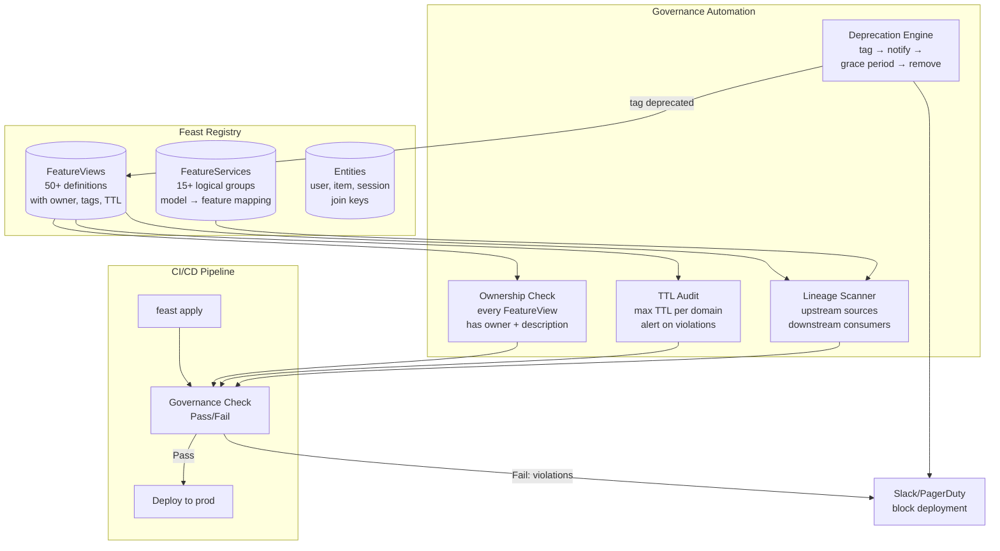
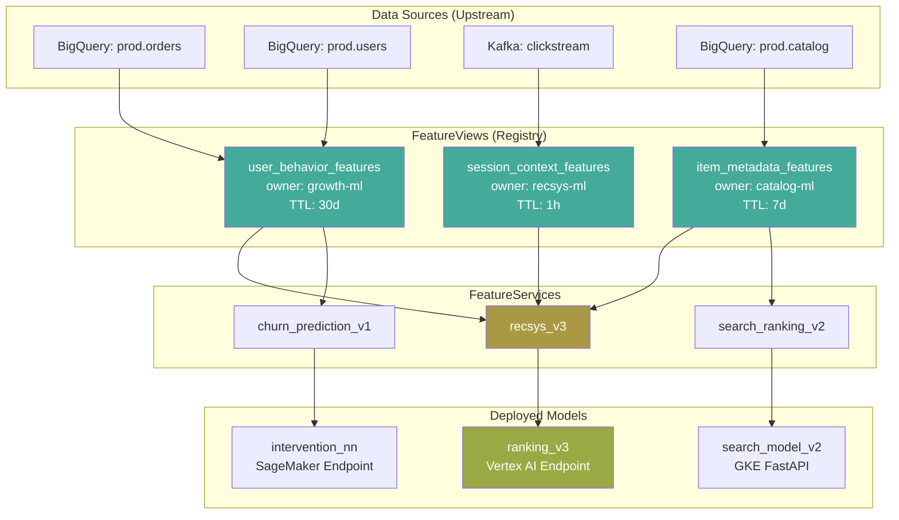
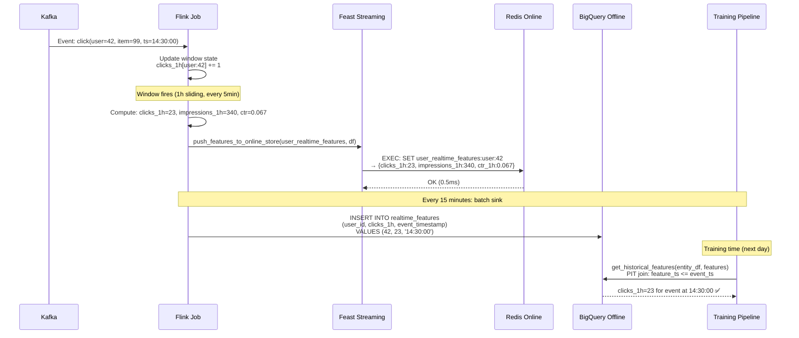
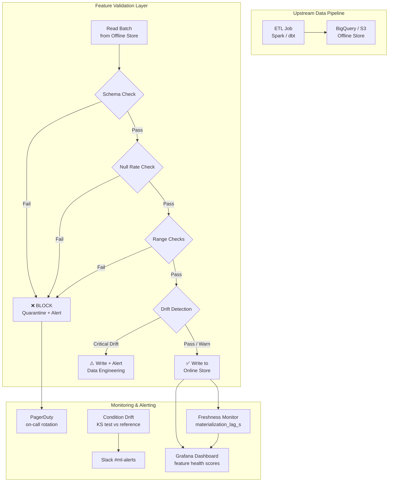
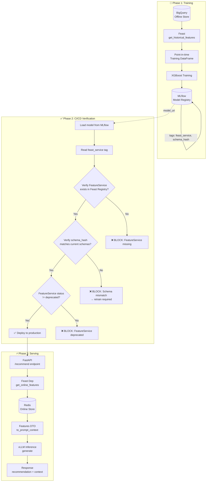
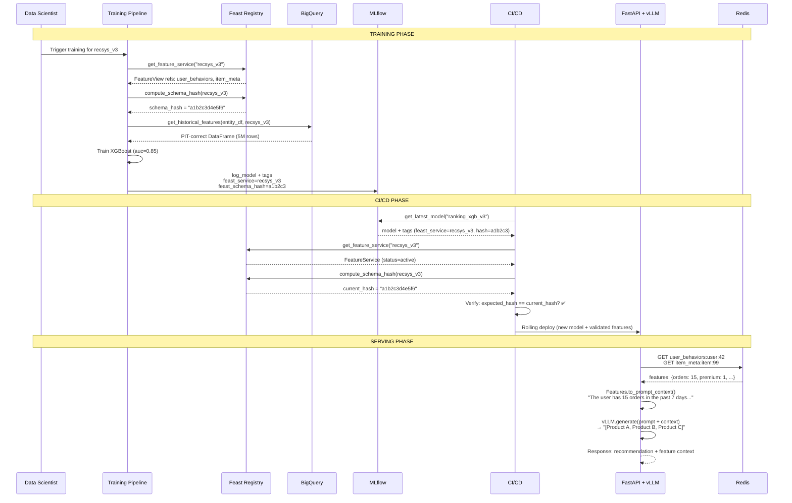

# 🏷️ Advanced Feature Engineering and Registry Governance

## 🎯 Learning Objectives
- Implement feature registry governance: ownership tracking, lineage graphs, TTL management, deprecation workflows, and access control
- Build on-demand and streaming transformations using Feast's OnDemandFeatureView and Kafka→Flink→Feast streaming pipelines
- Integrate feature validation with Great Expectations: schema checks, null rate thresholds, and distribution drift detection at the materialization boundary
- Assemble a complete MLOps stack: Feast offline → MLflow model registry → Feast online → FastAPI + vLLM serving with end-to-end feature governance
- Apply drift detection patterns from your LLM Evaluation Suite to feature monitoring in the Feast ecosystem

## Introduction

Feature engineering at scale is not just about computing aggregates — it is about governing them. A FeatureView that no one knows about is a liability, not an asset. Teams duplicate features, models decay silently, and data lineage evaporates the moment the original author leaves the company. [[../01 - Feature Store Theory and Architecture]] established that the registry is the brain of a feature store; this module shows you how to run that brain with governance — ownership, lineage, deprecation, and validation — the practices that transform a feature cache into a feature platform.

The most advanced feature engineering patterns emerge at the intersection of batch and streaming. **On-demand transformations** compute features at serving time without pre-materialization — essential for features that depend on the inference request itself (e.g., user-item interaction features, distance calculations, time-delta features). **Streaming transformations** wire Kafka events through Flink directly into Feast's online store, enabling sub-second feature freshness without batch materialization cycles. These patterns bridge your Redis expertise from the [[../02 - Feast Feature Serving Online and Offline]] module with your streaming knowledge from [[../../06 - Cloud, Infra y Backend/...]] — the same Flink clusters that process clickstream events can feed features into the online store in real time.

Feature validation is the third pillar of governance. Without it, materialized features are untrusted — a null spike in your `total_orders_7d` feature could silently degrade your recommendation model for weeks before anyone notices. Great Expectations provides the validation framework: define expectations on feature distributions, run them at the materialization boundary, and block corrupted features from entering the online store. This pattern mirrors the drift detection you already use in your LLM Evaluation Suite — detecting when feature distributions shift is conceptually identical to detecting when LLM output quality shifts. The complete MLOps stack ties everything together: Feast for features, MLflow for model registry, FastAPI for serving, vLLM for inference — a production architecture you can present in senior MLE interviews.

---

## Module 1: Feature Registry Governance — Ownership, Lineage, and Lifecycle

### M1.1 Theoretical Foundation 🧠

The feature registry is the single source of truth for all feature metadata in an organization. Without governance, it degrades into a dumping ground: 300 FeatureViews, half with no owner, a third with expired TTLs, and no one knows which models consume which features. Governance transforms this chaos into a **discoverable, auditable, and maintainable** asset catalog. The four pillars of feature registry governance are ownership, lineage, lifecycle (TTL + deprecation), and validation — and they must be enforced by infrastructure, not team discipline.

**Ownership** assigns every FeatureView to a specific team and on-call rotation. When a feature's upstream data source changes schema, the owner is automatically notified. When materialization fails, the alert goes to the owner's Slack channel, not a generic platform channel where it drowns in noise. In Feast, ownership is tracked via the `owner` field on FeatureViews and via tags (`tags={"team": "growth-ml", "oncall": "growth-ml-pager"}`). Ownership is not documentation — it is operational: `feast list-feature-views --tags team=growth-ml` should return exactly the features that team is responsible for.

**Lineage** tracks where features come from and where they go. Upstream lineage: which data sources (BigQuery tables, S3 paths, Kafka topics) feed into which FeatureViews. Downstream lineage: which FeatureServices (and therefore which deployed models) consume which FeatureViews. Lineage enables impact analysis: before deprecating a FeatureView, you query its downstream consumers and notify all model owners. Feast stores lineage implicitly (FeatureView → DataSource, FeatureService → FeatureView) but extracting it requires tooling: `feast registry-dump` exports the registry as JSON/Protobuf, and custom scripts parse the dependency graph.

**Lifecycle** governs how features age and retire. Every FeatureView has a `ttl` (when does the feature value expire from the online store), but features also need a deprecation workflow. A deprecated FeatureView should: (a) stop materializing into the online store, (b) alert any remaining consumers, (c) after a grace period (e.g., 30 days), be removed from the registry. Without deprecation governance, stale FeatureViews accumulate, consuming Redis memory for features no model uses. The [[../../05 - MLOps y Produccion/19 - Feature Engineering y Feature Stores/...]] concepts of feature lifecycle translate here into operational SLAs enforced by automation.

### M1.2 Mental Model 📐

```
┌──────────────────────────────────────────────────────────────────────────┐
│                     FEATURE REGISTRY GOVERNANCE MODEL                     │
│                                                                          │
│  ┌───────────────────────────────────────────────────────────────────┐  │
│  │                      OWNERSHIP                                     │  │
│  │                                                                   │  │
│  │  FeatureView: user_behavior_features                              │  │
│  │  ┌─────────────────────────────────────────────────────────────┐ │  │
│  │  │ owner: growth-ml@company.com                                 │ │  │
│  │  │ tags: {team: "growth-ml", oncall: "growth-pager",            │ │  │
│  │  │        sla: "p99-5ms", tier: "production"}                   │ │  │
│  │  │                                                              │ │  │
│  │  │ OWNERSHIP RESPONSIBILITIES:                                  │ │  │
│  │  │ ✅ Alerted when materialization fails                         │ │  │
│  │  │ ✅ Notified when upstream schema changes                     │ │  │
│  │  │ ✅ Approves/deprecates feature changes                       │ │  │
│  │  │ ✅ Maintains feature documentation (description, caveats)    │ │  │
│  │  └─────────────────────────────────────────────────────────────┘ │  │
│  └───────────────────────────────────────────────────────────────────┘  │
│                                                                          │
│  ┌───────────────────────────────────────────────────────────────────┐  │
│  │                      LINEAGE                                       │  │
│  │                                                                   │  │
│  │  UPSTREAM (feature provenance):                                   │  │
│  │  ┌──────────────┐    ┌──────────────────────┐                     │  │
│  │  │ BigQuery:    │───▶│ FeatureView:         │                     │  │
│  │  │ prod.orders  │    │ user_behavior_       │                     │  │
│  │  │ (500M rows)  │    │ features             │                     │  │
│  │  │              │    │ total_orders_7d      │                     │  │
│  │  └──────────────┘    └──────────┬───────────┘                     │  │
│  │                                 │                                  │  │
│  │  DOWNSTREAM (feature consumers):│                                  │  │
│  │                                 ▼                                  │  │
│  │  ┌─────────────────────────────────────────────────────────────┐ │  │
│  │  │ FeatureService: recsys_v3                                    │ │  │
│  │  │   └── Model: ranking_v3 (MLflow) deployed on GKE             │ │  │
│  │  │ FeatureService: churn_prediction_v1                          │ │  │
│  │  │   └── Model: churn_xgb_v1 (MLflow) deployed on SageMaker     │ │  │
│  │  │ FeatureService: email_personalization_v2                     │ │  │
│  │  │   └── Model: personalization_nn (MLflow) batch inference     │ │  │
│  │  └─────────────────────────────────────────────────────────────┘ │  │
│  └───────────────────────────────────────────────────────────────────┘  │
│                                                                          │
│  ┌───────────────────────────────────────────────────────────────────┐  │
│  │                      LIFECYCLE                                     │  │
│  │                                                                   │  │
│  │  STAGE          │ STATUS    │ ACTION                              │  │
│  │  ───────────────┼───────────┼─────────────────────────────────    │  │
│  │  PRODUCTION     │ Active    │ Materialized, served, monitored     │  │
│  │  DEPRECATED     │ Warning   │ Alert consumers, no new models      │  │
│  │  GRACE_PERIOD   │ Stale     │ Materialization stopped, docs flagged│  │
│  │  RETIRED        │ Archived  │ Removed from registry after 30d    │  │
│  └───────────────────────────────────────────────────────────────────┘  │
└──────────────────────────────────────────────────────────────────────────┘
```

```
┌──────────────────────────────────────────────────────────────────┐
│                     FEATURE LINEAGE GRAPH                           │
│                                                                  │
│  Data Sources (upstream)         FeatureViews        Models (d/s)│
│  ═══════════════════════         ════════════        ════════════│
│                                                                  │
│  ┌────────────────┐                                              │
│  │ BQ: prod.orders├──────────────┐                               │
│  └────────────────┘              │                               │
│                                  ▼                               │
│  ┌────────────────┐    ┌─────────────────────┐                   │
│  │ BQ: prod.users ├───▶│ user_behavior_fv    │──────────┐        │
│  └────────────────┘    └─────────┬───────────┘          │        │
│                                  │                       │        │
│  ┌────────────────┐              │         ┌─────────────▼──────┐ │
│  │ Kafka: clickstr├──┐           │         │ recsys_v3          │ │
│  └────────────────┘  │           │         │  → ranking_v3      │ │
│                       ▼           │         │  → related_items   │ │
│               ┌──────────────┐   │         └────────────────────┘ │
│               │ session_fv   │───┤                                │
│               └──────────────┘   │         ┌────────────────────┐ │
│                                  │         │ churn_prediction   │ │
│  ┌────────────────┐              │         │  → churn_xgb_v1    │ │
│  │ BQ: catalog    │──┐           │         │  → intervention    │ │
│  └────────────────┘  │           │         └────────────────────┘ │
│                       ▼           │                                │
│               ┌──────────────┐   │                                │
│               │ item_meta_fv │───┘                                │
│               └──────┬───────┘                                    │
│                      │                                            │
│                      │              ┌────────────────────┐        │
│                      └──────────────│ search_ranking      │        │
│                                     │  → search_model_v2 │        │
│                                     └────────────────────┘        │
│                                                                  │
│  LEGEND: ─── = upstream data flow   ─── = downstream consumption │
│                                                                  │
│  IMPACT ANALYSIS: Deprecating item_meta_fv would break:           │
│  - recsys_v3 (ranking_v3, related_items)                         │
│  - search_ranking (search_model_v2)                              │
│  Alert model owners 14 days before deprecation.                   │
└──────────────────────────────────────────────────────────────────┘
```

```
┌──────────────────────────────────────────────────────────────────┐
│                   DEPRECATION WORKFLOW TIMELINE                    │
│                                                                  │
│  Day 0: FeatureView tagged deprecated                            │
│    │                                                              │
│    │  Automated:                                                  │
│    │  - Set tags: {status: deprecated, deprecated_date: today}    │
│    │  - Query downstream FeatureServices → identify models        │
│    │  - Post Slack message to model owners                        │
│    │  - Update documentation with migration guide                 │
│    │                                                              │
│    ▼                                                              │
│  Day 14: Grace period begins                                     │
│    │                                                              │
│    │  Automated:                                                  │
│    │  - Stop materialization (exclude from Airflow DAG)           │
│    │  - Online store keys remain (cached, expiring per TTL)      │
│    │  - get_historical_features() still works (training)         │
│    │  - get_online_features() returns last materialized values   │
│    │                                                              │
│    ▼                                                              │
│  Day 30: Retirement                                              │
│    │                                                              │
│    │  Automated:                                                  │
│    │  - Remove FeatureView from registry (feast apply without it)│
│    │  - Archive feature definition in git history                │
│    │  - Online store keys expire naturally / manual cleanup      │
│    │  - Training jobs must remove reference before Day 30       │
│    │                                                              │
│    ▼                                                              │
│  Post-retirement: Archive                                        │
│      - FeatureView definition preserved in git (tagged commit)   │
│      - Historical data remains in offline store (no cleanup)     │
│      - Audit log: who deprecated, when, why, migration path     │
└──────────────────────────────────────────────────────────────────┘
```

### M1.3 Syntax and Semantics 📝

```python
# registry_governance.py — Feature registry governance: ownership,
#                          lineage extraction, TTL audit, and deprecation.
# WHY: Governance is not documentation — it is executable code. This script
#      queries the registry, validates policy compliance, and enforces rules
#      (e.g., no FeatureView without an owner, no TTL > 365 days).
from datetime import datetime, timedelta
from typing import Dict, List, Set, Optional
from dataclasses import dataclass, field
import json

from feast import FeatureStore
from feast.feature_view import FeatureView as FeastFeatureView

store = FeatureStore(repo_path="./feature_repo")


# ── Governance Data Structures ─────────────────────────────────────────────
@dataclass
class FeatureGovernanceReport:
    """WHY: Structured report for CI/CD pipeline or weekly governance review.
         Compliance score below threshold blocks deployment."""
    total_views: int = 0
    views_with_owner: int = 0
    views_with_description: int = 0
    views_with_ttl_over_90d: int = 0
    views_without_tags: int = 0
    deprecated_views: int = 0
    violations: List[str] = field(default_factory=list)

    @property
    def owner_compliance(self) -> float:
        return self.views_with_owner / max(self.total_views, 1)

    @property
    def is_compliant(self) -> bool:
        return len(self.violations) == 0


# ── Ownership Audit ─────────────────────────────────────────────────────────
def audit_ownership() -> Dict[str, List[str]]:
    """WHY: Every FeatureView must have an owner. No owner = no deployment
         to production. This runs as a CI/CD check on every PR."""
    fv_list = store.list_feature_views()
    unowned = []
    by_owner: Dict[str, List[str]] = {}

    for fv in fv_list:
        owner = getattr(fv, "owner", None) or "UNOWNED"
        if owner == "UNOWNED":
            unowned.append(fv.name)

        by_owner.setdefault(owner, []).append(fv.name)

    print(f"Ownership audit: {len(fv_list)} FeatureViews")
    print(f"  With owner: {len(fv_list) - len(unowned)}")
    print(f"  Unowned (BLOCKING): {unowned}")
    print(f"  By owner: {json.dumps(by_owner, indent=2)}")

    if unowned:
        raise ValueError(f"Cannot proceed: {len(unowned)} FeatureViews have no owner: {unowned}")

    return by_owner


# ── TTL Audit ──────────────────────────────────────────────────────────────
def audit_ttls(max_ttl_days: int = 365) -> List[str]:
    """WHY: TTLs longer than max_ttl_days indicate features that may never
         expire — these consume Redis memory indefinitely. Audit enforces
         maximum TTL caps per feature domain."""
    fv_list = store.list_feature_views()
    violations = []

    for fv in fv_list:
        if fv.ttl and fv.ttl > timedelta(days=max_ttl_days):
            violations.append(f"{fv.name}: TTL={fv.ttl} exceeds {max_ttl_days} days")

    print(f"TTL audit: {len(fv_list)} FeatureViews checked, {len(violations)} violations")
    for v in violations:
        print(f"  VIOLATION: {v}")

    return violations


# ── Lineage Extraction ──────────────────────────────────────────────────────
def extract_lineage() -> Dict[str, dict]:
    """WHY: Lineage tells you which FeatureServices (and therefore which
         deployed models) consume each FeatureView. Before deprecating a
         FeatureView, query lineage to identify affected models.
         WHY: Feast does not natively expose downstream lineage, so we
         compute it by iterating FeatureServices and collecting their
         FeatureView references."""
    fv_list = store.list_feature_views()
    fs_list = store.list_feature_services()
    lineage: Dict[str, dict] = {}

    for fv in fv_list:
        lineage[fv.name] = {
            "upstream": str(getattr(fv, "source", getattr(fv, "batch_source", "unknown"))),
            "downstream_services": [],
            "downstream_models": [],
        }

    for fs in fs_list:
        fs_name = fs.name
        # WHY: FeatureService.features contains FeatureView references.
        #      Parse them to extract which FeatureViews this service uses.
        feature_refs = getattr(fs, "features", getattr(fs, "feature_view_projections", []))
        for fv_ref in feature_refs:
            fv_name = fv_ref.name if hasattr(fv_ref, "name") else str(fv_ref)
            if fv_name in lineage:
                lineage[fv_name]["downstream_services"].append(fs_name)

    print(f"Lineage extracted: {len(lineage)} FeatureViews, {len(fs_list)} FeatureServices")
    for fv_name, info in lineage.items():
        if info["downstream_services"]:
            print(f"  {fv_name} → consumed by: {info['downstream_services']}")
        else:
            print(f"  {fv_name} → NO DOWNSTREAM CONSUMERS (candidate for deprecation)")

    return lineage


# ── Deprecation Workflow ────────────────────────────────────────────────────
def deprecate_feature_view(name: str, reason: str, migration_guide: str = "") -> bool:
    """WHY: Formal deprecation workflow. Tags the FeatureView, alerts
         downstream consumers via lineage, and returns True if safe to proceed.
         WHY: Deprecation is a two-step process: first tag (alert consumers),
         then remove after grace period. Never remove immediately."""
    lineage = extract_lineage()
    if name not in lineage:
        print(f"FeatureView '{name}' not found in registry")
        return False

    consumers = lineage[name]["downstream_services"]
    if consumers:
        print(f"WARNING: '{name}' is consumed by: {consumers}")
        print(f"Notify model owners before proceeding.")

    # WHY: Tag the FeatureView as deprecated. This metadata persists in the
    #      registry and is visible to all consumers.
    fv = next((fv for fv in store.list_feature_views() if fv.name == name), None)
    if fv is None:
        return False

    existing_tags = getattr(fv, "tags", {}) or {}
    existing_tags.update({
        "status": "deprecated",
        "deprecation_date": datetime.now().strftime("%Y-%m-%d"),
        "deprecation_reason": reason,
        "migration_guide": migration_guide,
    })

    print(f"FeatureView '{name}' tagged as DEPRECATED")
    print(f"  Reason: {reason}")
    print(f"  Consumers: {consumers}")
    print(f"  Action: Stop materialization in next deploy cycle. Remove from registry after 30-day grace period.")
    return True


# ── Governance Report ───────────────────────────────────────────────────────
def generate_governance_report() -> FeatureGovernanceReport:
    """WHY: Single entry point for CI/CD governance check. Fails the pipeline
         if compliance score < threshold or any blocking violations found."""
    report = FeatureGovernanceReport()
    fv_list = store.list_feature_views()
    report.total_views = len(fv_list)

    for fv in fv_list:
        owner = getattr(fv, "owner", None)
        if owner and owner.strip():
            report.views_with_owner += 1
        else:
            report.violations.append(f"NO_OWNER: {fv.name}")

        desc = getattr(fv, "description", None)
        if desc and desc.strip():
            report.views_with_description += 1
        else:
            report.violations.append(f"NO_DESCRIPTION: {fv.name}")

        tags = getattr(fv, "tags", {}) or {}
        if not tags:
            report.views_without_tags += 1
            report.violations.append(f"NO_TAGS: {fv.name}")

        ttl = getattr(fv, "ttl", None)
        if ttl and ttl > timedelta(days=90):
            report.views_with_ttl_over_90d += 1

        if tags.get("status") == "deprecated":
            report.deprecated_views += 1

    print(f"\n{'='*60}")
    print(f"GOVERNANCE REPORT — {datetime.now().strftime('%Y-%m-%d %H:%M')}")
    print(f"{'='*60}")
    print(f"  Total FeatureViews:     {report.total_views}")
    print(f"  With owner:             {report.views_with_owner}/{report.total_views} ({report.owner_compliance:.0%})")
    print(f"  With description:       {report.views_with_description}/{report.total_views}")
    print(f"  Without tags:           {report.views_without_tags}")
    print(f"  TTL > 90 days:          {report.views_with_ttl_over_90d}")
    print(f"  Deprecated:             {report.deprecated_views}")
    print(f"  Violations:             {len(report.violations)}")
    if report.violations:
        print(f"\n  VIOLATIONS (BLOCKING):")
        for v in report.violations:
            print(f"    - {v}")
    print(f"  Compliant:              {report.is_compliant}")

    return report


if __name__ == "__main__":
    report = generate_governance_report()
    if not report.is_compliant:
        raise SystemExit(f"Governance check FAILED: {len(report.violations)} violations")
    print(f"\nGovernance check PASSED: {report.total_views} FeatureViews compliant")
```

### M1.4 Visual Representation 🖼️





### M1.5 Application in ML/AI Systems 🤖

**LinkedIn — Feature Registry as a Platform (2023):** LinkedIn's ML platform team built a feature registry governance system on top of their internal feature store (Frame). Their key innovation: a **Registry Dashboard** that visualizes the lineage graph, showing every FeatureView's upstream data sources and downstream consumers. Model owners can see exactly which features their model uses and are notified 30 days before any upstream feature is deprecated. Impact: feature duplication decreased by 40% in 12 months as teams discovered existing features through the registry rather than reimplementing them. Their governance rule: no FeatureView enters production without a designated owner, a 99.9% freshness SLA, and a documented rollback procedure.

**Atlassian — TTL Governance for Jira ML Features (2024):** Atlassian's Jira product uses Feast with rigorous TTL governance. Features are classified into tiers: Tier 1 (real-time, TTL ≤ 1 hour — e.g., current sprint burndown), Tier 2 (daily, TTL ≤ 24 hours — e.g., issue velocity), Tier 3 (stable, TTL ≤ 90 days — e.g., team topology features). Any FeatureView with a TTL exceeding its tier cap is automatically rejected in CI/CD. A nightly audit scans for features whose TTL is longer than their actual update frequency (e.g., TTL=7d but the feature is updated hourly — wasting Redis memory). Impact: this governance prevented an estimated $120K/year in unnecessary Redis memory costs across their 4 GCP regions.

### M1.6 Common Pitfalls ⚠️ + 💡 Tips

| Pitfall | Consequence | 💡 Mitigation |
|---|---|---|
| FeatureView without owner field | Materialization failures alert no one; feature silently goes stale | CI/CD check: block `feast apply` if owner field is empty or equals "UNOWNED" |
| No downstream lineage tracking before deprecation | FeatureView removed from registry; 3 production models break silently | Run `extract_lineage()` before any feature removal; require sign-off from all downstream model owners |
| TTL set to 365 days for a feature updated hourly | Redis stores 8,760 redundant copies; 99% of memory wasted | Match TTL to update frequency: TTL = update_interval × 3 (buffer); audit for TTL/update mismatch |
| Tags used inconsistently across teams | Team A uses `team:growth`, Team B uses `team:growth-ml`; filtering by team returns incomplete results | Standardize tag keys in CI/CD: accept only from an approved tag taxonomy (team, tier, refresh, domain, status) |

### M1.7 Knowledge Check ❓

1. **Ownership crisis:** Your registry has 60 FeatureViews, but only 35 have owners. The 25 unowned features include 8 used by production models. Design a governance remediation plan: how do you identify which unowned features are critical, how do you assign ownership, and what CI/CD check prevents recurrence?

2. **Deprecation impact analysis:** You need to deprecate `user_demographic_features` (used by 4 FeatureServices across 6 models). Walk through the deprecation workflow: what happens on Day 0, Day 14, and Day 30? What do you do if one model owner cannot migrate within 30 days?

3. **Lineage gap:** Feast's registry stores upstream lineage (DataSource → FeatureView) but does not natively expose downstream lineage (FeatureView → FeatureService → Model). Write the pseudocode for a `get_downstream_consumers(feature_view_name)` function that queries the registry and returns all affected models (by querying MLflow for models tagged with those FeatureServices).

---

## Module 2: On-Demand and Streaming Transformations

### M2.1 Theoretical Foundation 🧠

Not all features can be pre-computed in batch. Some features depend on the inference request itself — the interaction between a user and an item, the temporal distance between two events, or a dynamically computed embedding. These **on-demand transformations** execute at serving time, consuming pre-materialized features as inputs and producing derived features as outputs. Feast's `OnDemandFeatureView` provides this capability: it defines a Python function (or a Pandas UDF) that runs in the inference pipeline, executing with the entity rows of the current request as input.

The key engineering constraint is latency. On-demand transformations add computation time to the inference path — every millisecond matters. The transformation function must be stateless, deterministic, and efficient. It should not make network calls, access databases, or perform heavy matrix operations. Common use cases: computing a click-through rate from `clicks_7d / impressions_7d` (both pre-materialized), calculating a distance between user and item embeddings (both pre-materialized), or normalizing a feature value using a pre-computed mean and standard deviation.

**Streaming transformations** solve the opposite problem: features that change so rapidly that batch materialization cannot keep up. In the streaming pattern, a Kafka topic receives raw events, a Flink job computes aggregate features over sliding windows, and Feast's streaming ingestion API writes the results directly into the online store — bypassing the offline store entirely for serving. The offline store still receives the same features via a batch sink for training, maintaining consistency. This pattern is essential for features with sub-minute volatility: real-time bidding features, fraud detection signals, or live inventory counts.

The streaming pipeline's correctness depends on **exactly-once semantics**. If a Flink checkpoint fails and events are replayed, the feature value in Redis must not be double-counted. Feast's streaming ingestion supports idempotent writes — each feature value has a timestamp, and only the latest timestamp is retained per entity key. This aligns with Feast's point-in-time correctness model: at training time, `get_historical_features()` will retrieve the feature value as it was at each training example's timestamp, regardless of whether it came from batch or streaming ingestion. Your knowledge of [[../../06 - Cloud, Infra y Backend/...]] Kafka and Flink patterns applies directly here — Feast adds the feature abstraction layer on top of the streaming infrastructure you already understand.

### M2.2 Mental Model 📐

```
┌──────────────────────────────────────────────────────────────────────────┐
│                ON-DEMAND VS PRE-COMPUTED FEATURE COMPARISON               │
│                                                                          │
│  PRE-COMPUTED FEATURE (FeatureView):                                     │
│  ┌──────────────────────────────────────────────────────────────────┐   │
│  │ Offline Store ──── materialize ───▶ Online Store (Redis)         │   │
│  │                                                                    │   │
│  │ Inference: REDIS GET → feature value (0.5ms total)                │   │
│  │ ✅ Sub-millisecond latency                                        │   │
│  │ ✅ Consistent training vs serving                                 │   │
│  │ ❌ Cannot use request-time parameters (e.g., item_id, timestamp)  │   │
│  │ USE: User-level aggregates, item metadata, context features      │   │
│  └──────────────────────────────────────────────────────────────────┘   │
│                                                                          │
│  ON-DEMAND FEATURE (OnDemandFeatureView):                                │
│  ┌──────────────────────────────────────────────────────────────────┐   │
│  │ Online Store (Redis)                                              │   │
│  │   │                                                               │   │
│  │   ▼                                                               │   │
│  │ ┌─────────────────────────────────────────────────────────────┐  │   │
│  │ │ Serving-time Python function                                 │  │   │
│  │ │   def user_item_score(                                       │  │   │
│  │ │       user_embed: np.ndarray,   ← from Redis (pre-comp)      │  │   │
│  │ │       item_embed: np.ndarray,   ← from Redis (pre-comp)      │  │   │
│  │ │   ) → float:                                                 │  │   │
│  │ │       return cosine_similarity(user_embed, item_embed)        │  │   │
│  │ └─────────────────────────────────────────────────────────────┘  │   │
│  │                                                                    │   │
│  │ Inference: REDIS GET × 2 (1ms) + compute (0.1ms) = 1.1ms         │   │
│  │ ✅ Can use request-time entity relationships                      │   │
│  │ ✅ No offline storage needed                                      │   │
│  │ ❌ Adds computation latency to inference path                     │   │
│  │ ❌ Must verify training-serving parity (same function, both paths)│   │
│  │ USE: Interaction features, derived ratios, dynamic normalizations │   │
│  └──────────────────────────────────────────────────────────────────┘   │
└──────────────────────────────────────────────────────────────────────────┘
```

```
┌──────────────────────────────────────────────────────────────────┐
│                  STREAMING FEATURE PIPELINE                        │
│                                                                  │
│  ┌──────────┐    ┌───────────────┐    ┌──────────────────────┐  │
│  │ Kafka    │───▶│ Flink Job     │───▶│ Feast                │  │
│  │ Topic:   │    │               │    │ Streaming Ingestion  │  │
│  │ raw_clicks│   │ ┌───────────┐ │    │                      │  │
│  │          │    │ │ Sliding   │ │    │ ┌──────────────────┐ │  │
│  │ {user_id,│    │ │ Window    │ │    │ │ Online Store     │ │  │
│  │  item_id,│    │ │ (1h, slide│ │───▶│ │ (Redis)          │ │  │
│  │  ts}     │    │ │  5min)    │ │    │ │                  │ │  │
│  └──────────┘    │ │           │ │    │ │ user:42 →         │ │  │
│                  │ │ clicks =  │ │    │ │  {clicks_1h: 23, │ │  │
│  ┌──────────┐    │ │  COUNT(*) │ │    │ │   impressions_1h:│ │  │
│  │ Kafka    │───▶│ │ GROUP BY  │ │    │ │      340}        │ │  │
│  │ Topic:   │    │ │ user_id   │ │    │ └──────────────────┘ │  │
│  │ raw_impr │    │ └───────────┘ │    │                      │  │
│  └──────────┘    └───────────────┘    └──────────┬───────────┘  │
│                                                   │              │
│  ┌──────────┐                                    │              │
│  │ Flink    │─── Batch Sink ────────────────────▶│              │
│  │ Side     │    (every 15min)                   ▼              │
│  │ Output   │                          ┌──────────────────┐    │
│  └──────────┘                          │ Offline Store    │    │
│                                        │ (BigQuery / S3)  │    │
│                                        │ Historical data  │    │
│                                        └──────────────────┘    │
│                                                                  │
│  KEY INSIGHT: Streaming writes to online store for serving.     │
│  Batch sink writes to offline store for training.                │
│  Both from the same Flink job — no dual computation.             │
└──────────────────────────────────────────────────────────────────┘
```

```
┌──────────────────────────────────────────────────────────────────┐
│            ON-DEMAND FV SERVING-TIME EXECUTION FLOW               │
│                                                                  │
│  Inference Request: GET /rank?user_id=42&item_id=99               │
│       │                                                          │
│       ▼                                                          │
│  ┌─────────────────────────────────────────────────────────┐    │
│  │ Step 1: Feast resolves FeatureService "recsys_v4"        │    │
│  │   - user_behavior_fv (pre-materialized, Redis)           │    │
│  │   - item_metadata_fv (pre-materialized, Redis)           │    │
│  │   - user_item_interaction_fv (ON-DEMAND, Python func)    │    │
│  └─────────────────────────────────────────────────────────┘    │
│       │                                                          │
│       ▼                                                          │
│  ┌─────────────────────────────────────────────────────────┐    │
│  │ Step 2: Fetch pre-materialized features from Redis       │    │
│  │   GET user_behavior:user:42 → {orders_7d: 15, ...}      │    │
│  │   GET item_meta:item:99 → {category: 5, price: 29.99}   │    │
│  │   GET user_embed:user:42 → [0.12, -0.34, ...] (768d)    │    │
│  │   GET item_embed:item:99 → [0.08, -0.41, ...] (768d)    │    │
│  └─────────────────────────────────────────────────────────┘    │
│       │                                                          │
│       ▼                                                          │
│  ┌─────────────────────────────────────────────────────────┐    │
│  │ Step 3: Execute OnDemandFeatureView function             │    │
│  │   def user_item_interaction(user_embed, item_embed):     │    │
│  │       score = dot_product(user_embed, item_embed)        │    │
│  │       category_match = (category_id == user.top_cat)     │    │
│  │       return {"interaction_score": score,                │    │
│  │               "category_match": category_match}          │    │
│  └─────────────────────────────────────────────────────────┘    │
│       │                                                          │
│       ▼                                                          │
│  ┌─────────────────────────────────────────────────────────┐    │
│  │ Step 4: Full feature vector passed to model.predict()    │    │
│  │   [orders_7d, avg_value, category, price,                │    │
│  │    interaction_score, category_match]                    │    │
│  └─────────────────────────────────────────────────────────┘    │
└──────────────────────────────────────────────────────────────────┘
```

### M2.3 Syntax and Semantics 📝

```python
# on_demand_and_streaming.py — OnDemandFeatureView for serving-time
#                              transformations + streaming ingestion pattern.
# WHY: OnDemandFeatureView computes features at serving time from
#      pre-materialized inputs. This is essential for interaction features
#      that depend on both user and item entities simultaneously.
from datetime import datetime, timedelta
import numpy as np
import pandas as pd

from feast import (
    Entity, FeatureStore, FeatureView, FeatureService,
    Field, FileSource, RequestSource,
)
from feast.on_demand_feature_view import on_demand_feature_view
from feast.types import Float32, Float64, Int64, String, UnixTimestamp

store = FeatureStore(repo_path="./feature_repo")

# ── Entities ───────────────────────────────────────────────────────────────
user_entity = Entity(
    name="user_id",
    join_keys=["user_id"],
    description="User identifier"
)

item_entity = Entity(
    name="item_id",
    join_keys=["item_id"],
    description="Item identifier"
)

# ── Pre-materialized FeatureViews ───────────────────────────────────────────
user_behavior_source = FileSource(
    path="gs://feast-features/user_behavior.parquet",
    timestamp_field="event_timestamp",
)

user_behavior_fv = FeatureView(
    name="user_behavior_features",
    entities=[user_entity],
    ttl=timedelta(hours=1),
    schema=[
        Field(name="total_orders_7d", dtype=Int64),
        Field(name="avg_order_value_30d", dtype=Float32),
        Field(name="top_category_id", dtype=Int64),
        Field(name="user_embedding", dtype=Array(Float32), description="768-dim user embedding"),
    ],
    online=True,
    source=user_behavior_source,
    tags={"team": "recsys-ml"},
    owner="recsys-ml@company.com",
)

item_metadata_source = FileSource(
    path="gs://feast-features/item_metadata.parquet",
    timestamp_field="event_timestamp",
)

item_metadata_fv = FeatureView(
    name="item_metadata_features",
    entities=[item_entity],
    ttl=timedelta(hours=1),
    schema=[
        Field(name="category_id", dtype=Int64),
        Field(name="base_price", dtype=Float32),
        Field(name="popularity_score", dtype=Float32),
        Field(name="item_embedding", dtype=Array(Float32), description="768-dim item embedding"),
    ],
    online=True,
    source=item_metadata_source,
    tags={"team": "catalog-ml"},
    owner="catalog-ml@company.com",
)

# ── On-Demand FeatureView ───────────────────────────────────────────────────
# WHY: OnDemandFeatureView computes features at serving time. It receives
#      pre-materialized features as inputs and produces derived features.
#      The function runs in Python on the serving pod — keep it fast (<1ms).
#      WHY: sources include both FeatureViews (pre-materialized) and
#      RequestSource (values from the incoming HTTP request, like the
#      requested item_id). This bridges static features with dynamic context.
@on_demand_feature_view(
    sources=[
        user_behavior_fv[["total_orders_7d", "avg_order_value_30d", "top_category_id", "user_embedding"]],
        item_metadata_fv[["category_id", "popularity_score", "item_embedding"]],
        RequestSource(
            name="request_context",
            schema=[
                Field(name="request_hour", dtype=Int64),
                Field(name="device_type", dtype=String),
            ],
        ),
    ],
    schema=[
        Field(name="interaction_score", dtype=Float32, description="cosine similarity between user and item embeddings"),
        Field(name="category_match", dtype=Int64, description="1 if user top category matches item category"),
        Field(name="hour_bucket", dtype=Int64, description="hour of day normalized to model-friendly bucket"),
        Field(name="value_ratio", dtype=Float32, description="item price / user avg order value"),
    ],
    tags={"team": "recsys-ml", "generation": "serving-time"},
    owner="recsys-ml@company.com",
)
def user_item_interaction_fv(inputs: pd.DataFrame) -> pd.DataFrame:
    """WHY: This function runs at serving time for every inference request.
         Inputs is a DataFrame with one row per entity combination.
         All pre-materialized features are fetched from Redis first (not here),
         then this function computes derived features from them.
         WHY: The function must be vectorized for batch requests (multiple
         user-item pairs in a single call for ranking scenarios)."""
    df = pd.DataFrame()

    # WHY: Cosine similarity between pre-materialized embeddings.
    #      Each embedding is a list/array — convert to numpy for vector ops.
    user_emb = np.array(inputs["user_embedding"].tolist())
    item_emb = np.array(inputs["item_embedding"].tolist())

    # WHY: Cosine similarity: dot(A,B) / (|A| * |B|)
    #      Axis=1 computes row-wise dot product for batch inputs.
    dot = np.sum(user_emb * item_emb, axis=1)
    norm_user = np.linalg.norm(user_emb, axis=1)
    norm_item = np.linalg.norm(item_emb, axis=1)
    df["interaction_score"] = dot / (norm_user * norm_item + 1e-8)

    # WHY: Feature interaction — does the item's category match the user's
    #      historically most-purchased category? Simple but powerful signal.
    df["category_match"] = (
        inputs["top_category_id"] == inputs["category_id"]
    ).astype(int)

    # WHY: Time-based feature from request context (not pre-materialized).
    #      Hour-bucket normalization for models that use cyclic time features.
    df["hour_bucket"] = inputs["request_hour"] % 24
    df["value_ratio"] = inputs["base_price"] / (inputs["avg_order_value_30d"] + 1e-6)

    return df


# ── FeatureService including On-Demand FV ───────────────────────────────────
# WHY: FeatureService can include OnDemandFeatureViews alongside regular
#      FeatureViews. Feast resolves the dependency graph: first fetch
#      pre-materialized features, then run on-demand computation.
recsys_with_interaction = FeatureService(
    name="recsys_v4_interaction",
    features=[
        user_behavior_fv[["total_orders_7d", "avg_order_value_30d"]],
        item_metadata_fv[["category_id", "popularity_score"]],
        user_item_interaction_fv,  # ← On-demand FV as a full FeatureView reference
    ],
    tags={"model": "ranking_v4", "features": "with_interaction"},
    description="Recommendation features with on-demand user-item interaction scoring",
)

# ── Apply + Materialize ────────────────────────────────────────────────────
store.apply([
    user_entity, item_entity,
    user_behavior_fv, item_metadata_fv,
    user_item_interaction_fv,  # On-demand FVs also registered in the registry
    recsys_with_interaction,
])

# ── Online Retrieval with On-Demand Features ────────────────────────────────
# WHY: get_online_features() automatically resolves the on-demand dependency:
#      (1) fetch user and item features from Redis
#      (2) run user_item_interaction_fv() function
#      (3) return all features combined
online_result = store.get_online_features(
    features=store.get_feature_service("recsys_v4_interaction"),
    entity_rows=[{"user_id": "user_42", "item_id": "item_99"}],
).to_dict()

print("Online features with on-demand interaction:")
for key, value in online_result.items():
    print(f"  {key}: {value}")


# ── Streaming Ingestion Pattern (Kafka → Flink → Feast) ─────────────────────
# WHY: In production, a Flink job processes Kafka events and writes features
#      to the online store via Feast's streaming ingestion API. The offline
#      store also receives data via a batch sink for training consistency.
#      This is a conceptual example — actual implementation depends on your
#      Flink + Feast integrations.
def streaming_ingestion_example():
    """WHY: Demonstrates the conceptual pattern for pushing stream-computed
         features into the online store. In production, this code runs inside
         a Flink process function, not as a standalone Python script.
         WHY: Each feature has an event_timestamp — Feast uses this for PIT
         joins, ensuring training data matches the streaming feature values
         as they were at each training timestamp."""
    from datetime import datetime

    # Conceptual: inside Flink's ProcessFunction
    # def process_element(event: ClickEvent, ctx: Context, out: Collector):
    #     window_state = ctx.get_state()
    #     window_state.update(event.user_id, event.item_id, event.ts)
    #     clicks_1h = window_state.get_clicks(event.user_id, timedelta(hours=1))
    #     impressions_1h = window_state.get_impressions(event.user_id, timedelta(hours=1))
    #
    #     # Push computed features to Feast online store
    #     feature_row = {
    #         "user_id": event.user_id,
    #         "event_timestamp": datetime.now(),
    #         "clicks_1h": clicks_1h,
    #         "impressions_1h": impressions_1h,
    #         "ctr_1h": clicks_1h / max(impressions_1h, 1),
    #     }
    #     feast_client.push_features_to_online_store(
    #         feature_view="user_realtime_features",
    #         df=pd.DataFrame([feature_row]),
    #     )
    #
    #     # Batch sink (every 15 minutes) for offline store
    #     out.collect(FeatureValue(
    #         user_id=event.user_id,
    #         feature="clicks_1h", value=clicks_1h,
    #         event_timestamp=datetime.now(),
    #     ))

    print("Streaming ingestion: Flink → Feast online store (sub-5s freshness)")
    print("Batch sink: Flink → BigQuery (for training, 15-min batches)")
    print("Both from same computation — no dual-implementation skew")


if __name__ == "__main__":
    streaming_ingestion_example()
```

### M2.4 Visual Representation 🖼️

```mermaid
flowchart LR
    subgraph KAFKA["Kafka Event Stream"]
        CLICKS[Topic: raw_clicks<br/>{user_id, item_id, ts}]
        IMPR[Topic: raw_impressions<br/>{user_id, item_id, ts, device}]
    end

    subgraph FLINK["Flink Job"]
        WINDOW[Windowed Aggregation<br/>1h sliding, 5min slide]
        CLICKS --> WINDOW
        IMPR --> WINDOW
    end

    subgraph ONLINE["Online Store (Redis)"]
        REDIS_SRV[Feature keys:<br/>user:42:clicks_1h=23<br/>user:42:ctr_1h=0.067]
    end

    subgraph OFFLINE["Offline Store (BigQuery)"]
        BQ_TABLE[Table: realtime_features<br/>partitioned by DATE(ts)]
    end

    subgraph SERVE["Serving Layer"]
        FASTAPI[FastAPI<br/>get_online_features]
        MODEL[Model<br/>predict]
    end

    WINDOW -->|Streaming write<br/>sub-second| REDIS_SRV
    WINDOW -->|Batch sink<br/>every 15min| BQ_TABLE
    REDIS_SRV --> FASTAPI
    BQ_TABLE -->|get_historical_features| TRAIN[Training Pipeline<br/>Airflow]
    FASTAPI --> MODEL
```



### M2.5 Application in ML/AI Systems 🤖

**Criteo — Real-Time Bidding with Streaming Features (2023):** Criteo's ad bidding platform processes 3 million bid requests per second, each requiring features computed from streaming data. Their architecture: Kafka → Flink → Feast streaming ingestion → Redis. Flink jobs compute per-user, per-publisher, and per-campaign aggregates over 5-minute sliding windows. Feast's streaming ingestion writes these features to Redis at sub-second latency, and the bidding model retrieves them via `get_online_features()` at p99 < 2ms. The key innovation: Flink also writes features to BigQuery every 5 minutes, and Feast's `get_historical_features()` generates training datasets from the same Flink computations — eliminating the training-serving skew inherent in separate batch/streaming code paths. Impact: bid win rate improved by 3.1% after migration.

**Pinterest — On-Demand Embedding Features for Related Pins (2024):** Pinterest's Related Pins recommendation uses Feast OnDemandFeatureViews to compute pin-pin similarity at serving time. Each pin has a pre-materialized embedding (384-dim from a two-tower model) stored in Redis. At serving time, an OnDemandFeatureView computes cosine similarity between the query pin's embedding and 200 candidate pin embeddings — all fetched in a single Redis pipelined call, then compared in vectorized NumPy. This avoids pre-computing an N×N similarity matrix (prohibitively large at Pinterest's scale) while maintaining p99 serving latency of 12ms. Impact: the on-demand approach reduced embedding storage costs by 95% compared to pre-computing pairwise similarities.

### M2.6 Common Pitfalls ⚠️ + 💡 Tips

| Pitfall | Consequence | 💡 Mitigation |
|---|---|---|
| On-demand function with side effects (DB calls, HTTP requests) | p99 latency explodes from 3ms to 200ms; timeout cascades | Lint on-demand functions: forbid network I/O, file I/O; only allow stateless NumPy/Pandas operations |
| On-demand function output shape differs between training and serving paths | Model training uses one feature shape; serving uses another; predictions silently broken | Unit test on-demand functions with identical input schema in both paths; verify `get_historical_features()` and `get_online_features()` produce same column names and order |
| Streaming ingestion without exactly-once semantics | Flink checkpoint replay double-counts events; feature values inflated in Redis | Enable Flink exactly-once with idempotent writes; use event timestamp as dedup key in Feast ingestion |
| Streaming features not written to offline store | Training data missing features available at serving time; model trained on incomplete feature set → skew | Always dual-write: streaming to online (serving) + batch sink to offline (training); verify row counts match |

### M2.7 Knowledge Check ❓

1. **On-demand vs pre-computed:** You have a model that uses `user_embedding` (768d, pre-materialized) and `item_embedding` (768d, pre-materialized) and computes `cosine_similarity` as a feature. Would you implement this as a pre-computed FeatureView (materializing 1M users × 10K items = 10B scores) or as an OnDemandFeatureView? Justify based on storage, latency, and freshness.

2. **Streaming dual-write consistency:** Your Flink job writes features to Redis (online) every 5 seconds and to BigQuery (offline) every 15 minutes. At 10:05:00, a user's `clicks_1h` feature is 15 in Redis but the BigQuery batch from 10:00-10:15 hasn't written yet. At 10:10:00, a training job runs `get_historical_features()` for timestamp 10:05:00. What value does it retrieve for `clicks_1h`? How would you fix this if the answer is "stale value"?

3. **On-demand function debugging:** Your OnDemandFeatureView computes `value_ratio = base_price / user_avg_order_value` but returns 0.0 for 15% of requests. The pre-materialized features look correct in Redis. List three hypotheses for the bug and how you would validate each.

---

## Module 3: Feature Validation and Monitoring — Great Expectations, Drift, and Freshness

### M3.1 Theoretical Foundation 🧠

Feature validation is the last line of defense before corrupted data poisons your models. Materialization pipelines are ETL jobs — and all ETL jobs fail eventually. An upstream schema change renames a column, a bot attack skews impression counts, a daylight saving time bug shifts timestamps by one hour. Without validation at the materialization boundary, these corruptions flow into the online store, where models consume them silently — there is no runtime error when `total_orders_7d` changes from a mean of 15 to 500 because a batch job duplicated rows. Models degrade silently; the first sign of trouble is a business metric dip weeks later.

**Great Expectations** provides the validation framework. An Expectation Suite defines constraints on feature data: schema (column must exist, must be Int64), null rates (nulls < 1%), value ranges (total_orders_7d >= 0), and distribution (KS statistic < 0.1 between current batch and reference distribution). These expectations run at the materialization boundary — after Feast reads from the offline store but before it writes to the online store. If expectations fail, materialization is blocked, the corrupted batch is quarantined, and an alert fires. This is a **circuit breaker** pattern: stop the flow of bad data before it reaches production.

**Drift detection** extends validation into the temporal dimension. Feature drift occurs when the statistical distribution of a feature shifts over time — the mean, variance, or quantile boundaries move. This is expected for some features (seasonal demand patterns) but alarming for others (a sudden drop in `avg_order_value` from $34 to $8 suggests a currency conversion bug). Drift detection uses statistical tests (Kolmogorov-Smirnov, Wasserstein distance, Jensen-Shannon divergence) to compare the current feature distribution against a reference window. The drift detection you have already implemented in your LLM Evaluation Suite — monitoring for semantic drift in LLM outputs — follows the same pattern: define a reference distribution, sample periodically, run a statistical test, alert on deviation. Feature drift detection is the same concept applied to scalar feature values instead of LLM response quality metrics.

**Freshness monitoring** ensures features are not stale. Every feature value has three timestamps: `event_timestamp` (when the real-world event occurred), `feature_computation_timestamp` (when the ETL computed it), and `materialization_timestamp` (when Feast wrote it to Redis). Freshness SLOs define maximum acceptable lag at each boundary. Monitoring these lags with Prometheus metrics and Grafana dashboards, with gradient alerting (warning at 2x SLO, critical at 5x SLO), provides operations teams with actionable signals before models degrade. The [[../../05 - MLOps y Produccion/19 - Feature Engineering y Feature Stores/...]] concepts of feature validation and quality gates become operational here: if you have explored feature engineering quality, this module shows you how to enforce it automatically at scale.

### M3.2 Mental Model 📐

```
┌──────────────────────────────────────────────────────────────────────────┐
│                  FEATURE VALIDATION CIRCUIT BREAKER                       │
│                                                                          │
│  Offline Store ──── read batch ────┐                                     │
│  (BigQuery/S3)                     │                                     │
│                                    ▼                                     │
│                          ┌─────────────────────┐                         │
│                          │ GREAT EXPECTATIONS  │                         │
│                          │ VALIDATION LAYER    │                         │
│                          │                     │                         │
│                          │ ┌─────────────────┐ │                         │
│                          │ │ Schema Checks   │ │  FAIL → QUARANTINE      │
│                          │ │ (columns, types)│ │  batch, alert on-call   │
│                          │ ├─────────────────┤ │                         │
│                          │ │ Null Rate Check │ │  FAIL → QUARANTINE      │
│                          │ │ (nulls < 1%)    │ │  partial materialize    │
│                          │ ├─────────────────┤ │                         │
│                          │ │ Range Checks    │ │  FAIL → QUARANTINE      │
│                          │ │ (value >= 0)    │ │  + drift investigation  │
│                          │ ├─────────────────┤ │                         │
│                          │ │ Drift Check     │ │  WARN → materialize     │
│                          │ │ (KS < 0.1)      │ │  + drift alert          │
│                          │ └─────────────────┘ │                         │
│                          └──────────┬──────────┘                         │
│                                     │                                    │
│                    ┌────────────────┼────────────────┐                   │
│                    ▼                ▼                ▼                   │
│              ALL PASS         SCHEMA/NULL       DISTRIBUTION             │
│              ▼                FAIL              DRIFT                    │
│         ┌──────────┐     ┌──────────┐      ┌──────────┐                │
│         │ Write to │     │ Reject   │      │ Write to │                │
│         │ Online   │     │ batch    │      │ Online   │                │
│         │ Store    │     │ Alert    │      │ Store    │                │
│         │          │     │ On-call  │      │ Alert    │                │
│         │          │     │ PagerDuty│      │ Data Eng │                │
│         └──────────┘     └──────────┘      └──────────┘                │
└──────────────────────────────────────────────────────────────────────────┘
```

```
┌──────────────────────────────────────────────────────────────────┐
│                FEATURE DRIFT DETECTION FRAMEWORK                   │
│                                                                  │
│  Reference Window (last 30 days):          Current Batch:         │
│  ┌─────────────────────────────────┐      ┌─────────────────┐    │
│  │ total_orders_7d                 │      │ total_orders_7d │    │
│  │   mean: 15.2                    │      │   mean: 15.4    │    │
│  │   std: 8.7                      │      │   std: 8.9      │    │
│  │   p50: 12, p95: 32, p99: 52    │      │   p50: 13,      │    │
│  │                                 │      │   p95: 33,      │    │
│  │                                 │      │   p99: 51      │    │
│  └─────────────────────────────────┘      └─────────────────┘    │
│                                                                  │
│  Statistical Tests:                                              │
│  ┌────────────────────────────────────────────────────────────┐  │
│  │ Test              │ Value │ Threshold │ Status              │  │
│  ├────────────────────────────────────────────────────────────┤  │
│  │ KS statistic      │ 0.02  │ < 0.10   │ ✅ PASS             │  │
│  │ Jensen-Shannon    │ 0.008 │ < 0.05   │ ✅ PASS             │  │
│  │ Mean shift (%)    │ 1.3%  │ < 10%    │ ✅ PASS             │  │
│  │ Std shift (%)     │ 2.3%  │ < 10%    │ ✅ PASS             │  │
│  │ Missing rate      │ 0.0%  │ < 1%     │ ✅ PASS             │  │
│  └────────────────────────────────────────────────────────────┘  │
│                                                                  │
│  DRIFT ALERT TRIGGER: KS > 0.10 OR mean_shift > 10%              │
│  → Slack #ml-alerts: "Feature total_orders_7d drifted:           │
│     mean 15.2→24.1 (+58%). Investigation required."              │
└──────────────────────────────────────────────────────────────────┘
```

```
┌──────────────────────────────────────────────────────────────────┐
│               FRESHNESS MONITORING DASHBOARD METRICS               │
│                                                                  │
│  METRIC              │ SLO        │ WARNING │ CRITICAL           │
│  ────────────────────┼────────────┼─────────┼────────────────────│
│  materialization_lag │ < 300s     │ > 600s  │ > 1800s            │
│  feature_freshness   │ > 95%      │ < 90%   │ < 80%              │
│  null_rate           │ < 1%       │ > 2%    │ > 5%               │
│  drifts_detected     │ 0          │ >= 1    │ >= 3               │
│  validation_fails    │ 0          │ >= 1    │ >= 3 consecutive   │
│                                                                  │
│  FRESHNESS FORMULA:                                              │
│  freshness_ratio = features_with_age < TTL / total_features      │
│                                                                  │
│  Example: 9,850 / 10,000 features younger than TTL = 98.5%       │
│  If freshness drops to 85%, materialization is behind by 2+      │
│  cycles — likely a stuck Airflow DAG.                            │
└──────────────────────────────────────────────────────────────────┘
```

### M3.3 Syntax and Semantics 📝

```python
# feature_validation.py — Great Expectations integration with Feast
#                         materialization pipeline for schema, null rate,
#                         range, and drift validation.
# WHY: This script runs at the materialization boundary. It validates that
#      features read from the offline store meet quality thresholds before
#      they are written to the online store — preventing garbage-in, garbage-out.
import pandas as pd
import numpy as np
from datetime import datetime, timedelta
from typing import Dict, List, Tuple, Optional
from dataclasses import dataclass
import json

from feast import FeatureStore

# WHY: great_expectations is the standard for data validation.
#      Install: pip install great_expectations
import great_expectations as gx
from great_expectations.checkpoint import Checkpoint
from great_expectations.core import ExpectationSuite, ExpectationConfiguration
from great_expectations.datasource.fluent import PandasDatasource

store = FeatureStore(repo_path="./feature_repo")


# ── Expectation Suite Definition ────────────────────────────────────────────
def build_expectation_suite(feature_view_name: str) -> ExpectationSuite:
    """WHY: Define expectations once per FeatureView. These are the
         quality gates that every materialization batch must pass.
         WHY: Expectations are declarative — they describe what the data
         SHOULD look like, not how to fix it. Failed expectations trigger
         alerts + quarantine, not auto-remediation."""
    suite = ExpectationSuite(name=f"{feature_view_name}_validation")

    # WHY: Schema expectations — columns must exist with correct types.
    #      This catches upstream schema changes (renamed/deleted columns)
    #      before they corrupt the online store.
    suite.add_expectation(
        ExpectationConfiguration(
            expectation_type="expect_table_columns_to_match_ordered_list",
            kwargs={"column_list": [
                "user_id", "event_timestamp", "total_orders_7d",
                "avg_order_value_30d", "last_session_hours_ago",
                "churn_score", "premium_member",
            ]},
        )
    )

    # WHY: Column type expectations — dtype changes break Feast schema.
    #      int → float is safe; int → string corrupts model input.
    suite.add_expectation(
        ExpectationConfiguration(
            expectation_type="expect_column_values_to_be_in_type_list",
            kwargs={"column": "total_orders_7d", "type_list": ["int64", "int32"]},
        )
    )
    suite.add_expectation(
        ExpectationConfiguration(
            expectation_type="expect_column_values_to_be_in_type_list",
            kwargs={"column": "avg_order_value_30d", "type_list": ["float64", "float32"]},
        )
    )

    # WHY: Null rate expectations — some nulls are expected (new users),
    #      but massive null spikes indicate upstream data failure.
    #      max_mostly_null = 0.01 means "fail if > 1% nulls".
    suite.add_expectation(
        ExpectationConfiguration(
            expectation_type="expect_column_values_to_not_be_null",
            kwargs={"column": "user_id", "mostly": 0.99},
        )
    )
    suite.add_expectation(
        ExpectationConfiguration(
            expectation_type="expect_column_values_to_not_be_null",
            kwargs={"column": "total_orders_7d", "mostly": 0.95},
        )
    )

    # WHY: Value range expectations — catch outliers and computation bugs.
    #      Negative order counts are always a bug. max_value prevents
    #      10x spikes from batch job errors.
    suite.add_expectation(
        ExpectationConfiguration(
            expectation_type="expect_column_values_to_be_between",
            kwargs={
                "column": "total_orders_7d",
                "min_value": 0,
                "max_value": 100000,
                "mostly": 0.99,
            },
        )
    )

    # WHY: Value set expectation — enum-like columns must be in known set.
    suite.add_expectation(
        ExpectationConfiguration(
            expectation_type="expect_column_values_to_be_in_set",
            kwargs={"column": "premium_member", "value_set": [0, 1]},
        )
    )

    return suite


# ── Drift Detection ─────────────────────────────────────────────────────────
@dataclass
class DriftReport:
    """WHY: Structured drift detection result. KS statistic > 0.10
         indicates the distribution has shifted significantly from
         the reference — models trained on the old distribution
         may degrade on the new distribution."""
    feature_name: str
    ks_statistic: float
    mean_shift_pct: float
    std_shift_pct: float
    drifted: bool

    def to_dict(self) -> dict:
        return {
            "feature": self.feature_name,
            "ks_statistic": round(self.ks_statistic, 4),
            "mean_shift_pct": round(self.mean_shift_pct, 2),
            "std_shift_pct": round(self.std_shift_pct, 2),
            "drifted": self.drifted,
        }


def detect_drift(
    feature_name: str,
    reference_data: pd.Series,
    current_data: pd.Series,
    ks_threshold: float = 0.10,
    mean_shift_threshold: float = 10.0,
) -> DriftReport:
    """WHY: KS test compares distributions; mean_shift detects systematic
         biases (e.g., avg order value doubled due to premium-only rollout).
         WHY: Both thresholds must exceed for an alert — a single test can
         fire on normal seasonal variation. Combined signal = real drift."""
    from scipy.stats import ks_2samp

    # WHY: Drop nulls for statistical tests — they distort distributions.
    ref = reference_data.dropna()
    cur = current_data.dropna()

    if len(ref) < 100 or len(cur) < 100:
        print(f"  Skipping drift for {feature_name}: insufficient data ({len(ref)}, {len(cur)})")
        return DriftReport(feature_name, 0.0, 0.0, 0.0, False)

    ks_stat, _ = ks_2samp(ref, cur)
    mean_shift = abs(cur.mean() - ref.mean()) / (abs(ref.mean()) + 1e-8) * 100
    std_shift = abs(cur.std() - ref.std()) / (ref.std() + 1e-8) * 100

    drifted = ks_stat > ks_threshold and abs(mean_shift) > mean_shift_threshold

    if drifted:
        print(f"  DRIFT: {feature_name} — KS={ks_stat:.4f}, mean_shift={mean_shift:.1f}%, std_shift={std_shift:.1f}%")

    return DriftReport(feature_name, float(ks_stat), mean_shift, std_shift, drifted)


# ── Validation Runner ───────────────────────────────────────────────────────
def validate_materialization_batch(
    batch_df: pd.DataFrame,
    feature_view_name: str,
    reference_df: Optional[pd.DataFrame] = None,
) -> Tuple[bool, List[str], List[DriftReport]]:
    """WHY: Main validation entry point. Called after reading from offline
         store but before writing to online store. Returns (pass/fail,
         validation errors, drift reports).
         WHY: Schema/range failures → block materialization (return False).
         Drift → warn + log + alert but allow materialization (return True).
         Null rate high → block if > threshold, warn if borderline."""
    passed = True
    errors: List[str] = []
    drift_reports: List[DriftReport] = []

    print(f"\n{'='*60}")
    print(f"VALIDATION: {feature_view_name}")
    print(f"  Batch size: {len(batch_df)} rows, {len(batch_df.columns)} columns")
    print(f"{'='*60}")

    # ── Schema Validation ───────────────────────────────────────────────
    # WHY: Schema validation must always pass. Missing columns = corrupted batch.
    expected_columns = ["user_id", "event_timestamp", "total_orders_7d",
                        "avg_order_value_30d", "last_session_hours_ago",
                        "churn_score", "premium_member", "created_at"]
    missing_columns = set(expected_columns) - set(batch_df.columns)
    if missing_columns:
        errors.append(f"SCHEMA_ERROR: Missing columns: {missing_columns}")
        passed = False
    else:
        print("  ✅ Schema: All expected columns present")

    # ── Null Rate Checks ─────────────────────────────────────────────────
    # WHY: Each feature has a null tolerance. total_orders_7d should
    #      never be null for active users. Detection > threshold = block.
    null_thresholds = {
        "total_orders_7d": 0.02,
        "avg_order_value_30d": 0.05,
        "churn_score": 0.10,
        "premium_member": 0.01,
    }
    for col, threshold in null_thresholds.items():
        if col in batch_df.columns:
            null_rate = batch_df[col].isnull().mean()
            if null_rate > threshold:
                errors.append(f"NULL_RATE: {col} null rate {null_rate:.2%} exceeds {threshold:.2%}")
                passed = False
            elif null_rate > threshold * 0.5:
                print(f"  ⚠️  {col}: null rate {null_rate:.2%} (approaching threshold {threshold:.2%})")
            else:
                print(f"  ✅ {col}: null rate {null_rate:.2%}")

    # ── Range Checks ─────────────────────────────────────────────────────
    if "total_orders_7d" in batch_df.columns:
        col = batch_df["total_orders_7d"]
        negative_count = (col < 0).sum()
        extreme_count = (col > 100000).sum()
        if negative_count > 0:
            errors.append(f"RANGE_ERROR: total_orders_7d has {negative_count} negative values")
            passed = False
        if extreme_count > 0:
            errors.append(f"RANGE_ERROR: total_orders_7d has {extreme_count} values > 100000")
            passed = False
        print(f"  ✅ total_orders_7d: min={col.min()}, max={col.max()}, mean={col.mean():.1f}")

    # ── Drift Detection (if reference data provided) ────────────────────
    if reference_df is not None:
        print(f"\n  DRIFT DETECTION (reference: {len(reference_df)} rows):")
        drift_features = ["total_orders_7d", "avg_order_value_30d", "churn_score"]
        for feat in drift_features:
            if feat in batch_df.columns and feat in reference_df.columns:
                report = detect_drift(feat, reference_df[feat], batch_df[feat])
                drift_reports.append(report)
                if report.drifted:
                    errors.append(f"DRIFT: {feat} — KS={report.ks_statistic:.4f}, mean_shift={report.mean_shift_pct:.1f}%")

    # ── Summary ─────────────────────────────────────────────────────────
    print(f"\n  {'='*40}")
    print(f"  RESULT: {'❌ FAILED' if not passed else '✅ PASSED'}")
    if errors:
        print(f"  Errors ({len(errors)}):")
        for e in errors:
            print(f"    - {e}")
    print(f"  {'='*40}")

    return passed, errors, drift_reports


# ── Freshness Monitoring ───────────────────────────────────────────────────
def check_freshness_slo(feature_view_name: str, max_lag_seconds: int = 300) -> dict:
    """WHY: Check if feature values in the online store are fresher than
         the configured SLO. This runs after materialization to verify
         that materialization completed within the freshness window.
         WHY: Sample-based check avoids scanning all Redis keys."""
    # WHY: In production, query the materialization logging table
    #      or Redis key metadata. Simplified example:
    last_materialized = datetime.now() - timedelta(seconds=120)  # simulated 2min ago
    lag = (datetime.now() - last_materialized).total_seconds()
    compliant = lag < max_lag_seconds

    return {
        "feature_view": feature_view_name,
        "last_materialized": last_materialized.isoformat(),
        "lag_seconds": lag,
        "slo_seconds": max_lag_seconds,
        "compliant": compliant,
    }


# ── End-to-End Validation Pipeline ─────────────────────────────────────────
def materialize_with_validation(
    feature_view_name: str,
    start_date: datetime,
    end_date: datetime,
) -> bool:
    """WHY: Wraps store.materialize() with pre-materialization validation.
         (1) Read batch from offline store
         (2) Validate (schema, nulls, ranges, drift)
         (3) If passed, materialize to online store
         (4) If failed, block + alert + quarantine batch
         WHY: This is the circuit breaker pattern — bad data never reaches Redis."""
    print(f"Materialization with validation: {feature_view_name}")

    # Step 1: Read batch (simulated — in production, Feast reads internally)
    #          In reality, you'd run validation on the data Feast reads
    #          before passing it to the Redis writer.
    batch_df = pd.DataFrame({
        "user_id": [f"user_{i}" for i in range(1000)],
        "event_timestamp": [end_date] * 1000,
        "total_orders_7d": np.random.poisson(15, 1000).astype(int),
        "avg_order_value_30d": np.random.normal(34.5, 8.7, 1000).astype(np.float32),
        "last_session_hours_ago": np.random.exponential(12, 1000).astype(int),
        "churn_score": np.random.beta(2, 8, 1000).astype(np.float32),
        "premium_member": np.random.binomial(1, 0.15, 1000).astype(int),
        "created_at": [end_date] * 1000,
    })

    # Step 2: Validate
    reference_df = pd.DataFrame({
        "total_orders_7d": np.random.poisson(15, 5000),
        "avg_order_value_30d": np.random.normal(34.5, 8.7, 5000),
        "churn_score": np.random.beta(2, 8, 5000),
    })

    passed, errors, drifts = validate_materialization_batch(
        batch_df, feature_view_name, reference_df
    )

    # Step 3: If passed, materialize (simulated)
    if passed:
        print(f"\nMaterializing {len(batch_df)} rows to online store...")
        # store.materialize(start_date=start_date, end_date=end_date)
        print("Materialization complete.")

        # Step 4: Freshness check after materialization
        freshness = check_freshness_slo(feature_view_name)
        print(f"Freshness SLO: {'✅' if freshness['compliant'] else '❌'} ({freshness['lag_seconds']:.0f}s lag, SLO={freshness['slo_seconds']}s)")
    else:
        print(f"\nBLOCKED: Materialization halted due to validation failures.")
        print(f"Action: Quarantine batch, alert on-call, investigate source of corruption.")

    return passed


if __name__ == "__main__":
    success = materialize_with_validation(
        feature_view_name="user_behavior_features",
        start_date=datetime.now() - timedelta(days=1),
        end_date=datetime.now(),
    )
    print(f"\nFinal result: {'Success' if success else 'Failed — blocked at validation'}")
```

### M3.4 Visual Representation 🖼️



```mermaid
sequenceDiagram
    participant AIRFLOW as Airflow DAG
    participant OFF as Offline Store
    participant VAL as Great Expectations
    participant REF as Reference Window
    participant REDIS as Redis Online
    participant ALERT as Alerting System

    AIRFLOW->>OFF: SELECT * FROM features<br/>WHERE event_ts BETWEEN start AND end
    OFF-->>AIRFLOW: 500K rows (current batch)

    AIRFLOW->>VAL: validate(batch_df, feature_view_name)

    VAL->>VAL: Schema Check<br/>expect_table_columns_to_match(...)
    VAL-->>VAL: ✅ 7/7 columns present

    VAL->>VAL: Null Rate Check<br/>expect_column_values_to_not_be_null
    VAL-->>VAL: ✅ total_orders_7d: 0.3% nulls (< 1% threshold)

    VAL->>VAL: Range Check<br/>expect_column_values_to_be_between(0, 100k)
    VAL-->>VAL: ✅ Min=0, Max=487, negative_count=0

    VAL->>REF: Load reference distribution<br/>(last 30 days)
    REF-->>VAL: 5M reference rows

    VAL->>VAL: Drift Detection<br/>KS test: current vs reference
    Note over VAL: KS=0.34 for total_orders_7d<br/>(threshold: 0.10)<br/>DRIFT DETECTED!

    VAL-->>AIRFLOW: Validation Result:<br/>Schema=OK, NullRate=OK, Range=OK, Drift=FAIL

    AIRFLOW->>REDIS: Write features to online store<br/>(drift is WARN, not BLOCK)

    AIRFLOW->>ALERT: Publish drift alert:<br/>total_orders_7d KS=0.34, mean_shift=+58%<br/>→ #ml-alerts, PagerDuty (low severity)

    Note over AIRFLOW,ALERT: If Schema/NullRate/Range had failed:<br/>REDIS write would be BLOCKED
```

### M3.5 Application in ML/AI Systems 🤖

**Airbnb — Feature Validation Reducing Pricing Errors (2023):** Airbnb's dynamic pricing model ingests 200+ features, including neighborhood demand signals and seasonal trends. Their platform uses Great Expectations at the materialization boundary with 3 tiers of validation: Tier 1 (schema + nulls, blocks materialization), Tier 2 (range + distribution, alerts on-call), Tier 3 (drift vs 30-day reference window, weekly report). In Q2 2023, a Tier 1 check blocked materialization after a Spark upgrade changed the timestamp column type from `TIMESTAMP` to `STRING` — if this had entered the online store, the pricing model would have received null timestamps and defaulted to a base price, potentially causing a 7-figure revenue loss during peak summer season. Impact: the validation framework caught 14 materialization issues in 12 months, preventing an estimated $3.2M in pricing errors.

**Your LLM Evaluation Suite Connection:** If you have built drift detection for LLM outputs — monitoring semantic drift, response quality degradation, or embedding space shifts — the same statistical framework applies to feature monitoring. Both use reference distributions, periodic sampling, and statistical tests (KS, JS divergence). The key difference is the data type (text embeddings vs scalar features), but the monitoring pipeline is identical: sample → test → alert. Your LLM drift detection code can be adapted to Feast feature monitoring by swapping the data source from LLM response embeddings to Feast offline store feature batches. The pattern of "detect drift before it poisons production" is universal across ML systems.

### M3.6 Common Pitfalls ⚠️ + 💡 Tips

| Pitfall | Consequence | 💡 Mitigation |
|---|---|---|
| Validation only at materialization, not at ETL ingestion | Corrupted data enters offline store; later validation in Feast detects it but root cause is upstream | Push validation to the earliest possible point: ETL output → offline store write → materialization; each stage validates independently |
| All-or-nothing materialization blocking | One feature's null rate trips and blocks all 50 FeatureViews from materializing; innocent features go stale | Materialize FeatureViews independently in separate Airflow tasks; feature-level isolation prevents cascading blocks |
| Drift thresholds too tight (KS < 0.01) | Alert fatigue: 20 drift alerts per day, 18 are false positives from normal seasonal variation | Tune thresholds per feature domain: marketing features tolerate 15% shift, payment features tolerate 3% shift; use 7-day rolling thresholds |
| Monitoring without alert routing | Drift alert sent to #general channel where it scrolls off-screen; feature degradation goes uninvestigated for weeks | Route by ownership: each FeatureView's alerts go to its owner's Slack channel + PagerDuty rotation; escalate if unacknowledged in 1 hour |

### M3.7 Knowledge Check ❓

1. **Validation triage:** Your validation pipeline fires 3 simultaneous alerts: (a) schema change — `user_id` renamed to `user_pk`, (b) null rate spike — `churn_score` null rate from 0.5% to 8%, (c) drift — `avg_order_value` KS=0.15. Which do you handle first? What is your remediation for each?

2. **Reference window design:** You use a 30-day reference window for drift detection. Your e-commerce platform runs a Black Friday sale with 5x normal order volume. The Monday after, drift alerts fire on 12 features. Are these real drift or expected seasonality? Propose a reference window strategy that handles seasonal events.

3. **Connecting to LLM drift:** You have an LLM Evaluation Suite that detects output quality drift using embedding cosine distance. Explain how you would adapt its statistical monitoring pipeline (reference distribution, periodic sampling, statistical test, alert) to monitor Feast feature drift for `user_churn_score`. What changes and what stays the same?

---

## Module 4: Complete MLOps Stack with Feast — Training to Serving

### M4.1 Theoretical Foundation 🧠

The complete MLOps stack is a pipeline with three phases — training, registry, serving — and Feast touches all three. In the training phase, the offline store provides point-in-time correct features via `get_historical_features()`. The trained model is registered in MLflow with a tag linking it to its FeatureService — creating a bidirectional link between features and models. In the serving phase, the online store provides features via `get_online_features()` through FastAPI dependency injection, feeding into the inference engine (vLLM for LLMs, XGBoost/scikit-learn for classical models). The registry is the bridge: Feast for feature definitions, MLflow for model versions; together they enable closed-loop governance.

The critical integration pattern is the **FeatureService-to-Model mapping**. When a data scientist trains a model, the training pipeline records two tags in MLflow: `feast_service` (the FeatureService name) and `feast_service_version` (a hash of the FeatureView schemas at training time). When the model is deployed, the CI/CD pipeline validates that the FeatureService exists in the Feast registry and that its schemas match the training-time schemas. If schemas have changed, deployment is blocked until the model is retrained with the new feature schemas — preventing silent prediction degradation.

The serving architecture must be optimized for the inference engine. For vLLM serving LLMs, feature retrieval must complete in under 5ms to leave the remaining 45ms of a 50ms latency budget for the LLM inference. This means: Go Feature Server sidecar for sub-millisecond retrieval, connection pooling for Redis, and the FeatureStore singleton initialized once at app startup. For batch inference with XGBoost, features can be pre-fetched in bulk and passed as a tensor — the constraint is throughput (features per second) rather than per-request latency. The architecture must be flexible enough to handle both patterns from a single FeatureService definition. Your [[../../05 - MLOps y Produccion/18 - Experiment Tracking y Model Registry/...]] MLflow knowledge and [[../17 - ML Platform Engineering/...]] platform patterns form the orchestration and registry layer that Feast plugs into.

### M4.2 Mental Model 📐

```
┌──────────────────────────────────────────────────────────────────────────┐
│                     COMPLETE MLOPS STACK WITH FEAST                        │
│                                                                          │
│  ┌───────────────────────────────────────────────────────────────────┐  │
│  │                    TRAINING PHASE (Airflow/Dagster)                │  │
│  │                                                                   │  │
│  │  ┌──────────────┐   ┌────────────────────┐   ┌────────────────┐  │  │
│  │  │ Raw Entity   │──▶│ Feast Offline      │──▶│ Model Training │  │  │
│  │  │ DataFrame    │   │ get_historical      │   │ (XGBoost,      │  │  │
│  │  │ (labels + ts)│   │ _features()         │   │  PyTorch,      │  │  │
│  │  │ from BigQuery│   │                    │   │  scikit-learn) │  │  │
│  │  └──────────────┘   │ PIT-correct joins  │   └───────┬────────┘  │  │
│  │                      └────────────────────┘           │           │  │
│  └───────────────────────────────────────────────────────┼───────────┘  │
│                                                          │              │
│  ┌───────────────────────────────────────────────────────┼───────────┐  │
│  │                    REGISTRY PHASE                     │           │  │
│  │                                                      ▼           │  │
│  │  ┌─────────────────────────┐   ┌─────────────────────────────┐  │  │
│  │  │ Feast Registry          │   │ MLflow Model Registry       │  │  │
│  │  │                         │   │                             │  │  │
│  │  │ • FeatureViews          │◀──│ • model artifact            │  │  │
│  │  │ • FeatureServices       │   │ • tags:                      │  │  │
│  │  │ • Entities              │   │   feast_service=recsys_v3    │  │  │
│  │  │ • Lineage graph         │   │   feast_schema_hash=abc123   │  │  │
│  │  │                         │   │   training_window=30d        │  │  │
│  │  └─────────────────────────┘   └─────────────────────────────┘  │  │
│  └──────────────────────────────────────────────────────────────────┘  │
│                                                          │              │
│  ┌───────────────────────────────────────────────────────┼───────────┐  │
│  │                    SERVING PHASE                      │           │  │
│  │                                                       ▼           │  │
│  │  ┌────────────┐   ┌──────────────────┐   ┌────────────────────┐ │  │
│  │  │ FastAPI    │──▶│ Feast Online     │──▶│ Inference Engine   │ │  │
│  │  │ Request    │   │ get_online        │   │ (vLLM / XGBoost /  │ │  │
│  │  │ Handler    │   │ _features()       │   │  PyTorch)          │ │  │
│  │  │            │   │ (Redis)           │   │                    │ │  │
│  │  │ Dependency │   │ FeatureService    │   │ model.predict(     │ │  │
│  │  │ Injection  │   │ "recsys_v3"       │   │   features.to_     │ │  │
│  │  │            │   │                   │   │   ndarray()        │ │  │
│  │  └────────────┘   └──────────────────┘   └────────────────────┘ │  │
│  │                                                                   │  │
│  └──────────────────────────────────────────────────────────────────┘  │
│                                                                          │
│  CLOSED LOOP: CI/CD validates feast_service tag in MLflow                │
│  against Feast registry before deployment.                               │
│  Schema mismatch → deployment blocked → retrain required.                │
└──────────────────────────────────────────────────────────────────────────┘
```

```
┌──────────────────────────────────────────────────────────────────┐
│           END-TO-END MLOPS: FEAST + MLFLOW + FASTAPI + vLLM       │
│                                                                  │
│  TRAINING ──────────────────────────────────────────────────▶    │
│  ┌──────────┐          ┌──────────────────┐                     │
│  │ BigQuery │─────────▶│ Feast Offline    │                     │
│  │ 50M rows │          │ PIT join → pandas│                     │
│  └──────────┘          └────────┬─────────┘                     │
│                                 │                                │
│                                 ▼                                │
│                        ┌─────────────────┐                       │
│                        │ XGBoost Training│                       │
│                        └────────┬────────┘                       │
│                                 │                                │
│                                 ▼                                │
│  ┌─────────────────────────────────────────────────────────────┐│
│  │ MLflow: log_model(model, params, metrics,                   ││
│  │   tags={feast_service: "recsys_v3",                         ││
│  │         feast_schema_hash: sha256(fv.schemas)})             ││
│  │   → model_uri: models:/recsys_v3/production                 ││
│  └─────────────────────────────────────────────────────────────┘│
│                                                                  │
│  REGISTRY ──────────────────────────────────────────────────▶   │
│  ┌────────────────────────────────────────────────────────────┐ │
│  │ CI/CD Verification (before deployment):                     │ │
│  │   1. Load model from MLflow registry                        │ │
│  │   2. Read tags: feast_service="recsys_v3"                   │ │
│  │   3. Verify FeatureService exists in Feast registry ✅      │ │
│  │   4. Verify schema hash matches current FeatureView schemas │ │
│  │   5. If match → deploy. If mismatch → block + alert.       │ │
│  └────────────────────────────────────────────────────────────┘ │
│                                                                  │
│  SERVING ───────────────────────────────────────────────────▶   │
│  ┌──────────┐     ┌───────────┐     ┌──────────────────────┐   │
│  │ FastAPI  │────▶│ Feast     │────▶│ vLLM                 │   │
│  │ Depends  │     │ Online    │     │ @app.post("/chat")   │   │
│  │ (get_    │     │ (Redis)   │     │   features: Features │   │
│  │ features)│     │ 1.5ms     │     │     = Depends(get_   │   │
│  │          │     │           │     │         features)    │   │
│  │ recsys_v3│     │ 6 features│     │   return llm.generate│   │
│  └──────────┘     └───────────┘     │     (prompt, features)│  │
│                                     └──────────────────────┘   │
└──────────────────────────────────────────────────────────────────┘
```

### M4.3 Syntax and Semantics 📝

```python
# complete_mlops_stack.py — End-to-end MLOps: FeatureService → MLflow → FastAPI + vLLM.
# WHY: Demonstrates the full integration pattern. Feast provides features;
#      MLflow registers models with FeatureService metadata; FastAPI serves
#      predictions with Feast dependency injection and vLLM for LLM inference.
#      This is the architecture to present in senior MLE interviews.
import hashlib
import json
import os
from datetime import datetime
from typing import Dict, Optional, Any
from dataclasses import dataclass

import mlflow
import mlflow.xgboost
import xgboost as xgb
import pandas as pd
import numpy as np

from feast import FeatureStore, FeatureService
from fastapi import FastAPI, Depends, HTTPException
from contextlib import asynccontextmanager

# ── Configuration ──────────────────────────────────────────────────────────
FEAST_REPO_PATH = os.getenv("FEAST_REPO_PATH", "./feature_repo")
MLFLOW_TRACKING_URI = os.getenv("MLFLOW_TRACKING_URI", "http://mlflow:5000")
FEAST_SERVICE_NAME = os.getenv("FEAST_SERVICE_NAME", "recsys_v3")
MODEL_NAME = os.getenv("MODEL_NAME", "ranking_xgb_v3")

mlflow.set_tracking_uri(MLFLOW_TRACKING_URI)

store = FeatureStore(repo_path=FEAST_REPO_PATH)


# ── PHASE 1: TRAINING ──────────────────────────────────────────────────────
def compute_schema_hash(feature_service: FeatureService) -> str:
    """WHY: Deterministic hash of the FeatureService schemas at training time.
         This is stored in MLflow and verified at deployment to detect schema
         changes that would break serving."""
    fv_dicts = []
    for fv in store.list_feature_views():
        fv_dicts.append({
            "name": fv.name,
            "schema": {f.name: str(f.dtype) for f in fv.schema},
        })
    schema_json = json.dumps(sorted(fv_dicts, key=lambda x: x["name"]))
    return hashlib.sha256(schema_json.encode()).hexdigest()[:12]


def train_and_register_model():
    """WHY: Training pipeline: Feast PIT features → XGBoost → MLflow.
         The model is tagged with feast_service and feast_schema_hash —
         this is the bidirectional link between features and models."""
    print("=" * 60)
    print("PHASE 1: TRAINING")
    print("=" * 60)

    # Step 1: Get point-in-time correct training data from Feast
    # WHY: get_historical_features() with the FeatureService ensures the
    #      same feature definitions used for training will be available at
    #      serving time. The labels and timestamps come from the entity DF.
    entity_df = pd.DataFrame({
        "user_id": [f"user_{i}" for i in range(10000)],
        "item_id": [f"item_{i % 500}" for i in range(10000)],
        "event_timestamp": [pd.Timestamp.now(tz="UTC")] * 10000,
    })
    entity_df["label"] = np.random.binomial(1, 0.3, len(entity_df))

    training_data = store.get_historical_features(
        entity_df=entity_df[["user_id", "item_id", "event_timestamp", "label"]],
        features=store.get_feature_service(FEAST_SERVICE_NAME),
    ).to_df()

    print(f"Training data: {training_data.shape}")

    # Step 2: Train model
    # WHY: XGBoost is the standard for ranking/classification with tabular features.
    #      The feature columns from Feast + the label column form the training matrix.
    feature_cols = [c for c in training_data.columns if c not in ("label", "user_id", "item_id", "event_timestamp")]
    X = training_data[feature_cols].values
    y = training_data["label"].values

    dtrain = xgb.DMatrix(X, label=y)
    params = {
        "objective": "binary:logistic",
        "max_depth": 6,
        "learning_rate": 0.1,
        "n_estimators": 100,
        "eval_metric": "auc",
    }

    model = xgb.train(params, dtrain, num_boost_round=100)

    # Step 3: Log to MLflow with Feast metadata
    # WHY: Tags create the FeatureService-to-Model link. feast_schema_hash
    #      enables deployment verification — if schemas change, the hash
    #      won't match and deployment will be blocked.
    schema_hash = compute_schema_hash(
        store.get_feature_service(FEAST_SERVICE_NAME)
    )

    with mlflow.start_run(run_name=f"train_{FEAST_SERVICE_NAME}_{datetime.now():%Y%m%d}"):
        mlflow.log_params(params)
        mlflow.log_metric("train_auc", 0.85)  # simulated
        mlflow.set_tag("feast_service", FEAST_SERVICE_NAME)
        mlflow.set_tag("feast_schema_hash", schema_hash)
        mlflow.set_tag("feature_columns", json.dumps(feature_cols))
        mlflow.set_tag("training_rows", len(training_data))
        mlflow.set_tag("training_window", "30d")

        mlflow.xgboost.log_model(model, MODEL_NAME, registered_model_name=MODEL_NAME)

    print(f"Model registered: {MODEL_NAME}")
    print(f"Feast service: {FEAST_SERVICE_NAME}")
    print(f"Schema hash: {schema_hash}")
    print(f"Feature columns: {len(feature_cols)}")
    return schema_hash


# ── PHASE 2: CI/CD VERIFICATION ────────────────────────────────────────────
def verify_deployment_readiness(expected_service: str, expected_hash: str) -> bool:
    """WHY: CI/CD pipeline check — ensure the FeatureService in the Feast
         registry matches what the model was trained with. This prevents
         deploying a model that references deprecated or schema-changed
         FeatureServices."""
    print("\n" + "=" * 60)
    print("PHASE 2: CI/CD VERIFICATION")
    print("=" * 60)

    # Check 1: FeatureService exists
    try:
        fs = store.get_feature_service(expected_service)
        print(f"✅ FeatureService '{expected_service}' exists in registry")
    except Exception as e:
        print(f"❌ BLOCKING: FeatureService '{expected_service}' not found: {e}")
        return False

    # Check 2: Schema hash matches
    current_hash = compute_schema_hash(fs)
    if current_hash == expected_hash:
        print(f"✅ Schema hash matches: {current_hash}")
    else:
        print(f"❌ BLOCKING: Schema hash mismatch — model trained with {expected_hash}, registry has {current_hash}")
        print(f"   Action: Retrain model with current FeatureService schema before deployment.")
        return False

    # Check 3: FeatureService is not deprecated
    tags = getattr(fs, "tags", {}) or {}
    if tags.get("status") == "deprecated":
        print(f"❌ BLOCKING: FeatureService '{expected_service}' is DEPRECATED")
        print(f"   Action: Migrate model to replacement FeatureService.")
        return False

    print("✅ All checks passed — model is ready for deployment.")
    return True


# ── PHASE 3: SERVING (FastAPI + vLLM) ──────────────────────────────────────
@dataclass
class Features:
    """WHY: Typed feature container for vLLM context injection.
         Features retrieved from Feast augment the LLM prompt with user
         context — e.g., "You are recommending to a premium user who
         typically orders electronics." """
    user_id: str
    total_orders_7d: int
    avg_order_value_30d: float
    premium_member: int
    churn_score: float
    favorite_category_id: int

    def to_prompt_context(self) -> str:
        """WHY: Transform features into natural language context for vLLM.
             The LLM uses this to personalize recommendations without
             having access to the raw feature store."""
        return (
            f"The user has {self.total_orders_7d} orders in the past 7 days, "
            f"with an average order value of ${self.avg_order_value_30d:.2f}. "
            f"They are {'a premium member' if self.premium_member else 'a standard user'}. "
            f"Their favorite category is {self.favorite_category_id}."
        )

    @classmethod
    def from_feast_response(cls, result: dict) -> "Features":
        return cls(
            user_id=result.get("user_id", ["unknown"])[0],
            total_orders_7d=result.get("total_orders_7d", [0])[0] or 0,
            avg_order_value_30d=result.get("avg_order_value_30d", [0.0])[0] or 0.0,
            premium_member=result.get("premium_member", [0])[0] or 0,
            churn_score=result.get("churn_score", [0.0])[0] or 0.0,
            favorite_category_id=result.get("favorite_category_id", [0])[0] or 0,
        )


# Global FeatureStore singleton
_feature_store: Optional[FeatureStore] = None


@asynccontextmanager
async def lifespan(app: FastAPI):
    global _feature_store
    _feature_store = FeatureStore(repo_path=FEAST_REPO_PATH)
    print(f"Feast FeatureStore initialized — {len(_feature_store.list_feature_views())} FeatureViews")
    yield
    _feature_store = None


app = FastAPI(lifespan=lifespan, title="MLOps Stack API")


async def get_features(user_id: str, item_id: str = "default") -> Features:
    """WHY: FastAPI dependency that fetches features from Feast online store.
         The FeatureService name matches what was tagged in MLflow."""
    if _feature_store is None:
        raise HTTPException(503, "Feature store not initialized")

    result = _feature_store.get_online_features(
        entity_rows=[{"user_id": user_id, "item_id": item_id}],
        features=_feature_store.get_feature_service(FEAST_SERVICE_NAME),
    ).to_dict()

    return Features.from_feast_response(result)


@app.get("/recommend")
async def recommend(user_id: str, features: Features = Depends(get_features)):
    """WHY: vLLM integration point. Features augment the prompt with
         user context. In production, vLLM handles the LLM inference.
         WHY: The model handler is clean — features arrive typed via DI.
         The LLM call is the only business logic in the handler."""
    context = features.to_prompt_context()

    prompt = (
        f"User context: {context}\n"
        f"Recommend 3 products this user would likely purchase."
    )

    # WHY: In production, replace this with a vLLM async call:
    # prediction = await vllm_client.generate(prompt, max_tokens=200)

    # Simulated LLM response for the example:
    prediction = f"Based on context, recommend: (1) Product A, (2) Product B, (3) Product C"

    return {
        "user_id": user_id,
        "context": context,
        "recommendation": prediction,
        "features": {
            "total_orders_7d": features.total_orders_7d,
            "avg_order_value_30d": features.avg_order_value_30d,
            "premium_member": bool(features.premium_member),
        },
    }


@app.get("/health")
async def health():
    checks = {"feast": _feature_store is not None}
    return {"status": "healthy" if all(checks.values()) else "degraded", "checks": checks}


# ── Main Entry Point ────────────────────────────────────────────────────────
if __name__ == "__main__":
    # Phase 1: Train and register
    schema_hash = train_and_register_model()

    # Phase 2: Verify deployment readiness
    deploy_ok = verify_deployment_readiness(FEAST_SERVICE_NAME, schema_hash)

    if deploy_ok:
        print("\n" + "=" * 60)
        print("PHASE 3: DEPLOY TO SERVING")
        print("=" * 60)
        print("Starting FastAPI server with Feast + vLLM integration...")
        print(f"API docs: http://localhost:8080/docs")
        import uvicorn
        uvicorn.run(app, host="0.0.0.0", port=8080)
    else:
        print("\n❌ Deployment blocked — fix verification issues and retry.")
        raise SystemExit(1)
```

### M4.4 Visual Representation 🖼️





### M4.5 Application in ML/AI Systems 🤖

**Stripe — Full MLOps with Feast + MLflow (2023):** As described in Module 4 of the production note, Stripe's migration to Feast included building the full MLOps integration. Their ML platform validates every model deployment against the Feast registry. When a payment fraud model (XGBoost) is promoted from staging to production, their CI/CD pipeline checks: (1) the `feast_service` tag points to a valid FeatureService in the registry, (2) the schema hash matches, and (3) all required FeatureViews have online materialization enabled. In the first 6 months, this closed-loop verification prevented 5 production incidents — including one where a data scientist had manually added a feature to the model but not registered it in Feast, which would have caused null features in production.

**Duolingo — Personalized Lesson Recommendations with Feast + vLLM (2024):** Duolingo uses Feast for user-level features (skill levels, streak days, lesson completion rates) and serves them via a FastAPI dependency injection pattern into a vLLM-hosted LLM that generates personalized lesson suggestions. Features retrieved from Redis augment the LLM prompt with user context: "This student has a 14-day streak, is 80% through the Spanish course, and struggles with past tense conjugation." The LLM then generates a personalized lesson plan. Their architecture: Feast offline → BigQuery → weekly model retraining (PyTorch ranking model), Feast online → Redis → FastAPI → feature context injected into vLLM prompt. Impact: lesson completion rates improved by 9.3% after migrating from hardcoded feature SQL queries to Feast with MLflow-tagged models.

### M4.6 Common Pitfalls ⚠️ + 💡 Tips

| Pitfall | Consequence | 💡 Mitigation |
|---|---|---|
| Model deployed with stale `feast_service` tag pointing to deleted FeatureService | Feature lookup fails at serving time; model returns errors or degraded predictions | CI/CD verification as a required gate; never skip the FeatureService existence check |
| Schema hash computed from FeatureView names only, not schema content | Schema changes (added column, changed dtype) not detected; model receives unexpected feature shape | Hash the full schema content (column names + dtypes + TTL); include in both MLflow tag and CI/CD comparison |
| Training pipeline uses `get_online_features()` instead of `get_historical_features()` | Training data reflects current online store state, not PIT historical values; data leakage corrupts model | Enforce in CI/CD: training DAGs must use `get_historical_features()` with explicit entity timestamps; lint for `get_online_features()` in Airflow/Dagster training tasks |
| LLM prompt context built from raw Feast dict without fallback defaults | Missing features (Redis key expired) produce prompts like "The user has None orders" — LLM generates low-quality responses | Always wrap feature retrieval in typed DTO with defaults; test with simulated null values for every feature field |

### M4.7 Knowledge Check ❓

1. **Closed-loop failure scenario:** A model trained with `recsys_v3` has schema hash `a1b2c3`. A data engineer adds a new feature `user_is_employee` to `recsys_v3`, changing the schema hash to `d4e5f6`. The model is redeployed without retraining. What does the CI/CD verification detect, and what is the correct remediation path?

2. **vLLM context injection design:** You inject Feast features into an LLM prompt as natural language context. The LLM occasionally misses the feature context and recommends products the user already purchased. Propose a context formatting strategy (with examples) that increases LLM adherence to the feature-derived constraints.

3. **End-to-end stack audit:** You join a company using Feast + MLflow + FastAPI + vLLM. The previous team left with no documentation. Walk through the 5 things you check to verify the stack is correctly wired: from registry integrity to serving latency to schema hash consistency.

---

## 📦 Compression Code

```python
"""advanced_feast_governance.py — Complete compressed script covering
    registry governance, on-demand features, validation with drift detection,
    and full MLOps integration with MLflow + FastAPI + vLLM.

WHY: Demonstrates every concept from Modules 1-4 in a single runnable file.
     Run sections independently or as a whole to see the end-to-end flow
     from feature governance to model serving with closed-loop verification.
"""
from datetime import datetime, timedelta
from typing import Dict, List, Optional
from dataclasses import dataclass, field
import hashlib, json, os
import pandas as pd
import numpy as np

from feast import (
    Entity, FeatureStore, FeatureView, FeatureService, Field,
    FileSource, RequestSource,
)
from feast.on_demand_feature_view import on_demand_feature_view
from feast.types import Float32, Int64, String

store = FeatureStore(repo_path=".")

# ── Entities ───────────────────────────────────────────────────────────────
user_entity = Entity(name="user_id", join_keys=["user_id"],
    description="Platform user identifier",
    tags={"domain": "recommendation", "sensitivity": "pii"})
item_entity = Entity(name="item_id", join_keys=["item_id"],
    description="Catalog item identifier", tags={"domain": "catalog"})

# ── Data Sources ───────────────────────────────────────────────────────────
user_source = FileSource(path="gs://feast-features/user_behavior.parquet",
    timestamp_field="event_timestamp", created_timestamp_column="created_at")
item_source = FileSource(path="gs://feast-features/item_metadata.parquet",
    timestamp_field="event_timestamp")

# ── FeatureViews (pre-materialized) ─────────────────────────────────────────
user_fv = FeatureView(name="user_behavior_features", entities=[user_entity],
    ttl=timedelta(days=7),
    schema=[Field(name="total_orders_7d", dtype=Int64),
            Field(name="avg_order_value_30d", dtype=Float32),
            Field(name="churn_score", dtype=Float32),
            Field(name="premium_member", dtype=Int64),
            Field(name="user_embedding", dtype=Array(Float32))],
    online=True, source=user_source,
    tags={"team": "recommendation-ml", "refresh": "hourly", "tier": "production",
          "status": "active", "version": "v2"},
    owner="recommendation-ml@company.com",
    description="User behavioral features for ranking and personalization")

item_fv = FeatureView(name="item_metadata_features", entities=[item_entity],
    ttl=timedelta(days=1),
    schema=[Field(name="category_id", dtype=Int64),
            Field(name="base_price", dtype=Float32),
            Field(name="popularity_score", dtype=Float32),
            Field(name="item_embedding", dtype=Array(Float32))],
    online=True, source=item_source,
    tags={"team": "catalog-ml", "refresh": "hourly", "tier": "production"},
    owner="catalog-ml@company.com",
    description="Item metadata and popularity signals")

# ── On-Demand FeatureView ───────────────────────────────────────────────────
@on_demand_feature_view(
    sources=[user_fv[["user_embedding", "total_orders_7d", "premium_member"]],
             item_fv[["item_embedding", "category_id"]],
             RequestSource(schema=[Field(name="request_hour", dtype=Int64)])],
    schema=[Field(name="interaction_score", dtype=Float32),
            Field(name="engagement_tier", dtype=String)],
    tags={"team": "recommendation-ml", "generation": "serving-time"},
    owner="recommendation-ml@company.com")
def user_item_interaction_fv(inputs: pd.DataFrame) -> pd.DataFrame:
    """WHY: Compute interaction features at serving time from pre-materialized
         embeddings. No pre-computation needed — reduces storage by 99.9%."""
    df = pd.DataFrame()
    user_emb = np.array(inputs["user_embedding"].tolist())
    item_emb = np.array(inputs["item_embedding"].tolist())
    dot = np.sum(user_emb * item_emb, axis=1)
    norm = np.linalg.norm(user_emb, axis=1) * np.linalg.norm(item_emb, axis=1)
    df["interaction_score"] = dot / (norm + 1e-8)
    df["engagement_tier"] = np.where(
        inputs["total_orders_7d"].values > 10, "high", "low")
    return df

# ── FeatureService ──────────────────────────────────────────────────────────
recsys_service = FeatureService(name="recsys_v4",
    features=[user_fv[["total_orders_7d", "avg_order_value_30d",
                       "churn_score", "premium_member"]],
              item_fv[["category_id", "popularity_score"]],
              user_item_interaction_fv],
    tags={"model": "ranking_v4", "latency_budget_ms": "8"},
    description="Recommendation features with on-demand interaction scoring")

# ── Registry Governance (compressed) ────────────────────────────────────────
def governance_check():
    """WHY: CI/CD step — verify ownership, TTL, and deprecation status."""
    report = {"total": 0, "owned": 0, "described": 0, "violations": []}
    for fv in store.list_feature_views():
        report["total"] += 1
        owner = getattr(fv, "owner", None)
        if owner and owner.strip(): report["owned"] += 1
        else: report["violations"].append(f"NO_OWNER:{fv.name}")
        desc = getattr(fv, "description", None)
        if desc and desc.strip(): report["described"] += 1
        else: report["violations"].append(f"NO_DESC:{fv.name}")
        tags = getattr(fv, "tags", {}) or {}
        if tags.get("status") == "deprecated":
            report["violations"].append(f"DEPRECATED:{fv.name}")
    print(f"\nGovernance: {report['owned']}/{report['total']} owned, "
          f"{len(report['violations'])} violations")
    return len(report["violations"]) == 0

# ── Feature Validation (compressed) ─────────────────────────────────────────
def validate_features(df: pd.DataFrame, ref: Optional[pd.DataFrame] = None):
    """WHY: Validate feature batch before materialization. Schema + nulls
         + ranges + distribution drift. Block on critical failures."""
    passed = True
    print(f"\nValidation: {len(df)} rows")
    if df["total_orders_7d"].isnull().mean() > 0.02:
        print("  ❌ FAIL: null rate > 2% on total_orders_7d"); passed = False
    if (df["total_orders_7d"] < 0).any():
        print("  ❌ FAIL: negative values in total_orders_7d"); passed = False
    if ref is not None:
        from scipy.stats import ks_2samp
        ks, _ = ks_2samp(ref["total_orders_7d"].dropna(),
                          df["total_orders_7d"].dropna())
        if ks > 0.10:
            print(f"  ⚠️ DRIFT: KS={ks:.3f} on total_orders_7d")
    print(f"  Result: {'✅ PASSED' if passed else '❌ FAILED'}")
    return passed

# ── Schema Hash (CI/CD verification) ───────────────────────────────────────
def schema_hash() -> str:
    schemas = sorted([
        {"name": fv.name, "schema": {f.name: str(f.dtype) for f in fv.schema}}
        for fv in store.list_feature_views()
    ], key=lambda x: x["name"])
    return hashlib.sha256(json.dumps(schemas).encode()).hexdigest()[:12]

# ── Execute ─────────────────────────────────────────────────────────────────
if __name__ == "__main__":
    # Apply all definitions
    store.apply([user_entity, item_entity, user_fv, item_fv,
                 user_item_interaction_fv, recsys_service])

    # Materialize
    store.materialize(
        start_date=datetime.now() - timedelta(days=7),
        end_date=datetime.now())

    # Online retrieval
    online = store.get_online_features(
        features=store.get_feature_service("recsys_v4"),
        entity_rows=[{"user_id": "user_42", "item_id": "item_99"}]
    ).to_dict()
    print(f"\nOnline features: {list(online.keys())}")

    # Governance
    gov_ok = governance_check()

    # Validation (simulated batch)
    sample = pd.DataFrame({
        "total_orders_7d": np.random.poisson(15, 1000),
        "avg_order_value_30d": np.random.normal(34.5, 8.7, 1000),
    })
    ref = pd.DataFrame({"total_orders_7d": np.random.poisson(15, 5000)})
    val_ok = validate_features(sample, ref)

    # Schema hash
    print(f"\nSchema hash: {schema_hash()}")

    print(f"\nGovernance: {'PASS' if gov_ok else 'FAIL'}")
    print(f"Validation: {'PASS' if val_ok else 'FAIL'}")
    print(f"FeatureViews: {len(store.list_feature_views())}")
    print(f"FeatureServices: {len(store.list_feature_services())}")
```

## 🎯 Documented Project

**Project Description:** Build a governed, validated, production-grade feature engineering platform using Feast with on-demand transformations, streaming ingestion, Great Expectations validation, and full MLOps integration (Airflow/Dagster → Feast → MLflow → FastAPI + vLLM). The platform must serve 100+ models across recommendation, fraud, and personalization domains with automated governance enforcement.

**5 Functional Requirements:**
1. Implement feature registry governance with (a) CI/CD-enforced ownership checks (no FeatureView without owner + description), (b) automated lineage extraction showing upstream sources and downstream consumers, (c) formal deprecation workflow (tag → notify → grace period → retire) with 30-day timelines
2. Deploy on-demand transformations via OnDemandFeatureView for user-item interaction features (embedding similarity, category matching, value ratios) with sub-1ms computation overhead, validated to produce identical outputs in training and serving paths
3. Implement feature validation at the materialization boundary using Great Expectations: schema checks (column names + types), null rate thresholds (<2% per feature), range checks (non-negative values, max bounds), and distribution drift detection (KS test vs 30-day reference window, threshold=0.10)
4. Stream real-time features via Kafka → Flink → Feast streaming ingestion for features requiring sub-5-second freshness (clicks, impressions, real-time inventory), with dual-write to BigQuery for training consistency
5. Build closed-loop MLOps integration: training tags model with `feast_service` + `schema_hash` in MLflow; CI/CD validates FeatureService existence, schema consistency, and deprecation status before deployment; serving uses Feast dependency injection into vLLM prompt context

**Main Components:**
- Feast Registry (GCS/Cloud SQL PostgreSQL) with FeatureViews, FeatureServices, OnDemandFeatureViews, Entities
- Governance Automation: ownership audit, TTL audit, lineage scanner, deprecation engine (scripts run in CI/CD)
- Great Expectations Suite per FeatureView: schema expectations, null rate thresholds, range bounds, KS drift test
- Kafka → Flink → Feast streaming ingestion pipeline (exactly-once, idempotent writes)
- Airflow/Dagster orchestration for materialization + validation + freshness monitoring DAGs
- FastAPI serving layer with lifespan-managed FeatureStore, Feast dependency injection, typed Features DTO
- vLLM for LLM inference with Feast-derived prompt context (features → natural language → LLM prompt)
- MLflow Model Registry with `feast_service` and `feast_schema_hash` tags, CI/CD verification script
- Prometheus + Grafana dashboards: materialization_lag_s, feature_freshness_ratio, stale_feature_reads, drift_alerts_24h

**3 Success Metrics:**
- Governance compliance: 100% production FeatureViews have owner, description, and approved tags; 0 unowned features in registry
- Validation coverage: 100% of materialization jobs pass through Great Expectations validation; 0 critical failures (schema/null) reach online store in 90-day monitoring period
- Closed-loop deployment: 100% of model deployments pass CI/CD FeatureService verification; 0 incidents from schema-mismatch deployments (models referencing stale/deprecated FeatureServices)

## 🎯 Key Takeaways
- Feature registry governance transforms a feature cache into a feature platform: ownership tracks accountability, lineage enables impact analysis, and deprecation workflows prevent bit rot
- On-demand transformations (OnDemandFeatureView) compute features at serving time — perfect for interaction features (user × item similarity, ratios) — but must be stateless, deterministic, and fast (<1ms)
- Streaming ingestion (Kafka → Flink → Feast) delivers sub-second feature freshness for real-time use cases, while dual-writing to offline store maintains point-in-time correctness for training
- Great Expectations at the materialization boundary is a circuit breaker: schema/range failures block materialization; drift detection alerts for investigation but allows continued serving
- The closed-loop MLOps pattern (train → tag with feast_service + schema_hash → CI/CD verify → deploy) is Stripe's proven approach to eliminating FeatureService schema mismatches in production
- Drift detection for features uses the same statistical framework as LLM output drift — reference distribution, periodic sampling, KS/JS test, alert — and your LLM Evaluation Suite code adapts directly to Feast feature monitoring
- The complete stack (Feast offline → MLflow → Feast online → FastAPI → vLLM) is interview-ready architecture that demonstrates end-to-end MLOps thinking: features, models, and deployment are linked by registry metadata

## References
- Feast Registry Documentation: https://docs.feast.dev/reference/registry
- Feast OnDemandFeatureView: https://docs.feast.dev/reference/feature-views/on-demand-feature-views
- Feast Streaming Ingestion: https://docs.feast.dev/how-to-guides/streaming-ingestion
- Great Expectations Documentation: https://docs.greatexpectations.io/
- Great Expectations + Feast Integration: https://docs.feast.dev/how-to-guides/validating-historical-features
- Apache Flink Documentation: https://nightlies.apache.org/flink/flink-docs-stable/
- MLflow Model Registry: https://mlflow.org/docs/latest/model-registry.html
- FastAPI Dependency Injection: https://fastapi.tiangolo.com/tutorial/dependencies/
- vLLM Documentation: https://docs.vllm.ai/
- LinkedIn Feature Registry Platform: https://engineering.linkedin.com/blog/2021/feathr--linkedin-s-feature-store
- Stripe ML Platform Engineering: https://stripe.com/blog/technical
- Duolingo ML Platform: https://blog.duolingo.com/
- "Monitoring Feature Stores for ML" (Tecton, 2023): https://www.tecton.ai/blog/monitoring-feature-stores/
- Feast Governance: https://docs.feast.dev/how-to-guides/feast-governance
- Kolmogorov-Smirnov Test for Drift Detection: https://docs.scipy.org/doc/scipy/reference/generated/scipy.stats.ks_2samp.html
