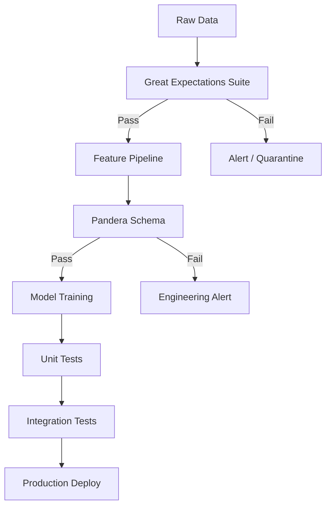
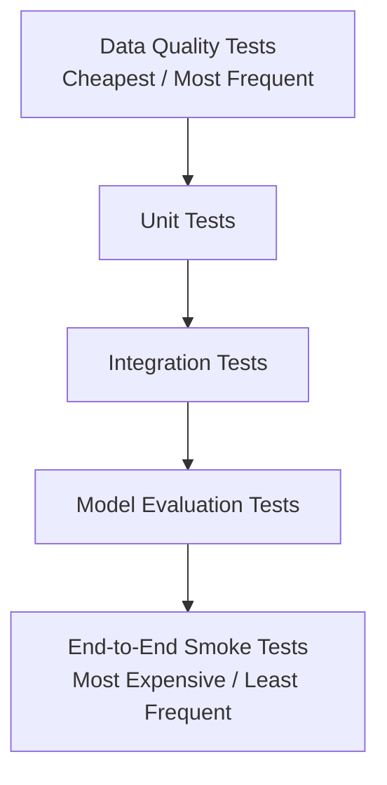

# 🧪 Testing in ML Systems

## Introduction

Traditional software tests verify that code paths produce expected outputs given known inputs. Machine learning systems invert this assumption: the code may be correct, yet the model fails because training data drifted, the feature pipeline silently dropped a column, or a new Python dependency changed tensor dtypes. Testing ML systems therefore requires validating data, models, and infrastructure as a unified whole.

This course distinguishes between conventional unit tests and ML-specific validation layers. You will learn how to detect data drift before it corrupts predictions, how to write property-based tests for stochastic model outputs, and how to structure a testing pyramid that catches errors at the cheapest possible stage of the pipeline.

Robust testing is the foundation of trust in deployed AI. Without it, you are flying blind the moment your model leaves the research notebook.

## 1. Traditional vs ML Testing

In classic software, if `add(2, 2)` returns `5`, the implementation is wrong. In ML, if a sentiment model labels a review as negative, the answer might still be "correct" within a tolerance. ML testing must therefore account for:

- **Data drift**: The input distribution shifts after deployment (e.g., a new product category floods an e-commerce classifier with unseen vocabulary).
- **Concept drift**: The relationship between features and labels changes (e.g., a fraud pattern evolves as attackers adapt).
- **Model regression**: A newly trained model performs worse than its predecessor on a holdout set, despite higher training accuracy.

Real case: Google's TensorFlow Extended (TFX) platform treats testing as a first-class pipeline stage. Every TFX pipeline runs automated data validation, model evaluation, and bias detection before a model is candidate for production. This culture of validation is why Google's production ML systems can be audited and reproduced at scale.

⚠️ **Warning:** Never rely solely on a single accuracy metric from a static test set. A model can maintain 95% accuracy while failing catastrophically on a critical demographic subgroup. Disaggregate metrics by segment.

💡 **Tip:** Think of your test suite as an immune system. Unit tests are antibodies against known threats (regressions); data drift detectors are fevers that signal unknown infections.

## 2. Test Categories for ML Pipelines

| Test Type | Target | ML Pipeline Stage | Tooling |
|---|---|---|---|
| Unit | Pure functions (preprocessing, metrics) | Feature engineering | pytest |
| Integration | Component interactions (model + API) | Serving | pytest + TestClient |
| Contract | Schema invariants (input/output shapes) | Ingestion / Serving | Pydantic, schemathesis |
| Property-based | Stochastic invariants (monotonicity, bounds) | Model core | Hypothesis |
| Data quality | Distribution constraints, null checks | Raw data → features | Great Expectations, Pandera |
| Model evaluation | Accuracy, fairness, latency | Training → deployment | TFX, MLflow |

**Unit tests** validate deterministic code. A tokenization function should always return the same token IDs for the same string.

**Integration tests** verify that the model loads, the API responds, and the feature store returns compatible shapes. These are slower but catch interface mismatches.

**Property-based tests** use Hypothesis to generate thousands of random inputs and assert invariant properties. For example: "The output probability must always be between 0 and 1," or "Adding a positive feature should never decrease a risk score."

```python
from hypothesis import given, strategies as st
import numpy as np

@given(st.lists(st.floats(min_value=0, max_value=1), min_size=5, max_size=5))
def test_output_is_probability_distribution(features):
    score = model.predict_proba([features])[0]
    assert 0.0 <= score <= 1.0
```

## 3. Data Quality Testing with Great Expectations and Pandera

Data is the most volatile component of an ML system. Great Expectations (GX) and Pandera provide declarative validation for DataFrames.

**Pandera** integrates directly with Pandas and PySpark, defining schemas as Python classes:

```python
import pandera as pa
from pandera import Column, Check, DataFrameSchema

schema = DataFrameSchema({
    "user_id": Column(int, Check.greater_than(0)),
    "age": Column(float, Check.in_range(0, 120), nullable=True),
    "label": Column(int, Check.isin([0, 1]))
})

validated_df = schema.validate(raw_df)
```

**Great Expectations** creates living documentation. You define expectations (e.g., `expect_column_mean_to_be_between`), and GX generates data docs that show historical trends. This is invaluable for detecting gradual drift.



## 4. The ML Testing Pyramid

The classic testing pyramid applies to ML, but with extra layers at the base for data:



- **Base**: Data quality and schema checks run on every batch. They are fast and prevent garbage from entering the pipeline.
- **Middle**: Unit and integration tests run on every commit. They verify code correctness and API contracts.
- **Top**: Full model evaluation and shadow deployments run on every training cycle. They are computationally expensive but catch regressions that code tests cannot.

Test coverage remains a useful metric, though it must be interpreted carefully in ML:

$$
\text{Test Coverage} = \frac{\text{Lines Tested}}{\text{Total Lines}} \times 100
$$

High coverage of feature engineering code is meaningful. High coverage of a training script that simply calls `model.fit()` is theater. Pair coverage metrics with data validation and model performance benchmarks for a complete picture.

⚠️ **Warning:** A green test suite with 100% coverage does not guarantee a good model. Coverage measures code execution, not model correctness. Always separate "tests pass" from "model performs."


---

## 📦 Compression Code

```python
"""
ML Testing Suite Template
Combines Pandera schema validation, Hypothesis property tests,
and pytest fixtures for model serving.
"""
import pytest
import pandera as pa
from pandera import Column, Check, DataFrameSchema
from hypothesis import given, strategies as st
import numpy as np

# --- Data Quality Layer ---
TRAINING_SCHEMA = DataFrameSchema({
    "feature_a": Column(float, Check.in_range(-10, 10)),
    "feature_b": Column(float, nullable=True),
    "target": Column(int, Check.isin([0, 1])),
})

def validate_training_data(df):
    return TRAINING_SCHEMA.validate(df)

# --- Property-Based Layer ---
class DummyModel:
    def predict(self, X: np.ndarray) -> np.ndarray:
        return np.clip(X.sum(axis=1), 0, 1)

model = DummyModel()

@given(st.lists(st.floats(min_value=-5, max_value=5), min_size=2, max_size=2))
def test_prediction_is_bounded(features):
    X = np.array([features])
    y = model.predict(X)
    assert 0.0 <= y[0] <= 1.0

# --- Integration Layer ---
@pytest.fixture
def client():
    from fastapi.testclient import TestClient
    from fastapi import FastAPI
    app = FastAPI()
    @app.post("/predict")
    def predict(data: dict):
        return {"score": float(model.predict(np.array([data["x"]]))[0])}
    return TestClient(app)

def test_api_returns_valid_score(client):
    response = client.post("/predict", json={"x": [1.0, 2.0]})
    assert response.status_code == 200
    assert 0.0 <= response.json()["score"] <= 1.0
```

## 🎯 Documented Project

### Description

Implement a comprehensive testing framework for a customer churn prediction pipeline. The system must validate raw CSV ingests, enforce feature schema invariants, test model monotonicity properties, and gate deployment on integrated performance benchmarks.

### Functional Requirements

1. Validate every ingested CSV against a Great Expectations suite (null checks, range constraints, uniqueness).
2. Enforce a Pandera schema on the feature DataFrame before training; fail the pipeline on any violation.
3. Write Hypothesis property tests asserting that increasing `monthly_charges` never decreases predicted churn probability.
4. Run unit tests for all feature engineering functions with ≥90% code coverage.
5. Block deployment if integration tests fail or if the new model's AUC is < 0.85 on the holdout set.

### Main Components

- Great Expectations data validation suite with automatic documentation
- Pandera schema definitions for training and inference features
- Hypothesis property tests for model behavioral invariants
- pytest suite with fixtures for database and model mocking
- CI gate script that orchestrates validation, testing, and deployment approval

### Success Metrics

- 100% of ingested batches pass schema validation before training
- Zero deployment of models with holdout AUC < 0.85
- Property tests execute ≥1,000 random examples per commit
- Integration test suite completes in < 5 minutes to preserve developer velocity

### References

- [Testing Machine Learning Systems](https://madewithml.com/courses/mlops/testing/) by Made With ML
- [Great Expectations Documentation](https://docs.greatexpectations.io/)
- Google: "The ML Test Score: A Rubric for ML Production Readiness"
