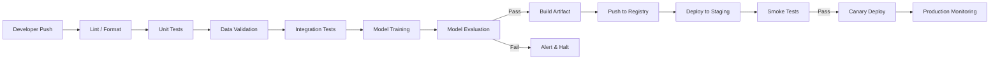

# 🔄 CI-CD for ML

## Introduction

Continuous Integration and Continuous Delivery (CI/CD) turn machine learning experiments into repeatable, auditable production deployments. In traditional software, CI/CD verifies that code compiles and tests pass. In ML, the pipeline must also validate data, reproduce training, benchmark model performance, and manage artifacts that are orders of magnitude larger than source files.

A mature ML CI/CD pipeline treats models as versioned artifacts, infrastructure as declarative code, and deployments as automated transitions through staged environments. This course covers GitOps workflows, trunk-based development, canary releases, and feature flags tailored to the unique risks of shipping trained models to live traffic.

If [[03 - Testing in ML Systems|testing]] is the immune system, CI/CD is the circulatory system that moves validated models from laboratory to limb without manual intervention.

## 1. GitOps, Trunk-Based Development, and Feature Flags

**GitOps** uses a Git repository as the single source of truth for both application code and infrastructure state. A GitOps controller (e.g., ArgoCD, Flux) watches the repo and reconciles the live cluster to match the declared state. For ML, this means model versions, serving configurations, and scaling policies are all versioned in Git.

**Trunk-based development** keeps all engineers committing to a single main branch with short-lived feature branches. This reduces merge hell and ensures the pipeline always reflects the current integration state. In ML, this prevents the "works on my branch" syndrome where a model trains successfully in isolation but fails when feature engineering changes from another branch are merged.

**Feature flags** decouple deployment from release. You can ship a new model to production but keep it dark (serving zero traffic) or route only 1% of users to it. This is essential for ML because offline metrics often diverge from online business metrics.

Real case: Spotify's Backstage platform integrates CI/CD metadata into a unified developer portal. ML teams at Spotify use feature flags to gradually roll out recommendation models, monitoring business KPIs for 24–48 hours before ramping to 100% traffic. If a model decreases session length, the flag is killed instantly without a code rollback.

⚠️ **Warning:** Do not conflate a feature flag with a configuration toggle. A true feature flag system provides real-time traffic routing, automatic kill switches, and audit logs. Hard-coding an `if model_version == "v2"` block is a toggle, not a flag, and requires a full redeploy to revert.

💡 **Tip:** Mnemonic for trunk-based ML development: **T**rain on trunk, **T**est on trunk, **T**rust on trunk.

## 2. Pipeline Stages for ML

A production ML CI/CD pipeline typically follows this flow:



- **Lint → Unit Test**: Fast feedback on code quality. Should complete in < 3 minutes.
- **Integration Test**: Validates that training scripts, feature stores, and APIs compose correctly.
- **Build**: Packages the model binary, inference code, and dependencies into a container image.
- **Deploy**: Pushes the image to a staging environment that mirrors production data topology.
- **Smoke Test**: Sends a synthetic request through the staging endpoint to verify the model loads and responds.

## 3. Canary Deployments and Blue-Green for ML Models

Rolling out a model to 100% of users immediately is reckless. Canary deployments route a small percentage of traffic to the new model and compare online metrics against the baseline.

| Strategy | Risk Level | Rollback Speed | Cost | Best For |
|---|---|---|---|---|
| Recreate | High | Slow (redeploy) | Low | Non-critical batch jobs |
| Rolling | Medium | Medium | Low | Standard API updates |
| Blue-Green | Low | Instant (switch) | High (2× resources) | High-stakes financial models |
| Canary | Low | Fast (traffic drain) | Medium | Most real-time ML serving |
| Shadow | None | N/A | Medium | Testing latency on production data |

**Blue-green** maintains two identical environments. The green environment serves live traffic while the blue environment receives the new model. After validation, a load balancer switches traffic instantly. If anomalies appear, you switch back.

**Shadow mode** sends live requests to the new model but discards its responses. Users are unaffected, yet you collect real production latency and intermediate output distributions. This is the safest way to validate a model before it impacts users.

Real case: Spotify deploys recommendation models in shadow mode for several days, comparing predicted engagement against actual outcomes. Only after statistical significance is achieved does the model graduate to a 1% canary.

## 4. CI/CD Tools Comparison

| Tool | Hosting | ML Native Features | Best For |
|---|---|---|---|
| GitHub Actions | Cloud / Self-hosted | Rich marketplace, artifact caching | Open-source and small teams |
| GitLab CI | Cloud / Self-hosted | Integrated registry, model experiments | Mid-size teams wanting all-in-one |
| CircleCI | Cloud | Fast parallelism, GPU support | Teams prioritizing build speed |
| Jenkins | Self-hosted | Infinite plugins, full control | Large enterprises with compliance needs |
| ArgoCD | Self-hosted (K8s) | Native GitOps, drift detection | Kubernetes-heavy ML platforms |

Deployment frequency measures how often you can deliver value:

$$
\text{Deployment Frequency} = \frac{\text{Releases}}{\text{Time Period}}
$$

Elite teams deploy on demand (multiple times per day). For ML, high frequency is only safe when paired with automated evaluation gates and progressive delivery.

⚠️ **Warning:** A CI/CD pipeline that automates bad decisions is a liability cannon. If your evaluation gate only checks training accuracy and ignores inference latency, you will automatically deploy models that time out in production. Review gate logic quarterly.


---

## 📦 Compression Code

```yaml
# .github/workflows/ml-pipeline.yml
name: ML CI/CD

on:
  push:
    branches: [main]

jobs:
  lint-test:
    runs-on: ubuntu-latest
    steps:
      - uses: actions/checkout@v4
      - uses: actions/setup-python@v5
        with: { python-version: '3.11' }
      - run: pip install ruff pytest
      - run: ruff check .
      - run: pytest tests/unit --cov=src --cov-fail-under=90

  integration:
    runs-on: ubuntu-latest
    needs: lint-test
    steps:
      - uses: actions/checkout@v4
      - run: docker compose -f tests/docker-compose.yml up -d
      - run: pytest tests/integration

  train-and-eval:
    runs-on: ubuntu-latest
    needs: integration
    steps:
      - uses: actions/checkout@v4
      - run: python train.py --config configs/production.yml
      - run: python evaluate.py --threshold-auc 0.85
      - uses: actions/upload-artifact@v4
        with:
          name: model-${{ github.sha }}
          path: artifacts/model.onnx

  deploy-staging:
    runs-on: ubuntu-latest
    needs: train-and-eval
    if: github.ref == 'refs/heads/main'
    steps:
      - run: echo "Deploying to staging..."
```

## 🎯 Documented Project

### Description

Build an end-to-end GitOps pipeline for a real-time classification service. Every push to `main` should lint code, validate data schemas, train a candidate model, evaluate it against production benchmarks, and progressively release it through shadow, canary, and full production stages.

### Functional Requirements

1. Trigger the pipeline on every merge to `main` with stages: lint → unit test → integration test → train → evaluate → build → deploy staging.
2. Halt the pipeline if unit test coverage falls below 90% or holdout AUC is below 0.85.
3. Deploy approved models to a staging environment and run synthetic smoke tests against the live endpoint.
4. Implement a canary release routing 5% of traffic to the new model for 30 minutes before auto-promotion.
5. Provide a one-command rollback that reverts traffic to the previous model version via the GitOps controller.

### Main Components

- GitHub Actions or GitLab CI YAML pipeline definition
- ArgoCD Application manifest for Kubernetes GitOps reconciliation
- Feature flag service (LaunchDarkly or open-source Unleash) for traffic splitting
- Model artifact registry (MLflow or S3 with versioned paths)
- Staging environment with production-parity data sources

### Success Metrics

- Pipeline runs end-to-end in < 45 minutes for standard changes
- 100% of production deployments pass through shadow and canary stages
- Mean time to rollback (MTTR) < 2 minutes from detection
- Deployment frequency ≥ 3 releases per week without incident

### References

- [Spotify Backstage](https://backstage.io/)
- [ArgoCD Documentation](https://argo-cd.readthedocs.io/)
- [Continuous Delivery for Machine Learning](https://martinfowler.com/articles/cd4ml.html) by Martin Fowler
