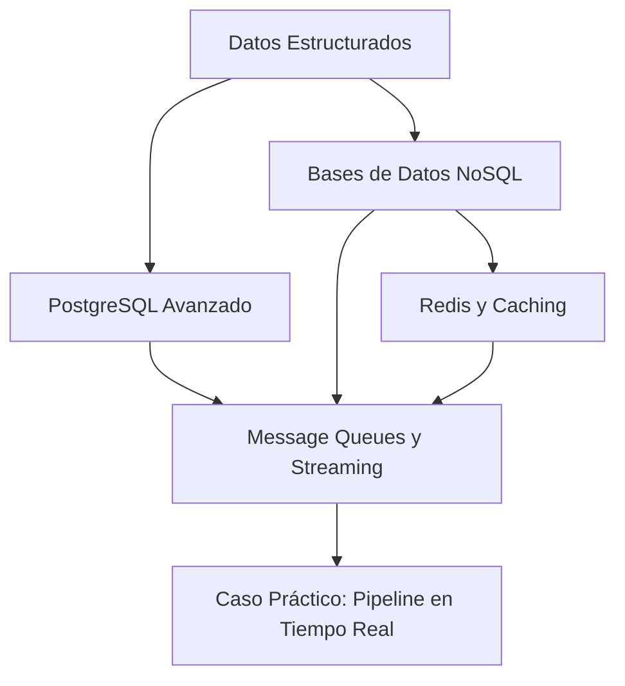

# 🗄️ Bienvenida: Bases de Datos y Message Queues

Bienvenido al módulo **25 - Bases de Datos y Message Queues**, parte esencial del track de ML and IA Engineering.

En el mundo del Machine Learning e Inteligencia Artificial, los datos son el combustible. Sin embargo, no basta con tener datos: es necesario almacenarlos, consultarlos, replicarlos y moverlos entre componentes de forma eficiente. Desde los feature stores transaccionales hasta los pipelines de eventos en tiempo real, dominar bases de datos y sistemas de mensajería es lo que diferencia a un prototipo de laboratorio de un sistema productivo escalable.

En este curso aprenderás a diseñar, optimizar e integrar soluciones de almacenamiento y streaming que soportan millones de peticiones y eventos por segundo.


## 📑 Índice del Curso

1. [[01 - PostgreSQL Avanzado]]

2. [[02 - Bases de Datos NoSQL]]

3. [[03 - Redis y Caching]]

4. [[04 - Message Queues y Streaming]]

5. [[05 - Caso Practico - Pipeline de Datos en Tiempo Real]]


## 🎯 Objetivos de Aprendizaje

Al finalizar este curso serás capaz de:

- Diseñar esquemas optimizados en PostgreSQL, aplicando índices avanzados, particionamiento y replicación.

- Seleccionar la base de datos NoSQL adecuada según el caso de uso (documental, clave-valor, columnar o grafo).

- Implementar estrategias de caching con Redis para reducir latencia en inferencia de modelos.

- Desplegar arquitecturas de mensajería con RabbitMQ y Kafka para ingestión de eventos y streaming.

- Construir un pipeline ETL en tiempo real que integre múltiples tecnologías de persistencia.


## 🖼️ Mapa Conceptual del Curso




## 📖 Glosario

| Término | Definición |
|---------|------------|
| **SQL** | Structured Query Language; lenguaje declarativo para gestionar bases de datos relacionales. |
| **NoSQL** | Conjunto de tecnologías de almacenamiento no relacionales diseñadas para escalabilidad horizontal y esquemas flexibles. |
| **PostgreSQL** | Sistema de gestión de bases de datos relacional de código abierto, conocido por su extensibilidad y conformidad con estándares. |
| **MongoDB** | Base de datos documental NoSQL que almacena datos en formato BSON (Binary JSON). |
| **Redis** | Almacén de estructuras de datos en memoria, utilizado como base de datos, caché y broker de mensajes. |
| **Cache** | Capa de almacenamiento de alta velocidad que retiene copias de datos frecuentemente accedidos. |
| **Message Queue** | Sistema de middleware que permite la comunicación asíncrona entre servicios mediante colas de mensajes. |
| **Kafka** | Plataforma distribuida de streaming de eventos desarrollada por Apache. |
| **RabbitMQ** | Broker de mensajes de código abierto que implementa el protocolo AMQP. |
| **Streaming** | Procesamiento continuo de datos en tiempo real, evento por evento. |
| **Event Log** | Registro inmutable de eventos que representan cambios de estado en un sistema. |
| **Partition** | Subdivisión lógica de un topic en Kafka que permite paralelismo en el consumo. |
| **Offset** | Identificador numérico que marca la posición de un mensaje dentro de una partición de Kafka. |
| **Consumer** | Aplicación que lee y procesa mensajes desde una cola o topic. |
| **Producer** | Aplicación que publica mensajes en una cola o topic. |
| **Replication** | Técnica de copiar datos en múltiples nodos para garantizar disponibilidad y tolerancia a fallos. |
| **ACID** | Conjunto de propiedades (Atomicity, Consistency, Isolation, Durability) que garantizan transacciones fiables. |
| **BASE** | Modelo de consistencia en NoSQL (Basically Available, Soft state, Eventually consistent). |
| **CAP Theorem** | Teorema que establece que un sistema distribuido no puede garantizar simultáneamente Consistencia, Disponibilidad y Tolerancia a Particiones. |


*Figura: Modelos de bases de datos. Fuente: Wikimedia Commons.*


## ⚠️ Advertencias Generales

⚠️ **Este curso asume conocimientos previos de SQL y programación en Python.** Si no estás familiarizado con consultas básicas `SELECT`, `INSERT`, `UPDATE` y conceptos de programación orientada a objetos, te recomendamos revisar los módulos anteriores antes de continuar.

⚠️ **Algunos ejercicios requieren Docker.** Asegúrate de tener Docker Desktop instalado y funcionando para levantar contenedores de PostgreSQL, MongoDB, Redis, Kafka y RabbitMQ.


## 💡 Tips para Aprovechar el Curso

💡 **Instancia local todo antes de leer.** Levantar los servicios en tu máquina y ejecutar los bloques de código por ti mismo fija el conocimiento mucho más que solo leer.

💡 **Mantén un cuaderno de errores.** Cuando un query falle o un consumer no conecte, anota el mensaje de error y la solución. Repetir errores es parte del aprendizaje.

💡 **Conecta con ML.** En cada nota, reflexiona cómo el concepto aplica a un sistema de ML que estés construyendo o imaginando.


## 📦 Código de Compresión

El siguiente script genera un resumen comprimido de todas las notas del curso en un archivo `.zip`:

```python
import os
import zipfile
from pathlib import Path

CURSO_DIR = Path(r"C:\Users\Leito\Documents\Learning\ML and IA Engineering\06 - Cloud, Infra y Backend\25 - Bases de Datos y Message Queues")
OUTPUT_ZIP = CURSO_DIR / "resumen_curso.zip"

def comprimir_curso():
    with zipfile.ZipFile(OUTPUT_ZIP, 'w', zipfile.ZIP_DEFLATED) as zf:
        for f in sorted(CURSO_DIR.glob("*.md")):
            zf.write(f, arcname=f.name)
            print(f"Agregado: {f.name}")
    print(f"\n✅ Archivo creado: {OUTPUT_ZIP}")

if __name__ == "__main__":
    comprimir_curso()
```
