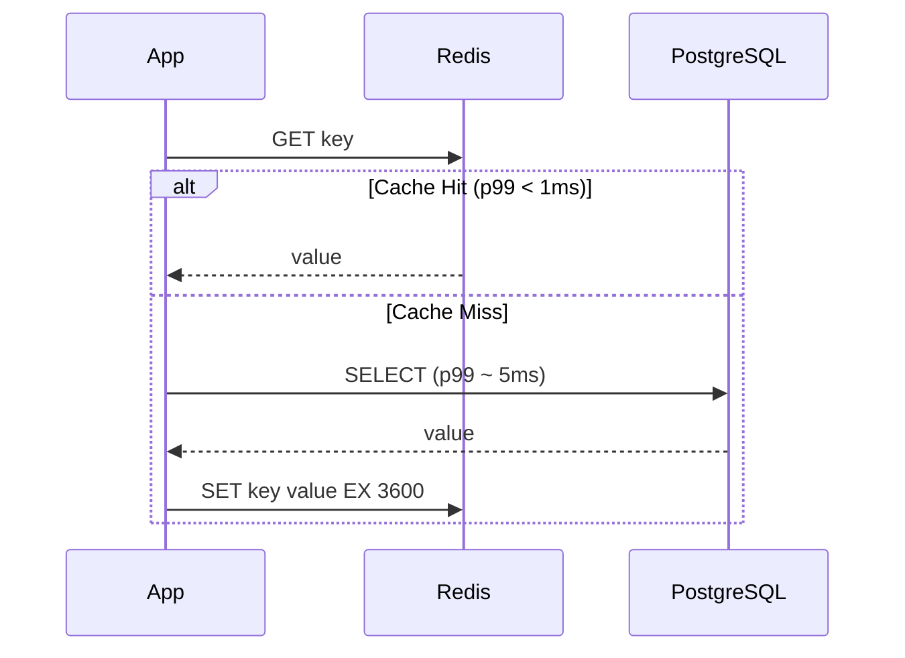
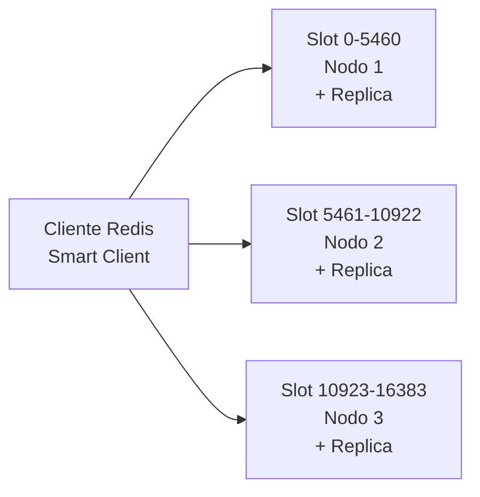

# ⚡ Redis y Caching

## Introduction

Redis no es simplemente una "base de datos en memoria". Es un motor de estructuras de datos de alta velocidad que funciona como caché, broker de mensajes, store de sesiones y, en contextos de ML/AI, como feature store de baja latencia. Cuando un modelo de inferencia necesita recuperar un vector de características en menos de un milisegundo, Redis es frecuentemente la respuesta.

Esta nota complementa [[../../24 - Backend para ML/03 - Microservicios y Arquitectura de Eventos|Microservicios y Arquitectura de Eventos]] para el serving de modelos, [[02 - Bases de Datos NoSQL|Bases de Datos NoSQL]] para patrones de persistencia, y [[04 - Message Queues y Streaming|Message Queues y Streaming]] para la integración con Kafka/RabbitMQ. Dominar Redis significa dominar el caching, la mensajería en tiempo real, y los locks distribuidos — tres pilares del MLOps en producción.

---

## 1. 🧠 Estructuras de Datos — Fundamentos Teóricos

Redis no es un key-value store plano. Soporta estructuras de datos con operaciones atómicas que permiten implementar patrones complejos sin mover datos al cliente:

| Estructura | Comandos Clave | Complejidad | Caso de Uso en ML/AI |
|------------|----------------|-------------|----------------------|
| **String** | `SET`, `GET`, `INCR`, `GETRANGE` | $O(1)$ | Almacenar un embedding serializado, contadores de requests |
| **List** | `LPUSH`, `RPOP`, `LRANGE`, `LTRIM` | $O(n)$ para range | Cola de jobs de entrenamiento, buffer de eventos |
| **Set** | `SADD`, `SISMEMBER`, `SUNION`, `SDIFF` | $O(1)$ | Conjunto de IDs de usuarios activos, tags de features |
| **Hash** | `HSET`, `HGET`, `HGETALL`, `HINCRBY` | $O(1)$ | Feature vector con nombres de campo, perfil de usuario |
| **Sorted Set** | `ZADD`, `ZRANGE`, `ZREVRANK`, `ZRANGEBYSCORE` | $O(\log n)$ | Ranking de predicciones por score, time-series de métricas |
| **Stream** | `XADD`, `XREAD`, `XGROUP`, `XACK` | $O(1)$ por entrada | Log de eventos de inferencia, cola de mensajes durable |
| **HyperLogLog** | `PFADD`, `PFCOUNT` | $O(1)$ | Conteo aproximado de usuarios únicos activos |
| **Bitmap** | `SETBIT`, `GETBIT`, `BITCOUNT` | $O(1)$ | Tracking de features binarias por usuario, A/B test flags |

### El modelo de operaciones atómicas

Cada comando de Redis es atómico — ningún otro comando se intercala durante su ejecución. Esto es posible porque Redis es **single-threaded** (un solo hilo de ejecución para comandos). La aparente paradoja de "single-threaded pero extremadamente rápido" se explica por tres factores:

1. **Todo en memoria RAM** — sin latencia de disco para lecturas
2. **Estructuras de datos optimizadas** — cada tipo tiene implementaciones especializadas en C con complejidad algorítmica mínima
3. **I/O multiplexing** — `epoll`/`kqueue`/`IOCP` maneja miles de conexiones concurrentes sin bloquear el hilo principal

---

## 2. 📐 Modelo Mental: Redis en la Arquitectura ML

```
┌──────────────────────────────────────────────────────────────────┐
│                    REDIS EN UN SISTEMA DE ML                      │
│                                                                  │
│  ┌──────────┐     ┌──────────┐     ┌──────────┐                 │
│  │ Client   │────▶│ FastAPI  │────▶│ Redis    │                 │
│  │ Request  │     │ Gateway  │     │ Cache    │                 │
│  └──────────┘     └────┬─────┘     └────┬─────┘                 │
│                        │ Miss          │ Hit (p99 < 1ms)         │
│                        ▼               ▼                         │
│                  ┌──────────┐    ┌──────────┐                   │
│                  │PostgreSQL│    │ Response │                   │
│                  │(Primary) │    │ to Client│                   │
│                  └────┬─────┘    └──────────┘                   │
│                       │                                         │
│                       ▼                                         │
│                  ┌──────────┐                                    │
│                  │  Redis   │  ← Populate cache (SETEX + TTL)   │
│                  │  Cache   │                                    │
│                  └──────────┘                                    │
│                                                                  │
│  ┌──────────────────────────────────────────────────────────┐   │
│  │ Feature Store Pattern (Online)                            │   │
│  │ ┌────────────┐    ┌──────────────┐    ┌──────────────┐   │   │
│  │ │ Offline    │───▶│Materialization│───▶│ Redis        │   │   │
│  │ │ Store      │    │ Job (Spark)  │    │ (Online)     │   │   │
│  │ │ (Delta)    │    │              │    │ Hash per user│   │   │
│  │ └────────────┘    └──────────────┘    └──────┬───────┘   │   │
│  │                                              │ Lookup    │   │
│  │                                        ┌─────▼──────┐   │   │
│  │                                        │  Model     │   │   │
│  │                                        │  Serving   │   │   │
│  │                                        └────────────┘   │   │
│  └──────────────────────────────────────────────────────────┘   │
└──────────────────────────────────────────────────────────────────┘
```

### El espectro Redis: de caché a base de datos primaria

```
Persistencia baja ◄──────────────────────────────► Persistencia alta
Latencia mínima                                       Durabilidad máxima

Cache-aside        Write-through    Write-behind    Redis AOF/RDB
(TTL corto)        (consistente)    (asíncrono)     (como primaria)
```

---

## 3. 🔄 Patrones de Caching

El caching reduce la latencia y la carga en bases de datos primarias. Existen tres patrones principales, cada uno con un trade-off diferente entre consistencia y rendimiento:

### 3.1 Cache-Aside (Lazy Loading)

La aplicación consulta la caché primero. Si no está (miss), lee de la base de datos y la almacena en caché. Es el patrón más común y tolerante a fallos de Redis.

```python
import redis
import json
from typing import Optional, Dict

r = redis.Redis(host='localhost', port=6379, db=0, decode_responses=True)

def get_user_features(user_id: str) -> Dict:
    key = f"features:{user_id}"
    cached = r.get(key)
    if cached:
        return json.loads(cached)

    # Cache miss — leer de fuente primaria
    features = fetch_from_postgres(user_id)
    if features:
        # TTL de 1 hora: balance entre frescura y hit rate
        r.setex(key, 3600, json.dumps(features))
    return features
```

### 3.2 Write-Through

Los datos se escriben simultáneamente en caché y en base de datos. Garantiza consistencia a costa de latencia de escritura.

| Ventaja | Desventaja |
|---------|------------|
| Caché siempre actualizada | Doble latencia de escritura |
| Nunca hay cache miss en lectura | Si Redis falla, la escritura completa falla |

### 3.3 Write-Behind

La aplicación escribe solo en caché; un proceso asíncrono posterior persiste en la base de datos. Maximiza velocidad de escritura.

⚠️ **Advertencia:** Write-Behind es peligroso si Redis cae antes de la persistencia. Úsalo solo para datos regenerables (contadores, métricas) o cuando la durabilidad no sea crítica.

### Ciclo de Vida de una Request con Cache-Aside



---

## 4. ⚙️ TTL, Evicción y Gestión de Memoria

Redis opera en memoria, por lo que debe decidir qué datos eliminar cuando la memoria se agota.

### Time-To-Live (TTL)

Cada clave puede tener un tiempo de expiración:

$$
t_{\text{expiración}} = t_{\text{actual}} + \Delta_{\text{TTL}}
$$

Redis implementa TTL con dos estrategias combinadas:
- **Lazy expiration:** Verifica la expiración solo cuando se accede a la clave
- **Active expiration:** Un proceso interno muestrea ~20 claves aleatorias 10 veces por segundo y elimina las expiradas

### Políticas de Evicción

| Política | Descripción | Recomendación ML |
|----------|-------------|------------------|
| `noeviction` | Rechaza escrituras cuando la memoria está llena | Solo entornos controlados |
| `allkeys-lru` | Elimina la clave menos recientemente usada | **Recomendado** — mantiene features de usuarios activos |
| `allkeys-lfu` | Elimina la clave menos frecuentemente usada | Patrones de acceso muy desiguales |
| `volatile-lru` | LRU solo entre claves con TTL | Mix de datos persistentes y cache |
| `volatile-ttl` | Elimina la clave con TTL más corto | Datos temporales con deadline |

💡 **Tip:** Para feature stores en Redis, `allkeys-lru` es generalmente la mejor opción: mantiene en memoria los vectores de los usuarios más activos y expulsa los inactivos. Para ML, un usuario inactivo raramente necesita inferencia.

---

## 5. 📡 Redis Pub/Sub y Streams

### 5.1 Pub/Sub — Mensajería Fire-and-Forget

El modelo publicador/suscriptor permite mensajería de uno a muchos en tiempo real:

```python
import redis

r = redis.Redis(decode_responses=True)
pubsub = r.pubsub()
pubsub.subscribe("model_updates", "feature_refresh")

for message in pubsub.listen():
    if message['type'] == 'message':
        channel = message['channel']
        data = message['data']
        if channel == "model_updates":
            reload_model(data)
        elif channel == "feature_refresh":
            invalidate_feature_cache(data)
```

⚠️ **Advertencia:** Redis Pub/Sub es **fire-and-forget**. Si un suscriptor está desconectado al momento del mensaje, lo pierde para siempre. No es adecuado para eventos que requieren durabilidad (usa Streams o Kafka).

### 5.2 Streams — Mensajería Persistente con Consumer Groups

Introducido en Redis 5.0, Streams es una estructura de log append-only que soluciona las limitaciones de Pub/Sub:

| Característica | Pub/Sub | Streams |
|---|---|---|
| **Persistencia** | ❌ Mensajes perdidos si no hay suscriptor | ✅ Almacenados en disco/memoria |
| **Replay** | ❌ Imposible | ✅ Leer desde cualquier ID |
| **Consumer Groups** | ❌ No | ✅ Múltiples grupos, ACK por mensaje |
| **Orden** | ❌ No garantizado entre canales | ✅ Estricto por stream |

```python
# Productor: encolar predicciones de modelo
r.xadd("inference_events", {
    "user_id": "123",
    "model_version": "v3",
    "prediction": "0.87",
    "latency_ms": "12"
}, maxlen=10000)  # Limitar tamaño del stream

# Consumer Group: workers procesan en paralelo
r.xgroup_create("inference_events", "workers", id="0", mkstream=True)

# Worker lee mensajes pendientes
messages = r.xreadgroup(
    "workers", "worker_1",
    {"inference_events": ">"},  # ">" = solo mensajes nuevos
    count=10,
    block=5000  # Bloquear hasta 5s esperando mensajes
)

for stream, msgs in messages:
    for msg_id, data in msgs:
        process_prediction(data)
        r.xack("inference_events", "workers", msg_id)  # Confirmar
```

**Caso real:** Un pipeline de ML utiliza Redis Streams para encolar predicciones de un modelo de clasificación, permitiendo a múltiples workers procesar el stream en paralelo con garantías de entrega. Streams soporta cientos de miles de mensajes por segundo con latencia sub-milisegundo.

---

## 6. 🔒 Distributed Locks — Redlock

En sistemas distribuidos con múltiples workers de ML, los locks garantizan que solo una instancia ejecute una tarea crítica (por ejemplo, actualizar el modelo en producción).

El algoritmo **Redlock** (antirez, 2015) requiere adquirir el lock en la mayoría de $N$ instancias Redis independientes:

$$
\text{Lock Válido} \iff \text{drift} < \text{TTL} - \text{tiempo\_adquisición}
$$

```python
import redis
from redis.lock import Lock

r = redis.Redis(decode_responses=True)
lock = Lock(r, "model_training_lock", timeout=30, thread_local=True)

with lock:
    # Solo un worker ejecuta esto a la vez en todo el cluster
    train_model()
    deploy_model()
```

### Casos de uso en ML

| Escenario | Sin Lock | Con Lock |
|-----------|----------|----------|
| **Entrenamiento programado** | Dos cron jobs entrenan simultáneamente, corrompiendo el registry | Solo uno entrena, el otro hace skip |
| **Actualización de feature store** | Dos workers escriben features inconsistentes | Escritura serializada |
| **Promoción de modelo** | Dos ingenieros promueven versiones diferentes | Solo el primero promueve, el segundo recibe error |

⚠️ **Advertencia:** Implementar locks distribuidos correctamente es difícil — edge cases con particiones de red, GC pauses, y clock drift. Usa la implementación probada de `redis-py` (`redis.lock.Lock`) en lugar de construir la tuya.

---

## 7. 🏗️ Alta Disponibilidad: Sentinel y Cluster

### Redis Sentinel — Failover Automático

Proporciona monitoreo, notificación, auto-failover y descubrimiento de nodos maestros.

```
┌────────────────────────────────────────────────────────┐
│              REDIS SENTINEL ARCHITECTURE                │
│                                                        │
│  ┌─────────┐   ┌─────────┐   ┌─────────┐              │
│  │Sentinel 1│   │Sentinel 2│   │Sentinel 3│   Quorum=2 │
│  └────┬─────┘   └────┬─────┘   └────┬─────┘              │
│       │              │              │                    │
│       └──────────────┼──────────────┘                    │
│                      │ Monitor                          │
│                      ▼                                  │
│  ┌──────────┐   ┌──────────┐   ┌──────────┐           │
│  │ Master   │──▶│ Replica 1│   │ Replica 2│           │
│  │ (R/W)    │   │ (R/O)    │   │ (R/O)    │           │
│  └──────────┘   └──────────┘   └──────────┘           │
│      │ Failover: si Master cae                          │
│      ▼ Una Replica es promovida automáticamente         │
└────────────────────────────────────────────────────────┘
```

**Caso real:** Feature store crítico utiliza Sentinel para failover automático. Si el master cae, un replica es promovido en segundos sin intervención manual, manteniendo el serving de features ininterrumpido.

### Redis Cluster — Sharding Horizontal

Particiona datos automáticamente en múltiples nodos mediante **hash slots** (16,384 slots):

$$
\text{slot} = \text{CRC16}(\text{key}) \mod 16384
$$



| Característica | Sentinel | Cluster |
|---|---|---|
| **Escala** | Vertical (más RAM) | Horizontal (más nodos) |
| **Sharding** | Manual por aplicación | Automático por hash slot |
| **Complejidad** | Baja | Media |
| **Multi-key ops** | ✅ Soportadas | ⚠️ Solo si todas las keys están en el mismo slot |
| **Cuándo usarlo** | < 64GB datos | > 64GB o > 100K ops/s |

💡 **Tip:** Redis Cluster es la opción cuando tus datos exceden la RAM de una sola máquina. Para datasets menores, Sentinel + replicación es más simple y eficiente.

---

## 8. 🚦 Rate Limiting para APIs de ML

El rate limiting protege APIs de inferencia de modelos contra abuso o picos de tráfico. Redis es la opción natural por su velocidad y operaciones atómicas:

### Algoritmos de Rate Limiting

| Algoritmo | Complejidad | Precisión | Mejor para |
|-----------|:-----------:|:---------:|------------|
| **Fixed Window** | $O(1)$ | Baja (burst en bordes) | APIs simples, prototipos |
| **Sliding Window Log** | $O(n)$ | Alta | Auditoría, precisión |
| **Sliding Window Counter** | $O(1)$ | Media-alta | **Recomendado** — balance precisión/rendimiento |
| **Token Bucket** | $O(1)$ | Alta (permite bursts) | APIs con tráfico burst |

### Token Bucket — El algoritmo más usado

Mantiene un bucket con $B$ tokens que se recargan a una tasa $R$:

$$
\text{Tokens}(t) = \min\left(B, \text{Tokens}(t_0) + R \cdot (t - t_0)\right)
$$

```python
import redis
import time

r = redis.Redis(decode_responses=True)

def is_allowed(user_id: str, max_requests: int, window_seconds: int) -> bool:
    """Fixed Window rate limiter con Redis."""
    key = f"rate_limit:{user_id}"
    current = r.get(key)

    if current is None:
        r.setex(key, window_seconds, 1)
        return True

    if int(current) < max_requests:
        r.incr(key)  # Atómico — sin race condition
        return True
    return False

# Rate limit: 100 requests por minuto por usuario
if is_allowed("user_123", 100, 60):
    prediction = model.predict(features)
else:
    raise HTTPException(status_code=429, detail="Rate limit exceeded")
```

**Caso real:** Plataforma de ML as a service utiliza rate limiting basado en Redis para restringir llamadas a su API de embeddings según el tier de suscripción, evitando sobrecarga de GPUs compartidas. Redis maneja 500K+ operaciones de rate limiting por segundo en un cluster de 3 nodos.

---

## 9. 🌍 Redis en Producción ML

| Empresa | Caso de Uso | Escala |
|---|---|---|
| **Twitter** | Timeline cache — tweets recientes por usuario | 100M+ QPS en cluster Redis |
| **Pinterest** | Feature store online para recomendaciones | 100B+ features servidas/día |
| **GitHub** | Rate limiting de API y job queues | Millones de repos, rate limiting por usuario |
| **Snapchat** | Session store + feature cache | Billones de operaciones/día |
| **Uber** | Real-time feature serving para ETA prediction | Redis Cluster con miles de nodos |
| **ML Platform (fintech startup)** | Feature store online para fraud detection | Redis Sentinel con latencia p99 < 1ms |

---

## ⚠️ Advertencias

- **Redis es single-threaded para comandos:** Una operación `KEYS *` o `HGETALL` sobre un hash de 1M campos bloquea el servidor entero. Usa `SCAN`, `HSCAN` para iteración progresiva.
- **Persistencia no es backup:** RDB snapshots pueden perder los últimos minutos de datos. AOF es más durable pero más lento. Para datos críticos, siempre combina con PostgreSQL como source of truth.
- **Pub/Sub no es un message queue:** Sin durabilidad ni ACK, los mensajes se pierden si no hay suscriptores. Usa Streams o Kafka para eventos que requieren garantías de entrega.
- **Redlock tiene limitaciones conocidas:** Martin Kleppmann (autor de Kafka) demostró que Redlock no es seguro bajo todas las condiciones de fallo. Para locks que afectan dinero o datos irreversibles, usa sistemas con consensus (etcd, Zookeeper).

---

## 💡 Tips

- **Usa `SCAN` en lugar de `KEYS` en producción:** `KEYS` bloquea Redis durante la iteración completa. `SCAN` es incremental y no bloqueante.
- **Habilita `lazyfree-lazy-eviction`:** Redis 4.0+ puede liberar memoria de claves grandes en background, evitando pausas por evicción.
- **Monitorea `instantaneous_ops_per_sec` y `evicted_keys`:** Si las evicciones crecen, necesitas más RAM o mejor TTL. Si las ops caen, puede haber un comando lento bloqueando.
- **Usa hashes para features de usuario:** `HSET user:123 f1 0.5 f2 0.8` es más eficiente que `SET user:123:f1 0.5; SET user:123:f2 0.8` — un solo comando, menos memoria, acceso atómico.

---

## 📦 Código de Compresión

```python
"""Redis toolkit para ML: cache + rate limiting + feature store."""
import gzip, json, redis
from typing import Dict, Optional
from contextlib import contextmanager

r = redis.Redis(host='localhost', port=6379, db=0, decode_responses=True)

# ── Cache-aside ──
def cached_features(user_id: str, ttl: int = 3600) -> Dict:
    key = f"features:{user_id}"
    data = r.get(key)
    if data:
        return json.loads(data)
    features = {"f1": 0.5, "f2": 0.8}
    r.setex(key, ttl, json.dumps(features))
    return features

# ── Rate Limiter ──
def check_rate(user_id: str, limit: int = 100, window: int = 60) -> bool:
    key = f"rl:{user_id}"
    count = r.get(key)
    if count is None:
        r.setex(key, window, 1)
        return True
    if int(count) < limit:
        r.incr(key)
        return True
    return False

# ── Distributed Lock ──
@contextmanager
def training_lock(lock_name: str = "model_train", timeout: int = 60):
    lock = redis.lock.Lock(r, lock_name, timeout=timeout)
    acquired = lock.acquire(blocking=False)
    if not acquired:
        raise RuntimeError("Training already in progress")
    try:
        yield
    finally:
        lock.release()

# ── Backup ──
def export_features(output_path: str):
    data = {}
    for key in r.scan_iter(match="features:*"):
        data[key] = json.loads(r.get(key) or "{}")
    with gzip.open(output_path, 'wt', encoding='utf-8') as f:
        json.dump(data, f, ensure_ascii=False)
    print(f"✅ {len(data)} keys → {output_path}")
```

---

## ✅ Verificación de Conocimiento

1. **¿Por qué Redis puede ser single-threaded y aún así extremadamente rápido?** — Todas las operaciones son en RAM (sin latencia de disco), las estructuras de datos están implementadas en C con complejidad algorítmica óptima, y el I/O multiplexing (epoll/kqueue) maneja miles de conexiones concurrentes sin bloquear el hilo de ejecución.

2. **¿Cuándo usarías Redis Streams en lugar de Pub/Sub?** — Streams cuando necesitas durabilidad (los mensajes persisten aunque no haya consumidores activos), consumer groups (procesamiento paralelo con ACK), o replay desde un punto histórico. Pub/Sub solo para notificaciones efímeras en tiempo real.

3. **¿Qué diferencia hay entre Sentinel y Cluster?** — Sentinel proporciona alta disponibilidad con failover automático para una instancia master-replica (escala vertical). Cluster particiona datos automáticamente en múltiples nodos mediante hash slots (escala horizontal). Sentinel para <64GB; Cluster para >64GB o >100K ops/s.

4. **¿Por qué `KEYS *` es peligroso en producción?** — Bloquea el hilo principal de Redis durante toda la iteración, congelando todas las demás operaciones. En un dataset de millones de keys, esto puede causar timeouts en cascada. Usa `SCAN` para iteración progresiva no bloqueante.

---

## 🎯 Key Takeaways

- Redis es un motor de estructuras de datos en memoria — no solo un caché, sino un feature store, broker de mensajes, y coordinador distribuido.
- Cache-Aside es el patrón más robusto para ML: fallos de Redis no impiden servir features (se consulta PostgreSQL como fallback).
- Streams + Consumer Groups reemplazan Pub/Sub cuando necesitas durabilidad y procesamiento paralelo con ACK.
- Redlock proporciona locks distribuidos, pero tiene limitaciones conocidas — para coordinación crítica usa Consul/etcd.
- Sentinel para HA vertical (<64GB), Cluster para sharding horizontal (>64GB).
- Rate limiting con Redis es la defensa estándar para APIs de inferencia — operaciones atómicas de contador sin race conditions.

---

## Referencias

- [Redis Documentation](https://redis.io/docs/latest/)
- [Redis Streams Introduction](https://redis.io/docs/latest/develop/data-types/streams/)
- [Distributed Locks with Redis (antirez)](https://redis.io/docs/latest/develop/use/patterns/distributed-locks/)
- [How to do distributed locking (Kleppmann)](https://martin.kleppmann.com/2016/02/08/how-to-do-distributed-locking.html)
- [Redis Rate Limiting Patterns](https://redis.io/glossary/rate-limiting/)
