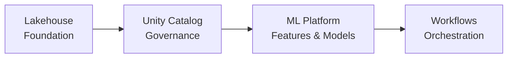

# ☁️ Welcome to Databricks for ML

Databricks is the unified data and AI platform built around the Lakehouse architecture — a paradigm that combines the flexibility of data lakes with the reliability of data warehouses. For ML engineers, Databricks is significant because it created MLflow, Spark, Delta Lake, and Unity Catalog — four foundational technologies that underpin modern MLOps at enterprise scale.

This course covers the architectural foundations of Databricks as an ML platform, without the distraction of syntax or API calls. You will understand what the Lakehouse architecture enables, how Unity Catalog governs ML assets, and how Databricks Workflows orchestrate end-to-end ML pipelines.

---

## Course Index

1. [[01 - Lakehouse Architecture|Databricks Lakehouse Architecture: Delta Lake and Beyond]]
2. [[02 - Unity Catalog|Unity Catalog: Governance for ML Assets]]
3. [[03 - ML Platform Integration|Databricks ML: Feature Store, AutoML, and Model Serving]]
4. [[04 - Orchestration|Databricks Workflows: Orchestration for ML Pipelines]]

---

## Learning Path

---

## Why Databricks Matters for ML Engineers

| Capability | Technology | ML Impact |
|---|---|---|
| **Data Storage** | Delta Lake (ACID on Parquet) | Time-travelable training datasets, reproducible experiments |
| **Governance** | Unity Catalog | Fine-grained RBAC on models, features, and data |
| **Processing** | Apache Spark (Photon engine) | Distributed training data preparation at scale |
| **ML Lifecycle** | MLflow (managed) | Zero-config tracking, registry, and serving |
| **Feature Engineering** | Feature Store | Training-serving consistency via online/offline stores |
| **Orchestration** | Databricks Workflows | DAG-based ML pipelines with retry and conditional logic |
| **Serving** | Model Serving (serverless) | Auto-scaling REST endpoints for real-time inference |

---

## Prerequisites

- Understanding of ML experiment tracking and model registries (MLflow recommended)
- Familiarity with cloud storage concepts (object stores, data lakes)
- No Databricks account required for this conceptual course

---

## Objectives

By the end of this course you will:

1. Understand the Lakehouse architecture and why it solves the data lake vs warehouse dilemma.
2. Explain how Delta Lake provides ACID transactions and time travel for ML datasets.
3. Describe Unity Catalog's role in governing ML models, features, and experiments.
4. Map the end-to-end ML workflow on Databricks: data → feature → train → registry → serve.
5. Design ML pipelines orchestrated by Databricks Workflows with conditional logic and triggers.

---

💡 **Tip:** The Lakehouse paradigm is not vendor-specific. Open-source Delta Lake, Apache Iceberg, and Apache Hudi all implement similar ideas. Understanding the pattern matters more than memorizing a specific implementation.

⚠️ **Warning:** This course is conceptual and architectural. For hands-on code, Databricks Community Edition (free) provides a notebook environment, but requires registration at [databricks.com/try](https://databricks.com/try).
