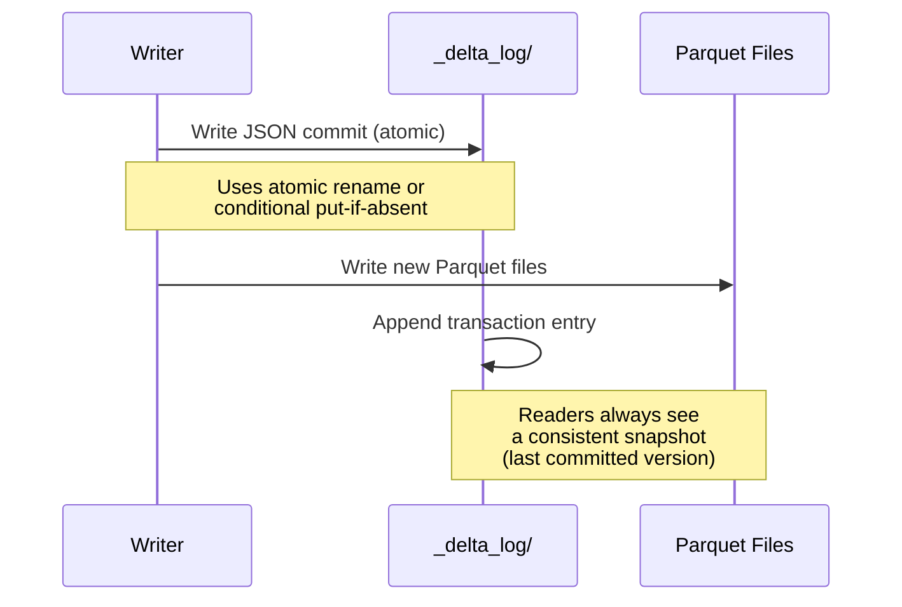
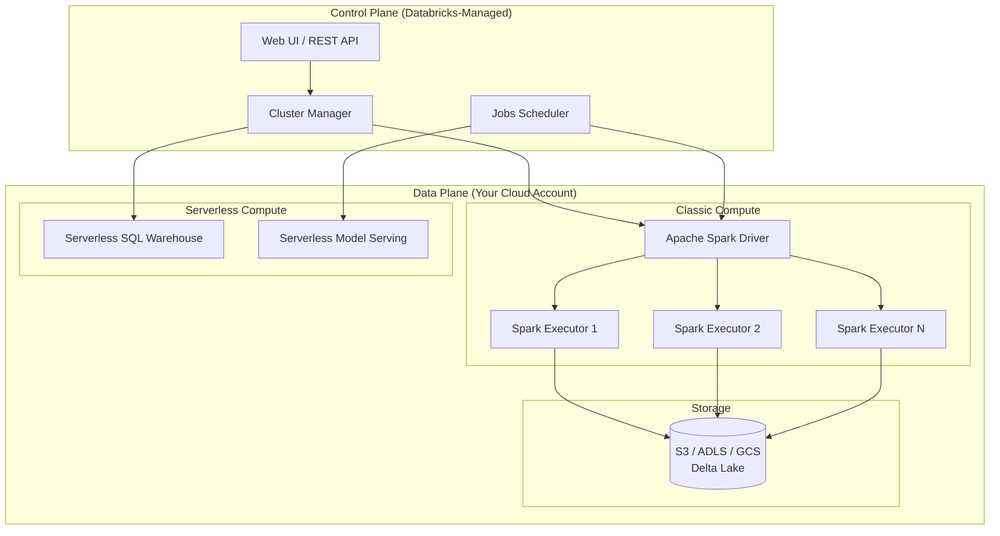

# 🏛️ Databricks Lakehouse Architecture: Delta Lake and Beyond

## Introduction

For two decades, organizations have oscillated between two data paradigms: **data warehouses** (structured, reliable, expensive, SQL-only) and **data lakes** (cheap, flexible, unstructured, unreliable). The data warehouse enforces schemas and ACID transactions but is cost-prohibitive for ML-scale data. The data lake stores anything cheaply but lacks reliability — schema enforcement, transactional writes, and query performance degrade quickly.

The Lakehouse architecture resolves this dichotomy by applying warehouse-grade guarantees (ACID, schema enforcement, performance optimization) directly on lake storage (S3, ADLS, GCS). Databricks popularized this architecture through Delta Lake, and the entire Databricks ML platform builds upon its capabilities. Understanding the Lakehouse is understanding the foundation of enterprise MLOps.

---

## 1. 🧠 The Data Lake vs Warehouse Dilemma

### The Historical Problem

```
┌─────────────────────┐     ┌─────────────────────┐
│   DATA WAREHOUSE    │     │     DATA LAKE        │
│                     │     │                      │
│ ✅ ACID Transactions│     │ ✅ Cheap storage     │
│ ✅ Schema enforced  │     │ ✅ Stores any format │
│ ✅ Fast SQL queries │     │ ✅ Infinitely scalable│
│ ✅ BI/Reporting     │     │ ✅ ML-ready raw data │
│                     │     │                      │
│ ❌ Expensive ($/TB) │     │ ❌ No ACID           │
│ ❌ Structured only  │     │ ❌ No schema enforce │
│ ❌ Closed formats   │     │ ❌ "Data swamp" risk │
│ ❌ Poor for ML data │     │ ❌ Slow queries      │
└─────────────────────┘     └─────────────────────┘
```

The Lakehouse architecture sits on top of the data lake's cheap storage but adds the warehouse's reliability guarantees:

```
┌───────────────────────────────────────────────────┐
│                  LAKEHOUSE                         │
│                                                    │
│  ✅ ACID on object storage (Delta Lake)            │
│  ✅ Schema enforcement and evolution               │
│  ✅ Fast queries via indexing and caching          │
│  ✅ BI + ML on the same data (no ETL duplication)  │
│  ✅ Open format (Parquet + transaction log)        │
│  ✅ Time travel for reproducible ML experiments    │
│  ✅ Cost: object storage pricing                   │
└───────────────────────────────────────────────────┘
```

---

## 2. 🔬 Delta Lake: ACID on Object Storage

Delta Lake is an open-source storage layer that brings ACID transactions to Apache Spark and big data workloads. It consists of two components:

| Component | Description |
|---|---|
| **Data Files** | Apache Parquet files storing the actual data in S3/ADLS/GCS |
| **Transaction Log** | A `_delta_log/` directory containing ordered JSON transaction records |

### How ACID Works on Object Storage

Object storage (S3, ADLS, GCS) is eventually consistent — there is no native transaction mechanism. Delta Lake creates one by layering an immutable, ordered transaction log over the Parquet files:



### Transaction Log Structure

```
mydata/
├── _delta_log/
│   ├── 00000000000000000000.json   # Version 0
│   ├── 00000000000000000001.json   # Version 1
│   ├── 00000000000000000002.json   # Version 2
│   └── 00000000000000000003.checkpoint.parquet  # Checkpoint
├── part-00000-abc123.parquet
├── part-00001-def456.parquet
└── part-00002-ghi789.parquet
```

### Key Features for ML Workloads

| Feature | How It Works | ML Benefit |
|---|---|---|
| **Time Travel** | Query data `AS OF VERSION N` or `AS OF TIMESTAMP` | Reproduce any training run with exact dataset state |
| **Schema Enforcement** | Writes are rejected if schema doesn't match | Prevent silent data corruption in feature pipelines |
| **Schema Evolution** | Explicit `ADD COLUMN` operations with defaults | Add new features without breaking existing pipelines |
| **Change Data Feed** | Track row-level inserts, updates, deletes | Incremental feature updates without full recomputation |
| **Z-Order Clustering** | Multi-dimensional file layout optimization | Faster feature lookup for high-cardinality dimensions |
| **Data Compaction** | `OPTIMIZE` merges small files into larger ones | Improve scan performance for training data ingestion |
| **VACUUM** | Purges old Parquet files beyond retention period | Control storage costs for versioned datasets |

---

## 3. 📐 Delta Lake vs Alternatives

| Feature | Delta Lake | Apache Iceberg | Apache Hudi |
|---|---|---|---|
| **Creator** | Databricks | Netflix | Uber |
| **Format** | Parquet + JSON log | Parquet + metadata files | Parquet + timeline |
| **ACID** | Yes (optimistic concurrency) | Yes (optimistic concurrency) | Yes (optimistic concurrency) |
| **Time Travel** | Version-based + timestamp | Snapshot-based | Instant-based |
| **Compaction** | `OPTIMIZE` + `ZORDER` | `rewrite_data_files` | Auto-compaction (inline or async) |
| **Clustering** | Z-Order (multi-dim) | Partition transforms | Clustering + sorting |
| **Streaming** | Read/write via Structured Streaming | Read via Flink/Spark | Real-time upserts |
| **Ecosystem** | Databricks + OSS Spark | Trino, Presto, Flink, Spark | Flink, Spark, Presto |
| **Best For** | Databricks ML pipelines | Multi-engine analytics | Real-time data ingestion |

All three implement the Lakehouse pattern. Delta Lake is the natural choice when operating on Databricks due to its deep integration with Unity Catalog, Photon engine, and MLflow.

---

## 4. 🏗️ Databricks Compute Architecture

Databricks abstracts compute into three layers:



### Compute Options

| Option | What It Is | ML Use Case |
|---|---|---|
| **All-Purpose Cluster** | Interactive cluster for notebooks | Exploratory data analysis, prototyping |
| **Job Cluster** | Ephemeral cluster for production jobs | Training pipelines, batch inference |
| **SQL Warehouse** | Serverless SQL engine (Photon) | Feature store queries, BI on experiment results |
| **Model Serving** | Serverless REST endpoints for models | Real-time inference, A/B testing |

### Photon Engine

Photon is Databricks' native vectorized query engine written in C++. It replaces Spark's Java-based execution for SQL queries:

| Operation | Spark (Java) | Photon (C++) | Speedup |
|---|---|---|---|
| Filter | Row-by-row JVM | SIMD vectorized | 2-5x |
| Join | Hash join in JVM | Vectorized hash join | 3-8x |
| Aggregation | HashMap in JVM | Columnar aggregation | 3-6x |
| Parquet read | Row-by-row decode | Bulk columnar decode | 2-4x |

For ML feature engineering pipelines that involve heavy SQL transformations, Photon dramatically reduces the time to prepare training datasets.

---

## 5. 🌍 Real-World Lakehouse Deployments

| Organization | Use Case | Lakehouse Component |
|---|---|---|
| **Shell** | Predictive maintenance for 10K+ oil wells | Delta Lake for sensor data time travel |
| **Walgreens** | Supply chain demand forecasting | Photon engine for feature SQL queries |
| **Regeneron** | Genomics pipeline for drug discovery | Delta Lake ACID for regulatory compliance |
| **Comcast** | Real-time content recommendation | Structured Streaming on Delta tables |
| **JPMorgan Chase** | Risk modeling with historical snapshots | Delta Lake time travel for regulatory audits |

---

## ⚠️ Considerations

- **Vendor lock-in vs open source:** Delta Lake is fully open source (Apache 2.0). You can read/write Delta tables from Trino, Presto, Flink, and vanilla Spark without Databricks. The Photon engine and Unity Catalog are proprietary.
- **Small file problem:** Frequent small writes create many small Parquet files. Always schedule `OPTIMIZE` and `VACUUM` as part of your pipeline — or the scan performance degrades.
- **Time travel retention:** Default retention is 30 days. Increase this for regulated industries (FDA, financial audits) that require longer audit trails.
- **Cost misconfiguration:** All-purpose clusters left running incur full compute cost. Use job clusters (ephemeral) for production workloads and SQL warehouses (serverless) for queries.

---

## 💡 Tips

- **Use Delta Lake even outside Databricks:** The open-source Delta Lake library works with any Spark cluster. The format is portable.
- **Set retention periods per table:** `delta.logRetentionDuration` and `delta.deletedFileRetentionDuration` control how far back time travel works and how long deleted files persist.
- **Leverage Z-Order on common filter columns:** For ML datasets queried by `user_id` or `date`, Z-Order clustering makes those queries 10-50x faster.
- **Checkpoint frequently:** For tables receiving many writes, the transaction log grows. Checkpoints compact the log for faster reads.

---

## ✅ Knowledge Check

1. **What problem does the Lakehouse architecture solve?** — It provides ACID transactions, schema enforcement, and fast queries on low-cost object storage (S3/ADLS/GCS), combining the best of data warehouses and data lakes.

2. **How does Delta Lake achieve ACID on eventually-consistent object storage?** — By maintaining an ordered transaction log (`_delta_log/`) that records every write as an atomic JSON entry. Readers always see a consistent snapshot defined by the last committed log entry.

3. **What is the difference between time travel and Change Data Feed?** — Time travel queries a table `AS OF VERSION N` (point-in-time snapshot). Change Data Feed emits row-level changes between versions (for incremental processing).

4. **When would you use a Job Cluster vs an All-Purpose Cluster?** — Job clusters (ephemeral) for production pipelines; all-purpose clusters (interactive) for notebook exploration and development.

---

## 🎯 Key Takeaways

- The Lakehouse architecture unifies data lakes and warehouses — ACID on cheap storage with open formats.
- Delta Lake achieves reliability through an ordered transaction log layered over Parquet files.
- Time travel enables reproducible ML experiments: every training run references a specific dataset version.
- The Databricks compute model separates the control plane (managed) from the data plane (your cloud account) for security and flexibility.
- Photon accelerates SQL feature engineering by 2-8x over standard Spark.

---

## References

- [Delta Lake Documentation](https://docs.delta.io/)
- [Databricks Lakehouse Architecture](https://www.databricks.com/product/data-lakehouse)
- [Photon Engine Technical Paper](https://www.databricks.com/blog/2021/08/31/how-we-built-photon.html)
- [Lakehouse: A New Generation of Open Platforms (CIDR 2021)](https://www.cidrdb.org/cidr2021/papers/cidr2021_paper17.pdf)
