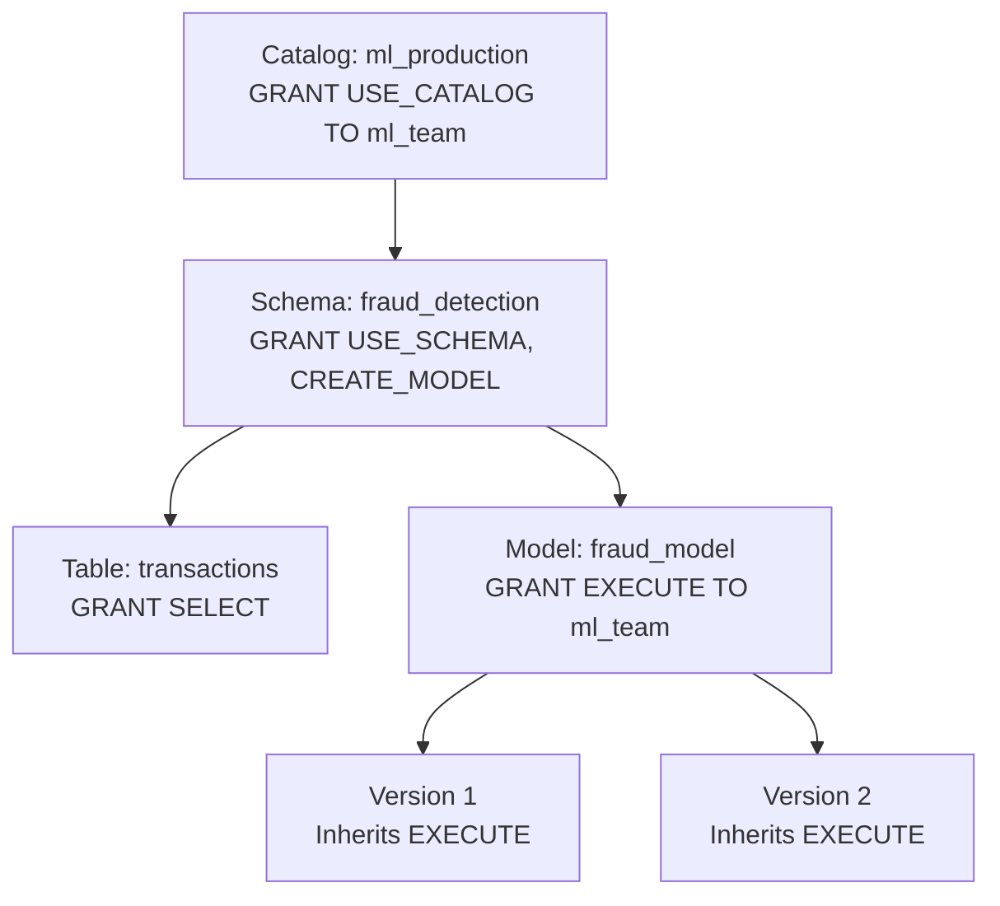
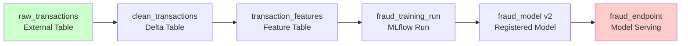
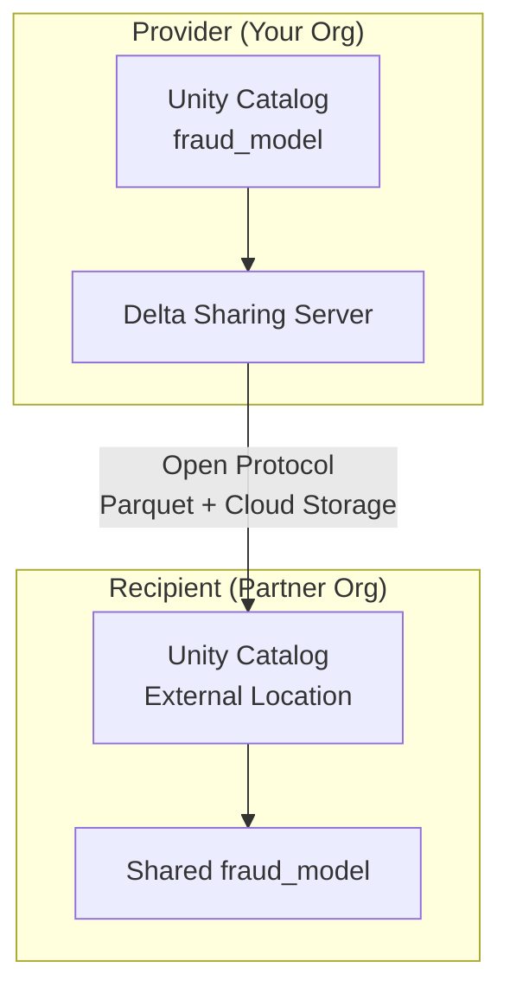

# 🗂️ Unity Catalog: Governance for ML Assets

## Introduction

Governance is the difference between a team that ships ML and a team that ships ML safely. Without governance, models are deployed without knowing who trained them, datasets are shared without audit trails, and feature permissions are managed through ad-hoc IAM policies that nobody fully understands.

Unity Catalog is Databricks' unified governance layer — a single place to define, discover, and secure all data and AI assets across workspaces. For ML engineers, it means one catalog for your training datasets, feature tables, MLflow models, and serving endpoints, all governed by the same RBAC model. This module explains the governance model, the three-level namespace, and how Unity Catalog elevates ML asset management from a file system problem to an organizational capability.

---

## 1. 🧠 The Governance Gap in ML

Traditional data governance solves the analytics problem: "who can query which tables?" ML governance adds new dimensions that analytics governance doesn't address:

| Dimension | Analytics Governance | ML Governance |
|---|---|---|
| **Assets** | Tables, views | Tables + features + models + experiments + notebooks |
| **Lineage** | Table → downstream table | Raw data → feature → training run → model version → deployment |
| **Permissions** | `SELECT`, `INSERT` | `SELECT` + `EXECUTE ON MODEL` + `READ FEATURE` + `MANAGE EXPERIMENT` |
| **Versioning** | Schema versions | Data versions + model versions + feature versions (all linked) |
| **Sharing** | Within organization | Cross-workspace, cross-cloud via Delta Sharing |
| **Compliance** | GDPR on tables | GDPR + model explainability regulations (EU AI Act) |

Unity Catalog addresses all of these by treating ML artifacts as first-class governed objects with the same permission model as tables and views.

---

## 2. 📐 The Three-Level Namespace

Unity Catalog organizes all assets in a three-level hierarchy:

```
Catalog → Schema → Object
```

```
┌─────────────────────────────────────────────────────────────┐
│                    UNITY CATALOG                             │
│                                                             │
│  ml_production (Catalog)                                    │
│  ├── fraud_detection (Schema)                               │
│  │   ├── transactions (Table)                               │
│  │   ├── transaction_features (Feature Table)               │
│  │   ├── fraud_model (Registered Model)                     │
│  │   │   ├── Version 1 (Staging)                            │
│  │   │   └── Version 2 (Production)                         │
│  │   └── fraud_experiments (Volume - for notebooks/scripts) │
│  │                                                          │
│  └── recommendation (Schema)                                │
│      ├── user_embeddings (Table)                            │
│      ├── rec_model (Registered Model)                       │
│      └── raw_events (External Location - S3 bucket)         │
│                                                             │
│  ml_research (Catalog)                                      │
│  └── nlp_experiments (Schema)                               │
│      ├── training_data (Table)                              │
│      └── bert_finetuned (Registered Model)                  │
└─────────────────────────────────────────────────────────────┘
```

### What Each Level Controls

| Level | Purpose | Example |
|---|---|---|
| **Catalog** | Organizational boundary, data domain | `ml_production` vs `ml_research` vs `finance` |
| **Schema** | Project or use case grouping | `fraud_detection`, `recommendation` |
| **Object** | The governed asset | Tables, Models, Volumes, Functions |

---

## 3. 🔐 RBAC Model: Who Can Do What

Unity Catalog uses a GRANT/DENY model with fine-grained permissions:

### Permission Types by Asset

| Asset Type | Available Permissions |
|---|---|
| **Table / View** | `SELECT`, `MODIFY`, `CREATE`, `READ_METADATA`, `USAGE` |
| **Feature Table** | `SELECT`, `APPLY_TAG`, `READ_METADATA` |
| **Registered Model** | `EXECUTE` (use for inference), `MANAGE` (promote, archive, delete), `READ_METADATA` |
| **Volume** | `READ_VOLUME`, `WRITE_VOLUME`, `CREATE_VOLUME` |
| **Schema** | `CREATE_TABLE`, `CREATE_MODEL`, `CREATE_VOLUME`, `USE_SCHEMA` |
| **Catalog** | `CREATE_SCHEMA`, `USE_CATALOG`, `MANAGE` |

### Permission Inheritance



Permissions granted at the catalog or schema level propagate down to child objects. DENY always takes precedence over GRANT, resolving conflicts deterministically.

### ML-Specific Permission Patterns

| Pattern | Permissions | Who |
|---|---|---|
| **Data Scientist (Prototyping)** | `USE_CATALOG`, `USE_SCHEMA`, `SELECT` on training tables, `CREATE_MODEL` | Individual contributors |
| **MLOps Engineer (Pipeline)** | `MANAGE` on registered models, `CREATE_TABLE` for feature tables, `USAGE` for compute | Service principals |
| **Production Inference** | `EXECUTE` on specific model versions only | Model Serving endpoints |
| **Auditor (Read-only)** | `READ_METADATA` on catalogs, `SELECT` on audit tables | Compliance team |
| **External Partner** | `SELECT` on specific tables via Delta Sharing | Partner organizations |

---

## 4. 🔗 Lineage and Discovery

Unity Catalog automatically captures lineage — the relationships between data sources, transformations, and downstream consumers.

### What Lineage Captures



### How Lineage Benefits ML Teams

| Benefit | Example |
|---|---|
| **Impact Analysis** | "If I change the `clean_transactions` schema, which models are affected?" |
| **Root Cause** | "This model's accuracy dropped. What changed upstream in the data pipeline?" |
| **Compliance Audit** | "Show every transformation between raw PII data and the anonymized training set." |
| **Reproducibility** | "What exact version of `transaction_features` was used to train `fraud_model v2`?" |

### Data Discovery

The Data Explorer UI enables search across all governed assets:

- **Search by name, tag, or owner:** "Show me all models tagged `fraud` owned by the ML team."
- **Browse catalog structure:** Navigate catalog → schema → objects visually.
- **Preview data:** View sample rows, schema, and metadata without writing queries.

---

## 5. 🌐 Delta Sharing: Cross-Organization ML Asset Sharing

Delta Sharing is Databricks' open protocol for sharing data and ML assets across organizations and clouds — without copying data.

### How It Works



### ML Sharing Use Cases

| Scenario | What's Shared |
|---|---|
| **Model Marketplace** | Share a trained model with a client for inference in their environment |
| **Third-Party Feature Enrichment** | Receive feature updates from a data vendor into your Feature Store |
| **Regulatory Reporting** | Share model performance reports with regulators without exposing training data |
| **Cross-Subsidiary** | Parent company shares datasets with subsidiary without data duplication |

---

## 6. ⚙️ Governance as Code

Unity Catalog supports infrastructure-as-code via Terraform and Databricks Asset Bundles, enabling version-controlled, reproducible governance:

### What Can Be Automated

| Resource | IaC Support | Why Automate |
|---|---|---|
| Catalogs and Schemas | Terraform, Bundles | Environment parity (dev/staging/prod) |
| Tables and Views | Terraform, Bundles | Schema migration management |
| Permissions (GRANT/DENY) | Terraform only | Audit compliance, prevent configuration drift |
| Registered Models | Bundles | CI/CD for model registration |
| External Locations | Terraform, Bundles | Secure credential management for cloud storage |

This approach means governance rules are version-controlled alongside application code and can be reviewed in pull requests — closing the gap between "infrastructure that works" and "infrastructure that is auditable."

---

## ⚠️ Considerations

- **Migration from Hive Metastore:** Unity Catalog is the successor to Hive Metastore. Migrating existing tables and models is a one-way operation — test thoroughly in a staging workspace first.
- **External tables vs managed tables:** External tables reference data in your own cloud storage (you control retention). Managed tables store data in Databricks-managed storage (Unity Catalog controls lifecycle). Choose based on data residency requirements.
- **Cross-workspace sharing:** Unity Catalog can span multiple workspaces in the same region under a single metastore. Cross-region sharing requires Delta Sharing.
- **Permission propagation delay:** GRANT/DENY changes may take seconds to propagate across workspaces. For real-time permission changes, consider the eventual-consistency constraint.

---

## 💡 Tips

- **Use catalogs for organizational boundaries:** `ml_production`, `ml_research`, `analytics` — separate catalogs enforce clear data ownership and reduce accidental cross-team access.
- **Tag models with deployment metadata:** Use Unity Catalog tags (`production`, `challenger`, `deprecated`) to filter models in the registry and automate promotion rules.
- **Set up audit logging early:** Unity Catalog events (who accessed which model, when) are logged to your cloud provider's audit system (AWS CloudTrail, Azure Monitor).

---

## ✅ Knowledge Check

1. **What three-level namespace does Unity Catalog use?** — `catalog.schema.object`. Catalogs define organizational boundaries, schemas group related assets, and objects are the governed resources (tables, models, volumes).

2. **What permission does a Model Serving endpoint need to invoke a registered model?** — `EXECUTE` on the specific model version. Without it, the endpoint cannot load the model for inference.

3. **How does lineage help with ML reproducibility?** — Lineage tracks every upstream dependency (tables, feature tables, notebooks) that contributed to a training run and model version. You can trace "what data produced this model?" backwards through the DAG.

4. **What problem does Delta Sharing solve?** — Delta Sharing enables sharing data and ML models across organizations without copying data. It uses an open protocol over Parquet and cloud storage, avoiding ETL duplication.

---

## 🎯 Key Takeaways

- Unity Catalog extends governance from tables to ML models, features, and notebooks — unified RBAC across all assets.
- The three-level namespace (catalog.schema.object) organizes ML assets by domain and project.
- Automatic lineage captures the full DAG from raw data to deployed model, enabling impact analysis and audit.
- Delta Sharing allows cross-organization model and data sharing without data duplication.
- Governance as Code (Terraform, Bundles) makes permissions reproducible and auditable across environments.

---

## References

- [Unity Catalog Documentation](https://docs.databricks.com/en/data-governance/unity-catalog/index.html)
- [Delta Sharing Protocol](https://delta.io/sharing/)
- [Databricks Terraform Provider](https://registry.terraform.io/providers/databricks/databricks/latest/docs)
- [Databricks Asset Bundles](https://docs.databricks.com/en/dev-tools/bundles/index.html)
