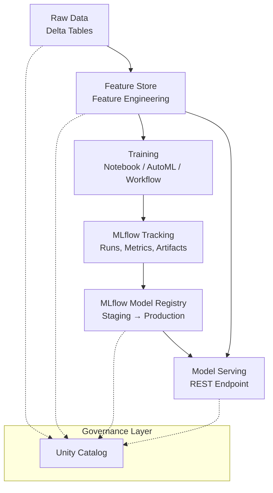
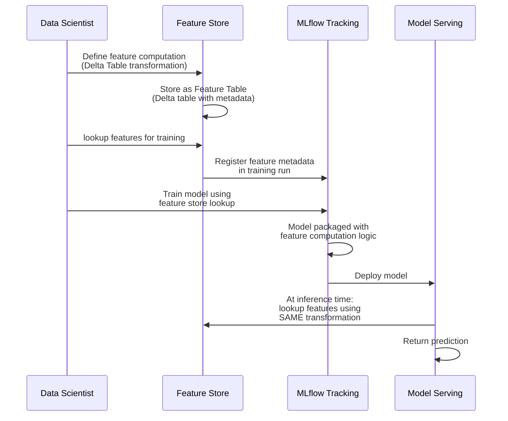
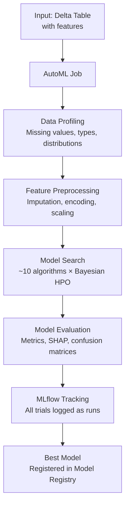
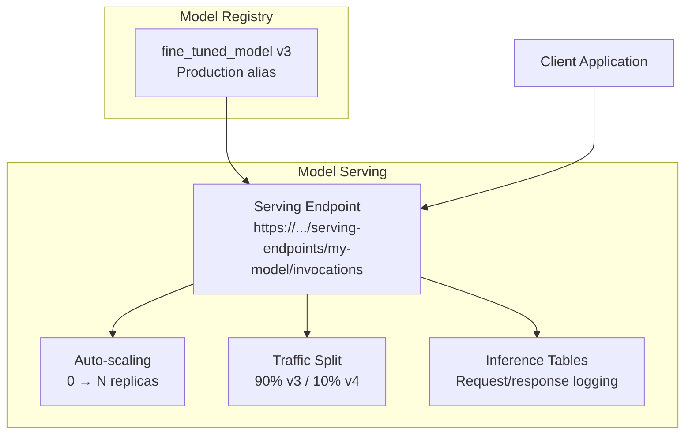

# 🔧 Databricks ML Platform: Feature Store, AutoML, and Model Serving

## Introduction

A managed ML platform is not just a collection of individual tools — it is an integrated system where feature engineering, training, registration, and serving share a common governance layer, storage backend, and compute substrate. Databricks achieves this by integrating four components that work seamlessly together: the Feature Store for consistent feature computation, AutoML for automated model selection, MLflow (managed) for tracking and registry, and Model Serving for inference endpoints.

This module maps the end-to-end ML workflow on Databricks and explains how each component interoperates to eliminate training-serving skew, enforce governance, and reduce the time from experiment to production.

---

## 1. 🔄 The End-to-End ML Workflow on Databricks



The path from raw data to inference follows a linear progression, but the governance layer (Unity Catalog) touches every stage, enforcing permissions, capturing lineage, and providing discovery.

---

## 2. 🏪 Feature Store: Eliminating Training-Serving Skew

### The Training-Serving Skew Problem

Training-serving skew occurs when features are computed differently during training than during inference. This is the #1 silent killer of ML models in production — your model trains on feature X computed one way, but serves predictions on feature X computed differently, producing degraded (often undetected) performance.

### How the Feature Store Solves It



The key insight: the Feature Store captures not just the feature values but the **transformation logic** that produced them. When a model is deployed for serving, the serving endpoint uses the identical transformation — not a reimplementation, not an approximation — eliminating skew.

### Dual Storage: Offline and Online

| Store | Storage Backend | Purpose |
|---|---|---|
| **Offline Store** | Delta Lake tables | Batch training, historical feature retrieval |
| **Online Store** | Low-latency KV store (DynamoDB, Cosmos DB, Cloud SQL) | Real-time inference with millisecond lookup |

```
┌──────────────────────────────────────────────────────┐
│               FEATURE STORE ARCHITECTURE             │
│                                                      │
│  ┌─────────────────────┐  ┌─────────────────────┐   │
│  │   Offline Store     │  │   Online Store       │   │
│  │   (Delta Lake)      │  │   (DynamoDB/Cosmos)  │   │
│  │                     │  │                      │   │
│  │  • Feature tables   │  │  • Low-latency KV    │   │
│  │  • Full history     │  │  • Latest values     │   │
│  │  • Time travel      │  │  • <10ms reads       │   │
│  │  • Batch retrieval  │  │  • Real-time serving │   │
│  └─────────┬───────────┘  └──────────▲───────────┘   │
│            │                         │                │
│            │    Materialization      │                │
│            └─────────────────────────┘                │
└──────────────────────────────────────────────────────┘
```

Features are published to the offline store. A materialization job syncs the latest values to the online store for low-latency serving.

---

## 3. 🤖 AutoML: Automated Model Selection

Databricks AutoML automates the trial-and-error loop of model selection and hyperparameter tuning for tabular data:

### What AutoML Automates

| Step | Manual | AutoML |
|---|---|---|
| **EDA** | Manual pandas profiling | Auto-generated data profile (missing values, distributions, correlations) |
| **Preprocessing** | Manual imputation, encoding, scaling | Auto-detection of column types and optimal preprocessing |
| **Model Selection** | Manual trial of sklearn/XGBoost/LightGBM | Evaluates 10+ model families automatically |
| **HPO** | Manual grid/random search | Bayesian hyperparameter optimization |
| **Evaluation** | Manual metric calculation | Auto-computed metrics, confusion matrices, SHAP feature importance |
| **Tracked Run** | Manual `mlflow.log_*()` calls | Everything auto-logged to MLflow |

### The AutoML Workflow



### Where AutoML Fits vs Manual Training

| Scenario | Use AutoML | Train Manually |
|---|---|---|
| **Baseline Establishment** | Rapid first model | — |
| **Tabular Classification/Regression** | Primary approach | When domain-specific preprocessing is critical |
| **Production Model** | — | When every hyperparameter matters and you need full control |
| **Iteration Speed** | Hours vs days | Days vs weeks (for complex HPO) |

---

## 4. 🚀 Model Serving: From Registry to Production

Databricks Model Serving provides managed, serverless REST endpoints for real-time inference with automatic scaling:

### Serving Architecture



### Serving Capabilities

| Capability | How It Works | ML Benefit |
|---|---|---|
| **Serverless** | No cluster management — auto-scales to zero | Zero cost when idle |
| **GPU Inference** | GPU-backed endpoints for LLMs and DL models | High-throughput deep learning inference |
| **Traffic Splitting** | Canary deployments (e.g., 95% v2, 5% v3) | Safe model rollout with automatic rollback |
| **Inference Tables** | Captures every request/response for monitoring | Drift detection and compliance auditing |
| **Feature Store Integration** | Automatic feature lookup at inference time | Eliminates training-serving skew |

### Deployment Pattern: Canary Release

```
┌──────────────────────────────────────────────────────────┐
│ Model Serving Endpoint: fraud-detector                    │
│                                                          │
│  Traffic Split:                                          │
│  ┌──────────────────────────────────────────────────┐   │
│  │ fraud_model v2  ████████████████████████████ 90% │   │
│  │ fraud_model v3  ████ 10%                        │   │
│  └──────────────────────────────────────────────────┘   │
│                                                          │
│  Monitor:                                                │
│  • v3 latency vs v2 latency                              │
│  • v3 prediction distribution vs v2                     │
│  • If v3 degrades → auto-rollback to 100% v2            │
└──────────────────────────────────────────────────────────┘
```

---

## 5. 🔗 Integration Points Between Components

The true power of the Databricks ML platform comes from the integration points:

| Integration | What It Enables |
|---|---|
| **Feature Store → MLflow** | Training runs record which feature tables and versions were used |
| **MLflow Registry → Model Serving** | Deploy models directly from registry versions with one click/API call |
| **Model Serving → Feature Store** | Endpoint auto-lookups features at inference time from the same store used in training |
| **Model Serving → Inference Tables** | Every prediction logged back to Delta Lake for monitoring |
| **AutoML → MLflow → Registry** | Best model from AutoML automatically registered in the model registry |
| **Unity Catalog → Everything** | Unified RBAC and lineage across features, models, and endpoints |

---

## 6. 🌍 Real-World Use Cases

| Company | ML Workflow | Databricks Components Used |
|---|---|---|
| **Tesla** | Vision models for autonomous driving | Delta Lake (petabyte-scale training data), GPU serving |
| **HSBC** | Fraud detection on transaction streams | Feature Store (real-time features), Model Serving (low-latency inference) |
| **Starbucks** | Personalized offer recommendation | AutoML (baseline models), Feature Store (customer features), Model Registry |
| **Adobe** | Creative asset tagging with LLMs | GPU Model Serving (LLM inference), MLflow Registry |
| **Zurich Insurance** | Claims risk scoring | Feature Store (historical claims features), Delta Lake (time travel for audit) |

---

## ⚠️ Considerations

- **Feature Store online sync latency:** Materialization from offline to online store is not real-time — there is typically a few minutes of lag. For features that must be real-time (e.g., "last 5 clicks"), use streaming feature computation instead of batch materialization.
- **AutoML is for tabular data only:** AutoML does not support image, text, or audio models. It is designed for structured classification/regression on Delta tables.
- **Model Serving cold start:** Serverless endpoints scale to zero. The first request after idle incurs a cold-start latency (seconds). For latency-critical applications, keep a minimum replica count.
- **Inference Table costs:** Inference Tables store every request/response to Delta Lake. For high-throughput endpoints (>1000 req/s), this generates significant storage. Set retention policies.

---

## 💡 Tips

- **Always use Feature Store for features used in production models:** Even if you prototype with direct SQL queries, migrate to Feature Store before production deployment to prevent training-serving skew.
- **Use AutoML for baseline, then fine-tune manually:** AutoML establishes the "beatable number" — if your manual training can't beat it, re-evaluate your approach.
- **Set up Inference Tables from day 1 of deployment:** You'll need them for drift detection, debugging, and compliance. Adding them later means missing historical data.
- **Traffic split by percentage, not by rule:** Start with 5% canary, monitor for 24 hours, then ramp to 100%. Don't go straight to 50/50 split.

---

## ✅ Knowledge Check

1. **What problem does the Feature Store solve?** — Training-serving skew: it ensures features are computed using identical logic during both training and inference, preventing silent model degradation.

2. **What is the difference between the Offline Store and the Online Store?** — Offline Store (Delta Lake) holds full history for batch training; Online Store (DynamoDB/Cosmos) holds latest values for low-latency serving.

3. **When should you use AutoML vs manual training?** — AutoML for tabular baselines and rapid experimentation; manual training when domain-specific preprocessing, custom architectures, or full transparency is required.

4. **How does Model Serving integrate with the Feature Store during inference?** — The serving endpoint auto-lookups features from the online store at inference time using the same transformation logic recorded during training.

---

## 🎯 Key Takeaways

- Training-serving skew is eliminated by recording feature computation logic in the Feature Store and reusing it at inference.
- AutoML automates the tabular model selection pipeline and integrates with MLflow for tracking.
- Model Serving provides serverless REST endpoints with auto-scaling, traffic splitting, and inference logging.
- The integration between Feature Store, MLflow, Model Registry, and Model Serving is what distinguishes a platform from a collection of tools.
- Inference Tables capture every prediction for drift detection and compliance — set them up before you deploy.

---

## References

- [Databricks Feature Store Documentation](https://docs.databricks.com/en/machine-learning/feature-store/index.html)
- [Databricks AutoML](https://docs.databricks.com/en/machine-learning/automl/index.html)
- [Databricks Model Serving](https://docs.databricks.com/en/machine-learning/model-serving/index.html)
- [MLflow on Databricks](https://docs.databricks.com/en/mlflow/index.html)
