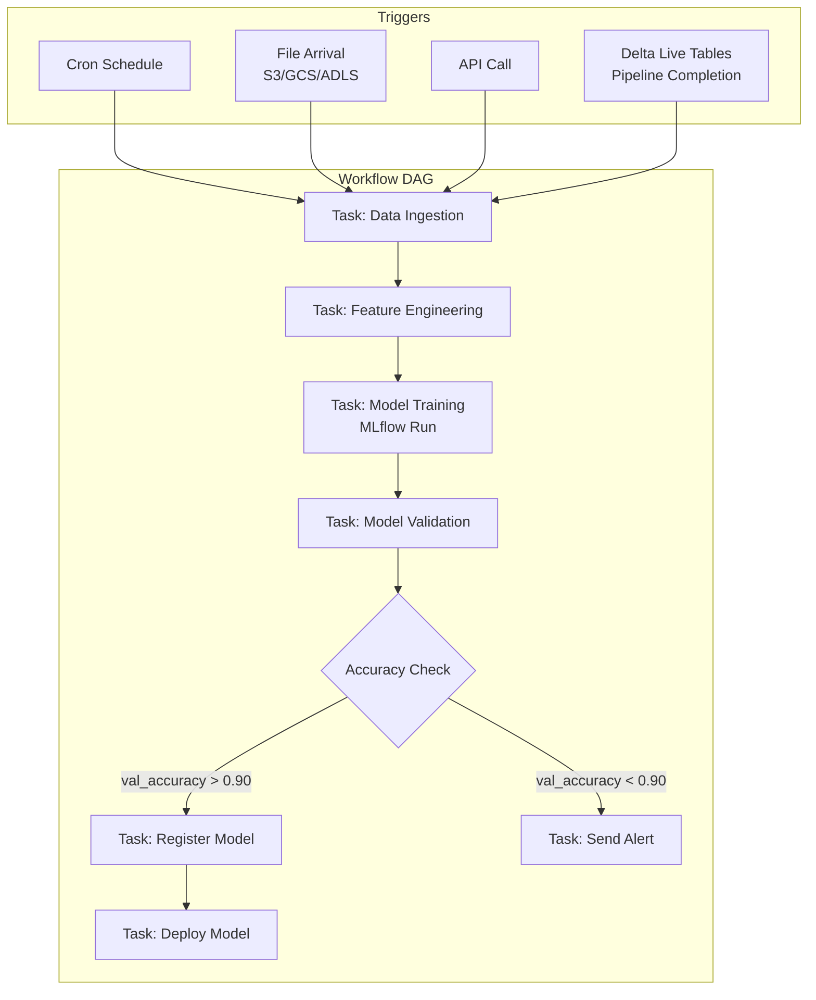
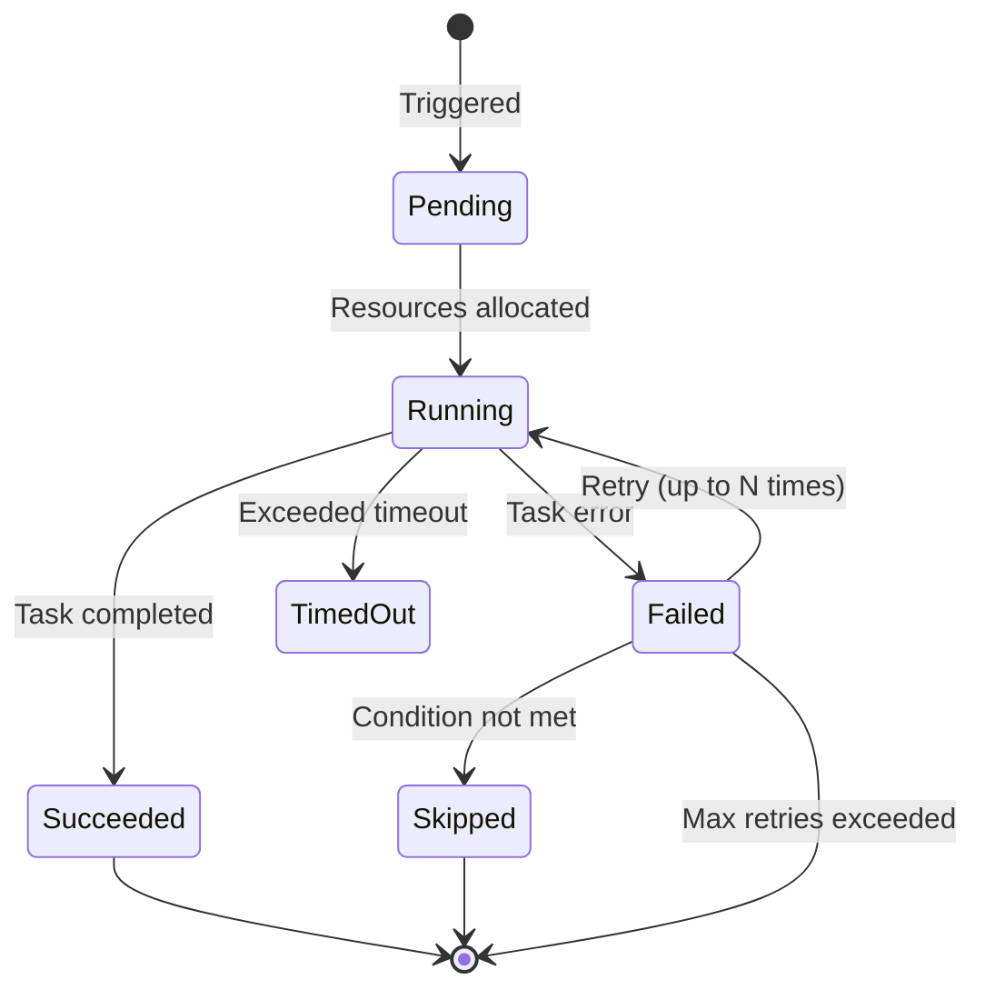
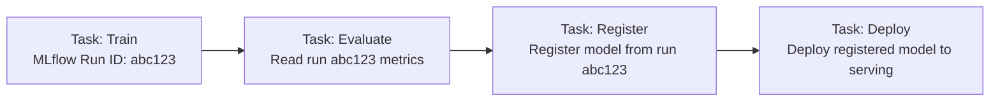

# ⚙️ Databricks Workflows: Orchestration for ML Pipelines

## Introduction

ML pipelines are not notebooks — they are directed acyclic graphs (DAGs) of dependent tasks that must execute reliably, retry on failure, and notify stakeholders on completion. Ad-hoc orchestration (cron jobs, manual notebook runs, "Bob runs the training script every Monday") is the primary source of production ML failures.

Databricks Workflows provides native orchestration where each task in the pipeline is a Databricks notebook, script, or JAR running on ephemeral compute that is torn down after execution. This module covers the orchestration model, trigger mechanisms, conditional logic, and how Workflows integrates with MLflow to create closed-loop ML pipelines from data refresh to model deployment.

---

## 1. 🧠 The Orchestration Problem in ML

ML pipelines differ from ETL pipelines in critical ways that generic orchestrators often struggle with:

| Aspect | ETL Pipeline | ML Pipeline |
|---|---|---|
| **Determinism** | Deterministic transformations | Stochastic training, variable runtime |
| **Dependencies** | Table → table | Data + code + model + hyperparameters |
| **Metrics** | Row counts, data quality | Accuracy, F1, precision, recall, drift |
| **Conditionals** | "If empty, skip" | "If accuracy < threshold, abort deployment" |
| **Failures** | Data corruption, schema changes | Overfitting, underfitting, NaN loss, GPU OOM |
| **Promotion** | Deploy new table version | Promote model through stages (candidate → staging → production) |

A generic orchestrator like Airflow can schedule tasks, but it has no semantic understanding of ML concepts like "model performance gate" or "model registry promotion." Databricks Workflows knows about MLflow runs, model versions, and serving endpoints — enabling ML-native conditionals and triggers.

---

## 2. 📐 Workflow Architecture



### Task Types

| Task Type | Description | ML Use Case |
|---|---|---|
| **Notebook** | Databricks notebook with parameters | Training, evaluation, feature engineering |
| **Python Script** | Standalone `.py` file | Lightweight tasks, API calls |
| **JAR** | Compiled Java/Scala JAR | High-performance Spark jobs |
| **Spark Submit** | Direct Spark job submission | Legacy Spark pipelines |
| **dbt** | dbt Core transformation | Analytics transformations in the pipeline |
| **SQL** | SQL query on SQL Warehouse | Dashboard refresh, data quality checks |

### Compute Isolation

Each task can run on its own ephemeral cluster, which means:
- Training tasks can use GPU clusters
- Evaluation tasks can use CPU-only clusters
- Notebooks can use interactive clusters for debugging, then switch to job clusters for production

```
┌──────────────────────────────────────────────────┐
│ Workflow: fraud_model_pipeline                   │
│                                                  │
│ ┌────────────────┐    ┌────────────────┐        │
│ │ Feature Eng.   │───▶│ Training       │        │
│ │ Job Cluster    │    │ GPU Cluster    │        │
│ │ (CPU, 4 nodes) │    │ (GPU, 2 nodes) │        │
│ └────────────────┘    └────────────────┘        │
│                              │                   │
│                              ▼                   │
│                       ┌────────────────┐        │
│                       │ Evaluation     │        │
│                       │ Job Cluster    │        │
│                       │ (CPU, 1 node)  │        │
│                       └────────────────┘        │
└──────────────────────────────────────────────────┘
```

---

## 3. 🔄 Conditional Logic and Branching

Databricks Workflows supports conditional branching based on task output — including MLflow metrics:

### ML-Native Conditionals

| Condition | How It Works | Example |
|---|---|---|
| **`run_condition`** | Task runs only if all dependencies succeeded (default) | Standard pipeline flow |
| **`if/else` based on task values** | Branch based on task output values | `if train_accuracy > 0.92: deploy else: alert` |
| **`if/else` based on MLflow metrics** | Branch based on metrics from a previous task's MLflow run | `if val_f1 > 0.85: promote_to_staging` |
| **`repair_run`** | Re-run only failed tasks, not the whole pipeline | After fixing a data schema issue |

### Workflow State Machine



### Notification Integration

| Channel | Trigger | Use Case |
|---|---|---|
| **Email** | On failure | Alert MLOps team |
| **Slack/Teams** | On completion or failure | Team channel notifications |
| **Webhook** | On any state change | Trigger external systems (PagerDuty, custom dashboards) |

---

## 4. 🔗 MLflow Integration in Workflows

The tightest integration point between Databricks Workflows and the ML platform is the ability to pass MLflow run information between tasks:



### Task Outputs as Pipeline Variables

Workflows can extract values from task outputs and pass them as parameters to downstream tasks:

| Output | Source | Used By |
|---|---|---|
| `{{tasks.train_task.values.run_id}}` | MLflow run ID from training task | Evaluation, registration, deployment tasks |
| `{{tasks.evaluate_task.values.accuracy}}` | Accuracy metric from evaluation task | Conditional branching |
| `{{tasks.register_task.values.model_version}}` | Model version number | Deployment task, notification message |

This enables "model chaining" — where the exact run and model version propagate through the pipeline without manual intervention.

---

## 5. 🏗️ Delta Live Tables (DLT) for Feature Pipelines

Delta Live Tables is a declarative framework for building reliable ETL pipelines on Delta Lake — separate from Workflows but often used as a trigger for ML pipelines:

### DLT vs Standard Workflows

| Aspect | Delta Live Tables | Standard Workflows |
|---|---|---|
| **Paradigm** | Declarative (define expectations) | Imperative (define steps) |
| **Data Quality** | Built-in expectations/constraints | Manual validation tasks |
| **Incremental Processing** | Auto-change data capture | Manual incremental logic |
| **Error Handling** | Quarantine bad records, continue pipeline | Pipeline stops on failure |
| **Use Case** | Feature engineering, data preparation | Model training, evaluation, deployment |

### Typical Pipeline Architecture

```
Delta Live Tables (Feature Pipeline)
        │
        │ Trigger on completion
        ▼
Databricks Workflows (ML Pipeline)
  ├── Training Task
  ├── Evaluation Task
  └── Deployment Task
```

DLT handles the "data side" — ingestion, cleaning, feature computation — and triggers the ML workflow when feature tables are updated. This separation of concerns prevents the anti-pattern of embedding ETL logic inside ML training notebooks.

---

## 6. 📊 Monitoring and Observability

Workflows provide built-in observability without additional tooling:

| Observable | What You See |
|---|---|
| **Task Duration** | Line chart of task runtime per execution |
| **Success/Failure Rate** | Percentage of successful executions over time |
| **Resource Utilization** | CPU, memory, and I/O per task execution |
| **Data Quality (DLT)** | Number of records passing/failing expectations |
| **Pipeline Latency** | End-to-end time from trigger to completion |

### Repair Run: Fixing Failures Without Restarting

```
Normal Retry:           Repair Run:
┌─────────────┐        ┌─────────────┐
│ Task A ✓     │        │ Task A ✓     │
│ Task B ✓     │        │ Task B ✓     │
│ Task C ✗     │        │ Task C ✗     │ ← Only this re-runs
│ Task D (wait)│        │ Task D ✓     │
└─────────────┘        └─────────────┘
  Entire pipeline          Only failed task
  re-runs from scratch     and its downstream
```

This is critical for long ML pipelines where re-running 8 hours of feature engineering because the evaluation task had a timeout is wasteful and costly.

---

## 7. 🌍 Production Pipeline Patterns

### Pattern 1: Scheduled Retraining

```
Every Monday 02:00 UTC:
  DLT pipeline (feature refresh)
    → Workflow (train + evaluate)
      → If accuracy improved: deploy + notify
      → If accuracy degraded: keep old model + alert
```

### Pattern 2: Event-Driven Retraining

```
File arrives in s3://new-training-data/:
  → DLT pipeline (process new data)
    → Workflow (train + evaluate)
      → If model passes quality gate: deploy
```

### Pattern 3: CI/CD for Model Updates

```
Git push to main (model code change):
  → Workflow (train from scratch)
    → Evaluate against baseline
      → If better: register new version + deploy canary (10%)
      → If worse: block + report
```

---

## ⚠️ Considerations

- **Long-running tasks and timeout:** Workflows enforce a timeout per task. For training jobs that take 12+ hours, set appropriate timeouts and consider checkpointing within the training script.
- **Idempotency:** Design tasks to be idempotent. If a task retries after a partial write, it should produce the same result — not corrupt data.
- **Job cluster cost:** Job clusters are ephemeral but still incur DBU costs during execution. Right-size clusters for each task (don't use 8-node GPU clusters for a simple evaluation script).
- **Task parameter drift:** When passing parameters between tasks (e.g., run_id), ensure the parameter name stays consistent. Renaming a parameter in one task breaks the downstream task silently.

---

## 💡 Tips

- **Start pipelines with `repair_run` enabled:** During development, your pipeline will fail. Repair Run saves hours by not re-running successful tasks.
- **Use different cluster configs per task:** Training on GPU, evaluation on CPU, feature engineering on large Spark cluster — this is the most cost-efficient pattern.
- **Set notification webhooks at the workflow level, not per task:** A single webhook on pipeline failure is cleaner than per-task notifications that trigger repeatedly.
- **Templatize workflow parameters:** Use `{{job.parameters.input_table}}` to make pipelines reusable across projects and environments.

---

## ✅ Knowledge Check

1. **What makes ML orchestration different from ETL orchestration?** — ML pipelines have stochastic tasks (training), metric-based conditionals (accuracy > threshold), and domain-specific promotion steps (model registry stages) that generic orchestrators don't understand natively.

2. **How does the Repair Run feature save time in ML pipelines?** — It re-runs only failed tasks and their downstream dependencies, rather than restarting the entire pipeline. This saves hours when a late-stage task (like evaluation) fails after a long feature engineering step.

3. **What information can Workflows pass between tasks in an ML pipeline?** — MLflow run IDs, evaluation metrics, model version numbers — enabling downstream tasks to register and deploy the exact model produced upstream.

4. **When should you use Delta Live Tables vs Databricks Workflows?** — DLT for declarative data pipelines with built-in quality constraints (feature engineering). Workflows for imperative ML pipelines with conditional branching and ML-specific actions (training, registry, deployment).

---

## 🎯 Key Takeaways

- Databricks Workflows provides native ML orchestration with MLflow run awareness and model registry integration.
- Conditional branching enables ML-native gates: if accuracy > threshold, promote; else alert.
- Repair Run minimizes retry cost by only re-running failed tasks and their dependents.
- Delta Live Tables handles the data side declaratively; Workflows handles the ML side imperatively.
- Task-to-task parameter passing eliminates manual glue code between pipeline stages.

---

## References

- [Databricks Workflows Documentation](https://docs.databricks.com/en/jobs/index.html)
- [Delta Live Tables](https://docs.databricks.com/en/delta-live-tables/index.html)
- [Notifications in Workflows](https://docs.databricks.com/en/jobs/notifications.html)
- [MLflow Integration in Workflows](https://docs.databricks.com/en/mlflow/workflows.html)
