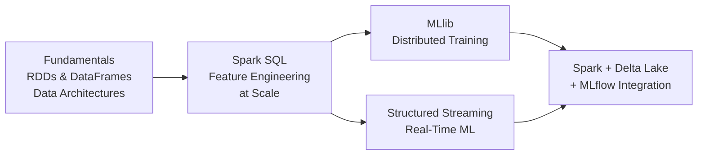

# ⚡ Welcome to Apache Spark for ML

Apache Spark is the distributed computing engine that powers enterprise-scale machine learning. Every Databricks cluster, every Delta Lake table, every large-scale feature engineering pipeline — Spark is the engine underneath. Understanding Spark is understanding how ML scales beyond a single machine.

This course covers Spark from fundamentals to production ML pipelines: the RDD/DataFrame model, Catalyst optimizer, Spark SQL for feature engineering, MLlib for distributed training, Structured Streaming for real-time ML, and the integration of Spark + Delta Lake + MLflow that forms the backbone of Databricks MLOps.

---

## Course Index

1. [[01 - Spark Fundamentals|Spark Fundamentals: RDDs, DataFrames, and Data Architectures]]
2. [[02 - Spark SQL for ML|Spark SQL and ML Data Preparation]]
3. [[03 - Spark MLlib|Spark MLlib: Distributed Machine Learning]]
4. [[04 - Structured Streaming|Structured Streaming for Real-Time ML]]
5. [[05 - Spark + Delta Lake + MLflow|Spark + Delta Lake + MLflow: The Enterprise MLOps Triad]]

---

## Learning Path

---

## Why Spark Matters for ML Engineers

| Capability | Without Spark | With Spark |
|---|---|---|
| **Data Scale** | Pandas memory limits (~RAM) | Distributed across clusters (TB-PB) |
| **Feature Engineering** | Python loops on single machine | SQL + DataFrame API on hundreds of cores |
| **Training** | Single-node scikit-learn | Distributed MLlib across GPUs |
| **Inference** | Sequential batch prediction | Parallel batch inference on clusters |
| **Streaming** | Separate Kafka + Flink setup | Built-in Structured Streaming |
| **Ecosystem** | Manual integration | Delta Lake + MLflow + Unity Catalog native |

---

## Prerequisites

- Python fundamentals (PySpark is the ML interface)
- SQL knowledge (Spark SQL is heavily SQL-based for feature engineering)
- Basic understanding of distributed systems (worker/executor model)
- Familiarity with MLflow and Delta Lake (see courses 01 and 09-09)

---

## Objectives

By the end of this course you will:

1. Understand the RDD/DataFrame abstraction and Catalyst query optimizer.
2. Explain the differences between Data Lake, Data Warehouse, and Lakehouse architectures.
3. Engineer features at scale using Spark SQL and DataFrame transformations.
4. Train and evaluate models using Spark MLlib pipelines.
5. Build real-time ML feature pipelines with Structured Streaming.
6. Design end-to-end production pipelines combining Spark, Delta Lake, and MLflow.

---

💡 **Tip:** Most ML engineers interact with Spark through PySpark (Python API). Learn the DataFrame API first, then dive into RDDs when you need low-level control for custom algorithms.

⚠️ **Warning:** Spark is not a replacement for pandas — it's a complement for data that doesn't fit in memory. For datasets under ~10GB, pandas is simpler and faster. Use Spark when you hit the pandas ceiling.
