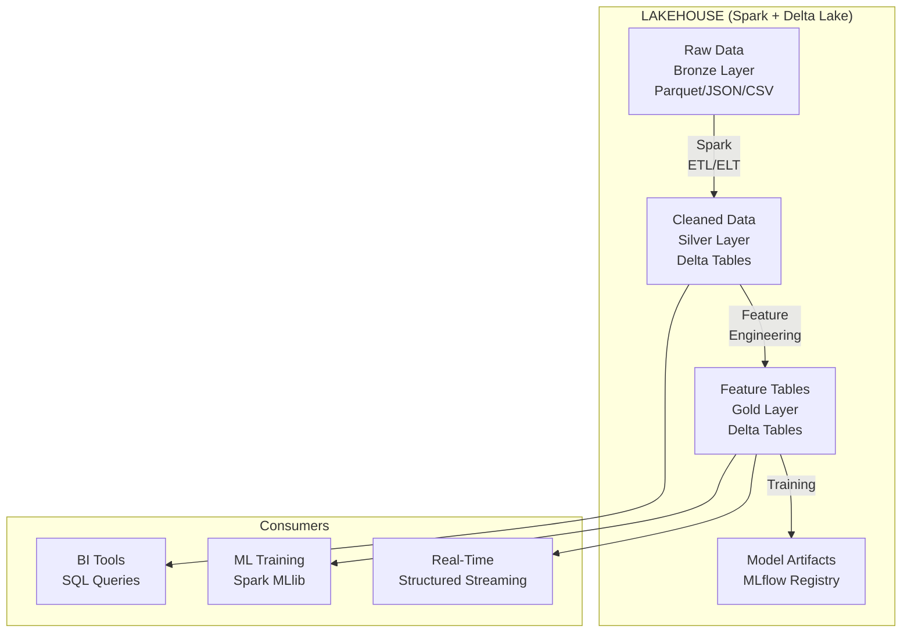
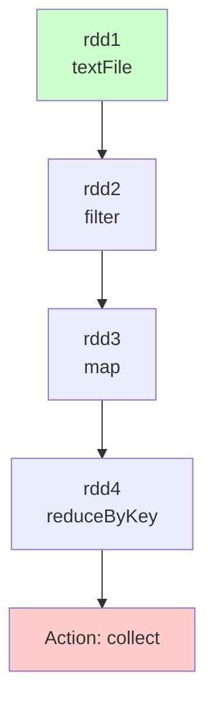
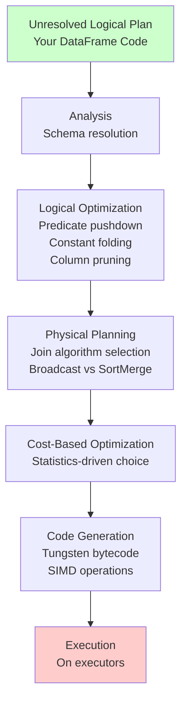
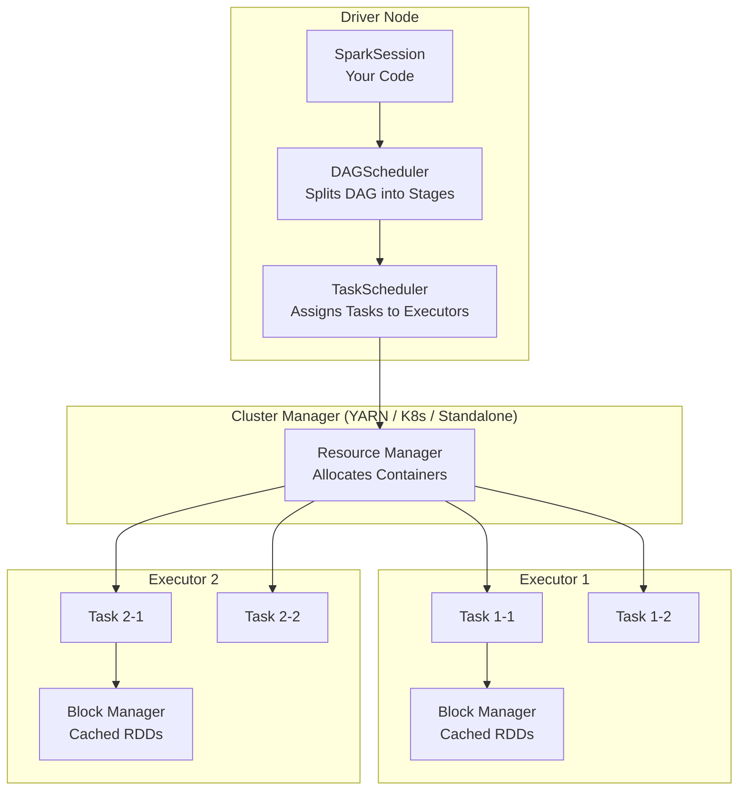
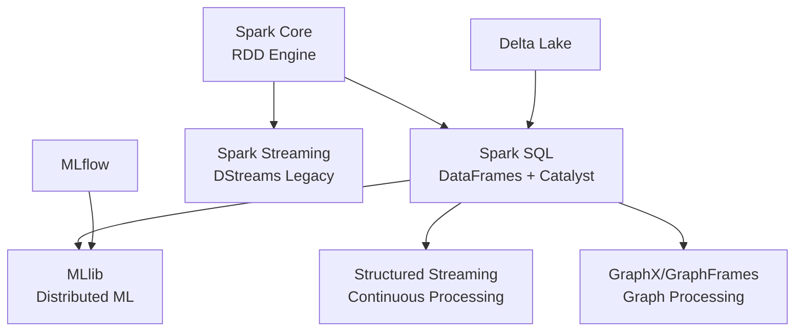

# 🔥 Spark Fundamentals: RDDs, DataFrames, and Data Architectures

## Introduction

Apache Spark is not just a faster MapReduce — it is a unified analytics engine for large-scale data processing that fundamentally changed how ML engineers think about distributed computation. At its core, Spark provides a programming model (RDDs), a high-level API (DataFrames/Datasets), and a query optimizer (Catalyst) that together enable you to process terabytes of data with the same mental model as manipulating local collections.

But Spark doesn't exist in a vacuum. To understand why Spark is the engine of choice for ML at scale, you must first understand the data architectures it operates within: Data Lakes, Data Warehouses, and the Lakehouse paradigm that unifies them. This module covers both — the computational model of Spark and the architectural context that makes it indispensable.

---

## 1. 🏛️ Data Architectures: Lake, Warehouse, and Lakehouse

Before writing a single line of Spark, you need to understand *where* your data lives and *why*. The architecture determines what Spark can do with your data, how it's governed, and how it integrates with ML pipelines.

### Data Lake

A Data Lake is a centralized repository that stores raw data in its native format — structured, semi-structured, and unstructured — typically on cheap object storage (S3, ADLS, GCS).

```
┌─────────────────────────────────────────────────────────────┐
│                     DATA LAKE (S3 / ADLS / GCS)              │
│                                                              │
│  /raw/                /processed/           /models/         │
│  ├─ logs/*.json       ├─ features/*.parquet ├─ v1/model.pkl  │
│  ├─ events/*.avro     ├─ joined/*.parquet   ├─ v2/model.pkl  │
│  ├─ images/*.jpg      └─ agg/*.parquet      └─ v3/model.pkl  │
│  └─ audio/*.wav                                              │
│                                                              │
│  ✅ Store anything                    ❌ No ACID              │
│  ✅ Cheap ($0.023/GB)                 ❌ No schema enforcement│
│  ✅ Infinite scalability              ❌ No time travel      │
│  ✅ Schema-on-read                    ❌ "Data swamp" risk   │
└─────────────────────────────────────────────────────────────┘
```

**Schema-on-read vs Schema-on-write:** In a data lake, you apply schema when *reading* the data, not when writing it. This flexibility is powerful for exploration but dangerous for production — nothing prevents corrupted data from being written.

### Data Warehouse

A Data Warehouse stores structured, curated data optimized for SQL queries and business intelligence:

```
┌─────────────────────────────────────────────────────────────┐
│                 DATA WAREHOUSE (Snowflake / BigQuery /       │
│                                Redshift / Synapse)           │
│                                                              │
│  sales_prod (Database)                                      │
│  ├── dim_customer (Dimension Table)                          │
│  ├── dim_product                                            │
│  ├── fact_sales (Fact Table)                                │
│  └── agg_daily_revenue (Aggregate View)                     │
│                                                              │
│  ✅ ACID transactions                  ❌ Expensive storage  │
│  ✅ Schema enforced (schema-on-write)  ❌ Structured only    │
│  ✅ Fast SQL (columnar, indexing)      ❌ Closed/proprietary │
│  ✅ Governance (RBAC, lineage)         ❌ Poor for ML raw data│
│  ✅ BI-ready (Tableau, Looker)         ❌ Scaling cost ($/TB)│
└─────────────────────────────────────────────────────────────┘
```

### Lakehouse — The Unified Architecture

The Lakehouse applies warehouse-grade guarantees (ACID, schema enforcement, performance optimization) directly on data lake storage (S3/ADLS/GCS):



### Comparison: The Three Architectures

| Dimension | Data Lake | Data Warehouse | Lakehouse |
|---|---|---|---|
| **Storage** | Object storage (cheap) | Proprietary storage (expensive) | Object storage (cheap) |
| **Data Types** | Any format | Structured only | Any format |
| **Schema** | Schema-on-read | Schema-on-write | Schema-on-write (enforced) |
| **ACID** | ❌ No | ✅ Yes | ✅ Yes (via Delta/Iceberg/Hudi) |
| **Performance** | Slow (no optimization) | Fast (indexes, columnar) | Fast (Z-Order, compaction, caching) |
| **BI Support** | ❌ Poor | ✅ Native (SQL) | ✅ SQL Analytics |
| **ML Support** | ✅ Raw data access | ❌ No raw data, limited formats | ✅ Both raw and processed data |
| **Governance** | Manual IAM | Native RBAC | Unity Catalog / RBAC |
| **Time Travel** | ❌ No | ⚠️ Limited snapshots | ✅ Full version history |
| **Cost** | Lowest | Highest | Low (storage) + Medium (compute) |

**Where Spark fits:** Spark is the compute engine that processes data in ALL THREE architectures. In a Data Lake, Spark reads raw files. In a Lakehouse, Spark reads/writes Delta tables with ACID guarantees. Spark is the bridge between storage and computation.

---

## 2. 🔬 RDDs: The Foundational Abstraction

RDD (Resilient Distributed Dataset) is Spark's original, low-level abstraction — an immutable, partitioned collection of records that can be operated on in parallel.

### Core RDD Properties

| Property | Meaning | ML Implication |
|---|---|---|
| **Immutable** | Once created, cannot be changed | Safe for parallel operations, no race conditions |
| **Partitioned** | Data split across cluster nodes | Parallel processing: each partition = one task |
| **Resilient** | Lineage tracks how RDD was built | Lost partitions recomputed from parent RDDs (no data copy) |
| **Lazy** | Transformations don't execute immediately | Catalyst can optimize entire computation DAG |
| **In-Memory** | Cache/persist RDDs in RAM across operations | Critical for iterative ML algorithms (gradient descent) |

### RDD Operations: Transformations vs Actions

```
┌──────────────────────────────────────────────────────────┐
│                    TRANSFORMATIONS (Lazy)                 │
│  map()  filter()  flatMap()  groupByKey()  reduceByKey() │
│  join()  union()  distinct()  sample()  coalesce()       │
│                      │                                   │
│                      │ Compute DAG is built but NOT      │
│                      │ executed until an Action is called│
│                      ▼                                   │
│                    ACTIONS (Eager — Trigger Execution)     │
│  count()  collect()  take()  reduce()  saveAsTextFile()  │
│  foreach()  first()  saveAsSequenceFile()                │
└──────────────────────────────────────────────────────────┘
```

### Lineage and Fault Tolerance



If a partition of `rdd3` is lost (node failure), Spark doesn't restart from scratch — it recomputes only that partition by replaying `rdd1 → rdd2 → rdd3` for the lost partition. This is the "resilience" in Resilient Distributed Dataset.

### When to Use RDDs Directly

| Scenario | Use RDDs |
|---|---|
| **Low-level data manipulation** | Custom partition strategies, manual byte-level processing |
| **Unstructured data** | Raw binary files, custom formats without schema |
| **Legacy code** | Maintaining pre-DataFrame Spark code |
| **Custom ML algorithms** | Implementing algorithms not available in MLlib |

For 95% of ML use cases, you should use DataFrames — they are faster (Catalyst-optimized) and easier to work with. RDDs are the assembly language; DataFrames are Python.

### RDD Code: The Building Blocks

```python
from pyspark import SparkContext

sc = SparkContext("local[*]", "RDD Example")

# Create RDD from list
data = [1, 2, 3, 4, 5, 6, 7, 8, 9, 10]
rdd = sc.parallelize(data, numSlices=4)

# Transformations (lazy)
filtered = rdd.filter(lambda x: x % 2 == 0)      # [2, 4, 6, 8, 10]
squared = filtered.map(lambda x: x * x)           # [4, 16, 36, 64, 100]

# Action (triggers execution)
result = squared.collect()
print(f"Even squares: {result}")

# Key-value RDD operations (common in ML for aggregations)
pairs = rdd.map(lambda x: (x % 3, x))             # Group by mod 3
by_key = pairs.groupByKey()                        # (0, [3,6,9]), (1, [1,4,7,10]), (2, [2,5,8])
sums = pairs.reduceByKey(lambda a, b: a + b)       # (0, 18), (1, 22), (2, 15)

print(f"Sums by mod 3: {sums.collect()}")
```

---

## 3. 📊 DataFrames: The Modern Spark API

DataFrames are the high-level, optimized API built on top of RDDs. Think of them as distributed pandas DataFrames — they have named columns, SQL-like operations, and automatic optimization through the Catalyst engine.

### RDD vs DataFrame

| Aspect | RDD | DataFrame |
|---|---|---|
| **Schema** | No schema (rows are objects) | Typed schema (columns have names + types) |
| **Optimization** | Manual (no Catalyst) | Automatic (Catalyst + Tungsten) |
| **Serialization** | Java/Kryo serialization | Tungsten binary format (off-heap) |
| **Performance** | 2-5x slower | 2-5x faster (query optimization) |
| **API Style** | Functional (map/filter/reduce) | Declarative (SQL + chained methods) |
| **Language Support** | Scala, Java, Python, R | Same, but PySpark DataFrames are the ML standard |
| **Use Case** | Custom algorithms, low-level | 95% of ML data processing |

### Catalyst Optimizer: How Spark Makes DataFrames Fast



### Key Catalyst Optimizations for ML Workloads

| Optimization | What It Does | ML Example |
|---|---|---|
| **Predicate Pushdown** | Filters data at the source (Parquet/Delta) before loading | `df.filter(col("label") > 0)` — only reads matching row groups |
| **Column Pruning** | Reads only columns you actually use | Training with 5 features out of 500 columns — reads only those 5 |
| **Constant Folding** | Evaluates constant expressions at compile time | `col("x") * 2 * 3` becomes `col("x") * 6` at execution |
| **Join Reordering** | Reorders joins to minimize intermediate data size | Feature join: filter small dim table first, then join to fact |
| **Broadcast Join** | Sends small table to all executors instead of shuffling | Joining 1MB of metadata to 100GB of training data |

### DataFrame Code: ML Data Preparation

```python
from pyspark.sql import SparkSession
from pyspark.sql.functions import col, when, lit, avg, stddev, count, isnan

spark = SparkSession.builder.appName("MLPrep").getOrCreate()

# Read from Parquet (schema auto-inferred)
transactions = spark.read.parquet("s3://bucket/transactions/")

# Schema is known at read time
transactions.printSchema()
# root
#  |-- transaction_id: long
#  |-- user_id: long
#  |-- amount: double
#  |-- timestamp: timestamp
#  |-- merchant_category: string
#  |-- is_fraud: integer

# Feature engineering with DataFrame transformations
features = (
    transactions
    .filter(col("amount") > 0)                               # Filter invalid
    .withColumn("hour", col("timestamp").cast("long") % 86400 / 3600)
    .withColumn("amount_log", col("amount").cast("double").alias("amount"))
    .withColumn(
        "amount_bucket",
        when(col("amount") < 10, "micro")
        .when(col("amount") < 100, "small")
        .when(col("amount") < 1000, "medium")
        .otherwise("large")
    )
    .dropna(subset=["amount", "merchant_category"])           # Drop invalid
)

# Compute aggregates (run in parallel across cluster)
stats = features.groupBy("merchant_category").agg(
    count("*").alias("transaction_count"),
    avg("amount").alias("avg_amount"),
    stddev("amount").alias("std_amount")
)

stats.show()
```

---

## 4. ⚙️ Spark Architecture: Driver, Executors, and Cluster Manager

Understanding the physical architecture is critical for debugging performance:



### Roles

| Component | Where It Runs | What It Does |
|---|---|---|
| **Driver** | Master node | Runs your `main()` code, schedules tasks, manages DAG |
| **Executor** | Worker nodes | Runs tasks, stores cached data in memory/disk |
| **Cluster Manager** | YARN / K8s / Standalone | Allocates resources, monitors health |

### How a Job Executes

```
1. DataFrame operation (e.g., .filter().groupBy().agg())
2. Spark builds DAG of RDDs (lazy evaluation)
3. When Action is called (.count(), .show(), .write):
   a. DAGScheduler splits DAG into Stages (at shuffle boundaries)
   b. Each Stage contains Tasks (one per partition)
   c. TaskScheduler assigns Tasks to Executors
   d. Executors run Tasks in parallel across CPU cores
   e. Results returned to Driver
```

### Shuffle: The Performance Killer

A shuffle occurs when data must be redistributed across partitions — typically at `groupBy()`, `join()`, or `repartition()` boundaries:

```
Before Shuffle:                    After Shuffle:
┌──────────────┐                  ┌──────────────┐
│ Executor 1   │                  │ Executor 1   │
│ [A,A,B,C]    │ ─── Shuffle ──▶  │ [A,A,A]      │
└──────────────┘                  └──────────────┘
┌──────────────┐                  ┌──────────────┐
│ Executor 2   │                  │ Executor 2   │
│ [A,B,B,C]    │ ─── Shuffle ──▶  │ [B,B,B]      │
└──────────────┘                  └──────────────┘
┌──────────────┐                  ┌──────────────┐
│ Executor 3   │                  │ Executor 3   │
│ [A,B,C,C]    │ ─── Shuffle ──▶  │ [C,C,C]      │
└──────────────┘                  └──────────────┘

Cost: Disk I/O + Network Transfer + Serialization
```

**ML-specific shuffle avoidance strategies:** Pre-partition data by `user_id` or `session_id` so joins and groupings happen locally within each executor, avoiding network transfer.

---

## 5. 🔄 Spark Ecosystem: Libraries for ML

Spark provides four built-in libraries that are directly relevant to ML engineering:

| Library | Purpose | ML Use |
|---|---|---|
| **Spark SQL** | SQL + DataFrame API | Feature engineering, data cleaning, EDA at scale |
| **Spark MLlib** | Distributed ML algorithms | Training on cluster-parallelized data |
| **Spark Structured Streaming** | Incremental stream processing | Real-time features, online inference |
| **GraphX** | Graph-parallel computation | Graph neural net preprocessing, social network features |

### Ecosystem Diagram



---

## 6. 🌍 Real-World Spark ML Deployments

| Company | Spark Use Case | Scale |
|---|---|---|
| **Netflix** | Recommendation feature engineering | 1 trillion+ events/day processed |
| **Uber** | Real-time pricing model features | Streaming features from millions of rides |
| **Airbnb** | Search ranking model training | Spark MLlib for distributed training |
| **Pinterest** | Image embedding generation | Spark + GPU clusters for batch inference |
| **Tesla** | Sensor data preprocessing for autonomous driving | Petabyte-scale time series features |
| **JPMorgan** | Fraud detection feature pipelines | Sub-second latency streaming features on Spark |

---

## ⚠️ Pitfalls

- **Don't use RDDs unless you have a reason:** DataFrames are faster (Catalyst-optimized), have a more ergonomic API, and integrate with MLlib natively. RDDs exist for cases where you need byte-level control.
- **Shuffle is expensive:** Every `groupBy`, `join`, and `repartition` triggers a full data shuffle across the network. Minimize shuffles by pre-partitioning data intelligently.
- **collect() kills the Driver:** `collect()` brings all data to the Driver node. If your dataset is 1TB and your Driver has 16GB RAM, your job crashes. Use `show(n)`, `take(n)`, or write to storage instead.
- **Broadcast threshold:** Spark auto-broadcasts tables <10MB. For larger lookup tables (10MB–1GB), use explicit `broadcast()` hints to avoid expensive shuffle joins.
- **Skewed partitions:** If one partition has 1000x more data than others, Spark runs as fast as the slowest task. Use salting or custom partitioners to balance load.

---

## 💡 Tips

- **Use Delta Lake as your default format:** Delta tables give you ACID, time travel, and schema enforcement on top of Spark — no reason to use raw Parquet for production ML.
- **Cache intermediate DataFrames:** `df.cache()` for DataFrames reused across multiple actions (e.g., feature DataFrame used for both EDA and training) avoids recomputing the entire pipeline.
- **Tune partitions:** `spark.sql.shuffle.partitions` defaults to 200. For small datasets, reduce to avoid tiny tasks. For large datasets, increase (target 128MB per partition).
- **Use Arrow for PySpark↔Pandas conversion:** `spark.conf.set("spark.sql.execution.arrow.pyspark.enabled", "true")` accelerates DataFrame-to-Pandas conversion 10x by using Arrow's columnar format.

---

## 📦 Compression Code

```python
from pyspark.sql import SparkSession
from pyspark.sql.functions import col, avg, count, when

spark = SparkSession.builder.appName("SparkFundamentals").getOrCreate()

# Read from Delta Lake
df = spark.read.format("delta").load("s3://bucket/events/")

# Feature engineering pipeline
features = (
    df
    .filter(col("event_type").isin("purchase", "view", "click"))
    .withColumn("hour", (col("timestamp").cast("long") / 3600).cast("int"))
    .withColumn("day_of_week", col("timestamp").cast("date").alias("dow"))
    .na.fill({"price": 0.0, "quantity": 1})
    .select("user_id", "event_type", "price", "quantity", "hour", "day_of_week")
)

# Aggregate features in parallel
user_features = (
    features
    .groupBy("user_id")
    .agg(
        count("*").alias("total_events"),
        avg("price").alias("avg_price"),
        count(when(col("event_type") == "purchase", True)).alias("purchase_count")
    )
)

user_features.show(10)
print(f"Total users processed: {user_features.count()}")
```

---

## ✅ Knowledge Check

1. **What is the difference between schema-on-read and schema-on-write?** — Schema-on-read applies structure at query time (data lake), allowing flexibility but risking corruption. Schema-on-write enforces structure at ingestion (data warehouse, lakehouse), providing reliability at the cost of upfront rigidity.

2. **Why are DataFrames preferred over RDDs for ML workloads?** — DataFrames are Catalyst-optimized (predicate pushdown, column pruning, code generation), have a declarative SQL-like API, and integrate natively with MLlib. RDDs are lower-level and 2-5x slower for typical operations.

3. **What happens during a Spark shuffle?** — Data is redistributed across partitions based on key, requiring disk I/O, network transfer, and serialization/deserialization. Shuffles are the most expensive operations in Spark.

4. **Where does the Lakehouse architecture fit between Data Lakes and Data Warehouses?** — Lakehouses combine data lake's cheap, scalable storage with warehouse-grade ACID transactions, schema enforcement, and performance optimization — all on open formats (Delta Lake/Iceberg/Hudi).

---

## 🎯 Key Takeaways

- Spark's core abstraction is the RDD, but DataFrames are the modern API for 95% of ML work.
- The Catalyst optimizer automatically applies predicate pushdown, column pruning, and join optimization.
- Data Lakes store everything cheaply; Data Warehouses store structured data with ACID; Lakehouses unify both on cheap storage with warehouse guarantees.
- Shuffles are the performance bottleneck — minimize them through pre-partitioning and broadcast joins.
- Spark is not a replacement for pandas — it's the tool for when pandas can't fit your data in memory.

---

## References

- [Apache Spark Programming Guide](https://spark.apache.org/docs/latest/rdd-programming-guide.html)
- [Spark SQL + DataFrames Guide](https://spark.apache.org/docs/latest/sql-programming-guide.html)
- [Catalyst Optimizer Deep Dive (Databricks)](https://www.databricks.com/blog/2015/04/13/deep-dive-into-spark-sqls-catalyst-optimizer.html)
- [Delta Lake Architecture](https://docs.delta.io/latest/index.html)
- [Lakehouse: A New Generation of Open Platforms (CIDR 2021)](https://www.cidrdb.org/cidr2021/papers/cidr2021_paper17.pdf)
