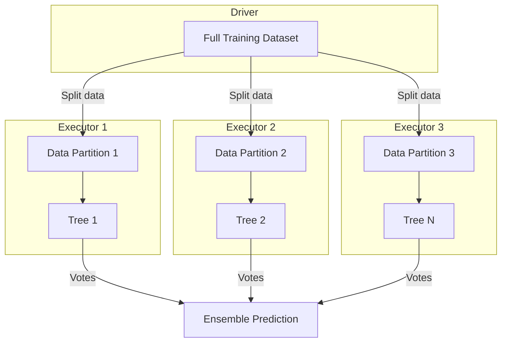
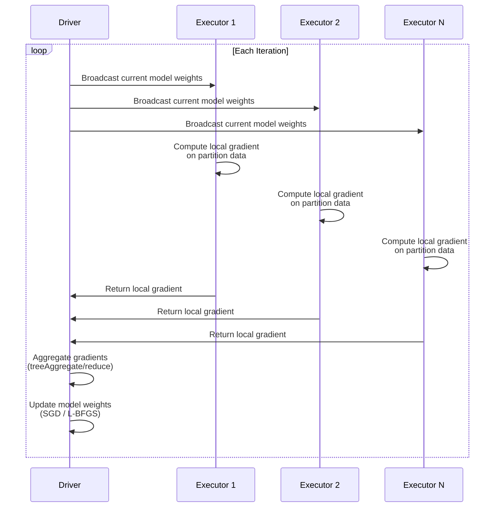

# 🤖 Spark MLlib: Distributed Machine Learning

## Introduction

Spark MLlib is not a replacement for scikit-learn or PyTorch — it is the answer to the question "what do you do when your training data is 10TB and doesn't fit on a single machine?" MLlib provides distributed implementations of the most commonly used ML algorithms, designed to train across clusters of machines while abstracting the complexity of data parallelism, model synchronization, and fault tolerance.

This module covers the MLlib algorithm portfolio, the distributed training mechanics that enable scalability, hyperparameter tuning at cluster scale, and the critical decision of *when* to use MLlib versus single-node alternatives.

---

## 1. 🧠 MLlib Algorithm Portfolio

MLlib organizes algorithms into categories, all accessible through a consistent `fit()`/`transform()` API:

### Classification and Regression

| Algorithm | Type | Distributed? | Best For |
|---|---|---|---|
| **Logistic Regression** | Classification | ✅ Fully distributed | Baseline for binary/multi-class |
| **Linear Regression** | Regression | ✅ Fully distributed | Baseline for continuous targets |
| **Decision Trees** | Both | ✅ Distributed | Interpretable models, feature importance |
| **Random Forest** | Both | ✅ Distributed (trees in parallel) | High accuracy, handles non-linearity |
| **Gradient-Boosted Trees** | Both | ⚠️ Partially distributed | Highest accuracy on tabular data |
| **Naive Bayes** | Classification | ✅ Distributed | Text classification, fast training |
| **Linear SVM** | Classification | ✅ Distributed | High-dimensional sparse data |

### Clustering

| Algorithm | Type | Distributed? | Best For |
|---|---|---|---|
| **K-Means** | Hard clustering | ✅ Distributed | Customer segmentation, quantization |
| **Gaussian Mixture Models** | Soft clustering | ✅ Distributed | Probabilistic cluster assignment |
| **Bisecting K-Means** | Hierarchical | ✅ Distributed | Large-scale hierarchical clustering |
| **LDA** (Latent Dirichlet Allocation) | Topic modeling | ✅ Distributed | Document topic extraction at scale |
| **Power Iteration Clustering** | Spectral | ✅ Distributed | Graph-based clustering |

### Recommendation

| Algorithm | Type | Distributed? | Best For |
|---|---|---|---|
| **ALS** (Alternating Least Squares) | Collaborative filtering | ✅ Distributed | Matrix factorization for implicit/explicit feedback |
| **FPGrowth** | Association rules | ✅ Distributed | Frequent itemset mining, market basket analysis |

### Feature Tools

| Tool | Purpose |
|---|---|
| **ChiSqSelector** | Feature selection via chi-square test |
| **PCA** | Dimensionality reduction |
| **StandardScaler, MinMaxScaler** | Feature scaling |
| **Tokenizer, HashingTF, IDF** | NLP feature extraction |
| **Word2Vec** | Distributed word embeddings |
| **BucketedRandomProjectionLSH** | Approximate nearest neighbor search |

---

## 2. 🔬 How Distributed Training Works in MLlib

MLlib achieves distribution through different strategies depending on the algorithm:

### Strategy 1: Data Parallelism (Trees, Forests)



Random Forest trains each tree on a different partition of data independently. Trees don't share state — pure data parallelism. This scales linearly with cluster size.

### Strategy 2: Gradient Communication (Logistic Regression, Linear SVM)



Linear models use iterative gradient descent. Each executor computes the gradient on its partition. The driver aggregates gradients and updates weights. This is communication-intensive — network bandwidth between driver and executors becomes the bottleneck, not compute.

### Strategy 3: Matrix Factorization (ALS for Recommendations)

ALS decomposes a user-item interaction matrix R into user factors U and item factors V:

$$
R_{m \times n} \approx U_{m \times k} \times V_{k \times n}^T
$$

The algorithm alternates between:
1. Fix V, solve for each user's U row independently (parallel across users)
2. Fix U, solve for each item's V column independently (parallel across items)

This "embarrassingly parallel" alternating strategy scales to billions of interactions.

### Comparison of Distribution Strategies

| Strategy | Communication | Scale Ceiling | Algorithms |
|---|---|---|---|
| **Data Parallel** | None (independent) | Near-linear | Trees, Forests, Naive Bayes |
| **Gradient Communication** | Per iteration (model size) | Network-limited | Logistic Regression, SVM, Linear Regression |
| **Matrix Factorization** | Per iteration (factor matrices) | Near-linear | ALS, K-Means |
| **Single-Node** | N/A (runs on Driver) | Driver RAM | Summary statistics, small models |

---

## 3. 💻 MLlib Training Example

### Random Forest with Feature Pipeline

```python
from pyspark.ml import Pipeline
from pyspark.ml.classification import RandomForestClassifier
from pyspark.ml.evaluation import BinaryClassificationEvaluator, MulticlassClassificationEvaluator
from pyspark.ml.tuning import CrossValidator, ParamGridBuilder

# Load pre-engineered features from Delta Lake
train_df = spark.read.format("delta").load("s3://features/train/")
test_df = spark.read.format("delta").load("s3://features/test/")

# Define model
rf = RandomForestClassifier(
    featuresCol="features",
    labelCol="label",
    numTrees=200,           # Trees trained in parallel across cluster
    maxDepth=15,
    minInstancesPerNode=5,   # Prevent overfitting on small leaves
    featureSubsetStrategy="sqrt",  # Per-tree feature sampling
    impurity="gini",
    seed=42
)

# Train
model = rf.fit(train_df)

# Feature importance (computed from tree splits)
importance = model.featureImportances
for i, imp in enumerate(importance[:10]):
    print(f"Feature {i}: importance = {imp:.4f}")

# Predict
predictions = model.transform(test_df)

# Evaluate
evaluator = BinaryClassificationEvaluator(
    labelCol="label", rawPredictionCol="rawPrediction",
    metricName="areaUnderROC"
)
auc = evaluator.evaluate(predictions)
print(f"Test AUC: {auc:.4f}")

# Confusion matrix
predictions.groupBy("label", "prediction").count().show()
```

### ALS for Recommendations at Scale

```python
from pyspark.ml.recommendation import ALS
from pyspark.ml.evaluation import RegressionEvaluator

# Implicit feedback (clicks, views, purchases)
als = ALS(
    userCol="user_id",
    itemCol="item_id",
    ratingCol="interaction_score",
    implicitPrefs=True,         # Treat score as confidence (0/1 + weight)
    rank=100,                   # Latent factor dimension
    maxIter=20,
    regParam=0.1,               # Regularization to prevent overfitting
    alpha=40.0,                 # Confidence scaling for implicit feedback
    coldStartStrategy="drop"    # Don't predict for unknown users/items
)

model = als.fit(train_df)

# Generate top-K recommendations for all users
user_recs = model.recommendForAllUsers(numItems=10)
user_recs.show(5, truncate=False)

# RMSE on held-out data
predictions = model.transform(test_df)
evaluator = RegressionEvaluator(
    metricName="rmse", labelCol="interaction_score",
    predictionCol="prediction"
)
rmse = evaluator.evaluate(predictions)
print(f"Test RMSE: {rmse:.4f}")
```

---

## 4. 🔄 Hyperparameter Tuning at Scale

MLlib's `CrossValidator` and `TrainValidationSplit` parallelize model training across hyperparameter combinations:

```python
from pyspark.ml.tuning import CrossValidator, ParamGridBuilder
from pyspark.ml.classification import GBTClassifier

gbt = GBTClassifier(
    featuresCol="features",
    labelCol="label",
    seed=42
)

# Define hyperparameter grid
param_grid = (
    ParamGridBuilder()
    .addGrid(gbt.maxDepth, [5, 10, 15])
    .addGrid(gbt.maxIter, [50, 100])
    .addGrid(gbt.stepSize, [0.05, 0.1])
    .addGrid(gbt.subsamplingRate, [0.7, 0.8])
    .build()
)
# 3 x 2 x 2 x 2 = 24 combinations

# Cross-validation (parallel across folds and parameter combos)
cv = CrossValidator(
    estimator=gbt,
    estimatorParamMaps=param_grid,
    evaluator=BinaryClassificationEvaluator(metricName="areaUnderROC"),
    numFolds=5,           # 5-fold CV
    parallelism=4,         # Evaluate 4 models simultaneously
    seed=42
)

cv_model = cv.fit(train_df)

# Best model
best_model = cv_model.bestModel
print(f"Best maxDepth: {best_model.getMaxDepth()}")
print(f"Best maxIter: {best_model.getMaxIter()}")
print(f"Best AUC: {cv_model.avgMetrics[0]:.4f}")
```

### Distributed Training vs Hyperparameter Search

```
┌──────────────────────────────────────────────────────────────┐
│ Spark's Strength: EMBARRASSINGLY PARALLEL workloads          │
│                                                              │
│ ┌────────────────────┐  ┌────────────────────┐              │
│ │ Train Fold 1 + HP1 │  │ Train Fold 2 + HP1 │  ... HP24   │
│ └────────────────────┘  └────────────────────┘              │
│                                                              │
│ Each fold × hyperparameter combo is INDEPENDENT              │
│ → Near-linear speedup with cluster size                     │
│                                                              │
│ Spark's Weakness: SEQUENTIAL workloads                      │
│                                                              │
│ Single deep learning training loop (epoch 1→2→3→...)        │
│ → Spark adds coordination overhead with no benefit          │
└──────────────────────────────────────────────────────────────┘
```

---

## 5. ⚖️ When to Use MLlib vs Single-Node Tools

| Scenario | Use MLlib | Use scikit-learn / XGBoost / PyTorch |
|---|---|---|
| **Data < 5GB** | ❌ Overkill | ✅ Simpler, faster iteration |
| **Data 5GB–50GB** | ⚠️ Depends on model | ✅ Single-node with big RAM instance |
| **Data > 50GB** | ✅ Required | ❌ Won't fit in RAM |
| **Tabular (trees, linear)** | ✅ Native | ✅ scikit-learn / XGBoost |
| **Deep learning** | ❌ Not designed for it | ✅ PyTorch / TensorFlow |
| **Hyperparameter search** | ✅ Best use of Spark (embarrassingly parallel) | ⚠️ Sequential or limited parallelism |
| **Real-time inference** | ❌ Latency too high | ✅ ONNX / TorchServe |
| **Batch inference** | ✅ Predict on TBs in minutes | ❌ Too slow for large batches |

### The Hybrid Architecture

The most common architecture in production combines both:

```
Phase 1 — Data Preparation:    Spark (SQL + Transformations)  ← Handles TBs
Phase 2 — HPO:                 Spark MLlib CrossValidator     ← Parallel grid search
Phase 3 — Final Training:      XGBoost / LightGBM (single node) ← Highest accuracy
Phase 4 — Batch Inference:     Spark                          ← Parallel prediction on cluster
Phase 5 — Real-Time Inference: ONNX / TorchServe              ← Low-latency serving
```

---

## 6. 🌍 Real-World MLlib Deployments

| Company | Use Case | MLlib Component |
|---|---|---|
| **Netflix** | Content recommendation | ALS for collaborative filtering on 200M+ users |
| **Yahoo!** | Ad click prediction | GBT for CTR prediction on 100B+ impressions |
| **Alibaba** | Product recommendation | Random Forest + FeatureHasher on 100M+ products |
| **Tencent** | Fraud detection | Logistic Regression on real-time streaming features |
| **CERN** | Particle classification | Decision Trees on LHC collision data (petabytes) |
| **Comcast** | Customer churn prediction | GBT hyperparameter search across 5K parameter combos |

---

## ⚠️ Pitfalls

- **MLlib ≠ scikit-learn for accuracy:** MLlib's Random Forest and GBT implementations have fewer hyperparameters and may achieve slightly lower accuracy than XGBoost/LightGBM. Use MLlib for scale, XGBoost for accuracy-critical single-node training.
- **ALS cold-start:** Users/items unseen during training get `NaN` predictions by default. Use `coldStartStrategy="drop"` to exclude them or implement a content-based fallback.
- **Model size and serialization:** Tree-based models with 10K+ trees and depth 20+ can produce multi-GB model files. Plan artifact storage and loading latency accordingly.
- **Gradient communication bottleneck:** For linear models, the driver becomes the bottleneck if the gradient vector is large (high-dimensional features). Consider feature selection or hashing before linear model training.

---

## 💡 Tips

- **Use `parallelism=` in CrossValidator:** This parallelizes hyperparameter evaluation across the cluster, turning a 12-hour grid search into a 2-hour one with 6x parallelism.
- **Persist features before hyperparameter search:** If every HPO run re-computes features, you waste compute. `features.persist()` before tuning, then `unpersist()` when done.
- **Export MLlib model to ONNX for low-latency serving:** MLlib models can be converted to ONNX format and served via TorchServe/Triton for real-time inference (<10ms).
- **Use `setMaxBins()` for high-cardinality features:** The default `maxBins=32` for tree models clusters continuous features into 32 buckets. Increase to 128-256 for nuanced splits on features with millions of unique values.

---

## 📦 Compression Code

```python
from pyspark.ml import Pipeline
from pyspark.ml.feature import VectorAssembler, StandardScaler
from pyspark.ml.classification import RandomForestClassifier
from pyspark.ml.evaluation import BinaryClassificationEvaluator

# Assemble and scale features
assembler = VectorAssembler(
    inputCols=["f1", "f2", "f3", "f4", "f5"],
    outputCol="raw_features"
)
scaler = StandardScaler(inputCol="raw_features", outputCol="features")
rf = RandomForestClassifier(labelCol="label", numTrees=100, maxDepth=10)

pipeline = Pipeline(stages=[assembler, scaler, rf])
model = pipeline.fit(train_df)

predictions = model.transform(test_df)
auc = BinaryClassificationEvaluator(
    labelCol="label", metricName="areaUnderROC"
).evaluate(predictions)

print(f"AUC: {auc:.4f}")
model.save("s3://models/rf_pipeline/")
```

---

## ✅ Knowledge Check

1. **Why does Random Forest scale better than Logistic Regression in Spark?** — Random Forest uses data parallelism (trees train independently on different partitions with zero communication). Logistic Regression uses gradient communication (each iteration requires gradient aggregation across all executors), limiting scalability to network bandwidth.

2. **When should you NOT use MLlib for model training?** — When your data fits in a single machine's RAM, when you need state-of-the-art accuracy (XGBoost/LightGBM often outperform MLlib GBT), or when training deep learning models (PyTorch/TensorFlow are the right tools).

3. **What does `CrossValidator(parallelism=4)` do?** — It trains 4 hyperparameter combinations simultaneously across the cluster, reducing total tuning time proportionally. Each parallel model gets its own cluster resources.

4. **How does ALS handle implicit feedback differently from explicit ratings?** — With `implicitPrefs=True`, ALS treats the rating as a confidence value — observed interactions get high confidence, unobserved get low confidence. The model learns to predict preference strength, not explicit ratings.

---

## 🎯 Key Takeaways

- MLlib provides distributed implementations of trees, linear models, and matrix factorization — not deep learning.
- Random Forest and ALS scale near-linearly; linear models are limited by gradient communication overhead.
- CrossValidator parallelizes hyperparameter search across the cluster — this is Spark's strongest ML use case.
- The hybrid architecture (Spark for data prep + XGBoost/PyTorch for training) is the most common production pattern.
- Export MLlib models to ONNX for low-latency serving; use Spark for batch prediction on TB-scale data.

---

## References

- [Spark MLlib Programming Guide](https://spark.apache.org/docs/latest/ml-guide.html)
- [Collaborative Filtering with ALS](https://spark.apache.org/docs/latest/ml-collaborative-filtering.html)
- [Spark ML Tuning (CrossValidator)](https://spark.apache.org/docs/latest/ml-tuning.html)
- [ONNX Runtime for Spark](https://onnxruntime.ai/docs/get-started/with-spark.html)
