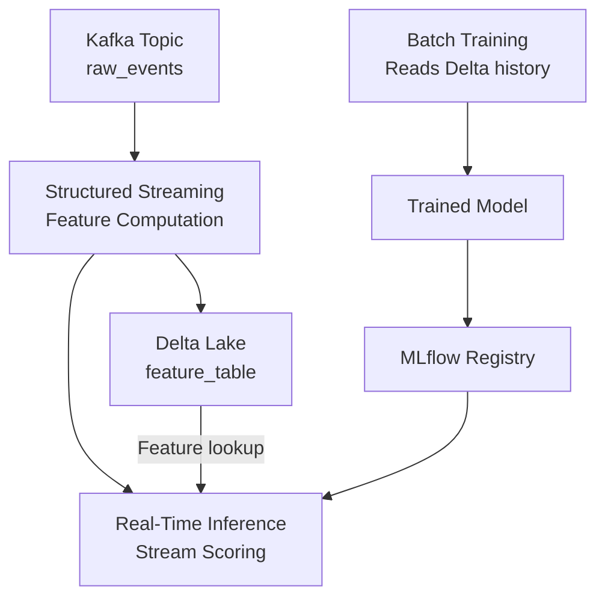

# 🌊 Structured Streaming for Real-Time ML

## Introduction

Batch ML is training on yesterday's data. Streaming ML is training on what happened 5 seconds ago — and serving predictions on what's happening right now. In fraud detection, recommendation, and anomaly detection, the gap between batch and real-time is the gap between detection and loss.

Spark Structured Streaming brings the same DataFrame API from batch processing into the streaming world. You write the same transformations — `filter()`, `groupBy()`, `agg()`, `join()` — and Spark handles the complexities of incremental execution, exactly-once guarantees, and state management across time windows. For ML engineers, this means real-time feature computation and continuous model inference can be expressed with the same code patterns as batch feature engineering.

---

## 1. 🧠 The Streaming Mental Model

Structured Streaming treats a stream as an **unbounded, continuously appended table**:

```
┌─────────────────────────────────────────────────────────────┐
│                    INPUT TABLE (Unbounded)                   │
│                                                             │
│  Time ──────────────────────────────────────────────▶       │
│                                                             │
│  ┌──────────────────────────────────────────────────────┐  │
│  │  Micro-Batch 1  │  Micro-Batch 2  │  Micro-Batch 3  │  │
│  │  (t=0 to t=10s) │ (t=10 to t=20s)│ (t=20 to t=30s) │  │
│  │  ─────────────  │  ─────────────  │  ─────────────   │  │
│  │  {event1}       │  {event4}       │  {event7}        │  │
│  │  {event2}       │  {event5}       │  {event8}        │  │
│  │  {event3}       │  {event6}       │  {event9}        │  │
│  └──────────────────────────────────────────────────────┘  │
│                                                             │
│  Your Query: SELECT ... GROUP BY ... (same as batch!)       │
│                                                             │
│  ┌──────────────────────────────────────────────────────┐  │
│  │              RESULT TABLE (Continuously Updated)      │  │
│  │  ────────────────────────────────────────────────────│  │
│  │  After Batch 1: [user1: count=3]                    │  │
│  │  After Batch 2: [user1: count=5]   ← Updated!       │  │
│  │  After Batch 3: [user1: count=8]   ← Updated again! │  │
│  └──────────────────────────────────────────────────────┘  │
└─────────────────────────────────────────────────────────────┘
```

New data arrives in micro-batches. Spark processes each micro-batch incrementally, updating the result table. Your query is the same as batch — Spark handles the incrementality.

---

## 2. ⚙️ Core Streaming Concepts

### Sources and Sinks

| Source | Type | ML Use |
|---|---|---|
| **Kafka** | Distributed log | Real-time events (clicks, purchases, sensor data) |
| **Kinesis** | AWS streaming | AWS-native event ingestion |
| **Delta Lake** | Table (streaming read) | Incrementally process new rows appended to Delta table |
| **Socket** | Test source | Development and debugging |
| **Rate** | Generated data | Load testing, benchmarking |

| Sink | Type | ML Use |
|---|---|---|
| **Kafka** | Distributed log | Output predictions to downstream systems |
| **Delta Lake** | Table (append/merge) | Persist streaming features to feature store |
| **Memory** | In-memory table | Development, debugging, interactive queries |
| **Console** | Print to stdout | Debugging |

### Output Modes

| Mode | Behavior | When |
|---|---|---|
| **Append** | Only new rows appended since last trigger | Rows never change (e.g., raw event log) |
| **Update** | Changed rows re-emitted | Aggregations where running counts change |
| **Complete** | Entire result table re-emitted every trigger | Small aggregation results that fit in memory |

### Triggers

| Trigger | Behavior | Use Case |
|---|---|---|
| **Processing Time** (default) | Process every N seconds | Low-latency feature computation |
| **Once** | Process all available data and stop | Backfill historical features from Delta table |
| **Continuous** | ~1ms latency experimental mode | Ultra-low latency inference (not production-ready yet) |
| **Available Now** | Process all available data in micro-batches and stop | Scheduled batch-streaming hybrid |

---

## 3. 💻 Streaming ML Patterns

### Pattern 1: Real-Time Feature Computation

Compute rolling window features from a clickstream for a fraud detection model:

```python
from pyspark.sql.functions import (
    window, col, count, avg, sum as spark_sum
)

# Read from Kafka
clicks_stream = (
    spark.readStream
    .format("kafka")
    .option("kafka.bootstrap.servers", "kafka:9092")
    .option("subscribe", "user_clicks")
    .option("startingOffsets", "latest")
    .load()
)

# Parse JSON events
from pyspark.sql.types import StructType, StructField, StringType, DoubleType, TimestampType

schema = StructType([
    StructField("user_id", StringType()),
    StructField("item_id", StringType()),
    StructField("event_type", StringType()),
    StructField("amount", DoubleType()),
    StructField("timestamp", TimestampType())
])

events = clicks_stream.select(
    col("timestamp"),
    from_json(col("value").cast("string"), schema).alias("data")
).select("timestamp", "data.*")

# Windowed aggregations (real-time features)
windowed_features = (
    events
    .withWatermark("timestamp", "10 minutes")   # Handle late data
    .groupBy(
        window("timestamp", "5 minutes", "1 minute"),  # 5-min window, slide every 1 min
        col("user_id")
    )
    .agg(
        count("*").alias("tx_count_5m"),
        avg("amount").alias("avg_amount_5m"),
        spark_sum("amount").alias("total_amount_5m")
    )
)

# Write to Delta Lake (feature store)
query = (
    windowed_features.writeStream
    .outputMode("update")
    .format("delta")
    .option("checkpointLocation", "s3://checkpoints/features/")
    .trigger(processingTime="1 minute")
    .start("s3://features/streaming/user_features/")
)
```

### Pattern 2: Continuous Model Inference (Stream Scoring)

Apply a trained model to each incoming event in real-time:

```python
from pyspark.ml import PipelineModel

# Load trained pipeline from MLflow
model = PipelineModel.load("s3://models/fraud_model/")

# Read streaming events
events = spark.readStream.format("kafka")...  # (as above)

# Apply model to each micro-batch (inference)
predictions = model.transform(events)

# Select relevant columns for output
scored = predictions.select(
    "timestamp", "user_id", "event_type",
    col("probability").alias("fraud_probability"),
    col("prediction").alias("is_fraud_predicted")
)

# Write predictions to Kafka (downstream alerting system)
scored.selectExpr("to_json(struct(*)) AS value") \
    .writeStream \
    .format("kafka") \
    .option("kafka.bootstrap.servers", "kafka:9092") \
    .option("topic", "fraud_predictions") \
    .option("checkpointLocation", "s3://checkpoints/predictions/") \
    .start()
```

### Pattern 3: Streaming + Delta Lake for Continuous Feature Store



### Pattern 4: Stateful Aggregations with Watermarks

Watermarks handle late-arriving data — events that arrive after the window has nominally closed:

```python
from pyspark.sql.functions import window, count

# Watermark: discard events older than 10 minutes
# But: allow late events within watermark to update past windows
stateful_features = (
    events
    .withWatermark("timestamp", "10 minutes")
    .groupBy(
        window("timestamp", "5 minutes"),
        col("user_id")
    )
    .agg(count("*").alias("count"))
)

# The watermark tells Spark: "keep state for 10 minutes of late data,
# then drop it to prevent unbounded memory growth"
```

### Watermark Behavior

```
Timeline ────────────────────────────────────────▶

Event at t=12:05 arrives at t=12:06  → Processed in window [12:05, 12:10]
Event at t=12:05 arrives at t=12:18  → DROPPED (13 min late > 10 min watermark)
```

---

## 4. ⚡ Checkpointing and Fault Tolerance

Checkpointing is the mechanism that makes streaming fault-tolerant. Spark writes progress metadata (which offsets have been processed) and intermediate state to a checkpoint directory:

```
s3://checkpoints/streaming_job/
├── offsets/               # Kafka offsets already processed
├── commits/               # Micro-batch completion markers
├── state/                 # State store for aggregations
└── metadata               # Stream configuration
```

### Recovery Scenarios

| Failure | What Happens |
|---|---|
| **Executor dies** | Tasks re-scheduled on other executors. Kafka offsets provide exactly-once replay. |
| **Driver dies** | Restart from last committed checkpoint. Reprocess any micro-batches that completed processing but didn't commit the sink write. |
| **Sink write fails mid-batch** | Idempotent write ensures exactly-once semantics (Delta Lake guarantees this). |
| **Cluster dies entirely** | Restart with same checkpoint location. Spark reads last committed offset and resumes. |

```
Exactly-Once Guarantee Chain:
Kafka (replayable offsets) → Spark (checkpointed progress)
  → Delta Lake (idempotent writes)

Result: Each event processed exactly once, end-to-end.
```

---

## 5. 📊 Stream-Batch Unification

The same DataFrame code works for batch AND streaming — this is Structured Streaming's signature advantage:

```python
# Batch version (runs once, processes all historical data)
batch_features = (
    spark.read.format("delta").load("s3://events/")
    .groupBy("user_id", window("timestamp", "5 minutes"))
    .agg(count("*").alias("count"))
)

# Streaming version (identical logic, runs continuously)
streaming_features = (
    spark.readStream.format("delta").load("s3://events/")
    .groupBy("user_id", window("timestamp", "5 minutes"))
    .agg(count("*").alias("count"))
)
```

This unification means you can:
1. Prototype on static data (fast iteration)
2. Swap `read` → `readStream` for production
3. No code rewrite between development and production

---

## 6. 🌍 Real-World Streaming ML Use Cases

| Company | Streaming ML Pattern | Technology |
|---|---|---|
| **Uber** | Real-time surge pricing features | Kafka → Spark Streaming → ML model → Kafka |
| **Netflix** | Anomaly detection on streaming quality metrics | Kinesis → Structured Streaming → Isolation Forest |
| **Pinterest** | Real-time content recommendation | Kafka → Spark → Feature Store → Model Serving |
| **Shopify** | Streaming fraud detection | Kafka → Spark → Model inference → Block/Allow API |
| **Tesla** | Real-time sensor anomaly detection | Vehicle edge → Kafka → Spark → Alerting |
| **Bloomberg** | Financial news sentiment streaming | Kafka → Spark NLP pipeline → Trading signals |

---

## ⚠️ Pitfalls

- **State growth without watermark:** Aggregations without watermarks keep ALL state forever. A `groupBy("user_id").count()` without a watermark will OOM as new user_ids arrive indefinitely. Always add `withWatermark()` for production streams.
- **Late data vs real-time requirements:** Watermark of 10 minutes means results are 10 minutes delayed in the worst case. For strict real-time (sub-second), use continuous processing mode or consider Flink.
- **Checkpoint compatibility:** Changing the streaming query (adding/removing aggregations) requires deleting old checkpoints or starting from a new checkpoint location. Incompatible checkpoints cause recovery failures.
- **Kafka offset management:** If you delete a Kafka topic, Spark's stored offsets become invalid. Set `startingOffsets` to `earliest` to reprocess from beginning.

---

## 💡 Tips

- **Use `trigger(availableNow=True)` for backfills:** Process all available data and stop — ideal for one-time ingestion jobs that use the same code as continuous streaming.
- **Monitor streaming metrics:** Spark's StreamingQueryListener captures input rate, processing rate, and batch duration. Hook into these for Prometheus/Grafana dashboards.
- **Co-locate Kafka and Spark for latency:** Run Spark executors in the same AZ/region as your Kafka brokers to minimize network latency on streaming pipelines.
- **Delta Lake as streaming sink:** `forEachBatch()` allows mixing batch and streaming operations on the same micro-batch, like merging streaming features into an existing Delta table.

---

## 📦 Compression Code

```python
from pyspark.sql.functions import from_json, col, window, count, avg

# Read from Kafka
stream = (
    spark.readStream
    .format("kafka")
    .option("kafka.bootstrap.servers", "kafka:9092")
    .option("subscribe", "events")
    .load()
)

# Parse and aggregate
schema = "user_id STRING, event_type STRING, amount DOUBLE, timestamp TIMESTAMP"
features = (
    stream
    .select(from_json(col("value").cast("string"), schema).alias("data"))
    .select("data.*")
    .withWatermark("timestamp", "5 minutes")
    .groupBy(window("timestamp", "1 minute"), "user_id")
    .agg(count("*").alias("event_count"), avg("amount").alias("avg_amount"))
)

# Write to Delta
(
    features.writeStream
    .outputMode("append")
    .format("delta")
    .option("checkpointLocation", "/tmp/checkpoint")
    .trigger(processingTime="30 seconds")
    .start("/tmp/streaming_features")
    .awaitTermination()
)
```

---

## ✅ Knowledge Check

1. **What does `withWatermark()` do and why is it necessary?** — It tells Spark how long to keep state for late-arriving data. Without it, state for unbounded aggregations grows indefinitely and causes OOM. It also tells Spark when it's safe to drop state for old windows.

2. **How does the DataFrame API unify batch and streaming in Spark?** — The same transformations (filter, groupBy, agg, join) work on both static DataFrames and streaming DataFrames. Only the source (`read` vs `readStream`) and sink (`write` vs `writeStream`) differ.

3. **What does exactly-once mean in the context of Structured Streaming?** — Each input event is processed exactly once, even if executors fail mid-processing. Spark uses Kafka's replayable offsets, checkpointed progress, and idempotent Delta Lake writes to guarantee at-least-once processing with idempotent output (effectively exactly-once).

4. **When would you use `outputMode("update")` vs `outputMode("append")`?** — `update` for aggregations where running counts change (only new/changed rows written). `append` for immutable event logs where rows never change after being written.

---

## 🎯 Key Takeaways

- Structured Streaming uses the same DataFrame API as batch — `readStream` + transformations + `writeStream`.
- Watermarks prevent unbounded state growth and define how long Spark waits for late data.
- Checkpointing provides exactly-once fault tolerance: Kafka offsets + checkpoints + Delta Lake idempotent writes.
- Stream-batch unification means you prototype on static data and deploy the same code for streaming.
- Key ML streaming patterns: real-time feature computation, continuous model scoring, and streaming feature store ingestion.

---

## References

- [Structured Streaming Programming Guide](https://spark.apache.org/docs/latest/structured-streaming-programming-guide.html)
- [Structured Streaming + Delta Lake](https://docs.delta.io/latest/delta-streaming.html)
- [Kafka Integration Guide](https://spark.apache.org/docs/latest/structured-streaming-kafka-integration.html)
- [Watermarking and State Management](https://spark.apache.org/docs/latest/structured-streaming-programming-guide.html#handling-late-data-and-watermarking)
