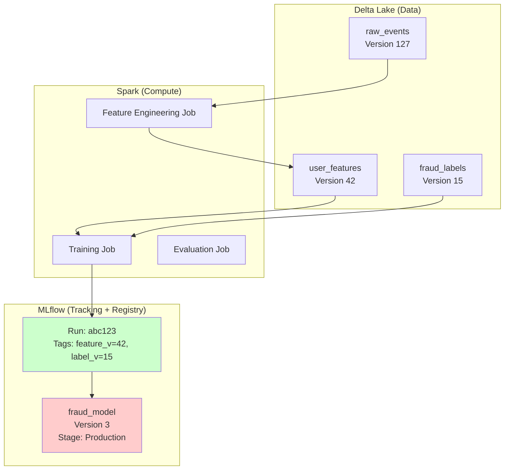
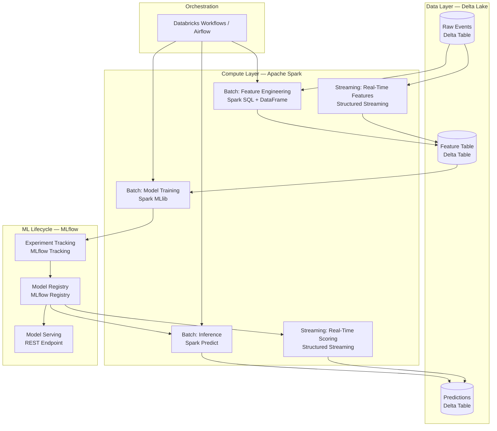

# 🔺 Spark + Delta Lake + MLflow: The Enterprise MLOps Triad

## Introduction

Individually, Apache Spark, Delta Lake, and MLflow are powerful tools. Together, they form a unified MLOps backbone that powers production ML at Netflix, Uber, Comcast, and thousands of Databricks customers. This triad is not three separate tools glued together with duct tape — it is a deliberate architectural integration where each component reinforces the others.

Spark provides distributed compute at any scale. Delta Lake provides ACID transactions, versioning, and time travel on that compute. MLflow provides experiment tracking and model governance on top of both. This module maps the integration points, explains how the triad eliminates reproducibility debt, and provides the architectural blueprint for deploying Spark + Delta + MLflow as a unified ML platform.

---

## 1. 🏛️ The Triad Architecture

```
┌─────────────────────────────────────────────────────────────────┐
│                     THE ENTERPRISE ML TRIAD                       │
│                                                                  │
│  ┌──────────────────────┐                                       │
│  │       MLflow          │  ← Experiment Tracking               │
│  │  • Track runs         │     Model Registry                   │
│  │  • Register models    │     Artifact Management              │
│  │  • Serve endpoints    │                                       │
│  └────────┬─────────────┘                                       │
│           │ Logs runs & artifacts to                             │
│           ▼                                                      │
│  ┌──────────────────────────────────────────┐                   │
│  │            Delta Lake                     │  ← ACID Storage   │
│  │  • Versioned feature tables              │     Time Travel   │
│  │  • Model artifact storage                │     Schema Enf.   │
│  │  • Training dataset snapshots            │     Lineage       │
│  │  • Inference result logging              │                   │
│  └────────┬─────────────────────────────────┘                   │
│           │ Processed by                                        │
│           ▼                                                      │
│  ┌──────────────────────────────────────────┐                   │
│  │          Apache Spark                     │  ← Compute Engine │
│  │  • Distributed feature engineering       │     SQL + DF API  │
│  │  • MLlib distributed training            │     Streaming     │
│  │  • Batch inference on TB-scale           │     Catalyst Opt. │
│  │  • Structured Streaming for real-time    │                   │
│  └──────────────────────────────────────────┘                   │
│                                                                  │
│  ┌──────────────────────────────────────────┐                   │
│  │         Object Storage (S3 / ADLS / GCS)  │  ← Physical Data │
│  └──────────────────────────────────────────┘                   │
└─────────────────────────────────────────────────────────────────┘
```

This is a layered architecture: Spark operates on Delta Lake tables, which are stored on cheap object storage. MLflow orchestrates the experiments and registry layer, pointing to Delta Lake tables and using Delta as its artifact store. Every layer is open source.

---

## 2. 🔗 Integration Point 1: Delta Lake as MLflow's Artifact Store

MLflow needs an artifact store — a place to save models, plots, and processed data. Using Delta Lake as that store gives you ACID transactions, time travel, and schema enforcement on ALL your MLflow artifacts:

```
┌──────────────────────────────────────────────────────────┐
│               DELTA LAKE ARTIFACT STORE                   │
│                                                          │
│  s3://mlflow-artifacts/                                  │
│  ├── experiments/                                        │
│  │   └── fraud_detection/                                │
│  │       ├── _delta_log/         ← Transaction log       │
│  │       ├── run_abc123/         ← Each run is a Delta   │
│  │       │   ├── model/          │   table partition     │
│  │       │   ├── metrics/        │                       │
│  │       │   └── artifacts/      │                       │
│  │       └── run_def456/                                 │
│  │           ├── model/                                  │
│  │           ├── metrics/                                │
│  │           └── artifacts/                              │
│  └── registry/                                           │
│      └── fraud_model/                                    │
│          ├── version_1/                                  │
│          ├── version_2/                                  │
│          └── version_3/                                  │
└──────────────────────────────────────────────────────────┘
```

### Benefits Over Raw S3

| Aspect | Raw S3 as Artifact Store | Delta Lake as Artifact Store |
|---|---|---|
| **Consistency** | Eventual (S3 is not transactional) | Immediate (Delta ACID) |
| **History** | Manual version management | `DESCRIBE HISTORY` for artifact lineage |
| **Auditability** | S3 access logs (separate system) | Delta transaction log (same location) |
| **Time Travel** | ❌ Not possible | ✅ Query artifacts `AS OF VERSION N` |
| **Schema** | No enforcement on file contents | Schema enforced on artifact metadata table |
| **Cleanup** | Manual `aws s3 rm` | `VACUUM` with retention policy |

### Time Travel on ML Experiment Results

```python
# MLflow stores run metadata in Delta table
# Query experiment results from ANY point in time

# What was my best model's accuracy 2 weeks ago?
spark.sql("""
    SELECT run_id, metrics.accuracy, metrics.f1, params.learning_rate
    FROM delta.`s3://mlflow-artifacts/experiments/fraud_detection`
    VERSION AS OF '2024-12-01'
    WHERE metrics.accuracy > 0.90
    ORDER BY metrics.accuracy DESC
""")

# Compare today vs last month
spark.sql("""
    SELECT 'current' as period, AVG(metrics.accuracy)
    FROM delta.`s3://mlflow-artifacts/experiments/fraud_detection`
    UNION ALL
    SELECT 'last_month' as period, AVG(metrics.accuracy)
    FROM delta.`s3://mlflow-artifacts/experiments/fraud_detection`
    TIMESTAMP AS OF '2024-11-01'
""")
```

This is impossible with raw S3 + MLflow — you'd need to maintain separate metadata snapshots and reconstruct state manually.

---

## 3. 🔗 Integration Point 2: Delta Lake as Feature Store Backend

The training dataset used by MLflow runs should be versioned. The features used by the model at inference time should match exactly what was used at training time. Delta Lake makes both possible through time travel and snapshot isolation:

### Training with Versioned Features

```python
import mlflow
from pyspark.ml.classification import RandomForestClassifier
from pyspark.ml.feature import VectorAssembler

mlflow.set_experiment("fraud_detection")

with mlflow.start_run(run_name="rf_v3") as run:
    # Log the EXACT version of features used
    feature_version = spark.sql("""
        SELECT MAX(version) FROM (
            DESCRIBE HISTORY delta.`s3://features/user_features`
        )
    """).collect()[0][0]

    mlflow.set_tag("feature_table", "user_features")
    mlflow.set_tag("feature_version", str(feature_version))

    # Read features AT THAT VERSION (guarantees reproducibility)
    features = spark.read \
        .format("delta") \
        .option("versionAsOf", feature_version) \
        .load("s3://features/user_features/")

    # Train
    assembler = VectorAssembler(
        inputCols=["f1", "f2", "f3", "f4", "f5"],
        outputCol="features"
    )
    train_df = assembler.transform(features)

    rf = RandomForestClassifier(labelCol="label", numTrees=200)
    model = rf.fit(train_df)

    # Log model and feature version together
    mlflow.set_tag("feature_table", "user_features")
    mlflow.set_tag("feature_version", str(feature_version))
    mlflow.spark.log_model(model, "model")

    print(f"Trained on feature version: {feature_version}")
    print(f"MLflow Run ID: {run.info.run_id}")
```

### Reproducing Training from Any Point in History

```python
# 6 months later: "What features did we use for this model?"

run = mlflow.get_run("abc123def456")
feature_table = run.data.tags["feature_table"]
feature_version = run.data.tags["feature_version"]

# Reproduce the EXACT training dataset
original_features = spark.read \
    .format("delta") \
    .option("versionAsOf", feature_version) \
    .load(f"s3://features/{feature_table}/")

print(f"Reproduced training data from version {feature_version}")
print(f"Rows: {original_features.count()}")
print(f"Schema unchanged: {original_features.schema == expected_schema}")
```

This closed loop — feature version → training run → model version — is the antidote to the classic "we can't reproduce the model because we don't know what data was used" problem.

---

## 4. 🔗 Integration Point 3: Spark + MLflow for Distributed Training Tracking

When training with Spark MLlib, each executor trains independently, but the tracking must be centralized:

### Tracking Spark MLlib Runs

```python
import mlflow
import mlflow.spark
from pyspark.ml import Pipeline
from pyspark.ml.classification import GBTClassifier
from pyspark.ml.tuning import CrossValidator, ParamGridBuilder

mlflow.set_experiment("fraud_gbt_tuning")

with mlflow.start_run(run_name="gbt_grid_search") as parent_run:
    # Log Spark cluster configuration
    mlflow.set_tag("spark_version", spark.version)
    mlflow.set_tag("cluster_size", spark.conf.get("spark.executor.instances"))

    gbt = GBTClassifier(featuresCol="features", labelCol="label", seed=42)

    param_grid = ParamGridBuilder() \
        .addGrid(gbt.maxDepth, [5, 10, 15]) \
        .addGrid(gbt.maxIter, [50, 100]) \
        .addGrid(gbt.stepSize, [0.05, 0.1]) \
        .build()

    # Track each hyperparameter combination as a NESTED run
    for i, params in enumerate(param_grid):
        with mlflow.start_run(
            run_name=f"gbt_combo_{i}",
            nested=True  # Child runs show up under parent in MLflow UI
        ) as child_run:
            model = gbt.copy(params).fit(train_df)

            # Log params and metrics for this combination
            mlflow.log_params({p.name: v for p, v in params.items()})
            accuracy = evaluate(model, test_df)
            mlflow.log_metric("accuracy", accuracy)

    # Log best model in parent run
    best_model = cv_model.bestModel
    mlflow.spark.log_model(best_model, "best_model")
    mlflow.log_metric("best_accuracy", max(child_metrics))
```

The nested run structure creates a hierarchy in MLflow UI:
```
fraud_gbt_tuning (Experiment)
└── gbt_grid_search (Parent Run)
    ├── gbt_combo_0 (depth=5, iter=50, lr=0.05) → acc=0.91
    ├── gbt_combo_1 (depth=5, iter=50, lr=0.1)  → acc=0.92
    ├── gbt_combo_2 (depth=5, iter=100, lr=0.05) → acc=0.93
    ├── ...
    └── gbt_combo_11 (depth=15, iter=100, lr=0.1) → acc=0.95 ← BEST
```

### Parallelizing Grid Search with Spark + MLflow

```python
from concurrent.futures import ThreadPoolExecutor
import mlflow

def train_and_log(params_dict):
    """Train one hyperparameter combo and log to MLflow"""
    with mlflow.start_run(nested=True):
        mlflow.log_params(params_dict)

        # Spark reads features (distributed)
        features = spark.read.format("delta").load("s3://features/")

        # Train on cluster (distributed)
        model = GBTClassifier(**params_dict).fit(features)
        acc = evaluate(model, test_features)

        mlflow.log_metric("accuracy", acc)
        return acc

# Run 4 trials in parallel (each uses Spark cluster for training)
params_list = [
    {"maxDepth": 5, "maxIter": 50},
    {"maxDepth": 10, "maxIter": 100},
    {"maxDepth": 15, "maxIter": 150},
    {"maxDepth": 20, "maxIter": 200},
]

with ThreadPoolExecutor(max_workers=4) as executor:
    results = list(executor.map(train_and_log, params_list))
```

---

## 5. 🔗 Integration Point 4: Delta Lake + MLflow Model Registry

When a model is promoted in the MLflow registry, the training dataset (stored as Delta table) and the model (stored as MLflow artifact) are permanently linked:



### Registry Promotion with Delta Lineage

```python
from mlflow.tracking import MlflowClient

client = MlflowClient()

# Register model from the run
run_id = "abc123def456"
result = client.create_model_version(
    name="fraud_detector",
    source=f"s3://mlflow-artifacts/{run_id}/artifacts/model",
    run_id=run_id,
    tags={
        "feature_table": "user_features",
        "feature_version": "42",
        "delta_version": spark.sql(
            "SELECT MAX(version) FROM (DESCRIBE HISTORY delta.`s3://features/user_features`)"
        ).collect()[0][0]
    }
)

print(f"Model registered: fraud_detector v{result.version}")

# Promote after validation
client.transition_model_version_stage(
    name="fraud_detector",
    version=result.version,
    stage="Production"
)

# Now any team can inspect:
# 1. What model is in production? → fraud_detector v3
# 2. What run trained it? → run abc123
# 3. What features were used? → user_features v42
# 4. What was the exact data? → Delta time travel to version 42
```

---

## 6. 🔗 Integration Point 5: End-to-End Pipeline Blueprint

This is the complete production pipeline combining all three technologies:



### Pipeline Steps in Code

```python
# ============================================================
# PIPELINE: Daily Retraining with Spark + Delta Lake + MLflow
# ============================================================

import mlflow
from pyspark.ml.classification import RandomForestClassifier
from pyspark.ml.evaluation import BinaryClassificationEvaluator

mlflow.set_experiment("daily_fraud_retraining")

with mlflow.start_run(run_name=f"retrain_{datetime.now().strftime('%Y%m%d')}"):

    # ─── Step 1: Feature Engineering (Spark + Delta) ───
    mlflow.set_tag("pipeline_stage", "feature_engineering")

    # Read raw data (Delta Lake)
    raw_events = spark.read.format("delta").load("s3://data/raw_events/")

    # Feature transformations (Spark)
    features = (
        raw_events
        .filter(col("amount") > 0)
        .withColumn("hour", hour("timestamp"))
        .withColumn("day_of_week", dayofweek("timestamp"))
        .groupBy("user_id", "hour", "day_of_week")
        .agg(
            count("*").alias("event_count"),
            avg("amount").alias("avg_amount"),
            stddev("amount").alias("std_amount")
        )
    )

    # Write features (Delta Lake — new version created)
    features.write \
        .format("delta") \
        .mode("overwrite") \
        .save("s3://data/features/")

    # Record Delta version for reproducibility
    feature_version = spark.sql("""
        SELECT MAX(version) FROM (
            DESCRIBE HISTORY delta.`s3://data/features/`
        )
    """).collect()[0][0]
    mlflow.set_tag("feature_version", str(feature_version))

    # ─── Step 2: Training (Spark MLlib + MLflow) ───
    mlflow.set_tag("pipeline_stage", "training")

    # Prepare ML features
    assembler = VectorAssembler(
        inputCols=["event_count", "avg_amount", "std_amount", "hour", "day_of_week"],
        outputCol="features"
    )
    train_df = assembler.transform(features)

    # Train (Spark MLlib distributes across cluster)
    rf = RandomForestClassifier(
        featuresCol="features",
        labelCol="label",
        numTrees=200,
        maxDepth=15,
        seed=42
    )
    model = rf.fit(train_df)

    # Log hyperparameters and model (MLflow)
    mlflow.log_params({
        "numTrees": 200,
        "maxDepth": 15,
        "feature_version": feature_version
    })
    mlflow.spark.log_model(model, "fraud_model")

    # ─── Step 3: Evaluation (Spark + MLflow) ───
    mlflow.set_tag("pipeline_stage", "evaluation")

    predictions = model.transform(test_df)

    evaluator = BinaryClassificationEvaluator(
        labelCol="label", metricName="areaUnderROC"
    )
    auc = evaluator.evaluate(predictions)

    mlflow.log_metric("auc", auc)
    mlflow.log_metric("num_test_samples", test_df.count())

    # ─── Step 4: Conditional Promotion (MLflow Registry) ───
    if auc > 0.90:
        from mlflow.tracking import MlflowClient
        client = MlflowClient()

        # Register new version
        new_version = client.create_model_version(
            name="fraud_detector",
            source=f"s3://mlflow-artifacts/{run.info.run_id}/artifacts/fraud_model",
            run_id=run.info.run_id
        )

        # Promote to staging
        client.transition_model_version_stage(
            name="fraud_detector",
            version=new_version.version,
            stage="Staging"
        )

        print(f"Model v{new_version.version} promoted to Staging (AUC: {auc:.4f})")
    else:
        print(f"Model rejected: AUC {auc:.4f} below threshold 0.90")

    # ─── Step 5: Batch Inference (Spark + Delta) ───
    mlflow.set_tag("pipeline_stage", "inference")

    # Score all unprocessed events
    unlabeled = spark.read.format("delta").load("s3://data/unlabeled_events/")
    scored = model.transform(assembler.transform(unlabeled))

    # Write predictions back to Delta Lake
    scored \
        .select("event_id", "prediction", "probability", "timestamp") \
        .write \
        .format("delta") \
        .mode("append") \
        .save("s3://data/predictions/")

    print(f"Pipeline complete. Run: {run.info.run_id}")
```

---

## 7. 🎯 The Triad's Reproducibility Guarantee

The combination of Spark + Delta Lake + MLflow provides the strongest reproducibility guarantee in MLOps:

| Reproducibility Component | Guarantee | Technology |
|---|---|---|
| **Same Code** | Git commit hash → tagged on MLflow run | Git + MLflow `set_tag("git_commit")` |
| **Same Data** | Exact Delta table version → tagged on MLflow run | Delta Lake time travel |
| **Same Environment** | Conda/Docker env → logged with MLflow model | MLflow model packaging |
| **Same Parameters** | Hyperparameters → logged in MLflow run | MLflow `log_params()` |
| **Same Processing** | Feature pipeline → serialized in MLflow PipelineModel | Spark ML Pipeline |
| **Same Model** | Model artifact → stored in MLflow Registry | MLflow `log_model()` |

Given any production model, you can reconstruct the ENTIRE training context:

```python
# "Reproduce model v3 from 6 months ago"

model_meta = client.get_model_version("fraud_detector", 3)
run = client.get_run(model_meta.run_id)

# 1. Code: git checkout {run.data.tags['git_commit']}
# 2. Environment: conda env create -f {run.data.tags['conda_env']}
# 3. Data: read Delta at version {run.data.tags['feature_version']}
# 4. Params: run.data.params
# 5. Train: run the training script

# Every piece is recoverable. This is production-grade reproducibility.
```

---

## 8. 🌍 Real-World Triad Deployments

| Company | Scale | Triad Usage |
|---|---|---|
| **Netflix** | 250M+ subscribers | Spark ETL → Delta Lake features → MLflow tracking for recommendation models |
| **Uber** | 100M+ monthly users | Spark Structured Streaming → Delta Lake → MLflow registry for pricing models |
| **Comcast** | 30M+ customers | Spark MLlib → Delta time travel for churn features → MLflow serving |
| **HSBC** | 40M+ customers | Spark on Delta → MLflow model registry + audit trail for compliance |
| **Tesla** | Petabyte-scale sensor data | Spark cluster processing → Delta Lake versioned datasets → MLflow tracking for vision models |
| **Walmart** | 500M+ SKU-level forecasts | Spark distributed training → Delta Lake feature store → MLflow registry |

---

## ⚠️ Pitfalls

- **Delta version != MLflow run:** The Delta table version is a monotonically increasing integer. The MLflow run ID is a UUID. Always map them explicitly via tags — never assume they're correlated.
- **Schema evolution breaks models:** If you add a column to your Delta feature table and retrain, old models expecting the old schema will fail at inference. Always version your schema alongside your model.
- **Spark ML Pipeline serialization is fragile:** If you upgrade Spark versions, old PipelineModels may not deserialize. Pin Spark versions in your environment and log the version as an MLflow tag.
- **Checkpoint files must not be in artifact store:** Spark Structured Streaming checkpoints are operational metadata, not ML artifacts. Store them separately from the MLflow artifact store to avoid confusion.

---

## 💡 Tips

- **Use Delta Lake's `DESCRIBE HISTORY` to audit changes:** Before running a retraining job, check if the feature table has been modified since the last training run.
- **Log `feature_version` as an MLflow tag on EVERY run:** This is the single most important metadata for reproducibility. Without it, you don't know which data was used.
- **Use nested runs for Spark HPO:** Parent run = grid search, child runs = individual combinations. MLflow UI groups them automatically.
- **Set up Delta Lake VACUUM policies aligned with MLflow retention:** If you delete old MLflow runs, also VACUUM old Delta versions to avoid paying for orphaned storage.

---

## 📦 Compression Code

```python
# End-to-end: Spark → Delta → MLflow pipeline
import mlflow
from pyspark.sql import SparkSession
from pyspark.ml.classification import RandomForestClassifier
from pyspark.ml.feature import VectorAssembler

spark = SparkSession.builder.appName("TriadPipeline").getOrCreate()
mlflow.set_experiment("triad_demo")

with mlflow.start_run(run_name="e2e_pipeline"):
    # 1. Read features from Delta Lake
    features = spark.read.format("delta").load("s3://features/")

    # 2. Tag the Delta version for reproducibility
    version = spark.sql(
        "SELECT MAX(version) FROM (DESCRIBE HISTORY delta.`s3://features/`)"
    ).collect()[0][0]
    mlflow.set_tag("feature_version", str(version))

    # 3. Train with Spark MLlib
    assembler = VectorAssembler(
        inputCols=["f1", "f2", "f3"], outputCol="features"
    )
    train_df = assembler.transform(features)
    model = RandomForestClassifier(labelCol="label").fit(train_df)

    # 4. Log model + metadata to MLflow
    mlflow.log_param("feature_version", version)
    mlflow.spark.log_model(model, "model")

    # 5. Write predictions back to Delta Lake
    predictions = model.transform(assembler.transform(features))
    predictions.write.format("delta").mode("append").save("s3://predictions/")

    print(f"Run: {mlflow.active_run().info.run_id}")
    print(f"Features from Delta v{version}")
```

---

## ✅ Knowledge Check

1. **How does tagging `feature_version` on an MLflow run enable reproducibility?** — It creates a permanent link between the model and the exact Delta table version used for training. Any future user can `DESCRIBE HISTORY` and time-travel to that version to reproduce the identical training dataset.

2. **Why is Delta Lake superior to raw S3 as an MLflow artifact store?** — Delta provides ACID transactions (no partial writes), time travel on artifact metadata, schema enforcement on artifact tables, and `VACUUM` for controlled cleanup — none of which raw S3 offers.

3. **What is the purpose of nested runs in Spark HPO?** — Nested runs group individual hyperparameter trials under a parent grid search run, keeping the MLflow UI organized when running dozens or hundreds of trials from a single Spark job.

4. **How does the triad eliminate the "we can't reproduce the model" problem?** — Spark provides the compute, Delta provides immutable, versioned data snapshots, and MLflow captures the exact run parameters, environment, and model artifact — linking all three via tags. Every component of a training run is traceable and recoverable.

---

## 🎯 Key Takeaways

- Spark + Delta Lake + MLflow is not three tools — it's one integrated platform for compute, storage, and lifecycle management.
- Delta Lake as MLflow's artifact store gives you ACID, time travel, and schema enforcement on all ML assets.
- Tagging `feature_version` on every MLflow run creates an unbreakable link between model and data — the foundation of reproducibility.
- Nested runs in MLflow organize Spark HPO trials hierarchically.
- The end-to-end blueprint: Spark for compute, Delta for versioned storage, MLflow for tracking + registry.
- Every production model in this triad has full reproducibility: code, data version, environment, parameters, and processing pipeline — all recoverable.

---

## References

- [Delta Lake + MLflow Integration](https://docs.databricks.com/en/mlflow/index.html)
- [Spark MLlib + MLflow Tracking](https://mlflow.org/docs/latest/integrations/spark.html)
- [Delta Lake Time Travel](https://docs.delta.io/latest/delta-batch.html#-deltatimetravel)
- [Structured Streaming + MLflow](https://mlflow.org/docs/latest/models.html#spark-mllib)
- [Databricks Feature Store + Delta Lake](https://docs.databricks.com/en/machine-learning/feature-store/index.html)
