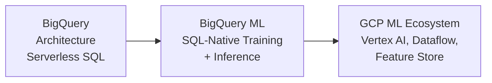

# 📡 Welcome to BigQuery for ML

BigQuery is Google Cloud's serverless, highly-scalable data warehouse with a built-in machine learning capability — BigQuery ML — that allows you to train and deploy models directly using SQL. For ML engineers working in GCP ecosystems, BigQuery is often the gateway between raw data and model training: it handles petabyte-scale analytics, feeds feature data into Vertex AI, and even hosts models for batch inference.

This course covers the architectural foundations of BigQuery as a data foundation for ML, the BigQuery ML paradigm of SQL-native training, and the broader GCP ML ecosystem (Vertex AI, Dataflow, Cloud Storage) that BigQuery integrates with.

---

## Course Index

1. [[01 - BigQuery Architecture|BigQuery Architecture and ML Data Pipelines]]
2. [[02 - BigQuery ML and GCP Ecosystem|BigQuery ML and the GCP ML Ecosystem]]

---

## Learning Path

---

## Why BigQuery Matters for ML Engineers

| Capability | Without BigQuery | With BigQuery |
|---|---|---|
| **Data Scale** | Export from warehouse, load into Python | Query directly in-place (serverless) |
| **SQL to ML** | Python-only model training | Train models in SQL (BigQuery ML) |
| **Feature Engineering** | ETL pipeline with Spark/Airflow | SQL transformations on cached results |
| **Inference** | Deploy separate model serving infra | Batch inference via SQL `ML.PREDICT` |
| **Cost Model** | Always-on clusters | Pay-per-query (no idle cost) |
| **GCP Integration** | Manual data movement | Native with Vertex AI, Dataflow, Cloud Storage |

---

## Prerequisites

- SQL fluency (BigQuery uses standard SQL with extensions)
- Understanding of data warehouse concepts
- Familiarity with GCP ecosystem is helpful but not required
- No coding examples in this conceptual course

---

## Objectives

By the end of this course you will:

1. Understand BigQuery's serverless architecture and how it achieves petabyte-scale queries.
2. Explain BigQuery ML's SQL-native training paradigm and when to use it.
3. Map the GCP ML ecosystem: BigQuery → Dataflow → Vertex AI → Model Registry.
4. Design ML data pipelines that leverage BigQuery as the analytical core.
5. Compare BigQuery ML to Spark MLlib and Python-based training approaches.

---

💡 **Tip:** BigQuery ML's "CREATE MODEL" statement can train a model on terabytes of data without moving it out of the warehouse — a paradigm shift from the traditional "extract → train → load back" pattern.

⚠️ **Warning:** This course is conceptual and architectural. For hands-on code, Google Cloud offers a BigQuery sandbox with free tier access at [console.cloud.google.com/bigquery](https://console.cloud.google.com/bigquery).
