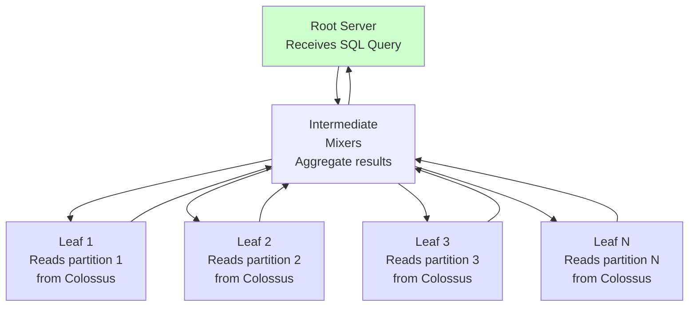

# 🏗️ BigQuery Architecture and ML Data Pipelines

## Introduction

BigQuery is not a database in the traditional sense — it is a serverless, distributed SQL query engine built on Google's internal Dremel technology, designed to scan terabytes in seconds without managing a single server. For ML engineers, BigQuery's architecture matters because it determines how fast feature queries run, how data is stored and partitioned, and how ML pipelines integrate with the rest of the GCP ecosystem.

Understanding BigQuery's architecture means understanding when to use it versus Spark, when to materialize feature tables versus query live, and how to design cost-efficient ML data pipelines that don't incur surprise bills at the end of the month.

---

## 1. 🧠 The Serverless Query Engine

BigQuery separates compute from storage — a fundamental architectural decision that enables its serverless model:

```
┌──────────────────────────────────────────────────────────────┐
│                    BIGQUERY ARCHITECTURE                      │
│                                                               │
│  ┌─────────────────────┐     ┌─────────────────────┐        │
│  │     Compute Layer    │     │     Storage Layer    │        │
│  │     (Dremel)         │     │     (Colossus)       │        │
│  │                      │     │                      │        │
│  │  • Serverless SQL    │     │  • Columnar storage  │        │
│  │  • Auto-scales to    │◀───▶│  • Capacitor format  │        │
│  │    thousands of slots│     │  • Automatic         │        │
│  │  • Pay per query     │     │    compression       │        │
│  │    (bytes scanned)   │     │  • Separated from    │        │
│  │  • No cluster mgmt  │     │    compute           │        │
│  └─────────────────────┘     └─────────────────────┘        │
│           │                            │                     │
│           ▼                            ▼                     │
│  ┌─────────────────────────────────────────────────────┐    │
│  │                  Colossus (Google's FS)              │    │
│  │  • Exabyte-scale distributed file system            │    │
│  │  • Data replicated across zones                     │    │
│  └─────────────────────────────────────────────────────┘    │
└──────────────────────────────────────────────────────────────┘
```

### Key Architectural Properties

| Property | What It Means | ML Impact |
|---|---|---|
| **Storage/Compute Separation** | Data lives in Colossus (storage), queries run on Dremel (compute) | No cluster to manage; query capacity scales independently of data size |
| **Columnar Storage (Capacitor)** | Data stored by column, not row | Feature queries that access 5 out of 500 columns read only those 5 columns |
| **Tree Architecture (Dremel)** | Queries execute as a tree of servers | A single query can use thousands of CPU cores for seconds |
| **Slots** | Unit of compute capacity (1 slot ≈ 1 CPU core) | Query speed is proportional to slots allocated |
| **Pay-per-query** | Charged by bytes scanned (on-demand pricing) | Cost is predictable: `SELECT 5 columns FROM 1TB table` ≈ $5 |
| **Flat-rate pricing** | Fixed monthly slot reservation | Predictable cost for production ML pipelines |

### Dremel's Execution Tree



A query like `SELECT user_id, AVG(amount) FROM transactions GROUP BY user_id` is:
1. Split among thousands of leaf nodes, each reading a partition
2. Partially aggregated at mixer nodes
3. Finally aggregated at the root and returned

This tree architecture is what allows scanning petabytes in seconds — the work is embarrassingly parallel across leaves.

---

## 2. 📊 BigQuery vs Spark for ML Workloads

| Dimension | BigQuery | Apache Spark |
|---|---|---|
| **Compute Model** | Serverless SQL engine (Dremel) | Distributed compute engine (JVM executors) |
| **Storage** | Colossus (Google's internal FS) | Any object store (S3, ADLS, GCS) via connectors |
| **Interface** | SQL-only (with ML extensions) | Python (PySpark), Scala, Java, R, SQL |
| **Cluster Management** | None (serverless) | YARN / K8s / Standalone cluster |
| **Scaling Model** | Auto-scaling slots (burst to thousands) | Fixed-size cluster (manual scaling) |
| **Cost Model** | $5/TB scanned (on-demand) | Infrastructure cost (always-on instances) |
| **ML Training** | BigQuery ML (SQL CREATE MODEL) | Spark MLlib (Python/Scala API) |
| **Streaming** | Streaming ingestion (Storage Write API) | Structured Streaming (micro-batch engine) |
| **Best For** | SQL analytics, BI, ad-hoc feature queries | Complex ETL, custom ML algorithms, streaming |
| **Vendor** | Google Cloud (proprietary engine) | Open source (Apache) |

### When to Use Each (ML Decision Matrix)

| Scenario | BigQuery | Spark |
|---|---|---|
| "What's the average transaction per user?" | ✅ Simple SQL | ⚠️ Overkill |
| "Feature engineering with window functions on 10TB" | ✅ SQL window functions | ✅ DataFrame window functions |
| "Custom gradient descent from scratch" | ❌ Not possible | ✅ RDD-level implementation |
| "Train XGBoost on 50GB" | ✅ `CREATE MODEL` (BQML XGBoost) | ✅ Spark MLlib or single-node |
| "Join 100 tables, clean, aggregate, train" | ✅ Single SQL pipeline | ✅ Pipeline API |
| "Process real-time Kafka stream" | ❌ Batch-oriented | ✅ Structured Streaming |
| "Ad-hoc query to check feature distribution" | ✅ 5-second query | ❌ Needs cluster startup |

### The Hybrid Pattern

The most common GCP architecture combines both:

```
BigQuery (SQL analytics + feature queries)
    │
    │ Export features via Storage API
    ▼
Spark on Dataproc (complex ETL + training)
    │
    │ Write predictions back
    ▼
BigQuery (serving predictions for BI/dashboards)
```

---

## 3. 🏛️ Data Organization for ML

### Datasets, Tables, and Partitions

```
┌──────────────────────────────────────────────────────────┐
│              BIGQUERY RESOURCE HIERARCHY                  │
│                                                          │
│  Project: ml-production-1234                             │
│  ├── Dataset: fraud_detection                            │
│  │   ├── Table: raw_transactions                         │
│  │   │   ├── Partition: date=2024-12-01                  │
│  │   │   ├── Partition: date=2024-12-02                  │
│  │   │   └── Partition: date=2024-12-03                  │
│  │   ├── Table: user_features                            │
│  │   │   └── Partition: feature_date=2024-12-03          │
│  │   └── Model: fraud_classifier                         │
│  │       └── Version 3 (Production)                      │
│  │                                                      │
│  └── Dataset: recommendation                             │
│      ├── Table: user_embeddings                          │
│      └── Table: item_catalog                             │
└──────────────────────────────────────────────────────────┘
```

### Partitioning Strategies for ML

| Strategy | Use Case | Benefit |
|---|---|---|
| **Date Partitioning** | Time-series features, daily training | Only scan recent data, not full history |
| **Integer Range Partitioning** | User ID bucketing | Query specific user cohorts efficiently |
| **Ingestion-Time Partitioning** | Streaming ingestion of events | Automatic partition management |
| **Clustering** | Sort within partitions | Accelerate `WHERE user_id = '...'` and `GROUP BY user_id` |

### Performance Tuning for Feature Queries

| Technique | What It Does | ML Benefit |
|---|---|---|
| **Partition Pruning** | Skips partitions outside query range | `WHERE date >= '2024-12-01'` scans only Dec partitions |
| **Cluster Filtering** | Scans only matching blocks within partition | `WHERE user_id = 'XYZ'` hits only 1 block, not the whole partition |
| **Materialized Views** | Pre-computed aggregations | `AVG(amount) GROUP BY user_id` served from cache |
| **BI Engine** | In-memory acceleration layer | Sub-second latency on repeated feature queries |
| **Slot Reservations** | Guaranteed compute capacity | Predictable performance for scheduled ML pipelines |

---

## 4. 🔄 ML Data Pipeline Patterns

### Pattern 1: BigQuery as Feature Store

BigQuery serves as the offline feature computation engine in a GCP ML pipeline:

```
┌──────────────────────────────────────────────────────────┐
│                   FEATURE PIPELINE                        │
│                                                          │
│  Raw Events (Cloud Storage / Pub/Sub)                    │
│       │                                                  │
│       ▼                                                  │
│  BigQuery (Feature SQL Transformations)                  │
│       │                                                  │
│       ├──▶ Materialized Feature Table                    │
│       │    (partitioned by date)                         │
│       │                                                  │
│       └──▶ Vertex AI Feature Store                       │
│            (online serving for real-time inference)      │
│                                                          │
│  Scheduled via: Cloud Composer (Airflow) / Dataform      │
└──────────────────────────────────────────────────────────┘
```

### Pattern 2: ELT (Extract, Load, Transform) for ML

```
Extract:
  Raw data lands in Cloud Storage (JSON, CSV, Parquet, Avro)
      │
Load:
  External tables or batch load into BigQuery staging tables
      │
Transform (in BigQuery):
  -- Clean raw data
  -- Join with dimension tables
  -- Engineer features with SQL window functions
  -- Write to partitioned feature table
      │
Train:
  -- BigQuery ML: CREATE MODEL on feature table, OR
  -- Vertex AI: Export features to GCS, train in Python, OR
  -- Dataflow: Stream features to ML serving endpoint
```

### Pattern 3: Incremental Feature Refresh

For daily retraining pipelines, only process new data:

```
-- Daily feature refresh: only process yesterday's data
INSERT INTO `ml_production.user_features`
SELECT
    user_id,
    -- Recompute features from only new data
    COUNT(*) AS event_count_1d,
    AVG(amount) AS avg_amount_1d,
    COUNT(DISTINCT DATE(timestamp)) AS active_days_7d
FROM `ml_production.raw_transactions`
WHERE DATE(timestamp) = CURRENT_DATE() - 1  -- Partition pruning!
GROUP BY user_id
```

The partition filter ensures only yesterday's data is scanned (~100GB vs scanning 10TB of history).

---

## 5. 🌍 Real-World BigQuery ML Deployments

| Company | Use Case | BigQuery Role |
|---|---|---|
| **Spotify** | User listening pattern analytics | Petabyte-scale feature extraction for recommendation |
| **Twitter** | Ad performance prediction | Daily batch features for ML training via BigQuery → Dataflow |
| **The Home Depot** | Inventory demand forecasting | BigQuery ML ARIMA models on 100M+ SKU-location pairs |
| **Vodafone** | Customer churn prediction | BigQuery as unified data lake, features fed to Vertex AI |
| **HSBC** | Anti-money laundering detection | BigQuery for transaction pattern analysis across global accounts |
| **Mercado Libre** | Product recommendation features | BigQuery SQL transforms for feature engineering |

---

## ⚠️ Considerations

- **BigQuery charges by bytes scanned:** A `SELECT *` on a 1TB table costs ~$5. Always use `SELECT column1, column2` (never `*`) and date filters for production pipelines.
- **BigQuery ML is limited to specific algorithms:** Linear/logistic regression, XGBoost, AutoML Tables, k-means, matrix factorization, time series (ARIMA+), and deep neural networks (DNN). For custom architectures (transformers, CNNs), use Vertex AI.
- **External data sources add latency:** Querying data from Cloud Storage (external tables) is slower than native BigQuery tables. For production ML, load data into native BigQuery storage.
- **BigQuery is not real-time:** BigQuery is optimized for batch analytics. While the Storage Write API enables sub-second ingestion, query latency is typically 1-5 seconds (not millisecond). For real-time inference, use Vertex AI endpoints with online feature stores.

---

## 💡 Tips

- **Use `EXPLAIN` to estimate query cost before running:** BigQuery shows estimated bytes processed before execution.
- **Set `maximum_bytes_billed` for cost control:** Prevents accidental `SELECT * FROM 10TB_table` queries from costing $50.
- **Partition by DATE and cluster by user_id:** The optimal schema for user-level ML features. Partitioning prunes dates; clustering accelerates per-user queries.
- **Use BigQuery's Storage Read API for high-throughput export to Spark/Dataflow:** It's the fastest way to export features to ML training frameworks without duplicating data.

---

## ✅ Knowledge Check

1. **What architectural decision enables BigQuery's serverless model?** — Separation of compute (Dremel) from storage (Colossus). Queries auto-scale slots independently of data size; you never manage servers.

2. **Why does columnar storage matter for ML feature queries?** — Feature queries typically access only a subset of columns. Columnar storage (Capacitor) reads only those columns, avoiding the cost of scanning entire rows.

3. **When would you use BigQuery vs Spark for feature engineering?** — BigQuery for SQL-centric transformations on well-structured data, ad-hoc queries, and when you want zero cluster management. Spark for complex ETL, custom Python transformations, streaming, and non-SQL algorithms.

4. **How does partition pruning reduce query cost in ML pipelines?** — A `WHERE date = CURRENT_DATE() - 1` filter on a date-partitioned table means BigQuery scans only yesterday's partition (~1/365th of the data), reducing both cost and query time proportionally.

---

## 🎯 Key Takeaways

- BigQuery is a serverless, columnar SQL engine built on Dremel — no cluster management, pay-per-query.
- Storage/compute separation means query capacity scales independently of data volume.
- Dremel's tree architecture parallelizes queries across thousands of leaf nodes for petabyte scans in seconds.
- Partition and cluster your ML feature tables by `date` and `user_id` for optimal cost and performance.
- BigQuery ML brings model training INTO the warehouse as SQL — a paradigm shift for SQL-first teams.
- BigQuery and Spark are complementary: BigQuery for SQL analytics at rest, Spark for complex ETL and streaming.

---

## References

- [BigQuery Technical Overview (Google Cloud)](https://cloud.google.com/bigquery/docs/introduction)
- [Dremel Paper (Google Research)](https://research.google/pubs/dremel-interactive-analysis-of-web-scale-datasets/)
- [BigQuery ML Documentation](https://cloud.google.com/bigquery/docs/bqml-introduction)
- [BigQuery Partitioning and Clustering](https://cloud.google.com/bigquery/docs/partitioned-tables)
- [GCP ML Pipeline Architecture Guide](https://cloud.google.com/architecture/ml-on-gcp)
