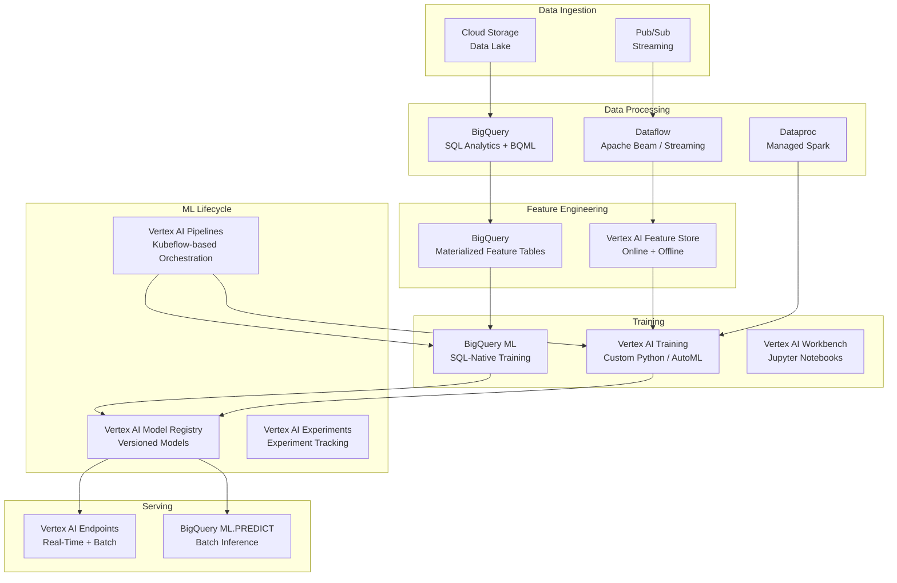

# 🔮 BigQuery ML and the GCP ML Ecosystem

## Introduction

BigQuery ML (BQML) represents a paradigm shift in machine learning: instead of exporting data from a warehouse into a Python environment for training, you train models IN the warehouse using SQL. For teams where SQL is the primary data language and PySpark/Python are secondary, BQML collapses the distance between data analysis and model training to a single `CREATE MODEL` statement.

But BigQuery ML doesn't exist in isolation — it is one component in Google Cloud's larger ML ecosystem: Vertex AI for advanced training and serving, Dataflow for streaming feature pipelines, Cloud Storage as the data lake, and the Vertex AI Feature Store for online serving. Understanding the full ecosystem is understanding when BQML is sufficient and when you need to graduate to Vertex AI.

---

## 1. 🧠 What BigQuery ML Is (and Is Not)

### What BQML Is

BigQuery ML extends SQL with ML primitives — training, evaluation, and prediction become SQL statements:

| SQL Statement | What It Does |
|---|---|
| `CREATE MODEL` | Trains a model directly on a BigQuery table/view |
| `ML.EVALUATE` | Computes model metrics (accuracy, precision, recall, ROC AUC) |
| `ML.PREDICT` | Runs batch inference on a table and returns predictions |
| `ML.FEATURE_INFO` | Returns feature statistics and importance |
| `ML.EXPLAIN_PREDICT` | Returns feature attributions for each prediction |
| `ML.TRAINING_INFO` | Returns loss per iteration during training |

### What BQML Is NOT

BigQuery ML is NOT:
- A replacement for Vertex AI custom training (Python/PyTorch/TensorFlow)
- A deep learning framework (limited neural network support)
- A real-time inference system (batch-oriented)
- A feature store (requires external Vertex AI Feature Store for online serving)

### BQML Decision Tree

```
Is your data already in BigQuery?
├── YES → Is your model type supported by BQML?
│   ├── YES (XGBoost, Linear/Logistic, k-means, ARIMA, AutoML, DNN)
│   │   ├── Do you need custom architectures?
│   │   │   ├── NO → Use BigQuery ML ✅
│   │   │   └── YES → Export to Vertex AI
│   │   └── Do you need real-time serving?
│   │       ├── NO → Use ML.PREDICT (batch in BigQuery) ✅
│   │       └── YES → Register model in Vertex AI Model Registry, deploy to endpoint
│   └── NO → Export data to GCS, train with Vertex AI custom training
└── NO → Ingest into BigQuery OR train directly with Vertex AI
```

---

## 2. 🔬 BigQuery ML Supported Algorithms

### Built-in Algorithm Portfolio

| Algorithm | Type | Best For |
|---|---|---|
| **Linear Regression** | Regression | Baseline, highly interpretable predictions |
| **Logistic Regression** | Classification (binary/multi-class) | Baseline classification, probability outputs |
| **XGBoost** | Classification + Regression | Highest accuracy on tabular data, feature importance |
| **Boosted Tree (AutoML Tables)** | Classification + Regression | AutoML: feature engineering + architecture search |
| **Deep Neural Network** | Classification + Regression | Non-linear patterns, large feature sets |
| **Wide & Deep** | Classification + Regression | Memorization (wide) + generalization (deep) |
| **k-Means** | Clustering | Customer segmentation, anomaly detection |
| **Matrix Factorization** | Recommendation | Collaborative filtering for user-item interactions |
| **PCA** | Dimensionality reduction | Feature compression, visualization |
| **Autoencoder** | Anomaly detection | Unsupervised anomaly detection |
| **ARIMA_PLUS** | Time-series forecasting | Demand forecasting, capacity planning |
| **AutoML Tables** | AutoML classification/regression | Automated feature engineering + model selection |

### Algorithm Selection by ML Task

```
┌──────────────────────────────────────────────────────┐
│              BQML ALGORITHM SELECTOR                  │
│                                                      │
│  Classification / Regression (Tabular)               │
│  ├── Baseline: Logistic/Linear Regression            │
│  ├── Best Accuracy: XGBoost                          │
│  ├── AutoML: AutoML Tables                           │
│  └── Complex Patterns: DNN / Wide & Deep             │
│                                                      │
│  Clustering                                          │
│  └── k-Means                                         │
│                                                      │
│  Recommendation                                      │
│  └── Matrix Factorization (implicit/explicit)        │
│                                                      │
│  Time Series Forecasting                             │
│  └── ARIMA_PLUS (auto-tuned seasonal decomposition)  │
│                                                      │
│  Anomaly Detection                                   │
│  ├── Autoencoder (unsupervised)                      │
│  └── k-Means (distance from centroid)                │
└──────────────────────────────────────────────────────┘
```

### BQML AutoML Tables — The "Try Everything" Approach

AutoML Tables automatically:
1. Analyzes column types and distributions
2. Engineers features (normalization, one-hot encoding, embedding of categoricals)
3. Searches architectures (linear, trees, neural networks)
4. Performs hyperparameter optimization
5. Trains ensemble of best models
6. Returns a single optimized model

This is the BQML equivalent of Databricks AutoML — ideal for baseline models and rapid prototyping.

---

## 3. 🔗 BigQuery ML + MLflow

BigQuery ML can integrate with MLflow for unified experiment tracking across platforms:

### The Integration Pattern

```mermaid
graph TB
    subgraph "GCP Environment"
        A[BigQuery<br/>CREATE MODEL...]
        B[BigQuery ML<br/>Model Trained]
    end

    subgraph "MLflow Tracking Server"
        C[MLflow Run:
           model: bqml_iris<br/>
           params: model_type, input_cols<br/>
           metrics: accuracy, roc_auc<br/>
           tags: bq_job_id, dataset, table]
    end

    subgraph "MLflow Model Registry"
        D[Registered Model<br/>iris_classifier<br/>Version 1 (Staging)]
    end

    A --> B
    B -->|Export metrics + metadata| C
    C --> D
```

BigQuery ML doesn't auto-log to MLflow (unlike Spark), but the integration is straightforward: log the BQML model metadata, metrics, and a reference to the BigQuery model object as an MLflow run. This gives you unified tracking across BigQuery-trained models and Spark/Python-trained models.

### What to Track from BQML in MLflow

| BQML Artifact | MLflow Equivalent |
|---|---|
| Model Type (`LINEAR_REG`, `XGBOOST`, etc.) | `mlflow.log_param("model_type", ...)` |
| Input Columns | `mlflow.log_param("input_cols", ...)` |
| Hyperparameters (L1/L2 reg, max depth, etc.) | `mlflow.log_params(...)` |
| `ML.EVALUATE` metrics (accuracy, ROC AUC, etc.) | `mlflow.log_metrics(...)` |
| `ML.TRAINING_INFO` (loss per iteration) | `mlflow.log_metric("final_loss", ...)` |
| BigQuery job ID | `mlflow.set_tag("bq_job_id", ...)` |
| Dataset + Table used for training | `mlflow.set_tag("bq_training_table", ...)` |
| Timestamp of training | `mlflow.set_tag("bq_training_time", ...)` |

---

## 4. 🌐 The GCP ML Ecosystem Map

BigQuery ML is one component. The full GCP ML ecosystem provides end-to-end coverage:



### Component Roles

| Component | Role | When to Use |
|---|---|---|
| **Cloud Storage** | Data lake (unstructured + structured) | Storing raw data, training artifacts |
| **Pub/Sub** | Streaming ingestion | Real-time event capture |
| **BigQuery** | SQL analytics, BQML training, batch inference | Feature engineering, baseline models, BI |
| **Dataflow** | Stream + batch ETL (Apache Beam) | Streaming feature pipelines |
| **Dataproc** | Managed Spark/Hadoop | Spark workloads (migrating from on-prem) |
| **Vertex AI Feature Store** | Online + offline feature serving | Eliminating training-serving skew |
| **Vertex AI Training** | Custom Python/PyTorch/TF training | Advanced models (LLMs, CV, custom arch) |
| **Vertex AI Pipelines** | ML pipeline orchestration (Kubeflow) | Reproducible, scheduled ML workflows |
| **Vertex AI Experiments** | Experiment tracking | Native GCP alternative to MLflow/W&B |
| **Vertex AI Model Registry** | Model versioning + staging | Governance across model lifecycle |
| **Vertex AI Endpoints** | Real-time + batch serving | Production inference with auto-scaling |

---

## 5. ⚖️ BQML vs Vertex AI: When to Upgrade

| Criterion | BigQuery ML | Vertex AI |
|---|---|---|
| **Setup** | SQL statement, no infra | Python training code + container |
| **Algorithms** | Tabular: linear, trees, DNN, AutoML, ARIMA | Any: PyTorch, TF, JAX, XGBoost, custom |
| **Data Size** | Petabyte-scale (in-place query) | As large as your GCS bucket |
| **Feature Engineering** | SQL window functions | Python + SQL (in Workbench) |
| **Training Speed** | Managed (auto-scaling slots) | Has GPU/TPU support |
| **HPO** | AutoML Tables (automated) | Vizier (Bayesian optimization) |
| **Serving Latency** | Seconds (batch via ML.PREDICT) | Milliseconds (Vertex AI Endpoints) |
| **Custom Metrics** | Limited (ML.EVALUATE built-in) | Any Python metric function |
| **Explainability** | ML.EXPLAIN_PREDICT (Shapley) | Vertex Explainable AI |
| **Cost Model** | Pay per query ($5/TB scan) | Pay per training hour + endpoint uptime |

### The Graduation Path

```
Stage 1: BigQuery ML for baselines
  └── "Can we solve this with SQL? Let's find out."

Stage 2: BigQuery ML with AutoML Tables for optimization
  └── "What's the best model BQML can produce automatically?"

Stage 3: Vertex AI for custom models
  └── "BQML's DNN isn't enough. We need transformers/CNNs/custom loss."

Stage 4: Vertex AI Pipelines for production automation
  └── "This needs to run weekly, with monitoring, alerting, and rollback."
```

---

## 6. 🏛️ GCP ML Architecture Patterns

### Pattern 1: BQML-First (SQL-Native)

```
BigQuery (Raw Data) → SQL Feature Engineering → CREATE MODEL
  → ML.EVALUATE → ML.PREDICT → Results back to BigQuery

Best for: SQL-native teams, tabular ML, batch inference, rapid prototyping
```

### Pattern 2: Vertex AI + BigQuery (Hybrid)

```
BigQuery (Feature Extraction) → Export to GCS → Vertex AI Training (PyTorch)
  → Vertex AI Model Registry → Vertex AI Endpoint (real-time)
  → Predictions logged back to BigQuery (monitoring)

Best for: Custom architectures, real-time inference, productionized MLOps
```

### Pattern 3: Streaming + BigQuery (Real-Time Features)

```
Pub/Sub → Dataflow (Streaming Feature Pipeline)
  → BigQuery (Offline Feature Store) + Vertex AI Feature Store (Online)
  → Vertex AI Endpoint (low-latency serving with online feature lookup)

Best for: Fraud detection, recommendation, real-time personalization
```

---

## 7. 🌍 BigQuery ML Success Stories

| Company | Use Case | BQML Algorithm | Scale |
|---|---|---|---|
| **Vodafone** | Customer churn prediction | XGBoost on 50M+ customers | Reduced churn prediction time from weeks to hours |
| **The Home Depot** | Inventory demand forecasting | ARIMA_PLUS on 100M+ SKU-location combos | Replaced 500-line Python scripts with `CREATE MODEL` |
| **HSBC** | Anti-money laundering | Logistic Regression on global transactions | SQL-based audit trail satisfies financial regulators |
| **OPTUM (UnitedHealth)** | Patient readmission prediction | AutoML Tables | Moved from SAS to BQML with no Python migration |
| **Mercado Libre** | Product category classification | DNN Classifier | SQL-based training enabled data analysts to build production models |
| **Carrefour** | Store-level sales forecasting | ARIMA_PLUS | Replaced Excel-based forecasting with automated pipeline |

---

## ⚠️ Considerations

- **BQML DNN has limited architecture control:** You specify hidden layers and activations, but can't define custom layers, attention mechanisms, or complex architectures. For those, use Vertex AI.
- **BigQuery ML models are stored in BigQuery, not as portable files:** You cannot download a BQML model as a `.pkl` and deploy it elsewhere. Models live in BigQuery. For portability, use Vertex AI.
- **ML.PREDICT costs scale with input data size:** Every row passed to `ML.PREDICT` incurs the query cost of processing that row. For batch inference on TB-scale data, this is non-trivial.
- **Limited framework integration:** BQML models cannot be directly exported to ONNX, TorchServe, or Triton. For multi-platform serving, train in Vertex AI.

---

## 💡 Tips

- **Use `ML.FEATURE_INFO` before training:** It shows feature statistics, null ratios, and correlations — catching data quality issues before spending compute on training.
- **Combine BQML with Vertex AI Pipelines:** Use Pipelines to orchestrate: BigQuery SQL → BQML training → MLflow tracking → Deployment decision.
- **Log all BQML training jobs to MLflow:** Even if you train in SQL, track metadata in MLflow for a unified experiment registry across BigQuery and Python.
- **Use AutoML Tables first, then hand-tune XGBoost:** AutoML establishes the "can't beat this" baseline. If you need more accuracy, hand-tune XGBoost hyperparameters.

---

## ✅ Knowledge Check

1. **What SQL statement trains a model in BigQuery ML?** — `CREATE MODEL`. It accepts the model type, hyperparameters, input columns, and label column — all as SQL syntax.

2. **When should you use BigQuery ML vs Vertex AI?** — BigQuery ML for SQL-native teams, tabular data, batch inference, and rapid prototyping. Vertex AI for custom architectures (CNNs, transformers), real-time serving, and production pipelines requiring Python-level control.

3. **How can BigQuery ML integrate with MLflow?** — Log BQML metadata (model type, hyperparameters, evaluation metrics, BigQuery job ID, training table reference) as an MLflow run. This gives unified experiment tracking alongside Spark/Python-trained models.

4. **What are the three main GCP ML architecture patterns?** — (1) BQML-first: all-SQL pipeline. (2) Vertex AI + BigQuery hybrid: BigQuery for features, Vertex AI for training/serving. (3) Streaming + BigQuery: Pub/Sub → Dataflow → BigQuery/Vertex AI Feature Store → real-time serving.

---

## 🎯 Key Takeaways

- BigQuery ML collapses the data-to-model gap: train models with SQL on data already in your warehouse.
- BQML supports XGBoost, AutoML Tables, DNN, ARIMA, k-means, and matrix factorization — enough for most tabular and forecasting use cases.
- Vertex AI is the graduation path for custom architectures, real-time serving, and production MLOps.
- The GCP ecosystem (BigQuery → Dataflow → Vertex AI → Endpoints) provides end-to-end coverage for ML pipelines.
- MLflow can unify tracking across BQML, Spark, and Vertex AI — use it even when training with SQL.

---

## References

- [BigQuery ML Documentation](https://cloud.google.com/bigquery/docs/bqml-introduction)
- [Vertex AI Documentation](https://cloud.google.com/vertex-ai/docs)
- [GCP ML Architecture Center](https://cloud.google.com/architecture/ml-on-gcp)
- [Vertex AI Feature Store](https://cloud.google.com/vertex-ai/docs/featurestore)
- [Dataflow (Apache Beam)](https://cloud.google.com/dataflow/docs)
