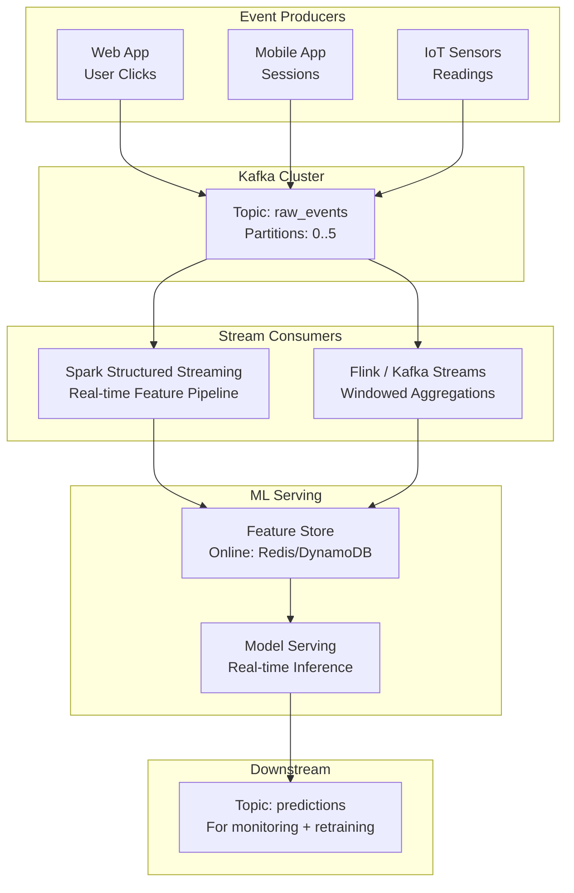

# 📨 Apache Kafka for ML Event Streaming

## Introduction

Apache Kafka is the central nervous system of real-time ML. Every click, purchase, sensor reading, and API call that feeds into production ML models passes through Kafka at some point. It is not a database or a message queue — it is a distributed, fault-tolerant, append-only log designed for high-throughput event streaming at internet scale.

For ML engineers, Kafka is the bridge between raw events and real-time features. It decouples event producers (your application) from event consumers (your feature pipeline, model training job, inference endpoint), enabling architectures where features are computed seconds after events occur — not hours later in a batch ETL.

---

## 1. 🧠 Kafka's Architecture: The Distributed Log

Kafka organizes data as an **append-only log** partitioned across brokers:

```
┌──────────────────────────────────────────────────────────────┐
│                     KAFKA CLUSTER                             │
│                                                              │
│  Broker 1                 Broker 2                 Broker 3  │
│  ┌─────────────────┐     ┌─────────────────┐    ┌─────────┐ │
│  │ Topic: clicks   │     │ Topic: clicks   │    │ Topic:  │ │
│  │ Partition 0     │     │ Partition 1     │    │ clicks  │ │
│  │ [0,1,2,3,4,5]  │     │ [0,1,2,3,4]    │    │ Part. 2 │ │
│  └─────────────────┘     └─────────────────┘    └─────────┘ │
│                                      │                       │
│  Producer ─────▶ sends to partition by key                   │
│  Consumer ◀──── reads from offset in partition               │
│                                                              │
│  Consumer Group: 3 consumers sharing 3 partitions            │
│  → Each consumer handles exactly one partition               │
│  → Add more consumers than partitions → extra idle           │
└──────────────────────────────────────────────────────────────┘
```

### Core Concepts

| Concept | Definition | ML Analogy |
|---|---|---|
| **Topic** | Named stream of records (like a table in a DB) | "user_clicks", "model_predictions" |
| **Partition** | Ordered, immutable sequence within a topic | Shard enabling parallel processing |
| **Offset** | Unique sequential ID per partition | Cursor position for consumers |
| **Producer** | App that writes records to a topic | Your web app sending click events |
| **Consumer** | App that reads records from a topic | Feature pipeline reading events |
| **Consumer Group** | Set of consumers cooperating to read a topic | Parallel feature workers across cluster |
| **Broker** | Kafka server that stores and serves records | Node in the Kafka cluster |
| **Retention** | How long records are kept (time or size) | Determines replay window for features |

---

## 2. ⚡ Kafka's Superpowers for ML

### Exactly-Once Semantics

Kafka can guarantee that each event is processed exactly once — critical for ML features where double-counting or missed events corrupt downstream models:

```
┌──────────────────────────────────────────────────────────────┐
│              EXACTLY-ONCE GUARANTEE CHAIN                     │
│                                                              │
│  Producer: idempotent writes (enable.idempotence=true)       │
│       │                                                      │
│       ▼                                                      │
│  Kafka Broker: dedup via producer ID + sequence number       │
│       │                                                      │
│       ▼                                                      │
│  Consumer: transactional reads + offset commit in same txn   │
│       │                                                      │
│       ▼                                                      │
│  Result: Each event processed exactly once, end-to-end       │
└──────────────────────────────────────────────────────────────┘
```

### Replayability

Unlike traditional message queues where messages are deleted after consumption, Kafka retains records for a configurable retention period. This enables:

- **Backfill features from historical events** — replay the last 30 days of clicks to compute user features from scratch
- **Audit ML predictions** — replay model predictions to investigate when a model started degrading
- **Reproduce training runs** — replay the exact sequence of events that produced a specific training dataset

### Consumer Group Scaling

ML feature pipelines scale linearly with partitions:

```
Topic: user_events (6 partitions)
Consumer Group: feature-pipeline

With 3 consumers:  Each consumer handles 2 partitions → 3x throughput
With 6 consumers:  Each consumer handles 1 partition → 6x throughput (linear!)
With 12 consumers: 6 active (one per partition), 6 idle → no more scaling

Rule: Number of consumers ≤ Number of partitions
```

### Time-Based and Compaction-Based Retention

| Retention Strategy | Behavior | ML Use Case |
|---|---|---|
| **Time-based** | Keep records for N days | "Keep last 30 days of click events for feature computation" |
| **Size-based** | Keep records up to N GB | "Keep as many events as fit in 1TB" |
| **Compaction** | Keep only latest value per key | "Keep latest user profile per user_id" |

---

## 3. 🔄 The Kafka + ML Architecture



---

## 4. 💻 Kafka Producer and Consumer Patterns for ML

### Pattern 1: Event Schema Registry (Avro)

ML features depend on consistent event schemas. Schema Registry enforces compatibility:

```python
from confluent_kafka import Producer
from confluent_kafka.schema_registry import SchemaRegistryClient
from confluent_kafka.schema_registry.avro import AvroSerializer

# Schema Registry enforces schema compatibility
schema_registry = SchemaRegistryClient({"url": "http://schema-registry:8081"})

# Avro schema for ML events
schema_str = """
{
    "type": "record",
    "name": "UserEvent",
    "fields": [
        {"name": "user_id", "type": "string"},
        {"name": "event_type", "type": "string"},
        {"name": "amount", "type": ["null", "double"], "default": null},
        {"name": "timestamp", "type": "long"}
    ]
}
"""

serializer = AvroSerializer(schema_registry, schema_str)

producer = Producer({"bootstrap.servers": "kafka:9092"})

# Produce event with schema-enforced serialization
event = {
    "user_id": "user_123",
    "event_type": "purchase",
    "amount": 49.99,
    "timestamp": int(time.time() * 1000)
}
producer.produce(
    topic="user_events",
    value=serializer(event, None),
    key=event["user_id"].encode()  # Partition by user_id
)
producer.flush()
```

### Pattern 2: Consumer for Feature Computation

```python
from confluent_kafka import Consumer
import json

consumer = Consumer({
    "bootstrap.servers": "kafka:9092",
    "group.id": "feature-pipeline",
    "auto.offset.reset": "earliest",  # Start from beginning if no offset
    "enable.auto.commit": False,      # Manual commit for exactly-once
})

consumer.subscribe(["user_events"])

# Real-time feature buffer (per user)
features = defaultdict(lambda: {"count": 0, "sum_amount": 0.0})

while True:
    msg = consumer.poll(timeout=1.0)
    if msg is None:
        continue

    event = json.loads(msg.value())
    user_id = event["user_id"]

    # Update running features
    features[user_id]["count"] += 1
    features[user_id]["sum_amount"] += event.get("amount", 0)

    # Commit offset after processing (exactly-once)
    consumer.commit(message=msg)

    # Flush features to online store every 10 seconds
    if time.time() % 10 < 1:
        flush_features_to_redis(features)
```

---

## 5. 🔗 Kafka + ML Ecosystem Integration

| Integration | Pattern | Use Case |
|---|---|---|
| **Kafka → Spark Structured Streaming** | Spark reads Kafka as streaming DataFrame | Distributed feature engineering on TB-scale streams |
| **Kafka → Flink** | Flink reads Kafka with exactly-once state | Sub-second windowed feature aggregation |
| **Kafka → MLflow** | Log Kafka consumer group offset as MLflow tag | Reproduce training dataset by replaying from exact offset |
| **Kafka → Feature Store** | Materialize streaming features to online/offline stores | Real-time features for model serving |
| **Kafka → Model Serving** | Inference endpoint consumes Kafka for async scoring | Low-latency async inference pipeline |

---

## 6. 🌍 Production Kafka ML Deployments

| Company | Scale | Kafka Usage |
|---|---|---|
| **Netflix** | 1 trillion+ events/day | Keystone pipeline for recommendation features |
| **Uber** | 100M+ rides/day | Real-time surge pricing features via Kafka → Flink |
| **LinkedIn** | 7 trillion+ messages/day | Feed ranking features (Kafka was created here) |
| **Shopify** | Millions of merchants | Fraud detection events → Kafka → real-time inference |
| **Tesla** | Petabytes of sensor data | Vehicle telemetry → Kafka → feature pipeline |

---

## ⚠️ Pitfalls

- **Key selection determines partition locality:** Events with the same key (e.g., `user_id`) always go to the same partition. This enables per-user in-order processing but creates hot partitions if some users generate disproportionate traffic.
- **Offset management failures cause data loss/replay:** Auto-committing offsets before processing = data loss on crash. Committing after processing = at-least-once (duplicates possible). Use transactions for exactly-once.
- **Consumer rebalancing pauses processing:** When consumers join/leave a group, Kafka pauses all consumers and reassigns partitions. This causes latency spikes — keep consumer groups stable in production.

---

## 💡 Tips

- **Monitor consumer lag:** `kafka-consumer-groups --describe --group <group>` shows how far behind consumers are. Lag > 10K messages = you need more partitions or consumers.
- **Use Schema Registry from day 1:** Schema evolution breaks ML pipelines silently. Schema Registry catches incompatibility at PRODUCE time, not at CONSUME time after corrupting your feature store.
- **Tiered storage for long retention:** Kafka 3.6+ supports tiered storage to S3, enabling infinite retention for ML audit trails without expensive local disk.

---

## 📦 Compression Code

```python
from confluent_kafka import Producer, Consumer
import json, time
from collections import defaultdict

# Producer
producer = Producer({"bootstrap.servers": "localhost:9092"})
for i in range(1000):
    producer.produce(
        "ml_events",
        key=f"user_{i%10}".encode(),
        value=json.dumps({"user_id": f"user_{i%10}", "event": "click", "ts": time.time()}).encode()
    )
producer.flush()

# Consumer
consumer = Consumer({
    "bootstrap.servers": "localhost:9092",
    "group.id": "ml_features",
    "auto.offset.reset": "earliest"
})
consumer.subscribe(["ml_events"])
while True:
    msg = consumer.poll(1.0)
    if msg:
        print(f"Processed: {msg.key().decode()} -> {msg.value().decode()}")
```

---

## References

- [Apache Kafka Documentation](https://kafka.apache.org/documentation/)
- [Confluent Schema Registry](https://docs.confluent.io/platform/current/schema-registry/index.html)
- [Kafka + Spark Structured Streaming](https://spark.apache.org/docs/latest/structured-streaming-kafka-integration.html)
