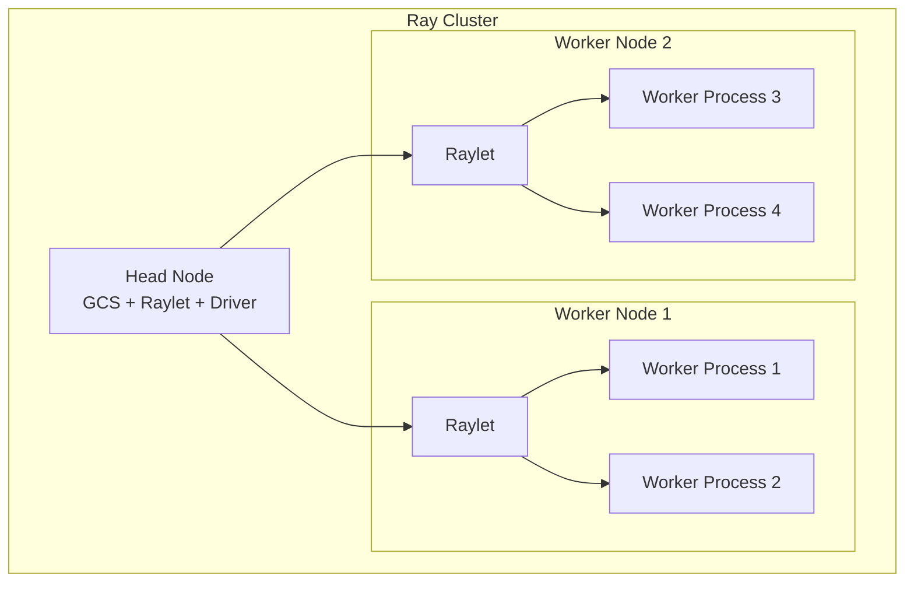

# ⚡ Ray: Distributed Compute and Model Serving

## Introduction

Ray is the runtime that makes Python scale beyond a single machine. While Spark requires you to learn a specific DataFrame API and SQL dialect, Ray extends standard Python — you can distribute any Python function, class, or model without rewriting your code for a different paradigm. This makes Ray the natural bridge between prototyping on a laptop and deploying on a cluster.

Ray Serve extends Ray's distributed runtime into a production model serving framework with native support for model composition, traffic splitting, and GPU autoscaling. Together, Ray Core and Ray Serve cover the spectrum from distributed training to production inference — all in Python, all open source.

---

## 1. 🧠 Ray Core: Distributed Python

### The Ray Actor Model

Ray extends Python with three primitives:

| Primitive | What It Does | When to Use |
|---|---|---|
| **`@ray.remote` (function)** | Run a function on any node in the cluster asynchronously | Parallel data processing, distributed HPO |
| **`@ray.remote` (class)** | Create stateful actors that live on remote nodes | Parameter servers, model replicas, simulators |
| **`ray.put()` / `ray.get()`** | Store object in distributed object store / retrieve it | Pass data between tasks without copying |

### Architecture



### Ray vs Spark: When to Use Each

| Criterion | Ray | Spark |
|---|---|---|
| **Paradigm** | Python-native (functions + classes) | Declarative (SQL + DataFrame) |
| **State** | First-class (Actors with mutable state) | Limited (Accumulators, broadcast variables) |
| **Custom algorithms** | Easy (distribute any Python) | Hard (must express as SQL/DataFrame or UDF) |
| **Deep learning** | Native (Ray Train + PyTorch/TF) | Not designed for it |
| **Low latency** | Sub-millisecond task scheduling | Batch-oriented, second-level |
| **Ecosystem** | Modin (pandas), Dask-on-Ray, XGBoost-Ray | Spark SQL, MLlib, Structured Streaming |
| **Learning curve** | Gentle (Python decorators) | Steep (Spark concepts + JVM ecosystem) |

---

## 2. 💻 Ray Core Patterns for ML

### Pattern 1: Distributed Hyperparameter Optimization

```python
import ray
from ray import tune
from ray.tune.search.hyperopt import HyperOptSearch

# Define training function
def train_model(config):
    model = create_model(config)
    for epoch in range(config["epochs"]):
        loss = train_epoch(model)
        tune.report(loss=loss)  # Report metrics to Ray Tune

# Distributed HPO across cluster
analysis = tune.run(
    train_model,
    config={
        "lr": tune.loguniform(1e-5, 1e-1),
        "batch_size": tune.choice([16, 32, 64, 128]),
        "dropout": tune.uniform(0.1, 0.5),
        "epochs": 10
    },
    num_samples=100,           # Try 100 hyperparameter combos
    resources_per_trial={"cpu": 2, "gpu": 0.5},  # 0.5 GPU per trial
    search_alg=HyperOptSearch(),  # Bayesian optimization
    scheduler="ASHAScheduler"     # Early termination of poor trials
)

print("Best config:", analysis.best_config)
print("Best loss:", analysis.best_result["loss"])
```

### Pattern 2: Parallel Batch Inference

```python
import ray
import numpy as np

# Load model as Ray actor (one replica per GPU)
@ray.remote(num_gpus=0.5)
class ModelReplica:
    def __init__(self, model_path):
        self.model = load_model(model_path)

    def predict(self, batch):
        return self.model.predict(batch)

# Create replicas
num_replicas = 4
replicas = [ModelReplica.remote("s3://models/prod_model/")
            for _ in range(num_replicas)]

# Distribute inference across replicas
data = load_batch_inference_data()  # 100K samples
batch_size = 256
batches = [data[i:i+batch_size] for i in range(0, len(data), batch_size)]

# Round-robin distribution across replicas
futures = [replicas[i % num_replicas].predict.remote(batch)
           for i, batch in enumerate(batches)]

# Collect results
predictions = ray.get(futures)
```

### Pattern 3: Ray Train for Distributed Deep Learning

```python
import ray.train.torch
from ray.train import ScalingConfig

# PyTorch training distributed via Ray
def train_fn(config):
    model = MyModel()
    model = ray.train.torch.prepare_model(model)
    train_loader = create_dataloader()
    train_loader = ray.train.torch.prepare_data_loader(train_loader)

    optimizer = torch.optim.Adam(model.parameters(), lr=config["lr"])

    for epoch in range(config["epochs"]):
        for batch in train_loader:
            loss = model(batch)
            optimizer.zero_grad()
            loss.backward()
            optimizer.step()
        ray.train.report({"loss": loss.item(), "epoch": epoch})

# Launch distributed training
trainer = ray.train.torch.TorchTrainer(
    train_fn,
    scaling_config=ScalingConfig(
        num_workers=4,       # 4 GPUs
        use_gpu=True
    )
)
trainer.fit()
```

---

## 3. 🚀 Ray Serve: Production Model Serving

Ray Serve provides production-grade model serving with three killer features:

### Feature 1: Model Composition

Compose multiple models into a single API endpoint:

```python
from ray import serve
from starlette.requests import Request
import requests

@serve.deployment
class Preprocessor:
    async def __call__(self, request: Request):
        data = await request.json()
        return preprocess(data["text"])

@serve.deployment
class SentimentModel:
    def __init__(self):
        self.model = load_model("sentiment_classifier")

    async def __call__(self, features):
        return self.model.predict(features).tolist()

@serve.deployment
class FraudClassifier:
    def __init__(self):
        self.model = load_model("fraud_detector")

    async def __call__(self, features):
        return self.model.predict(features).tolist()

@serve.deployment
@serve.ingress(app)
class ModelGateway:
    def __init__(self, preprocessor_handle, sentiment_handle, fraud_handle):
        self.preprocessor = preprocessor_handle
        self.sentiment = sentiment_handle
        self.fraud = fraud_handle

    @app.post("/predict")
    async def predict(self, request: Request):
        features = await self.preprocessor.remote(request)

        # Call both models in parallel
        sentiment_result = self.sentiment.remote(features)
        fraud_result = self.fraud.remote(features)

        sentiment, fraud = await asyncio.gather(sentiment_result, fraud_result)

        return {"sentiment": sentiment, "fraud_risk": fraud}

# Deploy
preprocessor = Preprocessor.bind()
sentiment_model = SentimentModel.bind()
fraud_model = FraudClassifier.bind()
gateway = ModelGateway.bind(preprocessor, sentiment_model, fraud_model)
```

### Feature 2: Traffic Splitting and Canary Deployments

Ray Serve supports canary deployments natively:

```python
# Old model (90% traffic)
serve.run(
    ModelV2.bind(),
    name="fraud_detector",
    route_prefix="/fraud"
)

# New model (10% traffic — canary)
serve.run(
    ModelV3.bind(),
    name="fraud_detector_v3",
    route_prefix="/fraud"
)

# Traffic split configuration via Serve config YAML
```

### Feature 3: Autoscaling

Ray Serve autoscales replicas based on QPS or CPU utilization:

```yaml
# serve_config.yaml
applications:
  - name: fraud_detector
    route_prefix: /fraud
    import_path: fraud_model:app
    deployments:
      - name: FraudModel
        num_replicas: auto
        autoscaling_config:
          min_replicas: 1
          max_replicas: 10
          target_num_ongoing_requests_per_replica: 5
          cooldown_s: 60
```

---

## 4. 🔗 Ray + ML Ecosystem

| Integration | Pattern | Benefit |
|---|---|---|
| **Ray + MLflow** | Track Ray Tune experiments in MLflow | Unified experiment tracking across Ray HPO and Spark training |
| **Ray + Spark** | Ray on Spark (run Ray tasks alongside Spark jobs) | Use Spark for ETL, Ray for ML training on the same cluster |
| **Ray + Delta Lake** | Ray Datasets reads Delta tables directly | Skip Spark — use Ray for both data loading and training |
| **Ray + Kafka** | Ray Serve deployments consume from Kafka topics | Streaming inference pipeline in pure Python |

---

## 5. 🌍 Ray Production Deployments

| Company | Use Case | Ray Component |
|---|---|---|
| **OpenAI** | Distributed RL training for GPT | Ray Core + Ray Train |
| **Amazon** | Search ranking model serving | Ray Serve for multi-model composition |
| **Ant Group** | Real-time fraud detection | Ray Serve + Kafka integration |
| **Instacart** | Delivery time prediction | Ray Tune for HPO + Ray Serve for inference |
| **Hugging Face** | Distributed model evaluation | Ray for parallel inference across models |

---

## ⚠️ Pitfalls

- **Actor state loss on restart:** Ray actors are not persistent by default. If a node dies, actor state is lost. Use Ray's fault tolerance API for critical stateful actors.
- **Object store memory pressure:** `ray.put()` stores objects in shared memory. Large objects (>100MB per task) can fill the object store and cause OOM on other nodes.
- **Ray vs Spark for data processing:** Ray's DataFrame API (Ray Datasets) is newer than Spark's. For production ETL on petabyte-scale data, Spark remains more mature.

---

## 💡 Tips

- **Use `ray.data` for ML data loading:** Ray Datasets provides lazy, distributed loading of Parquet/Delta files — similar to Spark DataFrames but with zero-copy to PyTorch tensors.
- **Ray Tune + MLflow:** Pass `mlflow` as the reporter in Ray Tune to auto-log every trial to MLflow.
- **Start with Ray on a single node:** Ray's API is identical on one node or 1000 — prototype locally, scale without code changes.

---

## 📦 Compression Code

```python
import ray
from ray import serve
from ray.serve.drivers import DAGDriver

ray.init()

@serve.deployment
class MyModel:
    def __init__(self):
        self.model = lambda x: x * 2  # Placeholder

    async def __call__(self, request):
        data = await request.json()
        return {"result": self.model(data["value"])}

serve.run(MyModel.bind())
```

---

## References

- [Ray Documentation](https://docs.ray.io/)
- [Ray Serve Guide](https://docs.ray.io/en/latest/serve/index.html)
- [Ray Train for PyTorch](https://docs.ray.io/en/latest/train/torch.html)
- [Ray + MLflow Integration](https://docs.ray.io/en/latest/tune/examples/tune-mlflow.html)
