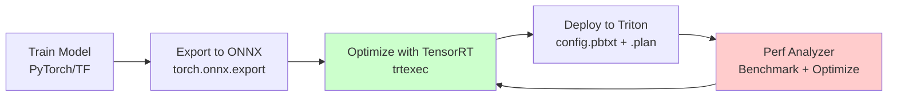

# 🎯 NVIDIA Triton Inference Server

## Introduction

NVIDIA Triton Inference Server is the industry standard for GPU-optimized model serving. While Ray Serve and BentoML provide general-purpose serving, Triton is purpose-built for maximizing GPU utilization: it supports every major framework (PyTorch, TensorFlow, ONNX, TensorRT, XGBoost, Python), dynamically batches requests to saturate the GPU, and handles multi-model ensembles natively.

For ML engineers, Triton is not an alternative to model serving frameworks — it is the backend that those frameworks often delegate to when GPU throughput matters. Understanding Triton is understanding how to serve models at the latency and throughput requirements of production systems.

---

## 1. 🏛️ Triton Architecture

```
┌──────────────────────────────────────────────────────────────┐
│                    TRITON INFERENCE SERVER                     │
│                                                              │
│  ┌──────────────────────────────────────────────────────┐   │
│  │                   Model Repository                     │   │
│  │  /models/                                             │   │
│  │  ├── sentiment_model/                                 │   │
│  │  │   ├── config.pbtxt                                 │   │
│  │  │   └── 1/model.savedmodel                           │   │
│  │  ├── fraud_model/                                     │   │
│  │  │   ├── config.pbtxt                                 │   │
│  │  │   └── 1/model.plan                                 │   │
│  │  └── ensemble_model/                                  │   │
│  │      ├── config.pbtxt                                 │   │
│  │      └── 1/ (empty — ensemble is composition)         │   │
│  └──────────────────────────────────────────────────────┘   │
│                                                              │
│  ┌──────────────────────────────────────────────────────┐   │
│  │              Inference Backend                        │   │
│  │  ┌───────────┐ ┌───────────┐ ┌───────────┐          │   │
│  │  │ TensorRT  │ │ ONNX RT   │ │ PyTorch   │  ...     │   │
│  │  │ Backend   │ │ Backend   │ │ Backend   │          │   │
│  │  └───────────┘ └───────────┘ └───────────┘          │   │
│  └──────────────────────────────────────────────────────┘   │
│                                                              │
│  ┌──────────────────────────────────────────────────────┐   │
│  │              Scheduling & Batching                    │   │
│  │  • Dynamic Batching (combine requests automatically) │   │
│  │  • Sequence Batching (stateful for RNN/LLM)          │   │
│  │  • Priority-based scheduling                         │   │
│  │  • Rate limiting per model                           │   │
│  └──────────────────────────────────────────────────────┘   │
│                                                              │
│  ┌──────────────────────────────────────────────────────┐   │
│  │              Clients                                  │   │
│  │  HTTP/REST  |  gRPC  |  C API  |  Python  |  Java   │   │
│  └──────────────────────────────────────────────────────┘   │
└──────────────────────────────────────────────────────────────┘
```

---

## 2. ⚡ Triton's Killer Features

### Dynamic Batching

Triton accumulates individual inference requests into batches dynamically — without the client needing to batch:

```
┌──────────────────────────────────────────────────────────────┐
│                  DYNAMIC BATCHING                             │
│                                                              │
│  Client 1 ──▶ Req A ──┐                                     │
│  Client 2 ──▶ Req B ──┼── Combined Batch [A,B,C,D] ──▶ GPU  │
│  Client 3 ──▶ Req C ──┤                                     │
│  Client 4 ──▶ Req D ──┘                                     │
│                                                              │
│  Result: 4x throughput with zero client-side batching code   │
│  Latency: Max of individual request latencies (not sum)      │
└──────────────────────────────────────────────────────────────┘
```

**Configuration:**

```protobuf
# config.pbtxt
dynamic_batching {
  preferred_batch_size: [ 4, 8, 16, 32 ]  # Try to form batches of these sizes
  max_queue_delay_microseconds: 100        # Max wait time before processing
}
```

| Parameter | Effect |
|---|---|
| **preferred_batch_size** | Triton accumulates requests until one of these batch sizes is reached |
| **max_queue_delay** | If batch isn't full after this time, process immediately (prevents latency spikes) |
| **preserve_ordering** | Maintain FIFO order (slower throughput, needed for streaming) |

### Model Ensembles

Triton can chain multiple models into a single pipeline — no custom orchestration code needed:

```
┌──────────────────────────────────────────────────────────────┐
│              MODEL ENSEMBLE: NLP Pipeline                     │
│                                                              │
│  Client Request {text: "I love this product!"}              │
│       │                                                      │
│       ▼                                                      │
│  ┌─────────────┐                                             │
│  │ Preprocess  │  Tokenize text → input_ids                  │
│  │ (Python)    │                                             │
│  └──────┬──────┘                                             │
│         │ input_ids                                          │
│         ▼                                                    │
│  ┌─────────────┐                                             │
│  │ BERT Model  │  Forward pass → logits                      │
│  │ (TensorRT)  │                                             │
│  └──────┬──────┘                                             │
│         │ logits                                             │
│         ▼                                                    │
│  ┌─────────────┐                                             │
│  │ Postprocess │  Softmax → {"positive": 0.94, "negative": 0.06} │
│  │ (Python)    │                                             │
│  └─────────────┘                                             │
│       │                                                      │
│       ▼                                                      │
│  Client Response                                              │
└──────────────────────────────────────────────────────────────┘
```

The entire pipeline runs on GPU with zero data transfer back to CPU between stages — Triton manages intermediate tensors in GPU memory.

### Concurrent Model Execution

Triton runs multiple models on the same GPU simultaneously:

```protobuf
instance_group [
  {
    count: 2       # 2 instances of Model A
    kind: KIND_GPU
    gpus: [ 0 ]
  }
]
```

This enables GPU sharing — a classification model and an object detection model can share the same GPU, each getting a fraction of its compute and memory.

### Framework Support

| Backend | Best For | Performance |
|---|---|---|
| **TensorRT** | NVIDIA-optimized inference | 2-5x faster than PyTorch native |
| **ONNX Runtime** | Cross-framework portability | 1.5-2x faster than PyTorch |
| **PyTorch** | Easiest deployment (no conversion) | Native PyTorch speed |
| **TensorFlow** | TF SavedModel deployment | Native TF speed |
| **Python** | Custom preprocessing/postprocessing | Overhead of Python interpreter |
| **OpenVINO** | Intel CPU inference | Optimized for Intel hardware |
| **FasterTransformer** | LLM-specific optimization | Transformer kernel optimization |
| **vLLM** | LLM serving with PagedAttention | 10x+ throughput for LLMs |

---

## 3. 🔄 Triton Model Optimization Pipeline



### Optimization Pipeline Steps

1. **Train** in PyTorch/TensorFlow as normal
2. **Export** to ONNX: `torch.onnx.export(model, dummy_input, "model.onnx")`
3. **Optimize** with TensorRT: `trtexec --onnx=model.onnx --saveEngine=model.plan --fp16`
4. **Deploy** to Triton with model config
5. **Benchmark** with `perf_analyzer`: find optimal batch size, concurrency
6. **Iterate** — adjust model config, rebuild TensorRT engine

---

## 4. 📊 Triton Performance Concepts

### Latency vs Throughput Trade-off

| Optimization | Latency Effect | Throughput Effect |
|---|---|---|
| **Increase batch size** | Increases (wait for more requests) | Increases (more work per GPU invocation) |
| **Decrease max_queue_delay** | Decreases | Decreases |
| **Add model instances** | Decreases (more parallel workers) | Increases |
| **Use TensorRT (FP16)** | Decreases (~2x) | Increases (~2x) |
| **Use TensorRT (INT8)** | Decreases (~3x) | Increases (~3x) |

### Key Metrics

| Metric | What It Tells You |
|---|---|
| **GPU Utilization** | Is the GPU actually busy? <80% = underutilized |
| **Queue time vs Compute time** | Queue > compute = increase batch size or instances |
| **Request latency p50/p95/p99** | Tail latency determines user experience |
| **Inferences per second (IPS)** | Raw throughput measure |

---

## 5. 🌍 Triton Production Deployments

| Company | Use Case | Triton Configuration |
|---|---|---|
| **NVIDIA** | Riva speech AI serving | Triton + TensorRT for sub-10ms ASR |
| **Microsoft** | Bing visual search | Triton ensemble for multi-model vision pipeline |
| **Siemens** | Industrial defect detection | Triton on edge (Jetson) for factory floor |
| **Adobe** | Creative asset tagging | Triton + ONNX for cross-platform serving |
| **Uber** | DeepETA model serving | Triton ensemble for multi-model composition |

---

## ⚠️ Pitfalls

- **First inference is slow:** TensorRT engines optimize on first run (CUDA kernel selection, memory allocation). Use `model_warmup` in config to pre-warm models on startup.
- **Python backend has overhead:** Python models in Triton incur the GIL and interpreter overhead. Use TensorRT/ONNX backends for latency-critical paths, Python only for preprocessing/postprocessing.
- **GPU memory fragmentation:** Loading/unloading large models can fragment GPU memory. Limit concurrent model loads and use `--model-control-mode=explicit` in production.

---

## 💡 Tips

- **Use `perf_analyzer` before production:** `perf_analyzer -m model_name --concurrency-range 1:32:4` finds the optimal concurrency level for your hardware.
- **Separate preprocessing into a Python model in the ensemble:** Keep the main model in TensorRT — use a small Python model for tokenization/normalization. Triton passes tensors between ensemble members on GPU.
- **Monitor GPU memory per model:** Triton exposes Prometheus metrics for per-model GPU memory, queue depth, and request latency.

---

## References

- [NVIDIA Triton Documentation](https://docs.nvidia.com/deeplearning/triton-inference-server/user-guide/docs/)
- [Triton Model Configuration](https://docs.nvidia.com/deeplearning/triton-inference-server/user-guide/docs/user_guide/model_configuration.html)
- [Triton Performance Analyzer](https://docs.nvidia.com/deeplearning/triton-inference-server/user-guide/docs/perf_analyzer/docs/README.html)
- [TensorRT Optimization Guide](https://docs.nvidia.com/deeplearning/tensorrt/developer-guide/index.html)
