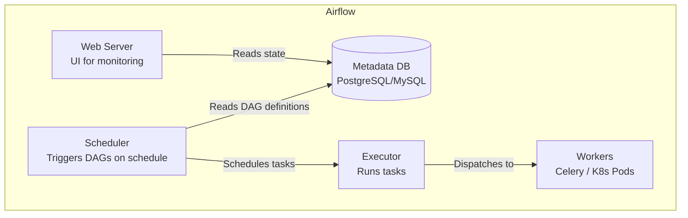

# 🔄 Workflow Orchestration: Airflow and Prefect

## Introduction

ML pipelines are not scripts — they are directed acyclic graphs of dependent tasks that must run on schedule, retry on failure, and notify on completion. Without orchestration, "Bob runs the training script every Monday" is your production infrastructure. Apache Airflow and Prefect are the two dominant open-source orchestrators that turn ad-hoc ML scripts into reliable, monitored, and auditable pipelines.

Airflow pioneered the DAG-as-code paradigm and remains the most widely deployed orchestrator. Prefect modernized the approach with dynamic workflows, first-class retry semantics, and a simpler Python API. Together, they represent the two philosophies of workflow orchestration that every ML engineer encounters.

---

## 1. 🏛️ Airflow Architecture



### Core Concepts

| Concept | Definition | ML Example |
|---|---|---|
| **DAG** | Directed Acyclic Graph of tasks | `ml_training_pipeline` (data → train → evaluate → deploy) |
| **Task** | Unit of work in a DAG | `extract_features()`, `train_model()`, `validate_metrics()` |
| **Operator** | Template for a task type | `PythonOperator`, `BashOperator`, `KubernetesPodOperator` |
| **Sensor** | Task that waits for external event | Wait for new data in S3, wait for feature pipeline completion |
| **XCom** | Cross-communication between tasks | Pass `run_id` from training task to deployment task |
| **Schedule** | Cron expression or timedelta | `0 2 * * 1` (every Monday 2AM) |

### DAG Example: ML Retraining Pipeline

```python
from airflow import DAG
from airflow.operators.python import PythonOperator
from airflow.sensors.s3_key_sensor import S3KeySensor
from datetime import datetime, timedelta

def extract_features(**context):
    """Run feature engineering on Spark."""
    # Pass run metadata via XCom
    context['ti'].xcom_push(key='feature_date', value=str(datetime.now().date()))

def train_model(**context):
    feature_date = context['ti'].xcom_pull(task_ids='extract_features', key='feature_date')
    # Train with MLlib/MLflow
    context['ti'].xcom_push(key='run_id', value='abc123')

def evaluate_model(**context):
    run_id = context['ti'].xcom_pull(task_ids='train_model', key='run_id')
    accuracy = 0.94  # Computed
    if accuracy < 0.90:
        raise ValueError(f"Accuracy {accuracy} below threshold")

def deploy_model(**context):
    run_id = context['ti'].xcom_pull(task_ids='train_model', key='run_id')
    # Deploy from MLflow registry

with DAG(
    dag_id='ml_retraining',
    schedule='0 2 * * 1',  # Every Monday 2AM
    start_date=datetime(2024, 1, 1),
    catchup=False,
    tags=['ml', 'production']
) as dag:

    wait_for_data = S3KeySensor(
        task_id='wait_for_data',
        bucket_name='ml-data',
        bucket_key='features/{{ ds }}/',  # ds = execution date
        timeout=3600
    )

    extract = PythonOperator(task_id='extract_features', python_callable=extract_features)
    train = PythonOperator(task_id='train_model', python_callable=train_model)
    evaluate = PythonOperator(task_id='evaluate_model', python_callable=evaluate_model)
    deploy = PythonOperator(task_id='deploy_model', python_callable=deploy_model)

    wait_for_data >> extract >> train >> evaluate >> deploy
```

---

## 2. ⚖️ Airflow vs Prefect

| Criterion | Airflow | Prefect |
|---|---|---|
| **Workflow definition** | DAG as Python (static) | Flow as Python (dynamic) |
| **Scheduling** | Cron-based, fixed intervals | Parameterized, event-driven |
| **Retry handling** | `retries=N` per task | Native retry with exponential backoff |
| **State management** | Metadata DB (PostgreSQL/MySQL) | Prefect Cloud or self-hosted server |
| **Dynamic workflows** | Limited (DAG must be static at parse time) | Native — flows can generate tasks at runtime |
| **Parameter passing** | XCom (metadata DB, size-limited) | Native task results (any Python object) |
| **Local testing** | Must run Airflow instance | `flow.run()` — execute flow as normal Python |
| **UI** | Mature, feature-rich | Modern, cleaner UX |
| **K8s native** | Via KubernetesPodOperator | First-class K8s agent |
| **Ecosystem maturity** | Largest plugin ecosystem | Rapidly growing |

---

## 3. 💻 Prefect for ML Pipelines

Prefect's dynamic workflow model is a better fit for ML pipelines where tasks may vary based on data or model characteristics:

```python
from prefect import flow, task
import mlflow

@task(retries=3, retry_delay_seconds=60)
def fetch_training_data(date: str):
    """Fetch data from Delta Lake."""
    return spark.read.format("delta").load(f"s3://data/{date}/")

@task
def validate_data(df):
    """Check data quality before training."""
    assert df.count() > 10000, "Training data too small"
    return df

@task
def train_with_config(data, model_type: str, params: dict):
    """Train model with specific configuration."""
    mlflow.start_run()
    mlflow.log_params(params)
    model = train_model(data, model_type, **params)
    accuracy = evaluate(model, data)
    mlflow.log_metric("accuracy", accuracy)
    mlflow.end_run()
    return {"model": model, "accuracy": accuracy}

@task
def select_best_model(results: list):
    """Select best model from parallel training runs."""
    best = max(results, key=lambda r: r["accuracy"])
    return best

@flow(name="ml_training_pipeline")
def training_pipeline(date: str, model_types: list = None):
    """Main ML training flow."""
    if model_types is None:
        model_types = ["random_forest", "xgboost"]

    # Fetch data once
    data = fetch_training_data(date)
    validated = validate_data(data)

    # Run parallel training across model types (dynamic!)
    futures = []
    for model_type in model_types:
        params = {"n_estimators": 200, "max_depth": 10}
        future = train_with_config.submit(validated, model_type, params)
        futures.append(future)

    # Wait for all models, select best
    results = [f.result() for f in futures]
    best = select_best_model(results)

    print(f"Best model: {best['model_type']} with accuracy {best['accuracy']:.4f}")

# Run immediately (no server needed!)
if __name__ == "__main__":
    training_pipeline(date="2024-12-01")
```

---

## 4. 📊 Orchestration Patterns for ML

### Pattern 1: Conditional Deployment Gate

```
Train → Evaluate → {if accuracy > threshold: Deploy, else: Alert}
```

### Pattern 2: Backfill Historical Features

```
For date in 2024-01-01 to 2024-12-31:
    Run feature pipeline for date
    Run training for date
    Log metrics to MLflow
```

### Pattern 3: Drift Detection + Auto-Retraining

```
Weekly:
    Evaluate model on latest data
    If drift > threshold:
        Trigger retraining pipeline
        Deploy new model
    Else:
        Skip
```

---

## ⚠️ Pitfalls

- **Airflow DAGs are parsed every 30s:** Heavy imports in DAG files slow the scheduler. Keep DAG definitions lean — import large libraries inside tasks.
- **XCom size limits:** Airflow XComs are stored in the metadata DB — don't pass DataFrames or model objects through XCom. Use object storage (S3) for large artifacts.
- **Prefect's dynamic tasks can explode:** If your flow generates 10,000 tasks dynamically, Prefect's scheduler will struggle. Use mapped tasks for homogeneous parallelism instead.

---

## 💡 Tips

- **Use Airflow for infra-heavy, scheduled pipelines:** Data engineering teams already know it, and it has the most mature K8s/sensor ecosystem.
- **Use Prefect for ML-specific, dynamic pipelines:** When tasks depend on model performance or data characteristics, Prefect's Python-native dynamism wins.
- **Both integrate with MLflow:** Pass `run_id` through XCom (Airflow) or task results (Prefect) to maintain traceability from orchestration to experiment tracking.

---

## References

- [Apache Airflow Documentation](https://airflow.apache.org/docs/)
- [Prefect Documentation](https://docs.prefect.io/)
- [Airflow + MLflow Integration](https://mlflow.org/docs/latest/integrations/airflow.html)
