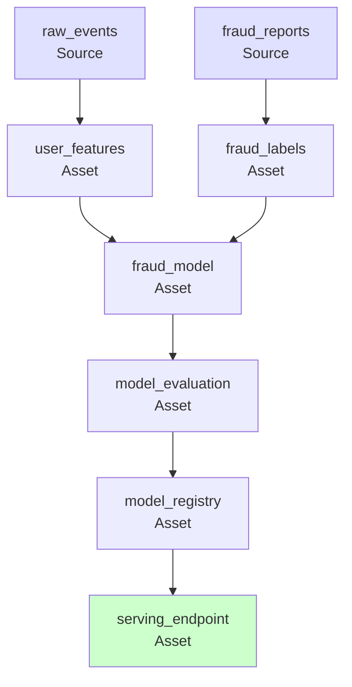

# 🏭 Dagster: Asset-Aware ML Orchestration

## Introduction

Airflow and Prefect orchestrate tasks — run this, then that, on this schedule. Dagster orchestrates assets — data products with defined dependencies, materialization histories, and quality constraints. For ML, this paradigm shift is profound: instead of orchestrating a script called `train_model.py`, you define an asset called `fraud_model` that depends on `user_features` and `fraud_labels`, and Dagster automatically determines when to retrain based on upstream changes.

Dagster's asset model maps naturally to the ML lifecycle: raw data → features → trained model → evaluation → deployed endpoint. Each is an asset with lineage that Dagster tracks, versions, and can recompute on change — closing the gap between data pipelines and ML pipelines in a single orchestration platform.

---

## 1. 🧠 The Asset Mental Model

### Tasks vs Assets

| Paradigm | Airflow/Prefect (Tasks) | Dagster (Assets) |
|---|---|---|
| **What you define** | "Run function X" | "Asset Y is computed from X" |
| **Trigger** | Schedule or sensor | Schedule OR upstream asset change |
| **Lineage** | Manual via XCom/tags | Automatic — Dagster infers the DAG |
| **Reproducibility** | Re-run a DAG run | Re-materialize a specific asset |
| **ML example** | "Run `train.py` on Monday" | "`fraud_model` depends on `user_features` (updated daily) and `labels` (updated weekly)" |

### Asset Definition

```python
from dagster import asset, AssetIn, Output
import mlflow

@asset(key_prefix="ml", group_name="features")
def user_features(context):
    """Feature table built from raw events."""
    df = spark.sql("""
        SELECT user_id, COUNT(*) AS event_count, AVG(amount) AS avg_amount
        FROM raw_events
        GROUP BY user_id
    """)
    df.write.format("delta").mode("overwrite").save("s3://features/user_features/")
    context.add_output_metadata({"rows": df.count()})
    return df

@asset(key_prefix="ml", group_name="features")
def fraud_labels(context):
    """Label data from reported fraud cases."""
    return spark.sql("SELECT user_id, is_fraud FROM fraud_reports")

@asset(
    key_prefix="ml",
    group_name="models",
    ins={
        "features": AssetIn(key="ml/user_features"),
        "labels": AssetIn(key="ml/fraud_labels")
    }
)
def fraud_model(context, features, labels):
    """Trained fraud detection model."""
    mlflow.set_experiment("fraud_detection")

    with mlflow.start_run():
        mlflow.log_param("feature_version", "latest")
        train_df = features.join(labels, "user_id")
        model = train_random_forest(train_df)
        accuracy = evaluate(model, train_df)
        mlflow.log_metric("accuracy", accuracy)

        context.add_output_metadata({
            "accuracy": accuracy,
            "mlflow_run_id": mlflow.active_run().run_id
        })

    return model
```

---

## 2. ⚡ Dagster's ML Superpowers

### Automatic Asset Materialization

Dagster detects when upstream assets have changed and triggers downstream recomputation:

```
Scenario:
  ─ `user_features` materialized at 02:00 with new data
  ─ `fraud_labels` unchanged since last week

  Dagster's decision:
  ─ `user_features` changed → `fraud_model` is stale → auto-materialize
```

This eliminates the "did someone update the features? Do I need to retrain?" manual check.

### I/O Managers: Abstracting Storage

I/O Managers decouple asset logic from storage:

```python
from dagster import Definitions
from dagster_aws.s3 import S3PickleIOManager

# Development: store in local filesystem
dev_resources = {"io_manager": FilesystemIOManager()}

# Production: store in S3
prod_resources = {"io_manager": S3PickleIOManager(s3_bucket="ml-assets")}

# Same asset code, different storage backends
defs = Definitions(
    assets=[user_features, fraud_labels, fraud_model],
    resources=prod_resources if is_production() else dev_resources
)
```

### Freshness Policies

Define how fresh each asset must be — Dagster alerts and auto-materializes when assets go stale:

```python
from dagster import FreshnessPolicy

@asset(
    freshness_policy=FreshnessPolicy(maximum_lag_minutes=1440)  # Must be <24h old
)
def user_features(context):
    ...
```

---

## 3. 🔄 ML Lifecycle as Dagster Assets



Each box is an asset that can be independently materialized, versioned, and re-materialized when upstream data changes.

### Asset Checks: Quality Gates

Dagster supports asset checks — validations that run after materialization:

```python
from dagster import asset_check, AssetCheckResult

@asset_check(asset=fraud_model)
def model_accuracy_check(fraud_model):
    """Model must exceed accuracy threshold."""
    if fraud_model.accuracy < 0.90:
        return AssetCheckResult(
            passed=False,
            severity=AssetCheckSeverity.ERROR,
            metadata={"accuracy": fraud_model.accuracy}
        )
    return AssetCheckResult(passed=True)
```

---

## 4. ⚖️ Dagster vs Airflow for ML

| Criterion | Dagster | Airflow |
|---|---|---|
| **Paradigm** | Asset-aware | Task-based |
| **Lineage** | Automatic (inferred from asset deps) | Manual (documentation, tags) |
| **Reprocessing** | Materialize specific asset | Re-run entire DAG or specific task |
| **Development** | Test assets as Python functions | Need Airflow instance or mocking |
| **Backfill** | Asset partition backfill | DAG run backfill |
| **ML-native features** | Freshness policies, I/O managers | None (needs custom operators) |
| **Ecosystem** | Growing, less plugins | Largest plugin ecosystem |
| **Learning curve** | Moderate (different paradigm) | Moderate (many concepts) |

---

## ⚠️ Pitfalls

- **Asset explosion:** If every training run is a separate asset, your asset graph becomes unmanageable. Use partitions (one asset, many partitions) for repeated runs.
- **I/O Manager pickling:** Default I/O managers pickle objects. For large DataFrames or models, use a Parquet/Delta I/O manager.
- **Freshness vs cost:** Auto-materialization can trigger expensive retraining on every upstream change. Set freshness policies judiciously.

---

## 💡 Tips

- **Use asset groups for ML lifecycle stages:** `features`, `models`, `evaluations`, `deployments` — each group has its own freshness policy and compute resources.
- **Integrate with MLflow:** Add an I/O manager that logs model artifacts to MLflow and returns the MLflow run ID as asset metadata.
- **Partition assets by date:** `@asset(partitions_def=DailyPartitionsDefinition(start_date="2024-01-01"))` — each daily partition is materialized independently.

---

## References

- [Dagster Documentation](https://docs.dagster.io/)
- [Dagster + ML Guide](https://docs.dagster.io/integrations/mlflow)
- [Dagster Asset Checks](https://docs.dagster.io/concepts/assets/asset-checks)
