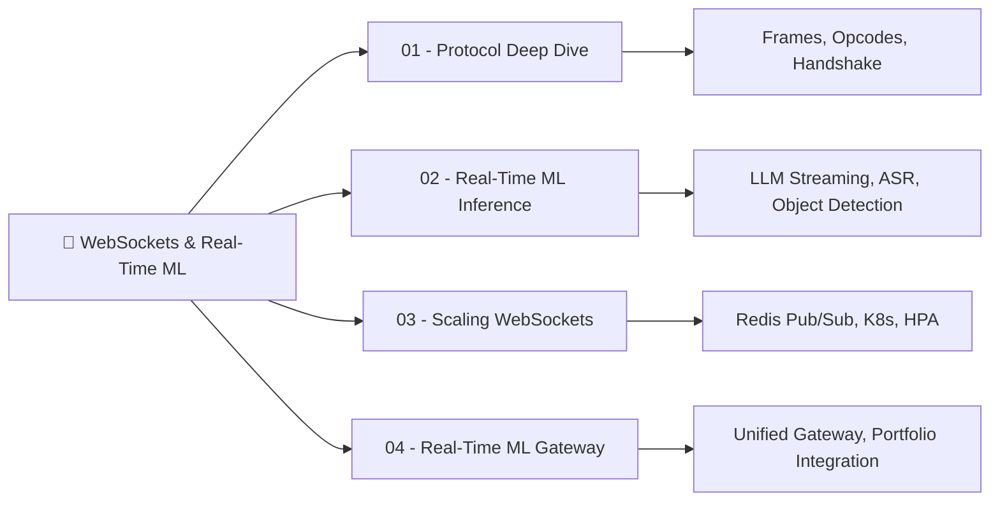

# 🚀 Welcome to WebSockets and Real-Time ML Serving

## 🎯 Learning Objectives

By the end of this course you will:
- Master the WebSocket protocol from frame-level up to production scaling patterns
- Architect real-time ML inference pipelines that stream tokens, audio chunks, and video frames over WebSockets
- Scale WebSocket-based ML services horizontally using Redis Pub/Sub and Kubernetes
- Build a unified real-time ML Gateway in Go + Fiber that bridges your existing REST infrastructure with streaming inference

## Introduction

HTTP request-response served ML engineers well for batch scoring and one-shot inference. But modern AI workloads—LLM token streaming, real-time audio transcription, collaborative ML editing sessions—demand persistent, bidirectional connections. The round-trip latency of opening a new HTTP connection per inference request can exceed the actual model inference time, rendering real-time UX impossible.

This course bridges your Go/Fiber backend expertise with real-time ML inference, creating a unique portfolio differentiator. If you built the [[../../../Go Engineering/03 - Microservices with Go/01 - Building APIs with Gin and Fiber|LLM Edge Gateway]] on Fiber and [[../../../Go Engineering/05 - Local AI with Go/04 - RAG Pipelines with Go and Vector DBs|RAG pipelines in Go]], this is the next evolution—adding WebSocket streaming endpoints alongside REST, with Redis pub/sub you already know, creating a production-grade real-time ML platform. The knowledge also connects naturally to [[../18 - vLLM and Advanced RAG/01 - vLLM and Production-Grade LLM Serving|vLLM production serving]] where streaming responses are the default, and to [[../../06 - Cloud, Infra y Backend/22 - Cloud Computing/02 - Computo en la Nube|cloud infrastructure]] where persistent connections demand careful resource management.

---

## 🗂️ Course Map



1. [[01 - WebSocket Protocol Deep Dive for ML Engineers|01 - WebSocket Protocol Deep Dive for ML Engineers]]
2. [[02 - Real-Time ML Inference over WebSockets|02 - Real-Time ML Inference over WebSockets]]
3. [[03 - Scaling WebSockets for ML Services|03 - Scaling WebSockets for ML Services]]
4. [[04 - Real-Time ML Gateway with WebSockets|04 - Real-Time ML Gateway with WebSockets]]

---

## 📋 Prerequisites

| Required | Why |
|----------|-----|
| Go or Python proficiency | We write Fiber WebSocket handlers in Go; Python for client/inference examples |
| HTTP protocol knowledge | You need to contrast request-response with full-duplex streaming |
| Basic ML serving concepts | Familiarity with model inference endpoints, token streaming, batch vs online |
| Redis fundamentals | Pub/sub backplane for horizontal scaling (Module 3 of Note 03) |

| Helpful but optional | Why |
|----------------------|-----|
| [[../../../Go Engineering/03 - Microservices with Go/05 - Rate Limiting and Circuit Breakers|Circuit breaker patterns in Go]] | Gateway-level resilience for WS connections |
| [[../../06 - Cloud, Infra y Backend/22 - Cloud Computing/01 - Fundamentos de Cloud y Modelos de Servicio|Cloud service models]] | Deployment cost analysis for persistent connections |
| [[../18 - vLLM and Advanced RAG/01 - vLLM and Production-Grade LLM Serving|vLLM serving basics]] | Streaming generation under the hood |

---

## 📦 Compression Code

```yaml
course:
  id: ws-rtml-01
  stack: [Go, Fiber, WebSocket, Redis, vLLM, Ollama]
  pattern: "REST_for_one-shot_WS_for_streaming"
  key_insight: "WebSocket handshake is just an HTTP upgrade—your existing HTTP infra already supports it"
  scaling_formula: "N_servers × Redis_pubsub = infinite_horizontal_scale"
```

## 🎯 Documented Project

The capstone of this course is enhancing your existing [[../../../Go Engineering/03 - Microservices with Go/01 - Building APIs with Gin and Fiber|LLM Edge Gateway]] with WebSocket streaming endpoints, producing a unified real-time ML gateway capable of serving both REST and WS clients from a single Fiber process—with <10ms cached responses and token-by-token streaming for LLM inference.

## 🎯 Key Takeaways

- WebSocket is not a separate protocol stack—it upgrades HTTP, reuses TLS, and traverses proxies
- Streaming inference over WS eliminates the per-request connection overhead that kills real-time UX
- Redis Pub/Sub scales WS horizontally with the same pattern you use for cache invalidation
- Your Fiber skills transfer directly: `c.Upgrade()` is the difference between REST and real-time

## References

- IETF RFC 6455 — The WebSocket Protocol
- Fiber WebSocket documentation ([[../../../Go Engineering/03 - Microservices with Go/01 - Building APIs with Gin and Fiber|Go Fiber APIs]])
- [[../../../Go Engineering/05 - Local AI with Go/04 - RAG Pipelines with Go and Vector DBs|RAG Pipelines with Go]] — SSE streaming patterns
- [[../18 - vLLM and Advanced RAG/01 - vLLM and Production-Grade LLM Serving|vLLM Serving]] — server-sent events for token streaming
