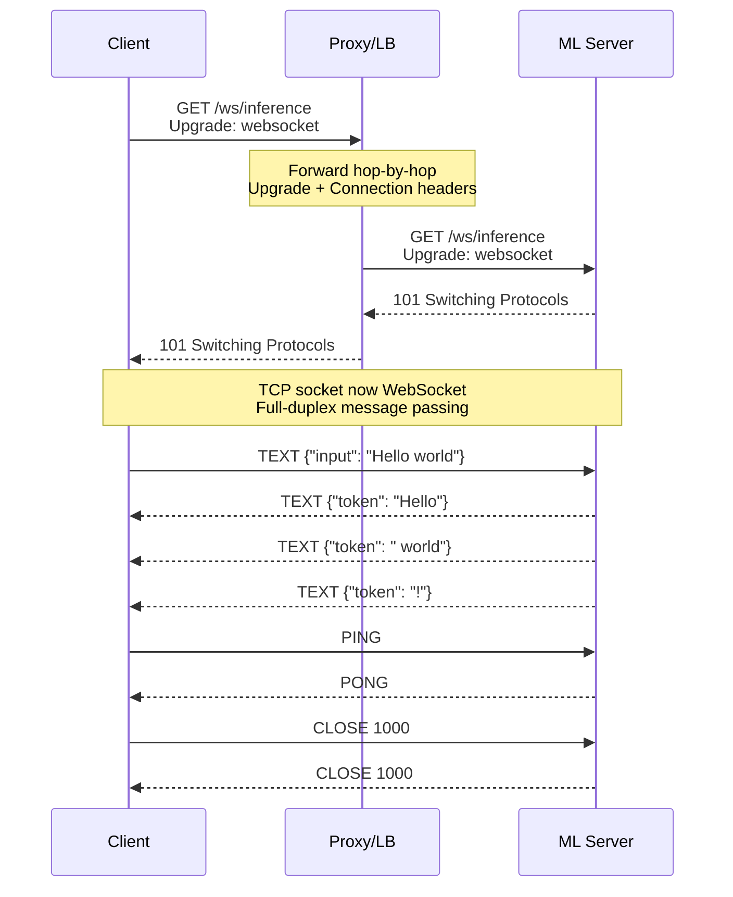
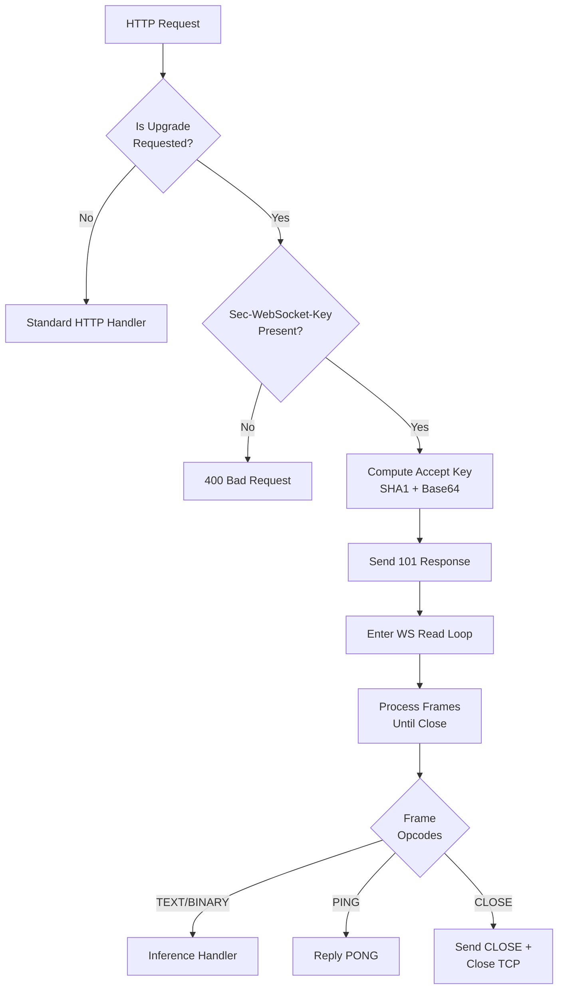
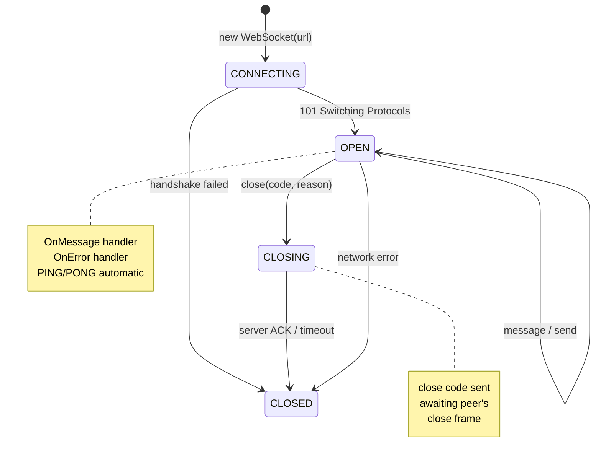
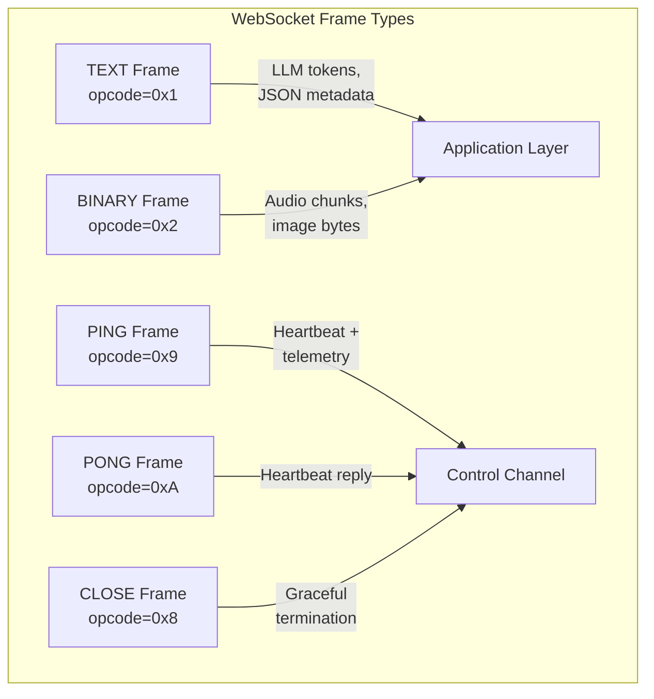
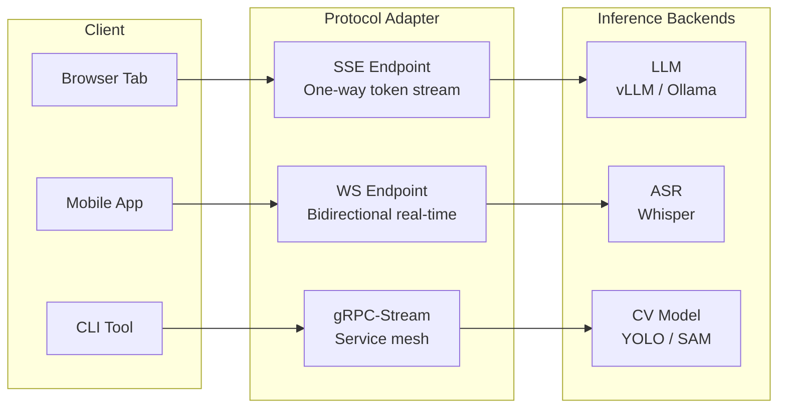
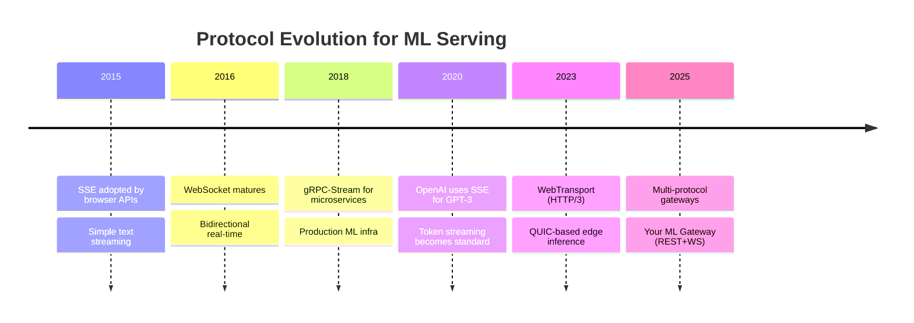

# 🔬 WebSocket Protocol Deep Dive for ML Engineers

## 🎯 Learning Objectives

- Understand the WebSocket handshake, frame structure, and lifecycle at the byte level
- Compare WebSocket against SSE, gRPC-Stream, and WebTransport for ML serving decisions
- Implement WebSocket endpoints in Go + Fiber with proper connection lifecycle management
- Debug streaming inference failures using frame-level protocol knowledge

## Introduction

Most ML engineers interact with WebSockets through high-level libraries and never touch the protocol internals. But when a streaming LLM inference drops tokens mid-response, or a real-time object detection pipeline accumulates 2-second lag, understanding the frame protocol is the difference between hours of blind debugging and a targeted fix. The WebSocket protocol (RFC 6455) is elegantly simple: a 2-byte header base, variable-length payload, and four opcodes that govern the entire lifecycle.

This deep dive builds on your existing HTTP knowledge from [[../../06 - Cloud, Infra y Backend/24 - Backend para ML/01 - FastAPI y APIs REST|REST API design]] and prepares you for the real-time inference architectures in [[02 - Real-Time ML Inference over WebSockets|Note 02]]. The Go/Fiber WebSocket implementation will connect directly to the patterns you already use in the [[../../../Go Engineering/03 - Microservices with Go/01 - Building APIs with Gin and Fiber|LLM Edge Gateway]], where adding a `c.Upgrade()` call transforms a REST endpoint into a bidirectional streaming channel.

---

## Module 1: HTTP vs WebSocket — Theoretical Foundation 🧠

### 1.1 Theoretical Foundation 🧠

HTTP operates on a strict request-response cycle: client opens TCP, sends a request, server responds, connection may close or be reused (HTTP/1.1 keep-alive, HTTP/2 multiplexing). This model is fundamentally half-duplex—only one party talks at a time per stream. WebSocket breaks this constraint by upgrading an HTTP connection to a full-duplex message-passing protocol over that same TCP socket.

The key insight: **WebSocket is not a new transport protocol**. It's an upgrade of HTTP. The initial handshake uses HTTP semantics (GET with `Upgrade: websocket` and `Connection: Upgrade` headers), receives a `101 Switching Protocols` response, and from that point forward the TCP socket is no longer HTTP. This means WebSocket inherits HTTP's TLS security model, proxy traversal capabilities (through the `Upgrade` and `Connection` hop-by-hop headers), and port reuse (443 for WSS). For ML serving, this is crucial: your existing HTTPS ingress, load balancers, and auth middleware work with WebSocket with minimal configuration changes.

The resource model differs fundamentally. HTTP: each request allocates short-lived resources, connection pooling amortizes TCP handshake costs. WebSocket: each connection is a long-lived resource that holds a goroutine, a TCP socket, and read/write buffers for its entire lifetime—potentially hours. This has profound implications for [[03 - Scaling WebSockets for ML Services|scaling]] that we explore in Note 03.

### 1.2 Mental Model 📐

```
HTTP Request-Response Cycle:

  Client                          Server
    │                                │
    ├──── GET /predict ─────────────>│  (TCP SYN + TLS + HTTP request)
    │                                │  (Server allocates request context)
    │<──── 200 OK { "class": 3 } ────┤  (Response + connection close)
    │                                │  (Server frees resources)
    ×                                ×
    (Connection closed or pooled)

Time: ~50ms (TLS) + ~5ms (inference) = 55ms per prediction
```

```
WebSocket Lifecycle:

  Client                          Server
    │                                │
    ├──── GET /ws HTTP/1.1 ─────────>│  (Upgrade: websocket)
    │     Upgrade: websocket          │
    │                                │
    │<──── 101 Switching Protocols ──┤  (Connection upgraded)
    │                                │
    ├──── PING ──────────────────────>│  (Keep-alive heartbeat)
    │<──── PONG ──────────────────────┤
    │                                │
    ├──── TEXT [token: "The"] ───────>│  (Bidirectional at any time)
    │<──── TEXT [token: "cat"] ───────┤
    │<──── TEXT [token: "sat"] ───────┤
    │                                │
    ├──── CLOSE 1000 ────────────────>│  (Graceful shutdown)
    │<──── CLOSE 1000 ────────────────┤
    ×                                ×

Time: ~50ms (TLS once) + N × 5ms (tokens) = 50ms + N×5ms
```

```
WebSocket vs HTTP throughput for 1000 token stream:

HTTP: 1000 requests × (50ms TLS + 1ms inference + 10ms overhead) = 61,000ms
  ┌─req1──┐ ┌─req2──┐ ┌─req3──┐ ...  ┌─req1000──┐
  │TLS+.+░│ │TLS+.+░│ │TLS+.+░│      │TLS+.+░│
  └───────┘ └───────┘ └───────┘      └────────┘

WebSocket: 1 upgrade × 50ms + 1000 × 1ms = 1,050ms
  ┌─Upgrade──┐ ┌─────────────────────────────────────┐
  │  TLS+Ack  │ │ t1│t2│t3│t4│t5│...│t998│t999│t1000│
  └───────────┘ └─────────────────────────────────────┘
  
  98% latency reduction for streaming inference workloads
```

### 1.3 Syntax and Semantics 📝

**WebSocket handshake (Client → Server):**

```http
GET /ws/inference HTTP/1.1
Host: ml-gateway.example.com
Upgrade: websocket
Connection: Upgrade
Sec-WebSocket-Key: dGhlIHNhbXBsZSBub25jZQ==
Sec-WebSocket-Version: 13
```

**Handshake response (Server → Client):**

```http
HTTP/1.1 101 Switching Protocols
Upgrade: websocket
Connection: Upgrade
Sec-WebSocket-Accept: s3pPLMBiTxaQ9kYGzzhZRbK+xOo=
```

The `Sec-WebSocket-Accept` value is computed as `base64(sha1(client_key + "258EAFA5-E914-47DA-95CA-C5AB0DC85B11"))`. This "magic string" (RFC 6455 Section 1.3) prevents accidental upgrade from non-WebSocket clients and ensures the server genuinely supports the protocol.

### 1.4 Visual Representation 🖼️





### 1.5 Application in ML/AI Systems 🤖

- **LLM token streaming**: Each token becomes a TEXT frame. The client renders tokens as they arrive, achieving sub-100ms time-to-first-token perception.
- **Real-time ASR**: Audio chunks (BINARY frames) flow from client to server; partial transcripts (TEXT frames) flow back simultaneously—impossible with unidirectional HTTP.
- **Collaborative ML editing**: Multiple clients connected to the same inference session via a shared room, with Redis pub/sub broadcasting results (see [[03 - Scaling WebSockets for ML Services|Note 03]]).
- **Model training progress**: Long-running training jobs push epoch/metric updates to a WebSocket, replacing polling loops that waste server CPU.

### 1.6 Common Pitfalls ⚠️ + Tips

| Pitfall | Why it happens | Fix |
|---------|---------------|-----|
| **Proxy strips Upgrade header** | Some reverse proxies (nginx < 1.3.13) don't forward `Upgrade` by default | Set `proxy_set_header Upgrade $http_upgrade;` in nginx; use `proxy_http_version 1.1;` |
| **Connection silently closes after 60s** | Load balancer idle timeout kills inactive WS connections | Send PING frames every 30s; configure LB idle timeout ≥ 120s |
| **TEXT frames dropped mid-message** | Fragmentation: a single JSON payload split across multiple frames | Always set `FIN=1` for data messages. If fragmenting, buffer until final fragment |
| **Goroutine leak** | WS read/write loops not cleaned up on client disconnect | Use `context.Context` with cancellation, `defer conn.Close()`, and `select` on done channels |
| **WSS cert mismatch** | `wss://` to IP address fails TLS verification because cert is for hostname | Use hostname, not IP; for internal services use mutual TLS or plain `ws://` within the mesh |

> **Tip:** Test your WebSocket upgrades with `curl --include --no-buffer --header "Connection: Upgrade" --header "Upgrade: websocket" --header "Sec-WebSocket-Version: 13" --header "Sec-WebSocket-Key: $(openssl rand -base64 16)" http://localhost:8080/ws` and verify you get a `101` response.

---

## Module 2: WebSocket Frame Protocol 📐

### 2.1 Theoretical Foundation 🧠

Once the TCP socket is upgraded, all communication occurs via **frames**. A frame is the atomic unit of WebSocket communication and has the following structure:

```ascii
 0                   1                   2                   3
 0 1 2 3 4 5 6 7 8 9 0 1 2 3 4 5 6 7 8 9 0 1 2 3 4 5 6 7 8 9 0 1
+-+-+-+-+-------+-+-------------+-------------------------------+
|F|R|R|R| opcode|M| Payload len |    Extended payload length    |
|I|S|S|S|  (4)  |A|     (7)     |             (16/64)           |
|N|V|V|V|       |S|             |   (if payload len==126/127)   |
| |1|2|3|       |K|             |                               |
+-+-+-+-+-------+-+-------------+ - - - - - - - - - - - - - - - +
|   Extended payload length continued, if payload len == 127    |
+ - - - - - - - - - - - - - - - +-------------------------------+
|                               |Masking key (if MASK set to 1) |
+-------------------------------+-------------------------------+
| Masking key (if MASK set)     |          Payload Data         |
+-------------------------------+ - - - - - - - - - - - - - - - +
:                     Payload Data continued ...                :
+ - - - - - - - - - - - - - - - - - - - - - - - - - - - - - - - +
```

**Opcodes (4 bits):**
- `0x1` — TEXT (UTF-8 text data)
- `0x2` — BINARY (arbitrary binary data)
- `0x8` — CLOSE (connection close request/reply)
- `0x9` — PING (heartbeat)
- `0xA` — PONG (heartbeat response)

**FIN bit**: `1` = final fragment of a message, `0` = more fragments follow.

**MASK bit**: Frames from client to server MUST be masked (M=1); server-to-client frames MUST NOT be masked. The masking key (4 bytes) is XOR'd with the payload to prevent cache poisoning attacks on intermediary proxies (RFC 6455 Section 10.3).

### 2.2 Mental Model 📐

```
Frame lifecycle when sending "Hello World" as TEXT from client:

  1. Client encodes frame header:
     ┌────┬────────┬───┬─────────┬──────────────┬───────────────┐
     │FIN │RSV123=0│opc│  MASK=1 │  Payload len │  Masking key  │
     │ =1 │        │=1 │         │     = 11     │  (4 rand b)   │
     ├────┴────────┴───┴─────────┴──────────────┴───────────────┤
     │  XOR'd Payload: H⊕k[0] e⊕k[1] l⊕k[2] l⊕k[3] o⊕k[0] ...  │
     └──────────────────────────────────────────────────────────┘

  2. Server receives raw bytes, decodes:
     - Reads first 2 bytes to get FIN + opcode + MASK + initial length
     - If MASK=1, reads 4-byte masking key
     - If length=126, reads 2 more bytes (extended length)
     - If length=127, reads 8 more bytes (super-extended length)
     - Reads payload bytes, XORs with masking key

  3. Server assembles message:
     - If FIN=1: deliver payload directly to application
     - If FIN=0: buffer payload, wait for next frame with FIN=1

```

```
Close frame negotiation — graceful WebSocket termination:

  Client wants to close          Server acknowledges
  ┌──────────────────┐           ┌──────────────────┐
  │ opcode=8 (CLOSE) │           │ opcode=8 (CLOSE) │
  │  ┌───┬───────┐   │           │  ┌───┬───────┐   │
  │  │HIB│ LOBI  │   │──────>    │  │HIB│ LOBI  │   │
  │  │   │       │   │           │  │   │       │   │
  │  │ 03│   E8  │   │<──────    │  │ 03│   E8  │   │
  │  │   │       │   │           │  │   │       │   │
  │  │1000│       │   │           │  │1000│       │   │
  │  └───┴───────┘   │           │  └───┴───────┘   │
  │  Code: 1000      │           │  Code: 1000      │
  │  (Normal Close)  │           │  (Normal Close)  │
  └──────────────────┘           └──────────────────┘

  After both sides exchange CLOSE, TCP socket is torn down.
```

```
PING/PONG heartbeat mechanism:

  Server                            Client
    │                                 │
    ├── PING [opcode=0x9] ───────────>│  (Server initiates keep-alive)
    │   payload: "heartbeat-123"      │
    │                                 │
    │<── PONG [opcode=0xA] ───────────┤  (Client MUST echo payload)
    │   payload: "heartbeat-123"      │
    │                                 │

  If no PONG received within timeout → connection is dead → trigger reconnection.

  ML serving tip: embed inference queue depth in PING payload:
    PING: {"seq": 42, "queue_depth": 3, "gpu_util": 0.87}
    PONG: {"seq": 42}  ← client echoes seq, server monitors RTT
```

### 2.3 Syntax and Semantics 📝

**Go: Manual frame masking (client-side, illustrative):**

```go
func maskPayload(key [4]byte, payload []byte) []byte {
    masked := make([]byte, len(payload))
    for i := range payload {
        masked[i] = payload[i] ^ key[i%4]
    }
    return masked
}

func encodeFrame(opcode byte, payload []byte, isClient bool) []byte {
    var buf bytes.Buffer
    finBit := byte(0x80)
    buf.WriteByte(finBit | opcode)

    length := len(payload)
    if isClient {
        if length < 126 {
            buf.WriteByte(0x80 | byte(length))
        } else if length < 65536 {
            buf.WriteByte(0x80 | 126)
            binary.Write(&buf, binary.BigEndian, uint16(length))
        }
        key := [4]byte{0x01, 0x02, 0x03, 0x04}
        buf.Write(key[:])
        buf.Write(maskPayload(key, payload))
    } else {
        buf.WriteByte(byte(length))
        buf.Write(payload)
    }
    return buf.Bytes()
}
```

**Go: Fiber WebSocket handler (server-side, production):**

```go
package handler

import (
    "log"
    "github.com/gofiber/fiber/v2"
    "github.com/gofiber/contrib/websocket"
)

func wsMiddleware(c *fiber.Ctx) error {
    if websocket.IsWebSocketUpgrade(c) {
        c.Locals("allowed", true)
        return c.Next()
    }
    return fiber.ErrUpgradeRequired
}

func wsInferenceHandler(c *websocket.Conn) {
    var (
        mt  int
        msg []byte
        err error
    )

    defer c.Close() // Guaranteed cleanup

    for {
        if mt, msg, err = c.ReadMessage(); err != nil {
            if websocket.IsUnexpectedCloseError(err,
                websocket.CloseGoingAway,
                websocket.CloseNormalClosure) {
                log.Printf("WS error: %v", err)
            }
            break
        }

        switch mt {
        case websocket.TextMessage:
            // Process inference request, stream response
            for _, token := range streamInference(string(msg)) {
                if err := c.WriteMessage(websocket.TextMessage,
                    []byte(token)); err != nil {
                    log.Printf("Write error: %v", err)
                    break
                }
            }
        case websocket.BinaryMessage:
            // Handle binary payloads (audio chunks, images)
            result := processBinaryPayload(msg)
            c.WriteMessage(websocket.BinaryMessage, result)
        }
    }
}
```

### 2.4 Visual Representation 🖼️





### 2.5 Application in ML/AI Systems 🤖

- **Token streaming debugging**: If a client receives garbled tokens, check whether the server is sending TEXT opcode (0x1) properly. Sending binary payloads with TEXT opcode or vice versa causes silent corruption in browser WebSocket APIs.
- **Fragment-based large payloads**: When streaming a full image (e.g., 4MB frame from object detection camera), fragment it into 64KB chunks with FIN=0 on all but the last—reduces memory pressure on the server goroutine.
- **PING-based load shedding**: Embed GPU utilization in PING payloads. Clients use this to route to the least-loaded inference node, implementing client-side load balancing without a central coordinator.
- **Close codes for ML errors**: Define custom close codes (4000-4999 range) for ML-specific termination reasons: `4001` = model is reloading, `4002` = unsupported input format, `4003` = inference timeout exceeded.

### 2.6 Common Pitfalls ⚠️ + Tips

| Pitfall | Symptom | Solution |
|---------|---------|----------|
| **Masking mismatch** | Server rejects client frames with "protocol error" | Client MUST mask; server MUST NOT. Check `MASK` bit in frame header |
| **Payload > 125 bytes truncated** | Messages cut at character 125 | Remember extended length field: len=126 → 2 more bytes, len=127 → 8 more bytes |
| **Close code not sent** | `onClose` fires with code 1006 (abnormal) | Always send `Close(1000)` before closing TCP; catch `CloseGoingAway` in error handler |
| **Reading after Close** | Panic: "use of closed network connection" | After receiving CLOSE frame, break read loop immediately; let deferred Close() finalize |
| **UTF-8 validation failure** | TEXT frame rejected by browser client | Validate all TEXT payloads contain valid UTF-8 before sending; the RFC requires it |

### 2.7 Knowledge Check ❓

1. A client receives two TEXT frames in quick succession. The first has FIN=0, the second has FIN=1. How does the application layer receive this? (Answer: as a single concatenated message.)
2. Why must client-to-server frames be masked? (Answer: To prevent cache poisoning attacks on intermediary proxies that could confuse WebSocket data with HTTP cache entries.)
3. What happens if a server sends a TEXT frame containing binary data? (Answer: Browser WebSocket API throws an error because TEXT must be valid UTF-8. Use BINARY opcode for non-text data.)

---

## Module 3: SSE vs WebSocket vs gRPC-Stream vs WebTransport 🆚

### 3.1 Theoretical Foundation 🧠

| Feature | SSE | WebSocket | gRPC-Stream | WebTransport |
|---------|-----|-----------|-------------|--------------|
| **Bidirectional** | No (server→client only) | Yes | Yes | Yes |
| **Binary data** | No (text only, base64 needed) | Yes (BINARY opcode) | Yes (Protobuf native) | Yes (QUIC streams) |
| **Multiplexing** | No (one stream per connection) | No (1:1 channel) | Yes (multiple streams) | Yes (multiple streams) |
| **Firewall traversal** | Excellent (plain HTTP) | Good (HTTP upgrade) | Poor (HTTP/2 required) | Good (HTTP/3 QUIC) |
| **Automatic reconnect** | Yes (EventSource API) | Manual (library-dependent) | Manual (gRPC client) | Manual |
| **Browser API** | `EventSource` (built-in) | `WebSocket` (built-in) | Requires gRPC-web proxy | `WebTransport` (Chrome + Edge) |
| **Protocol overhead** | Minimal (HTTP chunked) | 2-10 bytes per frame | h2 frames + protobuf | QUIC + h3 frames |
| **ML inference use** | Token streaming (OpenAI) | Real-time bidirectional inference | Microservice-to-microservice | Future edge inference |
| **Load balancing** | Easy (stateless HTTP) | Needs sticky sessions | Needs HTTP/2 LB | Needs QUIC LB |

**Decision matrix for ML workloads:**

```
Use SSE when:                          Use WebSocket when:
  ┌────────────────────────┐           ┌────────────────────────────┐
  │ Data flows one way     │           │ Bidirectional communication │
  │ (server → client)      │           │ is required                │
  │ No client→server       │           │ Client sends audio/video    │
  │ streaming needed       │           │ while receiving inference   │
  └────────────────────────┘           └────────────────────────────┘

Use gRPC-Stream when:                 Use WebTransport when:
  ┌────────────────────────┐           ┌────────────────────────────┐
  │ Internal microservice   │           │ Edge deployments with      │
  │ communication           │           │ unreliable networks        │
  │ Strong typing needed    │           │ Multiplexed inference      │
  │ (Protobuf contracts)    │           │ sessions over one QUIC     │
  └────────────────────────┘           └────────────────────────────┘
```

### 3.2 Mental Model 📐

```
SSE Flow (OpenAI-compatible streaming):
  Client ── POST /chat/completions ──> Server
  Client <── data: {"token":"Hello"}\n\n ── Server
  Client <── data: {"token":" world"}\n\n ── Server
  Client <── data: [DONE]\n\n ── Server
  (Connection closes)
  
  └─ One-way, text-only, automatic reconnect via EventSource.lastEventId

WebSocket Flow (Bidirectional inference):
  Client ── Upgrade ──> Server
  Client <──> TEXT {"prompt":"hello"} ──> Server ──> [LLM Inference]
  Client <── TEXT {"token":"hello"} ── Server
  Client ──> TEXT {"cancel":true} ──> Server (STOP generation!)
  Client <── TEXT {"status":"cancelled"} ── Server
  
  └─ Bidirectional → client can interrupt mid-generation
```

```
Protocol overhead comparison per 1000-token stream (bytes):

  SSE:
  ┌─────────────────────────────────────────────┐
  │ "data: " + JSON + "\n\n" repeated 1000x     │
  │ Overhead: ~8 bytes × 1000 = 8KB             │
  └─────────────────────────────────────────────┘

  WebSocket (TEXT frames):
  ┌─────────────────────────────────────────────┐
  │ 2-6 byte header + JSON payload × 1000       │
  │ Overhead: ~4KB                              │
  └─────────────────────────────────────────────┘

  WebSocket (BINARY protobuf):
  ┌─────────────────────────────────────────────┐
  │ 2-6 byte header + protobuf encoding × 1000  │
  │ Overhead: ~2KB + compact serialization      │
  └─────────────────────────────────────────────┘

  gRPC-Stream (h2 frame + protobuf):
  ┌─────────────────────────────────────────────┐
  │ 9 byte h2 + 5 byte gRPC + protobuf × 1000   │
  │ Overhead: ~14KB (heaviest but best typed)   │
  └─────────────────────────────────────────────┘
```

### 3.3 Syntax and Semantics 📝

**SSE server implementation (Go + Fiber):**

```go
func sseInferenceHandler(c *fiber.Ctx) error {
    c.Set("Content-Type", "text/event-stream")
    c.Set("Cache-Control", "no-cache")
    c.Set("Connection", "keep-alive")

    c.Context().SetBodyStreamWriter(func(w *bufio.Writer) {
        for _, token := range streamLLMTokens("Hello world") {
            fmt.Fprintf(w, "data: %s\n\n", token)
            w.Flush()
        }
        fmt.Fprintf(w, "data: [DONE]\n\n")
        w.Flush()
    })
    return nil
}
```

**SSE-to-WebSocket bridge (Go):**

```go
func sseToWebSocket(wsConn *websocket.Conn, sseURL string) error {
    resp, err := http.Get(sseURL)
    if err != nil {
        return err
    }
    defer resp.Body.Close()

    scanner := bufio.NewScanner(resp.Body)
    for scanner.Scan() {
        line := scanner.Text()
        if strings.HasPrefix(line, "data: ") {
            data := strings.TrimPrefix(line, "data: ")
            if data == "[DONE]" {
                break
            }
            if err := wsConn.WriteMessage(websocket.TextMessage,
                []byte(data)); err != nil {
                return err
            }
        }
    }
    return scanner.Err()
}
```

### 3.4 Visual Representation 🖼️





### 3.5 Application in ML/AI Systems 🤖

- **SSE**: OpenAI, Anthropic, and most LLM APIs use SSE for token streaming. It's the simplest to implement and debug, but limits client interaction to "send request, receive stream, done."
- **WebSocket**: Used by [[../../../Go Engineering/03 - Microservices with Go/01 - Building APIs with Gin and Fiber|your LLM Edge Gateway]] for real-time bidirectional inference with cancellation, re-prompting, and session management.
- **gRPC-Stream**: Internal microservice communication in [[../../06 - Cloud, Infra y Backend/24 - Backend para ML/02 - gRPC y Comunicacion entre Servicios|microservice architectures]] where strong typing and HTTP/2 multiplexing matter.
- **WebTransport**: Future-proofing for edge AI where network conditions are unreliable. QUIC's connection migration handles WiFi-to-cellular switches seamlessly during long inference sessions.

### 3.6 Common Pitfalls ⚠️ + Tips

| Protocol | Pitfall | Tip |
|----------|---------|-----|
| **SSE** | Browser `EventSource` only supports GET requests | Use `fetch()` with SSE polyfill for POST with request bodies |
| **SSE** | Connection limit: browsers cap at 6 concurrent SSE to same origin | Use HTTP/2 multiplexing or shared worker pattern |
| **WebSocket** | No built-in reconnection | Implement exponential backoff: `min(1s * 2^retry, 30s)` |
| **gRPC-Stream** | Browser requires gRPC-web proxy | Use Envoy or grpc-gateway for browser-to-gRPC bridging |
| **All** | Authentication over persistent connections | Token in first message or URL param (for WS), not per-frame |

### 3.7 Knowledge Check ❓

1. You need client-to-server inference cancellation. Which protocol supports this natively? (Answer: WebSocket and gRPC-Stream—both are bidirectional. SSE is server→client only.)
2. Why might you choose SSE over WebSocket for an LLM token streaming API? (Answer: Simpler implementation, automatic browser reconnection, easier HTTP caching layer traversal, and most LLM use cases don't need client→server streaming.)
3. What's the primary trade-off of gRPC-Stream vs WebSocket for ML serving? (Answer: gRPC-Stream gives strong typing and multiplexing but requires HTTP/2 infrastructure and has heavier per-frame overhead; WebSocket is simpler and faster for individual connections.)

---

## 📦 Compression Code

```go
// The essence of WebSocket protocol understanding for ML engineers:
// ─────────────────────────────────────────────────────────────────
// WebSocket = HTTP Upgrade (101)  +  Frame Protocol (opcodes)
// TEXT (0x1)  = streaming tokens/JSON
// BINARY (0x2) = audio/video chunks
// PING (0x9)  = keep-alive + telemetry
// CLOSE (0x8) = graceful shutdown with ML-specific codes
//
// Fiber handler pattern:
//   ws.New(func(c *websocket.Conn) {
//       defer c.Close()           // Always cleanup
//       for msg := range c.Messages() {  // Read loop
//           tokens := llm.Stream(msg)    // Inference
//           for t := range tokens { c.Write(t) }  // Stream back
//       }
//   })
```

## 🎯 Documented Project

Build a WebSocket protocol analyzer: a Go tool that connects to a WS endpoint, captures all frames, and logs opcode distribution, latency between PING/PONG pairs, and message fragmentation patterns. Use this to profile your LLM Edge Gateway's frame-level behavior under load.

## 🎯 Key Takeaways

- WebSocket upgrades HTTP—it reuses your existing TLS, auth, and proxy infrastructure
- Frame-level understanding enables precise debugging of dropped tokens, connection stalls, and memory leaks
- SSE wins for one-way token streaming; WebSocket wins when clients need to interrupt or control inference
- PING/PONG is not optional—load balancers will kill silent connections; embed telemetry in heartbeat payloads

## References

- RFC 6455 — https://datatracker.ietf.org/doc/html/rfc6455
- Fiber WebSocket Contrib — https://github.com/gofiber/contrib/tree/main/websocket
- [[../../06 - Cloud, Infra y Backend/24 - Backend para ML/02 - gRPC y Comunicacion entre Servicios|gRPC for Service Communication]]
- [[../../../Go Engineering/05 - Local AI with Go/04 - RAG Pipelines with Go and Vector DBs|RAG Pipelines with Go]] — SSE streaming in Go
- WebTransport W3C Spec — https://www.w3.org/TR/webtransport/
