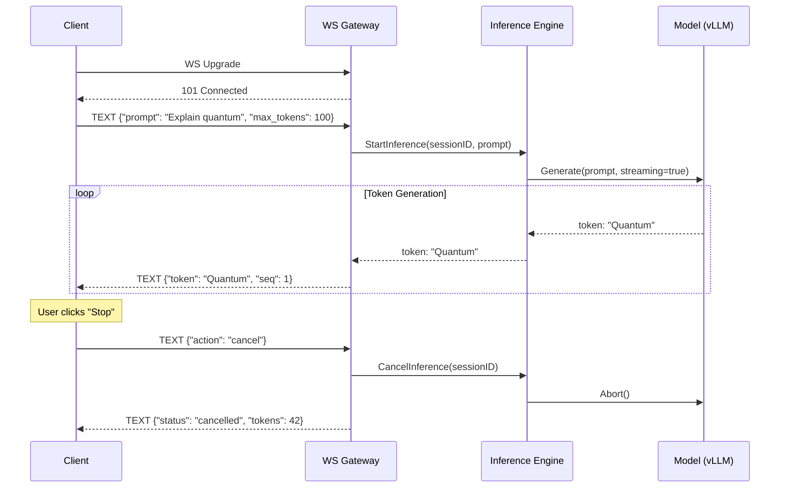
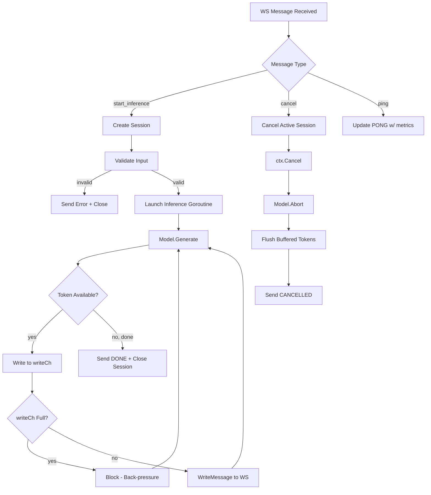
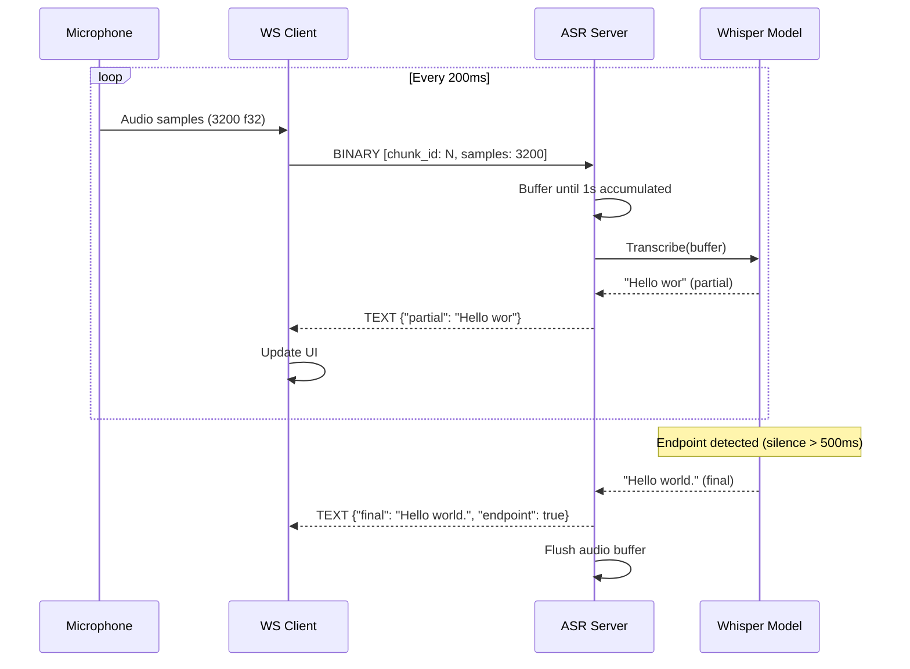
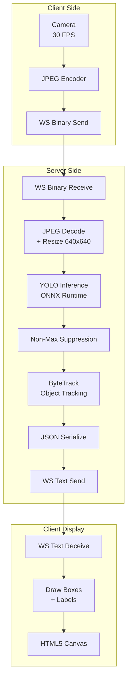
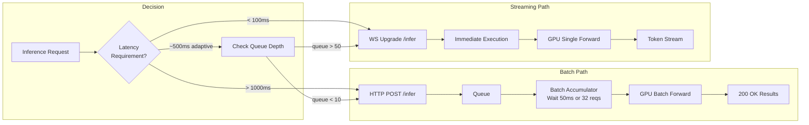

# 🤖 Real-Time ML Inference over WebSockets

## 🎯 Learning Objectives

- Architect streaming inference pipelines where models produce partial results over WebSocket connections
- Implement real-time audio streaming for ASR and video frame processing for object detection
- Bridge OpenAI-compatible SSE token streaming to WebSocket for bidirectional control
- Evaluate batch vs streaming trade-offs: latency, throughput, connection overhead

## Introduction

The fundamental shift from batch to streaming inference is not just a protocol change—it's a UX transformation. When a user types "Explain quantum computing" into a chat interface, waiting 30 seconds for the full 500-token response is unacceptable. But receiving the first token in 200ms, with subsequent tokens arriving every 50ms, creates a perceived response time of 200ms rather than 30 seconds. This time-to-first-token (TTFT) metric, critical in LLM serving, is achievable only through streaming protocols.

This note builds on the WebSocket protocol knowledge from [[01 - WebSocket Protocol Deep Dive for ML Engineers|Note 01]] and connects to your work with [[../../../Go Engineering/05 - Local AI with Go/04 - RAG Pipelines with Go and Vector DBs|RAG pipelines in Go]] where SSE streaming already handles token delivery. We extend that pattern to full WebSocket bidirectional streaming, enabling use cases like real-time audio transcription (whisper.cpp), collaborative inference sessions, and interruptible LLM generation—all running on the Fiber infrastructure you already know.

---

## Module 1: Streaming Inference Architecture 🏗️

### 1.1 Theoretical Foundation 🧠

A streaming inference pipeline differs fundamentally from batch inference in its **partial result delivery model**. In batch mode, the entire input is processed and the complete output is assembled before any response is sent. In streaming mode, the model generates partial outputs as computation progresses, and these partials are serialized and pushed to the client immediately.

The architecture has four layers:
1. **Transport Layer** — WebSocket connection lifecycle, frame encoding/decoding
2. **Session Layer** — Per-connection state: inference context, KV-cache for LLMs, audio buffer for ASR
3. **Inference Layer** — Model execution yielding partial results (tokens, text chunks, bounding boxes)
4. **Serialization Layer** — Converting model outputs to wire format (JSON, Protobuf, MessagePack)

The critical constraint: the inference layer must support **incremental output**. Not all models do this natively. LLMs generate tokens autoregressively (natural fit), but some CV models produce results only after full forward pass. For those, you must introduce chunking at the input level (splitting frames, segmenting audio) rather than the output level.

### 1.2 Mental Model 📐

```
Streaming Inference Pipeline (data flow):

  ┌─────────┐    ┌──────────┐    ┌───────────┐    ┌──────────┐    ┌─────────┐
  │ Client  │    │WS Session│    │Inference  │    │Model     │    │Response │
  │         │───>│Manager   │───>│Orchestr.  │───>│Engine    │───>│Streamer │
  └─────────┘    └──────────┘    └───────────┘    └──────────┘    └─────────┘
       ▲                                                                │
       │                                                                │
       └──────────────── BACK-PRESSURE ────────────────────────────────┘
       
  If client can't consume tokens fast enough:
  ┌────────────────────────────────────────────────────────────┐
  │ Write buffer fills → goroutine blocks → model pauses       │
  │ → upstream back-pressure prevents OOM kill                 │
  └────────────────────────────────────────────────────────────┘
```

```
Session lifecycle for streaming LLM inference:

  Client: "Explain quantum entanglement"
  
  ┌─Connect──┐ ┌─────────────────── Streaming ────────────────────┐ ┌─Close─┐
  │          │ │                                                    │ │       │
  │ Upgrade  │ │ t0  t1  t2  t3  t4  t5  t6  ...  tN             │ │Close  │
  │  101     │ │ │   │   │   │   │   │   │         │              │ │ 1000  │
  │          │ │"Qu" "an" "tum" " " "en" "ta" "ng"  "."          │ │       │
  │          │ │                                                    │ │       │
  └──────────┘ └───────────────────────────────────────────────────┘ └───────┘
  
  t0 (Time-to-first-token): 180ms
  t1..tN (Inter-token latency): 45ms avg
  Total tokens: 512
  Total time: ~23s
  
  Perceived latency: 180ms (not 23s)
```

```
Back-pressure handling with buffer ring:

  ┌───┬───┬───┬───┐ Write pointer →│ W │   │   │   │ (fast producer)
  ├───┼───┼───┼───┤                └───┴───┴───┴───┘
  │ T │ T │ T │   │                ┌───┬───┬───┬───┐
  ├───┼───┼───┼───┤ Read pointer →│   │ R │   │   │ (slow consumer)
  │   │   │   │   │                └───┴───┴───┴───┘
  └───┴───┴───┴───┘
  
  Buffer full → Write blocks (blocks goroutine) → Model engine pauses
  → Natural back-pressure: no dropped tokens, no unbounded memory
```

### 1.3 Syntax and Semantics 📝

**Go: Streaming inference session structure:**

```go
type InferenceSession struct {
    conn     *websocket.Conn
    ctx      context.Context
    cancel   context.CancelFunc
    model    ModelEngine
    writeCh  chan []byte        // Buffered channel for back-pressure
    metrics  *SessionMetrics
}

func NewSession(conn *websocket.Conn, model ModelEngine) *InferenceSession {
    ctx, cancel := context.WithCancel(context.Background())
    return &InferenceSession{
        conn:    conn,
        ctx:     ctx,
        cancel:  cancel,
        model:   model,
        writeCh: make(chan []byte, 256), // 256 token buffer
        metrics: &SessionMetrics{},
    }
}

func (s *InferenceSession) Run() {
    defer s.conn.Close()
    defer s.cancel()

    // Writer goroutine: handles back-pressure
    go func() {
        for {
            select {
            case token := <-s.writeCh:
                if token == nil { return } // Shutdown signal
                s.conn.WriteMessage(websocket.TextMessage, token)
                s.metrics.TokensSent++
            case <-s.ctx.Done():
                return
            }
        }
    }()

    // Reader goroutine: handles client messages
    for {
        mt, msg, err := s.conn.ReadMessage()
        if err != nil { break }

        switch {
        case string(msg) == `"__cancel__"`:
            s.cancel() // Abort inference
            return
        case mt == websocket.TextMessage:
            go s.streamInference(string(msg))
        }
    }
}
```

### 1.4 Visual Representation 🖼️





### 1.5 Application in ML/AI Systems 🤖

- **[[../../../Go Engineering/03 - Microservices with Go/01 - Building APIs with Gin and Fiber|LLM Edge Gateway]]**: Add WebSocket streaming endpoint alongside existing REST endpoint. Same auth, same rate limiting, same model routing—just a different transport.
- **Chat systems**: Multiple clients join a "room" (via Redis pub/sub) and receive token streams from a shared inference context. One user's prompt generates tokens visible to all participants.
- **Interactive code generation**: The model streams code line-by-line; the client renders as you type. User can interrupt and refine mid-generation.

### 1.6 Common Pitfalls ⚠️ + Tips

| Pitfall | Cause | Solution |
|---------|-------|----------|
| **Write after close panic** | Client disconnects mid-stream; goroutine keeps writing | Always check `ctx.Done()` before writing; use `select` with context |
| **Goroutine explosion** | New goroutine per token per connection | Use a single writer goroutine per connection; buffered channel |
| **Unbounded memory** | writeCh grows faster than client consumes | Size-limit writeCh; when full, block producer (back-pressure) |
| **Token order scrambling** | Multiple goroutines writing to same WebSocket | Single writer goroutine pattern; serialize all writes through one channel |

### 1.7 Knowledge Check ❓

1. Why is back-pressure essential in streaming inference? (Answer: Without it, a slow client causes unbounded memory growth on the server, leading to OOM. Back-pressure blocks the producer when the consumer falls behind.)
2. What happens if you `conn.WriteMessage` from multiple goroutines concurrently? (Answer: Concurrent writes to a WebSocket connection cause data corruption—frames interleave. All writes must be serialized through a single goroutine or mutex.)

---

## Module 2: Audio/Video Streaming Inference 🎙️

### 2.1 Theoretical Foundation 🧠

Audio and video streaming inference introduces a new challenge: **chunked input processing**. Unlike LLMs where the full prompt is available upfront, audio/video arrives as a continuous stream of small chunks. The model must maintain state across chunks (audio buffer, frame history) and produce incremental outputs.

For **Audio (ASR)** with Whisper: the model expects 30-second audio segments. But real-time transcription requires processing much smaller chunks (200ms-1s). This is solved by:
1. Buffering audio until a minimum chunk size is reached
2. Feeding the chunk to the model with a stateful decoder
3. Emitting partial transcription as soon as the model identifies word boundaries

For **Video (Object Detection)** with YOLO: each frame is independent, but frame-to-frame tracking requires temporal context. The typical pipeline:
1. Client sends compressed frame (JPEG) over BINARY WebSocket frame
2. Server decodes, runs inference, returns bounding boxes
3. Optional: optical flow tracking between frames for temporal smoothing

### 2.2 Mental Model 📐

```
Real-time ASR pipeline:

  Microphone ──> Audio Chunks (200ms each) ──> WS Client
                                                    │
  ┌─────────────────────────────────────────────────┘
  │   BINARY frame: [chunk_id=42, audio/wav, 3200 samples]
  v
  ┌─────────────────────────────────────────────────────────┐
  │                    ASR Inference Server                  │
  │                                                         │
  │  Audio Buffer (ring)  ──>  VAD  ──>  Whisper  ──>  Text│
  │  ┌──┬──┬──┬──┬──┬──┐     Voice   Encoder    Decoder    │
  │  │41│42│43│44│45│46│ ──> Activity ──> Cross-  ──> Beam │
  │  └──┴──┴──┴──┴──┴──┘     Detect   Attention  Search    │
  │                                                   │     │
  └───────────────────────────────────────────────────┘     │
                                                      │     │
  ┌───────────────────────────────────────────────────┘     │
  │  TEXT frame: {"seq": 42, "partial": "Hello wor"}        │
  │  TEXT frame: {"seq": 43, "partial": "Hello world"}      │
  │  TEXT frame: {"seq": 44, "final": "Hello world."}       │
  v
  WS Client ──> Display
```

```
Video object detection frame pipeline:

  Client (Camera)                  Server (GPU)
      │                                │
      ├─BINARY [frame_001.jpg]────────>│
      │                                ├──> YOLO inference (12ms)
      │<─TEXT {detections: [...]}──────┤
      │                                │
      ├─BINARY [frame_002.jpg]────────>│
      │                                ├──> YOLO + track (8ms, cached features)
      │<─TEXT {detections: [...],     │
      │        tracking: {id:1,...}}──┤
      │                                │
  ┌───┴────────────────────────────────┴──────────────────────────┐
  │ Frame rate: 30 FPS → 33ms budget per frame                    │
  │ Inference: 12ms → 36% utilization                             │
  │ Network + encode: 8ms → 60% utilization                       │
  │ Headroom: 13ms → safe for 30 FPS                              │
  └──────────────────────────────────────────────────────────────┘
```

```
Latency budget analysis for real-time video inference:

  ┌─────── Frame Capture ───────┐
  │   Camera → JPEG encode      │  5ms
  ├─────────────────────────────┤
  │   WS Send BINARY frame      │  3ms (LAN) / 15ms (WAN)
  ├─────────────────────────────┤
  │   Server decode + preproc   │  2ms
  │   YOLO forward pass         │  8ms
  │   NMS + serialize results   │  2ms
  │   WS Send TEXT results      │  1ms
  ├─────────────────────────────┤
  │   Total client→client: 21ms │  (well within 33ms budget)
  └─────────────────────────────┘
```

### 2.3 Syntax and Semantics 📝

**Go: Chunked audio processing over WebSocket:**

```go
type ASRSession struct {
    conn       *websocket.Conn
    audioBuf   []float32
    whisper    *whisper.Context
    minChunkMs int
}

func (s *ASRSession) processAudioChunk(chunk []byte) error {
    samples := bytesToFloat32(chunk)
    s.audioBuf = append(s.audioBuf, samples...)

    minSamples := s.minChunkMs * 16000 / 1000
    if len(s.audioBuf) < minSamples {
        return nil // Buffer more audio
    }

    result := s.transcribe(s.audioBuf)
    s.conn.WriteMessage(websocket.TextMessage,
        []byte(fmt.Sprintf(`{"partial":"%s"}`, result)))

    if isEndpoint(result) {
        s.conn.WriteMessage(websocket.TextMessage,
            []byte(fmt.Sprintf(`{"final":"%s","endpoint":true}`, result)))
        s.audioBuf = s.audioBuf[:0] // Flush buffer
    }
    return nil
}
```

**Go: Video frame inference over WebSocket (low-latency path):**

```go
func (s *DetectionSession) processFrame(frameJPEG []byte) error {
    img, err := jpeg.Decode(bytes.NewReader(frameJPEG))
    if err != nil { return err }

    tensor := preprocessImage(img)
    detections := s.model.Forward(tensor) // YOLO inference

    result := DetectionResult{
        Timestamp: time.Now().UnixMilli(),
        Objects:   detections,
    }
    jsonBytes, _ := json.Marshal(result)

    return s.conn.WriteMessage(websocket.TextMessage, jsonBytes)
}
```

### 2.4 Visual Representation 🖼️





### 2.5 Application in ML/AI Systems 🤖

- **Zoom-style real-time transcription**: Audio chunks flow from client to server over WebSocket; partial transcripts flow back. The same pattern used in [[../../../Go Engineering/05 - Local AI with Go/03 - Building Chatbots with Go + LLMs|Go chatbot projects]] for voice input.
- **Security camera analytics**: Continuous video frames over WebSocket → object detection + tracking → alert on suspicious activity. Maintains persistent connection, avoiding the per-frame HTTP overhead.
- **Live sports analytics**: Frame-level pose estimation streamed in real-time, with WebSocket enabling bidirectional communication for camera control (zoom, pan).

### 2.6 Common Pitfalls ⚠️ + Tips

| Pitfall | Fix |
|---------|-----|
| **JPEG over WebSocket text frames** (corrupted) | Always use BINARY opcode for compressed images; text frames require valid UTF-8 |
| **Audio buffer grows unbounded** (no endpoint detection) | Implement VAD and force-transcribe after 30s max buffer |
| **Frame drops when network lags** | Implement adaptive quality: reduce JPEG quality when write buffer > threshold |
| **GPU memory leak** (tensors not freed) | Use `defer tensor.Free()`; Go GC doesn't manage CUDA memory |

### 2.7 Knowledge Check ❓

1. Why chunk audio into 200ms segments instead of sending the full 30s recording at once? (Answer: 200ms chunks achieve 200ms incremental latency vs 30s. The user sees partial results appear in near-real-time.)
2. What happens if JPEG frames arrive at 60 FPS but the model runs at 30 FPS? (Answer: Skip every other frame. Track skipped frames in metrics to detect overload conditions.)

---

## Module 3: LLM Token Streaming 🧠

### 3.1 Theoretical Foundation 🧠

LLM token streaming is the canonical real-time ML use case. Autoregressive models generate tokens one at a time, each dependent on all previous tokens (via the KV-cache). This natural sequentiality maps perfectly to WebSocket TEXT frames: each token is a discrete message that the client can render immediately.

The OpenAI API popularized SSE-based streaming (`stream: true`), but SSE is unidirectional. A WebSocket bridge enables:
1. **Cancellation**: Client sends STOP signal; server cancels generation immediately, saving GPU compute
2. **Re-prompting**: Client interrupts mid-generation with a refined prompt; server aborts current generation and starts fresh
3. **Parameter adjustment**: Client sends `{"temperature": 0.2}` mid-stream; server applies on next token

### 3.2 Mental Model 📐

```
Token-by-token streaming with cancellation:

  Client                             Server (vLLM)
    │                                    │
    ├── TEXT {"prompt": "Write poem"} ──>│
    │                                    ├── Generate token 1: "The"
    │<── TEXT {"token":"The","i":1} ─────┤
    │                                    ├── Generate token 2: "sun"
    │<── TEXT {"token":"sun","i":2} ─────┤
    │                                    ├── Generate token 3: "ri"
    │<── TEXT {"token":"ri","i":3} ──────┤
    │                                    │
    │  User clicks STOP                  │
    ├── TEXT {"action":"cancel"} ───────>│
    │                                    ├── Abort generation (save GPU cycles)
    │<── TEXT {"status":"cancelled"} ────┤
    │                                    │
    │  T=42 tokens saved out of 200      │
    │  GPU cycles saved: ~79%            │
```

```
SSE-to-WebSocket bridge architecture:

  ┌──────────────────────────────────────────────────────┐
  │                    WS Gateway                         │
  │                                                      │
  │  ┌──────────┐    ┌─────────────┐    ┌─────────────┐  │
  │  │WS Client │    │SSE-to-WS    │    │Ollama/vLLM  │  │
  │  │conn      │───>│Bridge       │───>│SSE endpoint │  │
  │  │          │    │             │    │             │  │
  │  │          │<───│(reads SSE,  │<───│data: {"tok""│  │
  │  │          │    │ writes WS)  │    │data: [DONE] │  │
  │  └──────────┘    └─────────────┘    └─────────────┘  │
  │                                                      │
  │  Cancel path: WS client → cancelServerGeneration()   │
  │  → HTTP DELETE /api/generate (abort Ollama process)  │
  └──────────────────────────────────────────────────────┘
```

```
Token streaming latency components (50 tokens @ 45ms each):

  ┌──TTFT──┐┌────────── Generation ──────────────┐
  │ 180ms  ││ 45ms 45ms 45ms ... (×50 = 2250ms)  │
  │prefill ││  per token (decoding phase)         │
  └────────┘└────────────────────────────────────┘

  TTFT (Time To First Token):
    = prompt_processing + first_token_generation
    = 150ms (prefill attention) + 30ms (first decode) = 180ms

  ITL (Inter-Token Latency):
    = 45ms avg per token (KV-cache lookup + attention + sampling)

  Total time perceived: 180ms (user sees first token immediately)
  Total time actual:    ~2.4s (but user stops reading before end)
```

### 3.3 Syntax and Semantics 📝

**Go: SSE-to-WebSocket bridge for Ollama streaming:**

```go
func ollamaStreamToWS(wsConn *websocket.Conn, prompt string, ctx context.Context) {
    reqBody := map[string]interface{}{
        "model":  "gemma4:9b",
        "prompt": prompt,
        "stream": true,
    }
    jsonBody, _ := json.Marshal(reqBody)

    req, _ := http.NewRequestWithContext(ctx,
        "POST", "http://localhost:11434/api/generate",
        bytes.NewReader(jsonBody))
    req.Header.Set("Content-Type", "application/json")

    resp, err := http.DefaultClient.Do(req)
    if err != nil { return }
    defer resp.Body.Close()

    scanner := bufio.NewScanner(resp.Body)
    totalTokens := 0

    for scanner.Scan() {
        select {
        case <-ctx.Done():
            return // Client cancelled
        default:
        }

        var result struct {
            Response string `json:"response"`
            Done     bool   `json:"done"`
        }
        json.Unmarshal(scanner.Bytes(), &result)

        if result.Response != "" {
            wsMsg := map[string]interface{}{
                "token": result.Response,
                "seq":   totalTokens,
            }
            msgBytes, _ := json.Marshal(wsMsg)

            if err := wsConn.WriteMessage(
                websocket.TextMessage, msgBytes); err != nil {
                return
            }
            totalTokens++
        }

        if result.Done { break }
    }
}
```

**Go: WebSocket LLM handler with cancellation support:**

```go
func wsLLMHandler(c *websocket.Conn) {
    sessions := sync.Map{} // sessionID → context.CancelFunc

    defer c.Close()

    for {
        _, msg, err := c.ReadMessage()
        if err != nil { break }

        var req struct {
            Action    string `json:"action"`
            SessionID string `json:"session_id,omitempty"`
            Prompt    string `json:"prompt,omitempty"`
        }
        json.Unmarshal(msg, &req)

        switch req.Action {
        case "generate":
            ctx, cancel := context.WithCancel(context.Background())
            sessions.Store(req.SessionID, cancel)
            go func() {
                defer cancel()
                defer sessions.Delete(req.SessionID)
                ollamaStreamToWS(c, req.Prompt, ctx)
            }()

        case "cancel":
            if cancelFn, ok := sessions.Load(req.SessionID); ok {
                cancelFn.(context.CancelFunc)()
            }
        }
    }
}
```

### 3.4 Visual Representation 🖼️

```mermaid
sequenceDiagram
    participant C as Client
    participant G as WS Gateway
    participant O as Ollama
    participant GPU as GPU/Model

    C->>G: TEXT {"action":"generate","id":"s1","prompt":"Hello"}

    Note over G,O: Bridge opens SSE to Ollama
    G->>O: POST /api/generate (stream=true)
    O->>GPU: Run prefill (180ms)

    loop Token generation
        GPU-->>O: token
        O-->>G: data: {"response":" token"}
        G-->>C: TEXT {"token":" token","seq":1}
    end

    Note over C: User interrupts
    C->>G: TEXT {"action":"cancel","id":"s1"}
    G->>G: ctx.Cancel()
    Note over G,O: Abort SSE read; GC cleans context
    G-->>C: TEXT {"status":"cancelled"}
```

```mermaid
flowchart TD
    A[Client Connect WS] --> B[Authenticate]
    B --> C{Message Type}

    C -->|generate| D[Create Session]
    D --> E[Route to Backend]
    E --> F{vLLM or Ollama?}

    F -->|vLLM| G[HTTP POST /v1/chat/completions<br/>stream: true]
    F -->|Ollama| H[HTTP POST /api/generate<br/>stream: true]

    G --> I[Read SSE Stream]
    H --> I

    I --> J{Line Type}
    J -->|data: [DONE]| K[Send DONE + Close Session]
    J -->|data: {...}| L{Session Active?}
    J -->|error| M[Send ERROR]

    L -->|yes| N[Extract Token + Write WS]
    L -->|no, cancelled| O[Close HTTP Body + Cleanup]

    N --> I
```

### 3.5 Application in ML/AI Systems 🤖

- **[[../../../Go Engineering/03 - Microservices with Go/01 - Building APIs with Gin and Fiber|LLM Edge Gateway]] enhancement**: Add a `/ws/chat` endpoint alongside the existing REST `/v1/chat/completions`. Same caching, same circuit breaker, same model routing—but with bidirectional cancellation support.
- **Multi-turn conversations with interruption**: The user can interrupt the model mid-generation ("no, that's wrong, try again") without waiting for completion. This requires WebSocket's bidirectional channel.
- **Streaming function calls**: As the LLM generates a function call step-by-step, the client can validate and reject it mid-stream, saving inference time on invalid tool calls.

### 3.6 Common Pitfalls ⚠️ + Tips

| Pitfall | Cause | Solution |
|---------|-------|----------|
| **SSE proxy buffers entire response** | nginx `proxy_buffering on` by default | Set `proxy_buffering off;` for SSE endpoints |
| **Cancelled generation still consumes GPU** | `ctx.Cancel()` cancels HTTP but Ollama process runs | Send DELETE to `/api/generate` to abort the model process |
| **KV-cache not freed after cancel** | vLLM retains cache until session timeout or memory pressure | Configure `--max-num-seqs` and session TTL in vLLM |
| **Token index mismatch after reconnect** | Client reconnects and resumes; server starts from token 0 | Track `seq` in messages; support `--resume-from-seq` parameter |

### 3.7 Knowledge Check ❓

1. Why is TTFT (Time To First Token) the critical UX metric for streaming LLMs? (Answer: It determines when the user first sees output. A 200ms TTFT feels instant; a 2s TTFT feels sluggish, even if total generation time is identical.)
2. How does the SSE-to-WebSocket bridge handle client disconnection? (Answer: The HTTP context (`req.Context()`) is cancelled when the WS read loop exits. The SSE body close propagates to Ollama, which may or may not stop generation depending on the backend.)

---

## Module 4: Batch vs Streaming Trade-offs ⚖️

### 4.1 Theoretical Foundation 🧠

The choice between batch and streaming inference is fundamentally about **latency vs throughput**:

- **Batch**: Multiple inputs processed simultaneously on GPU. Maximizes utilization (FLOPS/watt), amortizes kernel launch overhead. But adds queuing latency.
- **Streaming**: Single input processed as soon as it arrives. Minimizes latency. But underutilizes GPU because kernel launches are serialized.

However, LLM serving blurs this line. **Continuous batching** (used by vLLM) processes multiple sequences in parallel within the same forward pass—combining the throughput of batching with the latency of streaming. Each token generation step processes all active sequences' next-token predictions in one batched forward pass.

### 4.2 Mental Model 📐

```
Batch inference (throughput-optimized):

  t=0: ┌─Input1──┐ ┌─Input2──┐ ┌─Input3──┐ ... ┌─Input32──┐
       │ Wait    ───│ for full│──│ batch   │────│ size     │
       └─────────┘ └─────────┘ └─────────┘    └──────────┘
       Batch accumulation: 50ms
  
  t=50ms: ┌─────────────────────────────────────────────┐
          │           GPU Forward Pass: 100ms           │
          │       (32 inputs processed in parallel)     │
          └─────────────────────────────────────────────┘
  
  t=150ms: Results available for all 32 inputs
  Throughput: 32 / 150ms = 213 inputs/sec
  Latency per input: 150ms (worst case: 50ms wait + 100ms compute)

Streaming inference (latency-optimized):

  t=0: ┌─Input1──┐
       │ No wait │──> GPU Forward Pass: 10ms
       └─────────┘
  t=10ms: Result available for Input1
  Throughput: 1 / 10ms = 100 inputs/sec
  Latency per input: 10ms

Continuous batching (both):

  t=0:  ┌─Input1──┐
  t=5:  │          ┌─Input2──┐
  t=12: │          │          ┌─Input3──┐
        ▼          ▼          ▼
  ┌──────────────────────────────────────────────────┐
  │  GPU Forward Pass (all active sequences batched) │
  │  Step1: tokens[1,2,3] → logits[1,2,3]           │
  │  Step2: tokens[1,2,3] → logits[1,2,3]           │
  │  ... (until sequence completion or max tokens)  │
  └──────────────────────────────────────────────────┘

  Input1 finishes at 50ms with 10 tokens
  Input3 arrives at 12ms, joins batch immediately
  Throughput: ~300 tokens/sec (across all sequences)
  Latency per input: 10-50ms (varies by sequence length)
```

```
Connection overhead analysis:

  ┌────────────────────────────────────────────────────────────┐
  │                    Pooled WS Connections                    │
  │                                                            │
  │  ┌──────┐ ┌──────┐ ┌──────┐ ┌──────┐ ┌──────┐            │
  │  │ WS 1 │ │ WS 2 │ │ WS 3 │ │ WS 4 │ │ WS 5 │            │
  │  │ idle │ │ busy │ │ busy │ │ idle │ │ idle │            │
  │  └──┬───┘ └──┬───┘ └──┬───┘ └──┬───┘ └──┬───┘            │
  │     │        │        │        │        │                  │
  │     └────────┴────────┴────────┴────────┘                  │
  │                      │                                     │
  │              Connection Pool                               │
  │          (goroutine per conn, 256KB buffer)                │
  │                                                            │
  │  Total memory: 5 × 256KB = 1.28MB (connections)           │
  │               + 5 × 8KB   = 40KB (goroutine stacks)       │
  │                                                            │
  │  For 10,000 concurrent connections: 2.6GB RAM              │
  │  For 100,000:                        26GB RAM              │
  │  → Connection management is THE scaling bottleneck         │
  └────────────────────────────────────────────────────────────┘
```

### 4.3 Syntax and Semantics 📝

**Decision logic for batch vs streaming in Go:**

```go
type InferenceMode int

const (
    ModeBatch    InferenceMode = iota
    ModeStream
    ModeAdaptive
)

func selectMode(request InferenceRequest) InferenceMode {
    switch {
    case request.RequireStream && request.Priority == PriorityRealTime:
        return ModeStream
    case request.MaxLatencyMs > 2000 && !request.RequireStream:
        return ModeBatch
    case request.BatchSize > 1:
        return ModeBatch
    default:
        return ModeAdaptive // Client specifies; server may fallback
    }
}
```

### 4.4 Visual Representation 🖼️



| Dimension | Batch (REST) | Streaming (WS) | Continuous Batch (vLLM) |
|-----------|-------------|----------------|--------------------------|
| **Latency (p50)** | 100-500ms | 10-50ms | 20-80ms |
| **Throughput** | 100-1000 req/s | 10-100 msg/s | 200-2000 tok/s |
| **Connection model** | Per-request TCP | Persistent WS | Internal (server-managed) |
| **Client complexity** | Simple `fetch()` | Event-driven | Server transparent |
| **GPU utilization** | High (>80%) | Low (<30%) | High (>80%) |
| **Memory usage** | Per-request buffers | Per-connection goroutines + buffers | KV-cache pool |
| **Error recovery** | Retry request | Reconnect + resume | Automatic (server-side) |
| **Best for** | Offline scoring, embeddings | Interactive chat, ASR | Multi-user LLM serving |

### 4.5 Application in ML/AI Systems 🤖

- **REST for one-shot + WS for streaming**: Your [[../../../Go Engineering/03 - Microservices with Go/01 - Building APIs with Gin and Fiber|LLM Edge Gateway]] uses REST for embeddings, token counting, and model listing (batch-appropriate), and WebSocket for chat completions and real-time inference (streaming-appropriate).
- **Batch when you can afford latency**: Offline processing of user feedback, nightly embedding generation, dataset preprocessing.
- **Stream when latency matters**: Chat, voice assistants, live translation, collaborative editing.

### 4.6 Common Pitfalls ⚠️ + Tips

| Pitfall | Consequence | Fix |
|---------|-------------|-----|
| **Using WS for batch workloads** | Wastes connection resources; increases OOM risk | Route batch requests to REST endpoint; use WS only when streaming is needed |
| **Batch accumulator times out before model finishes** | Partial batch dispatched, wasted GPU cycles | Tune `batch_timeout_micros` based on P99 model latency |
| **Not setting WS connection limits** | OOM under load spike | `fiber.Config{Concurrency: 256 * 1024 * 1024}` for memory limit; refuse new connections gracefully |

### 4.7 Knowledge Check ❓

1. Under what conditions would you recommend WebSocket over REST for LLM serving? (Answer: Interactive use cases requiring TTFT < 200ms, bidirectional control (cancellation), or sustained multi-turn conversations.)
2. Why does continuous batching outperform both naive batching and individual streaming? (Answer: It combines the throughput of batching (multiple sequences in one GPU forward pass) with the latency profile of streaming (no wait for batch accumulation).)

---

## 📦 Compression Code

```yaml
streaming_inference_patterns:
  llm:
    input: "JSON prompt over WS TEXT frame"
    output: "Token-by-token JSON over WS TEXT frames"
    cancellation: "Client TEXT {'action':'cancel'} → ctx.Cancel() → abort backend"
    bridge: "WS Gateway ↔ SSE read → WS write (token passthrough)"
  asr:
    input: "Audio chunks (200ms) over WS BINARY frames"
    output: "Partial transcript over WS TEXT frames"
    buffer: "Ring buffer: min 1s audio before transcription"
  video:
    input: "JPEG frames over WS BINARY frames"
    output: "Detection boxes over WS TEXT frames (JSON)"
    adaptive: "Reduce JPEG quality when write buffer > threshold"
```

## 🎯 Documented Project

Extend your Sudoku Together project's WebSocket infrastructure to support real-time AI move suggestions. When a player makes a move, send the board state to an LLM over the existing WS connection; the model streams move analysis back as TEXT frames. This demonstrates bidirectional streaming: game events (client→server) + AI analysis (server→client) on the same WebSocket.

## 🎯 Key Takeaways

- Streaming transforms UX: TTFT < 200ms for LLMs, 200ms chunks for ASR, 33ms frames for video detection
- Back-pressure is essential: a single writer goroutine with a bounded channel prevents unbounded memory
- SSE-to-WebSocket bridge gives you bidirectional control over existing SSE-only LLM backends
- Continuous batching in vLLM unifies the throughput of batch with the latency of streaming

## References

- OpenAI Streaming API — https://platform.openai.com/docs/api-reference/streaming
- vLLM Continuous Batching — https://docs.vllm.ai/en/latest/dev/kernel/continuous_batching.html
- [[../../../Go Engineering/05 - Local AI with Go/04 - RAG Pipelines with Go and Vector DBs|RAG Pipelines with Go]]
- [[../../../Go Engineering/05 - Local AI with Go/03 - Building Chatbots with Go + LLMs|Building Chatbots with Go + LLMs]]
- [[01 - WebSocket Protocol Deep Dive for ML Engineers|Note 01 — Frame Protocol]]
