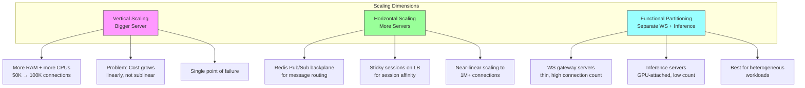
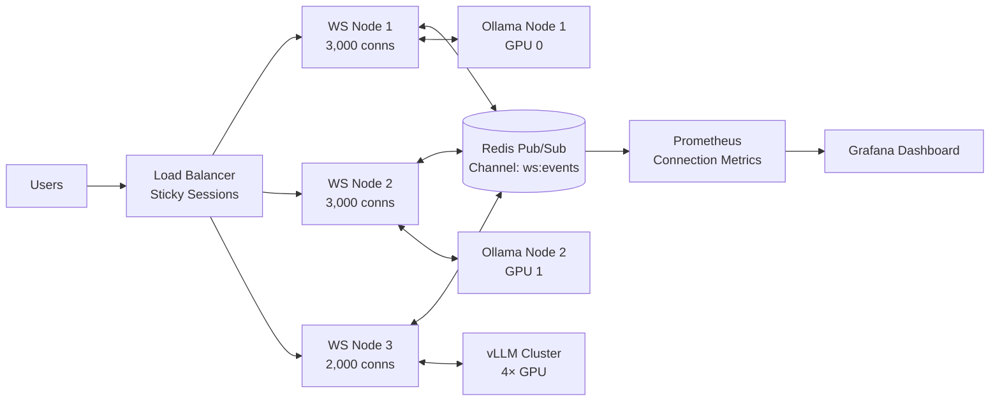
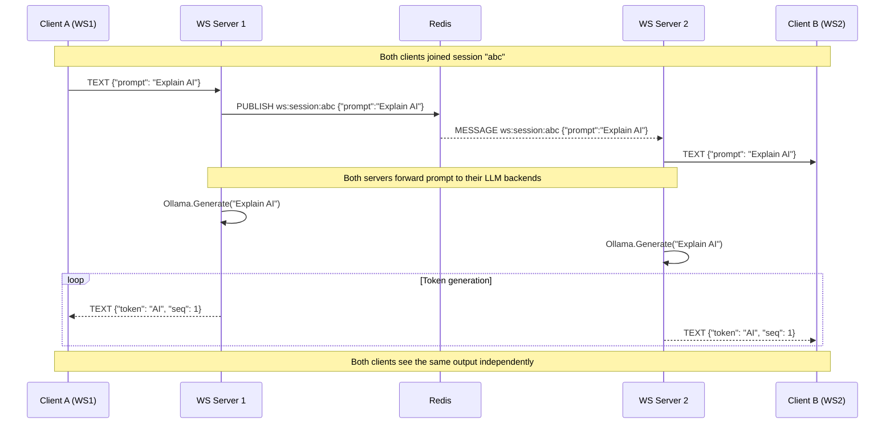
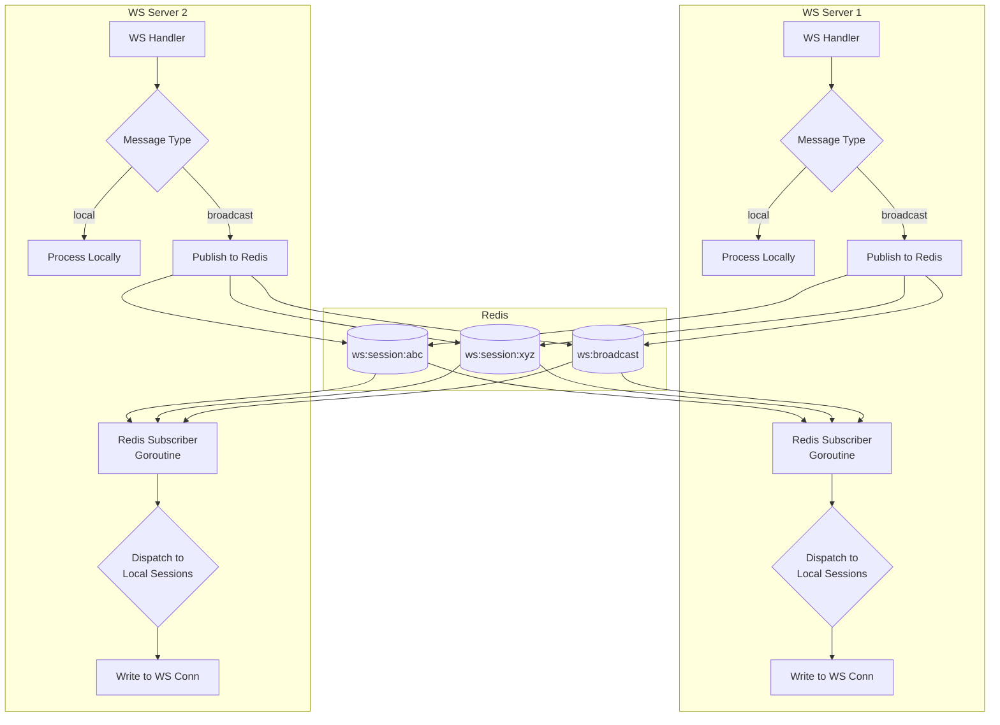
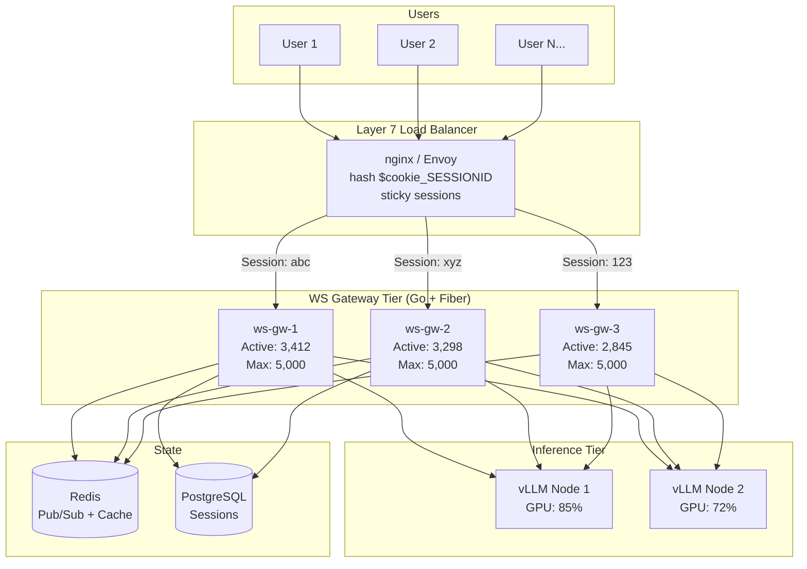
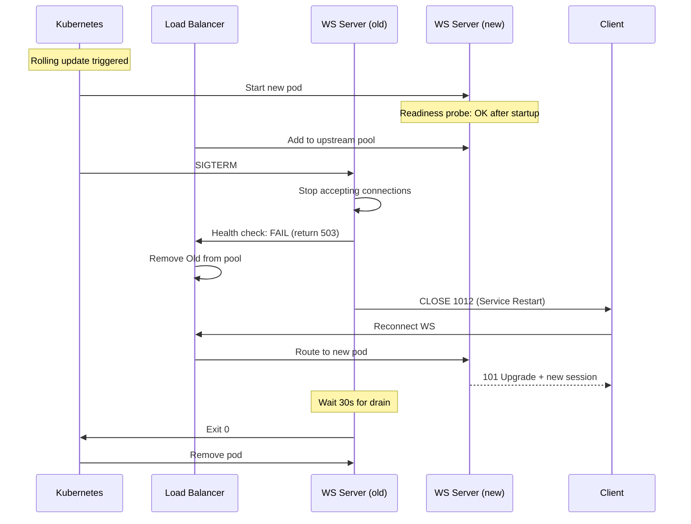
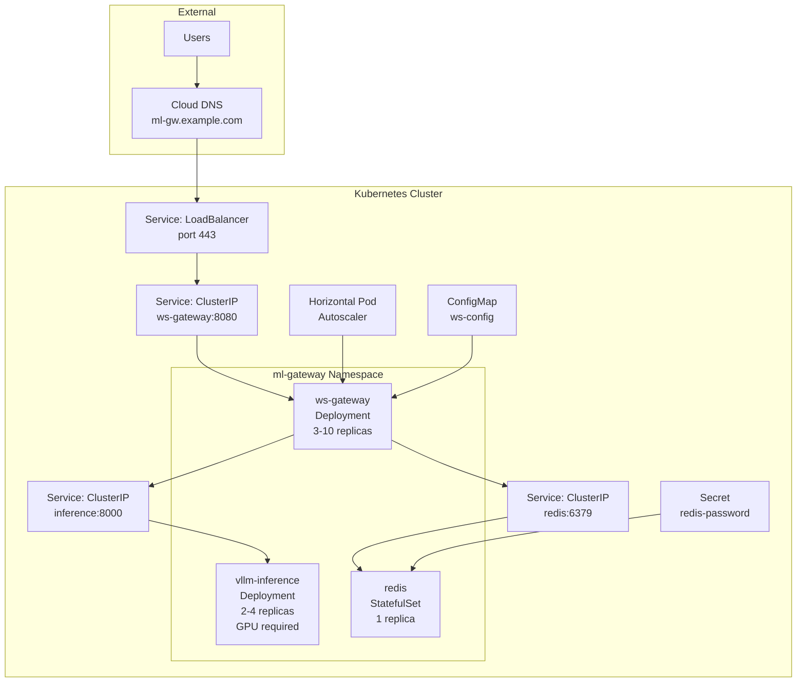

# 📡 Scaling WebSockets for ML Services

## 🎯 Learning Objectives

- Diagnose WebSocket scaling bottlenecks: file descriptors, memory per connection, goroutine limits
- Implement Redis Pub/Sub as a WebSocket backplane for horizontal scaling across multiple server instances
- Manage WebSocket connections in production: sticky sessions, consistent hashing, graceful draining
- Deploy WebSocket-based ML services on Kubernetes with HPA and connection-aware autoscaling

## Introduction

A single Go server can comfortably handle 10,000-50,000 idle WebSocket connections. But when each connection runs a goroutine reading frames, writing tokens, and holding a 256KB buffer, that number drops dramatically. Add GPU inference into the mix—where a single LLM generation can saturate a goroutine for seconds—and the single-server model collapses under real-world load. This is precisely the scaling challenge you'll face when evolving the [[../../../Go Engineering/03 - Microservices with Go/01 - Building APIs with Gin and Fiber|LLM Edge Gateway]] from a single-instance prototype to a multi-instance production service.

This note connects your existing Redis knowledge from the [[../../../Go Engineering/03 - Microservices with Go/01 - Building APIs with Gin and Fiber|LLM Edge Gateway's caching layer]] to WebSocket backplane patterns, and builds on Kubernetes experience from [[../../06 - Cloud, Infra y Backend/22 - Cloud Computing/02 - Computo en la Nube|cloud infrastructure]] for deployment. The scaling patterns here apply equally to the [[../18 - vLLM and Advanced RAG/01 - vLLM and Production-Grade LLM Serving|vLLM serving infrastructure]] where connection management is the bottleneck between model throughput and user experience.

---

## Module 1: The Scaling Problem 📊

### 1.1 Theoretical Foundation 🧠

WebSocket scaling bottlenecks are fundamentally different from HTTP scaling bottlenecks:

- **HTTP**: Connections are short-lived (ms to seconds). A server can handle 100K requests/second with a thread pool of 100 because connections rotate rapidly.
- **WebSocket**: Connections are long-lived (minutes to hours). 10,000 concurrent connections mean 10,000 open TCP sockets, 10,000 goroutines (in Go), and 10,000 buffer allocations—continuously.

The hard limits on a single Linux server with default settings:
- **File descriptors**: `ulimit -n` typically 1024 by default, can be raised to 1,048,576 (theoretical max)
- **Ephemeral ports**: `net.ipv4.ip_local_port_range` limits outgoing connections; incoming WS connections are on a single listening port, so less constrained
- **Memory**: Each goroutine starts at 2KB stack (grows as needed); each read buffer is typically 4KB-256KB; total: ~300KB per idle WS connection
- **CPU**: Even idle connections consume CPU for PING/PONG handling; at 1ms per PING cycle × 10,000 connections = 10ms CPU burst every 30s (negligible)

The practical limit for a single Go Fiber WebSocket server: ~50,000-100,000 concurrent idle connections on a 32GB node. With active inference (GPU-attached), the limit drops to ~1,000-5,000 active connections because inference workloads consume CPU/GPU for each active goroutine.

### 1.2 Mental Model 📐

```
Single server bottleneck → distributed architecture:

  BEFORE (Single Server):            AFTER (Distributed):
  
  ┌─────────────────────────┐       ┌──────────┐ ┌──────────┐ ┌──────────┐
  │   Fiber Server :8080    │       │ WS Node 1│ │ WS Node 2│ │ WS Node 3│
  │                         │       │ :8080    │ │ :8080    │ │ :8080    │
  │  ● ● ● ● ● ● ● ● ● ●  │       │ ● ● ● ●  │ │ ● ● ● ●  │ │ ● ●     │
  │  ● ● ● ● ● ● ● ● ● ●  │       │          │ │          │ │          │
  │  ● ● ● ● ● ● ● ● ● ●  │       │ 3,000    │ │ 3,000    │ │ 2,000    │
  │  ● ● ● ● ● ● ● ● ● ●  │       │ active   │ │ active   │ │ active   │
  │  ● ● ● ● ● ● ● ● ● ●  │       └────┬─────┘ └────┬─────┘ └────┬─────┘
  │  ● ● ● ● ● ● ● ● ● ●  │            │            │            │
  │  ● ● ● ● ● ● ● ● ● ●  │            └─────────┬──┴────────────┘
  │  ● ● ● ● ● ● ● ● ● ●  │                      │
  │  8,000 connections     │           ┌──────────┴──────────┐
  │  → 2.4GB RAM           │           │   Load Balancer     │
  │  → 8,000 goroutines    │           │ (sticky sessions)   │
  │  → OOM at 10,000+      │           └────────────────────┘
  └─────────────────────────┘
```

```
File descriptor exhaustion scenario:

  Process FDs: ┌──────────────────────────────────────────────┐
               │ Listen socket:          1 fd                 │
               │ Client connections:  9,999 fds               │
               │ Redis connection:        1 fd                │
               │ DB pool:                10 fds               │
               │ Log file:                1 fd                │
               │ Total:             10,012 fds               │
               ├──────────────────────────────────────────────┤
               │ ulimit -n:          1,024 (DEFAULT!)        │
               │                                                   │
               │ FAIL: accept() returns EMFILE (Too many open│
               │ files) after 1,012 connections                │
               │                                              │
               │ FIX: ulimit -n 65535 in systemd unit file    │
               │      + net.core.somaxconn=4096 in sysctl     │
               └──────────────────────────────────────────────┘

```

```
Memory budget for WebSocket ML serving (32GB node):

  ┌────────────────────────────────────────────────────────────┐
  │ Model in GPU VRAM:                    8GB (A10 24GB card)  │
  │────────────────────────────────────────────────────────────│
  │ OS + system daemons:                  2GB                  │
  │ Go runtime + Fiber + app code:        0.5GB                │
  │────────────────────────────────────────────────────────────│
  │ Remaining for connections:           21.5GB                │
  │ Per connection: 2KB stack + 256KB buf + 8KB overhead      │
  │                ≈ 300KB each                               │
  │ Max connections: 21.5GB / 300KB ≈ 73,000 theoretical     │
  │ Safe connections (60% headroom):     ~44,000               │
  │ Active connections (with inference): ~4,000                │
  └────────────────────────────────────────────────────────────┘
```

### 1.3 Syntax and Semantics 📝

**Go: Resource monitoring for WS connections:**

```go
type ConnMetrics struct {
    ActiveConns  atomic.Int64
    TotalCreated atomic.Int64
    TotalClosed  atomic.Int64
    Goroutines   atomic.Int64
}

func (m *ConnMetrics) OnConnect() {
    m.ActiveConns.Add(1)
    m.TotalCreated.Add(1)
    m.Goroutines.Add(2) // reader + writer per connection
}

func (m *ConnMetrics) OnDisconnect() {
    m.ActiveConns.Add(-1)
    m.TotalClosed.Add(1)
    m.Goroutines.Add(-2)
}

// Circuit breaker: reject new connections above threshold
func connectionGuard(metrics *ConnMetrics, maxConns int64) fiber.Handler {
    return func(c *fiber.Ctx) error {
        if metrics.ActiveConns.Load() >= maxConns {
            return c.Status(503).JSON(fiber.Map{
                "error": "Server at capacity, retry later",
                "retry_after_ms": 1000,
            })
        }
        return c.Next()
    }
}
```

### 1.4 Visual Representation 🖼️





### 1.5 Application in ML/AI Systems 🤖

- **Your LLM Edge Gateway**: Currently a single Fiber instance. Adding WS streaming means each active chat session uses a persistent goroutine. At 1,000 concurrent chat users, you need ~300MB just for connection buffers—well within a single server but approaching the point where horizontal scaling should be in the plan.
- **Sudoku Together scaling**: Each game room uses a WebSocket connection. With 10,000 concurrent players, a single Node.js server hits file descriptor limits. The Redis pub/sub backplane (already used for game state) naturally extends to WS message routing.

### 1.6 Common Pitfalls ⚠️ + Tips

| Pitfall | Cause | Fix |
|---------|-------|-----|
| **`EMFILE` on accept()** | `ulimit -n` too low | Set `LimitNOFILE=65535` in systemd unit; verify with `cat /proc/<pid>/limits` |
| **TCP backlog overflow** | `net.core.somaxconn` default 128 | Set to 4096 in sysctl; Fiber `Listen` with `tcp-fast-open` |
| **Goroutine leak from WS** | Read loop doesn't break on error; `defer` doesn't run if blocked | Use `SetReadDeadline` + `select` with context.Done() |
| **OOM from buffer bloat** | writeCh too large or unbuffered goroutine leaks | Set max buffer size; monitor `runtime.NumGoroutine()` in metrics |

### 1.7 Knowledge Check ❓

1. What's the primary bottleneck for a single WebSocket server at 50,000 connections? (Answer: Memory—each connection requires ~300KB, totaling 15GB. CPU for PING/PONG is negligible.)
2. Why use `atomic.Int64` instead of a mutex for connection counters? (Answer: `atomic` operations are lock-free and much faster for simple counters accessed in hot paths like `OnConnect`/`OnDisconnect`.)

---

## Module 2: Redis Pub/Sub as WebSocket Backplane 🔴

### 2.1 Theoretical Foundation 🧠

When you scale WebSocket servers horizontally, a fundamental problem emerges: **how does a message from a client connected to Server A reach a client connected to Server B?** The WebSocket connection is bound to one server process. Without a communication layer between servers, WebSocket-based features like collaborative inference sessions, broadcast notifications, or multi-party chat are impossible across instances.

**Redis Pub/Sub** solves this elegantly:
1. Each WS server subscribes to a Redis channel (e.g., `ws:broadcast:session:<id>`)
2. When Server A receives a message for a session that includes clients on Server B and C, it publishes to Redis
3. Servers B and C receive the published message via their Redis subscription
4. Each server finds its local WebSocket connections for that session and writes the message

This is identical in spirit to the session management pattern in your Sudoku Together project, where Redis broadcasts game moves to all players—except here the "players" are server instances.

### 2.2 Mental Model 📐

```
Redis Pub/Sub message routing between WS servers:

  Client A (→ WS1)              Client B (→ WS3)
       │                              │
  ┌────┴──────────────────────────────┴───────────────────────┐
  │                         Redis                              │
  │                                                           │
  │  PUBLISH ws:session:abc {"token": "Hello"}                │
  │                         │                                 │
  │         ┌───────────────┼───────────────┐                 │
  │         ▼               ▼               ▼                 │
  │    ┌─────────┐    ┌─────────┐    ┌─────────┐              │
  │    │  WS 1   │    │  WS 2   │    │  WS 3   │              │
  │    │         │    │         │    │         │              │
  │    │Session  │    │Session  │    │Session  │              │
  │    │  abc    │    │  (none) │    │  abc    │              │
  │    │  │      │    │         │    │  │      │              │
  │    │  ▼      │    │  skip   │    │  ▼      │              │
  │    │Write WS │    │         │    │Write WS │              │
  │    └────┬────┘    └─────────┘    └────┬────┘              │
  │         │                             │                   │
  └─────────┼─────────────────────────────┼───────────────────┘
            ▼                             ▼
         Client A                      Client B
    (originating)                   (remote)
```

```
Session-based message routing with Redis:

  ┌────────────────────────────────────────────────────┐
  │              Redis Pub/Sub Channels                │
  │                                                    │
  │  ws:session:abc ─── Subscribers: [WS1, WS3]       │
  │  ws:session:xyz ─── Subscribers: [WS2]            │
  │  ws:broadcast    ─── Subscribers: [WS1, WS2, WS3]  │
  │  ws:control      ─── Subscribers: [WS1, WS2, WS3]  │
  │                                                    │
  │  Channel naming convention:                        │
  │    ws:<scope>:<id>                                 │
  │                                                    │
  │  Subscriptions are per-server-process, not per-    │
  │  connection. A single Redis client handles all     │
  │  pub/sub for one WS server instance.               │
  └────────────────────────────────────────────────────┘
```

```
Message flow for collaborative LLM inference session:

  ┌──────────┐     ┌──────────┐     ┌──────────┐
  │ Client A │     │   WS 1   │     │  Redis   │
  │ (author) │     │          │     │          │
  │          │────>│ Incoming │     │          │
  │ "Explain │     │ prompt   │     │          │
  │  gravity"│     │          │     │          │
  └──────────┘     │ ┌──────┐ │     │          │
                   │ │Publish│─────>│ Channel  │
  ┌──────────┐     │ └──────┘ │     │ ws:      │
  │ Client B │     │          │     │ session: │
  │(observer)│     │          │     │ g123     │
  │          │<────│ Subscribe│<────│          │
  └──────────┘     │ (token   │     └──────────┘
                   │  stream) │
  ┌──────────┐     │          │
  │ Client C │     │ Any WS   │
  │(observer)│<────│ instance │
  │          │     │ can      │
  └──────────┘     │ serve    │
                   │ this     │
                   │ session  │
                   └──────────┘
```

### 2.3 Syntax and Semantics 📝

**Go: Redis Pub/Sub backplane for WS servers:**

```go
type WSBus struct {
    rdb        *redis.Client
    pubsub     *redis.PubSub
    localConns sync.Map // sessionID → map[connID]*websocket.Conn
}

func NewWSBus(rdb *redis.Client) *WSBus {
    return &WSBus{
        rdb: rdb,
        pubsub: rdb.Subscribe(context.Background(),
            "ws:session:*",
            "ws:broadcast",
            "ws:control"),
    }
}

func (b *WSBus) PublishToSession(sessionID string, msg []byte) error {
    return b.rdb.Publish(context.Background(),
        "ws:session:"+sessionID, msg).Err()
}

func (b *WSBus) Listen(ctx context.Context) {
    ch := b.pubsub.Channel()
    for {
        select {
        case msg := <-ch:
            b.routeMessage(msg)
        case <-ctx.Done():
            b.pubsub.Close()
            return
        }
    }
}

func (b *WSBus) routeMessage(msg *redis.Message) {
    channel := msg.Channel
    var sessionID string
    if strings.HasPrefix(channel, "ws:session:") {
        sessionID = strings.TrimPrefix(channel, "ws:session:")
    }

    if conns, ok := b.localConns.Load(sessionID); ok {
        for connID, conn := range conns.(map[string]*websocket.Conn) {
            if err := conn.WriteMessage(
                websocket.TextMessage,
                []byte(msg.Payload)); err != nil {
                conns.(map[string]*websocket.Conn)[connID] = nil
            }
        }
    }
}

func (b *WSBus) RegisterConnection(sessionID, connID string, conn *websocket.Conn) {
    conns, _ := b.localConns.LoadOrStore(sessionID,
        &sync.Map{})
    conns.(*sync.Map).Store(connID, conn)
}

func (b *WSBus) UnregisterConnection(sessionID, connID string) {
    if conns, ok := b.localConns.Load(sessionID); ok {
        conns.(*sync.Map).Delete(connID)
    }
}
```

**Go: Fiber WS + Redis integration:**

```go
func wsChatHandler(bus *WSBus) fiber.Handler {
    return websocket.New(func(c *websocket.Conn) {
        sessionID := c.Params("sessionID")
        connID := uuid.New().String()

        bus.RegisterConnection(sessionID, connID, c)
        defer bus.UnregisterConnection(sessionID, connID)

        for {
            mt, msg, err := c.ReadMessage()
            if err != nil { break }

            if mt == websocket.TextMessage {
                // Broadcast to ALL instances via Redis
                bus.PublishToSession(sessionID, msg)
            }
        }
    })
}
```

### 2.4 Visual Representation 🖼️





### 2.5 Application in ML/AI Systems 🤖

- **[[../../../Go Engineering/03 - Microservices with Go/01 - Building APIs with Gin and Fiber|LLM Edge Gateway]]**: Add Redis Pub/Sub alongside the existing Redis cache. Each WS server subscribes to `ws:session:*`. With 3 WS servers behind the load balancer, a client connected to any server can participate in any session—the load balancer's sticky session guarantees the same client reaches the same server, but Redis ensures cross-server sessions work.
- **Sudoku Together reference**: Your existing project already uses Redis for game state synchronization. The WebSocket message routing through pub/sub follows the exact same pattern—just with WS frame payloads instead of game state objects.

### 2.6 Common Pitfalls ⚠️ + Tips

| Pitfall | Cause | Solution |
|---------|-------|----------|
| **Redis pub/sub is fire-and-forget** | Messages lost if no subscriber | For critical messages, use Redis Streams (persistent) as a fallback |
| **Duplicate message delivery** | Client connects to WS1 and WS2 simultaneously (race) | Unique session-per-connection; if duplicate detected, close older connection |
| **Memory bloat from sync.Map** | Leaked entries when connections die without cleanup | Periodic GC pass: iterate sessions, remove connections that fail WriteMessage |
| **Redis connection blocking** | PubSub uses dedicated connection; can't share with regular ops | Create separate `redis.Client` for PubSub (`rdbPubSub` vs `rdbCache`) |

### 2.7 Knowledge Check ❓

1. Why use per-session Redis channels instead of one global channel? (Answer: Per-session channels prevent N-squared message amplification. A server with 10,000 local connections across 500 sessions only processes messages for the 20 sessions it actually hosts.)
2. How does the Redis Pub/Sub backplane handle a WS server crash? (Answer: Redis automatically unsubscribes the dead server's connection. Messages published to its sessions are lost because no subscriber exists. Other servers continue unaffected. For persistence, use Redis Streams as a durable fallback.)

---

## Module 3: Connection Management and Load Balancing ⚖️

### 3.1 Theoretical Foundation 🧠

Load balancing WebSocket connections is fundamentally different from HTTP load balancing:

- **HTTP (stateless)**: Any request can go to any server. Round-robin works perfectly.
- **WebSocket (stateful)**: A connection, once established, must stay on the same server for its lifetime because the server holds in-memory session state (inference context, KV-cache pointers, audio buffer).

This requires **sticky sessions** (session affinity) at the load balancer level. The most common approaches:
1. **Cookie-based affinity**: LB sets a cookie (`SERVERID=ws1`); client sends it on upgrade request; LB routes to the server specified.
2. **IP-hash**: LB hashes the client's IP to determine server. Simple but breaks when clients are behind NAT (many clients share one IP).
3. **Consistent hashing**: Maps session IDs to a hash ring of servers. Adding/removing servers minimally reshuffles sessions.

### 3.2 Mental Model 📐

```
Sticky session load balancing:

  Client A (first connection):
    │
    ├── GET /ws HTTP/1.1 ──> [Load Balancer]
    │   Upgrade: websocket            │
    │                                 │ No cookie → LB picks least-loaded server
    │                                 ├──> WS1 (4000 conns) ✓ (least loaded)
    │<── 101 + Set-Cookie: ──────────┤
    │    SERVERID=ws1                 │
    │                                 │
  Client A (reconnect after drop):    │
    │                                 │
    ├── GET /ws HTTP/1.1 ──> [Load Balancer]
    │   Cookie: SERVERID=ws1 ────────>│ Cookie present → route to WS1
    │                                 ├──> WS1 ✓ (resumes session state)

  ┌──────────────────────────────────────────────────────────┐
  │              Consistent Hashing Ring                     │
  │                                                          │
  │                    WS1 (hash: 0x1000)                    │
  │                      ●                                   │
  │                 ╱           ╲                            │
  │               ╱               ╲                          │
  │   WS3 (0xC000) ●               ● WS2 (0x5000)           │
  │               ╲               ╱                          │
  │                 ╲           ╱                            │
  │                    ●                                     │
  │              (virtual nodes)                             │
  │                                                          │
  │  Session "abc" → hash("abc") = 0x7000 → WS2             │
  │  Session "xyz" → hash("xyz") = 0x3000 → WS2             │
  │  Session "123" → hash("123") = 0xA000 → WS3             │
  └──────────────────────────────────────────────────────────┘
```

```
Connection draining during deployment (graceful shutdown):

  ┌─────────────────────────────────────────────────────────────┐
  │  t=0: SIGTERM received by WS Server Node                    │
  │                                                             │
  │  ┌──────────────────────────────────────────────────────┐   │
  │  │ 1. Stop accepting new connections                     │   │
  │  │    - Close listener (no new TCP accepts)              │   │
  │  │    - Return 503 for upgrade attempts via LB health    │   │
  │  │                                                      │   │
  │  │ 2. Notify existing clients (grace period: 30s)       │   │
  │  │    - Send CLOSE 1012 (Service Restart) to each conn  │   │
  │  │    - Client reconnects to different server            │   │
  │  │                                                      │   │
  │  │ 3. Wait for all connections to close                 │   │
  │  │    - Track ActiveConns counter                       │   │
  │  │    - After grace period, force-close remaining        │   │
  │  │                                                      │   │
  │  │ 4. Cleanup and exit                                  │   │
  │  │    - Close Redis pub/sub                             │   │
  │  │    - Flush metrics to Prometheus pushgateway         │   │
  │  │    - os.Exit(0)                                      │   │
  │  └──────────────────────────────────────────────────────┘   │
  └─────────────────────────────────────────────────────────────┘

  Real case: Twitch serves 10M+ concurrent WebSocket connections
  with p99 < 5ms latency using:
    - Envoy proxy for L7 load balancing with ring hash
    - Custom connection draining: 60s grace period
    - Active-active multi-region deployment
    - Consistent hashing by channel ID
```

### 3.3 Syntax and Semantics 📝

**Go: Graceful WebSocket server shutdown:**

```go
func gracefulShutdown(app *fiber.App, bus *WSBus, metrics *ConnMetrics) {
    quit := make(chan os.Signal, 1)
    signal.Notify(quit, syscall.SIGTERM, syscall.SIGINT)
    <-quit

    log.Println("Shutting down...")

    // 1. Stop accepting new connections
    shutdownCtx, cancel := context.WithTimeout(
        context.Background(), 30*time.Second)
    defer cancel()

    // 2. Notify all active WS connections
    bus.localConns.Range(func(sessionID, conns interface{}) bool {
        conns.(*sync.Map).Range(func(connID, conn interface{}) bool {
            c := conn.(*websocket.Conn)
            c.WriteMessage(websocket.CloseMessage,
                websocket.FormatCloseMessage(
                    websocket.CloseServiceRestart,
                    "Server restarting"))
            return true
        })
        return true
    })

    // 3. Wait for connections to drain
    ticker := time.NewTicker(1 * time.Second)
    defer ticker.Stop()
    deadline := time.After(30 * time.Second)

    for {
        if metrics.ActiveConns.Load() == 0 { break }
        select {
        case <-ticker.C:
            log.Printf("Waiting for %d connections to close...",
                metrics.ActiveConns.Load())
        case <-deadline:
            log.Println("Grace period expired, force closing")
            goto forceClose
        }
    }
forceClose:

    // 4. Shutdown Fiber
    app.ShutdownWithContext(shutdownCtx)
    bus.pubsub.Close()
    log.Println("Server stopped")
}
```

**Nginx: WebSocket load balancing configuration:**

```nginx
upstream ws_backend {
    # Consistent hashing by session cookie
    hash $cookie_SESSIONID consistent;

    server ws1.internal:8080 max_conns=5000;
    server ws2.internal:8080 max_conns=5000;
    server ws3.internal:8080 max_conns=5000;

    # Health check for WS endpoints
    # (requires nginx plus or openresty for TCP-level checks)
    # check interval=3000 rise=2 fall=5 timeout=1000;
}

server {
    listen 443 ssl http2;
    server_name ml-gateway.example.com;

    location /ws/ {
        proxy_pass http://ws_backend;
        proxy_http_version 1.1;

        # CRITICAL: These headers enable WebSocket upgrade
        proxy_set_header Upgrade $http_upgrade;
        proxy_set_header Connection "upgrade";
        proxy_set_header Host $host;

        # Timeouts must be long enough for inference sessions
        proxy_read_timeout 3600s;
        proxy_send_timeout 3600s;

        # Disable buffering for streaming
        proxy_buffering off;
    }
}
```

### 3.4 Visual Representation 🖼️





### 3.5 Application in ML/AI Systems 🤖

- **Twitch-scale patterns for ML serving**: Twitch handles 10M+ concurrent WebSocket connections (chat) with P99 < 5ms. Key lessons for ML: (1) keep WS servers thin—no heavy computation, just message routing; (2) offload inference to separate GPU tier; (3) use consistent hashing by session ID to minimize reconnection storms.
- **Connection-aware autoscaling**: Kubernetes HPA on CPU doesn't capture WS scaling needs. Instead, export `active_ws_connections` as a custom metric and scale on `active_connections / max_connections_per_pod > 0.7`.

### 3.6 Common Pitfalls ⚠️ + Tips

| Pitfall | Consequence | Solution |
|---------|-------------|----------|
| **Round-robin without stickiness** | Session state lost on every reconnect | Use `hash $cookie_SESSIONID consistent;` in nginx |
| **LB idle timeout < WS keepalive interval** | Connections silently dropped | LB timeout ≥ 2× WS PING interval |
| **Health check uses HTTP GET** | Returns 200 even when WS upgrade broken | Custom health check: attempt WS upgrade + verify PONG |
| **Drain before new pod ready** | Double the connection load on remaining servers | `minReadySeconds: 30` in K8s; wait for readiness before draining |

### 3.7 Knowledge Check ❓

1. Why doesn't round-robin load balancing work for WebSockets? (Answer: Each WebSocket is stateful—session data lives on the server. If reconnect hits a different server, session state is lost.)
2. What's the key difference between draining WebSocket connections and HTTP connections? (Answer: WebSocket connections are long-lived; draining requires actively notifying clients (CLOSE frame) and waiting for them to reconnect elsewhere. HTTP connections are short-lived and drain naturally.)

---

## Module 4: Kubernetes Deployment ☸️

### 4.1 Theoretical Foundation 🧠

Deploying WebSocket services on Kubernetes introduces specific considerations beyond standard stateless deployments:

- **Deployments vs StatefulSets**: WS servers are stateless (state lives in Redis), so Deployments work. But StatefulSets provide stable pod identities, which can simplify consistent hashing.
- **HPA (Horizontal Pod Autoscaler)**: Cannot use CPU alone—idle WS connections consume negligible CPU. Must use custom metrics (connection count) exposed via Prometheus.
- **Pod lifecycle**: `terminationGracePeriodSeconds` must be long enough for connection draining (recommended: 60-120s for WS).
- **Readiness probes**: Must verify that the WS upgrade endpoint works, not just that the port is open. A `/healthz` endpoint that returns 200 is insufficient—the probe should attempt a WS handshake.

### 4.2 Mental Model 📐

```
K8s resource topology for WS ML deployment:

  ┌─────────────────────────────────────────────────────────────────┐
  │                        Namespace: ml-gateway                    │
  │                                                                 │
  │  ┌──────────────┐  ┌──────────────┐  ┌──────────────────────┐   │
  │  │  Deployment  │  │  Deployment  │  │  StatefulSet         │   │
  │  │  ws-gateway  │  │  inference   │  │  redis               │   │
  │  │              │  │  (vLLM)      │  │                      │   │
  │  │  replicas: 3 │  │  replicas: 2 │  │  replicas: 1         │   │
  │  │  resources:  │  │  resources:  │  │  resources:          │   │
  │  │    cpu: 2    │  │    cpu: 8    │  │    cpu: 1            │   │
  │  │    mem: 8Gi  │  │    mem: 32Gi │  │    mem: 4Gi          │   │
  │  │    nvidia: 0 │  │    nvidia: 1 │  │    nvidia: 0         │   │
  │  └──────┬───────┘  └──────┬───────┘  └──────────┬───────────┘  │
  │         │                  │                      │              │
  │  ┌──────┴──────────────────┴──────────────────────┴──────────┐  │
  │  │                      Services                              │  │
  │  │  ws-gateway: ClusterIP 8080                               │  │
  │  │  inference:   ClusterIP 8000 (vLLM API)                   │  │
  │  │  redis:       ClusterIP 6379                              │  │
  │  └───────────────────────────────────────────────────────────┘  │
  └─────────────────────────────────────────────────────────────────┘
```

```
HPA with connection-aware scaling:

  ┌────────────────────────────────────────────────────┐
  │ Current State:                                     │
  │                                                    │
  │  active_connections_per_pod: [3200, 4100, 3800]   │
  │  avg = 3700                                       │
  │  max_per_pod = 5000                               │
  │                                                    │
  │  utilization = 3700 / 5000 = 74%                   │
  │                                                    │
  │  HPA config:                                       │
  │    minReplicas: 3                                  │
  │    maxReplicas: 10                                 │
  │    targetAverageUtilization: 70                    │
  │                                                    │
  │  Decision: 74% > 70% → scale up to 4 replicas      │
  │                                                    │
  │  New pods: 4                                       │
  │  Connections per: 5000 × 4 = 20,000 capacity       │
  │  Load: 11,100 connections = 55% utilization        │
  └────────────────────────────────────────────────────┘
```

### 4.3 Syntax and Semantics 📝

**Kubernetes: WS Gateway Deployment with graceful shutdown:**

```yaml
apiVersion: apps/v1
kind: Deployment
metadata:
  name: ws-gateway
  namespace: ml-gateway
spec:
  replicas: 3
  strategy:
    type: RollingUpdate
    rollingUpdate:
      maxSurge: 1
      maxUnavailable: 0
  selector:
    matchLabels:
      app: ws-gateway
  template:
    metadata:
      labels:
        app: ws-gateway
      annotations:
        prometheus.io/scrape: "true"
        prometheus.io/port: "9090"
    spec:
      terminationGracePeriodSeconds: 120
      containers:
      - name: ws-gateway
        image: ml-gateway:latest
        ports:
        - containerPort: 8080
          name: ws
        - containerPort: 9090
          name: metrics
        env:
        - name: REDIS_URL
          value: "redis.redis.svc.cluster.local:6379"
        - name: MAX_CONNECTIONS
          value: "5000"
        resources:
          requests:
            cpu: "2"
            memory: "4Gi"
          limits:
            cpu: "4"
            memory: "8Gi"
        readinessProbe:
          httpGet:
            path: /healthz
            port: 8080
          initialDelaySeconds: 5
          periodSeconds: 10
          failureThreshold: 3
        livenessProbe:
          httpGet:
            path: /healthz
            port: 8080
          initialDelaySeconds: 15
          periodSeconds: 20
        lifecycle:
          preStop:
            exec:
              command:
              - /bin/sh
              - -c
              - |
                curl -X POST http://localhost:9090/drain
                sleep 30
```

```yaml
apiVersion: autoscaling/v2
kind: HorizontalPodAutoscaler
metadata:
  name: ws-gateway-hpa
  namespace: ml-gateway
spec:
  scaleTargetRef:
    apiVersion: apps/v1
    kind: Deployment
    name: ws-gateway
  minReplicas: 3
  maxReplicas: 10
  metrics:
  - type: Pods
    pods:
      metric:
        name: ws_active_connections
      target:
        type: AverageValue
        averageValue: "3500"
  - type: Resource
    resource:
      name: cpu
      target:
        type: Utilization
        averageUtilization: 70
```

### 4.4 Visual Representation 🖼️



```mermaid
gantt
    title WebSocket Pod Lifecycle During Rolling Update
    dateFormat HH:MM:SS
    axisFormat %H:%M:%S

    section New Pod
    Pod Created            :n1, 00:00:00, 5s
    Init Containers        :n2, after n1, 3s
    Container Started      :n3, after n2, 2s
    Readiness Probe Passed :milestone, after n3, 10s
    Added to LB Pool       :n4, after n3, 0s
    Ready to Serve         :done, after n3, 10s

    section Old Pod
    SIGTERM Sent           :crit, after n3, 0s
    Drain Notifications    :o1, after n3, 10s
    Wait for Clients       :o2, after o1, 30s
    Force Close + Exit     :o3, after o2, 5s
    Pod Removed            :done, after o3, 0s
```

### 4.5 Application in ML/AI Systems 🤖

- **LLM Edge Gateway on K8s**: Deploy 3× WS gateway pods (no GPU) + 2× vLLM pods (with GPU). The gateway tier handles 10K connections; the inference tier processes the actual LLM requests. Scale them independently: add WS gateways when connection count rises, add vLLM pods when GPU utilization exceeds 80%.
- **Cross-AZ deployment**: Use PodTopologySpread to distribute WS pods across availability zones. Redis replication across AZs for Pub/Sub resilience.
- **Istio/Service Mesh**: Sidecar proxies add latency to WS connections. If using Istio, configure `traffic.sidecar.istio.io/excludeInboundPorts: "8080"` for the WS port to bypass the proxy.

### 4.6 Common Pitfalls ⚠️ + Tips

| Pitfall | Symptom | Fix |
|---------|---------|-----|
| **`terminationGracePeriodSeconds` too short** | Pods killed before connections drain → 1006 abnormal closures | Set to 120s (2× your WS drain timeout) |
| **HPA only on CPU** | Idle WS connections trigger scale-down → connection loss | Always include custom metric `ws_active_connections` in HPA |
| **Readiness probe doesn't check WS** | Pod marked ready before WebSocket handler initialized | Custom WS health check: attempt upgrade, expect 101 |
| **`maxUnavailable: 0` causes stuck deploy** | Pod can't drain because clients keep reconnecting | Set `maxUnavailable: 1` or implement client-side reconnect with backoff |
| **NVIDIA GPU not available in some nodes** | Inference pod stuck pending | Use `nodeSelector` or `affinity` with GPU label; add tolerations |

### 4.7 Knowledge Check ❓

1. Why use `maxUnavailable: 0` for a WebSocket deployment? (Answer: To ensure no loss of serving capacity during rolling updates. One new pod must be ready before an old pod terminates.)
2. Why is CPU-based HPA alone insufficient for WS services? (Answer: Idle WS connections consume negligible CPU. A server with 5,000 idle connections has the same CPU as one with 50. Scaling decisions must use connection count, not CPU.)

---

## 📦 Compression Code

```yaml
scaling_checklist:
  single_server:
    - ulimit -n 65535
    - net.core.somaxconn=4096
    - connection_guard: reject above maxConns
    - graceful_shutdown: 30s drain + CLOSE 1012

  horizontal:
    - redis_pubsub_backplane: per-session channels
    - sticky_sessions: hash $cookie_SESSIONID
    - consistent_hashing: session_id → pod mapping

  kubernetes:
    - terminationGracePeriodSeconds: 120
    - hpa_metrics: [cpu, ws_active_connections]
    - readiness_probe: ws_handshake_check
    - pod_anti_affinity: spread across AZs

  monitoring:
    - active_connections gauge
    - messages_per_second counter
    - redis_pubsub_latency histogram
    - connection_churn rate
```

## 🎯 Documented Project

Scale the LLM Edge Gateway from a single Fiber instance to a 3-node cluster. Implement: (1) Redis Pub/Sub backplane for cross-server message routing, (2) nginx sticky session configuration, (3) K8s deployment with connection-aware HPA, (4) graceful shutdown that drains connections. Benchmark with `websocat` or a custom Go load generator to verify: 15,000 connections across 3 nodes with <5ms message routing latency.

## 🎯 Key Takeaways

- A single Go/Fiber server hits ~50K WS connections before memory becomes the bottleneck
- Redis Pub/Sub mirrors your existing caching pattern—extend it to message routing for cross-server sessions
- Sticky sessions are mandatory for WebSocket; consistent hashing minimizes disruption during scaling
- K8s HPA on CPU alone will kill idle connections—always include `ws_active_connections` as a custom scaling metric
- Graceful shutdown with 30-60s drain time is non-negotiable for production WS deployments

## References

- nginx WebSocket proxying — https://nginx.org/en/docs/http/websocket.html
- Redis Pub/Sub — https://redis.io/docs/latest/develop/interact/pubsub/
- [[../../../Go Engineering/03 - Microservices with Go/04 - Testing Microservices in Go|Testing Microservices in Go]] — load test your WS endpoints
- [[../../../Go Engineering/03 - Microservices with Go/05 - Rate Limiting and Circuit Breakers|Rate Limiting and Circuit Breakers]]
- [[../../06 - Cloud, Infra y Backend/22 - Cloud Computing/05 - Caso Practico - Arquitectura Cloud para ML|Cloud Architecture for ML]]
