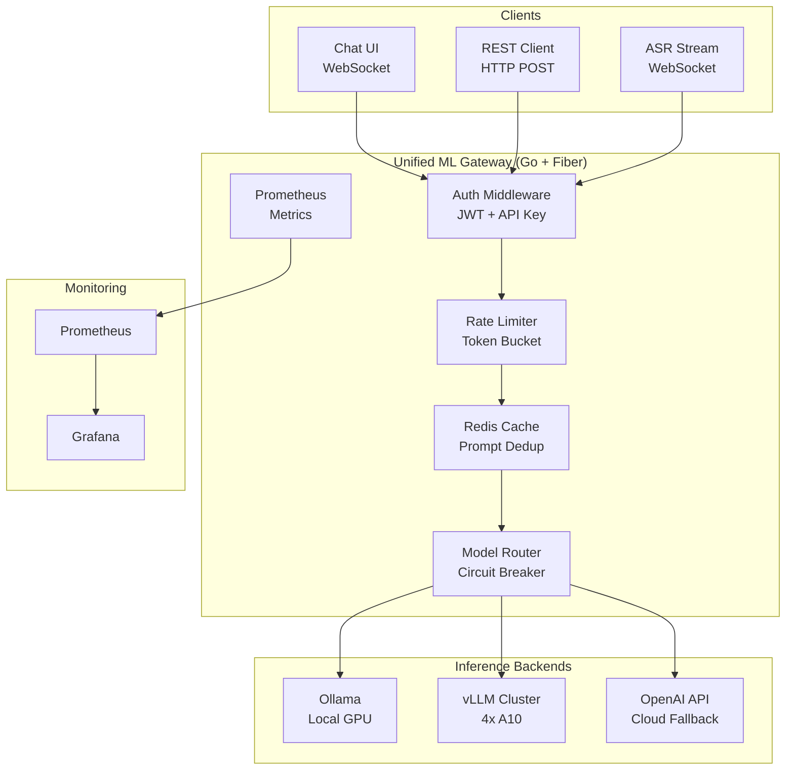
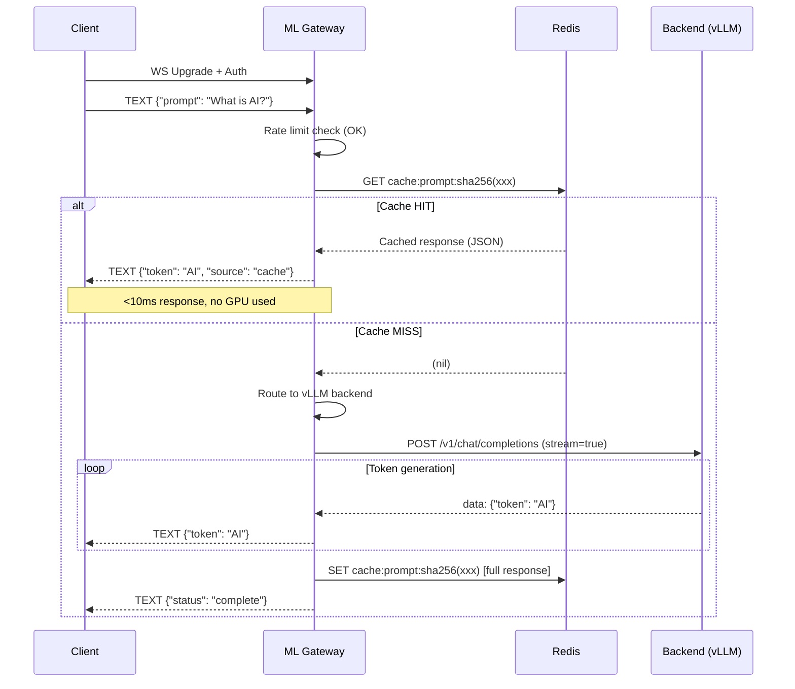
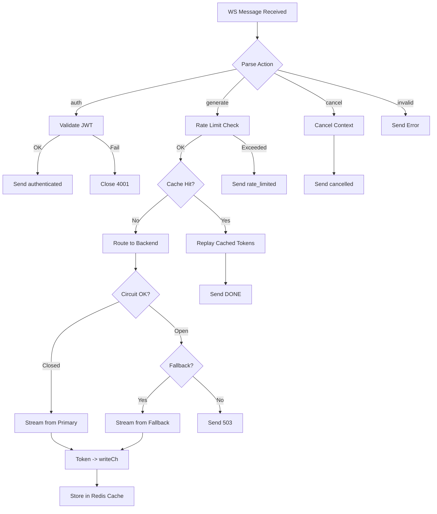
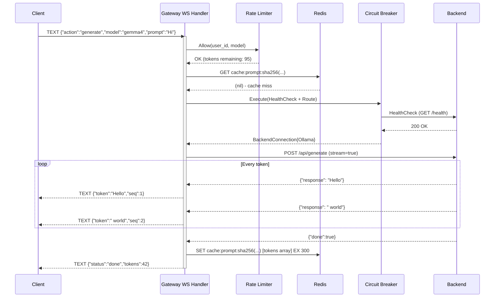
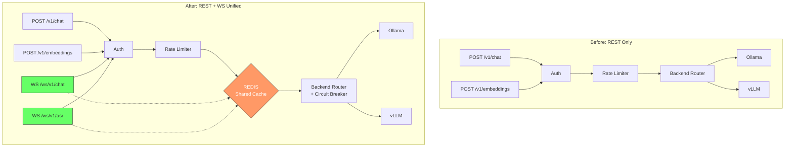
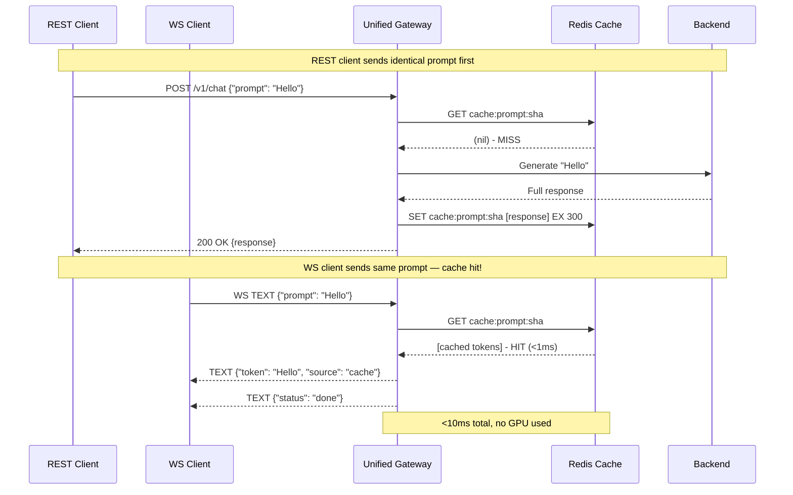
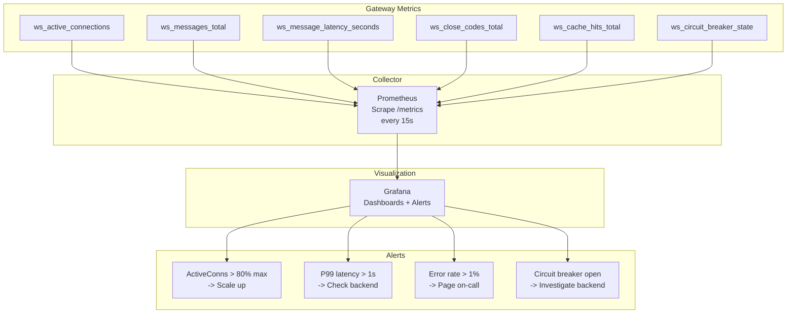
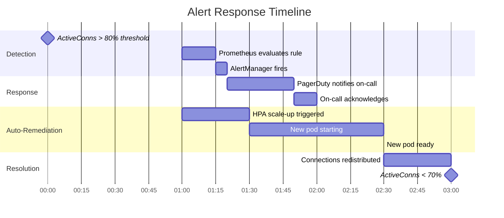

# 🏗️ Real-Time ML Gateway with WebSockets

## 🎯 Learning Objectives

- Architect a unified ML gateway that serves REST (one-shot) and WebSocket (streaming) from a single Go/Fiber process
- Route WebSocket inference requests to heterogeneous backends: vLLM, Ollama, remote APIs
- Integrate WebSocket streaming into your existing LLM Edge Gateway with sub-10ms cached responses
- Instrument production WS metrics: connection churn, latency histograms, error rates in Prometheus + Grafana

## Introduction

The final evolution of your ML infrastructure is the **Unified Real-Time ML Gateway**: a single Go/Fiber service that serves REST endpoints for embeddings, token counting, and model listing, alongside WebSocket endpoints for streaming chat, real-time ASR, and live video inference. This is not a new service—it's the natural extension of the [[../../../Go Engineering/03 - Microservices with Go/01 - Building APIs with Gin and Fiber|LLM Edge Gateway]] you've already built, enhanced with bidirectional streaming capabilities.

The gateway pattern solves a real problem in ML serving: backends like vLLM, Ollama, and cloud APIs each have different interfaces (SSE, REST, gRPC), authentication models, and rate limits. A unified gateway abstracts these differences behind a consistent API—REST for simple queries, WebSocket for streaming inference. Your existing knowledge of [[../../../Go Engineering/03 - Microservices with Go/05 - Rate Limiting and Circuit Breakers|circuit breakers]], [[../../../Go Engineering/05 - Local AI with Go/04 - RAG Pipelines with Go and Vector DBs|RAG pipelines]], and [[../../06 - Cloud, Infra y Backend/24 - Backend para ML/03 - Microservicios y Arquitectura de Eventos|microservice architecture]] converges here into a single, cohesive system.

---

## Module 1: Architecture Overview 🏛️

### 1.1 Theoretical Foundation 🧠

A Unified ML Gateway sits between clients and inference backends, providing:

1. **Protocol translation**: Client connects via WebSocket → gateway translates to backend-native protocol (SSE for Ollama, REST for vLLM, gRPC for internal services)
2. **Centralized concerns**: Authentication, rate limiting, caching, circuit breaking—applied once at the gateway, not duplicated in every backend
3. **Session management**: WebSocket connections represent persistent sessions. The gateway tracks session state, routes messages to the correct backend, and handles reconnection gracefully
4. **Model routing**: Based on request parameters (model name, task type, priority tier), the gateway routes to the appropriate backend: local Ollama for development, vLLM cluster for production, cloud API for overflow

The gateway is NOT an inference engine—it's a **smart proxy** that handles the last mile of protocol transformation and operational concerns, leaving heavy GPU compute to specialized backends.

### 1.2 Mental Model 📐

```
Unified ML Gateway Architecture:

                    ┌────────────────────────────────────┐
                    │           ML Gateway                │
                    │         (Go + Fiber)                │
                    │                                    │
  Client A --WS-->  │  ┌──────────────────────────────┐  │
  (chat UI)         │  │   WS Handler (/ws/chat)      │  │
                    │  │   - Auth (JWT in first msg)  │  │
  Client B -REST->  │  │   - Rate limit per session   │  │
  (batch job)       │  │   - Session management        │  │
                    │  └──────────┬───────────────────┘  │
  Client C --WS-->  │             │                       │
  (ASR stream)      │  ┌──────────┴───────────────────┐  │
                    │  │   Request Router             │  │
                    │  │   - Model -> Backend mapping  │  │
                    │  │   - Circuit breaker per BE   │  │
                    │  │   - Retry with fallback       │  │
                    │  └──┬──────┬──────┬────────────┘  │
                    │     │      │      │                │
                    └─────┼──────┼──────┼────────────────┘
                          │      │      │
                    ┌─────┘      │      └───────────┐
                    v            v                  v
              ┌─────────┐ ┌──────────┐ ┌──────────────┐
              │ Ollama  │ │  vLLM    │ │  OpenAI API  │
              │ (local) │ │ (cluster)│ │  (cloud fallb)│
              └─────────┘ └──────────┘ └──────────────┘

  Caching Layer: ┌──────────┐
                 │  Redis    │  <-- Checked BEFORE routing to backend
                 │  <10ms    │      5-min TTL for identical prompts
                 │  response │      Shared between REST and WS endpoints
                 └──────────┘
```

```
Request routing flow through the gateway:

  WS Message Arrives:
  │
  ├──> 1. DESERIALIZE: {"action":"generate","model":"gemma4","prompt":"..."}
  │
  ├──> 2. AUTHENTICATE: Extract JWT from first message or URL param
  │    └─ Fail? → CLOSE 4001 (auth failure) + close connection
  │
  ├──> 3. RATE LIMIT: Check token bucket for this session/user
  │    └─ Exceeded? → TEXT {"error":"rate_limited","retry_after_ms":5000}
  │
  ├──> 4. CACHE CHECK: Redis GET "cache:prompt:<sha256(prompt)>"
  │    └─ HIT? → Write cached response directly to WS (skip backend)
  │
  ├──> 5. ROUTE: modelIndex.Lookup("gemma4") → Backend{Ollama,"localhost:11434"}
  │    └─ Circuit OPEN? → Fallback to next backend or return 503
  │
  └──> 6. EXECUTE: backend.StreamInference(ctx, prompt)
       │
       └──> Write tokens to WS as they arrive
            └──> Also cache: Redis SET "cache:prompt:<sha>" full_response
```

```
Multi-backend model routing table:

  ┌─────────────┬──────────────┬─────────────┬──────────┬──────────┐
  │ Model       │ Primary BE   │ Fallback BE │ Priority │ Max Tok │
  ├─────────────┼──────────────┼─────────────┼──────────┼──────────┤
  │ gemma4:9b   │ Ollama       │ OpenAI      │ normal   │ 8192     │
  │ llava:13b   │ Ollama       │ (none)      │ normal   │ 4096     │
  │ mixtral:8x7b│ vLLM cluster │ Ollama      │ high     │ 32768    │
  │ whisper     │ Ollama       │ (none)      │ normal   │ N/A      │
  │ gpt-4o      │ OpenAI API   │ vLLM        │ low      │ 128K     │
  │ embeddings  │ vLLM cluster │ OpenAI      │ normal   │ N/A      │
  └─────────────┴──────────────┴─────────────┴──────────┴──────────┘
```

### 1.3 Syntax and Semantics 📝

**Go: Gateway main structure:**

```go
type UnifiedGateway struct {
    app        *fiber.App
    redis      *redis.Client
    backends   map[string]*BackendPool
    router     *ModelRouter
    rateLimiter *RateLimiter
}

type BackendPool struct {
    Primary *Backend
    Fallback *Backend
    Circuit circuit.Breaker
}

type Backend struct {
    Name string
    URL  string
    Type BackendType // REST, SSE, gRPC, Local
}

type BackendType int

const (
    BackendREST BackendType = iota
    BackendSSE
    BackendGRPC
    BackendLocal // Ollama, local process
)
```

### 1.4 Visual Representation 🖼️





### 1.5 Application in ML/AI Systems 🤖

- **Your LLM Edge Gateway**: The gateway pattern unifies what was previously fragmented: REST endpoints for embeddings + WS endpoints for streaming chat. A single Fiber app serves both, sharing the Redis cache, rate limiter, and circuit breaker.
- **Cost optimization**: Cache near-identical prompts. If 30% of LLM requests are semantically identical ("Explain what an API is"), the cache absorbs them at Redis speed (<1ms) instead of GPU cost.
- **Graceful degradation**: If vLLM cluster is overloaded (circuit open), fall back to Ollama or OpenAI API transparently. The client sees the same token stream regardless of which backend served it.

### 1.6 Common Pitfalls ⚠️ + Tips

| Pitfall | Why | Fix |
|---------|-----|-----|
| **Cache poisoning with non-deterministic output** | Same prompt, different responses (temperature > 0) | Only cache when `temperature = 0` or `seed` is provided |
| **Circuit breaker triggers for WS reads too** | Circuit breaker on write path; read path hangs waiting | Per-backend context with timeout; if backend hangs > 30s, force circuit open |
| **Auth token expires mid-session** | JWT validated on WS connect, but session lasts hours | Short-lived JWT + refresh via WS control message; validate on first message |
| **Gateway becomes bottleneck** | 10K WS connections × 300KB = 3GB + routing overhead | Separate gateway and inference tiers; gateway is thin (no GPU), inference is thick (GPU) |

### 1.7 Knowledge Check ❓

1. Why shouldn't the gateway perform model inference itself? (Answer: Separation of concerns. The gateway handles protocol translation and operational concerns; specialized backends handle GPU compute. Mixing them creates deployment coupling and resource contention.)
2. What's the advantage of checking the cache BEFORE routing to a backend? (Answer: Cache hits avoid backend calls entirely, saving GPU cycles, reducing latency from ~200ms to <10ms, and preventing unnecessary load on the inference tier.)

---

## Module 2: Building the Gateway in Go + Fiber 🔧

### 2.1 Theoretical Foundation 🧠

The gateway's WebSocket handler must do more than a simple echo server. It needs to:

1. **Authenticate** on the first message (JWT token, API key)
2. **Route** to the correct backend based on model selection
3. **Manage sessions** — track active inference contexts, support cancellation
4. **Apply rate limits** — per-user, per-model, per-IP
5. **Bridge protocols** — translate WS TEXT frames to backend-native protocols (SSE, REST, gRPC)
6. **Handle errors gracefully** — backend failure → clean CLOSE frame with meaningful code

### 2.2 Mental Model 📐

```
Gateway request routing flow:

  Client Message ──> ┌─────────────────────────────────────────┐
                     │           wsInferenceHandler             │
                     │                                          │
                     │  switch msg.Action {                     │
                     │  case "auth":                            │
                     │    ┌─ validateJWT(msg.token) ──┐         │
                     │    │                           │         │
                     │  case "generate":              │         │
                     │    ┌─ rateLimit() ──┐          │         │
                     │    │                │          │         │
                     │    ├─ cacheCheck() ─┤          │         │
                     │    │                │          │         │
                     │    ├─ routeBackend()-┤         │         │
                     │    │                │          │         │
                     │    └─ streamToWS() ─┘          │         │
                     │                                │         │
                     │  case "cancel":                │         │
                     │    └─ ctx.Cancel()             │         │
                     │                                │         │
                     │  case "refresh_token":         │         │
                     │    └─ issueNewJWT()            │         │
                     │  }                                      │
                     └─────────────────────────────────────────┘
```

```
Session lifecycle managed by the gateway:

  ┌─ Authenticated ─┐
  │                  │
  │  Client          │    
  │  connects        │<── JWT validated → session created (Redis: session:{id})
  │  + auth msg      │
  └──────┬───────────┘
         │
  ┌──────┴───────────┐
  │                  │
  │  Idle            │<── Waiting for "generate" action
  │  (can reconnect) │
  │                  │
  └──────┬───────────┘
         │
  ┌──────┴───────────┐
  │                  │
  │  Generating      │<── Backend streaming tokens → writes to WS
  │  (active)        │    Can receive "cancel" at any time
  │                  │
  └──────┬───────────┘
         │
  ┌──────┴───────────┐
  │                  │
  │  Disconnecting   │<── CLOSE sent, connection being cleaned
  │  (grace period)  │    Session state saved to Redis for reconnect
  │                  │
  └──────┬───────────┘
         │
         v
      [Closed]
```

```
Error handling flow with WebSocket close codes:

  Error Type         →  Close Code  →  Client Action
  ─────────────────────────────────────────────────
  Auth failure       →  4001        →  Re-authenticate
  Rate limited       →  4002        →  Backoff + retry
  Model unavailable  →  4003        →  Try fallback model
  Backend timeout    →  4004        →  Retry with fresh session
  Internal error     →  1011        →  Report to support
  Normal close       →  1000        →  Done
```

### 2.3 Syntax and Semantics 📝

**Go: Complete gateway WebSocket handler:**

```go
type WSAction struct {
    Action    string          `json:"action"`
    Token     string          `json:"token,omitempty"`
    SessionID string          `json:"session_id,omitempty"`
    Model     string          `json:"model,omitempty"`
    Prompt    json.RawMessage `json:"prompt,omitempty"`
}

func (gw *UnifiedGateway) wsInferenceHandler(c *websocket.Conn) {
    var (
        session   *Session
        authOK    bool
        writeCh   = make(chan *WSEvent, 256)
        ctx, cancel = context.WithCancel(context.Background())
    )
    defer cancel()
    defer c.Close()

    // Writer goroutine: single point of output
    go func() {
        for {
            select {
            case evt := <-writeCh:
                if evt == nil { return }
                c.WriteMessage(evt.MsgType, evt.Payload)
            case <-ctx.Done():
                return
            }
        }
    }()

    // Reader loop
    for {
        _, msg, err := c.ReadMessage()
        if err != nil { break }

        var action WSAction
        if err := json.Unmarshal(msg, &action); err != nil {
            writeCh <- ErrorEvent("invalid_message_format")
            continue
        }

        switch action.Action {
        case "auth":
            session, authOK = gw.authenticate(action.Token)
            if !authOK {
                writeCh <- CloseEvent(4001, "Authentication failed")
                return
            }
            writeCh <- OKEvent("authenticated")

        case "generate":
            if !authOK {
                writeCh <- ErrorEvent("not_authenticated")
                continue
            }
            if !gw.rateLimiter.Allow(session.UserID, action.Model) {
                writeCh <- ErrorEvent("rate_limited")
                continue
            }
            go gw.streamInference(ctx, session, action, writeCh)

        case "cancel":
            cancel() // Abort current generation
            ctx, cancel = context.WithCancel(context.Background())
            writeCh <- OKEvent("cancelled")
        }
    }
}

func (gw *UnifiedGateway) streamInference(
    ctx context.Context,
    session *Session,
    action WSAction,
    writeCh chan<- *WSEvent,
) {
    // Route to backend
    backend := gw.router.Resolve(action.Model)
    if backend == nil {
        writeCh <- ErrorEvent("model_not_found")
        return
    }

    // Check cache
    cacheKey := fmt.Sprintf("cache:prompt:%x",
        sha256.Sum256([]byte(action.Prompt)))
    if cached, err := gw.redis.Get(ctx, cacheKey).Result(); err == nil {
        // Replay cached tokens
        var tokens []string
        json.Unmarshal([]byte(cached), &tokens)
        for _, t := range tokens {
            writeCh <- TokenEvent(t)
        }
        writeCh <- DoneEvent()
        return
    }

    // Stream from backend
    var fullResponse []string
    err := backend.Stream(ctx, action, func(token string) bool {
        select {
        case <-ctx.Done():
            return false // Stop streaming
        default:
        }
        fullResponse = append(fullResponse, token)
        writeCh <- TokenEvent(token)
        return true // Continue
    })

    if err == nil {
        // Cache the full response
        cached, _ := json.Marshal(fullResponse)
        gw.redis.Set(ctx, cacheKey, cached, 5*time.Minute)
        writeCh <- DoneEvent()
    } else {
        writeCh <- ErrorEvent("backend_error: " + err.Error())
    }
}
```

**Go: Model router with circuit breaker:**

```go
type ModelRouter struct {
    routes   map[string]*BackendRoute
    circuits map[string]*gobreaker.CircuitBreaker
    mu       sync.RWMutex
}

type BackendRoute struct {
    Model    string
    Primary  *BackendConnection
    Fallback *BackendConnection
}

func (r *ModelRouter) Resolve(model string) (*BackendConnection, error) {
    r.mu.RLock()
    route, ok := r.routes[model]
    r.mu.RUnlock()

    if !ok {
        return nil, fmt.Errorf("model %s not found", model)
    }

    cb := r.circuits[model]
    result, err := cb.Execute(func() (interface{}, error) {
        return route.Primary, route.Primary.HealthCheck()
    })

    if err != nil {
        if route.Fallback != nil {
            log.Printf("Circuit open for %s, using fallback %s",
                model, route.Fallback.Name)
            return route.Fallback, nil
        }
        return nil, err
    }

    return result.(*BackendConnection), nil
}
```

### 2.4 Visual Representation 🖼️





### 2.5 Application in ML/AI Systems 🤖

- **LLM Edge Gateway integration**: This is the exact `wsInferenceHandler` you'll add to your existing gateway. The REST endpoints for embeddings stay untouched—you just register a new `/ws/v1/chat` route alongside the existing `/v1/chat/completions`.
- **Multi-tenant isolation**: Different session IDs → different rate limit buckets → no cross-tenant interference. Each session gets its own Redis key for caching.
- **A/B testing**: Route 90% of traffic to primary backend (stable vLLM), 10% to experimental backend (new model version). Track token quality and latency per backend in metrics.

### 2.6 Common Pitfalls ⚠️ + Tips

| Pitfall | Cause | Fix |
|---------|-------|-----|
| **`writeCh` blocks on slow client** | Channel full, writer goroutine stuck on `conn.WriteMessage` | Use `select` with `default` for non-blocking write attempt; drop token if buffer full, increment metric |
| **Circuit breaker never opens for slow backend** | Default gobreaker counts timeout as success after recovery | Set `Timeout` short (< 5s) and `ReadyToTrip` with count-based threshold |
| **Cache key collision for different params** | Only hash prompt, ignore temperature/top_p | Include `sha256(prompt + temperature + max_tokens + seed)` in cache key |
| **Race on session map** | Multiple goroutines reading/writing `sessions` map | Use `sync.Map` or `sync.RWMutex`; prefer per-connection context over shared map |

### 2.7 Knowledge Check ❓

1. Why serialize all WS writes through a single goroutine (`writeCh`)? (Answer: Concurrent writes to a WebSocket connection cause frame interleaving—corrupted messages. A single writer goroutine serializes access.)
2. What's the purpose of the circuit breaker in the model router? (Answer: If a backend is consistently failing or timing out, the circuit breaker prevents the gateway from wasting resources on guaranteed-to-fail requests and routes to a fallback instead.)

---

## Module 3: Enhancing the LLM Edge Gateway 🔗

### 3.1 Theoretical Foundation 🧠

This module is the direct integration point—showing how to enhance your existing [[../../../Go Engineering/03 - Microservices with Go/01 - Building APIs with Gin and Fiber|LLM Edge Gateway]] with WebSocket streaming. The key insight: **your existing infrastructure (auth, rate limiting, Redis cache, circuit breaker) applies to WebSocket connections with minimal changes**.

The only new components needed are:
1. A WebSocket handler registered alongside existing REST handlers
2. A protocol bridge (SSE ↔ WebSocket)
3. Session management (session ID → connection tracking)
4. WebSocket-specific close codes for error signaling

Everything else—Redis cache, rate limiter token buckets, authentication middleware, model routing logic—is **shared** between REST and WS endpoints.

### 3.2 Mental Model 📐

```
Before: REST-only LLM Edge Gateway

  ┌─────────────────────────────────────────┐
  │            LLM Edge Gateway              │
  │                                          │
  │  POST /v1/chat/completions              │
  │  POST /v1/embeddings                    │
  │  GET  /v1/models                        │
  │                                          │
  │  Shared:                                 │
  │  ┌─ Auth middleware                     │
  │  ├─ Rate limiter                        │
  │  ├─ Redis (cache + sessions)            │
  │  └─ Circuit breaker                     │
  └─────────────────────────────────────────┘


After: REST + WebSocket Unified Gateway

  ┌─────────────────────────────────────────────┐
  │          Unified ML Gateway                  │
  │                                              │
  │  REST Endpoints           WS Endpoints       │
  │  ─────────────            ────────────       │
  │  POST /v1/chat            WS /ws/v1/chat     │
  │  POST /v1/embeddings      WS /ws/v1/asr      │
  │  GET  /v1/models           WS /ws/v1/detect  │
  │                                              │
  │  Shared Infrastructure (unchanged):          │
  │  ┌─ Auth middleware ──────────────────┐      │
  │  ├─ Rate limiter    ──────────────────┤      │
  │  ├─ Redis (cache + sessions) ─────────┤      │
  │  ├─ Circuit breaker ──────────────────┤      │
  │  └─ Model router    ──────────────────┘      │
  └──────────────────────────────────────────────┘
```

### 3.3 Syntax and Semantics 📝

**Go: Before (REST-only) vs After (REST + WS):**

```go
// ─── BEFORE: REST-only gateway ───

func setupRoutes(app *fiber.App, gw *LLMGateway) {
    api := app.Group("/v1", authMiddleware)

    api.Post("/chat/completions", gw.chatHandler)
    api.Post("/embeddings", gw.embeddingsHandler)
    api.Get("/models", gw.listModelsHandler)
}

// ─── AFTER: REST + WebSocket unified gateway ───

func setupRoutes(app *fiber.App, gw *UnifiedGateway) {
    api := app.Group("/v1", authMiddleware)

    // REST endpoints (unchanged)
    api.Post("/chat/completions", gw.chatHandler)
    api.Post("/embeddings", gw.embeddingsHandler)
    api.Get("/models", gw.listModelsHandler)

    // WebSocket endpoints (NEW)
    ws := app.Group("/ws", authMiddleware)
    ws.Get("/v1/chat", websocket.New(gw.wsChatHandler))
    ws.Get("/v1/asr", websocket.New(gw.wsASRHandler))

    // Metrics endpoint
    app.Get("/metrics", gw.metricsHandler)
}
```

**Go: Shared Redis cache between REST and WS:**

```go
func (gw *UnifiedGateway) getOrCache(
    ctx context.Context,
    prompt string,
    params ModelParams,
) ([]string, bool) {
    // Same cache key formula for both REST and WS
    cacheKey := fmt.Sprintf("cache:v1:%x",
        sha256.Sum256([]byte(
            prompt +
            strconv.FormatFloat(params.Temperature, 'f', 2, 64) +
            strconv.Itoa(params.MaxTokens))))

    cached, err := gw.redis.Get(ctx, cacheKey).Bytes()
    if err == nil {
        var tokens []string
        json.Unmarshal(cached, &tokens)
        return tokens, true // Cache HIT — shared between REST and WS
    }
    return nil, false
}

func (gw *UnifiedGateway) cacheResult(
    ctx context.Context,
    prompt string,
    params ModelParams,
    tokens []string,
) {
    cacheKey := fmt.Sprintf("cache:v1:%x",
        sha256.Sum256([]byte(
            prompt +
            strconv.FormatFloat(params.Temperature, 'f', 2, 64) +
            strconv.Itoa(params.MaxTokens))))

    cached, _ := json.Marshal(tokens)
    gw.redis.Set(ctx, cacheKey, cached, 5*time.Minute)
}
```

### 3.4 Visual Representation 🖼️





### 3.5 Application in ML/AI Systems 🤖

- **Direct portfolio integration**: This is the exact code pattern to add WebSocket support to your existing LLM Edge Gateway. The gateway code at `../../../Go Engineering/03 - Microservices with Go/01 - Building APIs with Gin and Fiber` gets a new `wsChatHandler` method that reuses the same `redis.Client` and `circuit.Breaker`.
- **Sudoku Together reference**: Your Sudoku project's WebSocket infrastructure (game state broadcast) is conceptually identical to the gateway's inference broadcast. The Redis pub/sub pattern used for game rooms maps directly to inference session rooms.

### 3.6 Common Pitfalls ⚠️ + Tips

| Pitfall | Fix |
|---------|-----|
| **REST cache doesn't work for WS** — different serialization | Use same cache key + value format. Cache stores token arrays; both endpoints deserialize identically |
| **Auth middleware blocks WS upgrade** | Check `IsWebSocketUpgrade(c)` in auth middleware; allow upgrade with token in query param or first message |
| **Circuit breaker state not visible to WS clients** | Include breaker state in PING payload: `{"breaker":{"vllm":"closed","openai":"open"}}` |

### 3.7 Knowledge Check ❓

1. Why can REST and WS endpoints share the same Redis cache? (Answer: The cache stores the inference result (array of tokens), not the transport format. Both REST and WS endpoints serialize/deserialize this result into their respective wire formats.)
2. What's the minimal change needed to add WebSocket support to an existing Fiber REST API? (Answer: Register a `/ws` route group with `websocket.New(handler)` and ensure the auth middleware allows WebSocket upgrade. The rest of the infrastructure is shared.)

---

## Module 4: Production Monitoring 📊

### 4.1 Theoretical Foundation 🧠

WebSocket monitoring requires different metrics than HTTP monitoring because the unit of work is a **connection**, not a request:

- **HTTP metrics**: request count, latency per request, error rate per request
- **WebSocket metrics**: active connections, connection churn (connections/second opened/closed), message throughput, per-message latency, buffer utilization

The four golden signals for WebSocket services:
1. **Latency**: Time from publish to delivery (not just request-response). Per-message latency histogram.
2. **Traffic**: Messages per second, bytes per second, connections accepted per second
3. **Errors**: Failed upgrades, abnormal closures, backend errors propagated to clients
4. **Saturation**: Active connections as % of max, writeCh buffer utilization, goroutine count

### 4.2 Mental Model 📐

```
WebSocket observability dashboard layout:

  ┌────────────────┬────────────────┬────────────────┬────────────────┐
  │ Active Conns   │ Connection     │ Messages/sec   │ Backend        │
  │ ▁▂▃▄▅▆▇█▇▆▅▄▃ │ Churn Rate     │ ▁▁▃▄▆▇█▇▅▃▁▁ │ Health         │
  │  3,842 / 5K   │ +12/min       │  1,423 msg/s  │ vLLM: ✅       │
  │  (77% util)   │ -8/min        │                │ Ollama: ✅     │
  │               │               │                │ OpenAI: ⚠️     │
  ├────────────────┼────────────────┼────────────────┼────────────────┤
  │ P50 Latency    │ P95 Latency   │ P99 Latency   │ Error Rate     │
  │ 12ms           │ 45ms          │ 89ms          │ 0.3%           │
  │ ▂▂▂▃▃▂▂▂▂▂▂─ │ ▄▄▅▅▄▄▄▄▄▄▄─ │ ▅▅▆▅▅▅▅▅▅▅▅─ │ ▁▁▁▁▁▁▁▁▁▁▁▁ │
  │ per-message    │ per-message   │ per-message   │ by type:       │
  │ (gateway side) │               │               │ auth: 0.1%     │
  │               │               │               │ backend: 0.2%  │
  ├────────────────┼────────────────┼────────────────┼────────────────┤
  │ Cache Hit Rate │ Circuit Breaker│ Goroutines     │ Redis PubSub   │
  │ 34%            │ STATE          │ 8,104          │ Latency        │
  │ ▃▃▄▄▅▅▄▄▃▃▃▃─ │ vLLM: CLOSED   │ (2 per conn + │ P50: 0.3ms     │
  │               │ Ollama: CLOSED │  overhead)     │ P99: 1.2ms     │
  │               │ OpenAI: OPEN   │               │               │
  └────────────────┴────────────────┴────────────────┴────────────────┘
```

```
Connection metrics lifecycle:

  ┌────────────────────────────────────────────────────────┐
  │ Time ─────────────────────────────────────────────────> │
  │                                                        │
  │ Connect:                ActiveConns.Inc()              │
  │                         ConnTotal.Inc()                │
  │                         ┌── Conn ──┐                   │
  │  Authenticate:          │          │                   │
  │  (success)              │ AuthOK.Inc()                 │
  │  (failure)              │ AuthFail.Inc() + Close(4001)│
  │                         │          │                   │
  │  Generate:              │          │                   │
  │  (start)                │ ActiveGens.Inc()            │
  │  (token)                │ TokensSent.Inc()            │
  │  (backend error)        │ BackendErr.Inc()            │
  │  (cancel)               │ Cancels.Inc()               │
  │                         │          │                   │
  │  Disconnect:            │          │                   │
  │  (normal)               │ NormalClose.Inc()           │
  │  (abnormal)             │ AbnormalClose.Inc()         │
  │                         └──────────┘                   │
  │                         ActiveConns.Dec()              │
  └────────────────────────────────────────────────────────┘
```

```
Latency histogram buckets for WS messages (logarithmic):

  Buckets (ms): [1, 2, 5, 10, 25, 50, 100, 250, 500, 1000, 5000, 10000]
  
  ┌───────────────────────────────────────────────────────────┐
  │                                                            │
  │  70% of messages:  ████████████████  1-10ms (cache hits)  │
  │  20% of messages:  ██████           10-50ms (local LLM)   │
  │   7% of messages:  ██              50-250ms (vLLM)        │
  │   2% of messages:  █              250-500ms (cloud API)   │
  │   1% of messages:  ▏              >500ms (outliers)       │
  │                                                            │
  │  P50: 8ms   P95: 120ms   P99: 450ms                      │
  └───────────────────────────────────────────────────────────┘
```

### 4.3 Syntax and Semantics 📝

**Go: Prometheus metrics for WebSocket gateway:**

```go
var (
    wsConnections = prometheus.NewGaugeVec(
        prometheus.GaugeOpts{
            Name: "ws_active_connections",
            Help: "Number of active WebSocket connections",
        },
        []string{"endpoint"},
    )

    wsMessagesTotal = prometheus.NewCounterVec(
        prometheus.CounterOpts{
            Name: "ws_messages_total",
            Help: "Total WebSocket messages sent/received",
        },
        []string{"direction", "type"},
    )

    wsMessageLatency = prometheus.NewHistogramVec(
        prometheus.HistogramOpts{
            Name:    "ws_message_latency_seconds",
            Help:    "Per-message processing latency",
            Buckets: []float64{0.001, 0.002, 0.005, 0.01, 0.025,
                0.05, 0.1, 0.25, 0.5, 1, 5, 10},
        },
        []string{"endpoint", "backend"},
    )

    wsCloseCodes = prometheus.NewCounterVec(
        prometheus.CounterOpts{
            Name: "ws_close_codes_total",
            Help: "WebSocket close code distribution",
        },
        []string{"code", "reason"},
    )

    wsCacheHits = prometheus.NewCounter(
        prometheus.CounterOpts{
            Name: "ws_cache_hits_total",
            Help: "WebSocket inference cache hits",
        },
    )

    wsCircuitBreakerState = prometheus.NewGaugeVec(
        prometheus.GaugeOpts{
            Name: "ws_circuit_breaker_state",
            Help: "Circuit breaker state (0=closed, 1=half-open, 2=open)",
        },
        []string{"backend"},
    )
)

func trackWSConnection(endpoint string) {
    wsConnections.WithLabelValues(endpoint).Inc()
}

func trackWSDisconnect(endpoint string) {
    wsConnections.WithLabelValues(endpoint).Dec()
}

func trackWSMessage(direction, msgType string, endpoint, backend string,
    start time.Time) {
    wsMessagesTotal.WithLabelValues(direction, msgType).Inc()
    wsMessageLatency.WithLabelValues(endpoint, backend).
        Observe(time.Since(start).Seconds())
}
```

**Go: Grafana dashboard JSON (Prometheus data source):**

```json
{
  "title": "WS ML Gateway",
  "panels": [
    {
      "title": "Active Connections",
      "targets": [
        {"expr": "sum(ws_active_connections) by (endpoint)"}
      ]
    },
    {
      "title": "Message Latency P50/P95/P99",
      "targets": [
        {"expr": "histogram_quantile(0.50, ws_message_latency_seconds)"},
        {"expr": "histogram_quantile(0.95, ws_message_latency_seconds)"},
        {"expr": "histogram_quantile(0.99, ws_message_latency_seconds)"}
      ]
    },
    {
      "title": "Cache Hit Rate",
      "targets": [
        {"expr": "rate(ws_cache_hits_total[5m]) / rate(ws_messages_total{direction=\"sent\"}[5m])"}
      ]
    },
    {
      "title": "Circuit Breaker Status",
      "targets": [
        {"expr": "ws_circuit_breaker_state"}
      ]
    },
    {
      "title": "Close Code Distribution",
      "targets": [
        {"expr": "rate(ws_close_codes_total[5m])"}
      ]
    }
  ]
}
```

### 4.4 Visual Representation 🖼️





### 4.5 Application in ML/AI Systems 🤖

- **LLM Edge Gateway monitoring**: Export `ws_active_connections`, `ws_message_latency_seconds`, and `ws_cache_hits_total` from your gateway. Create a Grafana dashboard that shows both REST and WS metrics side by side—same Redis, same backends, different transport patterns.
- **Alerting thresholds**: Page if cache hit rate drops below 20% (indicates cache invalidation problem); page if P99 latency exceeds 2s (indicates backend degradation); warn if active connections exceed 75% of configured max.

### 4.6 Common Pitfalls ⚠️ + Tips

| Pitfall | Why | Fix |
|---------|-----|-----|
| **High-cardinality labels** | Label by session ID or user ID blows up Prometheus | Label by endpoint + backend only; use logs for per-session detail |
| **Histogram buckets don't match workload** | Default buckets miss the 1-10ms range (cache hits) | Custom buckets: `[0.001, 0.002, 0.005, 0.01, 0.025, 0.05, 0.1, ...]` |
| **`ws_active_connections` drifts** | Decremented on error handler but not crash recovery | Periodically reconcile by iterating actual connections; use gauge, not counter |
| **Metrics endpoint blocks WS handler** | `/metrics` HTTP handler blocks Fiber goroutine pool | Use `adaptor.HTTPHandler(promhttp.Handler())` with its own goroutine pool |

### 4.7 Knowledge Check ❓

1. Why use a histogram for WS message latency instead of a summary? (Answer: Histograms are aggregatable across instances (sum of observations). Summaries compute quantiles per-instance, which cannot be meaningfully aggregated.)
2. What metric best indicates the need to scale WebSocket server instances? (Answer: `ws_active_connections / max_connections_per_pod`. When this exceeds 0.7, HPA should add replicas.)

---

## 📦 Compression Code

```yaml
unified_ml_gateway:
  architecture: "Single Fiber app :: REST + WS from one process"
  key_addition: "app.Get('/ws/v1/chat', websocket.New(gw.wsChatHandler))"
  shared_infra: [redis_cache, rate_limiter, circuit_breaker, auth]
  cache_strategy: "sha256(prompt+temp+max_tokens) -> token array -> both REST and WS"
  routing: "modelIndex.Lookup(model) -> Backend{Primary, Fallback, CircuitBreaker}"

  monitoring:
    prometheus:
      - ws_active_connections (gauge)
      - ws_message_latency_seconds (histogram, 12 buckets)
      - ws_cache_hits_total (counter)
      - ws_circuit_breaker_state (gauge)
    grafana:
      - Active connections over time
      - P50/P95/P99 latency per endpoint per backend
      - Cache hit rate (ratio)
      - Circuit breaker status heatmap

  alerts:
    - active_connections > 0.8 * max -> scale_up
    - p99_latency > 1s -> check_backend
    - cache_hit_rate < 0.2 -> cache_invalidation
    - circuit_breaker_open -> investigate
```

## 🎯 Documented Project

**Capstone: Unified ML Gateway Enhancement.** Take your existing LLM Edge Gateway and add WebSocket streaming support. Deliverables:

1. `/ws/v1/chat` endpoint that accepts a prompt and streams tokens from Ollama/vLLM backends
2. Shared Redis cache between REST and WS endpoints (prove <10ms cached responses)
3. Circuit breaker that falls back from vLLM to Ollama transparently
4. Prometheus metrics export with Grafana dashboard
5. Load test with 1,000 concurrent WS connections streaming 100 tokens each

This is your portfolio's centerpiece: a production-grade ML serving infrastructure that handles both batch and streaming workloads with sub-10ms cached responses, automatic backend failover, and full observability.

## 🎯 Key Takeaways

- The unified gateway is an evolution, not a rewrite: same Fiber app, same Redis, same circuit breakers
- Cache key design (including temperature and seed) ensures REST and WS share the same cache pool
- The `writeCh` pattern is essential—all WS writes must serialize through one goroutine
- Prometheus metrics for WS must use histograms (not summaries) for cross-instance aggregation
- Circuit breaker status should be visible in both Grafana and in PING frame payloads for client-side awareness

## References

- Fiber WebSocket Contrib — https://github.com/gofiber/contrib/tree/main/websocket
- Prometheus Go Client — https://github.com/prometheus/client_golang
- [[../../../Go Engineering/03 - Microservices with Go/01 - Building APIs with Gin and Fiber|LLM Edge Gateway]]
- [[../../../Go Engineering/03 - Microservices with Go/05 - Rate Limiting and Circuit Breakers|Circuit Breakers in Go]]
- [[../../../Go Engineering/05 - Local AI with Go/04 - RAG Pipelines with Go and Vector DBs|RAG Pipelines with Go]]
- [[01 - WebSocket Protocol Deep Dive for ML Engineers|Note 01 — Protocol Deep Dive]]
- [[02 - Real-Time ML Inference over WebSockets|Note 02 — Streaming Inference]]
- [[03 - Scaling WebSockets for ML Services|Note 03 — Scaling]]
