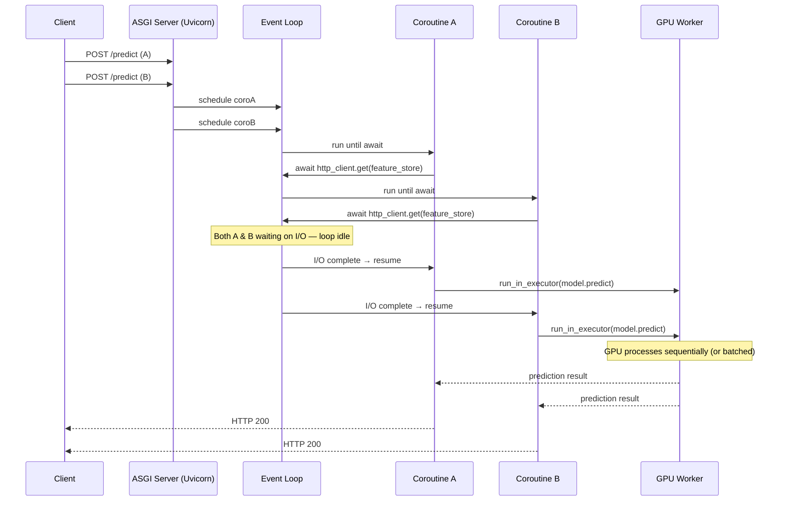
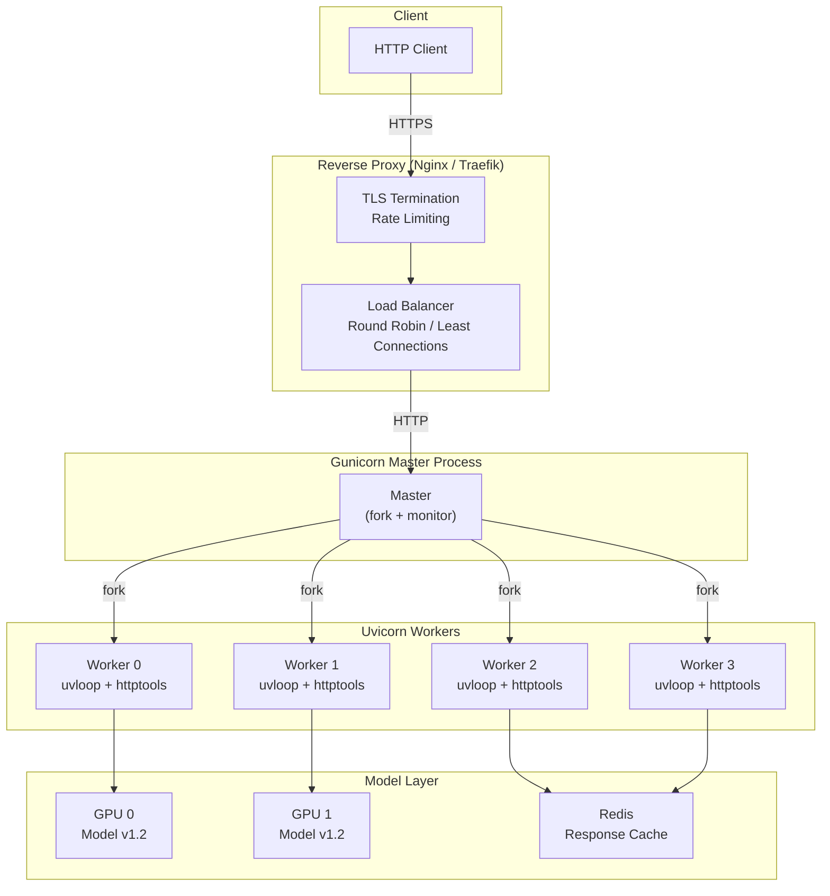
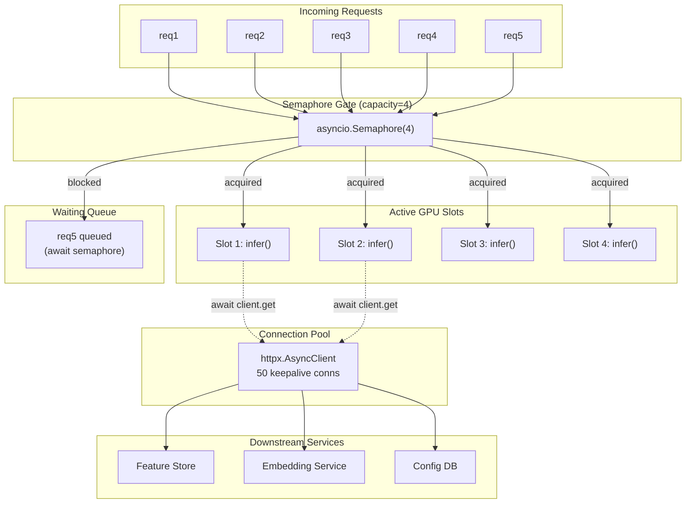

# 🔄 ASGI Architecture and Async Python for ML

## 🎯 Learning Objectives

- Contrast WSGI's synchronous request-per-worker model with ASGI's event-driven concurrency and explain why the former is fatal for ML inference at scale
- Decompose the event loop lifecycle, coroutine scheduling, Task creation, and the conditions under which `async def` endpoints remain blocking
- Configure production-grade Uvicorn servers with Gunicorn, uvloop, and graceful shutdown handling tailored to ML model warm-up cycles
- Apply concurrency patterns — connection pooling, semaphore-based rate limiting, and `run_in_executor` — to CPU-bound model inference

## Introduction

Every web framework in Python ultimately speaks to a server through a gateway interface. The choice between WSGI and ASGI is not a cosmetic preference — it determines whether your ML inference server can handle 10 concurrent requests or 10,000. WSGI frameworks like Flask and Django map each request to a dedicated worker thread or process. When a worker blocks on a 200 ms model prediction, it serves exactly zero other requests during that interval. Under bursty ML traffic — product launches, viral content spikes, real-time bidding systems — the worker pool exhausts and connections drop. ASGI, built atop `asyncio`, yields the event loop during I/O waits so a single process can interleave hundreds of concurrent model inferences, database queries (see [[../../25 - Bases de Datos y Message Queues/10 - SQL y ORMs/10 - SQL y ORMs|SQL and ORMs]]), and third-party API calls.

The async model introduces nuanced failure modes, however. Declaring an endpoint `async def` does not magically make it non-blocking. A synchronous NumPy operation, a `requests.get()` call, or a CPU-bound `torch.inference_mode()` invocation will stall the entire event loop — freezing every other concurrent request. This note dissects the event loop mechanics, teaches the `run_in_executor` offloading pattern, and provides production Uvicorn configurations that balance throughput against GPU utilization. Understanding these fundamentals is prerequisite to the streaming patterns in [[03 - Streaming, Background Tasks, and Real-Time Endpoints|Streaming and Background Tasks]] and the deployment architectures in [[05 - Production Deployment and Performance|Production Deployment]].

---

## Module 1: WSGI vs ASGI — The Architectural Divide

### 1.1 Theoretical Foundation 🧠

The Python Web Server Gateway Interface (WSGI), specified in PEP 3333, defines a synchronous callable: `def application(environ, start_response)`. Every request triggers this callable and the server blocks until it returns. To handle concurrency, WSGI servers spawn a pool of worker processes (Gunicorn sync workers) or threads (Gunicorn gthread). Each worker encapsulates one request at a time. If you have 4 workers and each model prediction takes 200 ms, your theoretical ceiling is 20 requests per second — and the 21st request waits in a queue.

The Asynchronous Server Gateway Interface (ASGI) defines a coroutine-based interface: `async def application(scope, receive, send)`. The server runs an event loop that schedules coroutines cooperatively. When a coroutine hits an I/O boundary — awaiting a database cursor, an HTTP client call, or a message queue publish — it yields control to the loop via `await`. The loop immediately schedules another waiting coroutine. No thread context switches, no worker pool exhaustion, no memory overhead from idle workers. A single ASGI process can sustain thousands of concurrent connections when I/O-bound.

For ML inference, the distinction is existential. Consider a fraud detection API that, per request, calls a feature store (20 ms), runs model inference (50 ms on GPU), and writes to an audit log (10 ms). Under WSGI with 8 workers, max throughput is:

```
Throughput_wsgi = 8 workers / 0.080 s = 100 RPS
```

Under ASGI, while one coroutine waits 20 ms for the feature store, the loop schedules another. The GPU-bound 50 ms inference is the bottleneck, but the I/O waits overlap across coroutines. Effective throughput approaches:

```
Throughput_asgi = (concurrent requests) / 0.050 s (GPU time only, I/O overlapped)
```

Real systems like Netflix Dispatch transitioned their incident management platform to ASGI to handle bursty notification traffic during outages — exactly the load profile ML APIs face during product launches or viral content events.

### 1.2 Mental Model 📐

```
┌─────────────────────────────────────────────────────────┐
│                   WSGI Worker Pool                      │
│                                                         │
│  ┌──────────┐  ┌──────────┐  ┌──────────┐              │
│  │ Worker 1 │  │ Worker 2 │  │ Worker 3 │  (8 total)   │
│  │ [BLOCKED]│  │ [BLOCKED]│  │ [BLOCKED]│              │
│  │ awaiting │  │ awaiting │  │ awaiting │              │
│  │ model()  │  │ model()  │  │ model()  │              │
│  └──────────┘  └──────────┘  └──────────┘              │
│       ▲              ▲              ▲                   │
│  Queue: [req4][req5][req6]... ← REJECTED when pool full  │
└─────────────────────────────────────────────────────────┘

┌─────────────────────────────────────────────────────────┐
│                   ASGI Event Loop                       │
│                                                         │
│  Time →  t0      t1      t2      t3      t4            │
│  ───────────────────────────────────────────            │
│  Coro A: [setup][await DB   ][model()][respond]         │
│  Coro B: [setup][await FS   ][model()][respond]         │
│  Coro C: [setup][await Redis]          [model()]...     │
│                                                         │
│  Overlapped I/O: A, B, C all progress during waits       │
└─────────────────────────────────────────────────────────┘
```

```
┌─── ASGI Protocol Stack ───────────────────────┐
│                                                │
│  ┌─────────────────────────────────────┐       │
│  │          Application Code           │       │
│  │  FastAPI / Starlette / Django ASGI  │       │
│  ├─────────────────────────────────────┤       │
│  │          ASGI Server                │       │
│  │     Uvicorn / Daphne / Hypercorn    │       │
│  ├─────────────────────────────────────┤       │
│  │       Event Loop (uvloop)           │       │
│  │  libuv bindings → epoll/kqueue/IOCP │       │
│  ├─────────────────────────────────────┤       │
│  │       Transport Layer (TCP/UDS)     │       │
│  └─────────────────────────────────────┘       │
└────────────────────────────────────────────────┘
```

### 1.3 Syntax and Semantics 📝

```python
# BLOCKING (WSGI-style): one request consumes one worker entirely
# WHY: synchronous sleep holds the OS thread; no other request can use it
import time

def blocking_predict(features):
    time.sleep(0.2)  # simulates blocking I/O or CPU work
    return {"score": 0.95}

# Under WSGI: 4 workers × 5 RPS each = 20 RPS ceiling

# NON-BLOCKING (ASGI-style): await yields the event loop
# WHY: asyncio.sleep cooperatively yields; loop schedules another coroutine
import asyncio

async def non_blocking_predict(features):
    await asyncio.sleep(0.05)  # simulates async I/O (DB query, HTTP call)
    return {"score": 0.95}

# Under ASGI: single process handles hundreds of concurrent requests
# because 0.05s of I/O wait is overlapped across all coroutines
```

### 1.4 Visual Representation 🖼️



### 1.5 Application in ML/AI Systems 🤖

Uber's Michelangelo ML platform serves thousands of models through a unified prediction service. Their architecture runs ASGI-based API gateways that fan out requests to model-specific inference workers. During peak hours — Friday evening food delivery surges — the gateway must handle 10× normal load without degrading. They achieve this by keeping the API layer fully async (I/O for feature retrieval and routing) while offloading GPU inference to dedicated thread pools via `loop.run_in_executor()`. This separation ensures the event loop never blocks on GPU work, maintaining responsiveness for health checks and routing decisions even when all GPU workers are saturated.

Netflix's Dispatch framework, used for incident management across thousands of engineers, is built on ASGI-compatible services that must remain responsive during major outages when notification traffic spikes 50× above baseline. Their architecture demonstrates that async API gateways are not optional optimizations — they are architectural necessities for ML systems exposed to bursty, unpredictable traffic.

### 1.6 Common Pitfalls ⚠️ + 💡 Tips

⚠️ **Pitfall**: Calling `requests.get()` inside an `async def` endpoint stalls the event loop because `requests` is synchronous and blocks the OS thread during network I/O.

💡 **Tip**: Always use `httpx.AsyncClient` or `aiohttp.ClientSession` for outbound HTTP calls from async endpoints. These libraries use non-blocking sockets integrated with the event loop.

⚠️ **Pitfall**: Running CPU-bound model inference directly inside `async def` blocks all other coroutines. A 200 ms PyTorch forward pass freezes the loop for 200 ms.

💡 **Tip**: Offload CPU/GPU ops with `await asyncio.get_event_loop().run_in_executor(None, model.predict, features)` or use FastAPI's `run_in_threadpool` from `starlette.concurrency`.

⚠️ **Pitfall**: Creating a new `httpx.AsyncClient()` per request leaks connections and negates the benefits of connection pooling.

💡 **Tip**: Instantiate `AsyncClient` once at startup and inject it via `Depends`. Use `async with client` context manager scoped to the application lifespan.

### 1.7 Knowledge Check ❓

1. A WSGI server with 10 workers and 150 ms sync inference time per request has what theoretical max throughput? What happens to request 11?
2. Why does `time.sleep(1)` inside an `async def` endpoint behave differently from `await asyncio.sleep(1)`? Trace the event loop state in both cases.
3. You have a PyTorch model that takes 300 ms per inference on GPU. Should you `await model(x)` directly in the endpoint or use `run_in_executor`? Why?

---

## Module 2: Async/Await Deep Dive for ML Engineers

### 2.1 Theoretical Foundation 🧠

Python's `async`/`await` syntax, introduced in Python 3.5 and refined through PEP 492, enables cooperative multitasking. A coroutine — defined with `async def` — is a function that can suspend its execution at `await` points and resume later. Critically, this suspension happens at the Python level without involving OS thread context switches. The event loop, running on a single thread, maintains a queue of ready coroutines and schedules them whenever the current coroutine yields.

A `Task` wraps a coroutine and schedules it on the event loop. When you write `asyncio.create_task(my_coro())`, the loop begins executing the coroutine concurrently with the current one. Tasks provide `cancel()`, `done()`, and `result()` methods, enabling structured concurrency patterns. The event loop runs in ticks: at each tick, it polls I/O readiness (via epoll on Linux, kqueue on macOS), executes any ready callbacks, and then runs one step of a scheduled coroutine.

The critical insight for ML engineers: `await` only suspends the coroutine if the awaited object is a proper awaitable that cooperates with the event loop. A synchronous function call — even one wrapped in `async def` that never awaits — runs to completion without yielding. This is why `async def endpoint(): return model(x)` with a synchronous `model` call is functionally identical to a WSGI endpoint: it monopolizes the event loop's single thread for the entire duration of `model(x)`.

### 2.2 Mental Model 📐

```
┌─── Event Loop Tick Cycle ───────────────────────────────┐
│                                                          │
│  ┌─────────────┐                                         │
│  │ Poll I/O    │ ← epoll_wait() for ready sockets/files  │
│  │ readiness   │                                         │
│  └──────┬──────┘                                         │
│         ▼                                                │
│  ┌─────────────┐     ┌─────────────────────────────┐     │
│  │ Run I/O     │────▶│ Resume waiting coroutines   │     │
│  │ callbacks   │     │ (data available on socket)  │     │
│  └─────────────┘     └─────────────────────────────┘     │
│         ▼                                                │
│  ┌─────────────┐                                         │
│  │ Run one     │ ← Execute next step of a ready Task     │
│  │ Task step   │   until it hits await or completes      │
│  └─────────────┘                                         │
│         ▼                                                │
│  ┌─────────────┐                                         │
│  │ Check       │ ← Handle cancellations, timeouts,       │
│  │ scheduled   │   and scheduled callbacks               │
│  │ callbacks   │                                         │
│  └──────┬──────┘                                         │
│         └────────────────────── loop back ◄────────────── │
└──────────────────────────────────────────────────────────┘
```

```
┌─── Coroutine States ─────────────────────────────────────┐
│                                                          │
│  PENDING ──▶ RUNNING ──▶ AWAITING ──▶ RUNNING ──▶ DONE  │
│              (created)  (hit await)  (I/O ready) (return)│
│                                                          │
│                         ┌─── CANCELED (Task.cancel())     │
│                         └─── ERROR (unhandled exception)  │
└──────────────────────────────────────────────────────────┘
```

### 2.3 Syntax and Semantics 📝

```python
import asyncio
import time
from concurrent.futures import ProcessPoolExecutor
import numpy as np

# ─── CORRECT: I/O-bound async operation ───
# WHY: httpx uses non-blocking sockets; await yields the event loop
# during network round-trips. Hundreds of these can overlap.
import httpx

async def fetch_features(client: httpx.AsyncClient, entity_id: str):
    response = await client.get(f"https://feature-store/{entity_id}")
    return response.json()

# ─── WRONG: CPU-bound operation blocks the event loop ───
# WHY: numpy operations run synchronously on the CPU.
# During sum(), NO other coroutine gets scheduled.
async def blocking_inference(features: np.ndarray) -> np.ndarray:
    result = np.sum(features)  # blocks the event loop thread!
    return result

# ─── CORRECT: Offload CPU work to executor ───
# WHY: run_in_executor runs the synchronous function in a separate
# thread or process, freeing the event loop to handle other coroutines.
async def non_blocking_inference(features: np.ndarray) -> np.ndarray:
    loop = asyncio.get_running_loop()
    return await loop.run_in_executor(
        None,  # None = default ThreadPoolExecutor
        lambda: np.sum(features)
    )

# ─── CORRECT: Batch GPU inference with process pool ───
# WHY: GPUs are single-threaded within a process. Use a process pool
# to run multiple models in parallel across GPUs or CPU cores.
process_pool = ProcessPoolExecutor(max_workers=4)

async def gpu_inference_batch(features_batch: np.ndarray) -> np.ndarray:
    loop = asyncio.get_running_loop()
    return await loop.run_in_executor(
        process_pool,
        model_predict,  # synchronous function that calls torch()
        features_batch
    )

# ─── CORRECT: gather for fan-out ML pipelines ───
# WHY: When a prediction requires multiple independent lookups
# (feature store, embeddings, ABAC policy), run them concurrently.
async def enriched_predict(entity_id: str):
    async with httpx.AsyncClient() as client:
        features, embeddings, permissions = await asyncio.gather(
            fetch_features(client, entity_id),
            fetch_embeddings(client, entity_id),
            check_permissions(client, entity_id),
        )
    return combine_and_predict(features, embeddings, permissions)
```

### 2.4 Visual Representation 🖼️

```mermaid
flowchart TD
    A["async def predict(request)"] --> B{"Is the awaited value awaitable?"}
    B -->|Yes: httpx.get()| C["Event loop suspends coroutine"]
    B -->|No: numpy.sum()| D["Blocks event loop — ALL coroutines frozen!"]
    C --> E["Loop schedules next ready coroutine"]
    E --> F{"I/O ready?"}
    F -->|Yes| G["Resume suspended coroutine"]
    F -->|No| E
    G --> H["Execute remaining code"]
    D --> I["❌ Throughput collapses to single-worker WSGI levels"]
    C --> J["✅ Full async concurrency preserved"]

    style D fill:#f66,stroke:#333
    style I fill:#f66,stroke:#333
    style C fill:#6f6,stroke:#333
    style J fill:#6f6,stroke:#333
```

### 2.5 Application in ML/AI Systems 🤖

Spotify's ML platform processes billions of daily predictions for music recommendations. Their async serving layer, built on FastAPI, orchestrates complex prediction pipelines: for each user request, the system fans out to a user-profile service (100 ms), a collaborative-filtering embeddings store (50 ms), and a real-time audio features extractor (80 ms). Using `asyncio.gather`, these three calls run concurrently instead of sequentially, reducing end-to-end latency from 230 ms to 100 ms. Critically, they offload the final TensorFlow model inference to a C++ runtime via `run_in_executor` so the Python event loop remains responsive for the next wave of requests while the GPU processes the current batch.

### 2.6 Common Pitfalls ⚠️ + 💡 Tips

⚠️ **Pitfall**: Mixing `asyncio.create_task()` without storing a reference. The task may be garbage-collected mid-execution, producing silent failures.

💡 **Tip**: Store task references in a set: `tasks = set(); task = asyncio.create_task(...); tasks.add(task); task.add_done_callback(tasks.discard)`.

⚠️ **Pitfall**: Using `asyncio.run()` inside an already-running event loop (e.g., inside a FastAPI endpoint). This raises `RuntimeError: asyncio.run() cannot be called from a running event loop`.

💡 **Tip**: Inside async functions, use `await coroutine()` directly or `asyncio.ensure_future()` for fire-and-forget patterns.

⚠️ **Pitfall**: Assuming `async def` automatically parallelizes CPU work. Async is cooperative, not preemptive. CPU-bound loops still serialize.

💡 **Tip**: For CPU-bound ML preprocessing, use `loop.run_in_executor()` with a `ProcessPoolExecutor`. For GPU-bound work, use a thread pool sized to your GPU count.

### 2.7 Knowledge Check ❓

1. You call `await model(x)` where `model` is a synchronous PyTorch function. Does the `await` help? Trace the event loop behavior.
2. When would you use `asyncio.gather()` vs `asyncio.create_task()` for fanning out to multiple feature stores?
3. A coroutine created with `asyncio.create_task()` is not `await`ed anywhere. What happens to its exceptions?

---

## Module 3: Uvicorn and Production Server Deployment

### 3.1 Theoretical Foundation 🧠

Uvicorn is an ASGI server implementation built on uvloop (a drop-in replacement for asyncio's event loop using libuv, the same C library powering Node.js) and httptools (a C-based HTTP parser). Together, they deliver request throughput that approaches compiled-language server performance while preserving Python's ecosystem. Uvicorn supports multiple worker configurations: single-process (default), `--workers N` for multiprocess behind a load balancer, and integration with Gunicorn for process management.

The worker model matters enormously for ML workloads. A single Uvicorn process with uvloop handles I/O concurrency efficiently, but CPU-bound model inference still occupies the process during execution. The recommended production pattern is: run multiple Uvicorn workers (typically `2 * CPU_CORES + 1`), each running its own event loop, behind a reverse proxy (Nginx/Traefik). This gives you both I/O concurrency within each process and CPU parallelism across processes.

Graceful shutdown — releasing GPU memory, flushing prediction buffers, closing database connections — requires special attention in ML services. FastAPI's lifespan events provide `shutdown` hooks, but Uvicorn must be configured with appropriate timeout values (`--timeout-keep-alive`, `--graceful-timeout`) to allow in-flight predictions to complete before termination. A model that takes 2 seconds on GPU needs at least that much graceful shutdown time, or predictions are truncated mid-inference.

### 3.2 Mental Model 📐

```
┌─── Production Uvicorn + Gunicorn Architecture ──────────┐
│                                                          │
│  ┌──────────────────────────────────────────────────┐    │
│  │              Gunicorn (Process Manager)           │    │
│  │  ┌────────┐  ┌────────┐  ┌────────┐  ┌────────┐  │    │
│  │  │Worker 0│  │Worker 1│  │Worker 2│  │Worker 3│  │    │
│  │  │Uvicorn │  │Uvicorn │  │Uvicorn │  │Uvicorn │  │    │
│  │  │ +uvloop│  │ +uvloop│  │ +uvloop│  │ +uvloop│  │    │
│  │  └───┬────┘  └───┬────┘  └───┬────┘  └───┬────┘  │    │
│  │      │           │           │           │        │    │
│  └──────┼───────────┼───────────┼───────────┼────────┘    │
│         │           │           │           │             │
│  ┌──────┴───────────┴───────────┴───────────┴────────┐    │
│  │              GPU / ML Model Pool                   │    │
│  │  ┌─────────┐  ┌─────────┐  ┌─────────┐            │    │
│  │  │ Model A │  │ Model B │  │ Batching │            │    │
│  │  │ (GPU 0) │  │ (GPU 1) │  │  Queue   │            │    │
│  │  └─────────┘  └─────────┘  └─────────┘            │    │
│  └────────────────────────────────────────────────────┘    │
└──────────────────────────────────────────────────────────┘
```

```
┌─── Graceful Shutdown Sequence ──────────────────────────┐
│                                                          │
│  SIGTERM received                                        │
│      │                                                   │
│      ▼                                                   │
│  ┌──────────────────────┐                                │
│  │ Stop accepting new   │ ← lb removed from pool         │
│  │ connections          │   (K8s: draining endpoints)    │
│  └──────────┬───────────┘                                │
│             ▼                                            │
│  ┌──────────────────────┐                                │
│  │ Wait for in-flight   │ ← graceful_timeout seconds     │
│  │ predictions to finish│                                │
│  └──────────┬───────────┘                                │
│             ▼                                            │
│  ┌──────────────────────┐                                │
│  │ Run lifespan shutdown│ ← model.unload(),              │
│  │ handlers             │   conn.close(), flush metrics   │
│  └──────────┬───────────┘                                │
│             ▼                                            │
│  ┌──────────────────────┐                                │
│  │ Exit process         │                                │
│  └──────────────────────┘                                │
└──────────────────────────────────────────────────────────┘
```

### 3.3 Syntax and Semantics 📝

```python
# uvicorn_config.py — production FastAPI ML server entrypoint
# WHY: Separate configuration from application code for environment-specific tuning.
# This file is invoked by Gunicorn or directly by container orchestrators.

import os
import uvicorn

if __name__ == "__main__":
    uvicorn.run(
        "app.main:app",  # "module:variable" syntax for import
        host="0.0.0.0",
        port=int(os.getenv("PORT", 8000)),
        # ─── Concurrency tuning ───
        workers=int(os.getenv("WORKERS", 4)),  # multiple processes for CPU parallelism
        loop="uvloop",  # libuv-based event loop: 2-4x faster than asyncio default
        http="httptools",  # C-based HTTP parser: lower overhead per request
        # ─── Connection tuning ───
        limit_concurrency=int(os.getenv("MAX_CONCURRENT", 1000)),  # cap total in-flight
        backlog=int(os.getenv("BACKLOG", 2048)),  # TCP accept queue depth
        # ─── Timeouts ───
        timeout_keep_alive=int(os.getenv("KEEPALIVE", 5)),  # close idle keep-alive conns
        graceful_timeout=int(os.getenv("GRACEFUL_TIMEOUT", 30)),  # wait for in-flight reqs
        # ─── Logging ───
        log_level=os.getenv("LOG_LEVEL", "info"),
        access_log=os.getenv("ACCESS_LOG", "False").lower() == "true",
        # ─── SSL (when not behind reverse proxy) ───
        ssl_keyfile=os.getenv("SSL_KEYFILE"),
        ssl_certfile=os.getenv("SSL_CERTFILE"),
    )
```

```python
# gunicorn_conf.py — Gunicorn process manager with Uvicorn workers
# WHY: Gunicorn handles process lifecycle (fork, restart, shutdown) better than
# uvicorn's built-in worker management. Used in Docker/K8s deployments.

import os

# Bind to PORT env var (Cloud Run, Heroku, K8s convention)
bind = f"0.0.0.0:{os.getenv('PORT', '8000')}"

# Worker class: uvicorn ASGI workers with uvloop
worker_class = "uvicorn.workers.UvicornWorker"
workers = int(os.getenv("WORKERS", 4))
threads = int(os.getenv("THREADS", 1))  # usually 1 for ASGI

# Graceful shutdown: critical for ML model unload
graceful_timeout = int(os.getenv("GRACEFUL_TIMEOUT", 30))
timeout = int(os.getenv("TIMEOUT", 120))  # hard kill after this

# Memory management: restart workers that grow too large
max_requests = int(os.getenv("MAX_REQUESTS", 10000))  # prevent memory leaks
max_requests_jitter = int(os.getenv("MAX_REQUESTS_JITTER", 1000))

# Logging
loglevel = os.getenv("LOG_LEVEL", "info")
accesslog = os.getenv("ACCESS_LOG", "-") if os.getenv("ACCESS_LOG") else None
errorlog = "-"
```

### 3.4 Visual Representation 🖼️



### 3.5 Application in ML/AI Systems 🤖

Notion's AI features — summarization, translation, question answering — serve millions of users behind a FastAPI + Uvicorn setup. Each prediction request triggers a pipeline: tokenization (I/O to a tokenizer service), embedding lookup (I/O to a vector store), and LLM inference (GPU). Notion uses 8 Uvicorn workers per pod, each running uvloop, across multiple Kubernetes pods. They discovered that increasing workers beyond CPU core count introduced GPU contention (multiple workers queuing for the same GPU), so they settled on `workers = GPU_COUNT * 2` and used `limit_concurrency=500` per worker to prevent thundering-herd effects during feature launches.

### 3.6 Common Pitfalls ⚠️ + 💡 Tips

⚠️ **Pitfall**: Running `uvicorn.run()` with `reload=True` in production. The reload watcher adds filesystem overhead and can trigger unexpected restarts.

💡 **Tip**: Set `reload=False` explicitly and use proper CI/CD pipelines for deployments. Auto-reload is for development only.

⚠️ **Pitfall**: Setting `workers=1` for a GPU-heavy service and expecting high throughput. One process can only saturate one GPU effectively.

💡 **Tip**: Match workers to available GPUs. If you have 4 GPUs, use 4 workers, each pinned to a different GPU via `CUDA_VISIBLE_DEVICES`.

⚠️ **Pitfall**: Insufficient `graceful_timeout` causing prediction truncation during rolling deployments.

💡 **Tip**: Measure your P99 prediction latency and set `graceful_timeout` to at least 2× that value. Use the lifespan `shutdown` event to log any truncated predictions.

### 3.7 Knowledge Check ❓

1. You have an 8-core VM with 2 GPUs running a PyTorch model. How many Uvicorn workers should you configure and why?
2. A Kubernetes rolling update triggers pod termination. Your P99 prediction latency is 3 seconds. What `graceful_timeout` would you set?
3. Why use Gunicorn to manage Uvicorn workers instead of Uvicorn's built-in `--workers` flag in production?

---

## Module 4: Concurrency Patterns for ML Inference

### 4.1 Theoretical Foundation 🧠

ML services face a unique concurrency challenge: they are simultaneously I/O-bound (fetching features, writing logs, querying vector stores) and CPU/GPU-bound (model inference). The event loop handles the former natively, but the latter requires explicit offloading. Three concurrency patterns dominate production ML APIs:

**Connection pooling** amortizes the cost of establishing TCP connections to downstream services (feature stores, embedding servers, databases). HTTP connection pools, managed by `httpx.AsyncClient` or `aiohttp.ClientSession`, reuse existing TCP connections across requests, avoiding the three-way handshake and TLS negotiation overhead per call. For an ML API that fans out to 3 downstream services per request at 1000 RPS, a connection pool saves 3000 TCP handshakes per second.

**Semaphore-based rate limiting** prevents an ML service from overwhelming downstream systems or its own GPU. A `asyncio.Semaphore` with a configurable capacity gates concurrent access to a scarce resource. For example, if your GPU can only process 4 inference batches concurrently, a semaphore of 4 ensures the 5th request queues rather than triggering CUDA out-of-memory errors.

**The `run_in_executor` pattern** bridges synchronous and async worlds. FastAPI's `run_in_threadpool` (from Starlette) wraps a synchronous callable in a thread pool executor, allowing the event loop to continue while the function runs in a background thread. For GPU workloads where Python's GIL is released during C-level CUDA calls, threads work well. For CPU-bound preprocessing (pandas, numpy), `ProcessPoolExecutor` avoids GIL contention entirely.

### 4.2 Mental Model 📐

```
┌─── Connection Pooling ──────────────────────────────────┐
│                                                          │
│  Without pooling:                                        │
│  Request 1: [TCP handshake 5ms][TLS 10ms][GET 20ms][CLOSE]│
│  Request 2: [TCP handshake 5ms][TLS 10ms][GET 20ms][CLOSE]│
│  Overhead: 15ms + 15ms = 30ms wasted per 2 requests      │
│                                                          │
│  With pooling:                                           │
│  Request 1: [TCP handshake 5ms][TLS 10ms][GET 20ms]      │
│  Request 2:                    [GET 20ms] (reuses conn)   │
│  Overhead: 15ms + 0ms = 15ms saved                       │
└──────────────────────────────────────────────────────────┘

┌─── Semaphore Gating GPU Access ─────────────────────────┐
│                                                          │
│  asyncio.Semaphore(4)                                    │
│                                                          │
│  ┌────────────┐                                         │
│  │  Queue     │  →  [req5][req6][req7]...                │
│  │  (waiting) │     waiting for semaphore release        │
│  └────────────┘                                         │
│        │                                                 │
│  ┌─────┴──────────────────────────────────┐             │
│  │  Active (semaphore acquired)            │             │
│  │  ┌────────┐ ┌────────┐ ┌────────┐      │             │
│  │  │ Slot 0 │ │ Slot 1 │ │ Slot 2 │ ...  │             │
│  │  │ [GPU]  │ │ [GPU]  │ │ [GPU]  │      │             │
│  │  └────────┘ └────────┘ └────────┘      │             │
│  └────────────────────────────────────────┘             │
└──────────────────────────────────────────────────────────┘
```

### 4.3 Syntax and Semantics 📝

```python
import asyncio
import httpx
from contextlib import asynccontextmanager
from typing import AsyncGenerator

# ─── Pattern 1: Connection Pool (async HTTP client as singleton) ───
# WHY: Creating a new client per request is like opening a new browser tab
# for every page view. Pool reuses TCP connections and TLS sessions.
# The client lives for the application's entire lifespan.

_client: httpx.AsyncClient | None = None

async def get_http_client() -> httpx.AsyncClient:
    """Dependency that returns a shared, warm connection pool."""
    global _client
    if _client is None:
        _client = httpx.AsyncClient(
            limits=httpx.Limits(
                max_keepalive_connections=50,   # reuse up to 50 idle conns
                max_connections=200,            # hard cap on total conns
                keepalive_expiry=30.0,          # close idle conns after 30s
            ),
            timeout=httpx.Timeout(
                connect=5.0,   # TCP handshake timeout
                read=30.0,     # response read timeout (ML can be slow)
                write=10.0,    # request body write timeout
                pool=5.0,      # wait-for-connection-from-pool timeout
            ),
        )
    return _client

# ─── Pattern 2: Semaphore for GPU rate limiting ───
# WHY: GPU memory is finite. Without gating, concurrent inference calls
# cause CUDA OOM crashes. The semaphore serializes access beyond capacity.
gpu_semaphore = asyncio.Semaphore(4)  # max 4 concurrent GPU ops

async def gpu_predict(model, features):
    async with gpu_semaphore:
        loop = asyncio.get_running_loop()
        return await loop.run_in_executor(None, model.predict, features)

# ─── Pattern 3: Timeout with fallback for degraded ML service ───
# WHY: Downstream feature stores or embedding services may slow down.
# A timeout with default/fallback values keeps the API responsive.
DEFAULT_EMBEDDINGS = [0.0] * 768

async def fetch_embeddings_with_fallback(
    client: httpx.AsyncClient, entity_id: str
) -> list[float]:
    try:
        response = await asyncio.wait_for(
            client.get(f"https://embeddings/{entity_id}"),
            timeout=2.0,  # 2-second SLA for embeddings service
        )
        return response.json()["embedding"]
    except asyncio.TimeoutError:
        # WHY: Degrade gracefully rather than 500. The model can still
        # produce a reasonable prediction without fresh embeddings.
        return DEFAULT_EMBEDDINGS

# ─── Pattern 4: Batch collector for GPU throughput ───
# WHY: GPUs achieve maximum throughput with batched inference.
# Accumulate individual requests over a short window, then predict as a batch.
class BatchCollector:
    def __init__(self, max_batch_size: int = 32, max_wait_ms: float = 10.0):
        self.max_batch_size = max_batch_size
        self.max_wait_sec = max_wait_ms / 1000.0
        self._queue: asyncio.Queue = asyncio.Queue()
        self._lock = asyncio.Lock()

    async def predict(self, features: list[float]) -> float:
        future: asyncio.Future = asyncio.get_running_loop().create_future()
        await self._queue.put((features, future))
        return await future

    async def _batch_worker(self, model):
        """Background coroutine that drains the queue into batched GPU calls."""
        while True:
            batch = []
            futures = []
            try:
                # Collect first item (blocking wait)
                item, future = await asyncio.wait_for(
                    self._queue.get(), timeout=self.max_wait_sec
                )
                batch.append(item)
                futures.append(future)
            except asyncio.TimeoutError:
                continue

            # Drain remaining items without blocking (up to max_batch_size)
            while len(batch) < self.max_batch_size:
                try:
                    item, future = self._queue.get_nowait()
                    batch.append(item)
                    futures.append(future)
                except asyncio.QueueEmpty:
                    break

            # Batch GPU inference
            results = await gpu_predict(model, batch)
            for f, r in zip(futures, results):
                f.set_result(r)
```

### 4.4 Visual Representation 🖼️



### 4.5 Application in ML/AI Systems 🤖

Uber's real-time pricing model serves millions of ride estimates per hour. Each request fans out to 5+ microservices: geospatial index (for nearby drivers), demand model, supply model, surge multiplier, and ETA prediction. Uber's async API layer uses connection pooling with `aiohttp` to maintain persistent connections to these services, reducing per-request overhead from ~80 ms (cold TCP+TLS) to ~5 ms (warm reuse). They combine this with semaphore-based circuit breakers: if the ETA service exceeds a 50 ms SLA, the semaphore restricts traffic to prevent cascading failure, and the pricing endpoint degrades to a cache-based fallback. This pattern — async fan-out with timeouts, pools, and semaphores — is the standard architecture for latency-critical ML APIs at scale.

### 4.6 Common Pitfalls ⚠️ + 💡 Tips

⚠️ **Pitfall**: Using an unbounded `asyncio.Queue` for batching without backpressure. During traffic spikes, the queue grows indefinitely, consuming all memory.

💡 **Tip**: Set `maxsize` on queues: `asyncio.Queue(maxsize=1000)`. When full, `put()` awaits, applying natural backpressure to callers.

⚠️ **Pitfall**: Forgetting to close `httpx.AsyncClient` at shutdown, leaving TCP connections open and triggering resource warnings.

💡 **Tip**: Use FastAPI lifespan to `await client.aclose()` during shutdown. The client should be a singleton managed by the application lifecycle.

⚠️ **Pitfall**: Using `ThreadPoolExecutor` for GPU work without understanding CUDA thread safety. Multiple threads sharing a CUDA context can corrupt state.

💡 **Tip**: For GPU inference, prefer a single dedicated thread per GPU or use `ProcessPoolExecutor` with `CUDA_VISIBLE_DEVICES` isolation.

### 4.7 Knowledge Check ❓

1. Your ML API fans out to 4 downstream services. Without connection pooling, each new connection costs 15 ms. At 500 RPS, how much time is wasted per second?
2. Why would you use `asyncio.Semaphore(4)` instead of a `threading.Semaphore(4)` inside an async FastAPI endpoint?
3. A batch collector uses `asyncio.wait_for(queue.get(), timeout=0.01)`. What happens if no items arrive within 10 ms?

---

## 📦 Compression Code

```python
"""
production_ml_server.py — Production-ready FastAPI ML service
Demonstrates: ASGI event loop, run_in_executor, connection pooling,
semaphore gating, graceful shutdown, and batch collection.
"""
from contextlib import asynccontextmanager
from typing import AsyncGenerator
import asyncio
import os
import time

import httpx
import numpy as np
from fastapi import FastAPI, Depends, HTTPException
from pydantic import BaseModel, Field

# ═══ Lifespan: Model loading and connection pool setup ═══


@asynccontextmanager
async def lifespan(app: FastAPI) -> AsyncGenerator[None, None]:
    # Startup: load model, warm connection pool
    app.state.model = load_ml_model()  # synchronous load
    app.state.http_client = httpx.AsyncClient(
        limits=httpx.Limits(max_keepalive_connections=50, max_connections=200),
        timeout=httpx.Timeout(connect=5.0, read=30.0, write=10.0, pool=5.0),
    )
    app.state.gpu_semaphore = asyncio.Semaphore(
        int(os.getenv("GPU_CONCURRENCY", "4"))
    )
    yield
    # Shutdown: drain in-flight requests, close connections
    await app.state.http_client.aclose()
    unload_ml_model(app.state.model)


app = FastAPI(lifespan=lifespan, title="ML Inference Gateway")


# ═══ Pydantic Schemas ═══
class PredictRequest(BaseModel):
    features: list[float] = Field(..., min_length=1, max_length=1024)
    model_version: str = Field(default="latest", pattern=r"^\d+\.\d+\.\d+$|^latest$")


class PredictResponse(BaseModel):
    prediction: float
    model_version: str
    inference_ms: float


# ═══ Dependencies ═══
async def get_client(request: PredictRequest) -> httpx.AsyncClient:
    # Return the shared connection pool — no per-request overhead
    return request.app.state.http_client


async def get_gpu_slot():
    # Gate GPU access via semaphore — prevents CUDA OOM
    async with app.state.gpu_semaphore:
        yield


# ═══ Endpoint ═══
@app.post("/predict", response_model=PredictResponse)
async def predict(
    req: PredictRequest,
    client: httpx.AsyncClient = Depends(get_client),
):
    # Step 1: Async I/O — fetch enrichment data concurrently
    enrichment_task = asyncio.create_task(
        client.get(f"https://features.internal/{hash(str(req.features))}")
    )

    # Step 2: CPU-bound inference offloaded to thread pool
    # WHY: model.predict is synchronous PyTorch code; must not block event loop
    start = time.perf_counter()
    loop = asyncio.get_running_loop()
    prediction = await loop.run_in_executor(
        None,
        app.state.model.predict,
        np.array(req.features, dtype=np.float32),
    )
    elapsed_ms = (time.perf_counter() - start) * 1000

    # Step 3: Retrieve enrichment (may complete while model was running)
    enrichment = await enrichment_task

    return PredictResponse(
        prediction=float(prediction),
        model_version=req.model_version,
        inference_ms=round(elapsed_ms, 2),
    )


# ═══ Health check for Kubernetes probes ═══
@app.get("/healthz")
async def health():
    return {"status": "ok", "model_loaded": hasattr(app.state, "model")}


def load_ml_model():
    # Stub — replace with actual model loading
    class StubModel:
        def predict(self, features: np.ndarray) -> np.ndarray:
            return np.mean(features, axis=-1, keepdims=True)
    return StubModel()


def unload_ml_model(model):
    pass  # Release GPU memory, flush buffers
```

## 🎯 Documented Project

### Description

Build an async ML inference gateway that demonstrates production concurrency patterns: connection pooling for downstream enrichment, semaphore-gated GPU access, batched prediction collection, graceful degradation with timeouts, and `run_in_executor` offloading of synchronous model inference.

### Functional Requirements

1. `POST /predict` — Accepts feature vectors, fans out to a feature enrichment service via async HTTP, runs model inference via `run_in_executor`, returns prediction with latency metadata.
2. `POST /predict/batch` — Accumulates individual predictions within 10 ms windows for batch GPU inference, returning results to each caller's future.
3. Health endpoint `GET /healthz` returning model load status for Kubernetes readiness probes.
4. Connection pool shared across all requests via lifespan-managed `httpx.AsyncClient`.
5. GPU semaphore limiting concurrent inference to 4, rejecting excess with 429 status.

### Main Components

- FastAPI app with lifespan context manager for model and client lifecycle
- `asyncio.Semaphore` for GPU concurrency gating
- `BatchCollector` class with background drain worker
- `asyncio.wait_for` with fallback defaults for degraded downstream services
- Proper `graceful_timeout` configuration for Kubernetes rolling updates

### Success Metrics

- 500+ concurrent connections sustained on single 4-vCPU instance
- P99 latency under 200 ms for batched predictions of 32 items
- Zero CUDA OOM errors under sustained load
- Graceful shutdown drains all in-flight predictions within 30 seconds

## 🎯 Key Takeaways

1. **WSGI blocks one worker per request** — a pool of 8 workers caps throughput at 8 concurrent sync operations. ASGI's event loop interleaves I/O across hundreds of coroutines on a single thread.
2. **`async def` alone does not create concurrency** — CPU-bound operations inside async endpoints must be offloaded via `run_in_executor` or they stall the entire event loop.
3. **Connection pooling is non-negotiable at scale** — reuse TCP connections via `httpx.AsyncClient` singletons managed by application lifespan. Per-request connection creation adds 10–30 ms of overhead each.
4. **Semaphores prevent resource exhaustion** — gate GPU access with `asyncio.Semaphore(capacity)`. Without gating, concurrent inference calls trigger CUDA out-of-memory errors.
5. **Graceful shutdown protects in-flight predictions** — configure `graceful_timeout` ≥ 2× P99 latency and use lifespan shutdown handlers to release GPU memory and flush buffers.
6. **Batch collection trades latency for throughput** — accumulate individual predictions over short windows (10–50 ms) for batched GPU inference, achieving 10× higher throughput.
7. **Gunicorn manages process lifecycle better than Uvicorn alone** — use Gunicorn as the process manager with Uvicorn workers for production deployments, especially in containerized environments.

## References

- [ASGI Specification v3.0](https://asgi.readthedocs.io/en/latest/specs/main.html)
- [Uvicorn Settings Reference](https://www.uvicorn.org/settings/)
- [Starlette Concurrency Utilities](https://www.starlette.io/concurrency/)
- [httpx Connection Pool Documentation](https://www.python-httpx.org/advanced/#pool-limit-configuration)
- [PEP 492 — Coroutines with async and await syntax](https://peps.python.org/pep-0492/)
- [Netflix Tech Blog: Dispatch — Crisis Management Orchestration](https://netflixtechblog.com/)
- [Uber Engineering: Michelangelo ML Platform](https://www.uber.com/blog/michelangelo-machine-learning-platform/)
