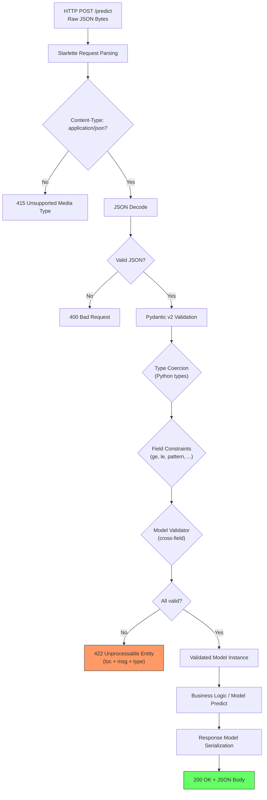
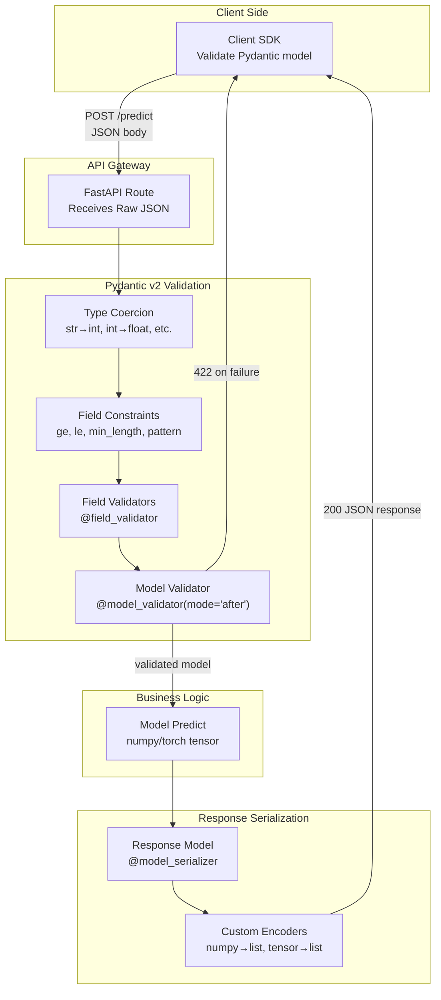
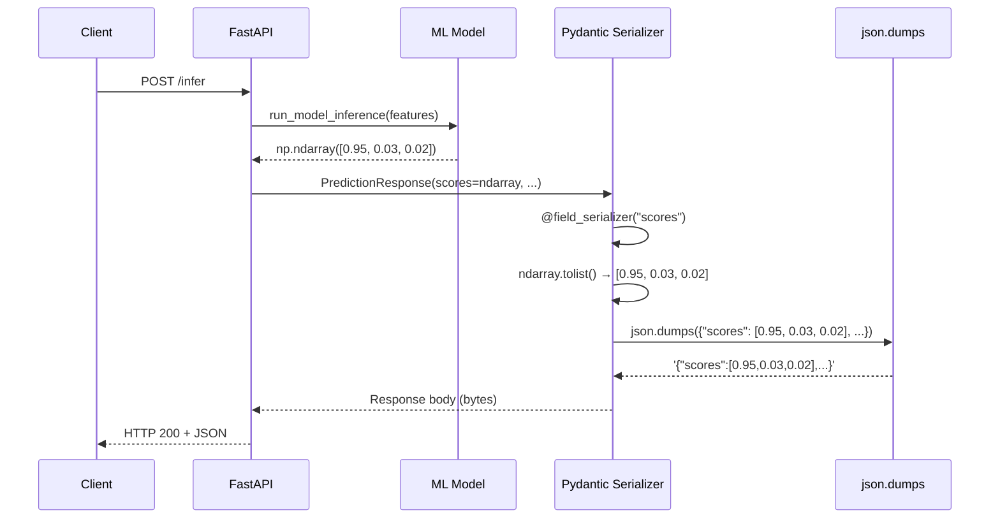
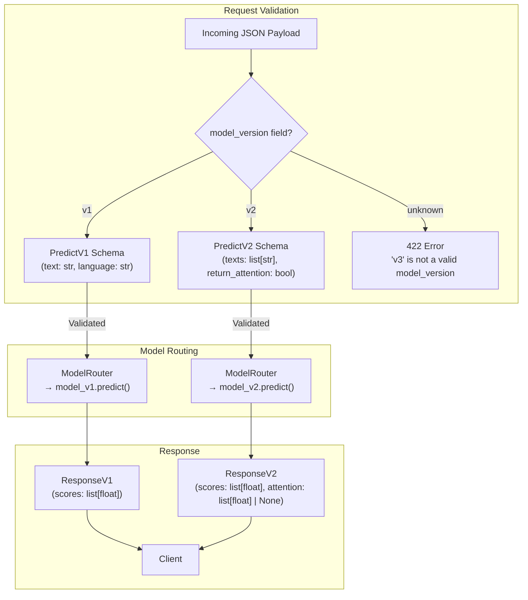

# 🧬 Pydantic v2 for ML Input/Output Schemas

## 🎯 Learning Objectives

- Explain how Pydantic v2's Rust-core validation engine eliminates a class of ML API integration bugs through compile-time-like type safety at runtime
- Design nested ML schemas for tabular features, tensor serialization (base64, numpy-to-list), batch validation, and custom field validators
- Configure response models with custom JSON encoders for NumPy arrays, PyTorch tensors, and non-JSON-native types
- Implement schema versioning strategies with backward compatibility, deprecation warnings, and model-version-as-field patterns

## Introduction

The most expensive ML bugs are rarely in the model. They live in the API boundary — shape mismatches between what the client sends and what the model expects. A fraud detection model trained on 47 features receives 46 from a mobile client. A recommendation engine expecting normalized embeddings gets raw floats in [0, 255]. A sentiment API receives a list of 10,000 texts when the tokenizer can only handle 512. These failures cascade: the model produces garbage predictions, the monitoring system flags a "model drift" false positive, and an on-call engineer spends hours tracing pipelines (see [[../../28 - Testing in ML Systems/00 - Testing in ML Systems|Testing in ML Systems]]).

Pydantic v2 eliminates this entire failure class by validating every byte that enters and leaves your API against declared schemas. Unlike marshmallow or DRF serializers — which validate in pure Python — Pydantic v2's core is implemented in Rust (via `pydantic-core`), delivering 5–50× faster validation. For high-throughput ML APIs processing 1000+ RPS, this speed matters: validation time directly increases P99 latency.

This note covers ML-specific schema patterns: how to represent tensor data in JSON, validate batch shapes, enforce feature ranges with custom validators, serialize numpy/torch outputs, and version schemas for backward compatibility. These schemas are the contract between your model and the world — a contract that, when violated, should produce a clear 422 error, not a silent prediction catastrophe.

---

## Module 1: Schema Validation Theory — Why Type Safety Kills ML Bugs

### 1.1 Theoretical Foundation 🧠

Python's dynamic typing is a liability at the API boundary. A function signature `def predict(features)` gives no information about expected shape, dtype, value range, or required fields. Clients discover the contract through documentation, trial-and-error, or production incidents. Pydantic inverts this: you declare the schema as code, and the framework enforces it at the gateway layer before any business logic executes.

The validation pipeline operates in strict phases. Phase 1 is **type coercion**: Pydantic attempts to cast incoming values to declared types (e.g., `"3.14"` to `3.14` for a `float` field). Phase 2 is **constraint checking**: field-level validators run (`Field(ge=0, le=1)` for probabilities, `min_length=1` for batch arrays). Phase 3 is **model-level validation**: `@model_validator` decorated methods cross-validate fields (e.g., "if `model_type == 'xgboost'`, then feature count must be 47"). Phase 4 is **serialization**: output models using `model_dump()` or `model_dump_json()` with custom encoders for non-JSON-native types.

For ML engineers, this pipeline is structurally identical to TensorFlow's `tf.data` validation or PyTorch's `DataLoader` collation — but operating at the HTTP layer. The key difference: Pydantic errors are surfaced as clear 422 HTTP responses with path-level error details (`"features.3.value": "ensure this value is less than or equal to 1"`), while tensor validation errors surface as Python tracebacks in logs. The former enables client-side error handling; the latter triggers on-call alerts.

### 1.2 Mental Model 📐

```
┌─── Pydantic v2 Validation Pipeline ────────────────────┐
│                                                         │
│  Raw JSON Bytes → [Type Coercion] → [Constraint Check]  │
│       │                  │                    │          │
│       ▼                  ▼                    ▼          │
│  {"score": "0.95"}   str→float           ge=0, le=1     │
│  {"texts": null}     null→reject         min_length fail│
│  {"count": 3.7}      float→int           gt=0           │
│       │                  │                    │          │
│       ▼                  ▼                    ▼          │
│  [Model Validator: cross-field checks]                  │
│       │                                                 │
│       ▼                                                 │
│  Validated Model Instance → Business Logic              │
│       │                                                 │
│       ▼                                                 │
│  Response Model → [Custom Encoders] → JSON Bytes         │
└─────────────────────────────────────────────────────────┘
```

```
┌─── Error Path Resolution ───────────────────────────────┐
│                                                          │
│  Input: {"batch": [{"f1": 1}, {"f1": "bad"}]}           │
│                                                          │
│  Pydantic loc paths:                                     │
│  batch.0.f1 → valid: 1 (coerced?)                        │
│  batch.1.f1 → ERROR: Input should be a valid number      │
│              unable to parse string as a number          │
│                                                          │
│  Response (422):                                         │
│  {                                                       │
│    "detail": [{                                          │
│      "loc": ["body", "batch", 1, "f1"],                  │
│      "msg": "Input should be a valid number",            │
│      "type": "float_parsing"                             │
│    }]                                                    │
│  }                                                       │
└──────────────────────────────────────────────────────────┘
```

### 1.3 Syntax and Semantics 📝

```python
from pydantic import BaseModel, Field, field_validator, model_validator
from typing import Annotated
from pydantic.functional_validators import AfterValidator

# ─── Basic field constraints ───
# WHY: Each constraint narrows the valid input space, catching client
# bugs at the API boundary instead of inside the model.
class ProbabilityField(BaseModel):
    score: float = Field(
        ge=0.0,
        le=1.0,
        description="Model output probability. Must be in [0, 1].",
        examples=[0.95],
    )

# ─── Custom field validator ───
# WHY: Field-level validators run per-field, ideal for semantic checks
# that Field() constraints can't express (e.g., valid enum of model names).
VALID_MODELS = {"bert-v1", "bert-v2", "roberta-v1"}

class ModelSelector(BaseModel):
    model_name: str

    @field_validator("model_name")
    @classmethod
    def validate_model_name(cls, v: str) -> str:
        if v.lower() not in VALID_MODELS:
            raise ValueError(
                f"Unknown model '{v}'. Must be one of {VALID_MODELS}"
            )
        return v.lower()
```

### 1.4 Visual Representation 🖼️



### 1.5 Application in ML/AI Systems 🤖

OpenAI's API serves billions of predictions daily with a strict schema contract enforced by Pydantic-like validation (their internal framework, though Pydantic inspired). Every request — whether chat completion, embedding, or fine-tuning — must match declared schemas for `messages`, `model`, `temperature`, `max_tokens`, etc. Invalid requests receive a structured 400/422 response with human-readable error details and machine-parseable error codes. This contract means their SDKs (Python, Node, Go) can auto-generate request builders and catch schema errors client-side before they ever reach the API, saving server validation cycles. For ML teams building internal APIs, the same pattern applies: declare schemas once, and auto-generate OpenAPI docs, client SDKs, and test fixtures.

### 1.6 Common Pitfalls ⚠️ + 💡 Tips

⚠️ **Pitfall**: Using `Optional[str]` when you mean `str | None = None`. Pydantic v2 treats `Optional[str]` identically, but readers often confuse `Optional` with meaning "the field may be absent from the payload." It does not — it only means the value may be `None`.

💡 **Tip**: Be explicit: use `str | None = None` for nullable fields and `Field(default=...)` for absent fields with defaults. This disambiguates "null" from "not provided."

⚠️ **Pitfall**: Pydantic v2 by default strips extra fields from validated models (`extra='ignore'`). Clients sending `{"feature_1": 0.5, "typo_field": 1.0}` get no error about the typo.

💡 **Tip**: Set `model_config = ConfigDict(extra='forbid')` on schemas that should reject unexpected fields. This catches client spelling errors and deprecated field usage.

⚠️ **Pitfall**: Forgetting that `field_validator` runs on the raw value before type coercion. A field declared as `int` receives whatever JSON value was sent, not a Python `int`.

💡 **Tip**: Use `mode='before'` or `mode='after'` on `@field_validator` to control when validation occurs. Default is `'after'` (post-coercion), which is usually correct.

### 1.7 Knowledge Check ❓

1. A client sends `{"score": "0.95"}` where `score` is declared as `float`. What happens during type coercion, and what does the validated model instance contain?
2. You have a Pydantic model with `extra='ignore'`. A client sends `{"valid_field": 1, "new_experimental": 2}`. What warning does the client receive?
3. Why would you use `@model_validator(mode='after')` instead of multiple `@field_validator` instances?

---

## Module 2: ML-Specific Schema Patterns

### 2.1 Theoretical Foundation 🧠

ML APIs ingest data structures that push the boundaries of what JSON schemas can express: variable-length feature vectors, nested categorical and continuous features, image byte payloads alongside metadata, and batch arrays with shape constraints. A generic `features: list[float]` field is insufficient — it validates nothing about length, normalization range, or missing value handling.

Three patterns recur in production ML APIs. **Nested feature dictionaries** separate categorical features (one-hot encoded strings), continuous features (standardized floats), and embeddings (dense vectors) into distinct sub-models, each with its own validation logic. **Tensor serialization** bridges the gap between JSON's native types (numbers, strings, arrays) and ML frameworks' tensor types (FP16, INT8, multi-dimensional). The standard approach is to serialize tensors as nested lists or base64-encoded raw bytes and reconstruct on the server. **Batch validation** handles the common case where clients send multiple inputs per request — each item must be individually valid, and the batch must respect size and shape homogeneity constraints.

Pydantic v2's `RootModel` type enables wrapping an entire payload in a custom root type, useful when the endpoint accepts a raw list rather than a named object. `TypeAdapter` validates arbitrary types without a full BaseModel, ideal for intermediate pipeline steps.

### 2.2 Mental Model 📐

```
┌─── ML Input Schema Hierarchy ───────────────────────────┐
│                                                          │
│  BatchPredictionRequest                                  │
│  ├── model_id: str (which model version to use)          │
│  ├── features: list[FeatureRecord]                       │
│  │   ├── FeatureRecord                                   │
│  │   │   ├── categorical: CategoricalFeatures            │
│  │   │   │   ├── country: str (ISO 3166-1 alpha-2)      │
│  │   │   │   ├── device_type: Literal["ios","android",..]│
│  │   │   │   └── ab_test_group: str | None               │
│  │   │   └── continuous: ContinuousFeatures              │
│  │   │       ├── user_age: float (ge=0, le=120)          │
│  │   │       ├── session_duration: float (ge=0)          │
│  │   │       └── clicks_7d: int (ge=0)                   │
│  │   └── embedding: list[float] (len=768)  ← optional    │
│  └── options: PredictionOptions                          │
│      ├── return_probabilities: bool (default=False)      │
│      └── timeout_ms: int (ge=100, le=30000, default=5000)│
└──────────────────────────────────────────────────────────┘
```

```
┌─── Tensor Serialization Formats ─────────────────────────┐
│                                                          │
│  Format        │ Payload Size │ Precision │ Parse Cost    │
│  ──────────────┼──────────────┼───────────┼──────────────│
│  Nested list   │ Largest      │ float64   │ json.loads()  │
│  [[0.1, 0.2],  │ (text +      │ (full)    │ O(n) Python   │
│   [0.3, 0.4]]  │  commas)     │           │               │
│  ──────────────┼──────────────┼───────────┼──────────────│
│  Base64 bytes  │ ~25% overhead│ User-     │ base64.decode │
│  "AQIDBA=="    │ over raw     │ defined   │ + np.frombuffer│
│                │              │ (fp16 ok) │ O(n) C-level  │
│  ──────────────┼──────────────┼───────────┼──────────────│
│  Flat list +   │ Compact      │ float64   │ np.reshape()  │
│  shape: [2,2]  │              │           │ O(1)          │
│  [0.1,0.2,0.3, │              │           │               │
│   0.4]          │              │           │               │
└──────────────────────────────────────────────────────────┘
```

### 2.3 Syntax and Semantics 📝

```python
import base64
from typing import Literal, Annotated
import numpy as np
from pydantic import (
    BaseModel, Field, field_validator, model_validator,
    ConfigDict, RootModel, BeforeValidator, AfterValidator,
)

# ─── Pattern 1: Nested ML Features ───
# WHY: Splitting categorical and continuous features into sub-models
# allows independent validation logic and cleaner error messages.

class CategoricalFeatures(BaseModel):
    model_config = ConfigDict(extra="forbid")

    country: str = Field(
        pattern=r"^[A-Z]{2}$",
        description="ISO 3166-1 alpha-2 country code",
    )
    device_type: Literal["ios", "android", "web", "other"] = "other"
    ab_test_group: str | None = Field(
        default=None,
        description="A/B test assignment. Null if not in experiment.",
    )

class ContinuousFeatures(BaseModel):
    model_config = ConfigDict(extra="forbid")

    user_age: float = Field(ge=0.0, le=120.0)
    session_duration_sec: float = Field(ge=0.0)
    clicks_7d: int = Field(ge=0)
    avg_order_value: float = Field(ge=0.0, le=100000.0)

class FeatureRecord(BaseModel):
    categorical: CategoricalFeatures
    continuous: ContinuousFeatures
    embedding: list[float] | None = Field(
        default=None,
        min_length=768,
        max_length=768,
        description="Pre-computed user embedding (768-dim)."
    )

# ─── Pattern 2: Batch prediction request ───
# WHY: Validating batch shape and size at the schema level
# prevents downstream crashes when the model receives the wrong batch dim.

class BatchPredictionRequest(BaseModel):
    model_id: str = Field(min_length=1, max_length=128)
    features: list[FeatureRecord] = Field(
        min_length=1,
        max_length=500,
        description="Batch of feature records. Max 500 per request.",
    )
    options: dict = Field(default_factory=dict)

    @model_validator(mode="after")
    def validate_batch_homogeneity(self):
        # WHY: If embeddings are provided, either all records must have them
        # or none. Mixed batches break model batching logic.
        embed_provided = [r.embedding is not None for r in self.features]
        if any(embed_provided) and not all(embed_provided):
            raise ValueError(
                "Batch must be homogeneous: either all records include "
                "embeddings or none do. Mixed batches are not supported."
            )
        return self

# ─── Pattern 3: Tensor deserialization from base64 ───
# WHY: For large tensors (images, spectrograms), nested JSON arrays
# are too verbose. Base64 encoding reduces payload size and parse time.

def decode_float32_tensor(b64_str: str) -> np.ndarray:
    raw = base64.b64decode(b64_str)
    return np.frombuffer(raw, dtype=np.float32)

def encode_float32_tensor(arr: np.ndarray) -> str:
    return base64.b64encode(arr.astype(np.float32).tobytes()).decode("ascii")

# TypeAdapter validates arbitrary types without a full BaseModel
from pydantic import TypeAdapter

TensorAdapter = TypeAdapter(
    Annotated[
        str,
        AfterValidator(lambda v: decode_float32_tensor(v)),
    ]
)

# ─── Pattern 4: RootModel for list-based endpoints ───
# WHY: Some ML endpoints accept a raw list (e.g., batch of texts).
# RootModel wraps the entire JSON body in a custom type.

class TextBatch(RootModel[list[str]]):
    # model_ prefix avoids clash with RootModel.model_fields etc.
    pass  # Validation enforced by RootModel's type parameter

# Usage: @app.post("/predict/texts") async def predict(batch: TextBatch):
```

### 2.4 Visual Representation 🖼️



### 2.5 Application in ML/AI Systems 🤖

Stripe's Radar fraud detection API processes billions of payment events with a Pydantic-inspired schema validation layer. Every fraud prediction request includes deeply nested features: card metadata (issuing country, BIN range, card brand), merchant metadata (MCC code, average transaction size, dispute rate), and behavioral signals (typing speed, device fingerprint hash). Stripe's schemas use field-level validators to enforce business rules — e.g., BIN numbers must be exactly 6 digits, transaction amounts must be positive in the currency's minor unit — and model-level validators to ensure feature vector dimensions match the model version requested. Invalid transactions are rejected at the API boundary with structured errors, never reaching the fraud model, which runs on an expensive GPU cluster.

### 2.6 Common Pitfalls ⚠️ + 💡 Tips

⚠️ **Pitfall**: Using `Any` or `dict` as field types for ML inputs. This bypasses all validation and shifts error detection to the model inference step.

💡 **Tip**: Be as specific as possible. Use `list[float]` over `list`, `Literal["v1", "v2"]` over `str`, and nested `BaseModel` over `dict`. The schema is your documentation.

⚠️ **Pitfall**: Validating numpy array shapes inside `@field_validator` by running expensive `np.reshape()` checks. This doubles latency for large tensors.

💡 **Tip**: Validate shape metadata (e.g., a companion `shape: list[int]` field) at the Pydantic level, and defer actual array construction to the business logic. Or use `AfterValidator` that caches results.

⚠️ **Pitfall**: Not using `model_validate()` strict mode in tests, allowing type coercion to silently pass invalid inputs during CI.

💡 **Tip**: Test with `model_validate(payload, strict=True)` to ensure coercions aren't masking schema bugs. Only disable strict mode in production if coercion is intentional.

### 2.7 Knowledge Check ❓

1. A `FeatureRecord` has an optional `embedding: list[float] | None`. Write a `@model_validator` that rejects batches where `embedding` length varies across records.
2. What is the advantage of `RootModel[list[str]]` over `BaseModel` with a `texts: list[str]` field for an endpoint that accepts `POST /predict` with body `["text1", "text2"]`?
3. When would you choose base64 tensor serialization over nested list representation?

---

## Module 3: Response Models and Serialization

### 3.1 Theoretical Foundation 🧠

ML APIs produce non-JSON-native types pervasively: NumPy float32 arrays, PyTorch tensors, scipy sparse matrices, and Pandas DataFrames. These types cannot be passed to `json.dumps()` without custom encoding logic. FastAPI delegates serialization to Pydantic, which provides two methods: `model_dump()` (returns Python dict) and `model_dump_json()` (returns JSON string). The latter calls `json.dumps()` internally, which must encounter only JSON-serializable Python types.

Pydantic offers three extension points for custom serialization. `@field_serializer` transforms a single field's value (e.g., `np.ndarray` → `list[float]`). `@model_serializer` overrides the entire model's serialization, useful when the output format depends on a request parameter (e.g., `format: "json" | "binary"`). `model_config = ConfigDict(ser_json_timedelta='float', ...)` controls how specific built-in types serialize.

For ML practitioners, the key design decision is: serialize tensors as JSON lists (human-readable, debuggable, larger payload) or as base64-encoded bytes (compact, faster, opaque). The tradeoff depends on tensor size. For a 768-dim embedding per item, nested lists add negligible overhead. For a 224×224×3 image tensor, base64 reduces payload size by ~30% and parse time by ~50%.

### 3.2 Mental Model 📐

```
┌─── Response Serialization Pipeline ─────────────────────┐
│                                                          │
│  Model Output (numpy, torch, scipy, ...)                 │
│       │                                                  │
│       ▼                                                  │
│  ┌──────────────────────────────────────┐                │
│  │  Response Pydantic Model             │                │
│  │  ┌────────────────────────────────┐  │                │
│  │  │ @field_serializer("embedding") │  │                │
│  │  │ def serialize(v: np.ndarray):  │  │                │
│  │  │     return v.tolist()          │  │                │
│  │  └────────────────────────────────┘  │                │
│  └──────────────────────────────────────┘                │
│       │                                                  │
│       ▼                                                  │
│  ┌──────────────────────────────────────┐                │
│  │  model_dump() → Python dict          │                │
│  │  model_dump_json() → JSON string     │                │
│  └──────────────────────────────────────┘                │
│       │                                                  │
│       ▼                                                  │
│  HTTP Response (Content-Type: application/json)          │
└──────────────────────────────────────────────────────────┘
```

### 3.3 Syntax and Semantics 📝

```python
import numpy as np
import torch
from pydantic import BaseModel, field_serializer, model_serializer
from typing import Any

# ─── Custom serializer for numpy arrays ───
# WHY: np.ndarray.tolist() converts to nested Python lists,
# which json.dumps() handles natively. For FP16, cast to float32 first
# because JSON has no half-precision type.
class PredictionResponse(BaseModel):
    scores: np.ndarray  # declared type for documentation
    model_version: str
    latency_ms: float

    @field_serializer("scores")
    @classmethod
    def serialize_scores(cls, v: np.ndarray) -> list[float]:
        return v.astype(np.float32).tolist()

# ─── Custom serializer for torch tensors ───
# WHY: PyTorch tensors must be moved to CPU and detached from
# the computation graph before serialization.
class TorchPredictionResponse(BaseModel):
    logits: torch.Tensor
    labels: list[str]

    @field_serializer("logits")
    @classmethod
    def serialize_logits(cls, v: torch.Tensor) -> list[list[float]]:
        return v.detach().cpu().tolist()

# ─── Model-level serializer for conditional format ───
# WHY: Some API consumers prefer compact (base64) output for production
# and human-readable (list) for debugging. Toggle via request param.
class FlexibleResponse(BaseModel):
    tensor: np.ndarray
    format: str = "list"  # controlled by business logic, not the request

    @model_serializer(mode="wrap")
    def serialize_flexible(self, nxt, info) -> Any:
        if self.format == "base64":
            import base64
            b64 = base64.b64encode(self.tensor.astype(np.float32).tobytes())
            return {"tensor_b64": b64.decode("ascii"), "shape": list(self.tensor.shape)}
        # Default: use the normal serializer chain
        return nxt(self)

# ─── Complete ML inference endpoint with serialization ───
# WHY: The response_model= parameter tells FastAPI to validate and
# serialize the return value using PredictionResponse's schema.
from fastapi import FastAPI

app = FastAPI()

@app.post("/infer", response_model=PredictionResponse)
async def infer(features: "FeatureRecord"):
    scores = await run_model_inference(features)  # returns np.ndarray
    return PredictionResponse(
        scores=scores,
        model_version="v2.1.0",
        latency_ms=42.5,
    )
```

### 3.4 Visual Representation 🖼️



### 3.5 Application in ML/AI Systems 🤖

HuggingFace's Inference API serves thousands of open-source models through a unified REST interface. Every model — BERT for text classification, ViT for image recognition, Whisper for speech — produces different output structures: logit vectors, bounding boxes, token sequences, attention maps. HuggingFace uses Pydantic v2 response models with `@field_serializer` decorators to normalize these heterogeneous outputs into a consistent JSON format. Their serializers handle PyTorch, TensorFlow, and JAX tensors transparently, allowing users to switch models without changing their parsing code. The `model_dump_json()` call at each endpoint's tail ensures every response is valid JSON regardless of the framework the model was trained in.

### 3.6 Common Pitfalls ⚠️ + 💡 Tips

⚠️ **Pitfall**: Returning a raw numpy array or torch tensor from an endpoint without a `response_model` that includes serializers. FastAPI calls `json.dumps()` which raises `TypeError: Object of type ndarray is not JSON serializable`.

💡 **Tip**: Always define a `response_model` for ML endpoints. Pydantic's field serializers are the only safe path from tensor types to JSON.

⚠️ **Pitfall**: Using `model_dump_json()` on a model containing tensors without registering serializers. The default behavior attempts `str(tensor)` which produces unhelpful output.

💡 **Tip**: Use `model_config = ConfigDict(arbitrary_types_allowed=True)` to allow non-standard types in models, combined with `@field_serializer` for each non-JSON-native field.

⚠️ **Pitfall**: Serializing GPU tensors without moving to CPU first. `tensor.tolist()` on a CUDA tensor raises `TypeError: can't convert cuda:0 device type tensor to numpy`.

💡 **Tip**: Always call `.detach().cpu()` before `.tolist()` or `.numpy()` in serializers. Pydantic serializers are a reliable place to enforce this.

### 3.7 Knowledge Check ❓

1. A FastAPI endpoint returns `PredictionResponse(scores=torch.tensor([0.5, 0.5]))`. `response_model=PredictionResponse` is set. What happens if `@field_serializer("scores")` is missing?
2. What is the difference between `@field_serializer` and `@model_serializer`? When would you use the latter?
3. Your serializer calls `v.tolist()` on a GPU tensor. What error occurs and how do you fix it?

---

## Module 4: Schema Evolution and Versioning

### 4.1 Theoretical Foundation 🧠

ML schemas evolve more aggressively than traditional CRUD API schemas. A model retrain introduces new features. An A/B test adds experimental fields. A feature deprecation removes columns that no longer improve accuracy. Schema versioning is the mechanism that allows old and new clients to coexist during these transitions — a requirement for any ML API with external consumers.

Three versioning strategies dominate. **URL versioning** (`/v1/predict`, `/v2/predict`) is the simplest but requires maintaining parallel endpoint implementations. **Header versioning** (`Accept: application/vnd.ml.v2+json`) keeps the URL clean but complicates client SDKs. **Field-level versioning** (a `model_version` field in the request body that drives validation logic) is the most flexible and most common in ML APIs because the model version directly determines the expected feature schema.

Pydantic v2 supports schema evolution through `Field(deprecated=True)`, discriminated unions (`Literal["v1"] | Literal["v2"]`), and dynamic model construction. The `TypeAdapter` class can validate against different schemas based on runtime conditions (e.g., the `model_version` field), enabling a single endpoint to handle multiple schema versions. For long-running migrations, `@model_validator` can emit deprecation warnings (via `warnings.warn`) when deprecated fields are used, giving clients an observation window before hard removal.

### 4.2 Mental Model 📐

```
┌─── Schema Lifecycle ────────────────────────────────────┐
│                                                          │
│  v1 released  ─────── v2 preview ─────── v2 released     │
│  │                     │                     │           │
│  ▼                     ▼                     ▼           │
│  ┌─────────────────────────────────────────────────┐    │
│  │  Field lifecycle:                                │    │
│  │                                                  │    │
│  │  user_age: float ───────────────────────────────▶│    │
│  │  (unchanged across versions)                     │    │
│  │                                                  │    │
│  │  income_bracket: int ──▶ deprecated ⚠️ ──▶ removed │    │
│  │  (v1 only)             (v2 warns)      (v3 error) │    │
│  │                                                  │    │
│  │  behavioral_score ───── added in v2 ─────────────▶│    │
│  │  (new in v2)                                      │    │
│  └─────────────────────────────────────────────────┘    │
│                                                          │
│  Rules:                                                  │
│  - Additive changes (new fields) → minor version bump    │
│  - Deprecation (warn, not remove) → minor version bump   │
│  - Removal (old field gone) → major version bump         │
│  - Type changes (int → float) → major version bump       │
└──────────────────────────────────────────────────────────┘
```

```
┌─── URL vs Header vs Field Versioning ───────────────────┐
│                                                          │
│  Strategy     │ Example                 │ ML Suitability │
│  ─────────────┼─────────────────────────┼────────────────│
│  URL path     │ /v1/predict             │ ★★★ Good for   │
│               │ /v2/predict             │ public APIs    │
│  ─────────────┼─────────────────────────┼────────────────│
│  HTTP Header  │ Accept: app/vnd.ml.v2   │ ★★☆ Complex    │
│               │                         │ for SDKs       │
│  ─────────────┼─────────────────────────┼────────────────│
│  Field-based  │ {"model_version":"v2",  │ ★★★ Best for   │
│               │  "features": [...]}     │ ML: version    │
│               │                         │ drives schema   │
│  ─────────────┼─────────────────────────┼────────────────│
│  Query param  │ /predict?version=v2     │ ★☆☆ Cache-     │
│               │                         │ busting issues │
└──────────────────────────────────────────────────────────┘
```

### 4.3 Syntax and Semantics 📝

```python
import warnings
from typing import Literal, Annotated
from pydantic import (
    BaseModel, Field, model_validator, ConfigDict,
    TypeAdapter, Discriminator, Tag,
)

# ─── Pattern 1: Deprecation via field validator ───
# WHY: Instead of removing a field immediately, emit a deprecation
# warning for N releases, then remove. Clients get time to migrate.

class V2Features(BaseModel):
    user_age: float = Field(ge=0, le=120)
    income_bracket: int | None = Field(
        default=None,
        deprecated=True,
        description="Deprecated in v2. Use behavioral_score instead.",
    )
    behavioral_score: float | None = Field(
        default=None,
        ge=0, le=1000,
        description="New in v2. Replaces income_bracket.",
    )

    @model_validator(mode="after")
    def warn_on_deprecated(self):
        if self.income_bracket is not None:
            warnings.warn(
                "'income_bracket' is deprecated. Use 'behavioral_score'.",
                DeprecationWarning,
                stacklevel=2,
            )
        return self

# ─── Pattern 2: Discriminated union for versioned schemas ───
# WHY: A single endpoint can accept multiple schema versions by
# dispatching on a discriminator field. Cleaner than URL versioning.

class PredictV1(BaseModel):
    model_version: Literal["v1"] = "v1"
    text: str
    language: str = "en"

class PredictV2(BaseModel):
    model_version: Literal["v2"] = "v2"
    texts: list[str] = Field(min_length=1, max_length=100)
    language: str = "en"
    return_attention: bool = False

PredictRequest = Annotated[
    PredictV1 | PredictV2,
    Discriminator("model_version"),
]

# Usage in endpoint:
# @app.post("/predict")
# async def predict(req: PredictRequest):
#     if isinstance(req, PredictV1):
#         texts = [req.text]
#     else:
#         texts = req.texts

# ─── Pattern 3: TypeAdapter for dynamic schema selection ───
# WHY: When the schema depends on a value not known until runtime
# (e.g., fetched model metadata), TypeAdapter validates on the fly.
from pydantic import TypeAdapter

# Registry of model_id → schema
SCHEMA_REGISTRY = {
    "bert-sentiment-v1": PredictV1,
    "bert-sentiment-v2": PredictV2,
}

def validate_by_model_id(model_id: str, payload: dict) -> BaseModel:
    schema = SCHEMA_REGISTRY.get(model_id)
    if schema is None:
        raise ValueError(f"Unknown model_id: {model_id}")
    adapter = TypeAdapter(schema)
    return adapter.validate_python(payload)

# ─── Pattern 4: Auto-generating schema from model metadata ───
# WHY: ML models have feature schemas stored in model registries.
# Dynamically construct Pydantic models from feature metadata.
def build_schema_from_features(features: list[dict]) -> type[BaseModel]:
    """features = [{"name": "age", "type": "float", "min": 0, "max": 120}, ...]"""
    fields: dict[str, tuple[type, Field]] = {}
    for f in features:
        py_type = {"float": float, "int": int, "str": str, "bool": bool}[f["type"]]
        fields[f["name"]] = (
            py_type | None,
            Field(default=f.get("default"), ge=f.get("min"), le=f.get("max")),
        )
    return type(
        f"DynamicFeatures_{hash(tuple(features))}",
        (BaseModel,),
        {"__annotations__": {k: v[0] for k, v in fields.items()},
         **{k: v[1] for k, v in fields.items()}},
    )
```

### 4.4 Visual Representation 🖼️



### 4.5 Application in ML/AI Systems 🤖

Notion's AI features (text summarization, Q&A, translation) serve multiple model versions simultaneously. When Notion upgrades their summarization model from a T5-based architecture to a LLaMA-based one, the input schema changes: the old model accepted `(text: str, max_length: int)` while the new model accepts `(texts: list[str], style: Literal["concise", "detailed"], max_tokens: int)`. Notion uses a `model_version` discriminator field in their API schemas, allowing the same `/api/ai/summarize` endpoint to serve both models during the migration window. After 30 days of monitoring (and zero requests to the old schema), they remove the v1 schema. This field-level versioning pattern, combined with Pydantic's discriminated unions, enables zero-downtime model migrations — a pattern also used extensively in [[../../../05 - MLOps y Produccion/20 - Deployment y Serving/02 - Containerization/02 - Containerization|ML model deployment strategies]].

### 4.6 Common Pitfalls ⚠️ + 💡 Tips

⚠️ **Pitfall**: Removing a deprecated field without a deprecation window. Clients still sending the field get a 422 they can't diagnose because the error message doesn't explain the field was removed.

💡 **Tip**: Three-phase removal: (1) Add `deprecated=True` and continue accepting the field for 2 releases; (2) Emit `DeprecationWarning` and log usage; (3) Remove in the 3rd release with a clear error message.

⚠️ **Pitfall**: Changing a field's type (e.g., `int` to `float`) without a major version bump. Silent coercion may produce valid-but-wrong results.

💡 **Tip**: Type changes are breaking changes. Bump the major version or create a new field with the new type and deprecate the old one.

⚠️ **Pitfall**: Using Pydantic's `extra='allow'` on versioned schemas, letting clients pass unknown fields that future versions might interpret differently.

💡 **Tip**: Use `extra='forbid'` on versioned schemas by default. If you need forward compatibility, use `extra='ignore'` and log ignored fields for monitoring.

### 4.7 Knowledge Check ❓

1. Your v1 schema has `features: list[float]` and v2 requires `features: list[list[float]]` for batched inputs. Design a discriminated union and endpoint that handles both.
2. A client sends `{"model_version": "v2", "old_deprecated_field": 42}` to a schema with `extra='forbid'` and the field removed. What error do they receive?
3. When would you use `TypeAdapter` over discriminated unions for schema versioning?

---

## 📦 Compression Code

```python
"""
ml_schemas.py — Complete Pydantic v2 schema suite for an ML API
Demonstrates: nested feature validation, tensor serialization,
batch validation, discriminated unions for versioning, custom encoders.
"""
import base64
import warnings
from typing import Literal, Annotated

import numpy as np
from pydantic import (
    BaseModel, Field, ConfigDict, field_validator,
    field_serializer, model_validator, Discriminator,
)

# ═══ Sub-models: Categorical & Continuous Features ═══


class CategoricalFeatures(BaseModel):
    model_config = ConfigDict(extra="forbid")
    country: str = Field(pattern=r"^[A-Z]{2}$")
    device: Literal["ios", "android", "web"] = "web"


class ContinuousFeatures(BaseModel):
    model_config = ConfigDict(extra="forbid")
    age: float = Field(ge=0, le=120)
    spend_30d: float = Field(ge=0)


class FeatureRecord(BaseModel):
    categorical: CategoricalFeatures
    continuous: ContinuousFeatures
    embedding_b64: str | None = Field(
        default=None,
        description="Base64-encoded float32 embedding (768-dim)",
    )

    @field_validator("embedding_b64")
    @classmethod
    def validate_embedding_shape(cls, v: str | None) -> str | None:
        if v is None:
            return v
        raw = base64.b64decode(v)
        arr = np.frombuffer(raw, dtype=np.float32)
        if arr.shape[0] != 768:
            raise ValueError(f"Embedding must be 768-dim, got {arr.shape[0]}")
        return v


# ═══ Versioned request: discriminated union ═══

class PredictRequestV1(BaseModel):
    model_version: Literal["v1"] = "v1"
    user_id: str
    features: FeatureRecord


class PredictRequestV2(BaseModel):
    model_version: Literal["v2"] = "v2"
    batch: list[FeatureRecord] = Field(min_length=1, max_length=500)
    return_probs: bool = False


PredictRequest = Annotated[
    PredictRequestV1 | PredictRequestV2,
    Discriminator("model_version"),
]


# ═══ Response model with numpy serializer ═══

class PredictionResponse(BaseModel):
    model_config = ConfigDict(arbitrary_types_allowed=True)
    scores: np.ndarray
    version: str

    @field_serializer("scores")
    @classmethod
    def serialize_scores(cls, v: np.ndarray) -> list[float]:
        return v.astype(np.float32).tolist()


# ═══ FastAPI endpoint ═══

from fastapi import FastAPI

app = FastAPI()


@app.post("/predict", response_model=PredictionResponse)
async def predict(req: PredictRequest):
    if isinstance(req, PredictRequestV1):
        feats = [req.features]
    else:
        feats = req.batch
    scores = np.array([0.95] * len(feats), dtype=np.float32)
    return PredictionResponse(scores=scores, version=req.model_version)
```

## 🎯 Documented Project

### Description

Build a schema validation layer for a multi-model ML gateway that accepts heterogeneous prediction requests. Implement nested feature validation, batch schema enforcement, discriminated union versioning, custom tensor serializers, and deprecation warning infrastructure. The gateway should accept v1 and v2 requests on a single endpoint and return properly serialized predictions.

### Functional Requirements

1. `POST /predict` accepts both `PredictRequestV1` (single record) and `PredictRequestV2` (batch up to 500) via discriminated union.
2. Categorical features validate country codes, device types, and A/B test group assignments.
3. Continuous features enforce value ranges, positivity constraints, and missing value handling.
4. Embedding fields accept base64-encoded float32 arrays and validate shape (768-dim) on decode.
5. Response model serializes numpy arrays to JSON lists via `@field_serializer`.
6. Deprecated fields emit `DeprecationWarning` via `logging` and `warnings` modules.

### Main Components

- `CategoricalFeatures`, `ContinuousFeatures`, `FeatureRecord` — nested input models
- `PredictRequestV1`, `PredictRequestV2` — versioned request schemas
- `PredictRequest` — discriminated union with `Discriminator("model_version")`
- `PredictionResponse` — response model with `@field_serializer` for numpy
- `SCHEMA_REGISTRY` — dynamic schema lookup by model ID
- `build_schema_from_features()` — schema generation from model registry metadata

### Success Metrics

- 100% of invalid requests rejected with informative 422 errors (path, msg, type)
- Schema validation adds < 1 ms overhead per request at 1000 RPS
- v1→v2 migration completed with zero 500 errors during transition window
- Autogenerated OpenAPI documentation matches all schema constraints exactly

## 🎯 Key Takeaways

1. **Pydantic v2's Rust core enables 5–50× faster validation** than pure-Python alternatives (marshmallow, DRF), making exhaustive schema validation viable at high throughput.
2. **Nested Pydantic models mirror ML feature hierarchies** — categorical, continuous, and embedding sub-models isolate validation logic and produce precise error paths.
3. **Tensor serialization requires custom encoders** — numpy `.tolist()`, torch `.detach().cpu().tolist()`, and base64 encoding are the three standard paths from tensors to JSON.
4. **Discriminated unions enable single-endpoint versioning** — route requests to the correct schema based on a `model_version` field, avoiding URL proliferation.
5. **Deprecation is a three-phase process** — (1) mark deprecated, (2) warn for N releases, (3) remove with a clear error. Skipping phases causes client breakage.
6. **`extra='forbid'` catches client typos** — a misspelled field name gets a 422 with exact path, not silently ignored.
7. **Response models are as critical as request models** — a `response_model` with serializers prevents `TypeError` from non-JSON-native ML types reaching `json.dumps()`.

## References

- [Pydantic v2 Documentation](https://docs.pydantic.dev/latest/)
- [Pydantic v2 Migration Guide](https://docs.pydantic.dev/latest/migration/)
- [Pydantic v2 Performance Benchmarks](https://docs.pydantic.dev/latest/why/#performance)
- [FastAPI Schema Extra Models](https://fastapi.tiangolo.com/tutorial/extra-models/)
- [Stripe API Versioning](https://stripe.com/docs/api/versioning)
- [HuggingFace Inference API](https://huggingface.co/docs/api-inference/)
- [OpenAI API Reference — Request/Response Schemas](https://platform.openai.com/docs/api-reference)
