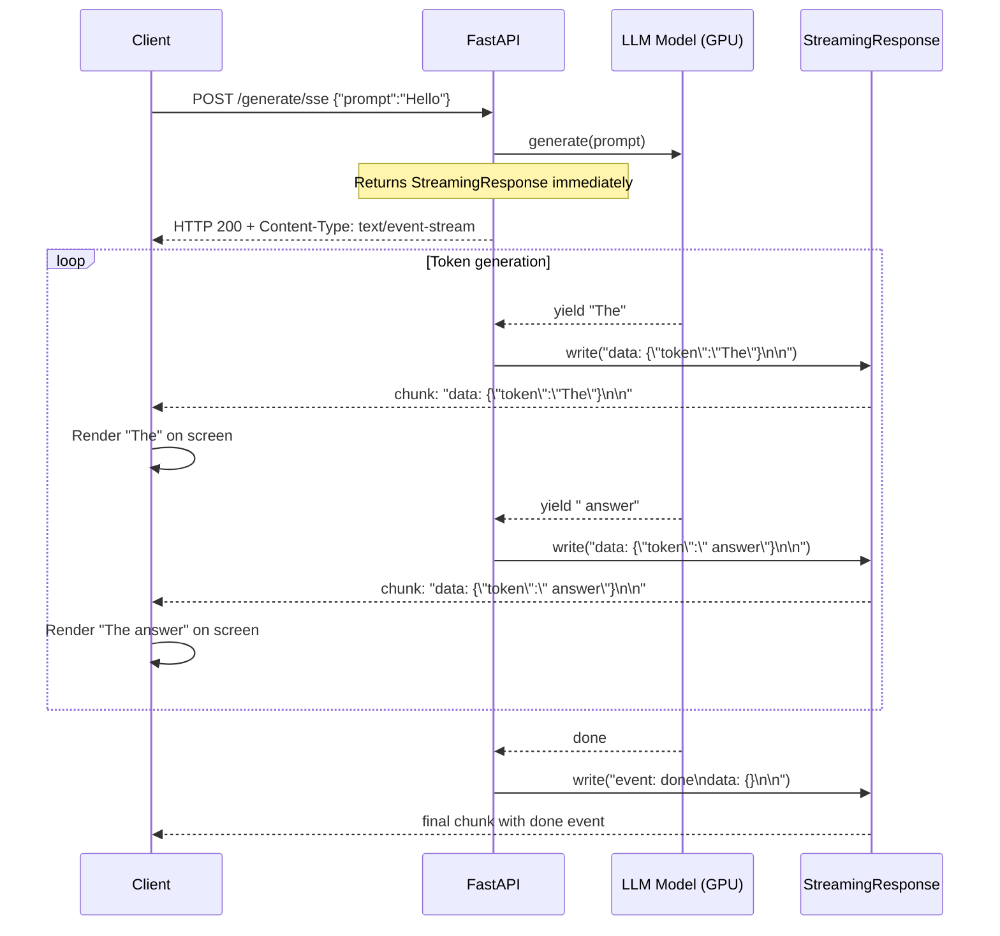
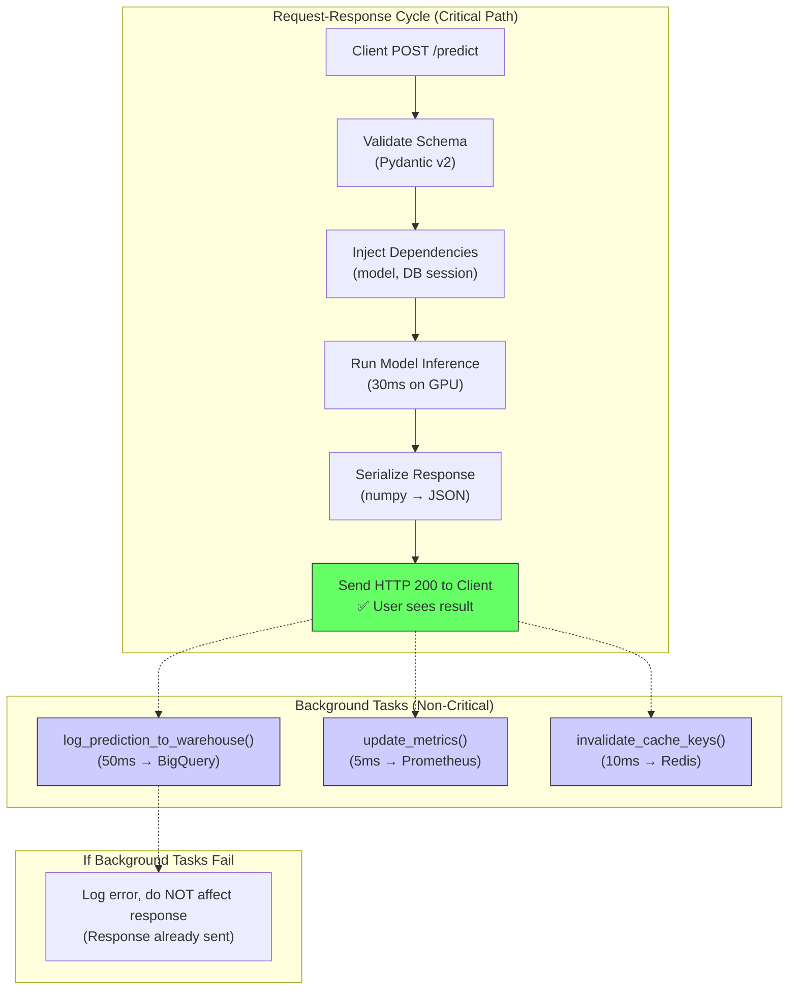
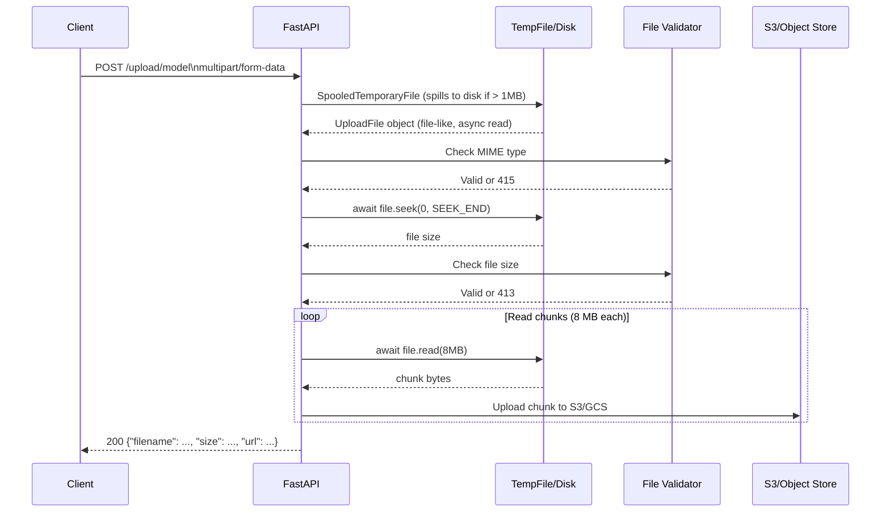
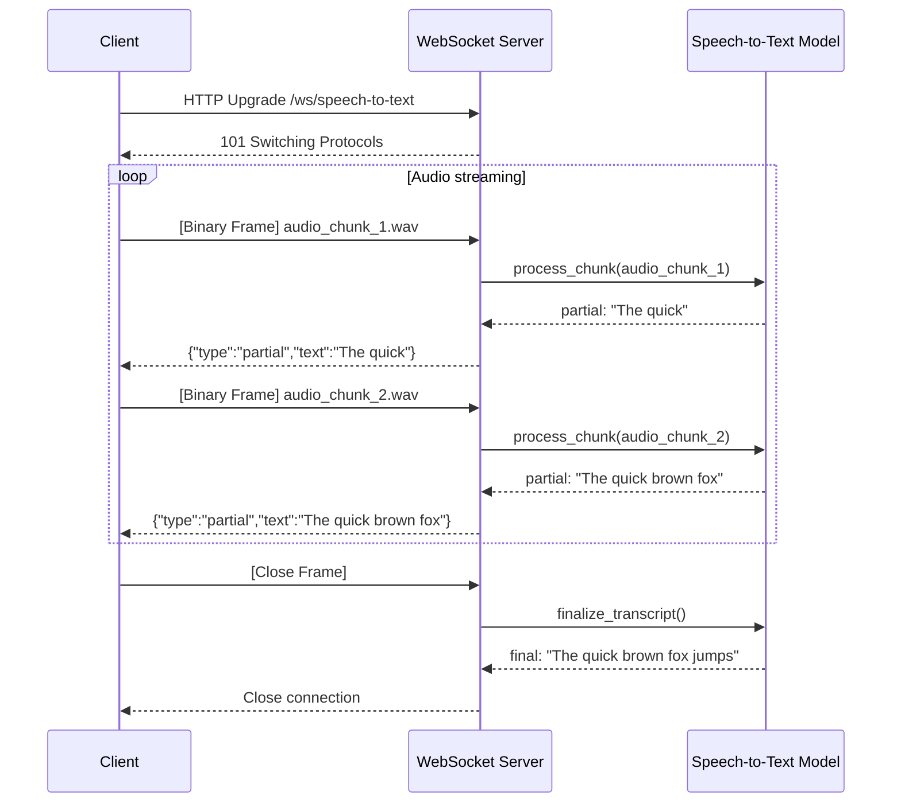

# 📡 Streaming, Background Tasks, and Real-Time Endpoints

## 🎯 Learning Objectives

- Implement `StreamingResponse` for LLM token-by-token generation and SSE (Server-Sent Events) for progressive result delivery
- Design `BackgroundTasks` patterns for non-blocking audit logging, metric collection, and async notification pipelines in ML services
- Handle large file uploads (model weights, datasets, multimedia) with `UploadFile`, chunked streaming, and progress tracking
- Build WebSocket endpoints for bidirectional ML inference including real-time speech translation and collaborative model interactions

## Introduction

REST is not always the right abstraction for ML inference. When a language model generates 512 tokens, the user waits 2–5 seconds staring at a loading spinner. When a speech recognition model processes a 30-second audio file, buffering the entire clip before returning a transcript adds unacceptable latency. When a collaborative filtering system updates recommendations in real time as a user browses, polling `/predict` every second wastes bandwidth and compute. These scenarios demand streaming, background processing, and persistent connections — features that FastAPI inherits from Starlette and exposes with Pythonic ergonomics.

Streaming responses are the bridge between batch processing and real-time user experience. By yielding tokens as the model generates them, the client can begin rendering text before the full sequence completes. This pattern — ubiquitous in ChatGPT, Claude, and other LLM products — is implemented in FastAPI via `StreamingResponse` wrapping an async generator. Background tasks complement streaming by decoupling the critical path (return a response to the user) from the post-processing path (log the prediction, update metrics, trigger a retraining pipeline). WebSockets complete the triad by enabling bidirectional, persistent connections where the server can push model outputs without waiting for a client request — essential for real-time speech, translation, and collaborative filtering (see [[../../30 - WebSockets and Real-Time ML/00 - WebSockets and Real-Time ML|WebSockets and Real-Time ML]]).

This note covers all three patterns with production code and real-world ML use cases. You will build streaming LLM endpoints, background task pipelines for audit logging, chunked file upload handlers, and bidirectional WebSocket inference endpoints — all within FastAPI's unified routing system.

---

## Module 1: StreamingResponse for LLM Token Generation

### 1.1 Theoretical Foundation 🧠

HTTP traditionally follows a request-response model: the client sends a complete request, the server computes a complete response, and the connection closes (or is reused via keep-alive). Streaming inverts this: the server begins sending response body chunks before the full response is computed. HTTP/1.1 enables this via `Transfer-Encoding: chunked`, where the server writes chunks of arbitrary size, and the client reads them as they arrive. The connection remains open until the server sends a zero-length chunk signaling completion.

For LLM inference, this is transformative. An autoregressive language model generates tokens sequentially, each dependent on all previous tokens. Without streaming, the user waits for full generation (e.g., 512 tokens × 10 ms/token = 5.12 seconds) before seeing any output. With streaming, the server yields tokens as the model produces them — the first token appears in ~10 ms, and subsequent tokens stream at the model's generation rate. Perceived latency drops from 5 seconds to near-zero, and the user can abort early if the output is clearly wrong, saving GPU compute.

Server-Sent Events (SSE) is a W3C standard that formalizes streaming over HTTP using `Content-Type: text/event-stream`. Each event carries an optional `event:` type, `data:` payload, and `id:` identifier. SSE is simpler than WebSockets for unidirectional server→client streams and integrates naturally with FastAPI's `StreamingResponse`. LLM products (OpenAI, Anthropic, Together AI) use SSE for token streaming, making it the de facto standard.

### 1.2 Mental Model 📐

```
┌─── Streaming vs Non-Streaming LLM Generation ───────────┐
│                                                          │
│  Non-Streaming (batch):                                  │
│  Client ──req──▶ [Generate 512 tokens: 5s] ──resp──▶    │
│  Time to first byte (TTFB): 5,000 ms                     │
│                                                          │
│  Streaming (chunked):                                    │
│  Client ──req──▶ [Tok1 10ms] [Tok2 10ms] ... [Tok512]    │
│  Time to first byte (TTFB): 10 ms                        │
│  User sees: "The capital of France is..." appearing live │
│                                                          │
│  ┌────────────┬─────────────────────────────────┐       │
│  │  Latency   │ Non-streaming │ Streaming       │       │
│  ├────────────┼─────────────────────────────────┤       │
│  │ TTFB       │ 5,000 ms      │ 10 ms           │       │
│  │ Completion │ 5,000 ms      │ 5,000 ms        │       │
│  │ Perceived  │ 5,000 ms      │ ~0 ms (live UX) │       │
│  │ Cancelable │ No (all or    │ Yes (close SSE  │       │
│  │            │  nothing)     │  connection)    │       │
│  └────────────┴─────────────────────────────────┘       │
└──────────────────────────────────────────────────────────┘
```

```
┌─── SSE Event Stream Format ─────────────────────────────┐
│                                                          │
│  HTTP Response Headers:                                  │
│  Content-Type: text/event-stream                         │
│  Cache-Control: no-cache                                 │
│  Connection: keep-alive                                  │
│                                                          │
│  Response Body (events separated by \n\n):               │
│                                                          │
│  data: {"token": "The", "index": 0}\n\n                  │
│  data: {"token": " capital", "index": 1}\n\n             │
│  data: {"token": " of", "index": 2}\n\n                  │
│  ...                                                     │
│  event: done\n                                           │
│  data: {"finish_reason": "stop"}\n\n                     │
└──────────────────────────────────────────────────────────┘
```

### 1.3 Syntax and Semantics 📝

```python
import asyncio
import json
from typing import AsyncGenerator

from fastapi import FastAPI
from fastapi.responses import StreamingResponse
from starlette.responses import Response

app = FastAPI()

# ─── SIMULATED LLM: yields tokens with realistic delays ───
# WHY: Real LLMs generate tokens sequentially through the model.
# Each token depends on all previous tokens (autoregressive).
# This generator mimics that pattern for testing/demonstration.
async def mock_llm_generate(prompt: str) -> AsyncGenerator[str, None]:
    tokens = ["The", " answer", " is", " 42", "."]
    for i, token in enumerate(tokens):
        await asyncio.sleep(0.05)  # simulate per-token inference time
        yield token

# ─── PATTERN 1: Plain text streaming (simple, not SSE) ───
# WHY: For internal tools or when the client reads raw chunks.
# Content-Type: text/plain is simpler than SSE but less structured.
@app.post("/generate/plain")
async def generate_plain(prompt: str):
    async def event_stream() -> AsyncGenerator[str, None]:
        async for token in mock_llm_generate(prompt):
            yield token
    return StreamingResponse(
        event_stream(),
        media_type="text/plain",
        headers={"X-Accel-Buffering": "no"},  # disable nginx buffering
    )

# ─── PATTERN 2: SSE streaming (industry standard) ───
# WHY: SSE format (data: {...}\n\n) is what OpenAI, Anthropic,
# and other LLM APIs use. Clients (JS EventSource, Python sseclient)
# parse this natively. Structured events enable typed payloads.
async def sse_event_stream(prompt: str) -> AsyncGenerator[str, None]:
    token_index = 0
    async for token in mock_llm_generate(prompt):
        event_data = json.dumps({
            "token": token,
            "index": token_index,
        })
        yield f"data: {event_data}\n\n"
        token_index += 1
    yield "event: done\ndata: {}\n\n"

@app.post("/generate/sse")
async def generate_sse(prompt: str):
    return StreamingResponse(
        sse_event_stream(prompt),
        media_type="text/event-stream",
        headers={
            "Cache-Control": "no-cache",
            "Connection": "keep-alive",
            "X-Accel-Buffering": "no",
        },
    )

# ─── PATTERN 3: Early abort (client disconnects) ───
# WHY: When a user cancels generation (clicks Stop or navigates away),
# the server should stop GPU inference to free resources for other users.
# FastAPI detects client disconnection by checking await request.is_disconnected().
from fastapi import Request

@app.post("/generate/abortable")
async def generate_abortable(request: Request, prompt: str):
    async def event_stream() -> AsyncGenerator[str, None]:
        async for token in mock_llm_generate(prompt):
            # Check if client disconnected between tokens
            if await request.is_disconnected():
                break  # stop generation, free GPU
            yield f"data: {json.dumps({'token': token})}\n\n"
        yield "event: done\ndata: {}\n\n"

    return StreamingResponse(
        event_stream(),
        media_type="text/event-stream",
    )

# ─── PATTERN 4: NDJSON streaming for batch processing ───
# WHY: When processing a batch of predictions, streaming NDJSON
# (newline-delimited JSON) lets the client process results incrementally
# rather than waiting for the entire batch to complete.
@app.post("/predict/batch-stream")
async def predict_batch_stream(texts: list[str]):
    async def event_stream() -> AsyncGenerator[str, None]:
        for i, text in enumerate(texts):
            result = {"index": i, "text": text, "prediction": 0.95}
            await asyncio.sleep(0.02)  # simulate per-item inference
            yield json.dumps(result) + "\n"
    return StreamingResponse(
        event_stream(),
        media_type="application/x-ndjson",
    )
```

### 1.4 Visual Representation 🖼️



### 1.5 Application in ML/AI Systems 🤖

Anthropic's Claude API streams tokens using SSE, and their implementation influenced the patterns now standard across the LLM industry. When a user sends a chat message, Claude's API returns `text/event-stream` with structured events: `message_start` (message metadata), `content_block_delta` (token text), `message_delta` (stop reason and usage stats), and `message_stop`. Each event carries a JSON payload with the incremental data. Anthropic's client SDKs (Python, TypeScript) parse these events into async iterators, enabling patterns like:

```python
async with client.messages.stream(...) as stream:
    async for text in stream.text_stream:
        print(text, end="", flush=True)
```

This ergonomic SDK pattern — wrapping SSE in a language-native async iterator — is the gold standard for LLM API streaming. FastAPI makes it trivial to build equivalent endpoints for custom or fine-tuned models deployed internally.

### 1.6 Common Pitfalls ⚠️ + 💡 Tips

⚠️ **Pitfall**: Placing `StreamingResponse` behind an nginx reverse proxy without `proxy_buffering off;`. Nginx buffers the response by default, defeating the point of streaming.

💡 **Tip**: For nginx: `proxy_buffering off;` and `proxy_cache off;`. For the application, set `X-Accel-Buffering: no` header. For CloudFlare or CDNs, verify they support streaming.

⚠️ **Pitfall**: Forgetting to `await` inside the async generator. The generator itself is async; if you call synchronous blocking code inside it, you block the event loop during streaming.

💡 **Tip**: Every I/O operation inside a `StreamingResponse` generator must be `await`ed. For CPU-bound token generation, offload to `run_in_executor`.

⚠️ **Pitfall**: Not handling client disconnection. If the client closes the tab, the generator continues consuming GPU resources for a response nobody will see.

💡 **Tip**: Check `await request.is_disconnected()` regularly in long-running generators and break the loop when detected.

### 1.7 Knowledge Check ❓

1. What is the difference between `StreamingResponse` with `text/plain` and `text/event-stream`? When would you choose each?
2. A client disconnects mid-generation. How does the server detect this, and why is it important for GPU resource management?
3. You wrap a synchronous LLM call inside a `StreamingResponse` async generator. The LLM takes 3 seconds per token. What's wrong with this design?

---

## Module 2: BackgroundTasks for Non-Blocking Post-Processing

### 2.1 Theoretical Foundation 🧠

Every ML prediction has side effects that should not block the response to the user: logging the prediction to a data warehouse, updating a metric dashboard, triggering a model retraining threshold check, publishing to a message queue for downstream consumers, or writing an audit trail for compliance. These operations are important — an unaudited prediction pipeline violates SOC 2 and GDPR data processing requirements — but they are not on the critical path. The user should not wait an extra 50 ms for a log write when the prediction itself only took 30 ms.

FastAPI's `BackgroundTasks` solves this by decoupling the request-response lifecycle from post-processing work. When an endpoint adds a task via `background_tasks.add_task(func, *args)`, FastAPI registers the callable. After the response is sent to the client (headers and body fully transmitted), the server executes all registered background tasks in the same process. This guarantees the user gets their prediction first, and the audit trail updates eventually.

Important limitation: `BackgroundTasks` runs synchronously in the same process. For I/O-heavy background work (database writes, HTTP calls), this is acceptable. For CPU-heavy work (data validation, metric aggregation), it can compete with the next request's processing. For serious background processing, use a proper task queue (Celery, ARQ, or cloud equivalents like SQS + Lambda). FastAPI's `BackgroundTasks` is best for lightweight post-processing: logging, cache invalidation, metric counters, and notification dispatches. For asynchronous background work patterns common in ML pipelines, see also [[../../25 - Bases de Datos y Message Queues/30 - Message Queues y Event-Driven/30 - Message Queues y Event-Driven|Message Queues and Event-Driven ML]].

### 2.2 Mental Model 📐

```
┌─── Request → Response → Background Task Flow ───────────┐
│                                                          │
│  Time ──────────────────────────────────────────────▶    │
│                                                          │
│  Client:  [POST /predict]────────────[render result]     │
│  Server:  [validate] [predict] [serialize]               │
│                   │                │                     │
│                   │   RESPONSE     │                     │
│                   │   SENT HERE    │                     │
│                   │                ▼                     │
│                   │  [background: log to warehouse]      │
│                   │  [background: update prometheus]     │
│                   │  [background: check drift threshold] │
│                   │                                     │
│  User sees result BEFORE background tasks complete       │
└──────────────────────────────────────────────────────────┘
```

```
┌─── BackgroundTasks vs Task Queue ────────────────────────┐
│                                                          │
│  Aspect         │ BackgroundTasks    │ Task Queue (Celery)│
│  ───────────────┼────────────────────┼───────────────────│
│  Execution      │ Same process       │ Separate worker   │
│  Latency        │ Low (in-process)   │ Higher (network)  │
│  Reliability    │ Lost on crash      │ Persistent (Redis)│
│  Retries        │ Manual             │ Built-in          │
│  Scalability    │ Single process     │ N workers         │
│  Use case       │ Audit log, metrics │ Heavy processing  │
│                 │ cache invalidation │ image generation  │
│  ───────────────┼────────────────────┼───────────────────│
│  Best for:      │ < 50ms background  │ > 100ms background│
│                 │ ops per request    │ ops, or critical  │
└──────────────────────────────────────────────────────────┘
```

### 2.3 Syntax and Semantics 📝

```python
import asyncio
import json
import time
from datetime import datetime, timezone
from typing import Any

from fastapi import BackgroundTasks, FastAPI
from pydantic import BaseModel

app = FastAPI()

# ─── BACKGROUND FUNCTIONS (must be synchronous or async-callable) ───

def log_prediction_to_warehouse(
    request_id: str,
    input_hash: str,
    prediction: float,
    model_version: str,
    latency_ms: float,
):
    """Write prediction audit trail to data warehouse.
    WHY: Compliance (GDPR, SOC 2) requires an immutable record of every
    prediction. This is a side effect — the user doesn't need it to return.
    """
    record = {
        "timestamp": datetime.now(timezone.utc).isoformat(),
        "request_id": request_id,
        "input_hash": input_hash,
        "prediction": prediction,
        "model_version": model_version,
        "latency_ms": latency_ms,
    }
    # In production: write to BigQuery, Snowflake, or append to a log file
    # that's ingested by a warehouse pipeline.
    print(f"[AUDIT] {json.dumps(record)}")

def update_metrics(model_version: str, latency_ms: float, prediction: float):
    """Increment Prometheus counters for monitoring.
    WHY: Real-time metrics enable dashboards and alerts without blocking
    the critical prediction path.
    """
    # In production: prometheus_client.Counter or statsd client
    print(f"[METRICS] model={model_version} latency={latency_ms}ms pred={prediction}")

def invalidate_cache_keys(keys: list[str]):
    """Purge stale cache entries after a prediction updates model state.
    WHY: If predictions affect downstream state, cached responses may be stale.
    """
    print(f"[CACHE] Invalidating keys: {keys}")

# ─── ENDPOINT WITH BACKGROUND TASKS ───

class PredictRequest(BaseModel):
    text: str
    model_version: str = "v1"

@app.post("/predict")
async def predict(req: PredictRequest, background_tasks: BackgroundTasks):
    start = time.perf_counter()

    # Core prediction (critical path — must be fast)
    prediction = 0.95  # substitute with actual model.predict()
    input_hash = f"sha256:{hash(req.text) % 10**12}"
    latency_ms = (time.perf_counter() - start) * 1000

    # Register background tasks — executed AFTER response is sent
    background_tasks.add_task(
        log_prediction_to_warehouse,
        request_id=f"req_{int(time.time() * 1000)}",
        input_hash=input_hash,
        prediction=prediction,
        model_version=req.model_version,
        latency_ms=latency_ms,
    )
    background_tasks.add_task(
        update_metrics, req.model_version, latency_ms, prediction
    )

    # Response is sent immediately — user doesn't wait for logging
    return {"prediction": prediction, "latency_ms": latency_ms}

# ─── BACKGROUND TASKS WITH ASYNC FUNCTIONS ───
# WHY: BackgroundTasks.add_task works with async functions too.
# For I/O-heavy background work (HTTP calls to notification services),
# use async functions to avoid blocking the background task queue.

async def notify_slack_async(webhook_url: str, message: str):
    """Send notification to Slack asynchronously."""
    import httpx
    async with httpx.AsyncClient() as client:
        await client.post(webhook_url, json={"text": message})

@app.post("/predict-with-notify")
async def predict_with_notify(
    req: PredictRequest, background_tasks: BackgroundTasks
):
    prediction = 0.95
    # Async function in background task — works correctly
    background_tasks.add_task(
        notify_slack_async,
        "https://hooks.slack.com/services/...",
        f"Prediction: {prediction}",
    )
    return {"prediction": prediction}
```

### 2.4 Visual Representation 🖼️



### 2.5 Application in ML/AI Systems 🤖

Uber's real-time pricing service processes billions of predictions daily. Every ride estimate prediction triggers three background tasks: (1) log the full feature vector + prediction to HDFS for offline model training (compliance requirement), (2) update a real-time metrics dashboard tracking prediction distribution by city and time, and (3) check if the model's prediction confidence fell below a threshold (triggering an automated model rollback). These tasks run asynchronously via FastAPI's BackgroundTasks equivalents in their internal framework. The user's ride estimate arrives in < 100 ms; the audit log, metrics, and drift check complete within 2–5 seconds. This decoupling is essential: if the background tasks ran synchronously, the user would experience 500+ ms latency for what they perceive as a simple "get price" operation.

### 2.6 Common Pitfalls ⚠️ + 💡 Tips

⚠️ **Pitfall**: Passing mutable objects (lists, dicts) to `background_tasks.add_task` that are modified after the response. The background task executes later and sees the mutated state.

💡 **Tip**: Pass immutable values or deep-copy mutable arguments. Better yet, serialize the complete state (e.g., as a dataclass) before adding the task.

⚠️ **Pitfall**: Assuming background tasks guarantee execution. If the process crashes between response and task execution, the task is lost.

💡 **Tip**: For critical background work (e.g., audit logs for compliance), write a synchronous pre-response log at minimum, and use the background task for enhancement/linking. For true durability, use a persistent task queue.

⚠️ **Pitfall**: Raising exceptions in background tasks with no error handling. The task fails silently, and audit trails or metrics go missing.

💡 **Tip**: Wrap background task logic in try/except with logging and alerting. Consider a dead-letter pattern: if a background task fails after N retries, write the payload to a "failed tasks" queue for manual inspection.

### 2.7 Knowledge Check ❓

1. When does FastAPI execute functions registered via `background_tasks.add_task()`? Before or after the HTTP response is sent?
2. Your background task writes to a database that's temporarily unavailable. The response already returned 200. How should you handle the DB failure?
3. What makes `BackgroundTasks` unsuitable for a task that takes 5 seconds and must survive a server restart?

---

## Module 3: File Uploads and Binary Data

### 3.1 Theoretical Foundation 🧠

ML APIs consume more than JSON: model weight files (.pt, .h5, .onnx), training datasets (.csv, .parquet, .tfrecord), images (.jpg, .png), audio (.wav, .mp3), and video (.mp4). FastAPI's `UploadFile` handles these binary payloads by streaming them to disk or memory via Python's `tempfile.SpooledTemporaryFile`. Files smaller than a configurable threshold (default 1 MB) are held in memory; larger files spill to disk.

`UploadFile` provides an async interface (`await file.read()`, `await file.seek()`, `await file.write()`) that cooperates with the event loop. For large files — a 5 GB model checkpoint, a 10 GB training dataset — reading the entire file into memory is impossible. Instead, process the file in chunks: read N bytes, validate/transform them, write to the destination (object storage, model registry), and repeat. This streaming approach bounds memory usage to the chunk size regardless of file size.

FastAPI supports multiple file uploads via `list[UploadFile]`, enabling batch file processing where each file is processed concurrently. For ML serving, file upload endpoints are used for: custom model registration (users upload fine-tuned weights), dataset preview (upload a sample CSV, get schema inference and statistics), and media inference (upload an image, get object detection results). File validation — checking MIME types, file size, virus scanning — should happen at the middleware or dependency injection layer before the file reaches business logic.

### 3.2 Mental Model 📐

```
┌─── UploadFile Processing Pipeline ──────────────────────┐
│                                                          │
│  Client: [multipart/form-data POST /upload]              │
│       │                                                  │
│       ▼                                                  │
│  ┌─────────────────────────────────────────┐            │
│  │ Starlette Request Parser                │            │
│  │ ┌─────────────────────────────────────┐ │            │
│  │ │ SpooledTemporaryFile                │ │            │
│  │ │ < 1 MB → BytesIO (memory)           │ │            │
│  │ │ >= 1 MB → TemporaryFile (disk)      │ │            │
│  │ └─────────────────────────────────────┘ │            │
│  └─────────────────────────────────────────┘            │
│       │                                                  │
│       ▼                                                  │
│  ┌────────────┐  ┌──────────┐  ┌───────────────┐        │
│  │ Validate   │─▶│Process   │─▶│ Persist       │        │
│  │ MIME type  │  │ in chunks│  │ S3/GCS/Model  │        │
│  │ file size  │  │ transform│  │ Registry       │        │
│  │ magic bytes│  │          │  │               │        │
│  └────────────┘  └──────────┘  └───────────────┘        │
└──────────────────────────────────────────────────────────┘
```

```
┌─── Chunked Processing Memory Profile ───────────────────┐
│                                                          │
│  Naive: file.read() → O(file_size) memory                │
│  File: 5 GB model checkpoint                             │
│  Memory: 5 GB + overhead → OOM on 4 GB instance          │
│                                                          │
│  Chunked: read(N) → O(chunk_size) memory                 │
│  File: 5 GB model checkpoint                             │
│  Chunk size: 8 MB                                        │
│  Memory: 8 MB + overhead → fits on any instance           │
│                                                          │
│  ┌──────────┬──────────────────────────────────┐        │
│  │ Approach │ 5 GB File │ 10 GB File │ 100 GB  │        │
│  ├──────────┼──────────────────────────────────┤        │
│  │ read()   │ 5 GB RAM  │ OOM        │ OOM     │        │
│  │ read(8MB)│ 8 MB RAM  │ 8 MB RAM   │ 8 MB RAM│        │
│  └──────────┴──────────────────────────────────┘        │
└──────────────────────────────────────────────────────────┘
```

### 3.3 Syntax and Semantics 📝

```python
import hashlib
import os
from pathlib import Path
from typing import AsyncGenerator

from fastapi import FastAPI, UploadFile, File, HTTPException, Form
from fastapi.responses import StreamingResponse

app = FastAPI()

UPLOAD_DIR = Path("/tmp/ml-uploads")
UPLOAD_DIR.mkdir(parents=True, exist_ok=True)
MAX_FILE_SIZE = 5 * 1024 * 1024 * 1024  # 5 GB

# ─── Single file upload with validation ───
# WHY: Validate MIME type and size before processing. Reject invalid
# files at the API boundary to prevent wasted CPU/disk I/O.
ALLOWED_MIME_TYPES = {
    "application/octet-stream",
    "application/x-hdf5",
    "application/zip",
}

@app.post("/upload/model")
async def upload_model(
    file: UploadFile = File(...),
    model_name: str = Form(...),
):
    if file.content_type not in ALLOWED_MIME_TYPES:
        raise HTTPException(
            status_code=415,
            detail=f"Unsupported file type: {file.content_type}",
        )

    # Check file size by seeking to end (UploadFile supports seek)
    await file.seek(0, os.SEEK_END)
    size = await file.tell()
    await file.seek(0)  # reset to beginning for reading

    if size > MAX_FILE_SIZE:
        raise HTTPException(
            status_code=413,
            detail=f"File too large: {size} bytes (max {MAX_FILE_SIZE})",
        )

    # Save to disk (for large files, use chunked write)
    file_path = UPLOAD_DIR / f"{model_name}_{hashlib.sha256(file.filename.encode()).hexdigest()[:8]}"
    with open(file_path, "wb") as f:
        while chunk := await file.read(8 * 1024 * 1024):  # 8 MB chunks
            f.write(chunk)

    return {
        "filename": file.filename,
        "size_bytes": size,
        "saved_to": str(file_path),
    }

# ─── Streaming file upload with progress ───
# WHY: For very large files, provide upload progress to the client
# via Server-Sent Events during the upload process.
@app.post("/upload/model-with-progress")
async def upload_model_with_progress(
    file: UploadFile = File(...),
):
    async def progress_stream() -> AsyncGenerator[str, None]:
        total = 0
        chunk_size = 8 * 1024 * 1024
        file_path = UPLOAD_DIR / file.filename

        with open(file_path, "wb") as f:
            while chunk := await file.read(chunk_size):
                f.write(chunk)
                total += len(chunk)
                yield f"data: {json.dumps({'bytes_uploaded': total})}\n\n"

        yield f"event: complete\ndata: {json.dumps({'total_bytes': total})}\n\n"

    return StreamingResponse(
        progress_stream(),
        media_type="text/event-stream",
    )

# ─── Multiple file upload for batch processing ───
# WHY: ML training pipelines often require uploading multiple files
# (weights + config + tokenizer). list[UploadFile] handles this natively.
@app.post("/upload/batch")
async def upload_batch(files: list[UploadFile] = File(...)):
    results = []
    for file in files:
        content = await file.read()
        results.append({
            "filename": file.filename,
            "size": len(content),
            "content_type": file.content_type,
        })
    return {"files": results}

# ─── Image inference endpoint ───
# WHY: Common ML pattern: upload an image, return predictions.
# Image bytes → model inference → JSON response.
@app.post("/infer/image")
async def infer_image(file: UploadFile = File(...)):
    if not file.content_type or not file.content_type.startswith("image/"):
        raise HTTPException(415, "Only image files are accepted")

    image_bytes = await file.read()
    # In production: open with PIL/cv2, preprocess, run model
    prediction = {"class": "cat", "confidence": 0.97}
    return prediction
```

### 3.4 Visual Representation 🖼️



### 3.5 Application in ML/AI Systems 🤖

Roboflow's ML platform allows users to upload custom image datasets for training object detection and segmentation models. Their upload API, built on FastAPI, accepts thousands of images in a single multipart request. Each image must be validated (valid JPEG/PNG, correct dimensions, not corrupted) before being stored. Roboflow uses a chunked upload pattern: `UploadFile` reads images in 1 MB chunks, validates headers on the first chunk, and streams directly to cloud storage (S3/GCS) without buffering the entire file on the API server. This architecture lets a single FastAPI instance handle hundreds of concurrent uploads with minimal memory footprint — critical when users upload datasets with 50,000+ images.

### 3.6 Common Pitfalls ⚠️ + 💡 Tips

⚠️ **Pitfall**: Calling `await file.read()` on a 2 GB file without chunking. This loads the entire file into memory, potentially crashing the server.

💡 **Tip**: Always use `await file.read(chunk_size)` in a loop for files that may exceed available RAM. Default chunk size of 8 MB balances throughput and memory.

⚠️ **Pitfall**: Not resetting the file pointer with `await file.seek(0)` after seeking to determine file size. Subsequent reads return empty bytes.

💡 **Tip**: After any seek, always `await file.seek(0)` to return to the beginning before reading content.

⚠️ **Pitfall**: Trusting `file.content_type` from the client without additional validation. Clients can send arbitrary Content-Type headers.

💡 **Tip**: Validate file content by reading magic bytes: `b'\x89PNG'` for PNG, `b'\xff\xd8'` for JPEG, `b'HDF'` for HDF5. Check the first few bytes after `await file.read(8)` and `await file.seek(0)`.

### 3.7 Knowledge Check ❓

1. A user uploads a 500 MB model file via `UploadFile`. Where does FastAPI store this file during processing?
2. You call `await file.seek(0, os.SEEK_END)` to check size, then `await file.read()` to get content. What's the bug?
3. Why should you validate `file.content_type` AND file magic bytes rather than trusting `content_type` alone?

---

## Module 4: WebSocket Endpoints for Bidirectional ML Inference

### 4.1 Theoretical Foundation 🧠

WebSockets upgrade an HTTP connection to a persistent, bidirectional TCP socket. Unlike SSE (server→client only) or standard HTTP (client→server, then server→client), WebSockets enable full-duplex communication: the client can send audio frames while simultaneously receiving transcription text. This is essential for real-time ML use cases: speech-to-text (streaming audio in, streaming text out), live translation (text in, translated text out, with corrections), collaborative model control (adjust generation parameters mid-stream), and multi-turn agent conversations where the agent may proactively push updates.

FastAPI inherits WebSocket support from Starlette. An endpoint is declared with `@app.websocket("/ws")`, and the handler receives a `WebSocket` object with `await websocket.accept()`, `await websocket.receive_text()` / `receive_bytes()` / `receive_json()`, and `await websocket.send_text()` / `send_bytes()` / `send_json()` methods. The connection stays open until either side calls `await websocket.close()`.

WebSockets introduce challenges not present in stateless HTTP: connection state management (a disconnected client leaves a model stream dangling), backpressure (the server generates tokens faster than the client can process them), and authentication (WebSocket upgrade requests carry HTTP headers, so token auth works, but session management differs from REST). For ML APIs, WebSockets are the right choice when the interaction pattern is bidirectional, latency-sensitive, and persistent — precisely the scenarios covered in depth in [[../../30 - WebSockets and Real-Time ML/00 - WebSockets and Real-Time ML|WebSockets and Real-Time ML]].

### 4.2 Mental Model 📐

```
┌─── WebSocket vs HTTP Lifecycle ──────────────────────────┐
│                                                          │
│  HTTP:                                                   │
│  Client ──req──▶ Server ──resp──▶ Client (connection ends)│
│  Each interaction: new TCP + TLS + request + response     │
│                                                          │
│  WebSocket:                                              │
│  Client ──upgrade──▶ Server ──101──▶ Client              │
│  Client ◀═══════════▶ Server (persistent bidirectional)  │
│  ┌──────────────────────────────────────────────────┐    │
│  │ Use case         │ HTTP? │ WS?   │ SSE?          │    │
│  ├──────────────────┼───────┼───────┼───────────────┤    │
│  │ Single prediction│  ✅   │  ❌   │  ❌           │    │
│  │ LLM token stream │  ❌   │  ✅   │  ✅ (best)   │    │
│  │ Audio→Transcript │  ❌   │  ✅   │  ❌           │    │
│  │ Chat conversation│  ❌   │  ✅   │  ✅           │    │
│  │ Live dash metrics│  ❌   │  ✅   │  ✅           │    │
│  │ Model fine-tune  │  ❌   │  ✅   │  ❌           │    │
│  └──────────────────┴───────┴───────┴───────────────┘    │
└──────────────────────────────────────────────────────────┘
```

### 4.3 Syntax and Semantics 📝

```python
import asyncio
import json
from typing import Optional

from fastapi import FastAPI, WebSocket, WebSocketDisconnect

app = FastAPI()

# ─── WebSocket endpoint: bidirectional ML inference ───
# WHY: WebSockets enable the server to push results without waiting
# for a client request. Ideal for streaming translation, speech-to-text,
# or collaborative model interactions.

class ConnectionManager:
    """Manages active WebSocket connections and broadcasts."""
    def __init__(self):
        self.active_connections: list[WebSocket] = []

    async def connect(self, websocket: WebSocket):
        await websocket.accept()
        self.active_connections.append(websocket)

    def disconnect(self, websocket: WebSocket):
        self.active_connections.remove(websocket)

    async def send_personal(self, message: str, websocket: WebSocket):
        await websocket.send_text(message)

    async def broadcast(self, message: str):
        for connection in self.active_connections:
            await connection.send_text(message)

manager = ConnectionManager()

# ─── Real-time translation endpoint ───
# WHY: User types source language text, server pushes translated text
# incrementally as the model generates. Bidirectional: user can edit
# source text while translation is in progress.
@app.websocket("/ws/translate")
async def translate_websocket(websocket: WebSocket):
    await manager.connect(websocket)
    try:
        while True:
            # Receive source text from client
            source_text = await websocket.receive_text()

            # Simulate incremental translation
            # In production: run a translation model, yield tokens
            translations = [
                "Hello", " world", "!", None  # None signals completion
            ]
            for token in translations:
                if token is None:
                    await websocket.send_json({
                        "type": "done",
                        "original": source_text,
                    })
                else:
                    await asyncio.sleep(0.03)  # simulate inference
                    await websocket.send_json({
                        "type": "token",
                        "token": token,
                    })
    except WebSocketDisconnect:
        manager.disconnect(websocket)

# ─── Speech-to-text with audio chunks ───
# WHY: Audio arrives as binary chunks. The server processes each chunk
# incrementally and pushes partial transcript updates.
@app.websocket("/ws/speech-to-text")
async def speech_to_text(websocket: WebSocket):
    await websocket.accept()
    transcript = []
    try:
        while True:
            # Receive binary audio chunk
            audio_chunk = await websocket.receive_bytes()

            # Simulate ASR processing
            # In production: feed audio_chunk to Whisper/SpeechBrain
            await asyncio.sleep(0.05)
            transcript.append("word")

            # Push updated transcript
            await websocket.send_json({
                "type": "partial",
                "text": " ".join(transcript),
            })
    except WebSocketDisconnect:
        # Final transcript when connection closes
        print(f"Final transcript: {' '.join(transcript)}")

# ─── Model parameter tuning via WebSocket ───
# WHY: Collaborative scenarios where users adjust generation parameters
# (temperature, top_p) mid-stream and see results immediately.
@app.websocket("/ws/generate")
async def generate_websocket(websocket: WebSocket):
    await websocket.accept()
    params = {"temperature": 0.7, "top_p": 0.9}
    try:
        while True:
            data = await websocket.receive_json()
            action = data.get("action")

            if action == "generate":
                prompt = data["prompt"]
                for i in range(5):
                    await asyncio.sleep(0.1)
                    await websocket.send_json({
                        "token": f"tok_{i}",
                        "params": params,
                    })
            elif action == "update_params":
                params.update(data.get("params", {}))
                await websocket.send_json({
                    "status": "params_updated",
                    "params": params,
                })
            elif action == "stop":
                await websocket.send_json({"status": "stopped"})
    except WebSocketDisconnect:
        pass
```

### 4.4 Visual Representation 🖼️



### 4.5 Application in ML/AI Systems 🤖

Google's Cloud Speech-to-Text API supports both REST (batch) and gRPC streaming (real-time) interfaces. The streaming interface uses bidirectional gRPC streams — the WebSocket equivalent in gRPC — where the client sends audio chunks and receives incremental transcription results. Google designed this because speech recognition is fundamentally a streaming problem: users start speaking before the utterance is complete, and showing partial results creates a responsive experience. FastAPI's WebSocket support enables building equivalent streaming inference APIs for custom models without the operational complexity of gRPC infrastructure. Companies like Descript (audio/video editing) use this pattern extensively: their backend, built on async Python, receives audio via WebSockets and streams transcript text and speaker diarization labels in real time.

### 4.6 Common Pitfalls ⚠️ + 💡 Tips

⚠️ **Pitfall**: Using `await websocket.receive_text()` without a timeout or heartbeat. If the client is idle but connected, the handler blocks indefinitely, consuming a coroutine slot.

💡 **Tip**: Use `asyncio.wait_for(websocket.receive_text(), timeout=HEARTBEAT_INTERVAL)` and send ping/pong frames. Or implement a read loop that checks `websocket.client_state` periodically.

⚠️ **Pitfall**: Broadcasting model outputs to all connected clients without per-client state. If client A sends "Hello" and client B sends "Hola", both receive each other's translations.

💡 **Tip**: Use per-connection state. The `ConnectionManager` should map `websocket` → `session_state` to isolate model inference per client.

⚠️ **Pitfall**: Not limiting the number of concurrent WebSocket connections. Each connection holds a coroutine, memory for buffers, and potentially a GPU inference slot.

💡 **Tip**: Track active connections with `ConnectionManager` and reject new connections with `await websocket.close(code=1013)` when exceeding capacity. Return a meaningful close reason.

### 4.7 Knowledge Check ❓

1. A WebSocket endpoint for translation accepts text and returns tokens. How does this differ from an SSE endpoint for the same purpose?
2. You have 500 concurrent WebSocket connections for a speech-to-text service. Each requires a model instance. How do you manage resource allocation?
3. A client disconnects mid-stream without sending a close frame. How does the server detect this, and why is cleanup critical?

---

## 📦 Compression Code

```python
"""
streaming_ml_service.py — Complete FastAPI ML service with
streaming, background tasks, file uploads, and WebSocket endpoints.
"""
import asyncio
import json
import time
import hashlib
import os
from typing import AsyncGenerator

from fastapi import (
    FastAPI, BackgroundTasks, UploadFile, File,
    WebSocket, WebSocketDisconnect, Request, Form,
    HTTPException,
)
from fastapi.responses import StreamingResponse
from pydantic import BaseModel

app = FastAPI(title="Streaming ML Gateway")

# ═══ Background Task Helpers ═══

def audit_log(request_id: str, prediction: dict):
    """Non-blocking audit trail write."""
    record = {"ts": time.time(), "request_id": request_id, "prediction": prediction}
    # In production: write to BigQuery, append-only log file, or message queue
    print(f"[AUDIT] {json.dumps(record)}")

# ═══ Streaming Helpers ═══

async def mock_llm_stream(prompt: str) -> AsyncGenerator[str, None]:
    """Simulate LLM token generation."""
    for word in prompt.split():
        await asyncio.sleep(0.05)
        yield word + " "

# ═══ Endpoints ═══

class PredictRequest(BaseModel):
    prompt: str

@app.post("/generate")
async def generate(req: PredictRequest, background_tasks: BackgroundTasks):
    """Standard non-streaming prediction with background audit log."""
    prediction = {"text": f"Response to: {req.prompt}", "confidence": 0.95}
    request_id = hashlib.sha256(f"{req.prompt}{time.time()}".encode()).hexdigest()[:12]
    background_tasks.add_task(audit_log, request_id, prediction)
    return {"request_id": request_id, **prediction}

@app.post("/generate/stream")
async def generate_stream(request: Request, req: PredictRequest):
    """SSE streaming for LLM token generation."""
    async def event_stream() -> AsyncGenerator[str, None]:
        async for token in mock_llm_stream(req.prompt):
            if await request.is_disconnected():
                break
            yield f"data: {json.dumps({'token': token})}\n\n"
        yield "event: done\ndata: {}\n\n"

    return StreamingResponse(
        event_stream(),
        media_type="text/event-stream",
        headers={"Cache-Control": "no-cache", "X-Accel-Buffering": "no"},
    )

@app.post("/upload/model")
async def upload_model(file: UploadFile = File(...)):
    """Chunked model file upload with size validation."""
    max_size = 5 * 1024 * 1024 * 1024  # 5 GB
    await file.seek(0, os.SEEK_END)
    size = await file.tell()
    await file.seek(0)
    if size > max_size:
        raise HTTPException(413, f"File exceeds {max_size} bytes")

    file_path = f"/tmp/models/{hashlib.sha256(file.filename.encode()).hexdigest()[:16]}"
    os.makedirs("/tmp/models", exist_ok=True)
    with open(file_path, "wb") as f:
        while chunk := await file.read(8 * 1024 * 1024):
            f.write(chunk)
    return {"filename": file.filename, "size": size, "path": file_path}

@app.websocket("/ws/translate")
async def ws_translate(websocket: WebSocket):
    """Bidirectional WebSocket for real-time translation."""
    await websocket.accept()
    try:
        while True:
            text = await websocket.receive_text()
            for word in text.split():
                await asyncio.sleep(0.03)
                await websocket.send_json({"token": word, "original": text})
            await websocket.send_json({"type": "done"})
    except WebSocketDisconnect:
        pass  # Client disconnected — clean up
```

## 🎯 Documented Project

### Description

Build a streaming ML inference gateway that serves LLM token generation via SSE, handles large model artifact uploads with chunked processing, executes non-blocking audit logging with BackgroundTasks, and provides a WebSocket endpoint for real-time bidirectional translation.

### Functional Requirements

1. `POST /generate/stream` — SSE endpoint yielding tokens from a language model, with early abort on client disconnect.
2. `POST /generate` — Standard endpoint with BackgroundTasks for audit logging (no added latency).
3. `POST /upload/model` — Chunked file upload with MIME type and size validation, writing to a model registry path.
4. `POST /upload/batch` — Multi-file upload for datasets, validating each file's content type.
5. `WS /ws/translate` — Bidirectional WebSocket translating text incrementally, supporting mid-stream parameter updates.
6. `WS /ws/speech-to-text` — Binary audio chunk processing with partial transcript push.

### Main Components

- `StreamingResponse` with `text/event-stream` for LLM token streaming
- `BackgroundTasks` for decoupled audit logging and metric updates
- `UploadFile` with `await file.read(chunk_size)` for memory-bounded large file processing
- `WebSocket` with `ConnectionManager` for bidirectional stateful inference
- Client disconnect detection via `request.is_disconnected()` and `WebSocketDisconnect`

### Success Metrics

- TTFB (time to first byte) < 50 ms for streaming LLM endpoints
- Zero blocking of prediction responses due to audit logging
- 5 GB file uploads processed with < 100 MB RAM usage
- WebSocket connections sustain bidirectional streaming for 10+ minutes without memory leaks
- Client disconnect stops GPU inference within 100 ms

## 🎯 Key Takeaways

1. **StreamingResponse transforms perceived latency** — users see the first token in ~10 ms instead of waiting 5 seconds for full generation. This is the UX standard for LLM products.
2. **SSE is the industry-standard format for token streaming** — `Content-Type: text/event-stream` with `data:` prefixed JSON lines is what OpenAI, Anthropic, and others use.
3. **BackgroundTasks decouple the critical path from side effects** — audit logging, metric updates, and cache invalidation complete after the response, not before it.
4. **Chunked file processing bounds memory to chunk size** — a 10 GB model checkpoint processed with 8 MB chunks uses 8 MB of RAM, not 10 GB.
5. **Validate files at multiple layers** — check `content_type`, file extension, magic bytes, and size before processing to reject invalid uploads early.
6. **WebSockets enable bidirectional streaming** — essential for speech-to-text, live translation, and collaborative model interactions where both sides send data continuously.
7. **Early abort saves GPU compute** — checking `request.is_disconnected()` or `WebSocketDisconnect` and stopping inference frees resources for paying users when someone closes a tab.

## References

- [FastAPI StreamingResponse Documentation](https://fastapi.tiangolo.com/advanced/custom-response/#streamingresponse)
- [FastAPI WebSocket Documentation](https://fastapi.tiangolo.com/advanced/websockets/)
- [FastAPI Background Tasks](https://fastapi.tiangolo.com/tutorial/background-tasks/)
- [FastAPI File Uploads](https://fastapi.tiangolo.com/tutorial/request-files/)
- [Server-Sent Events (W3C Spec)](https://html.spec.whatwg.org/multipage/server-sent-events.html)
- [MDN WebSocket API Documentation](https://developer.mozilla.org/en-US/docs/Web/API/WebSockets_API)
- [OpenAI Streaming API Reference](https://platform.openai.com/docs/api-reference/streaming)
- [Anthropic Streaming Messages](https://docs.anthropic.com/en/api/messages-streaming)
