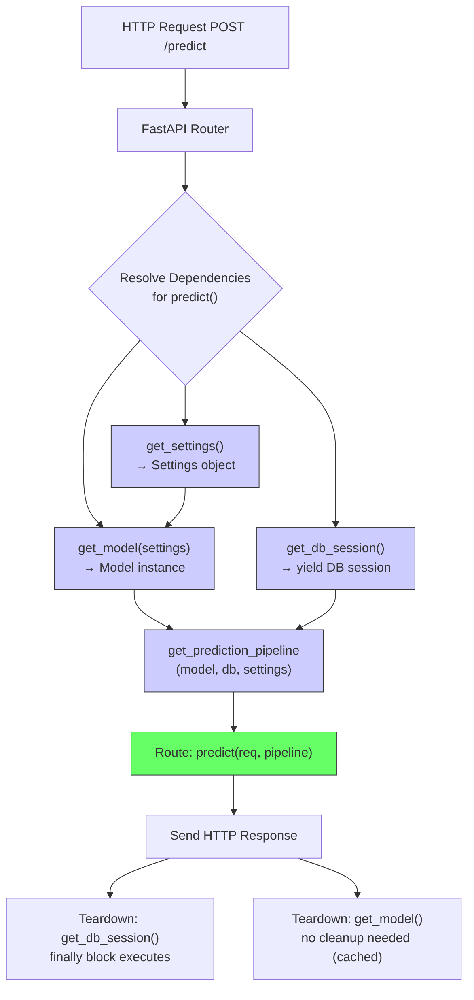
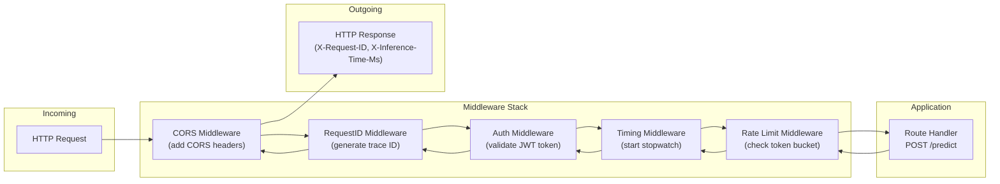
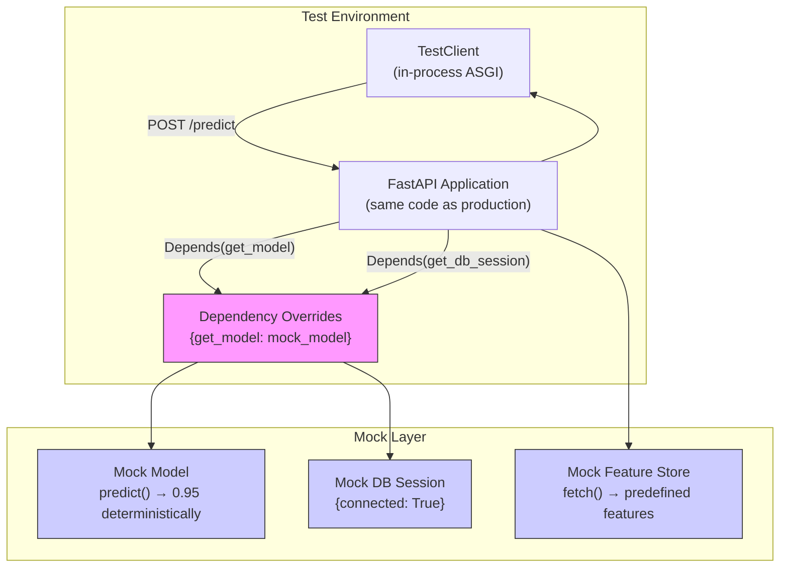
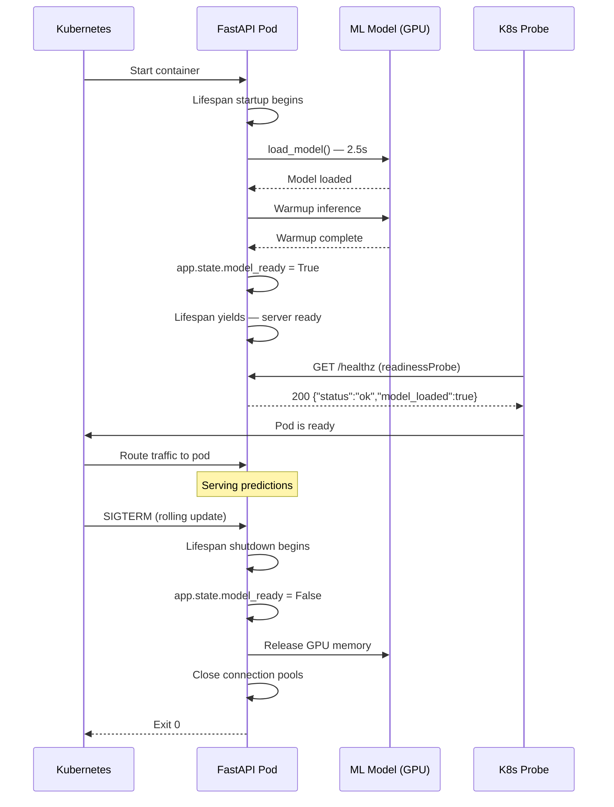

# 🔗 Dependency Injection, Middleware, and Testing

## 🎯 Learning Objectives

- Master FastAPI's `Depends` system for injecting model instances, database sessions, feature store clients, and configuration with proper cleanup via `yield`
- Build custom middleware for ML-specific concerns: inference latency tracking, request ID propagation, rate limiting, and GPU utilization monitoring
- Write comprehensive test suites using `TestClient`, dependency overrides, `pytest-asyncio`, and deterministic mocking of model predictions
- Implement production-ready lifespan handlers for model warm-up, graceful shutdown, health checks, and Kubernetes readiness/liveness probes

## Introduction

A FastAPI route function that creates a model instance, opens a database connection, fetches features, runs inference, and returns a result is impossible to test and disastrous to maintain. The function knows too much: where models live, how to connect to databases, which configuration values to use. Changing any of these concerns requires modifying the route — a violation of every principle of modular design. FastAPI's dependency injection system, inspired by frameworks like Angular and Spring but native to Python's type system, solves this by externalizing infrastructure concerns into reusable, composable, testable callables.

Dependencies form a directed acyclic graph. The route depends on a model instance, which depends on a configuration object, which depends on environment variables. FastAPI resolves this graph at request time, injecting each dependency into the next. Crucially, dependencies can `yield` — the setup code runs before the route, and the teardown code runs after the response is sent. This `yield` pattern replaces the error-prone `try/finally` blocks that litter framework-less Python services.

Middleware complements dependencies by intercepting every request before it reaches any route. While dependencies scope to specific endpoints, middleware applies globally. This separation of concerns — dependencies for per-endpoint logic, middleware for cross-cutting concerns — mirrors the architecture of production ML platforms at Stripe, Netflix, and Uber. Testing binds these systems together: FastAPI's `TestClient` propagates dependency overrides, making it trivial to swap a real model for a mock that returns deterministic predictions, or a real database for a SQLite in-memory store. This note covers the complete cycle: inject, intercept, test, and deploy with health checks — patterns that integrate directly with testing strategies in [[../../28 - Testing in ML Systems/00 - Testing in ML Systems|Testing in ML Systems]].

---

## Module 1: Dependency Injection System — Deep Dive

### 1.1 Theoretical Foundation 🧠

Dependency injection (DI) inverts the control of object creation. Instead of a function creating its dependencies (`model = load_model()` inside the route), the framework provides them. FastAPI implements DI through type annotations: a parameter declared as `model: Model = Depends(get_model)` causes FastAPI to call `get_model()` (or await it if async) and pass the result to the route. This is not runtime magic — it relies on Python's `inspect` module to read the function signature and resolve each `Depends` callable.

The DI system is hierarchical. A dependency can itself depend on other dependencies, forming a resolution tree. FastAPI caches dependency results within a single request by default (`use_cache=True`), so if three sub-dependencies all need the database session, only one is created. For ML services, this caching is critical: the model instance — a heavyweight object holding GPU memory — must be a singleton across all dependencies and routes in a single request, but not necessarily across requests (though the lifespan pattern typically creates one model instance per process).

The `yield` pattern converts a dependency into a context manager. Code before `yield` executes before the route. Code after `yield` executes after the response is sent — regardless of whether the route succeeded or raised an exception. FastAPI catches exceptions in the route's dependencies and invokes the teardown code, making `yield` the correct place for closing database connections, releasing semaphore slots, and flushing metric buffers. This pattern eliminates the need for explicit cleanup in every route, a common source of resource leaks in ML services.

### 1.2 Mental Model 📐

```
┌─── Dependency Resolution Graph ──────────────────────────┐
│                                                          │
│  Route: predict(model, db, features_client)              │
│              │       │         │                          │
│              ▼       ▼         ▼                          │
│  get_model()    get_db()   get_features_client()          │
│       │            │              │                       │
│       ▼            ▼              ▼                       │
│  get_config()   get_db_url()  get_http_client()           │
│       │            │              │                       │
│       ▼            ▼              ▼                       │
│  ┌─────────────────────────────────────────────────┐     │
│  │  Environment variables / Config files            │     │
│  │  (the leaves of the dependency tree)             │     │
│  └─────────────────────────────────────────────────┘     │
│                                                          │
│  Resolution order (post-order DFS):                      │
│  1. env vars → 2. config → 3. model → 4. route          │
│  Cached: get_config() called once, reused                │
└──────────────────────────────────────────────────────────┘
```

```
┌─── Yield Lifecycle (Context Manager Dependency) ─────────┐
│                                                          │
│  Request arrives                                         │
│       │                                                  │
│       ▼                                                  │
│  ┌─────────────────────────────────┐                     │
│  │ Code BEFORE yield:              │                     │
│  │ • Open DB connection            │                     │
│  │ • Acquire semaphore             │                     │
│  │ • Load model to GPU (if not     │                     │
│  │   already loaded via lifespan)  │                     │
│  └──────────────┬──────────────────┘                     │
│                 │                                        │
│                 ▼                                        │
│  ┌─────────────────────────────────┐                     │
│  │ Route handler executes          │                     │
│  │ (has the injected resources)    │                     │
│  └──────────────┬──────────────────┘                     │
│                 │                                        │
│                 ▼                                        │
│  ┌─────────────────────────────────┐                     │
│  │ Code AFTER yield:               │                     │
│  │ • Close DB connection           │                     │
│  │ • Release semaphore             │                     │
│  │ • Flush metrics buffer          │                     │
│  └─────────────────────────────────┘                     │
│                 │                                        │
│                 ▼                                        │
│  Response sent to client (before yield teardown!)        │
│                                                          │
│  ⚠️ Teardown runs AFTER response, so cleanup               │
│     exceptions cannot affect the HTTP status code         │
└──────────────────────────────────────────────────────────┘
```

### 1.3 Syntax and Semantics 📝

```python
import asyncio
from typing import AsyncGenerator, Generator

from fastapi import FastAPI, Depends, HTTPException
from pydantic import BaseModel

app = FastAPI()

# ─── LEAFLET DEPENDENCY: Configuration ───
# WHY: Isolate config from business logic. Environment-dependent values
# (model paths, feature store URLs, credentials) live here, not in routes.
class Settings:
    model_path: str = "/models/bert-sentiment-v2"
    feature_store_url: str = "https://features.internal"
    batch_size: int = 32

def get_settings() -> Settings:
    # In production: read from env vars, vault, or config server
    return Settings()

# ─── SINGLETON DEPENDENCY: Model Instance ───
# WHY: Loading a model to GPU is expensive (seconds to minutes).
# Cache it at the process level, not per-request. The lifespan pattern
# (Module 4) is even better, but this shows the DI approach.
_model_cache: dict[str, object] = {}

async def get_model(settings: Settings = Depends(get_settings)):
    """Return cached model or load from disk."""
    if settings.model_path not in _model_cache:
        # Simulate GPU model loading
        await asyncio.sleep(0.5)
        _model_cache[settings.model_path] = {"name": "bert-v2", "loaded": True}
    return _model_cache[settings.model_path]

# ─── YIELD DEPENDENCY: Database Session ───
# WHY: yield ensures cleanup regardless of whether the route succeeds.
# No try/finally needed in every route. This is the correct pattern
# for resources that must be acquired AND released per request.
async def get_db_session() -> AsyncGenerator[dict, None]:
    """Simulate a database session that must be closed."""
    session = {"id": id(asyncio.get_running_loop()), "connected": True}
    try:
        yield session  # route gets this value
    finally:
        session["connected"] = False  # cleanup runs after response
        # In production: await session.close()

# ─── COMPOUND DEPENDENCY: Prediction Pipeline ───
# WHY: Compose multiple dependencies into a single, ergonomic injection.
# Routes depend on this one object instead of three separate ones.
class PredictionPipeline:
    def __init__(self, model, db, settings):
        self.model = model
        self.db = db
        self.settings = settings

    async def predict(self, text: str) -> float:
        # In production: preprocess → model.forward → postprocess
        return 0.95

async def get_prediction_pipeline(
    model=Depends(get_model),
    db=Depends(get_db_session),
    settings=Depends(get_settings),
) -> PredictionPipeline:
    return PredictionPipeline(model, db, settings)

# ─── ROUTE USING ALL DEPENDENCIES ───
# WHY: The route signature documents what it needs. FastAPI resolves
# the entire dependency tree automatically. The route code is pure
# business logic — no infrastructure concerns.
class PredictRequest(BaseModel):
    text: str

@app.post("/predict")
async def predict(
    req: PredictRequest,
    pipeline: PredictionPipeline = Depends(get_prediction_pipeline),
):
    score = await pipeline.predict(req.text)
    return {"score": score, "model_path": pipeline.settings.model_path}

# ─── DEPENDENCY WITH PARAMETERS ───
# WHY: Sometimes dependencies need request-specific parameters.
# Use a callable factory that returns a Depends instance.
def get_model_by_name(model_name: str):
    """Factory: create a Depends that injects a specific model."""
    async def _get_model():
        return {"name": model_name}
    return Depends(_get_model)

@app.post("/predict/{model_name}")
async def predict_with_model(
    req: PredictRequest,
    model: dict = Depends(get_model_by_name),  # wrong: model_name not available yet
):
    pass  # Use path parameter in the dependency itself, see tip below
```

### 1.4 Visual Representation 🖼️



### 1.5 Application in ML/AI Systems 🤖

Airbnb's machine learning platform serves hundreds of models through a unified prediction API. Their dependency injection layer — inspired by FastAPI patterns — injects model artifacts from a centralized model registry. Each route declares `model: Model = Depends(get_model_by_experiment(experiment_id))`, and the DI system resolves the correct model version based on the experiment configuration. During A/B tests, two route variants receive different model versions, but the route code is identical — the DI layer handles the routing. This pattern enables them to run 50+ concurrent experiments without duplicating API code, a key enabler of their rapid ML iteration cycle.

### 1.6 Common Pitfalls ⚠️ + 💡 Tips

⚠️ **Pitfall**: Declaring a dependency with `use_cache=False` when it should be cached. Every sub-dependency call to `get_db_session()` creates a new database connection, exhausting the connection pool.

💡 **Tip**: Default `use_cache=True` (FastAPI's default) for stateless or singleton dependencies. Use `use_cache=False` only when the dependency must produce a fresh value per invocation (rare in ML services).

⚠️ **Pitfall**: Raising HTTPException inside a dependency's `yield` setup code. The teardown code still runs, but the exception handling is subtle — the dependency is marked as failed, and subsequent dependencies are skipped.

💡 **Tip**: Validate in dependencies, but raise exceptions that make sense. If the model file is missing, raise `HTTPException(503, "Model not available")` in `get_model()` — the route never executes, and a clear error reaches the client.

⚠️ **Pitfall**: Modifying the injected dependency in one route and expecting the change to persist for other routes. Dependencies are recreated per-request (or cached per-request).

💡 **Tip**: For mutable shared state (e.g., a request counter), use app-level state (`app.state`), a database, or Redis. Dependencies are for injection, not shared mutable state.

### 1.7 Knowledge Check ❓

1. FastAPI caches dependency results within a single request by default. If a route depends on `get_db()` and a sub-dependency also depends on `get_db()`, how many database connections are created?
2. In a `yield` dependency, code after `yield` runs after the response is sent. If that teardown code raises an exception, what happens to the client's response?
3. You need a dependency parameterized by a route's path parameter (e.g., `model_name`). How do you declare this dependency?

---

## Module 2: Middleware Stack for ML Services

### 2.1 Theoretical Foundation 🧠

Middleware wraps every request in pre- and post-processing logic, regardless of which route handles it. This is the correct layer for cross-cutting concerns: authentication, CORS, request ID generation and propagation, rate limiting, and observability (metrics, tracing, logging). FastAPI's middleware is Starlette's middleware — a class with `async def dispatch(self, request, call_next)` that receives the request, optionally modifies it, calls `await call_next(request)` to invoke the next middleware (or the route), and optionally modifies the response.

The middleware stack is ordered: the first middleware added is the outermost wrapper, the last is the innermost (closest to the route). This ordering matters. Authentication middleware should be outermost (block unauthenticated requests before they hit any other logic). Metrics middleware should be innermost so it captures only successful authentications but times the full route execution. For ML services, middleware provides an ideal injection point for inference-specific observability: capture the model's input distribution, track GPU inference latency per endpoint, and propagate trace IDs through the feature store, model server, and post-processing pipeline.

Custom middleware should be lightweight — every microsecond of middleware overhead multiplies by the request rate. Heavy operations (model inference, database queries) do not belong in middleware. Middleware is for interception, transformation, and observation, not business logic.

### 2.2 Mental Model 📐

```
┌─── Middleware Onion Model ───────────────────────────────┐
│                                                          │
│  Request ──────────────────────────────────────▶         │
│       │                                                  │
│  ┌────┴─────────────────────────────────────────────┐    │
│  │  CORS Middleware (adds headers, handles OPTIONS) │    │
│  │  ┌──────────────────────────────────────────┐    │    │
│  │  │  Auth Middleware (validates JWT/API key) │    │    │
│  │  │  ┌──────────────────────────────────┐    │    │    │
│  │  │  │  Request ID Middleware           │    │    │    │
│  │  │  │  ┌──────────────────────────┐    │    │    │
│  │  │  │  │  Timing Middleware       │    │    │    │
│  │  │  │  │  ┌──────────────────┐    │    │    │
│  │  │  │  │  │  Route Handler   │    │    │    │
│  │  │  │  │  └──────────────────┘    │    │    │
│  │  │  │  │  (capture latency)       │    │    │
│  │  │  │  └──────────────────────────┘    │    │
│  │  │  │  (add X-Request-ID header)       │    │
│  │  │  └──────────────────────────────────┘    │
│  │  │  (401 if token invalid)                 │    │
│  │  └──────────────────────────────────────────┘    │
│  │  (Access-Control-Allow-Origin: *)               │    │
│  └─────────────────────────────────────────────────┘    │
│       │                                                  │
│  ◀────────────────────────────────────── Response        │
└──────────────────────────────────────────────────────────┘
```

```
┌─── Middleware Execution Order ───────────────────────────┐
│                                                          │
│  app.add_middleware(OuterFirst)     ← added first        │
│  app.add_middleware(Middle)                              │
│  app.add_middleware(InnerLast)      ← added last         │
│                                                          │
│  Execution (Request flows inward, Response flows outward):│
│  OuterFirst.before → Middle.before → InnerLast.before     │
│  → Route Handler                                         │
│  → InnerLast.after → Middle.after → OuterFirst.after     │
│                                                          │
│  Think: a stack of decorators — last added runs closest   │
│  to the route, but its effects wrap the tightest.         │
└──────────────────────────────────────────────────────────┘
```

### 2.3 Syntax and Semantics 📝

```python
import time
import uuid
import json
from typing import Callable

from fastapi import FastAPI, Request, Response
from starlette.middleware.base import BaseHTTPMiddleware
from starlette.middleware.cors import CORSMiddleware
from starlette.types import ASGIApp, Receive, Scope, Send

app = FastAPI()

# ─── BUILT-IN: CORS Middleware ───
# WHY: ML APIs are often called from browsers (dashboards, internal tools).
# Without CORS headers, browser-based clients cannot make cross-origin requests.
app.add_middleware(
    CORSMiddleware,
    allow_origins=["https://dashboard.internal", "https://ml-playground.com"],
    allow_credentials=True,
    allow_methods=["GET", "POST"],
    allow_headers=["Authorization", "Content-Type", "X-Request-ID"],
)

# ─── CUSTOM: Request ID Middleware ───
# WHY: Trace a single prediction request across microservices
# (API gateway → feature store → model server → audit logger).
# The X-Request-ID header bridges logs from all services.
class RequestIDMiddleware(BaseHTTPMiddleware):
    async def dispatch(self, request: Request, call_next: Callable) -> Response:
        # Use client-provided ID or generate one
        request_id = request.headers.get("X-Request-ID", str(uuid.uuid4()))
        request.state.request_id = request_id  # available to route via request.state
        response = await call_next(request)
        response.headers["X-Request-ID"] = request_id
        return response

app.add_middleware(RequestIDMiddleware)

# ─── CUSTOM: Inference Timing Middleware ───
# WHY: Record per-endpoint inference latency for Prometheus metrics.
# Middleware captures timing without modifying every route.
class InferenceTimingMiddleware(BaseHTTPMiddleware):
    async def dispatch(self, request: Request, call_next: Callable) -> Response:
        start = time.perf_counter()
        response = await call_next(request)
        elapsed_ms = (time.perf_counter() - start) * 1000
        # Record metric: http_request_duration_ms{path="/predict", status=200}
        response.headers["X-Inference-Time-Ms"] = str(round(elapsed_ms, 2))
        # In production: prometheus_client.Histogram.observe(elapsed_ms)
        return response

app.add_middleware(InferenceTimingMiddleware)

# ─── CUSTOM: Rate Limiting Middleware (token bucket) ───
# WHY: Protect GPU resources from abuse. Per-client rate limiting
# at the middleware layer prevents a single user from monopolizing
# inference capacity.
import asyncio

class RateLimitMiddleware(BaseHTTPMiddleware):
    def __init__(self, app, max_requests: int = 100, window_sec: int = 60):
        super().__init__(app)
        self.max_requests = max_requests
        self.window_sec = window_sec
        self._buckets: dict[str, tuple[float, int]] = {}  # client_ip → (window_start, count)

    async def dispatch(self, request: Request, call_next: Callable) -> Response:
        client_ip = request.client.host if request.client else "unknown"
        now = time.monotonic()
        window_start, count = self._buckets.get(client_ip, (now, 0))

        # Reset window if expired
        if now - window_start > self.window_sec:
            window_start, count = now, 0

        if count >= self.max_requests:
            return Response(
                content=json.dumps({"detail": "Rate limit exceeded"}),
                status_code=429,
                media_type="application/json",
            )

        self._buckets[client_ip] = (window_start, count + 1)
        return await call_next(request)

app.add_middleware(RateLimitMiddleware, max_requests=100, window_sec=60)

# ─── CUSTOM: Pure ASGI Middleware (more performant) ───
# WHY: BaseHTTPMiddleware uses a slightly slower approach (it consumes
# and re-creates the response). For high-performance endpoints, use
# raw ASGI middleware that intercepts the send/receive channels.
class PureASGIMiddleware:
    def __init__(self, app: ASGIApp):
        self.app = app

    async def __call__(self, scope: Scope, receive: Receive, send: Send) -> None:
        if scope["type"] != "http":
            await self.app(scope, receive, send)
            return

        start = time.perf_counter()

        async def send_wrapper(message):
            if message["type"] == "http.response.start":
                elapsed = (time.perf_counter() - start) * 1000
                # Inject timing header at the ASGI protocol level
                headers = dict(message.get("headers", []))
                headers[b"x-response-time-ms"] = str(elapsed).encode()
                message["headers"] = list(headers.items())
            await send(message)

        await self.app(scope, receive, send_wrapper)

app.add_middleware(PureASGIMiddleware)
```

### 2.4 Visual Representation 🖼️



### 2.5 Application in ML/AI Systems 🤖

Roblox's ML platform serves millions of real-time predictions for content moderation, recommendation, and toxicity detection. Their FastAPI-based serving layer uses a multi-layered middleware stack: (1) an authentication middleware that validates API keys for internal services, (2) a request ID middleware that propagates trace IDs across their observability pipeline (Jaeger + Prometheus), (3) a custom inference metrics middleware that records per-model latency histograms and GPU utilization gauges, and (4) a rate limiting middleware that caps requests per game server to prevent a single popular game from overwhelming the recommendation models. This middleware composition allows individual teams to add monitoring without modifying the core inference routes — a key requirement for a platform serving 50+ teams.

### 2.6 Common Pitfalls ⚠️ + 💡 Tips

⚠️ **Pitfall**: Using `BaseHTTPMiddleware` for high-throughput endpoints. It reads the response body into memory, which adds latency and memory pressure. For >1000 RPS, this becomes a bottleneck.

💡 **Tip**: For performance-critical middleware, implement the raw ASGI interface (a callable taking `scope, receive, send`). This operates at the protocol level without buffering response bodies.

⚠️ **Pitfall**: Modifying the request body in middleware without re-wrapping it. The request body is a one-time stream; reading it consumes it, and the route receives an empty body.

💡 **Tip**: If you need to read the request body in middleware (e.g., for logging), store it in `request.state` and replace `request._receive` with a wrapper that replays the stored body.

⚠️ **Pitfall**: Adding middleware that performs synchronous I/O (database queries, file reads) inside `dispatch`. This blocks the event loop for ALL routes, not just the one being served.

💡 **Tip**: Middleware must be async and non-blocking. Any I/O inside middleware should use async libraries. Never call `time.sleep()` or sync DB queries in middleware.

### 2.7 Knowledge Check ❓

1. You add middleware A, then middleware B. Which one executes first on the request path? Which on the response path?
2. Your rate limiting middleware stores counters in an in-memory dictionary. What happens to rate limit state when you scale to 4 Uvicorn workers?
3. What is the performance difference between `BaseHTTPMiddleware` and a raw ASGI middleware, and when would you choose each?

---

## Module 3: Testing FastAPI ML Applications

### 3.1 Theoretical Foundation 🧠

Testing ML APIs presents a unique challenge: you must verify HTTP behavior (status codes, headers, response schemas) without executing expensive model inference on every test run. A test suite that loads a 2 GB BERT model and runs 200 test cases takes minutes to execute, breaking the fast feedback loop essential for TDD and CI/CD. FastAPI's design solves this through dependency overrides — the testing equivalent of dependency injection.

The `TestClient` (from Starlette) sends real HTTP requests to your FastAPI app but communicates over ASGI in-process (no network socket). This means tests run fast (no TCP overhead) and can access internal app state. Combined with `app.dependency_overrides`, you redirect `Depends(get_model)` to a test function that returns a lightweight mock. The route code remains identical to production — only the dependency wiring changes. This is the inversion of control at its most powerful: production code and test code share the same interfaces, and the framework swaps implementations.

For async testing, `pytest-asyncio` provides the `@pytest.mark.asyncio` decorator and `AsyncClient` (from httpx) for testing async endpoints directly. However, FastAPI's `TestClient` wraps async endpoints transparently, so most tests can remain synchronous. Use async tests only when testing WebSocket endpoints or complex async dependency chains. For broader ML testing strategies including model validation and data pipeline testing, see [[../../28 - Testing in ML Systems/00 - Testing in ML Systems|Testing in ML Systems]].

### 3.2 Mental Model 📐

```
┌─── Test Dependency Override ─────────────────────────────┐
│                                                          │
│  PRODUCTION:                                             │
│  Route → Depends(get_model) → load_bert_from_disk()      │
│                                                          │
│  TESTING:                                                │
│  Route → Depends(get_model) → mock_model (fixed output)  │
│                 │                                         │
│                 ▼                                         │
│  app.dependency_overrides[get_model] = get_mock_model    │
│                                                          │
│  Advantages:                                              │
│  • Route code unchanged                                  │
│  • Test runs in < 10 ms (no GPU load)                    │
│  • Mock returns deterministic values for assertions      │
│  • Can simulate errors (raise exceptions from mock)      │
└──────────────────────────────────────────────────────────┘
```

```
┌─── Test Pyramid for ML APIs ─────────────────────────────┐
│                                                          │
│        ╱  E2E Tests (1-2) ╲                              │
│       ╱   Docker Compose,    ╲                            │
│      ╱    real model, K8s     ╲                           │
│     ╱───────────────────────────╲                         │
│    ╱  Integration Tests (10-20)  ╲                       │
│   ╱   TestClient + real DB,       ╲                      │
│  ╱    mocked model, full pipeline  ╲                     │
│ ╱─────────────────────────────────────╲                   │
│╱  Unit Tests (50-200)                  ╲                 │
│╲  TestClient + all dependencies mocked ╱                │
│ ╲─────────────────────────────────────╱                 │
│                                                          │
│  Time: Unit: ms, Integration: s, E2E: min                │
└──────────────────────────────────────────────────────────┘
```

### 3.3 Syntax and Semantics 📝

```python
# test_ml_api.py — Complete test suite for FastAPI ML endpoints
import pytest
from fastapi.testclient import TestClient
from httpx import ASGITransport, AsyncClient

# Import the app and dependencies from the application module
# (Assume app, get_model, get_db_session are defined there)
from app.main import app, get_model, get_db_session, PredictRequest

# ─── FIXTURE: TestClient with dependency overrides ───
# WHY: The TestClient wraps the ASGI app for in-process HTTP testing.
# Each test gets a fresh client with its own dependency overrides.

@pytest.fixture
def client():
    """Return a TestClient with all heavy dependencies mocked."""
    # Override the model dependency — no GPU loading in tests
    async def mock_get_model():
        return {"name": "mock-model", "predict": lambda x: 0.95}

    # Override the DB dependency — no real database connection
    async def mock_get_db_session():
        yield {"connected": True}

    app.dependency_overrides[get_model] = mock_get_model
    app.dependency_overrides[get_db_session] = mock_get_db_session

    with TestClient(app) as client:
        yield client

    # Clean up overrides after test
    app.dependency_overrides.clear()

# ─── UNIT TEST: Successful prediction ───
# WHY: Verify the happy path — valid input returns valid output.
# The model is mocked, so we test routing, validation, serialization.
def test_predict_success(client: TestClient):
    response = client.post("/predict", json={"text": "Hello world"})
    assert response.status_code == 200
    data = response.json()
    assert "score" in data
    assert isinstance(data["score"], float)
    assert 0.0 <= data["score"] <= 1.0

# ─── UNIT TEST: Validation error ───
# WHY: Verify Pydantic rejects invalid input before reaching the route.
# 422 is FastAPI's standard response for schema violations.
def test_predict_invalid_input(client: TestClient):
    response = client.post("/predict", json={"wrong_field": "value"})
    assert response.status_code == 422
    data = response.json()
    assert "detail" in data
    # Confirm the error points to the missing field
    assert any("text" in str(err["loc"]) for err in data["detail"])

# ─── UNIT TEST: Model error propagation ───
# WHY: Models can fail (GPU OOM, corrupted weights, timeout).
# The API should map model errors to appropriate HTTP status codes.
def test_predict_model_error(client: TestClient):
    async def failing_model():
        raise RuntimeError("GPU out of memory")

    app.dependency_overrides[get_model] = failing_model

    response = client.post("/predict", json={"text": "test"})
    assert response.status_code == 500
    # In production, you'd map specific exceptions → status codes
    # (RuntimeError → 503, ValueError → 400, etc.)

# ─── INTEGRATION TEST: Full dependency chain ───
# WHY: Test multiple dependencies interacting together, but still
# with lightweight mocks. Verifies the DI resolution works correctly.
def test_prediction_pipeline_integration(client: TestClient):
    response = client.post("/predict", json={"text": "integration test"})
    assert response.status_code == 200
    data = response.json()
    assert "model_path" in data  # injected from Settings dependency
    assert data["model_path"] == "/models/bert-sentiment-v2"

# ─── ASYNC TEST: WebSocket test ───
# WHY: WebSocket tests require async context. Use httpx.AsyncClient
# with ASGITransport to test WebSocket endpoints directly.
@pytest.mark.asyncio
async def test_websocket_translate():
    async with AsyncClient(
        transport=ASGITransport(app=app), base_url="http://test"
    ) as client:
        async with client.websocket_connect("/ws/translate") as ws:
            await ws.send_text("Hello world")
            data = await ws.receive_json()
            assert "token" in data
            assert data["original"] == "Hello world"

# ─── PARAMETERIZED TEST: Batch size validation ───
# WHY: Test edge cases without duplicating test code.
# Parameterize over inputs and expected outputs.
@pytest.mark.parametrize("batch_size,expected_status", [
    (1, 200),      # minimum valid batch
    (100, 200),    # typical batch
    (500, 200),    # maximum batch
    (0, 422),      # below minimum → validation error
    (501, 422),    # above maximum → validation error
])
def test_predict_batch_size(client: TestClient, batch_size, expected_status):
    texts = ["test"] * batch_size
    response = client.post("/predict/batch", json={"texts": texts})
    assert response.status_code == expected_status

# ─── FIXTURE: TestClient factory for per-test configuration ───
# WHY: Different tests need different mock behaviors.
# A factory fixture gives each test maximum flexibility.
@pytest.fixture
def make_client():
    """Factory fixture: returns a function that creates configured clients."""
    def _make_client(model_override=None, db_override=None):
        if model_override:
            app.dependency_overrides[get_model] = model_override
        if db_override:
            app.dependency_overrides[get_db_session] = db_override
        client = TestClient(app)
        yield client
        app.dependency_overrides.clear()
    return _make_client
```

### 3.4 Visual Representation 🖼️



### 3.5 Application in ML/AI Systems 🤖

HuggingFace's inference API testing pipeline uses FastAPI's dependency overrides extensively. For every model hosted on their platform (thousands of models), they run API contract tests that verify the endpoint returns correctly shaped JSON for valid inputs and 422 errors for invalid inputs. These tests never load actual models — the model dependency is overridden with a lightweight mock that returns fixed tensors of the correct shape. The test suite validates Pydantic schemas, dependency wiring, and middleware behavior in < 1 second per model, versus 30+ seconds if real models were loaded. This fast feedback loop enables them to deploy multiple times per day while maintaining API stability across thousands of model variants.

### 3.6 Common Pitfalls ⚠️ + 💡 Tips

⚠️ **Pitfall**: Forgetting to clear `app.dependency_overrides` between tests. A test's override leaks into the next test, causing confusing failures.

💡 **Tip**: Always use `app.dependency_overrides.clear()` in fixture teardown or use `with TestClient(app) as client:` which isolates state. Better yet, use a fixture that clears overrides in its teardown.

⚠️ **Pitfall**: Testing the mock, not the API. If your mock returns `{"score": 0.95}` and your assertion checks for `0.95`, you're testing the mock's behavior, not the route's logic.

💡 **Tip**: Mocks should exercise the route's logic. Return varied values from mocks and assert the route transforms them correctly. For example, if the route applies a threshold, mock returns values above and below it and assert the threshold is applied.

⚠️ **Pitfall**: Using `TestClient` for performance testing. `TestClient` runs synchronously and doesn't simulate concurrent load.

💡 **Tip**: For performance testing, use `httpx.AsyncClient` against a running uvicorn instance, or dedicated tools like `locust` and `wrk`. `TestClient` is for functional correctness, not throughput measurement.

### 3.7 Knowledge Check ❓

1. You set `app.dependency_overrides[get_model] = mock_func` in test A. Test B doesn't override `get_model`. What does `get_model` return in test B?
2. Why does the `TestClient` not need a running server to test WebSocket endpoints?
3. Your mock model returns `0.95` for every input. How can you test that the route's threshold logic (e.g., `score > 0.5 → "positive"`) works correctly?

---

## Module 4: Lifespan, Startup Events, and Health Checks

### 4.1 Theoretical Foundation 🧠

Production ML services have a lifecycle distinct from traditional web services. A model takes seconds to minutes to load from disk and warm up on GPU. Database connection pools must be established. Feature store clients must authenticate. These operations should complete before the server accepts traffic — otherwise, the first few requests fail or time out. Conversely, during shutdown, GPU memory must be released, in-flight predictions must complete, and metric buffers must be flushed. FastAPI's lifespan context manager formalizes this lifecycle into a single `@asynccontextmanager`-decorated function.

The lifespan runs once per worker process. Code before `yield` executes during startup, after the ASGI server starts listening but before it routes requests (depending on the server implementation; Uvicorn guarantees this when using the lifespan). Code after `yield` executes during graceful shutdown, after the server stops accepting new connections but before the process exits. This is the correct place for model loading/unloading, connection pool creation/teardown, and GPU memory management.

Health checks complement the lifespan by exposing the application's current state to orchestrators. Kubernetes uses `livenessProbe` (should the container be restarted?) and `readinessProbe` (should the container receive traffic?). A FastAPI `/healthz` endpoint that checks model load status, database connectivity, and GPU availability enables Kubernetes to make correct scheduling decisions. A service that reports "ready" before the model is loaded will receive traffic and return 500 errors until the model finishes loading — defeating the purpose of the lifespan pattern. For deployment patterns, see [[05 - Production Deployment and Performance|Production Deployment]].

### 4.2 Mental Model 📐

```
┌─── Application Lifecycle ────────────────────────────────┐
│                                                          │
│  Process Start                                           │
│       │                                                  │
│       ▼                                                  │
│  ┌──────────────────────────────────────┐                │
│  │  Lifespan Startup (before yield):    │                │
│  │  • Load environment variables        │                │
│  │  • Read config files                 │                │
│  │  • Initialize connection pools       │                │
│  │  • Load model to GPU (2.3s)          │                │
│  │  • Warm model (dummy inference × 1)  │                │
│  │  • Set app.state.model_ready = True  │                │
│  └──────────────┬───────────────────────┘                │
│                 │                                         │
│                 ▼                                         │
│  ┌──────────────────────────────────────┐                │
│  │  Server Accepting Requests           │                │
│  │  /healthz → {"status":"ok"}          │                │
│  │  /predict → model.predict()          │                │
│  │  ...                                 │                │
│  └──────────────┬───────────────────────┘                │
│                 │ (SIGTERM received)                      │
│                 ▼                                         │
│  ┌──────────────────────────────────────┐                │
│  │  Lifespan Shutdown (after yield):    │                │
│  │  • Stop accepting new connections    │                │
│  │  • Drain in-flight predictions       │                │
│  │  • Release GPU memory                │                │
│  │  • Close connection pools            │                │
│  │  • Flush metric buffers              │                │
│  └──────────────────────────────────────┘                │
│       │                                                  │
│       ▼                                                  │
│  Process Exit (0)                                        │
└──────────────────────────────────────────────────────────┘
```

```
┌─── K8s Probe Timing ────────────────────────────────────┐
│                                                          │
│  Pod Start                                               │
│  │                                                       │
│  ├── t=0: Container starts, model loading begins         │
│  │                                                       │
│  ├── t=0.5s: readinessProbe begins polling /healthz      │
│  │   (initialDelaySeconds: 0, periodSeconds: 5)          │
│  │                                                       │
│  ├── t=2.5s: Model finishes loading                      │
│  │   app.state.model_ready = True                        │
│  │                                                       │
│  ├── t=5.0s: readinessProbe returns 200                  │
│  │   → Pod added to Service endpoints                    │
│  │                                                       │
│  ├── t=10s: livenessProbe begins polling /healthz        │
│  │   (initialDelaySeconds: 10, periodSeconds: 15)        │
│  │                                                       │
│  └── Running: both probes pass, pod serves traffic       │
└──────────────────────────────────────────────────────────┘
```

### 4.3 Syntax and Semantics 📝

```python
import asyncio
import time
from contextlib import asynccontextmanager
from typing import AsyncGenerator, Any

import httpx
from fastapi import FastAPI, HTTPException
from pydantic import BaseModel

# ─── LIFESPAN: Model loading and teardown ───
# WHY: Single entry point for startup/shutdown. The lifespan runs once per
# worker process. All heavy initialization goes here — NOT in route handlers
# or dependency functions that run per-request.

@asynccontextmanager
async def lifespan(app: FastAPI) -> AsyncGenerator[None, None]:
    # ═══ STARTUP ═══
    print("[STARTUP] Loading model...")
    start = time.perf_counter()

    # Load model (synchronous, but lifespan can await async operations)
    app.state.model = load_ml_model()
    app.state.model_ready = False  # not ready until warmup complete

    # Warmup: run a dummy inference to allocate GPU memory and compile CUDA kernels
    await asyncio.get_running_loop().run_in_executor(
        None, app.state.model.predict_warmup, ["warmup text"]
    )

    # Initialize HTTP client connection pool (shared across all requests)
    app.state.http_client = httpx.AsyncClient(
        limits=httpx.Limits(max_keepalive_connections=20, max_connections=100),
        timeout=httpx.Timeout(connect=5.0, read=10.0),
    )

    app.state.model_ready = True
    elapsed = time.perf_counter() - start
    print(f"[STARTUP] Model ready in {elapsed:.2f}s")

    yield  # ← Application runs here

    # ═══ SHUTDOWN ═══
    print("[SHUTDOWN] Draining connections...")
    app.state.model_ready = False  # stop accepting work

    # Close HTTP client pool
    await app.state.http_client.aclose()

    # Release GPU memory
    del app.state.model
    print("[SHUTDOWN] Cleanup complete")


app = FastAPI(lifespan=lifespan)

# ─── HEALTH CHECK: K8s readiness probe ───
# WHY: Kubernetes uses this endpoint to decide if the pod should receive
# traffic. Return 200 only when the model is fully loaded and warmed.
class HealthResponse(BaseModel):
    status: str
    model_loaded: bool
    uptime_seconds: float

start_time = time.time()

@app.get("/healthz", response_model=HealthResponse)
async def health_check():
    model_ready = getattr(app.state, "model_ready", False)
    if not model_ready:
        raise HTTPException(
            status_code=503,
            detail="Model not ready",
            headers={"Retry-After": "5"},
        )
    return HealthResponse(
        status="ok",
        model_loaded=True,
        uptime_seconds=time.time() - start_time,
    )

# ─── READINESS CHECK: Deep health probe ───
# WHY: Check not just that the app is alive, but that its dependencies
# (database, feature store, GPU) are reachable and functional.
@app.get("/readyz")
async def readiness_check():
    checks = {}

    # Check model
    checks["model"] = getattr(app.state, "model_ready", False)

    # Check feature store connectivity
    try:
        client = app.state.http_client
        resp = await client.get("https://features.internal/health")
        checks["feature_store"] = resp.status_code == 200
    except Exception:
        checks["feature_store"] = False

    # Check GPU (simplified — in production, run a tiny inference)
    try:
        if app.state.model_ready:
            await asyncio.get_running_loop().run_in_executor(
                None, app.state.model.predict_warmup, ["health check"]
            )
            checks["gpu"] = True
    except Exception:
        checks["gpu"] = False

    all_healthy = all(checks.values())
    return {
        "status": "ok" if all_healthy else "degraded",
        "checks": checks,
    }, (200 if all_healthy else 503)

# ─── LIFESPAN WITH MULTIPLE MODELS ───
# WHY: Multi-model serving (e.g., A/B testing) loads several models at
# startup. Each model loading is independent and can run concurrently.
async def load_model_async(name: str, path: str):
    await asyncio.sleep(0.5)  # simulate disk I/O
    return {"name": name, "path": path}

@asynccontextmanager
async def multi_model_lifespan(app: FastAPI):
    # Concurrent model loading with asyncio.gather
    models = await asyncio.gather(
        load_model_async("sentiment", "/models/sentiment-v2"),
        load_model_async("toxicity", "/models/toxicity-v1"),
        load_model_async("language", "/models/language-v3"),
    )
    app.state.models = {m["name"]: m for m in models}
    yield
    app.state.models.clear()


# Stub model for the example
def load_ml_model():
    class StubModel:
        def predict_warmup(self, texts):
            pass  # GPU warmup inference
    return StubModel()
```

### 4.4 Visual Representation 🖼️



### 4.5 Application in ML/AI Systems 🤖

Spotify's ML serving infrastructure uses FastAPI lifespan handlers to coordinate model loading across hundreds of recommendation models. During a rolling deployment, each pod loads 3–5 models concurrently via `asyncio.gather()`, reducing total startup time from 15 seconds (sequential) to 5 seconds (concurrent). Their readiness probe checks not only that the model is loaded, but also that the feature store is reachable and the model produces valid-shape outputs. This deep health check has prevented multiple production incidents where models loaded successfully but produced NaN outputs due to corrupted weights — the readiness probe detected the invalid outputs and Kubernetes routed traffic to healthy pods.

### 4.6 Common Pitfalls ⚠️ + 💡 Tips

⚠️ **Pitfall**: Running heavy initialization in a synchronous `def lifespan()` or on the main thread without `run_in_executor`. This blocks the event loop during startup.

💡 **Tip**: Use `async def lifespan()` and `await` all I/O operations. For CPU-heavy model loading, use `await loop.run_in_executor(None, load_model)` to keep the event loop responsive.

⚠️ **Pitfall**: Health check endpoint always returns 200 regardless of model state. Kubernetes routes traffic to a pod that can't serve predictions.

💡 **Tip**: Track `app.state.model_ready = False` during startup and return 503 until the model is loaded and warmed. Set `initialDelaySeconds` in the readiness probe to account for model loading time.

⚠️ **Pitfall**: Not handling exceptions in lifespan startup. If model loading fails, the exception crashes the worker, and Uvicorn/Gunicorn restarts it — creating a crash loop.

💡 **Tip**: Wrap startup in try/except with logging. If the model fails to load, log the error and either exit with a meaningful message or enter a degraded mode where the health check reports the failure.

### 4.7 Knowledge Check ❓

1. A Kubernetes readiness probe calls `/healthz`. Your model takes 5 seconds to load. What does the probe return during those 5 seconds?
2. Why should you use `asyncio.gather()` to load multiple models in the lifespan instead of sequential `await`?
3. Your lifespan startup code raises an unhandled exception during model loading. What happens to the FastAPI process?

---

## 📦 Compression Code

```python
"""
fastapi_ml_production.py — Production FastAPI app with DI, middleware,
testing infrastructure, and K8s-ready health checks.
"""
import asyncio
import time
import uuid
from contextlib import asynccontextmanager
from typing import AsyncGenerator, Callable

import httpx
from fastapi import FastAPI, Depends, Request, HTTPException
from fastapi.testclient import TestClient
from pydantic import BaseModel, Field
from starlette.middleware.base import BaseHTTPMiddleware

# ═══ LIFESPAN ═══
@asynccontextmanager
async def lifespan(app: FastAPI) -> AsyncGenerator[None, None]:
    app.state.model_ready = False
    app.state.http_client = httpx.AsyncClient(
        limits=httpx.Limits(max_keepalive_connections=50, max_connections=200),
        timeout=httpx.Timeout(connect=5.0, read=30.0),
    )
    app.state.model = {"name": "bert-v2", "predict": lambda x: 0.95}
    app.state.model_ready = True
    yield
    app.state.model_ready = False
    await app.state.http_client.aclose()

app = FastAPI(lifespan=lifespan)

# ═══ MIDDLEWARE ═══
class RequestIDMiddleware(BaseHTTPMiddleware):
    async def dispatch(self, request: Request, call_next: Callable):
        request.state.request_id = request.headers.get("X-Request-ID", str(uuid.uuid4()))
        response = await call_next(request)
        response.headers["X-Request-ID"] = request.state.request_id
        return response

class TimingMiddleware(BaseHTTPMiddleware):
    async def dispatch(self, request: Request, call_next: Callable):
        start = time.perf_counter()
        response = await call_next(request)
        response.headers["X-Response-Time-Ms"] = str(round((time.perf_counter() - start) * 1000, 2))
        return response

app.add_middleware(RequestIDMiddleware)
app.add_middleware(TimingMiddleware)

# ═══ DEPENDENCIES ═══
def get_model():
    return app.state.model

def get_client():
    return app.state.http_client

# ═══ SCHEMAS ═══
class PredictRequest(BaseModel):
    text: str = Field(..., min_length=1, max_length=4096)

class PredictResponse(BaseModel):
    score: float
    model: str

# ═══ ROUTES ═══
@app.post("/predict", response_model=PredictResponse)
async def predict(req: PredictRequest, model=Depends(get_model)):
    score = model["predict"](req.text)
    return PredictResponse(score=score, model=model["name"])

@app.get("/healthz")
async def health():
    ready = getattr(app.state, "model_ready", False)
    if not ready:
        raise HTTPException(503, "Model not ready", headers={"Retry-After": "5"})
    return {"status": "ok"}

# ═══ TESTING ═══
# Run with: pytest --asyncio-mode=auto test_module.py
def test_predict():
    app.dependency_overrides[get_model] = lambda: {"name": "mock", "predict": lambda x: 0.95}
    with TestClient(app) as client:
        resp = client.post("/predict", json={"text": "test"})
        assert resp.status_code == 200
        assert resp.json()["score"] == 0.95

def test_health():
    app.state.model_ready = True
    with TestClient(app) as client:
        resp = client.get("/healthz")
        assert resp.status_code == 200
```

## 🎯 Documented Project

### Description

Build a production-ready FastAPI ML application with proper dependency injection (model, DB session, feature store client), a middleware stack (request ID, timing, rate limiting), comprehensive test suite with dependency overrides, and Kubernetes-ready health/readiness probes integrated with the application lifespan.

### Functional Requirements

1. Dependency injection for model, database session, feature store client, and settings — all with `yield` cleanup.
2. Middleware stack: CORS, request ID propagation, per-endpoint timing, token-bucket rate limiting.
3. Test suite with `TestClient`, dependency overrides for all heavy services, and parameterized edge case tests.
4. Lifespan context manager loading models and connection pools at startup, releasing at shutdown.
5. `/healthz` readiness probe returning 503 until model loads; `/readyz` deep probe checking feature store and GPU.
6. `app.state` used for request-scoped shared data (request ID, model reference).

### Main Components

- `lifespan()` — `@asynccontextmanager` for startup/shutdown orchestration
- `get_model()`, `get_db_session()`, `get_settings()` — composable `Depends`
- `RequestIDMiddleware`, `TimingMiddleware`, `RateLimitMiddleware` — Starlette middleware classes
- `test_predict_success`, `test_predict_invalid`, `test_websocket` — pytest test functions
- `app.dependency_overrides` — test-time injection swap

### Success Metrics

- Dependency resolution adds < 0.5 ms overhead per request
- Middleware pipeline processes request in < 1 ms total (all middleware combined)
- Test suite runs 50+ tests in < 2 seconds (no model loading)
- Readiness probe returns 200 within 5 seconds of container start
- Graceful shutdown drains all in-flight requests within configured `graceful_timeout`

## 🎯 Key Takeaways

1. **Dependency injection externalizes infrastructure from routes** — routes declare what they need, FastAPI provides it. This makes routes testable by swapping implementations.
2. **`yield` in dependencies guarantees cleanup** — database sessions close, semaphores release, and metrics flush even when the route raises an exception.
3. **Middleware is for cross-cutting concerns, not business logic** — authentication, tracing, timing, and rate limiting belong in middleware that wraps every route uniformly.
4. **`app.dependency_overrides` is the testing superpower** — swap a 2 GB model for a mock returning fixed values, and your test suite runs in milliseconds.
5. **Lifespan handlers coordinate startup and shutdown** — load models before accepting traffic, drain in-flight requests before releasing GPU memory.
6. **Health checks must reflect actual readiness** — return 503 until the model is loaded and warmed. Kubernetes uses this to avoid routing to unready pods.
7. **Order matters in middleware and dependencies** — middleware executes outermost-first for requests, innermost-first for responses. Dependencies resolve bottom-up in the dependency graph.

## References

- [FastAPI Dependencies Documentation](https://fastapi.tiangolo.com/tutorial/dependencies/)
- [FastAPI Middleware Documentation](https://fastapi.tiangolo.com/tutorial/middleware/)
- [FastAPI Testing Documentation](https://fastapi.tiangolo.com/tutorial/testing/)
- [Starlette Middleware](https://www.starlette.io/middleware/)
- [FastAPI Lifespan Events](https://fastapi.tiangolo.com/advanced/events/)
- [Kubernetes Pod Lifecycle and Probes](https://kubernetes.io/docs/concepts/workloads/pods/pod-lifecycle/)
- [pytest-asyncio Documentation](https://pytest-asyncio.readthedocs.io/)
