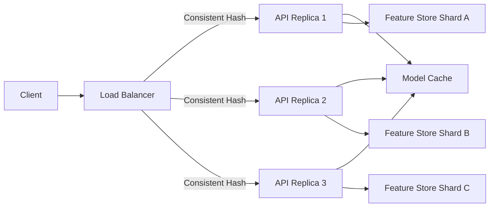
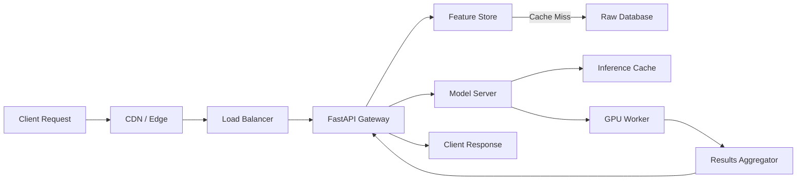

# 🏗️ System Design for ML

## Introduction

Machine learning systems are not just models; they are distributed applications that must survive traffic spikes, hardware failures, and data skew. A beautifully trained transformer is worthless if the serving layer crashes under Black Friday load or if cache eviction turns a 50 ms prediction into a 5-second timeout.

System design for ML bridges the gap between algorithmic research and production reliability. It asks: How do we shard a feature store that holds billions of rows? How do we route requests so that a model deployment does not drop in-flight predictions? How do we balance latency against cost when serving real-time recommendations?

This course applies classic distributed systems theory—CAP theorem, load balancing, caching—to the specific constraints of ML workloads, where latency budgets are tight, payloads are large, and consistency requirements vary wildly across use cases.

## 1. CAP Theorem Applied to ML Systems

The CAP theorem states that a distributed data store can guarantee at most two of Consistency, Availability, and Partition Tolerance. In ML systems, this trade-off manifests in concrete architectural decisions:

- **Consistency**: Every node sees the same feature values at the same time. Critical for fraud detection where a stale feature vector might approve a blocked transaction.
- **Availability**: The system responds to every request, even if some replicas are stale. Essential for recommendation feeds where a slightly outdated model is better than a blank screen.
- **Partition Tolerance**: The system continues operating despite network failures between nodes. Non-negotiable in multi-region cloud deployments.

Real case: Uber's Michelangelo platform partitions its feature store by use case. Real-time fraud features prioritize consistency (CP), while ETA prediction features prioritize availability (AP) because a slightly old traffic estimate still provides value.

⚠️ **Warning:** Do not assume your ML system needs strong consistency everywhere. Re-ranking candidates from a stale cache is usually harmless; charging a credit card from a stale balance is not. Misidentifying the CAP profile of each component leads to over-engineering and runaway costs.

💡 **Tip:** Mnemonic: **C**ash registers need **C**onsistency; **R**ecommendation feeds need **A**vailability.

## 2. Caching Strategies and CDNs

ML inference is expensive. Caching cuts redundant computation by storing results for identical or similar inputs.

| Strategy | Best For | ML Example | Drawback |
|---|---|---|---|
| LRU Cache | Repeated exact queries | Embedding lookup for top-K search | Memory bound; cold start |
| TTL Cache | Slowly changing outputs | Daily pricing predictions | Stale data window |
| Approximate Nearest Neighbor | Similar inputs | Vector search in recommendation | Slight accuracy loss |
| CDN Edge Caching | Static model artifacts | ONNX binary distribution | Invalidation complexity |

Content Delivery Networks (CDNs) are not just for web pages. Serving large model binaries from edge locations reduces download time for mobile devices and remote data centers. Versioned URLs (`/models/v3.1.0/resnet.onnx`) let you cache aggressively while preserving rollback capability.

## 3. Load Balancing and Database Sharding

Load balancers distribute incoming prediction requests across model replicas. The algorithm choice directly impacts latency and cache hit rates:

- **Round-robin**: Simple, fair distribution. Poor when replicas have heterogeneous hardware or model variants.
- **Least-connections**: Routes to the replica with the fewest active requests. Better for variable inference times.
- **Consistent hashing**: Maps each user/request to a specific replica based on a hash of the key. Maximizes cache locality because similar requests hit the same node.

For feature stores and log databases, sharding splits data across nodes. Shard keys should be chosen to colocate related data. In an ML context, sharding by `user_id` ensures that all features for a single user reside on one shard, reducing cross-node joins during inference.



## 4. ML Serving Architecture and Latency Budgets

A real-time inference pipeline is a chain of dependencies. The total latency is the sum of every hop:

| Stage | Typical Budget | Optimization |
|---|---|---|
| TLS Handshake | 5–10 ms | TLS session reuse, edge termination |
| Load Balancer | 1–3 ms | Hardware LB, HTTP/2 multiplexing |
| API Gateway | 3–5 ms | Minimal middleware, async I/O |
| Feature Retrieval | 10–30 ms | Redis/Memcached, batch lookups |
| Model Inference | 20–100 ms | GPU batching, ONNX Runtime, quantization |
| Post-processing | 2–5 ms | Vectorized NumPy ops |
| Response Serialization | 1–2 ms | Protobuf or orjson instead of standard JSON |
| **Total** | **42–155 ms** | Monitor each stage independently |



Availability is governed by mean time between failures (MTBF) and mean time to recovery (MTTR):

$$
\text{Availability} = \frac{\text{MTBF}}{\text{MTBF} + \text{MTTR}}
$$

Real case: Uber's Michelangelo achieves high availability by deploying model ensembles across multiple availability zones. If the primary model shard fails, the load balancer fails over to a secondary shard within seconds, accepting slightly degraded predictions rather than dropping requests.

⚠️ **Warning:** Do not ignore the "long tail." A P99 latency of 200 ms looks excellent on paper, but if 1% of your users experience 2-second delays during peak load, churn will spike. Monitor histograms, not averages.

## 5. Scaling Patterns

Horizontal scaling (adding replicas) is preferred for stateless model servers. Vertical scaling (bigger GPUs) suits large single-model inference that cannot be partitioned easily. Auto-scaling groups should trigger on GPU utilization or request queue depth, not just CPU, because ML workloads are often GPU-bound.


---

## 📦 Compression Code

```python
"""
Latency Budget Tracker
Decorates ML serving functions to enforce per-stage SLAs.
"""
import time
import functools
from typing import Callable

class LatencyBudget:
    def __init__(self, stages: dict[str, float]):
        self.budgets = stages
        self.actuals = {}

    def track(self, name: str):
        def decorator(func: Callable):
            @functools.wraps(func)
            def wrapper(*args, **kwargs):
                start = time.perf_counter()
                result = func(*args, **kwargs)
                elapsed = (time.perf_counter() - start) * 1000
                self.actuals[name] = elapsed
                if elapsed > self.budgets.get(name, float('inf')):
                    print(f"⚠️ SLA breach: {name} took {elapsed:.1f}ms")
                return result
            return wrapper
        return decorator

# Usage
budget = LatencyBudget({"features": 30, "inference": 100, "post": 5})

@budget.track("features")
def fetch_features(user_id: str):
    time.sleep(0.02)
    return {"f1": 1.0}

@budget.track("inference")
def predict(features: dict):
    time.sleep(0.05)
    return 0.95
```

## 🎯 Documented Project

### Description

Design and prototype a horizontally scalable real-time recommendation system. The architecture must survive zone failures, enforce per-stage latency budgets, and serve personalized rankings with sub-100 ms P99 latency.

### Functional Requirements

1. Route user requests through a load balancer using consistent hashing keyed by `user_id`.
2. Retrieve user features from a sharded Redis cluster with a 20 ms SLA.
3. Execute model inference on GPU workers with automatic batching and a 60 ms SLA.
4. Fallback to a cached "popular items" response if any stage exceeds its budget.
5. Emit structured latency metrics to Prometheus for every request stage.

### Main Components

- Consistent-hashing load balancer (Envoy or NGINX)
- FastAPI gateway with async Redis client
- GPU model server (Triton or custom ONNX Runtime)
- Multi-zone failover with health-checked replicas
- Prometheus + Grafana observability stack

### Success Metrics

- P99 end-to-end latency < 100 ms at 10,000 RPM
- 99.99% availability over a 30-day window
- Cache hit rate ≥ 80% for feature lookups
- Zero unhandled outages during single-zone failure simulation

### References

- [Designing Data-Intensive Applications](https://dataintensive.net/) by Martin Kleppmann
- Uber Engineering: "Meet Michelangelo"
- [AWS Well-Architected: Reliability Pillar](https://docs.aws.amazon.com/wellarchitected/latest/reliability-pillar/welcome.html)
